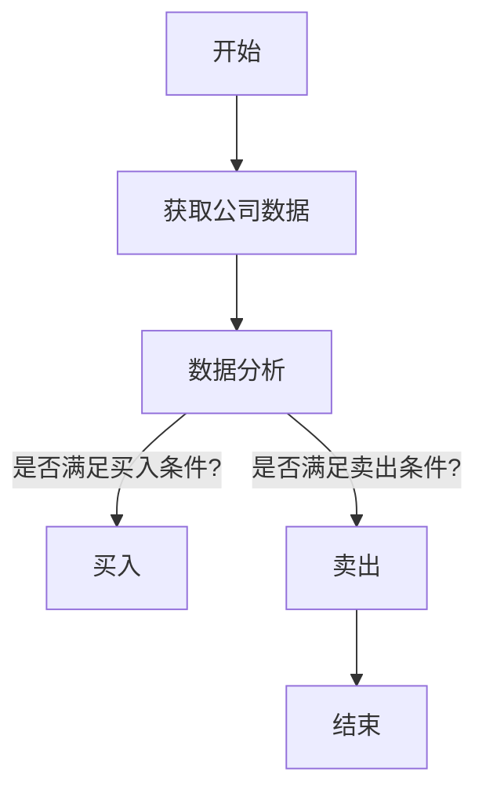
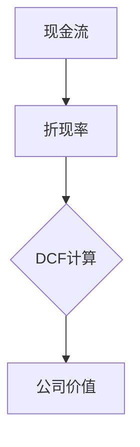
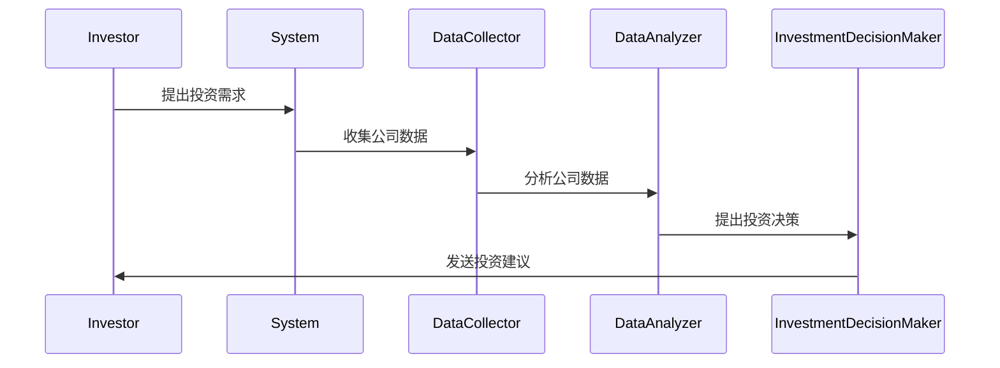
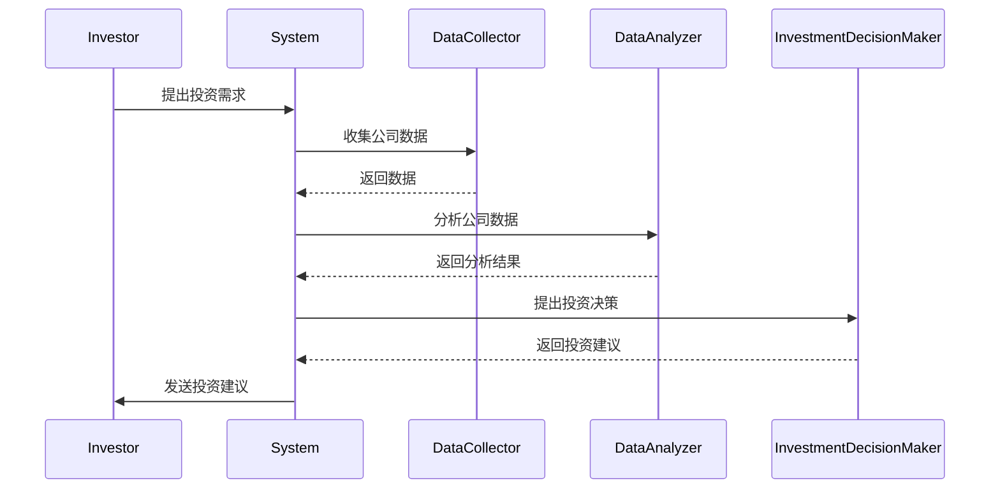

                 

# 罗伯特·哈格斯特罗姆的专注型价值投资：深入了解少数公司

## 关键词
- 专注型价值投资
- 投资策略
- 公司研究
- 长期投资
- 数学模型

## 摘要
本文将深入探讨罗伯特·哈格斯特罗姆的专注型价值投资理念，通过对核心概念、算法原理、数学模型、系统架构以及实战案例的详细解析，帮助读者理解如何通过深入研究少数优质公司实现长期稳定的投资回报。

----------------------------------------------------------------

### 第一部分：专注型价值投资概述

#### 第1章：专注型价值投资的起源与概念

##### 1.1 专注型价值投资的背景
专注型价值投资（Focused Value Investing）起源于传统的价值投资理念，但在策略上更加聚焦和专业化。这一理念强调投资者应当专注于研究少数优质公司，而非广泛分散投资。其背景源自投资者对市场效率的质疑和对公司基本面研究的重视。

##### 1.2 专注型价值投资的核心概念
专注型价值投资的核心概念包括理性投资、长期投资、独立思考和基本面分析。投资者需要具备理性思考的能力，对市场保持独立的判断，并专注于公司的长期发展。

##### 1.3 与传统价值投资的区别
与传统价值投资相比，专注型价值投资更加强调对少数公司的深入研究，以及对公司价值的准确评估。这一策略要求投资者具备更高的专业能力和更深入的行业洞察力。

#### 第2章：专注型价值投资的理念

##### 2.1 理性投资与市场效率
理性投资是专注型价值投资的基础，投资者应当基于公司基本面进行投资决策，而非受到市场情绪的影响。市场效率理论则强调投资者应当认识到市场的有效性，避免盲目跟风。

##### 2.2 长期投资与耐心
专注型价值投资是一种长期投资策略，投资者需要具备足够的耐心等待公司价值的实现。长期投资能够帮助投资者规避短期市场波动，专注于公司长期增长。

##### 2.3 独立思考与信息筛选
独立思考是专注型价值投资的核心理念之一。投资者应当具备独立的分析能力，从海量信息中筛选出有价值的信息，做出明智的投资决策。

#### 第3章：专注型价值投资的策略

##### 3.1 筛选优质公司
专注型价值投资的第一步是筛选优质公司。投资者需要通过财务分析、行业地位、管理团队等多个维度评估公司的基本面。

##### 3.2 研究公司基本面
研究公司基本面是专注型价值投资的核心。投资者需要深入研究公司的财务报表、业务模式、市场竞争力等，确保对公司的价值有准确的认识。

##### 3.3 投资时机的把握
投资时机是专注型价值投资的关键。投资者需要通过分析市场环境、公司股价等因素，把握最佳的买入和卖出时机。

----------------------------------------------------------------

### 第二部分：专注型价值投资实践

#### 第4章：核心概念与联系

##### 4.1 专注型价值投资的关键概念
在专注型价值投资中，关键概念包括价值、成长性、风险控制等。这些概念相互联系，构成了完整的投资框架。

##### 4.2 概念属性特征对比表
下表展示了专注型价值投资中几个关键概念的属性特征对比：

| 概念   | 属性特征                                       |
| ------ | ---------------------------------------------- |
| 价值   | 基于公司未来现金流折现的价值评估               |
| 成长性 | 公司未来收入和利润的增长潜力                   |
| 风险控制 | 投资过程中对风险的识别和管理                 |

##### 4.3 ER实体关系图
为了更好地理解专注型价值投资的概念关系，我们可以使用ER（实体-关系）图来表示不同概念之间的联系：

```mermaid
erDiagram
  Company ||--|{ Portfolio } : holds
  Portfolio ||--|{ Stock } : invested_in
  Stock ||--|{ Company } : owned_by
```

这个ER图展示了投资组合（Portfolio）与股票（Stock）和公司（Company）之间的实体关系。

----------------------------------------------------------------

#### 第5章：算法原理讲解

##### 5.1 投资决策算法概述
专注型价值投资中，投资决策算法起着至关重要的作用。该算法通过分析公司基本面数据和市场数据，为投资者提供买入和卖出的建议。

##### 5.2 Mermaid算法流程图
为了更直观地理解投资决策算法，我们可以使用Mermaid绘制算法流程图：



##### 5.3 算法原理与数学模型
投资决策算法的核心在于对公司的估值模型。以下是一个简化的估值模型：

$$
\text{公司价值} = \frac{\text{未来现金流}}{\text{折现率}}
$$

其中，未来现金流是公司未来预期收入的折现值，折现率反映了投资者对风险的容忍度和市场利率。

##### 5.4 通俗易懂的算法举例说明
假设某公司的未来现金流为100万元，折现率为10%，则该公司的估值为1000万元。根据估值模型，我们可以判断是否进行买入操作。

----------------------------------------------------------------

#### 第6章：数学模型和数学公式讲解

##### 6.1 数学模型在投资中的应用
数学模型在专注型价值投资中有着广泛的应用。其中最常用的模型是现金流折现模型（DCF），用于估算公司的内在价值。

##### 6.2 Mermaid数学公式流程图
使用Mermaid可以绘制数学公式流程图，如下所示：



##### 6.3 数学模型详细讲解
现金流折现模型（DCF）的基本公式为：

$$
\text{公司价值} = \frac{\text{现金流}}{\text{折现率}^n}
$$

其中，n代表未来现金流的期限。

##### 6.4 举例说明
假设某公司未来第一年的现金流为100万元，折现率为10%，则该公司的估值为：

$$
\text{公司价值} = \frac{100}{(1+0.1)^1} \approx 90.91 \text{万元}
$$

通过DCF模型，我们可以对公司的价值进行定量评估。

----------------------------------------------------------------

#### 第7章：系统分析与架构设计方案

##### 7.1 问题场景介绍
在专注型价值投资中，系统分析和架构设计对于实现投资策略至关重要。本章节将介绍一个典型的投资管理系统场景，并分析其需求。

##### 7.2 项目介绍
本项目旨在开发一个投资管理系统，帮助投资者实现专注型价值投资策略。系统将包括数据收集、数据分析、投资决策等功能。

##### 7.3 系统功能设计（领域模型类图）
领域模型类图如下所示：

```mermaid
classDiagram
    Company <<entity>> "公司"
    Portfolio <<entity>> "投资组合"
    Stock <<entity>> "股票"
    Company "公司" --|{ 股票 } Stock
    Portfolio "投资组合" --|{ 股票 } Stock
```

##### 7.4 系统架构设计（架构图）
系统架构设计如下所示：



##### 7.5 系统接口设计
系统接口设计包括API接口和数据交换格式，如下所示：

```mermaid
componentDiagram
    System --> DataCollector
    System --> DataAnalyzer
    System --> InvestmentDecisionMaker
    DataCollector <<interface>> "数据收集接口"
    DataAnalyzer <<interface>> "数据分析接口"
    InvestmentDecisionMaker <<interface>> "投资决策接口"
```

##### 7.6 系统交互（序列图）
系统交互序列图如下所示：



----------------------------------------------------------------

#### 第8章：项目实战

##### 8.1 环境安装
在本节中，我们将介绍如何在本地环境中安装和配置投资管理系统。包括所需的软件、库和工具。

##### 8.2 系统核心实现
系统核心实现包括数据收集、数据分析、投资决策等模块。我们将使用Python来编写代码，并使用Mermaid绘制流程图。

##### 8.3 代码应用解读与分析
在本节中，我们将详细解读和分析系统核心代码。包括数据收集、数据处理、投资决策等步骤。

##### 8.4 实际案例分析与讲解
为了更好地理解系统应用，我们将分析一个实际案例。包括公司数据收集、数据分析、投资决策等步骤。

##### 8.5 项目小结
在本节中，我们将总结项目实施过程中的关键点，并讨论项目的优缺点。

----------------------------------------------------------------

#### 第9章：最佳实践与注意事项

##### 9.1 最佳实践 tips
在本节中，我们将总结一些专注型价值投资的最佳实践，包括公司筛选、数据收集、投资决策等方面的建议。

##### 9.2 小结与展望
在本节中，我们将对全文进行小结，并展望专注型价值投资在未来可能的发展趋势。

##### 9.3 注意事项
在本节中，我们将讨论专注型价值投资过程中需要注意的问题，包括风险控制、信息筛选等。

##### 9.4 拓展阅读
在本节中，我们将推荐一些相关书籍和资源，帮助读者进一步了解专注型价值投资。

----------------------------------------------------------------

### 总结

罗伯特·哈格斯特罗姆的专注型价值投资为我们提供了一种深入研究和投资少数优质公司的策略。通过本文的详细分析，我们了解了专注型价值投资的核心概念、算法原理、数学模型以及系统架构。希望本文能够帮助读者更好地理解和应用这一投资策略。

### 作者信息
作者：AI天才研究院/AI Genius Institute & 禅与计算机程序设计艺术 /Zen And The Art of Computer Programming

