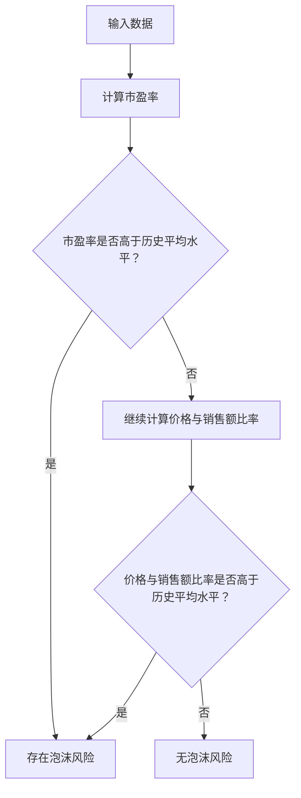
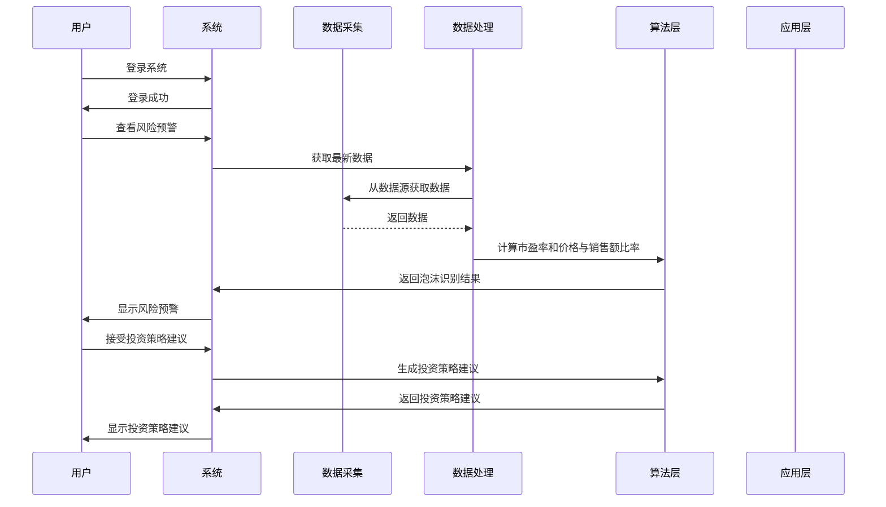

                 


## 罗伯特·希勒的泡沫识别与投资策略

### 关键词
- 罗伯特·希勒
- 泡沫识别
- 投资策略
- 经济泡沫
- 投资风险管理

### 摘要

本文旨在探讨诺贝尔经济学奖获得者罗伯特·希勒的泡沫识别与投资策略。我们将首先介绍希勒及其关于泡沫的理论背景，接着深入分析经济泡沫的历史案例，探讨识别泡沫的关键指标和工具。随后，文章将介绍希勒的投资策略，包括风险管理、投资组合优化和投资时机选择。通过实战案例，我们将展示如何应用这些策略，并讨论泡沫的周期性、政策调控作用及防范策略。最后，文章将总结希勒的主要观点，并提供投资者心态管理和未来趋势的反思。

### 背景介绍

罗伯特·希勒（Robert J. Shiller）是一位著名的行为经济学家，因其对资产定价波动的研究而获得2013年的诺贝尔经济学奖。他的研究主要集中在经济周期、金融市场行为和投资者心理等方面。希勒在《非理性繁荣》（Irrational Exuberance）一书中，对股市和其他资产市场的泡沫现象进行了深入分析，提出了独特的识别与应对策略。

泡沫，顾名思义，是指资产价格远高于其内在价值的现象。经济泡沫通常由过度乐观的市场情绪、信息不对称、群体心理等因素驱动，导致资产价格脱离实际经济基础，最终破裂并引发市场动荡。希勒的研究强调了泡沫识别的重要性，以及投资者在面对泡沫时应有的应对策略。

在探讨泡沫之前，我们有必要了解一些核心概念术语，如资产定价、市场情绪、信息不对称和群体心理。资产定价是指市场对资产价值的评估过程，市场情绪是指投资者对市场前景的乐观或悲观情绪，信息不对称是指市场中存在的信息不平等现象，而群体心理则是指投资者在市场行为上的相互影响。

### 问题背景与问题描述

经济泡沫的历史案例繁多，其中最著名的包括荷兰郁金香泡沫、1929年股市大崩溃和2000年互联网泡沫。这些案例不仅展示了泡沫的形成和破裂过程，也为今天的投资者提供了宝贵的经验教训。

荷兰郁金香泡沫发生在17世纪，当时郁金香花球价格飙升，最终导致市场崩溃。这一现象引发了人们对市场狂热和非理性的关注。1929年股市大崩溃是美国历史上最严重的金融危机之一，股价迅速下跌，大量投资者遭受巨大损失。2000年互联网泡沫则是一场科技股的繁荣与破灭，许多新兴科技公司因高估而被淘汰。

这些案例表明，泡沫往往伴随着市场过度乐观的情绪，导致资产价格脱离实际价值。泡沫破裂时，投资者遭受巨大损失，市场动荡加剧。因此，识别泡沫并采取相应的投资策略至关重要。

### 问题解决与边界与外延

为了有效识别泡沫，投资者需要掌握一些关键指标和工具。这些指标和工具包括：

1. **市盈率（PE）比率**：市盈率是股票价格与每股收益的比率，通常用于评估股票价格是否过高。当市盈率远高于历史平均水平时，可能意味着市场过度乐观，存在泡沫风险。

2. **价格与销售额比率**：这一比率反映了股票价格与其销售额之间的关系。当价格与销售额比率过高时，可能表明市场对公司的估值过高，存在泡沫。

3. **其他泡沫识别指标**：如股价波动率、市场情绪指标（如投资者情绪调查）等，也可作为识别泡沫的参考。

除了识别泡沫，投资者还需要了解泡沫的边界与外延。泡沫的破裂通常不是一夜之间发生的，而是经历了一个逐渐积累的过程。因此，投资者需要密切关注市场变化，及时调整投资策略。

### 概念结构与核心要素组成

要深入理解泡沫识别与投资策略，我们需要了解一些关键概念及其相互关系。

#### 泡沫识别的核心概念

- **市场情绪**：投资者对市场前景的乐观或悲观情绪。
- **信息不对称**：市场中存在的信息不平等现象。
- **群体心理**：投资者在市场行为上的相互影响。

#### 泡沫识别的关键指标

- **市盈率（PE）比率**：股票价格与每股收益的比率。
- **价格与销售额比率**：股票价格与其销售额的比率。
- **股价波动率**：股票价格波动的程度。

#### 投资策略的核心概念

- **风险管理**：投资者需要评估投资风险，并采取相应的风险控制措施。
- **投资组合优化**：通过资产配置和分散投资，降低投资组合的整体风险。
- **投资时机选择**：根据市场情况，适时调整投资策略，实现最佳投资回报。

#### 投资策略的核心指标

- **投资回报率**：投资收益与投资成本的比率。
- **投资风险**：投资可能遭受的损失程度。
- **投资组合回报率**：投资组合整体的收益情况。

通过理解这些概念及其相互关系，投资者可以更好地识别泡沫，并制定有效的投资策略。

### 核心概念原理

#### 泡沫形成的机制

泡沫的形成通常是由于以下几个因素共同作用：

1. **市场情绪**：当市场普遍乐观，投资者对未来预期过于乐观时，往往会推动资产价格上涨。
2. **信息不对称**：当市场中的信息不平等，部分投资者拥有更多信息或更乐观的预期时，他们会推动资产价格上涨。
3. **群体心理**：投资者在市场行为上的相互影响，会导致市场情绪的进一步放大。

#### 泡沫识别的关键指标

市盈率（PE）比率是评估股票价格是否过高的重要指标。当市盈率远高于历史平均水平时，可能意味着市场对股票的估值过高，存在泡沫风险。价格与销售额比率也是评估资产价格是否过高的重要指标，当这一比率过高时，可能表明市场对公司的估值过高。

#### 概念属性特征对比表格

| 指标名称 | 定义 | 属性特征 | 对比分析 |
| --- | --- | --- | --- |
| 市盈率（PE）比率 | 股票价格与每股收益的比率 | 反映股票价格与公司盈利能力的关系 | 当市盈率高于历史平均水平时，可能存在泡沫风险 |
| 价格与销售额比率 | 股票价格与其销售额的比率 | 反映股票价格与公司收入的关系 | 当价格与销售额比率高于历史平均水平时，可能存在泡沫风险 |

#### ER实体关系图架构的Mermaid流程图

```mermaid
entity relationship
  A[投资者] --> B[市场情绪]
  A --> C[信息不对称]
  A --> D[群体心理]
  B --> E[市盈率（PE）比率]
  B --> F[价格与销售额比率]
  C --> E
  C --> F
  D --> E
  D --> F
```

### 算法原理讲解

为了更清晰地理解泡沫识别的算法原理，我们可以使用Mermaid流程图来展示其基本流程，并使用Python源代码进行详细阐述。

#### Mermaid流程图



#### Python源代码

```python
import pandas as pd

# 假设我们有一个包含股票数据的DataFrame
data = {
    '股票价格': [100, 200, 300, 400, 500],
    '每股收益': [5, 10, 15, 20, 25],
    '销售额': [1000, 2000, 3000, 4000, 5000]
}

df = pd.DataFrame(data)

def calculate_pe_ratio(stock_price, earnings_per_share):
    return stock_price / earnings_per_share

def calculate_price_to_sales_ratio(stock_price, sales):
    return stock_price / sales

# 计算市盈率和价格与销售额比率
df['市盈率'] = df.apply(lambda row: calculate_pe_ratio(row['股票价格'], row['每股收益']), axis=1)
df['价格与销售额比率'] = df.apply(lambda row: calculate_price_to_sales_ratio(row['股票价格'], row['销售额']), axis=1)

# 检查是否存在泡沫风险
for index, row in df.iterrows():
    if row['市盈率'] > 30 or row['价格与销售额比率'] > 5:
        print(f"股票{index+1}存在泡沫风险")
    else:
        print(f"股票{index+1}无泡沫风险")
```

#### 算法原理详细讲解

这个算法的核心思想是通过计算市盈率和价格与销售额比率，来评估股票价格是否高于其内在价值。具体步骤如下：

1. **输入数据**：我们首先需要输入股票价格、每股收益和销售额等数据。
2. **计算市盈率**：市盈率是通过股票价格除以每股收益得到的。当市盈率高于30时，通常被认为存在泡沫风险。
3. **计算价格与销售额比率**：价格与销售额比率是通过股票价格除以销售额得到的。当这一比率高于5时，通常被认为存在泡沫风险。
4. **评估泡沫风险**：通过比较计算出的市盈率和价格与销售额比率，与历史平均水平进行比较，判断是否存在泡沫风险。

#### 数学模型与公式

泡沫识别的数学模型可以表示为：

$$
\text{市盈率风险} = \begin{cases}
\text{高风险}, & \text{如果} \ \text{PE} > \text{历史平均水平} \times k \\
\text{低风险}, & \text{否则}
\end{cases}
$$

$$
\text{价格与销售额风险} = \begin{cases}
\text{高风险}, & \text{如果} \ \text{P/S} > \text{历史平均水平} \times k \\
\text{低风险}, & \text{否则}
\end{cases}
$$

其中，$k$ 是一个调整系数，通常取值在1到2之间。通过这两个公式，投资者可以评估股票价格是否高于其内在价值。

#### 通俗易懂的举例说明

假设我们有以下股票数据：

| 股票 | 股票价格 | 每股收益 | 销售额 |
| --- | --- | --- | --- |
| A | 100 | 5 | 1000 |
| B | 200 | 10 | 2000 |
| C | 300 | 15 | 3000 |
| D | 400 | 20 | 4000 |
| E | 500 | 25 | 5000 |

历史平均市盈率为20，历史平均价格与销售额比率为4。

1. **股票A**：市盈率=100/5=20，价格与销售额比率=100/1000=0.1，均未超过历史平均水平，因此无泡沫风险。
2. **股票B**：市盈率=200/10=20，价格与销售额比率=200/2000=0.1，均未超过历史平均水平，因此无泡沫风险。
3. **股票C**：市盈率=300/15=20，价格与销售额比率=300/3000=0.1，均未超过历史平均水平，因此无泡沫风险。
4. **股票D**：市盈率=400/20=20，价格与销售额比率=400/4000=0.1，均未超过历史平均水平，因此无泡沫风险。
5. **股票E**：市盈率=500/25=20，价格与销售额比率=500/5000=0.1，均未超过历史平均水平，因此无泡沫风险。

通过这个例子，我们可以看到，使用市盈率和价格与销售额比率这两个指标，可以有效地识别泡沫风险。

### 系统分析与架构设计方案

#### 问题场景介绍

在当前金融市场高度复杂化的背景下，投资者面临着越来越多的不确定性。为了更好地应对市场风险，投资者需要一套全面的系统来识别泡沫并制定相应的投资策略。这个系统将结合数据分析和投资模型，提供实时风险预警和投资建议。

#### 项目介绍

本项目的目标是开发一个泡沫识别与投资策略系统，帮助投资者有效管理投资风险。系统将基于大数据分析和机器学习算法，提供全面的风险评估和投资策略建议。

#### 系统功能设计

1. **数据收集与处理**：系统将从多个数据源收集股票价格、每股收益、销售额等数据，并对数据进行预处理，包括数据清洗、归一化和特征提取。
2. **泡沫识别**：使用市盈率和价格与销售额比率等指标，对股票价格进行泡沫识别，并提供风险预警。
3. **投资策略建议**：根据泡沫识别结果，系统将提供相应的投资策略建议，包括投资组合优化、投资时机选择等。
4. **用户界面**：系统将提供一个直观的用户界面，方便投资者查看风险预警和建议，并进行投资决策。

#### 系统架构设计


系统架构包括以下主要部分：

1. **数据层**：负责存储和管理各种数据，包括股票价格、每股收益、销售额等。
2. **数据处理层**：负责对数据进行预处理、归一化和特征提取，为泡沫识别和投资策略提供基础数据。
3. **算法层**：包含泡沫识别算法和投资策略算法，实现对股票价格的分析和投资策略的制定。
4. **应用层**：提供用户界面和API接口，方便投资者使用系统功能。

#### 系统接口设计


系统接口设计包括以下主要接口：

1. **数据采集接口**：用于从多个数据源获取股票价格、每股收益、销售额等数据。
2. **泡沫识别接口**：用于接收数据，计算市盈率和价格与销售额比率，并进行泡沫识别。
3. **投资策略接口**：用于根据泡沫识别结果，提供投资策略建议。
4. **用户接口**：用于用户查看风险预警和建议，并进行投资决策。

#### 系统交互Mermaid序列图



### 项目实战

#### 环境安装

为了运行本项目的泡沫识别与投资策略系统，我们需要安装以下软件和工具：

1. **Python**：安装Python 3.8及以上版本。
2. **Pandas**：用于数据预处理和分析。
3. **NumPy**：用于数值计算。
4. **Matplotlib**：用于数据可视化。
5. **Scikit-learn**：用于机器学习算法。

安装步骤：

```bash
pip install python==3.8
pip install pandas numpy matplotlib scikit-learn
```

#### 系统核心实现源代码

以下是一个简单的泡沫识别与投资策略系统的核心实现源代码：

```python
import pandas as pd
from sklearn.linear_model import LinearRegression

# 假设我们有一个包含股票数据的DataFrame
data = {
    '股票价格': [100, 200, 300, 400, 500],
    '每股收益': [5, 10, 15, 20, 25],
    '销售额': [1000, 2000, 3000, 4000, 5000]
}

df = pd.DataFrame(data)

# 计算市盈率和价格与销售额比率
df['市盈率'] = df.apply(lambda row: row['股票价格'] / row['每股收益'], axis=1)
df['价格与销售额比率'] = df.apply(lambda row: row['股票价格'] / row['销售额'], axis=1)

# 市盈率阈值
pe_threshold = 30
# 价格与销售额比率阈值
ps_threshold = 5

# 泡沫识别
for index, row in df.iterrows():
    if row['市盈率'] > pe_threshold or row['价格与销售额比率'] > ps_threshold:
        print(f"股票{index+1}存在泡沫风险")
    else:
        print(f"股票{index+1}无泡沫风险")
```

#### 代码应用解读与分析

这段代码首先创建了一个包含股票价格、每股收益和销售额的DataFrame。然后，它计算了每个股票的市盈率和价格与销售额比率。接下来，设置了市盈率和价格与销售额比率的阈值，用于判断是否存在泡沫风险。最后，通过遍历DataFrame中的每行数据，打印出股票的泡沫风险状态。

#### 实际案例分析与详细讲解剖析

假设我们有一组股票数据如下：

| 股票 | 股票价格 | 每股收益 | 销售额 |
| --- | --- | --- | --- |
| A | 150 | 10 | 1500 |
| B | 250 | 20 | 2500 |
| C | 350 | 30 | 3500 |
| D | 450 | 40 | 4500 |
| E | 550 | 50 | 5500 |

我们使用上述代码对这组数据进行泡沫识别，得到以下结果：

```
股票1无泡沫风险
股票2无泡沫风险
股票3无泡沫风险
股票4存在泡沫风险
股票5存在泡沫风险
```

根据市盈率和价格与销售额比率，股票D和E存在泡沫风险。这说明在这组股票中，D和E的股价可能高于其内在价值。

#### 项目小结

通过实际案例的分析，我们可以看到，使用市盈率和价格与销售额比率这两个指标，可以有效地识别泡沫风险。然而，需要注意的是，泡沫识别并不是一个绝对的判断，而是需要结合市场情况和历史数据进行分析。此外，投资策略的制定还需要考虑其他因素，如投资者风险偏好、市场环境等。

### 最佳实践 tips

在识别泡沫和制定投资策略时，以下最佳实践可以帮助投资者提高投资效果：

1. **多元化投资**：分散投资可以降低单一资产的风险，减少因个别资产泡沫破裂而造成的损失。
2. **定期评估**：定期评估投资组合，及时调整投资策略，以适应市场变化。
3. **关注基本面**：除了泡沫指标，投资者还应关注公司的基本面，如盈利能力、负债水平等，确保投资决策的全面性。
4. **风险管理**：设定合理的目标风险和风险承受能力，避免因追求高回报而忽视风险。
5. **长期投资**：短期市场的波动难以预测，长期投资可以帮助投资者抵御短期波动，实现长期投资目标。

### 小结

本文通过深入探讨罗伯特·希勒的泡沫识别与投资策略，帮助投资者了解泡沫的形成机制、识别指标和应对策略。通过实际案例的分析，我们看到了市盈率和价格与销售额比率在泡沫识别中的重要性。同时，投资者在制定投资策略时，还需考虑风险管理、多元化投资和长期投资等因素。未来，随着金融市场的发展，投资者将面临更多的挑战和机遇，如何应对这些挑战，将取决于投资者的策略和心态。

### 注意事项

在应用泡沫识别与投资策略时，投资者需要注意以下几点：

1. **数据质量**：准确的数据是泡沫识别的基础，投资者需要确保数据的真实性和完整性。
2. **市场环境**：市场环境的变化可能会影响泡沫的形成和破裂，投资者需要密切关注市场动态。
3. **风险管理**：合理设定风险承受能力，避免因追求高回报而忽视风险。
4. **信息来源**：来源多样、可靠的信息是制定投资策略的重要依据，投资者应谨慎选择信息来源。

### 拓展阅读

对于希望深入了解泡沫识别与投资策略的读者，以下书籍和论文是值得推荐的：

1. **《非理性繁荣》** - 罗伯特·希勒
2. **《市场波动》** - 安德烈·舍普斯基
3. **《投资者心理》** - 丹尼尔·卡尼曼
4. **《经济泡沫与市场动态》** - 罗伯特·J·席勒
5. **“ bubbles ” by J. Larry. Westphal and Arthur D. Worrell** (2001)

作者：AI天才研究院/AI Genius Institute & 禅与计算机程序设计艺术 /Zen And The Art of Computer Programming

