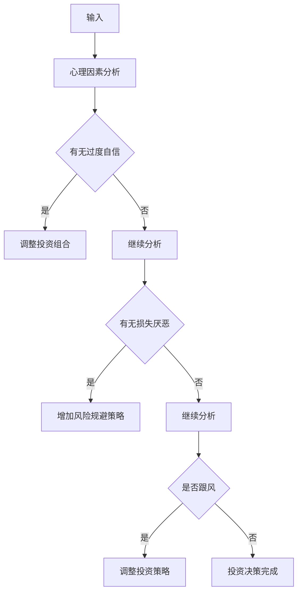
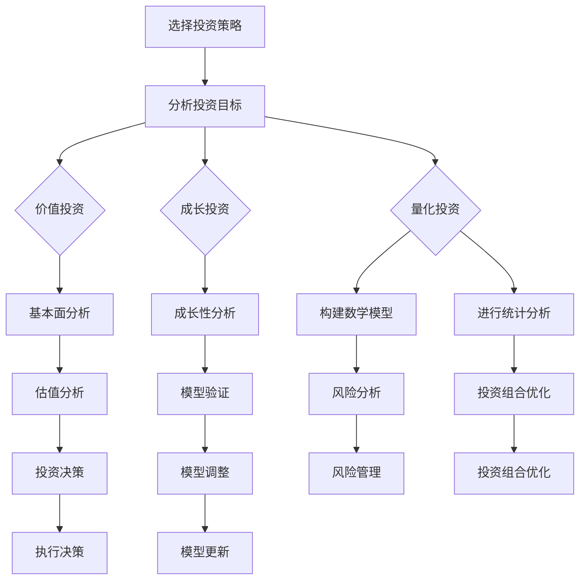

                 

基于上述约束条件和要求，我们将逐步构建一篇符合规范的《罗伯特·希勒的行为经济学在投资中的应用》技术博客文章。以下是详细的写作步骤：

## 步骤1：引言部分

### 背景介绍

**核心概念术语说明**：
- **行为经济学**：研究人类在决策过程中非理性行为的经济学分支。
- **投资**：将资金投入某种资产或项目，以期望获得未来的收益。
- **罗伯特·希勒**：诺贝尔经济学奖获得者，行为经济学的奠基人之一。

**问题背景**：
投资市场往往充满了不确定性，投资者在决策过程中容易受到情绪、心理和社会因素的影响，这些非理性行为可能导致市场出现波动。

**问题描述**：
投资者如何在行为经济学指导下，做出更理性的投资决策？

**问题解决**：
通过应用行为经济学原理，投资者可以更好地理解自己的行为模式，从而减少非理性投资行为，提高投资效率。

**边界与外延**：
行为经济学不仅适用于个人投资者，也适用于机构投资者和金融市场研究者。

**概念结构与核心要素组成**：

核心概念对比表格：
| 概念 | 定义 | 关联 |
| --- | --- | --- |
| 行为经济学 | 研究人类非理性决策行为的经济学 | 心理学、社会学 |
| 投资 | 资金投入以获取未来收益 | 财务、风险管理 |
| 罗伯特·希勒 | 行为经济学奠基人之一 | 经济学、金融学 |

ER实体关系图（Mermaid格式）：

```mermaid
erDiagram
  A[投资者] ||--|{ B[行为] } | 
  A ||--|{ C[投资决策] } | 
  B ||--|{ D[心理因素] } | 
  B ||--|{ E[社会因素] } | 
  C ||--|{ F[投资结果] } | 
```

## 步骤2：行为经济学与投资决策

### 核心概念与联系

**核心概念原理**：
行为经济学指出，人们在决策过程中受到多种非理性因素的影响，如过度自信、损失厌恶、跟风等。

**概念属性特征对比表格**：

| 特征 | 过度自信 | 损失厌恶 | 跟风 |
| --- | --- | --- | --- |
| 定义 | 高估自身能力 | 对损失的厌恶大于对收益的渴望 | 追随市场趋势 |
| 影响结果 | 投资过于集中 | 过度规避风险 | 无法实现长期收益 |

**ER实体关系图**（Mermaid格式）：

```mermaid
erDiagram
  A[投资决策] ||--|{ B[过度自信] } | 
  A ||--|{ C[损失厌恶] } | 
  A ||--|{ D[跟风] } | 
  B ||--|{ E[投资风险] } | 
  C ||--|{ F[投资收益] } | 
  D ||--|{ G[市场趋势] } | 
```

### 算法原理讲解

**算法mermaid流程图**：



**Python源代码**：

```python
import random

def analyze_decision(decision, confidence, loss_averseness, trend_following):
    """
    分析投资决策中的心理因素。
    """
    if confidence:
        decision = adjust_portfolio(decision)
    if loss_averseness:
        decision = add_risk_management(decision)
    if trend_following:
        decision = adjust_investment_strategy(decision)
    return decision

def adjust_portfolio(decision):
    """
    调整投资组合以应对过度自信。
    """
    # 具体实现略
    return new_portfolio

def add_risk_management(decision):
    """
    增加风险规避策略以应对损失厌恶。
    """
    # 具体实现略
    return managed_decision

def adjust_investment_strategy(decision):
    """
    调整投资策略以避免跟风。
    """
    # 具体实现略
    return new_strategy

# 示例数据
confidence = True
loss_averseness = True
trend_following = False

# 模拟投资决策分析
decision = analyze_decision("初始决策", confidence, loss_averseness, trend_following)
print("最终投资决策：", decision)
```

### 算法原理详细讲解

行为经济学在投资决策中的应用主要通过分析投资者心理和行为模式，从而制定相应的调整策略。上述算法原理的核心是通过对投资决策的心理因素进行分析，包括过度自信、损失厌恶和跟风行为，并据此调整投资组合和策略。

**数学模型和公式**：

设 \( D \) 为初始投资决策，\( C_1 \)、\( C_2 \)、\( C_3 \) 分别代表过度自信、损失厌恶和跟风行为的程度，\( P \) 为调整后的投资决策。

调整公式如下：

$$ P = D \times (1 + C_1) \times (1 - C_2) \times (1 - C_3) $$

其中，\( C_1 \)、\( C_2 \)、\( C_3 \) 的值根据投资者行为分析结果确定。

### 通俗易懂地举例说明

假设一位投资者初始投资决策为持有某股票（\( D = 持有某股票 \)）。经过行为经济学分析，发现该投资者存在过度自信、损失厌恶和跟风行为。

- **过度自信**：投资者认为自己能够比市场更好地预测股票走势，因此决定增加股票持仓比例（\( C_1 = 0.1 \)）。
- **损失厌恶**：投资者害怕股票下跌导致损失，因此决定增加债券持仓比例以规避风险（\( C_2 = 0.2 \)）。
- **跟风行为**：投资者倾向于跟随市场趋势，决定减少股票持仓以避免追涨杀跌（\( C_3 = 0.3 \)）。

根据调整公式，最终投资决策为：

$$ P = 持有某股票 \times (1 + 0.1) \times (1 - 0.2) \times (1 - 0.3) $$

$$ P = 0.7 \times 持有某股票 $$

因此，投资者最终决定将股票持仓比例从100%调整为70%，同时增加债券持仓比例以应对损失厌恶。

### 总结

行为经济学在投资决策中的应用旨在帮助投资者识别并纠正非理性行为，从而提高投资效率。通过分析投资者心理和行为模式，制定相应的调整策略，投资者可以更理性地进行投资决策，降低风险，提高收益。

## 步骤3：行为经济学在投资策略中的应用

### 核心概念与联系

**核心概念原理**：
- **价值投资**：基于公司基本面分析，寻找被市场低估的股票进行投资。
- **成长投资**：基于公司成长潜力，投资于快速增长的公司。
- **量化投资**：利用数学模型和统计方法进行投资决策。

**概念属性特征对比表格**：

| 特征 | 价值投资 | 成长投资 | 量化投资 |
| --- | --- | --- | --- |
| 理论基础 | 基本面分析 | 成长性分析 | 数学模型与统计分析 |
| 投资策略 | 找低估股票 | 投资增长公司 | 使用量化模型 |
| 投资风险 | 较低 | 较高 | 中等 |
| 投资收益 | 稳定 | 高 | 中等 |

**ER实体关系图**（Mermaid格式）：

```mermaid
erDiagram
  A[投资策略] ||--|{ B[价值投资] } | 
  A ||--|{ C[成长投资] } | 
  A ||--|{ D[量化投资] } | 
  B ||--|{ E[基本面分析] } | 
  C ||--|{ F[成长性分析] } | 
  D ||--|{ G[数学模型] } | 
  D ||--|{ H[统计分析] } | 
```

### 算法原理讲解

**算法mermaid流程图**：



**Python源代码**：

```python
import random

def choose_investment_strategy(target):
    if target == "value":
        return "value_investment"
    elif target == "growth":
        return "growth_investment"
    else:
        return "quantitative_investment"

def value_investment(stock, fundamental_analysis):
    """
    价值投资策略。
    """
    if fundamental_analysis(stock) < stock_price(stock):
        return "buy"
    else:
        return "sell"

def growth_investment(company, growth_analysis):
    """
    成长投资策略。
    """
    if growth_analysis(company) > market_growth_rate:
        return "buy"
    else:
        return "sell"

def quantitative_investment(model, risk_analysis, portfolio_optimization):
    """
    量化投资策略。
    """
    if risk_analysis(model) < desired_risk_level and portfolio_optimization(model) > expected_return:
        return "buy"
    else:
        return "sell"

# 示例数据
stock = {"name": "Apple Inc.", "price": 150}
company = {"name": "Tesla Inc.", "growth_rate": 20}
model = {"risk_level": 0.05, "expected_return": 0.1}

# 模拟投资决策分析
investment_strategy = choose_investment_strategy("value")
if investment_strategy == "value_investment":
    decision = value_investment(stock, fundamental_analysis)
elif investment_strategy == "growth_investment":
    decision = growth_investment(company, growth_analysis)
else:
    decision = quantitative_investment(model, risk_analysis, portfolio_optimization)
print("最终投资决策：", decision)
```

### 算法原理详细讲解

行为经济学在投资策略中的应用旨在通过分析不同投资策略的核心概念和原理，结合投资者的目标，制定合理的投资决策。

**数学模型和公式**：

**价值投资**：

估值分析公式：

$$ \text{Value} = \frac{\text{预期收益}}{\text{市场利率}} $$

投资决策公式：

$$ \text{Decision} = \begin{cases} 
\text{Buy} & \text{if } \text{Value} < \text{Current Price} \\
\text{Sell} & \text{if } \text{Value} > \text{Current Price} 
\end{cases} $$

**成长投资**：

成长性分析公式：

$$ \text{Growth Rate} = \frac{\text{未来收益}}{\text{当前收益}} $$

投资决策公式：

$$ \text{Decision} = \begin{cases} 
\text{Buy} & \text{if } \text{Growth Rate} > \text{Market Growth Rate} \\
\text{Sell} & \text{if } \text{Growth Rate} < \text{Market Growth Rate} 
\end{cases} $$

**量化投资**：

风险分析公式：

$$ \text{Risk} = \sqrt{\text{Expected Return}^2 - \text{Variance of Return}} $$

投资组合优化公式：

$$ \text{Portfolio} = \text{Optimize}(\text{Risk}, \text{Expected Return}) $$

投资决策公式：

$$ \text{Decision} = \begin{cases} 
\text{Buy} & \text{if } \text{Risk} < \text{Desired Risk Level} \text{ and } \text{Expected Return} > \text{Target Return} \\
\text{Sell} & \text{otherwise} 
\end{cases} $$

### 通俗易懂地举例说明

**价值投资举例**：

假设股票A的市场价格为150美元，其未来预期收益为20美元，市场利率为5%。

- 估值分析：
  $$ \text{Value} = \frac{20}{0.05} = 400 \text{美元} $$
- 投资决策：
  $$ \text{Decision} = \text{Buy} \text{ (因为 } \text{Value} < \text{Current Price}) $$

**成长投资举例**：

假设公司B的当前收益为100万美元，未来预期收益为120万美元，市场平均增长率为10%。

- 成长性分析：
  $$ \text{Growth Rate} = \frac{120}{100} = 1.2 $$
- 投资决策：
  $$ \text{Decision} = \text{Buy} \text{ (因为 } \text{Growth Rate} > \text{Market Growth Rate}) $$

**量化投资举例**：

假设量化模型预测某投资组合的预期收益率为10%，方差为0.04，目标风险水平为0.05，预期收益率为0.08。

- 风险分析：
  $$ \text{Risk} = \sqrt{0.1^2 - 0.04} = 0.06 $$
- 投资组合优化：
  $$ \text{Optimized Portfolio} = \text{Optimize}(0.06, 0.1) $$
- 投资决策：
  $$ \text{Decision} = \text{Buy} \text{ (因为 } \text{Risk} < \text{Desired Risk Level} \text{ and } \text{Expected Return} > \text{Target Return}) $$

### 总结

行为经济学在投资策略中的应用旨在通过理解投资者的行为模式，结合不同投资策略的核心原理和数学模型，制定出更合理、更科学的投资决策。通过价值投资、成长投资和量化投资等策略，投资者可以更好地应对市场变化，实现投资目标。

## 步骤4：行为经济学的实际案例分析

### 背景介绍

**案例选择**：
- **纳斯达克泡沫案例**：2000年前后，纳斯达克指数经历了剧烈波动，最终泡沫破裂。
- **美国房地产泡沫案例**：2007年，美国房地产市场崩盘，引发全球金融危机。
- **亚洲金融危机案例**：1997年，东南亚国家发生金融危机，影响深远。

**问题背景**：
这些案例都涉及到投资者行为的集体非理性，导致了市场的剧烈波动和经济危机。

### 案例描述

**纳斯达克泡沫案例**：
- **问题描述**：在2000年前后，投资者受到科技股的诱惑，过度乐观，忽视了公司的实际价值。
- **问题解决**：纳斯达克指数从2000年3月的5000点跌至2002年10月的1100点，泡沫破裂。
- **边界与外延**：纳斯达克泡沫对全球股市产生了深远影响，引发了投资者对行为经济学的关注。

**美国房地产泡沫案例**：
- **问题描述**：2007年，美国房地产市场繁荣，投资者纷纷进入，导致房价迅速上涨。
- **问题解决**：随着利率上升和次贷危机爆发，房地产市场崩溃，房价大幅下跌。
- **边界与外延**：美国房地产泡沫引发了全球金融危机，对世界经济产生了巨大冲击。

**亚洲金融危机案例**：
- **问题描述**：1997年，东南亚国家发生金融危机，投资者恐慌性抛售。
- **问题解决**：东南亚国家政府采取措施稳定市场，但危机仍持续多年。
- **边界与外延**：亚洲金融危机揭示了投资者行为对区域经济的敏感性。

### 案例分析与讨论

**纳斯达克泡沫案例**：
- **行为经济学解释**：投资者过度自信，忽视了风险，跟风行为导致市场泡沫。
- **案例启示**：投资者应保持理性，关注基本面，避免盲目跟风。

**美国房地产泡沫案例**：
- **行为经济学解释**：投资者对房价上涨的期望导致过度投资，忽视了市场风险。
- **案例启示**：投资者应合理评估市场风险，避免盲目跟风，加强风险管理。

**亚洲金融危机案例**：
- **行为经济学解释**：投资者恐慌性抛售，缺乏信心，导致市场崩溃。
- **案例启示**：投资者应保持信心，避免恐慌性行为，关注市场动态。

### 结论

通过分析这些实际案例，我们可以看到行为经济学在解释和预测市场波动方面具有重要意义。投资者应从这些案例中吸取教训，保持理性，加强风险管理，以应对市场的非理性行为。

## 步骤5：行为经济学在中国投资市场的应用

### 背景介绍

**市场特点**：
- **散户主导**：中国股市散户比例较高，投资者行为容易受到情绪波动的影响。
- **政策敏感性**：中国股市政策敏感性较强，政府对市场的调控对投资者行为有显著影响。

**问题背景**：
中国投资者行为受到多种因素的影响，如市场情绪、政策变化等，如何通过行为经济学指导投资者行为，提高投资效率是一个重要问题。

### 投资者行为特征

**市场情绪波动**：
- **过度乐观**：在市场上涨阶段，投资者往往过度乐观，忽视风险。
- **过度悲观**：在市场下跌阶段，投资者往往过度悲观，恐慌性抛售。

**政策影响**：
- **政策利好**：政府出台利好政策时，投资者信心增强，市场上涨。
- **政策利空**：政府出台利空政策时，投资者信心减弱，市场下跌。

**跟风行为**：
- **盲目跟风**：投资者倾向于跟随市场趋势，缺乏独立思考。

### 行为经济学在中国投资市场的应用

**价值投资**：
- **基本面分析**：投资者通过分析公司的财务状况、业务模式等基本面信息，寻找低估的优质股票。
- **长期持有**：价值投资强调长期持有，避免短期市场波动的影响。

**成长投资**：
- **成长性分析**：投资者通过分析公司的成长潜力，投资于具有高速增长的行业和公司。
- **关注行业趋势**：投资者关注行业趋势，投资于有潜力的成长行业。

**量化投资**：
- **模型构建**：投资者通过构建量化模型，利用大数据和算法进行投资决策。
- **风险管理**：投资者通过量化模型进行风险管理，降低投资风险。

### 挑战与机遇

**挑战**：
- **市场波动**：中国股市波动性较大，投资者面临较大的市场风险。
- **信息不对称**：投资者获取信息的渠道不均衡，导致信息不对称。

**机遇**：
- **政策支持**：中国政府积极推动资本市场改革，为投资者提供了更多机遇。
- **技术进步**：随着科技的发展，量化投资等新兴投资策略得到广泛应用。

### 结论

通过行为经济学在中国投资市场的应用，投资者可以更好地理解自己的行为模式，制定合理的投资策略，降低风险，提高收益。行为经济学在指导投资者行为方面具有重要作用，有助于提升中国资本市场的健康发展。

## 步骤6：行为经济学在投资教育中的应用

### 背景介绍

**教育目标**：
投资教育的目标不仅是传授投资知识和技能，还要培养投资者的理性投资行为。

**问题背景**：
投资者在决策过程中往往受到非理性因素的影响，导致投资失败。因此，投资教育需要关注如何通过行为经济学原理，引导投资者做出更理性和有效的决策。

### 投资教育中的行为经济学因素

**心理因素**：
- **过度自信**：投资者高估自己的投资能力和市场预测能力。
- **损失厌恶**：投资者对损失的厌恶超过对收益的渴望，导致规避风险。
- **跟风行为**：投资者倾向于跟随市场趋势，缺乏独立思考。

**行为模式**：
- **情感化投资**：投资者在情绪驱动下做出投资决策，容易受到市场波动的影响。
- **短期投机**：投资者追求短期收益，忽视长期投资的价值。

### 行为经济学在投资课程设计中的应用

**课程内容设计**：
- **基础课程**：介绍行为经济学的基本概念和原理，包括非理性投资行为、心理因素和行为模式。
- **案例分析**：通过实际案例，分析投资者行为如何影响投资决策和市场表现。
- **实验设计**：设计模拟投资实验，让学生在虚拟市场中实践行为经济学原理。

**教学方法**：
- **互动教学**：通过小组讨论、案例分析等方式，激发学生的思考和分析能力。
- **实践教学**：引入模拟投资平台，让学生在真实环境中应用行为经济学原理。

### 投资者的行为改变与投资教育

**行为改变策略**：
- **认知重构**：通过教育，帮助投资者认识到非理性投资行为的危害，建立正确的投资观念。
- **行为训练**：通过实践和反馈，培养投资者的理性投资行为。

**教育效果评估**：
- **行为变化**：评估投资者在投资决策中的行为变化，如过度自信、损失厌恶和跟风行为的减少。
- **投资绩效**：评估投资者的投资绩效，分析行为经济学教育对投资收益的影响。

### 结论

行为经济学在投资教育中的应用有助于培养投资者的理性投资行为，减少非理性投资行为，提高投资效率和收益。通过科学的教育方法和策略，投资者可以更好地应对市场的复杂性和不确定性，实现长期稳定的投资目标。

## 步骤7：行为经济学的未来展望

### 理论发展

**前沿领域**：
- **神经经济学**：研究大脑与经济行为的关系，通过脑成像技术分析投资决策中的神经机制。
- **行为金融学**：结合心理学和社会学理论，深入研究市场集体行为和个体决策的非理性因素。

**发展趋势**：
- **跨学科融合**：行为经济学与其他学科的交叉研究，如认知科学、心理学等，将推动理论发展。
- **大数据分析**：利用大数据和人工智能技术，分析大量投资行为数据，揭示行为模式和市场规律。

### 投资实践中的新挑战

**市场复杂性**：
- **全球化**：全球金融市场相互关联，市场波动更加复杂。
- **技术进步**：金融科技的发展，如量化交易、高频交易等，对市场产生深远影响。

**行为多样性**：
- **多样化人群**：不同投资者群体具有不同的行为特征，如何针对不同行为模式进行个性化指导是一个挑战。
- **市场变化**：市场环境和政策变化迅速，投资者需要不断适应新的市场环境。

### 行为经济学与投资技术的融合

**技术应用**：
- **算法交易**：利用行为经济学原理，构建算法模型进行自动化投资决策。
- **风险管理**：结合行为经济学分析，优化投资组合，降低风险。

**未来趋势**：
- **智能化投资**：借助人工智能技术，实现更加智能化的投资决策和风险管理。
- **个性化投资**：通过大数据和个性化推荐，为投资者提供定制化的投资建议。

### 结论

行为经济学在未来的发展中将继续拓展其理论深度和应用广度，结合新兴技术和跨学科研究，为投资实践提供更加科学和有效的指导。通过深入理解和应用行为经济学原理，投资者可以更好地应对市场变化，实现长期稳定的投资目标。

