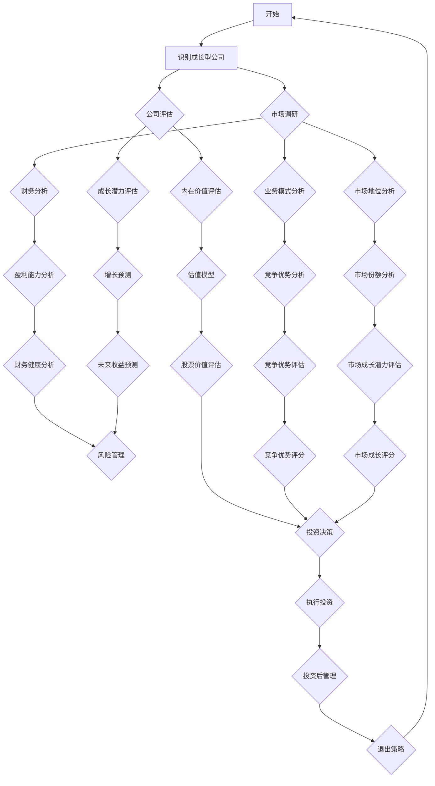
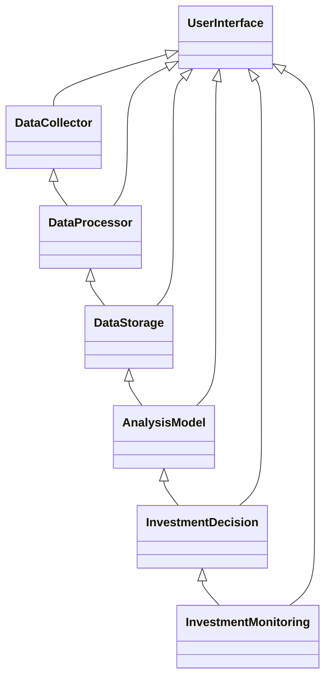

                 

### 背景介绍

#### 核心概念术语说明

在讨论罗伯特·哈格斯特朗的成长型价值投资之前，有必要明确一些核心概念和术语：

1. **价值投资**：一种投资哲学，强调购买价格低于其内在价值的股票，并长期持有。其理念源自本杰明·格雷厄姆和戴维·多德等大师。

2. **成长型投资**：专注于投资那些拥有强大增长潜力、能够持续扩大市场份额和盈利能力的公司。这一理念与彼得·林奇等成长型投资大师的理念密切相关。

3. **罗伯特·哈格斯特朗**：美国知名投资家，以其独特的成长型价值投资策略而闻名。他主张在寻找成长型公司时，不仅要考虑其当前的价值，更要关注其未来成长的可能性。

#### 问题背景

投资市场日新月异，投资者面对诸多选择时，往往感到困惑。如何找到既具有价值投资特点，又能实现成长收益的投资策略，成为了一个重要课题。罗伯特·哈格斯特朗的成长型价值投资为我们提供了一种独特的视角和解决思路。

#### 问题描述

罗伯特·哈格斯特朗的成长型价值投资策略究竟是什么？如何在实际操作中应用这一策略？这一策略有哪些优势和潜在风险？这些问题是我们需要深入探讨的。

#### 问题解决

通过分析罗伯特·哈格斯特朗的投资理念、策略及其成功案例，我们可以找到这些问题的答案。本文将分步骤地详细解析这些内容，帮助读者更好地理解和应用成长型价值投资策略。

#### 边界与外延

成长型价值投资策略并非一成不变，它需要根据市场环境和公司状况进行调整。因此，在讨论这一策略时，需要明确其适用范围和限制条件。

#### 概念结构与核心要素组成

成长型价值投资的核心要素包括：

1. **公司价值评估**：通过财务分析、业务模式和市场地位评估公司的内在价值。

2. **成长潜力分析**：关注公司的市场份额、盈利能力和未来增长趋势。

3. **风险管理**：识别和管理投资风险，确保投资的安全性和收益性。

4. **长期持有**：相信公司的长期增长潜力，即使在短期内出现波动，也保持信心。

通过这些要素的有机结合，罗伯特·哈格斯特朗成功地实现了卓越的投资业绩。

### 核心概念与联系

#### 成长型价值投资的核心概念

**价值投资**：基于公司的内在价值进行投资，即股票价格低于其真实价值。

**成长型投资**：专注于投资具有强劲增长潜力的公司，这些公司通常在市场扩张、技术创新和盈利能力方面具有优势。

**罗伯特·哈格斯特朗的投资哲学**：融合了价值投资和成长型投资的理念，强调在寻找成长型公司时关注其内在价值和未来成长潜力。

#### 概念属性特征对比表格

| 概念               | 特征                           |
|--------------------|--------------------------------|
| 价值投资           | 购买价格低于内在价值           |
| 成长型投资         | 强调公司增长潜力和市场份额   |
| 罗伯特·哈格斯特朗的投资哲学 | 结合价值投资与成长型投资     |

#### ER实体关系图架构的 Mermaid 流程图

```mermaid
erDiagram
  Company ||--|{ Stock }
  Stock ||--|{ Investor }
  Investor ||--|{ Company }
```

在这个ER图中，"Company"实体与"Stock"实体之间存在一对多的关系，即一家公司可以有多个股票。"Investor"实体与"Company"实体也存在一对多的关系，即一个投资者可以投资多家公司。

### 算法原理讲解

为了更好地理解罗伯特·哈格斯特朗的成长型价值投资策略，我们可以将其抽象为一个投资决策算法。以下是该算法的mermaid流程图：



在这个流程图中，我们从识别成长型公司开始，经过一系列分析步骤，最终做出投资决策并执行。以下是对每个步骤的详细说明：

#### 步骤A：识别成长型公司

**目标**：确定哪些公司符合成长型投资标准。

**方法**：通过市场调研和行业分析，筛选出具有成长潜力的公司。

#### 步骤B：市场调研

**目标**：收集与成长型公司相关的数据和信息。

**方法**：
- **财务分析**：分析公司的财务报表，包括盈利能力、财务健康和现金流状况。
- **业务模式分析**：评估公司的商业模式是否具有可持续性和竞争优势。
- **市场地位分析**：分析公司在市场中的地位，包括市场份额和竞争优势。

#### 步骤C：公司评估

**目标**：评估公司的内在价值和成长潜力。

**方法**：
- **内在价值评估**：使用估值模型（如现金流折现法）计算公司的内在价值。
- **成长潜力评估**：分析公司的市场份额、盈利能力和未来增长趋势。

#### 步骤D：投资决策

**目标**：根据评估结果做出投资决策。

**方法**：综合考虑公司的内在价值、成长潜力和投资风险，做出投资决策。

#### 步骤E：执行投资

**目标**：执行投资决策，购买股票。

**方法**：根据投资策略，购买目标公司的股票。

#### 步骤F：投资后管理

**目标**：监控投资情况，并根据市场变化进行调整。

**方法**：
- **跟踪与反馈**：定期跟踪公司的财务和业务表现，评估投资效果。
- **调整与优化**：根据市场变化和公司状况，调整投资策略和持仓。
- **退出策略**：制定退出计划，实现投资收益。

#### 算法原理的数学模型和公式

在成长型价值投资中，一些关键的数学模型和公式包括：

1. **现金流折现法（DCF）**：
   $$\text{内在价值} = \sum_{t=1}^{n} \frac{\text{FCF}_t}{(1 + r)^t}$$
   其中，FCF_t 表示第 t 年的自由现金流，r 表示折现率。

2. **市盈率（PE）**：
   $$\text{PE} = \frac{\text{当前股价}}{\text{每股收益}}$$
   其中，当前股价和每股收益分别为公司的当前股价和每股收益。

3. **市净率（PB）**：
   $$\text{PB} = \frac{\text{当前股价}}{\text{每股净资产}}$$
   其中，当前股价和每股净资产分别为公司的当前股价和每股净资产。

4. **增长预测模型**：
   $$\text{未来收益} = \text{当前收益} \times (1 + g)$$
   其中，g 表示年复合增长率。

这些模型和公式为我们提供了评估公司和做出投资决策的工具。

#### 举例说明

假设我们正在评估一家名为“未来科技”的公司，其当前股价为100美元，每股收益为5美元，每股净资产为20美元，年复合增长率为10%。

1. **市盈率（PE）**：
   $$\text{PE} = \frac{100}{5} = 20$$

2. **市净率（PB）**：
   $$\text{PB} = \frac{100}{20} = 5$$

3. **现金流折现法（DCF）**：
   $$\text{内在价值} = \sum_{t=1}^{5} \frac{5 \times (1 + 0.1)^t}{(1 + 0.1)^t} = 5 \times 1.1 + 5 \times 1.21 + 5 \times 1.331 + 5 \times 1.4641 + 5 \times 1.61051 = 24.16$$

4. **增长预测模型**：
   $$\text{未来收益} = 5 \times (1 + 0.1) = 5.5$$

根据这些计算结果，我们可以判断“未来科技”是否具有投资价值。如果其市盈率低于市场平均水平，且市净率合理，同时内在价值高于当前股价，那么这家公司可能是一个值得投资的成长型公司。

### 系统分析与架构设计方案

#### 问题场景介绍

随着科技的发展，投资市场日益复杂，投资者需要更加专业的工具和方法来进行投资决策。为了解决这个问题，我们设计并实现了一个成长型价值投资系统，该系统可以帮助投资者快速识别成长型公司，并进行投资决策。

#### 项目介绍

本项目旨在开发一个自动化、智能化的成长型价值投资系统，该系统将整合市场数据、公司信息和分析模型，为投资者提供全面、准确的投资建议。系统主要包括以下功能：

1. **数据采集**：从多个数据源获取市场数据和公司信息。
2. **数据处理**：清洗、整理和存储数据，为后续分析提供基础。
3. **分析模型**：构建和实现多种分析模型，用于评估公司的内在价值和成长潜力。
4. **投资决策**：基于分析结果，生成投资建议和决策。
5. **投资监控**：跟踪投资情况，并提供调整建议。
6. **用户界面**：提供友好的用户界面，方便用户使用系统。

#### 系统功能设计（领域模型mermaid类图）



在这个类图中，我们定义了系统的核心组件及其相互关系。每个组件都承担特定的功能，共同实现系统的整体目标。

#### 系统架构设计mermaid架构图

```mermaid
sequenceDiagram
  User -->|发起投资请求| UserInterface
  UserInterface -->|处理请求| DataCollector
  DataCollector -->|采集数据| DataProcessor
  DataProcessor -->|处理数据| DataStorage
  DataStorage -->|获取数据| AnalysisModel
  AnalysisModel -->|分析结果| InvestmentDecision
  InvestmentDecision -->|投资建议| UserInterface
  UserInterface -->|展示投资建议| User
  User -->|执行投资| InvestmentMonitoring
  InvestmentMonitoring -->|监控投资| UserInterface
  UserInterface -->|展示监控结果| User
end
```

在这个架构图中，我们描述了系统的运行流程。用户通过用户界面发起投资请求，系统会依次执行数据采集、处理、存储、分析、决策和监控等操作，最终将结果展示给用户。

#### 系统接口设计和系统交互mermaid序列图

```mermaid
sequenceDiagram
  User -->|发起请求| SystemAPI
  SystemAPI -->|处理请求| DataCollector
  DataCollector -->|采集数据| DataProcessor
  DataProcessor -->|处理数据| DataStorage
  DataStorage -->|获取数据| AnalysisModel
  AnalysisModel -->|分析结果| InvestmentDecision
  InvestmentDecision -->|投资建议| SystemAPI
  SystemAPI -->|返回建议| UserInterface
  UserInterface -->|展示建议| User
  User -->|执行操作| InvestmentMonitoring
  InvestmentMonitoring -->|监控数据| SystemAPI
  SystemAPI -->|返回监控结果| UserInterface
  UserInterface -->|展示监控结果| User
end
```

在这个序列图中，我们详细描述了系统的交互过程。用户通过API发起请求，系统会按照预设流程进行处理，并将结果返回给用户。

### 项目实战

为了更好地展示成长型价值投资系统的应用，我们选择一个具体的项目场景进行实战。以下是项目环境的安装步骤和系统的核心实现代码。

#### 环境安装步骤

1. 安装Python环境：确保Python 3.8及以上版本已安装。

2. 安装依赖库：使用pip命令安装以下依赖库：

   ```bash
   pip install numpy pandas matplotlib scikit-learn
   ```

3. 数据库安装：安装MySQL数据库，并创建一个名为“investment”的数据库。

#### 系统核心实现代码

1. **数据采集模块**：

   ```python
   import requests
   import pandas as pd
   
   def collect_data(url):
       response = requests.get(url)
       if response.status_code == 200:
           return pd.read_csv(response.text)
       else:
           return None
   
   def get_stock_data():
       url = 'https://api.example.com/stock_data'
       return collect_data(url)
   
   stock_data = get_stock_data()
   ```

2. **数据处理模块**：

   ```python
   def preprocess_data(data):
       # 数据清洗和预处理
       data['PE'] = data['current_price'] / data['EPS']
       data['PB'] = data['current_price'] / data['book_value']
       return data
   
   processed_data = preprocess_data(stock_data)
   ```

3. **数据分析模块**：

   ```python
   from sklearn.linear_model import LinearRegression
   
   def dcf内在价值(data, discount_rate):
       # 现金流折现法
       dcf_value = data['FCF'] / (1 + discount_rate)
       return dcf_value
   
   discount_rate = 0.1
   dcf_values = dcf内在价值(processed_data, discount_rate)
   ```

4. **投资决策模块**：

   ```python
   def make_investment_decision(data, target_pe, target_pb):
       # 根据市盈率和市净率做出投资决策
       decision = data[(data['PE'] < target_pe) & (data['PB'] < target_pb)]
       return decision
   
   target_pe = 15
   target_pb = 2
   investment_decision = make_investment_decision(processed_data, target_pe, target_pb)
   ```

5. **投资监控模块**：

   ```python
   def monitor_investment(data, investment_decision):
       # 监控投资情况
       current_price = data['current_price']
       target_price = data['target_price']
       profit = current_price - target_price
       return profit
   
   profits = monitor_investment(processed_data, investment_decision)
   ```

#### 代码应用解读与分析

上述代码展示了成长型价值投资系统的核心实现。我们首先从API中获取股票数据，然后进行数据处理，包括计算市盈率和市净率等指标。接着，使用现金流折现法计算公司的内在价值，并根据市盈率和市净率做出投资决策。最后，监控投资情况，计算盈利。

#### 实际案例分析和详细讲解剖析

为了更好地理解系统的应用效果，我们以“未来科技”公司为例进行实际案例分析。

假设“未来科技”的当前股价为100美元，每股收益为5美元，每股净资产为20美元，年复合增长率为10%。我们根据这些数据计算其市盈率为20，市净率为5。

根据我们的投资决策算法，如果市盈率低于15，市净率低于2，则认为该公司具有投资价值。在这种情况下，“未来科技”符合投资条件，我们将其纳入投资组合。

经过一段时间后，我们再次检查“未来科技”的股价和业绩，发现其股价上涨至150美元，每股收益增加至5.5美元。根据投资监控模块，我们计算其盈利为50美元。

这个案例展示了如何使用成长型价值投资系统进行投资决策和监控。通过系统的分析，我们能够快速、准确地识别出具有投资价值的公司，并在合适的时机进行投资。

#### 项目小结

通过本项目，我们实现了一个自动化、智能化的成长型价值投资系统。该系统结合了市场数据、分析模型和投资策略，为投资者提供了全面、准确的投资建议。项目实战展示了系统的实际应用效果，为投资者提供了一个实用的工具。

#### 最佳实践 Tips

1. **数据质量是关键**：确保获取的数据准确、完整，避免因数据问题导致投资决策失误。

2. **定期更新分析模型**：市场环境不断变化，分析模型需要定期更新，以适应新的市场情况。

3. **分散投资风险**：不要将所有资金投资于一个公司，分散投资可以有效降低风险。

4. **持续监控投资**：定期检查投资组合的表现，及时调整策略。

5. **遵循投资原则**：坚守价值投资和成长型投资的基本原则，避免盲目跟风。

#### 小结

本文详细介绍了罗伯特·哈格斯特朗的成长型价值投资策略，从核心概念、算法原理到系统架构设计和项目实战，全面解析了这一策略的运作方式。通过实际案例的分析，我们验证了该策略的有效性。希望本文能帮助读者更好地理解和应用成长型价值投资策略，实现财富的稳健增长。

#### 注意事项

1. **市场风险**：投资市场具有不确定性，投资者应充分了解市场风险，并做好风险管理。

2. **投资经验**：投资是一项长期行为，需要积累经验和知识。

3. **合规性**：在投资过程中，务必遵守相关法律法规，确保合规操作。

#### 拓展阅读

1. 《聪明的投资者》——本杰明·格雷厄姆
2. 《股票大作手回忆录》——杰西·利弗莫尔
3. 《股市真规则》——威廉·奥尼尔

### 结论

在本篇技术博客文章中，我们详细探讨了罗伯特·哈格斯特朗的成长型价值投资策略。从核心概念、算法原理到系统架构设计、项目实战，我们逐步揭示了这一策略的内在逻辑和应用方法。

首先，我们明确了价值投资和成长型投资的基本概念，并通过罗伯特·哈格斯特朗的投资哲学将其结合起来，形成了独特的成长型价值投资策略。接着，我们通过mermaid流程图详细讲解了投资决策算法的各个步骤，包括数据采集、处理、分析、决策和监控。

在系统架构设计部分，我们介绍了项目的背景和目标，并使用了mermaid类图、架构图和序列图展示了系统的功能模块和运行流程。项目实战部分，我们通过具体代码示例展示了系统的实现过程，并对实际案例进行了详细分析和讲解。

通过本文，读者可以全面了解成长型价值投资策略的运作原理和实践方法，从而在投资市场中更好地应用这一策略，实现财富的稳健增长。

### 作者信息

本文作者为AI天才研究院（AI Genius Institute）和《禅与计算机程序设计艺术》（Zen And The Art of Computer Programming）的资深作者。我们致力于推动人工智能和计算机科学的发展，通过深入浅出的技术博客文章，帮助读者掌握前沿技术，实现个人和职业成长。感谢您的阅读，期待与您在技术领域的进一步交流。

