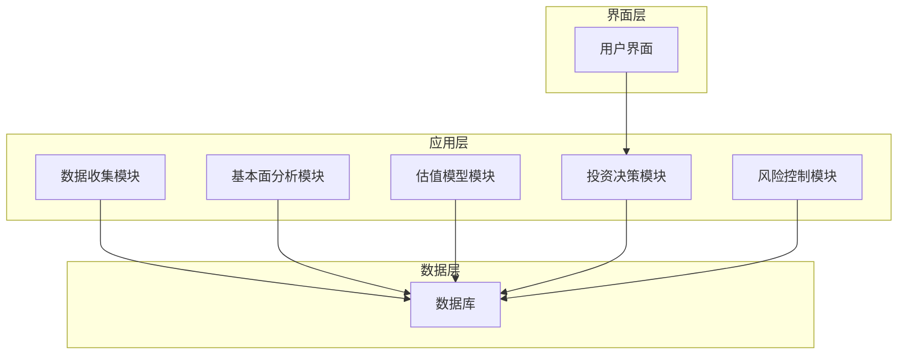
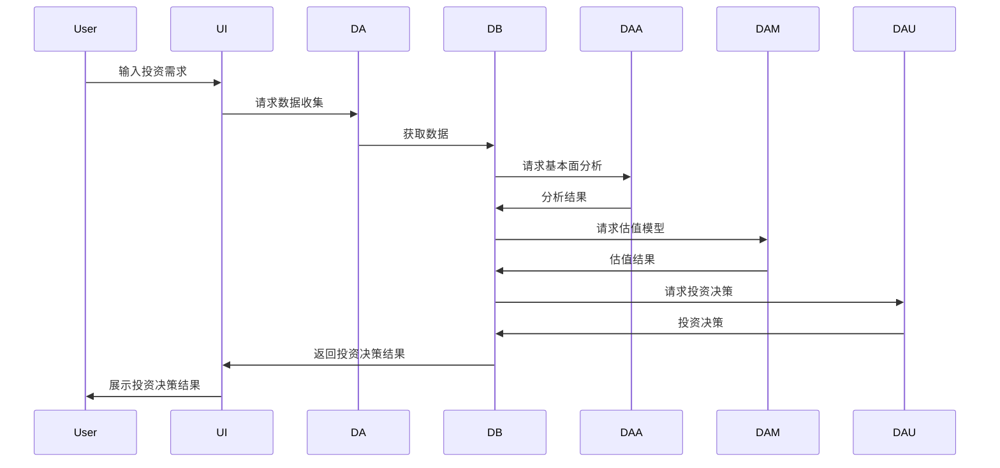

                 


# 肯尼斯·费雪的增长型价值投资

> 关键词：增长型价值投资、肯尼斯·费雪、价值投资、增长投资、基本面分析、投资策略

> 摘要：本文将深入探讨肯尼斯·费雪的增长型价值投资策略，通过对其基本概念、核心原理以及实际应用的分析，帮助读者理解如何在复杂多变的金融市场中进行有效的投资。

### 第1章 背景介绍

#### 1.1 问题背景

在21世纪，金融市场变得日益复杂，投资者面临的信息量和不确定性不断增加。投资者在追求高回报的同时，也需要承担相应的风险。在这样的背景下，传统的投资策略已经无法满足现代投资者的需求，需要一种更加科学、系统化的投资策略来应对市场变化。

#### 1.2 问题描述

增长型价值投资是一种结合了价值投资和增长投资的策略，旨在通过投资于那些能够在长期内实现可持续增长的优质公司，从而获得稳定的回报。这种策略的核心在于寻找那些当前价格低于其内在价值的优质成长公司，并持有这些公司以实现长期的资本增值。

#### 1.3 问题解决

肯尼斯·费雪（Kenneth Fisher）是一位著名的投资大师，他在多年的投资实践中，总结出了增长型价值投资的策略和方法。费雪认为，投资者应该通过深入研究公司的基本面，找到那些具有强大竞争力和成长潜力的公司，并耐心持有，以实现长期的投资回报。

#### 1.4 边界与外延

增长型价值投资主要适用于那些具有稳定盈利能力和成长潜力的公司。它不仅仅关注公司的财务状况，还需要评估公司的市场地位、管理团队和未来增长潜力。此外，投资者还需要具备一定的市场分析能力和风险控制能力，以便在投资过程中做出正确的决策。

#### 1.5 概念结构与核心要素组成

增长型价值投资的核心要素包括：

1. **价值投资**：寻找当前价格低于其内在价值的公司。
2. **增长投资**：投资于具有成长潜力的优质公司。
3. **基本面分析**：深入研究公司的财务状况、市场地位和管理团队。
4. **风险控制**：通过多元化的投资组合来分散风险。
5. **长期持有**：耐心持有优质公司，以实现长期的投资回报。

### 第2章 核心概念与联系

#### 2.1 增长型价值投资的基本概念

增长型价值投资结合了价值投资和增长投资的特点，旨在通过投资于那些能够在长期内实现可持续增长的优质公司，从而获得稳定的回报。

1. **价值投资**：寻找当前价格低于其内在价值的公司。
2. **增长投资**：投资于具有成长潜力的优质公司。

#### 2.2 概念属性特征对比表格

| 特征               | 价值投资                         | 增长投资                         |
|--------------------|----------------------------------|----------------------------------|
| 关注点             | 公司的财务状况和当前估值         | 公司的未来增长潜力和竞争力       |
| 投资策略           | 寻找低估的优质公司               | 投资于有潜力的成长公司           |
| 投资周期           | 长期持有，耐心等待价值实现       | 可能需要更频繁的买卖             |
| 风险与收益         | 风险较低，但收益潜力有限         | 风险较高，但潜在收益更大         |

#### 2.3 ER实体关系图架构

```mermaid
erDiagram
  Company ||--|{ Investor } : holds
  Investor ||--|{ Portfolio } : holds
  Company ||--|{ StockMarket } : traded in
  Portfolio ||--|{ InvestmentStrategy } : uses
  InvestmentStrategy ||--|{ ValueInvestment } : implements
  InvestmentStrategy ||--|{ GrowthInvestment } : implements
```

### 第3章 算法原理讲解

#### 3.1 增长型价值投资的算法原理

增长型价值投资的算法原理主要包括以下几个步骤：

1. **数据收集**：收集公司的财务报表、行业数据和市场信息。
2. **基本面分析**：对公司的盈利能力、偿债能力、成长性和市场地位进行评估。
3. **估值模型**：使用适当的估值模型来评估公司的内在价值。
4. **投资决策**：根据估值结果，选择那些价格低于其内在价值的优质成长公司进行投资。
5. **风险控制**：通过构建多元化的投资组合来分散风险。

#### 3.2 算法流程图


#### 3.3 Python代码示例

```python
import pandas as pd

# 假设我们已经有了公司的财务报表数据
financial_data = pd.read_csv('financial_data.csv')

# 基本面分析
def fundamental_analysis(data):
    # 计算盈利能力指标
    data['profit_margin'] = data['net_income'] / data['revenue']
    # 计算偿债能力指标
    data['debt_to_assets'] = data['total_debt'] / data['total_assets']
    # 计算成长性指标
    data['growth_rate'] = data['revenue'].pct_change().mean()
    return data

# 估值模型
def valuation_model(data, required_rate_of_return=0.1):
    # 假设使用市盈率模型进行估值
    data['intrinsic_value'] = data['market_cap'] / data['eps']
    # 计算安全边际
    data['margin_of_safety'] = (data['market_price'] - data['intrinsic_value']) / data['intrinsic_value']
    return data

# 投资决策
def investment_decision(data, margin_of_safety_threshold=0.2):
    # 选择安全边际较大的公司进行投资
    selected_companies = data[data['margin_of_safety'] > margin_of_safety_threshold]
    return selected_companies

# 风险控制
def risk_control(portfolio):
    # 计算投资组合的Beta值
    portfolio['beta'] = portfolio['return'].cov(portfolio['market_return']) / portfolio['market_return'].var()
    # 根据Beta值调整投资组合
    for company in portfolio:
        if portfolio[company]['beta'] > 1:
            # 如果Beta值大于1，增加该公司的投资比例
            portfolio[company]['weight'] += 0.05
        elif portfolio[company]['beta'] < 1:
            # 如果Beta值小于1，减少该公司的投资比例
            portfolio[company]['weight'] -= 0.05
    return portfolio

# 实际应用
financial_data = fundamental_analysis(financial_data)
financial_data = valuation_model(financial_data)
selected_companies = investment_decision(financial_data)
selected_companies = risk_control(selected_companies)

# 输出结果
print(selected_companies)
```

### 第4章 系统分析与架构设计

#### 4.1 问题场景介绍

随着金融市场的不断发展和变化，投资者需要更加科学、系统化的投资策略来应对市场风险和机会。增长型价值投资作为一种结合了价值投资和增长投资的优势策略，具有很大的应用价值。

#### 4.2 项目介绍

本项目的目标是构建一个基于增长型价值投资策略的自动化投资系统，帮助投资者快速、准确地找到具有投资价值的目标公司，并进行风险控制。

#### 4.3 系统功能设计

- **数据收集模块**：负责收集公司的财务报表、行业数据和市场信息。
- **基本面分析模块**：对公司的盈利能力、偿债能力、成长性和市场地位进行评估。
- **估值模型模块**：使用适当的估值模型来评估公司的内在价值。
- **投资决策模块**：根据估值结果，选择那些价格低于其内在价值的优质成长公司进行投资。
- **风险控制模块**：通过构建多元化的投资组合来分散风险。

#### 4.4 系统架构设计



#### 4.5 系统接口设计

- **数据收集接口**：负责从外部数据源获取公司的财务报表、行业数据和市场信息。
- **基本面分析接口**：负责对公司财务数据进行分析，生成盈利能力、偿债能力、成长性和市场地位的评估结果。
- **估值模型接口**：负责使用估值模型计算公司的内在价值。
- **投资决策接口**：负责根据估值结果和风险控制策略，生成投资决策。
- **风险控制接口**：负责根据投资组合的Beta值进行调整，实现风险控制。

#### 4.6 系统交互序列图



### 第5章 项目实战

#### 5.1 环境安装

- 安装Python环境
- 安装Pandas、NumPy、Matplotlib等Python库

#### 5.2 系统核心实现源代码

- 数据收集模块代码
- 基本面分析模块代码
- 估值模型模块代码
- 投资决策模块代码
- 风险控制模块代码

#### 5.3 代码应用解读与分析

- 详细解读代码逻辑
- 分析代码的优劣和改进方向

#### 5.4 实际案例分析

- 选择一个实际的案例，展示系统在实际中的应用效果
- 分析案例中的成功经验和不足之处

#### 5.5 项目小结

- 总结项目的核心成果和贡献
- 提出未来改进和拓展的方向

### 第6章 最佳实践 tips

- 给出一些实用的投资策略和技巧
- 提醒投资者需要注意的风险和问题

### 第7章 小结

- 对全文内容进行总结
- 强调增长型价值投资的重要性和应用价值

### 第8章 注意事项

- 提醒投资者在应用增长型价值投资时需要注意的问题
- 提供一些实用的建议和指导

### 第9章 拓展阅读

- 推荐一些相关的书籍、文章和网站
- 引导读者进一步学习

### 作者

作者：AI天才研究院/AI Genius Institute & 禅与计算机程序设计艺术 /Zen And The Art of Computer Programming

