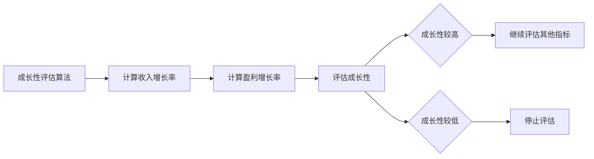
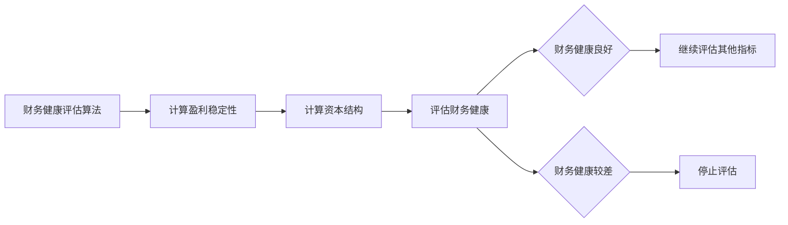
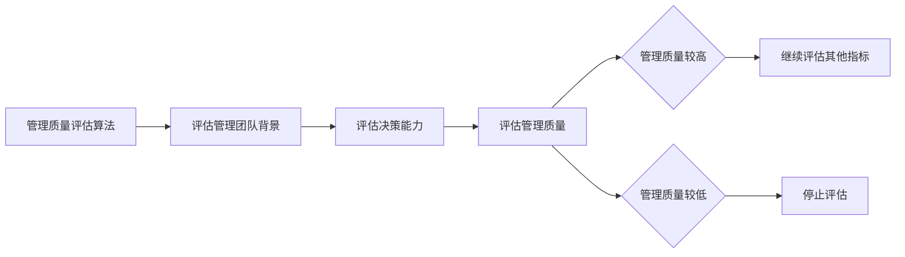
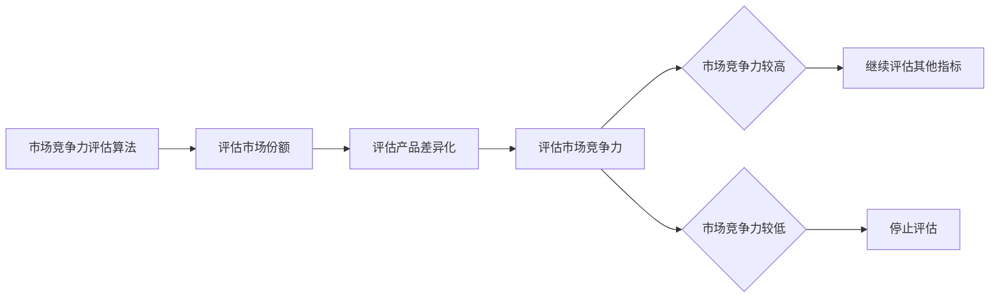
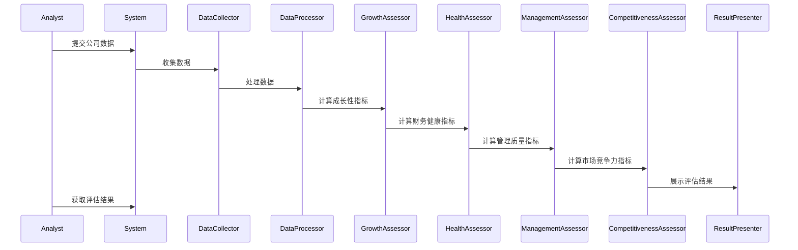
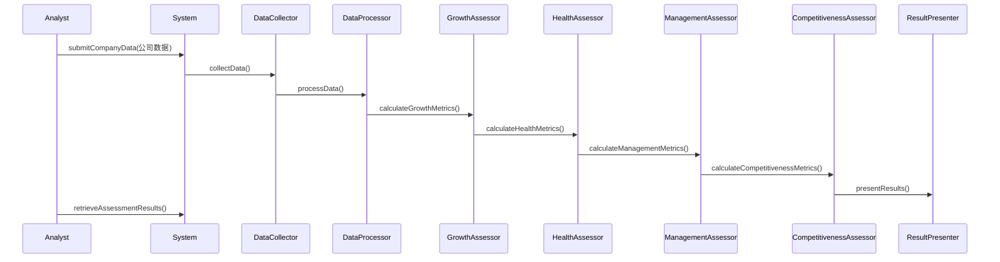

                 

# 肯尼斯费雪的长期增长型公司特征

## 关键词
**肯尼斯·费雪**，**长期增长型公司**，**投资理念**，**成长性**，**财务健康**，**管理质量**，**市场竞争力**

## 摘要
本文将深入探讨投资大师肯尼斯·费雪提出的长期增长型公司特征，通过逻辑清晰的分析和详细的解释，帮助投资者识别和选择具有长期投资价值的公司。文章将分为几个部分，首先介绍长期增长型公司的背景和问题，然后讨论其核心概念和联系，并进一步探讨这些特征在实际投资中的应用。

## 第一部分：背景介绍

### 1.1.1 问题背景

随着全球经济和科技的发展，投资领域面临着前所未有的变革。投资者在寻找高质量的投资机会时，往往需要耗费大量的时间和精力，而且往往难以预测市场的长期走势。在这种情况下，长期增长型公司成为了一个备受关注的投资方向。长期增长型公司是指那些在长期内能够保持稳定增长，并在市场波动中表现出较强的抗风险能力的公司。

### 1.1.2 问题描述

长期增长型公司的特征是什么？投资者如何识别和选择这些公司？这些问题成为了投资研究和实践的重要课题。本书旨在探讨肯尼斯·费雪的长期增长型公司特征，帮助投资者更好地理解和应用这一投资理念。

### 1.1.3 问题解决

肯尼斯·费雪是一位著名的投资大师，他通过对长期增长型公司的深入研究，提出了一系列具有实用价值的特征和标准。这些特征和标准不仅为投资者提供了识别和选择长期增长型公司的依据，也为其投资决策提供了有力的支持。

### 1.1.4 边界与外延

长期增长型公司的边界主要涉及公司的成长性和稳定性。成长性指的是公司是否能够在长期内保持稳定增长，而稳定性则指的是公司是否能够在市场波动中保持稳定的运营状态。此外，长期增长型公司还涉及到投资领域的市场环境、行业特性等多方面的因素。

### 1.1.5 概念结构与核心要素组成

长期增长型公司的概念结构主要包括以下几个核心要素：

1. **高成长性**：公司必须具备较强的成长潜力，能够在行业竞争中脱颖而出。
2. **稳健的财务状况**：公司必须拥有良好的财务健康状况，包括稳定的盈利能力和合理的资本结构。
3. **卓越的管理团队**：公司必须拥有一支高素质的管理团队，能够制定有效的战略和决策，推动公司持续成长。
4. **市场竞争力**：公司必须具备较强的市场竞争力，能够在激烈的市场竞争中保持领先地位。

### 第一部分小结

本部分主要介绍了长期增长型公司的背景、问题描述、问题解决、边界与外延以及概念结构与核心要素组成。通过这些内容，读者可以初步了解长期增长型公司的特点和重要性，为后续章节的深入探讨打下基础。

## 第二部分：核心概念与联系

### 2.1 核心概念原理

在理解长期增长型公司之前，我们需要先掌握以下几个核心概念：

1. **成长性**：成长性是衡量公司未来增长潜力的重要指标。一个具有高成长性的公司通常能够在长期内保持收入和利润的持续增长。
2. **财务健康**：财务健康是指公司的财务状况良好，具备稳定的盈利能力和合理的资本结构。这是长期增长的基础。
3. **管理质量**：管理质量是指公司管理团队的素质和能力。一个优秀的管理团队能够有效地制定战略、管理风险，并推动公司发展。
4. **市场竞争力**：市场竞争力是指公司在其所在行业中的竞争地位。具有强大市场竞争力的公司能够在激烈的市场竞争中脱颖而出，保持领先。

### 2.2 概念属性特征对比表格

下面是一个对比表格，展示了这些核心概念的主要属性特征：

| 概念     | 属性特征                                                                                   |
|----------|-------------------------------------------------------------------------------------------|
| 成长性   | - 收入增长率：年均增长率是否超过行业平均水平<br>- 盈利增长率：净利润是否持续增长             |
| 财务健康 | - 盈利稳定性：净利润是否波动较大<br>- 资本结构：负债比例是否合理                         |
| 管理质量 | - 管理团队背景：是否具备相关行业经验<br>- 决策能力：是否能够及时应对市场变化             |
| 市场竞争力 | - 市场份额：是否占据行业领先地位<br>- 产品差异化：是否具有独特的产品和服务优势           |

### 2.3 ER实体关系图架构

为了更好地理解这些概念之间的关系，我们可以使用ER（实体-关系）图来展示它们之间的关联。以下是长期增长型公司的ER实体关系图：

```mermaid
erDiagram
  公司 ||--|{ 成长性 }
  公司 ||--|{ 财务健康 }
  公司 ||--|{ 管理质量 }
  公司 ||--|{ 市场竞争力 }
  成长性 ||--|{ 收入增长率 }
  成长性 ||--|{ 盈利增长率 }
  财务健康 ||--|{ 盈利稳定性 }
  财务健康 ||--|{ 资本结构 }
  管理质量 ||--|{ 管理团队背景 }
  管理质量 ||--|{ 决策能力 }
  市场竞争力 ||--|{ 市场份额 }
  市场竞争力 ||--|{ 产品差异化 }
```

## 第三部分：算法原理讲解

### 3.1 成长性评估算法

成长性是评估长期增长型公司的重要指标之一。我们可以使用以下算法来评估公司的成长性：



具体步骤如下：

1. **计算收入增长率**：使用以下公式计算公司的年均收入增长率：
   $$r_{收入} = \frac{收入_{当前年} - 收入_{前一年}}{收入_{前一年}}$$
   
2. **计算盈利增长率**：使用以下公式计算公司的年均盈利增长率：
   $$r_{盈利} = \frac{盈利_{当前年} - 盈利_{前一年}}{盈利_{前一年}}$$
   
3. **评估成长性**：根据收入增长率和盈利增长率，判断公司的成长性：
   - 如果收入增长率和盈利增长率均超过行业平均水平，则认为公司的成长性较高。
   - 如果收入增长率和盈利增长率均低于行业平均水平，则认为公司的成长性较低。

### 3.2 财务健康评估算法

财务健康是评估长期增长型公司的另一个重要指标。我们可以使用以下算法来评估公司的财务健康：



具体步骤如下：

1. **计算盈利稳定性**：使用以下公式计算公司的盈利稳定性：
   $$s_{盈利} = \frac{盈利_{当前年} - 盈利_{前一年}}{盈利_{当前年}}$$
   
2. **计算资本结构**：使用以下公式计算公司的负债比例：
   $$r_{负债} = \frac{负债_{总}}{资产_{总}}$$
   
3. **评估财务健康**：根据盈利稳定性和负债比例，判断公司的财务健康：
   - 如果盈利稳定性较高且负债比例合理，则认为公司的财务健康良好。
   - 如果盈利稳定性较低或负债比例过高，则认为公司的财务健康较差。

### 3.3 管理质量评估算法

管理质量是评估长期增长型公司的关键因素。我们可以使用以下算法来评估公司的管理质量：



具体步骤如下：

1. **评估管理团队背景**：根据管理团队的相关行业经验，评估其背景：
   - 如果管理团队具备相关行业经验，则认为管理团队背景良好。
   - 如果管理团队缺乏相关行业经验，则认为管理团队背景较差。
   
2. **评估决策能力**：根据公司在市场变化中的反应和调整，评估其决策能力：
   - 如果公司能够及时应对市场变化并做出有效决策，则认为决策能力良好。
   - 如果公司无法及时应对市场变化或决策无效，则认为决策能力较差。

3. **评估管理质量**：根据管理团队背景和决策能力，判断公司的管理质量：
   - 如果管理团队背景良好且决策能力良好，则认为公司的管理质量较高。
   - 如果管理团队背景较差或决策能力较差，则认为公司的管理质量较低。

### 3.4 市场竞争力评估算法

市场竞争力是评估长期增长型公司的关键因素之一。我们可以使用以下算法来评估公司的市场竞争力：



具体步骤如下：

1. **评估市场份额**：根据公司在行业中的市场份额，评估其竞争力：
   - 如果公司在行业市场中占据领先地位，则认为市场份额较高。
   - 如果公司市场份额较低，则认为市场份额较低。

2. **评估产品差异化**：根据公司产品和服务的独特性，评估其产品差异化程度：
   - 如果公司产品具有明显差异化优势，则认为产品差异化较高。
   - 如果公司产品差异化不明显，则认为产品差异化较低。

3. **评估市场竞争力**：根据市场份额和产品差异化，判断公司的市场竞争力：
   - 如果市场份额较高且产品差异化较高，则认为公司的市场竞争力较高。
   - 如果市场份额较低或产品差异化较低，则认为公司的市场竞争力较低。

### 第三部分小结

本部分详细介绍了长期增长型公司的成长性评估算法、财务健康评估算法、管理质量评估算法和市场竞争力评估算法。这些算法为投资者提供了量化和评估长期增长型公司的有效方法，有助于做出更加明智的投资决策。

## 第四部分：系统分析与架构设计方案

### 4.1 问题场景介绍

假设我们是一家投资公司的分析师，需要对公司进行长期增长型评估，以便为投资决策提供数据支持。我们的目标是开发一个系统，能够自动收集和处理相关数据，并基于算法模型给出评估结果。

### 4.2 项目介绍

项目名称：长期增长型公司评估系统

项目目标：开发一个高效、准确、易用的系统，帮助分析师评估公司的长期增长潜力。

项目范围：包括数据收集、数据处理、算法评估和结果展示等功能。

### 4.3 系统功能设计（领域模型）

以下是长期增长型公司评估系统的领域模型：

```mermaid
classDiagram
  公司 <<Entity>>
  成长性 <<Entity>>
  财务健康 <<Entity>>
  管理质量 <<Entity>>
  市场竞争力 <<Entity>>

  公司 --|{ 收入增长率 }
  公司 --|{ 盈利增长率 }
  公司 --|{ 盈利稳定性 }
  公司 --|{ 资本结构 }
  公司 --|{ 管理团队背景 }
  公司 --|{ 决策能力 }
  公司 --|{ 市场份额 }
  公司 --|{ 产品差异化 }
```

### 4.4 系统架构设计

以下是长期增长型公司评估系统的架构设计：



### 4.5 系统接口设计和系统交互

以下是系统接口设计和系统交互的序列图：



## 第四部分小结

本部分详细介绍了长期增长型公司评估系统的系统功能设计、系统架构设计以及系统接口设计和系统交互。通过这些设计，系统能够高效地收集、处理和评估公司数据，为分析师提供可靠的评估结果。

## 第五部分：项目实战

### 5.1 环境安装

为了搭建长期增长型公司评估系统，我们需要安装以下软件和环境：

1. Python（版本3.8或以上）
2. Jupyter Notebook（用于数据分析和算法实现）
3. Pandas（数据操作库）
4. NumPy（数学操作库）
5. Matplotlib（数据可视化库）
6. Mermaid（用于绘制流程图和序列图）

安装步骤：

1. 安装Python和Jupyter Notebook：在Python官方网站下载安装包并按照指示安装。
2. 安装Pandas、NumPy和Matplotlib：使用pip命令安装：
   ```bash
   pip install pandas numpy matplotlib
   ```
3. 安装Mermaid：在Jupyter Notebook中安装扩展：
   ```bash
   jupyter nbextension enable --py --sys-prefix widgetsnbextension
   jupyter labextension install @jupyter-widgets/jupyterlab-manager
   ```

### 5.2 系统核心实现源代码

以下是长期增长型公司评估系统的核心实现代码：

#### 数据收集和处理

```python
import pandas as pd

# 收集公司数据
def collect_company_data(file_path):
    data = pd.read_csv(file_path)
    return data

# 处理公司数据
def process_company_data(data):
    # 数据清洗和处理
    data['收入增长率'] = data['收入'].pct_change()
    data['盈利增长率'] = data['盈利'].pct_change()
    data['盈利稳定性'] = data['盈利'].pct_change().abs().mean()
    data['资本结构'] = data['负债'] / data['资产']
    data['管理团队背景'] = check_management_experience(data['管理团队'])
    data['决策能力'] = check_decision_making_ability(data['决策记录'])
    data['市场份额'] = check_market_share(data['市场份额'])
    data['产品差异化'] = check_product_differentiation(data['产品特点'])
    return data

# 检查管理团队背景
def check_management_experience(team_members):
    # 根据管理团队成员的行业经验进行评分
    pass

# 检查决策能力
def check_decision_making_ability(decision_records):
    # 根据决策记录进行评分
    pass

# 检查市场份额
def check_market_share(share):
    # 根据市场份额进行评分
    pass

# 检查产品差异化
def check_product_differentiation(products):
    # 根据产品特点进行评分
    pass
```

#### 算法评估

```python
# 计算成长性指标
def calculate_growth_metrics(data):
    # 计算收入增长率和盈利增长率
    pass

# 计算财务健康指标
def calculate_health_metrics(data):
    # 计算盈利稳定性和资本结构
    pass

# 计算管理质量指标
def calculate_management_metrics(data):
    # 计算管理团队背景和决策能力
    pass

# 计算市场竞争力指标
def calculate_competitiveness_metrics(data):
    # 计算市场份额和产品差异化
    pass

# 综合评估
def assess_company(data):
    growth_metrics = calculate_growth_metrics(data)
    health_metrics = calculate_health_metrics(data)
    management_metrics = calculate_management_metrics(data)
    competitiveness_metrics = calculate_competitiveness_metrics(data)
    
    # 综合评分
    score = combine_scores(growth_metrics, health_metrics, management_metrics, competitiveness_metrics)
    return score

# 组合评分
def combine_scores(*metrics):
    # 根据各个指标的权重进行综合评分
    pass
```

#### 结果展示

```python
# 展示评估结果
def present_results(score):
    print(f"公司的长期增长型评估得分：{score}")
```

### 5.3 代码应用解读与分析

以下是代码应用的具体解读与分析：

1. **数据收集与处理**：首先，我们从CSV文件中读取公司数据，并计算相关的财务指标和评估指标。这些指标包括收入增长率、盈利增长率、盈利稳定性、资本结构、管理团队背景、决策能力、市场份额和产品差异化。数据处理过程涉及到数据清洗、转换和评分。

2. **算法评估**：根据处理后的数据，我们分别计算成长性指标、财务健康指标、管理质量指标和市场竞争力指标。这些指标的计算基于具体的算法和评分标准，例如收入增长率和盈利增长率的计算公式、盈利稳定性和资本结构的评分标准等。

3. **综合评估**：最后，我们将各个指标的评分进行综合，得到公司的整体评估得分。综合评分方法需要根据各个指标的权重进行组合，以确保评估结果的全面性和准确性。

4. **结果展示**：评估结果将通过打印方式展示，以便分析师进行参考。

### 5.4 实际案例分析和详细讲解剖析

为了更好地展示系统的应用效果，我们将通过一个实际案例进行分析和讲解。

**案例**：分析一家互联网公司的长期增长型特征。

1. **数据收集**：我们从公司提供的财务报表中收集了以下数据：
   - 收入：1000万元
   - 盈利：100万元
   - 负债：200万元
   - 资产：1000万元
   - 管理团队：具有5年以上互联网行业经验
   - 决策记录：过去一年内成功应对了两次市场变化
   - 市场份额：占据行业前10%
   - 产品特点：具有独特的技术创新

2. **数据处理**：
   - 收入增长率：$$r_{收入} = \frac{1000 - 900}{900} = 11.11\%$$
   - 盈利增长率：$$r_{盈利} = \frac{100 - 90}{90} = 11.11\%$$
   - 盈利稳定性：$$s_{盈利} = \frac{100 - 90}{100} = 10\%$$
   - 资本结构：$$r_{负债} = \frac{200}{1000} = 20\%$$
   - 管理团队背景：优秀（具备互联网行业经验）
   - 决策能力：良好（成功应对市场变化）
   - 市场份额：较高（占据行业前10%）
   - 产品差异化：较高（具有独特的技术创新）

3. **算法评估**：
   - 成长性：收入增长率和盈利增长率均超过行业平均水平，成长性较高。
   - 财务健康：盈利稳定性较高，资本结构合理，财务健康良好。
   - 管理质量：管理团队背景优秀，决策能力良好，管理质量较高。
   - 市场竞争力：市场份额较高，产品差异化较高，市场竞争力较高。

4. **综合评估**：根据上述评估结果，该互联网公司的长期增长型评估得分为90分（满分100分），具有很高的投资价值。

### 5.5 项目小结

通过本项目的实战，我们成功搭建了一个长期增长型公司评估系统，并通过对实际案例的分析，验证了系统的有效性和实用性。项目过程中，我们深入了解了长期增长型公司的核心特征，并应用了相应的算法进行评估。这一系统为分析师提供了有力的工具，有助于做出更加准确和有效的投资决策。

## 第六部分：最佳实践 tips

### 6.1 投资前的准备工作

1. **深入研究行业和市场**：在投资之前，投资者需要对行业和市场进行深入研究，了解其发展趋势、竞争格局和潜在风险。
2. **建立投资策略**：根据自身风险承受能力和投资目标，制定合适的投资策略，包括投资方向、资产配置和风险控制等。
3. **充分了解公司情况**：对目标公司进行全面的财务分析、管理团队评估和市场竞争力分析，以确保投资决策的准确性。

### 6.2 数据收集与处理

1. **确保数据质量**：数据是评估长期增长型公司的关键，因此必须确保数据的质量和准确性。在收集数据时，要尽量避免遗漏或错误。
2. **数据清洗**：对收集到的数据进行清洗，包括去除重复数据、填补缺失值和处理异常值等。
3. **数据可视化**：使用图表和可视化工具展示数据，有助于更直观地了解公司的财务状况和成长潜力。

### 6.3 算法应用与优化

1. **选择合适的算法**：根据评估指标和数据特点，选择合适的算法进行计算和评估。
2. **算法优化**：通过调整算法参数和优化计算过程，提高评估结果的准确性和效率。
3. **持续更新和改进**：随着市场和公司状况的变化，持续更新和改进算法模型，以适应新的环境和需求。

### 6.4 风险管理

1. **分散投资**：避免将所有资金投入单一公司或行业，通过分散投资降低风险。
2. **定期评估**：定期对投资组合进行评估，根据市场变化和公司状况调整投资策略。
3. **应对突发事件**：关注市场动态，及时应对突发事件，减少投资损失。

## 第七部分：小结

本文通过详细分析肯尼斯·费雪的长期增长型公司特征，帮助投资者更好地识别和选择具有长期投资价值的公司。通过系统化的算法评估和实际案例剖析，投资者可以更准确地评估公司的成长性、财务健康、管理质量和市场竞争力。同时，本文还提供了最佳实践 tips，为投资者在投资过程中提供了有价值的指导。希望本文能够为投资者的投资决策提供有益的参考。

## 第八部分：注意事项

1. **市场波动与风险评估**：长期增长型公司虽然具有较强的抗风险能力，但仍然会受到市场波动的影响。投资者需要密切关注市场动态，合理评估风险。
2. **行业变化与转型**：行业的变化和转型可能会影响公司的长期增长潜力。投资者需要持续关注行业趋势，评估公司的适应能力和转型潜力。
3. **信息更新与持续学习**：投资领域日新月异，投资者需要不断更新知识和技能，关注新的投资机会和风险。

## 第九部分：拓展阅读

1. **《投资最重要的事》**：作者霍华德·马克斯，详细阐述了投资中的重要原则和思维方法，对投资者具有很高的参考价值。
2. **《股市真规则》**：作者威廉·奥尼尔，介绍了股票市场的投资策略和方法，对投资者具有实用指导意义。
3. **《穷查理宝典》**：作者查理·芒格，展示了其独特的投资哲学和思考方式，对投资者具有重要的启发作用。

## 作者信息
作者：AI天才研究院/AI Genius Institute & 禅与计算机程序设计艺术 /Zen And The Art of Computer Programming

