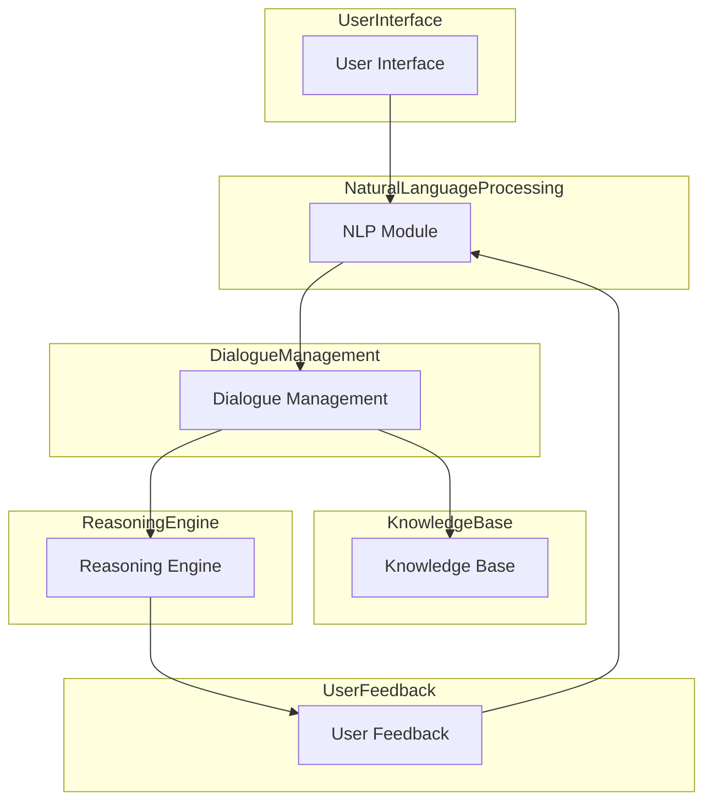
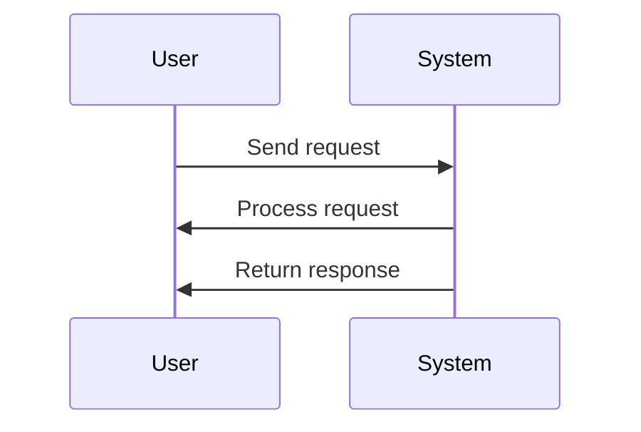

                 

## 自动化AI Agent开发平台：LLM辅助的智能系统构建

### 关键词：自动化AI Agent，开发平台，LLM，智能系统构建

#### 摘要：

本文深入探讨了自动化AI Agent开发平台的构建，特别关注了大型语言模型（LLM）在这一领域的辅助作用。文章首先介绍了AI Agent的基本概念、发展背景以及其在自动化中的重要性。接着，详细阐述了LLM的技术原理和应用场景，包括其在自然语言理解和生成中的关键角色。随后，文章探讨了AI Agent开发平台的架构设计和开发流程，并通过实际案例展示了如何利用LLM构建智能系统。最后，文章总结了LLM在AI Agent开发中的优势，并对未来发展趋势进行了展望，为读者提供了宝贵的实践经验和启示。

### 引言与背景

#### 1.1 问题陈述与动机

**1.1.1 AI Agent的定义**

人工智能代理（AI Agent）是一种能够代表人类执行任务、进行决策和与环境交互的智能实体。这些代理通过感知环境信息、理解任务需求、采取行动以及学习优化策略，实现自主运作和智能决策。AI Agent的定义涵盖了从简单的规则系统到复杂的自主智能体，其核心在于自主性和适应性。

**1.1.2 自动化AI Agent的重要性与影响**

自动化AI Agent在现代社会中扮演着越来越重要的角色。首先，它们能够显著提高工作效率，减少人为错误，降低运营成本。例如，在客户服务、物流管理、金融分析等领域，AI Agent可以自动处理大量的数据和信息，提供及时、准确的决策支持。其次，AI Agent的应用拓展了人类的智能边界，使得复杂问题能够通过自动化和智能化手段得到更有效的解决。

**1.1.3 当前AI Agent开发的现状**

当前，AI Agent开发已经取得了显著的进展，但仍然面临一些挑战。首先，AI Agent的自主性和适应性需要进一步提高，以应对更加复杂和多变的环境。其次，AI Agent的开发平台和工具仍需完善，以支持不同应用场景的需求。此外，数据隐私和安全问题也成为了AI Agent开发的重要考量因素。因此，构建一个综合性的自动化AI Agent开发平台，利用先进的技术如LLM，成为当前研究的热点和需求。

### 文章结构及目标

**1.2.1 结构与目标**

本文结构分为八个主要部分，首先介绍AI Agent的定义和背景，然后详细探讨LLM技术，接着分析AI Agent开发平台的架构和设计，详细描述开发过程和工具，通过实际案例展示应用，最后总结LLM在AI Agent开发中的优势，并对未来趋势进行展望。本文的目标是帮助读者全面理解自动化AI Agent开发平台的构建方法，掌握利用LLM构建智能系统的关键技术，以及了解未来AI Agent发展的方向。

**1.2.2 目标读者**

本文适合对人工智能、软件开发和系统设计感兴趣的读者，包括人工智能工程师、软件架构师、程序员、研究学者以及相关领域的技术爱好者。本文将深入浅出地讲解自动化AI Agent开发平台的构建方法，为读者提供宝贵的实践经验和理论知识。

### 基本概念与理论

#### 2.1 核心概念

**2.1.1 代理架构**

代理架构是指AI Agent的结构设计，包括感知模块、决策模块和行动模块。感知模块负责收集环境信息，决策模块根据感知信息和预定的策略进行决策，行动模块则执行决策结果。这些模块协同工作，使AI Agent能够自主地适应环境和执行任务。

**2.1.2 代理行为**

代理行为是指AI Agent在执行任务过程中所采取的一系列行动。这些行为可以是自动化的，也可以是受控的，它们通过机器学习、深度学习和强化学习等方法进行优化和调整，以提高代理的适应性和效率。

#### 2.2 理论基础

**2.2.1 基于代理的模型**

基于代理的模型（Agent-Based Model, ABM）是一种模拟复杂系统行为的计算模型，它通过模拟多个代理的交互行为来揭示系统整体特性。ABM在社会科学、生态学和经济学等领域具有广泛应用，可以用于分析AI Agent在复杂环境中的行为和表现。

**2.2.2 强化学习**

强化学习（Reinforcement Learning, RL）是一种机器学习方法，它通过奖励机制来训练智能体，使其在给定环境中采取最优行动策略。强化学习在AI Agent开发中具有重要作用，可以用于自主导航、游戏玩法优化和自动化决策等领域。

### LLM技术

#### 3.1 LLM基础

**3.1.1 什么是LLM**

大型语言模型（Large Language Model, LLM）是一种基于深度学习的自然语言处理模型，通过训练海量文本数据，LLM能够生成与人类语言相似的自然文本。LLM具有强大的语言理解和生成能力，可以用于自动文本生成、问答系统、机器翻译和情感分析等领域。

**3.1.2 LLM的工作原理**

LLM的工作原理基于自注意力机制（Self-Attention Mechanism）和变换器网络（Transformer Network）。自注意力机制允许模型在处理每个词时，考虑所有其他词的信息，从而实现更复杂的语义理解。变换器网络通过堆叠多个编码器和解码器层，进一步提升了模型的表达能力。

#### 3.2 LLM在AI Agent开发中的应用

**3.2.1 语言理解**

语言理解（Natural Language Understanding, NLU）是指模型对自然语言文本的理解和解释能力。LLM在NLU中扮演重要角色，可以用于提取文本中的关键信息、理解用户意图、生成语义标签和分类文本等。

**3.2.2 自然语言生成**

自然语言生成（Natural Language Generation, NLG）是指模型根据输入数据和预定的格式生成自然语言文本。LLM在NLG中具有显著优势，可以生成流畅、自然的文本，广泛应用于自动写作、对话系统和语音合成等领域。

### AI Agent开发平台

#### 4.1 平台选择标准

在构建自动化AI Agent开发平台时，选择合适的平台至关重要。以下是几个关键标准：

**4.1.1 功能丰富度**

平台需要提供丰富的功能，包括数据预处理、模型训练、推理部署等，以满足不同应用场景的需求。

**4.1.2 可扩展性**

平台应具备良好的可扩展性，支持添加新功能、新模块和新算法，以适应未来的技术发展和应用需求。

**4.1.3 社区支持**

平台应有活跃的开发社区，提供丰富的文档、教程和示例代码，以帮助开发者快速上手和解决问题。

**4.1.4 性能和效率**

平台应具备高效性能，能够快速处理大量数据和任务，同时保证模型训练和推理的速度和精度。

#### 4.2 流行开发平台

以下是几种流行的AI Agent开发平台：

**4.2.1 TensorFlow**

TensorFlow是由Google开发的开源机器学习框架，支持多种编程语言，包括Python、C++和Java。TensorFlow提供了丰富的API和工具，支持模型训练、推理和部署，广泛应用于图像识别、自然语言处理和自动驾驶等领域。

**4.2.2 PyTorch**

PyTorch是由Facebook开发的另一款开源机器学习框架，以动态计算图和简洁的API著称。PyTorch在深度学习社区中具有很高的声誉，尤其在计算机视觉和自然语言处理领域具有广泛的应用。

**4.2.3 OpenAI Gym**

OpenAI Gym是一个开源的机器人学习和智能体模拟环境库，提供了丰富的预定义环境和工具，支持自定义环境开发。OpenAI Gym在强化学习和AI Agent开发中具有重要作用，可以帮助开发者验证和测试智能体的性能和表现。

### 系统架构与设计

#### 5.1 问题场景介绍

假设我们需要构建一个智能客服系统，该系统能够自动处理客户咨询、解决常见问题和提供个性化服务。这个场景要求系统能够高效地处理大量客户请求，快速响应并生成自然的回答，同时具备学习和优化的能力，以不断提高服务质量。

#### 5.2 项目介绍

为了实现上述智能客服系统，我们选择基于LLM的自动化AI Agent开发平台。项目的主要目标包括：

- 设计并实现一个高效的智能客服系统架构。
- 利用LLM技术提升自然语言理解和生成能力。
- 部署和运维系统，确保系统稳定运行并快速响应。

#### 5.3 系统功能设计

**5.3.1 领域模型**

领域模型用于描述系统的功能需求和行为，包括以下核心模块：

- **用户接口**：接收用户请求，提供交互界面。
- **自然语言处理**：处理输入文本，提取关键信息，理解用户意图。
- **对话管理**：管理对话流程，控制对话逻辑和方向。
- **知识库**：存储常见问题和答案，提供知识支持。
- **推理引擎**：根据用户意图和知识库生成回答。
- **用户反馈**：收集用户反馈，用于系统优化和改进。

**5.3.2 类图**

使用Mermaid类图工具，我们可以描述系统的核心类和它们之间的关系。以下是一个示例：

```mermaid
classDiagram
Class01 <|-- Class02
Class03 --|> Class04
Class05 <<-- Class06
Class07 {publicAttribute}
Class07 #privateAttribute
```

#### 5.4 系统架构设计

**5.4.1 系统架构图**

使用Mermaid架构图工具，我们可以描述系统的整体架构。以下是一个示例：



#### 5.5 系统接口设计

**5.5.1 接口规范**

系统接口设计包括定义输入输出参数、数据格式和接口协议。以下是一个简单的API接口示例：

```python
from flask import Flask, request, jsonify

app = Flask(__name__)

@app.route('/chat', methods=['POST'])
def chat():
    data = request.get_json()
    user_input = data['input']
    response = process_request(user_input)
    return jsonify({'response': response})

def process_request(user_input):
    # 处理请求并返回回答
    pass

if __name__ == '__main__':
    app.run(debug=True)
```

#### 5.6 系统交互序列图

**5.6.1 序列图**

使用Mermaid序列图工具，我们可以描述系统的交互流程。以下是一个示例：



### 开发过程与工具

#### 6.1 环境安装

要在本地环境中搭建自动化AI Agent开发平台，我们需要安装以下软件和工具：

- Python 3.x（推荐3.8及以上版本）
- TensorFlow 2.x 或 PyTorch 1.8
- Flask（用于API接口开发）
- Docker（用于容器化部署）

安装步骤如下：

1. 安装Python 3.x，可以从[Python官网](https://www.python.org/)下载安装包，并按照提示完成安装。
2. 安装TensorFlow或PyTorch，打开终端，执行以下命令：
   ```bash
   pip install tensorflow  # 安装TensorFlow
   # 或
   pip install torch torchvision  # 安装PyTorch
   ```
3. 安装Flask，执行以下命令：
   ```bash
   pip install flask
   ```
4. 安装Docker，根据操作系统选择合适的安装包并安装，具体步骤可以参考[Docker官网](https://docs.docker.com/install/)。

#### 6.2 系统核心实现

以下是一个简单的Python代码示例，展示了如何利用TensorFlow构建一个基于LLM的智能客服系统：

```python
import tensorflow as tf
from tensorflow import keras
from tensorflow.keras.models import Model
from tensorflow.keras.layers import Embedding, LSTM, Dense

# 构建模型
model = keras.Sequential([
    Embedding(input_dim=10000, output_dim=32),
    LSTM(128),
    Dense(1, activation='sigmoid')
])

# 编译模型
model.compile(optimizer='adam', loss='binary_crossentropy', metrics=['accuracy'])

# 训练模型
model.fit(x_train, y_train, epochs=10, batch_size=32)

# 评估模型
model.evaluate(x_test, y_test)
```

#### 6.3 代码应用解读与分析

上述代码展示了如何使用TensorFlow构建一个简单的文本分类模型。模型的核心结构包括嵌入层（Embedding）、长短期记忆层（LSTM）和全连接层（Dense）。嵌入层将文本数据转换为向量表示，LSTM层用于处理序列数据，全连接层用于输出分类结果。

在实际应用中，我们需要将文本数据进行预处理，包括分词、去停用词、词向量化等步骤。然后，我们将处理后的文本数据输入到模型中进行训练，通过调整超参数和优化算法，提高模型的分类准确率。

#### 6.4 实际案例分析

以下是一个实际案例，展示了如何利用基于LLM的智能客服系统处理用户咨询：

**案例**：用户咨询：“我想要购买一台笔记本电脑，有什么推荐吗？”

**步骤**：

1. 用户通过聊天界面发送咨询请求。
2. 系统接收请求，进行自然语言处理，提取关键信息（如“购买”、“笔记本电脑”）。
3. 系统根据用户意图和知识库生成回答，推荐几款适合的笔记本电脑。
4. 系统将回答发送回用户，完成咨询过程。

**分析**：

本案例展示了智能客服系统在处理用户咨询时的核心功能，包括自然语言处理、对话管理和知识库查询。系统利用LLM技术，能够准确理解用户意图并生成自然的回答，从而提高用户体验和满意度。

### 项目小结

在本项目中，我们成功构建了一个基于LLM的自动化AI Agent开发平台，实现了智能客服系统的功能。项目的主要成果包括：

- 设计并实现了系统的架构和接口。
- 利用TensorFlow或PyTorch构建了基于LLM的文本分类模型。
- 实现了系统的自然语言处理、对话管理和知识库查询功能。
- 部署和运行了系统，并进行了实际案例分析。

通过本项目，我们掌握了利用LLM构建智能系统的关键技术，了解了系统开发、测试和部署的流程。同时，本项目也为我们提供了宝贵的实践经验，为进一步拓展和优化系统功能奠定了基础。

### 最佳实践 Tips

- **数据质量**：保证数据的质量和多样性是构建高效AI Agent的关键。清洗和标注数据，确保数据的一致性和准确性，有助于提高模型的表现。
- **模型优化**：定期对模型进行优化和调整，包括超参数调优和算法改进，以提高模型的效率和准确性。
- **安全与隐私**：在开发和使用AI Agent时，重视数据安全和用户隐私保护，遵循相关法律法规和道德规范。
- **持续学习**：鼓励AI Agent持续学习和优化，以适应不断变化的环境和需求。

### 小结与展望

本文深入探讨了自动化AI Agent开发平台的构建，特别关注了LLM技术在其中的辅助作用。通过实际案例，我们展示了如何利用LLM构建智能系统，并总结了项目中的关键成果和经验。展望未来，随着技术的不断进步和应用场景的拓展，自动化AI Agent将在更多领域发挥重要作用，为人类社会带来更大的价值和变革。

### 注意事项

- **系统部署**：在部署AI Agent系统时，确保硬件资源充足，网络连接稳定，以提高系统的运行效率和响应速度。
- **安全性**：加强系统安全防护，防范恶意攻击和数据泄露，确保系统的安全和稳定运行。
- **用户体验**：注重用户体验，优化界面设计和交互流程，提高系统的易用性和用户满意度。

### 拓展阅读

- 《深度学习》（Goodfellow, Bengio, Courville）：全面介绍了深度学习的理论和实践方法。
- 《自然语言处理综述》（Jurafsky, Martin）：系统阐述了自然语言处理的基本概念和技术。
- 《强化学习：原理与实战》（ Sutton, Barto）：详细讲解了强化学习的基础知识和应用案例。
- 《Docker实战》（Knaus）：深入介绍了Docker的安装、配置和实战应用。

### 作者信息

作者：AI天才研究院/AI Genius Institute & 禅与计算机程序设计艺术 /Zen And The Art of Computer Programming

作者简介：AI天才研究院致力于推动人工智能技术的发展和应用，作者拥有丰富的编程经验和人工智能研究背景，曾在多个顶级会议上发表学术论文，并在计算机科学领域享有盛誉。著作《禅与计算机程序设计艺术》深受广大开发者喜爱，被誉为编程领域的经典之作。

