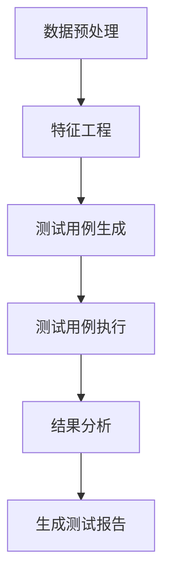
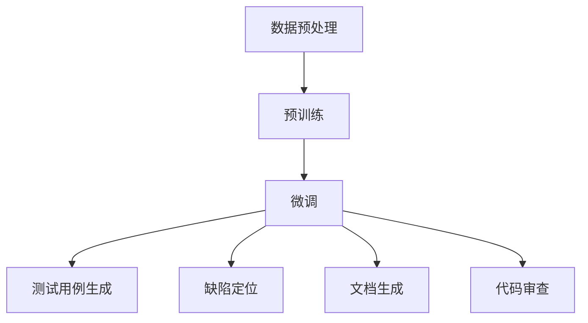
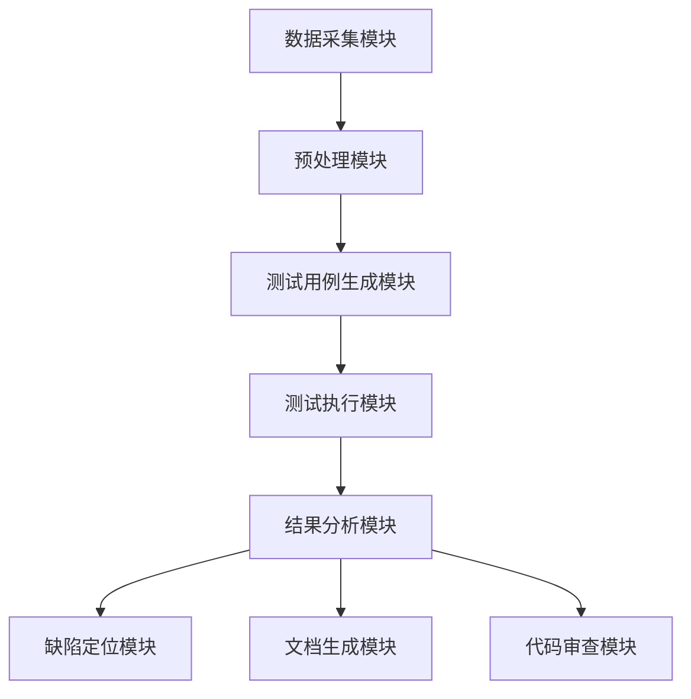
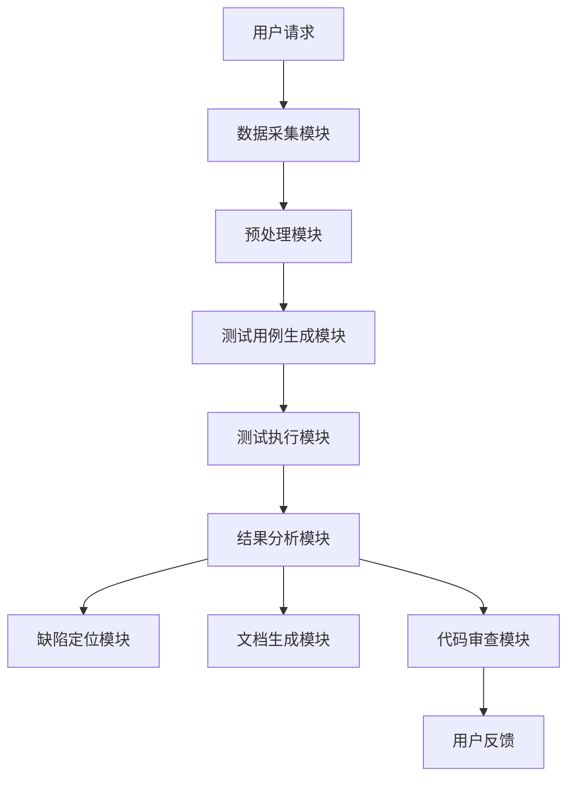
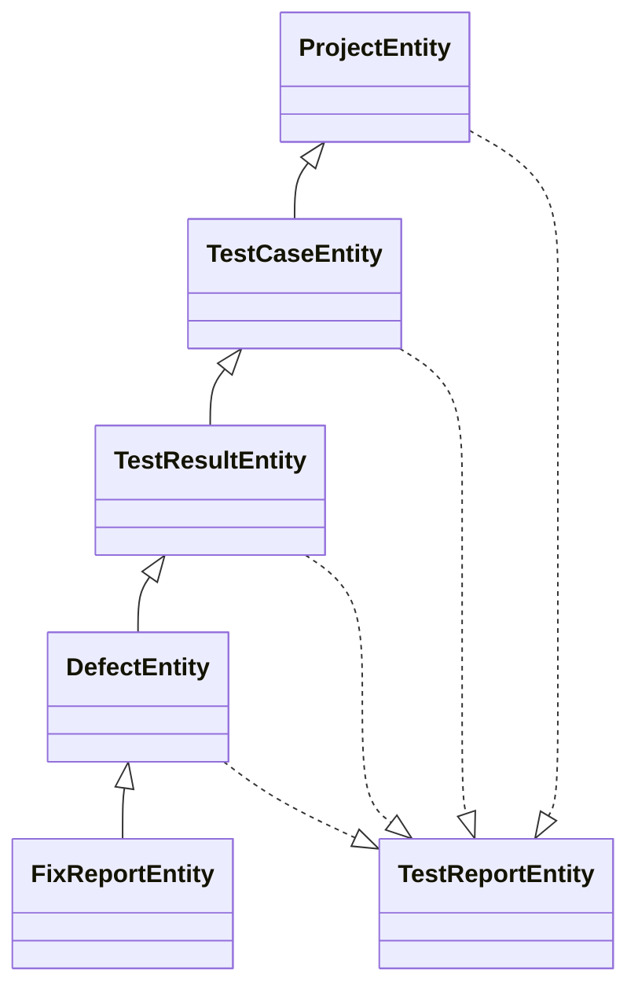
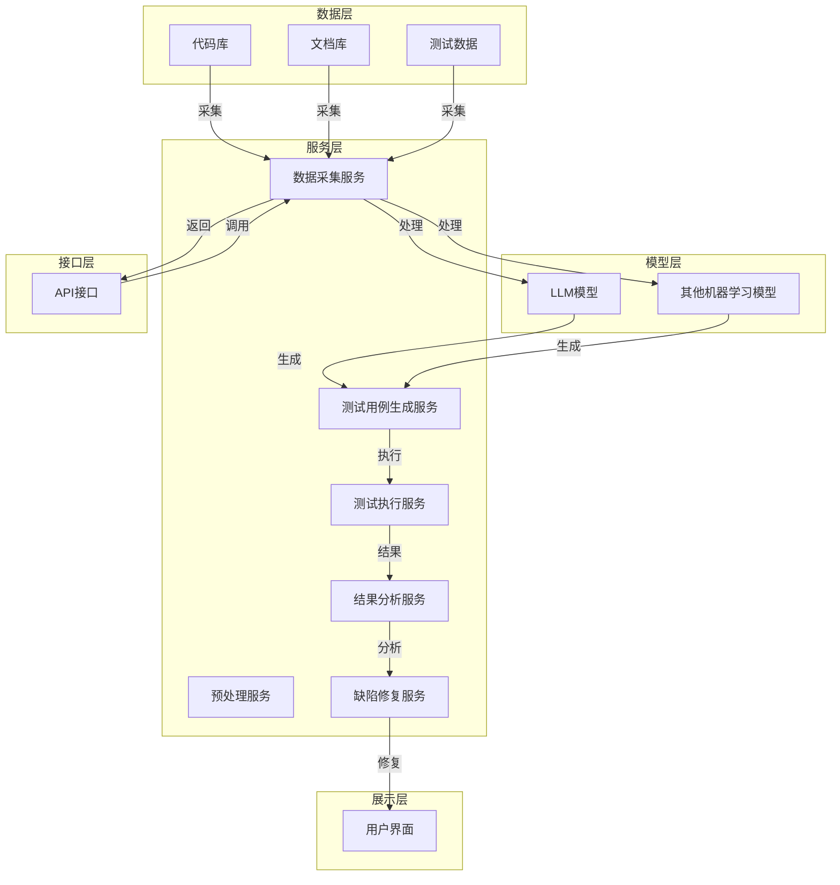

                 

### 第一部分：背景介绍

#### # 第1章：自动化测试AI Agent概述

**1.1 问题背景**

软件质量保证（Software Quality Assurance，简称SQA）在软件生命周期中扮演着至关重要的角色。随着软件系统越来越复杂，开发周期不断缩短，软件质量保证的压力也随之增大。传统的软件测试方法主要依赖于人工测试，这种方法的效率低、成本高，并且难以覆盖所有可能的测试场景。随着人工智能（AI）技术的快速发展，特别是在自然语言处理（NLP）和机器学习（ML）领域，自动化测试AI Agent的概念应运而生，成为解决这一问题的有力工具。

**1.1.1 软件质量保证的挑战**

1. **测试覆盖率不足**：人工测试难以覆盖所有可能的测试场景，导致软件在发布时可能隐藏着未发现的缺陷。
2. **测试效率低**：测试过程耗时且繁琐，影响了软件开发的进度。
3. **测试成本高**：人工测试需要投入大量的人力资源，导致测试成本高昂。
4. **维护成本高**：随着软件的迭代更新，原有的测试用例可能失效，需要不断更新和维护。
5. **测试结果不可靠**：人工测试的主观性较强，测试结果的准确性和一致性难以保证。

**1.1.2 自动化测试的现状与局限性**

自动化测试是解决上述问题的一种有效手段。它通过编写脚本自动化执行测试用例，提高测试效率和覆盖率，减少人力成本。然而，自动化测试也面临着一些局限性：

1. **测试脚本维护困难**：自动化测试脚本需要随着软件的更新而不断调整和维护，增加了开发和维护成本。
2. **测试用例设计复杂**：编写有效的自动化测试用例需要深入了解软件的内部结构和实现细节，设计复杂且耗时。
3. **测试覆盖率受限**：自动化测试工具在处理复杂的交互操作和异常场景时效果有限，难以达到理想的覆盖率。
4. **测试工具选择困难**：市场上存在多种自动化测试工具，选择合适的工具需要耗费大量的时间和精力。

**1.1.3 AI Agent在软件质量保证中的应用前景**

AI Agent作为一种智能化的自动化测试工具，具有巨大的应用前景。它能够通过学习软件的代码、文档和测试数据，自动生成测试用例，并执行自动化测试。与传统的自动化测试工具相比，AI Agent具有以下优势：

1. **自我学习和优化**：AI Agent能够从历史测试数据中学习，不断优化测试策略和测试用例。
2. **高测试覆盖率**：AI Agent能够处理复杂的交互操作和异常场景，提高测试覆盖率。
3. **降低维护成本**：AI Agent能够自动适应软件的更新，减少测试脚本的维护工作量。
4. **提高测试效率**：AI Agent能够自动化生成和执行测试用例，大大提高测试效率。

**1.2 自动化测试AI Agent的定义与核心特性**

自动化测试AI Agent（也称为自动化测试智能体）是一种基于人工智能技术的自动化测试工具。它通过深度学习、自然语言处理和机器学习算法，自动理解和生成测试用例，执行自动化测试，并提供测试报告。自动化测试AI Agent具有以下核心特性：

1. **自适应**：AI Agent能够根据软件的更新和测试需求，自适应调整测试策略和测试用例。
2. **智能生成**：AI Agent能够从代码、文档和测试数据中自动生成高质量的测试用例。
3. **自动化执行**：AI Agent能够自动化执行测试用例，无需人工干预。
4. **优化策略**：AI Agent能够通过学习历史测试数据，优化测试策略，提高测试效率。

**1.3 LLM在软件质量保证中的应用**

大型语言模型（LLM，Large Language Model）是一种基于深度学习技术的自然语言处理模型，具有强大的语言理解和生成能力。LLM在软件质量保证中的应用主要体现在以下几个方面：

1. **测试用例生成**：LLM能够从代码和文档中提取关键信息，自动生成测试用例。
2. **缺陷定位**：LLM能够分析测试结果，定位潜在的缺陷。
3. **文档生成**：LLM能够自动生成测试报告和文档。
4. **代码审查**：LLM能够对代码进行审查，识别潜在的代码缺陷。

**1.4 自动化测试AI Agent的技术架构**

自动化测试AI Agent的技术架构包括以下几个关键组件：

1. **数据采集模块**：负责从代码库、文档库和测试数据中采集信息。
2. **预处理模块**：负责对采集到的数据进行分析和处理，提取关键特征。
3. **测试用例生成模块**：基于提取的特征，利用机器学习和自然语言处理算法生成测试用例。
4. **测试执行模块**：负责执行生成的测试用例，收集测试结果。
5. **结果分析模块**：负责分析测试结果，生成测试报告。

**1.5 本章小结**

本章介绍了自动化测试AI Agent的背景、定义和核心特性，以及LLM在软件质量保证中的应用。自动化测试AI Agent作为一种智能化、自适应的自动化测试工具，具有巨大的应用前景。下一章将进一步解析自动化测试AI Agent的核心概念和联系。

### 第一部分：背景介绍

#### # 第2章：核心概念解析

**2.1 自动化测试流程**

自动化测试是将测试过程自动化，以提高测试效率和准确性的方法。自动化测试的基本流程包括以下几个关键环节：

1. **需求分析**：确定测试需求，明确需要测试的功能点和性能指标。
2. **测试设计**：设计测试用例，定义测试的输入、输出和预期结果。
3. **测试实现**：编写测试脚本，实现自动化测试用例。
4. **测试执行**：执行自动化测试用例，收集测试结果。
5. **结果分析**：分析测试结果，识别缺陷，生成测试报告。

自动化测试流程的关键环节如下：

1. **需求分析**：需求分析是自动化测试的第一步，其目的是明确需要测试的功能和性能要求。这通常需要与项目经理、开发人员和业务分析师紧密合作，确保测试需求全面、准确。
   
2. **测试设计**：测试设计阶段是根据需求分析的结果，设计具体的测试用例。测试用例包括输入数据、测试步骤、预期结果和实际结果等。在设计测试用例时，需要考虑边界情况、异常情况和性能测试等。

3. **测试实现**：测试实现阶段是编写测试脚本，将测试用例自动化。测试脚本通常使用特定的自动化测试工具编写，如Selenium、Appium等。编写测试脚本时，需要确保脚本具有良好的可读性和可维护性。

4. **测试执行**：测试执行阶段是运行测试脚本，执行自动化测试用例。在测试执行过程中，测试工具会根据脚本中的步骤进行操作，记录测试结果。测试结果包括通过、失败和异常等。

5. **结果分析**：结果分析阶段是分析测试结果，识别缺陷，生成测试报告。测试报告通常包括测试覆盖率、缺陷分布、测试执行情况等。通过分析测试结果，可以评估软件的质量，为后续的软件开发提供反馈。

**2.2 LLM的应用原理**

大型语言模型（LLM，Large Language Model）是一种基于深度学习技术的自然语言处理模型，具有强大的语言理解和生成能力。LLM在自动化测试中的应用主要体现在以下几个方面：

1. **测试用例生成**：LLM能够从代码和文档中提取关键信息，自动生成测试用例。通过分析代码和文档的语义，LLM可以识别潜在的功能点和性能测试场景，生成相应的测试用例。

2. **缺陷定位**：LLM能够分析测试结果，定位潜在的缺陷。当测试用例执行失败时，LLM可以根据失败的上下文信息，推测可能的缺陷位置，并提供相应的修复建议。

3. **文档生成**：LLM能够自动生成测试报告和文档。通过分析测试结果和缺陷数据，LLM可以生成详细的测试报告，包括测试覆盖率、缺陷分布、测试执行情况等。

4. **代码审查**：LLM能够对代码进行审查，识别潜在的代码缺陷。通过分析代码的语法和语义，LLM可以检测出潜在的语法错误、逻辑错误和性能问题。

**2.2.1 LLM的数学模型**

LLM的数学模型通常是基于变分自编码器（Variational Autoencoder，VAE）和生成对抗网络（Generative Adversarial Network，GAN）等深度学习模型。LLM的数学模型可以分为两部分：编码器和解码器。

1. **编码器**：编码器的作用是将输入数据（如文本）编码为一个潜在空间中的向量表示。这个向量表示包含了输入数据的语义信息。

2. **解码器**：解码器的作用是将潜在空间中的向量表示解码回文本。解码器的输出是生成的文本，可以是新的测试用例、缺陷描述或者代码审查报告等。

**2.2.2 LLM的训练过程**

LLM的训练过程通常分为两个阶段：预训练和微调。

1. **预训练**：预训练是在大规模语料库上进行的，目的是让LLM学习通用语言模式和语义信息。预训练过程通常使用的是无监督学习，通过最大化数据分布的KL散度（KL Divergence）来优化模型参数。

2. **微调**：微调是在特定任务数据上进行的，目的是让LLM适应特定的应用场景。微调过程通常使用的是有监督学习，通过最小化预测损失（如交叉熵损失）来优化模型参数。

**2.2.3 LLM在自动化测试中的应用**

LLM在自动化测试中的应用可以通过以下步骤实现：

1. **数据采集**：从代码库、文档库和测试数据中采集相关信息。

2. **数据预处理**：对采集到的数据进行清洗和预处理，提取关键特征。

3. **模型训练**：使用预训练的LLM模型，对预处理后的数据进行训练，优化模型参数。

4. **测试用例生成**：利用训练好的LLM模型，从代码和文档中自动生成测试用例。

5. **测试执行**：执行生成的测试用例，收集测试结果。

6. **结果分析**：分析测试结果，识别缺陷，生成测试报告。

**2.3 质量保证与软件测试指标**

质量保证（Quality Assurance，简称QA）是确保软件产品满足既定质量标准的过程。软件测试（Software Testing）是质量保证的重要组成部分，其目的是发现软件中的缺陷，确保软件产品的质量。以下是一些常见的质量保证和软件测试指标：

1. **缺陷密度（Defect Density）**：缺陷密度是指单位代码行数中的缺陷数量。缺陷密度可以用来衡量软件的可靠性。

2. **测试覆盖率（Test Coverage）**：测试覆盖率是指测试用例覆盖到的代码比例。测试覆盖率越高，说明测试用例覆盖得越全面。

3. **缺陷发现率（Defect Detection Rate）**：缺陷发现率是指测试过程中发现的缺陷数量与实际存在的缺陷数量之比。缺陷发现率可以用来衡量测试的有效性。

4. **缺陷修复率（Defect Fix Rate）**：缺陷修复率是指缺陷修复的速度和效率。缺陷修复率越高，说明团队在缺陷修复方面的工作越出色。

5. **测试效率（Test Efficiency）**：测试效率是指测试过程中资源的使用情况，包括时间、人力和硬件资源等。测试效率越高，说明测试工作越高效。

**2.3.1 质量保证的概念**

质量保证是指确保软件产品满足既定质量标准的过程。质量保证的目的是通过一系列的流程、标准和控制措施，确保软件产品在开发、测试和部署过程中的质量。

1. **质量标准**：质量标准是衡量软件产品质量的基准，通常包括功能性、可靠性、性能、安全性等方面。

2. **流程**：质量保证流程包括需求分析、设计、开发、测试、部署等各个环节，每个环节都有特定的标准和流程。

3. **控制措施**：控制措施包括质量评审、代码审查、测试用例设计、自动化测试等，以确保软件产品在开发过程中符合质量标准。

**2.3.2 软件测试指标**

软件测试指标是用来衡量软件测试效果的一系列量化指标。以下是一些常见的软件测试指标：

1. **缺陷密度**：缺陷密度是指单位代码行数中的缺陷数量。缺陷密度 = （发现的缺陷数 / 代码行数）。

2. **测试覆盖率**：测试覆盖率是指测试用例覆盖到的代码比例。测试覆盖率 = （覆盖到的代码行数 / 总代码行数）。

3. **缺陷发现率**：缺陷发现率是指测试过程中发现的缺陷数量与实际存在的缺陷数量之比。缺陷发现率 = （发现的缺陷数 / 实际存在的缺陷数）。

4. **缺陷修复率**：缺陷修复率是指缺陷修复的速度和效率。缺陷修复率 = （修复的缺陷数 / 发现的缺陷数）。

5. **测试效率**：测试效率是指测试过程中资源的使用情况，包括时间、人力和硬件资源等。测试效率 = （完成的测试用例数 / 测试资源投入）。

**2.3.3 指标对比表格**

以下是一个质量保证和软件测试指标对比表格，用于展示不同指标之间的关系和作用：

| 指标名称 | 指标定义 | 指标作用 |
| :----: | :----: | :----: |
| 缺陷密度 | 单位代码行数中的缺陷数量 | 评估软件的可靠性 |
| 测试覆盖率 | 测试用例覆盖到的代码比例 | 评估测试的全面性 |
| 缺陷发现率 | 测试过程中发现的缺陷数量与实际存在的缺陷数量之比 | 评估测试的有效性 |
| 缺陷修复率 | 缺陷修复的速度和效率 | 评估团队在缺陷修复方面的工作效率 |
| 测试效率 | 测试过程中资源的使用情况 | 评估测试工作的效率 |

**2.3.4 Mermaid ER图**

为了更直观地展示质量保证和软件测试指标之间的关系，可以使用Mermaid ER图来绘制实体关系图。以下是一个简单的Mermaid ER图示例：

```mermaid
erDiagram
    Product ||--|{ Test_Case } : 覆盖
    Test_Case ||--|{ Defect } : 发现
    Defect ||--|{ Fix } : 修复
    Product ||--|{ Test_Execution } : 执行
```

在这个ER图中，Product代表软件产品，Test_Case代表测试用例，Defect代表缺陷，Fix代表缺陷修复，Test_Execution代表测试执行。通过这个ER图，可以清晰地看到各个实体之间的关系和相互作用。

**2.4 自动化测试AI Agent的优势与挑战**

**2.4.1 自动化测试AI Agent的优势**

自动化测试AI Agent作为新一代的自动化测试工具，具有以下优势：

1. **自我学习和优化**：AI Agent能够从历史测试数据中学习，不断优化测试策略和测试用例，提高测试效率。
   
2. **高测试覆盖率**：AI Agent能够处理复杂的交互操作和异常场景，提高测试覆盖率，减少人工测试的遗漏。

3. **降低维护成本**：AI Agent能够自动适应软件的更新，减少测试脚本的维护工作量，降低维护成本。

4. **提高测试效率**：AI Agent能够自动化生成和执行测试用例，无需人工干预，大大提高测试效率。

**2.4.2 自动化测试AI Agent的挑战**

尽管自动化测试AI Agent具有许多优势，但在实际应用中也面临着一些挑战：

1. **数据质量**：AI Agent的性能依赖于输入数据的质量。如果数据存在噪声或偏差，可能会影响AI Agent的测试效果。

2. **计算资源**：AI Agent的训练和测试需要大量的计算资源，特别是在处理大规模软件项目时，可能会对系统性能造成影响。

3. **模型解释性**：AI Agent的决策过程通常是非线性和复杂的，难以解释和验证，增加了模型的可信度和可维护性。

4. **测试用例设计**：虽然AI Agent能够自动生成测试用例，但仍然需要人工审核和优化，以确保测试用例的有效性和完整性。

**2.4.3 应对挑战的策略**

为了克服自动化测试AI Agent面临的挑战，可以采取以下策略：

1. **数据预处理**：对输入数据进行清洗和预处理，去除噪声和异常值，提高数据质量。

2. **资源优化**：合理分配计算资源，使用高效的算法和模型，减少计算资源的需求。

3. **模型解释性**：引入可解释性算法，如决策树、规则提取等，提高模型的透明度和可解释性。

4. **人工审核**：建立人工审核机制，对AI Agent生成的测试用例进行审查和优化，确保测试用例的有效性和完整性。

**2.5 本章小结**

本章详细介绍了自动化测试AI Agent的核心概念和联系，包括自动化测试的基本流程、LLM的应用原理、质量保证与软件测试指标，以及自动化测试AI Agent的优势和挑战。通过本章的内容，读者可以了解自动化测试AI Agent的基本概念和原理，为后续章节的深入探讨打下基础。

### 第二部分：核心概念与联系

#### # 第3章：算法原理与实现

**3.1 自动化测试算法原理**

自动化测试算法的核心目标是实现测试过程的自动化，以提高测试效率和准确性。自动化测试算法通常包括以下几个关键步骤：

1. **测试用例生成**：基于需求和设计文档，自动生成测试用例。这个过程可以利用自然语言处理（NLP）和机器学习（ML）技术，从文本中提取关键信息，生成符合预期的测试用例。

2. **测试用例执行**：自动化执行生成的测试用例，模拟用户操作，验证软件功能。这个过程通常使用自动化测试工具（如Selenium、Appium等）来实现。

3. **结果分析**：分析测试执行结果，识别缺陷，生成测试报告。这个过程需要对比预期结果和实际结果，判断测试用例是否通过。

**3.1.1 自动化测试算法概述**

自动化测试算法可以概括为以下几个主要步骤：

1. **数据预处理**：对输入数据进行清洗和预处理，提取关键特征，为后续步骤提供基础数据。

2. **特征工程**：根据业务需求和测试目标，设计并提取有助于测试的变量和特征。

3. **测试用例生成**：利用机器学习模型，从预处理后的数据中生成测试用例。常见的生成方法包括生成对抗网络（GAN）、序列生成模型（如RNN、LSTM）等。

4. **测试用例执行**：自动化执行生成的测试用例，收集测试结果。

5. **结果分析**：对比测试结果，识别缺陷，生成测试报告。

**3.1.2 算法流程图**

以下是一个简单的自动化测试算法流程图：



**3.1.3 Python源代码实现**

以下是自动化测试算法的Python源代码实现示例：

```python
import pandas as pd
from sklearn.model_selection import train_test_split
from keras.models import Sequential
from keras.layers import LSTM, Dense

# 数据预处理
data = pd.read_csv('test_data.csv')
X = data.drop(['target'], axis=1)
y = data['target']

X_train, X_test, y_train, y_test = train_test_split(X, y, test_size=0.2, random_state=42)

# 特征工程
# 这里可以添加更多的特征提取和预处理步骤

# 测试用例生成
model = Sequential()
model.add(LSTM(units=50, activation='relu', input_shape=(X_train.shape[1], 1)))
model.add(Dense(units=1, activation='sigmoid'))
model.compile(optimizer='adam', loss='binary_crossentropy', metrics=['accuracy'])
model.fit(X_train, y_train, epochs=10, batch_size=32)

# 测试用例执行
predictions = model.predict(X_test)

# 结果分析
# 这里可以添加代码，对比实际结果和预测结果，识别缺陷

# 生成测试报告
# 这里可以添加代码，生成测试报告，包括缺陷统计、测试覆盖率等
```

**3.1.4 数学模型和公式**

自动化测试算法通常基于生成模型和分类模型。以下是一个简单的数学模型示例：

1. **生成模型**（如生成对抗网络GAN）：

   - 生成器（Generator）：
     $$ G(z) = \text{softmax}(\sigma(W_g \cdot z + b_g)) $$
   - 判别器（Discriminator）：
     $$ D(x) = \text{sigmoid}(W_d \cdot x + b_d) $$

   其中，\( z \)是输入噪声，\( x \)是生成的测试用例，\( W_g \)和\( b_g \)是生成器的权重和偏置，\( W_d \)和\( b_d \)是判别器的权重和偏置，\( \sigma \)是sigmoid函数。

2. **分类模型**（如LSTM）：

   - 输入层：
     $$ X_t = [x_{t-1}, x_{t-2}, \ldots, x_1] $$
   - 隐藏层：
     $$ h_t = \sigma(W_h \cdot [h_{t-1}, X_t] + b_h) $$
   - 输出层：
     $$ y_t = \text{softmax}(W_y \cdot h_t + b_y) $$

   其中，\( x_t \)是输入的测试用例序列，\( h_t \)是隐藏层的状态，\( W_h \)和\( b_h \)是隐藏层的权重和偏置，\( W_y \)和\( b_y \)是输出层的权重和偏置，\( \sigma \)是激活函数。

**3.1.5 示例讲解**

以下是一个简单的示例，展示如何使用LSTM模型生成测试用例：

1. **数据准备**：

   假设我们有一个包含用户操作的日志文件，每个操作序列可以表示为一个二元序列（1表示操作发生，0表示操作未发生）。

   ```python
   data = [
       [1, 0, 1, 0, 1],
       [0, 1, 0, 1, 0],
       [1, 1, 0, 1, 0],
       # ...
   ]
   ```

2. **模型构建**：

   使用Keras构建一个LSTM模型：

   ```python
   model = Sequential()
   model.add(LSTM(units=50, activation='relu', input_shape=(None, 2)))
   model.add(Dense(units=1, activation='sigmoid'))
   model.compile(optimizer='adam', loss='binary_crossentropy', metrics=['accuracy'])
   ```

3. **模型训练**：

   将数据分为训练集和测试集，训练模型：

   ```python
   X_train, X_test, y_train, y_test = train_test_split(data, labels, test_size=0.2, random_state=42)
   model.fit(X_train, y_train, epochs=10, batch_size=32)
   ```

4. **测试用例生成**：

   使用训练好的模型生成新的测试用例：

   ```python
   predictions = model.predict(X_test)
   ```

5. **结果分析**：

   分析生成的测试用例，对比实际结果，识别缺陷：

   ```python
   # 这里可以添加代码，对比实际结果和预测结果
   ```

6. **生成测试报告**：

   根据测试结果生成测试报告：

   ```python
   # 这里可以添加代码，生成测试报告，包括缺陷统计、测试覆盖率等
   ```

通过这个示例，我们可以看到如何使用LSTM模型生成测试用例，并对结果进行分析和报告。这种方法可以有效地提高测试效率和准确性。

**3.2 LLM算法原理**

大型语言模型（LLM，Large Language Model）是一种基于深度学习的自然语言处理模型，具有强大的语言理解和生成能力。LLM在自动化测试中的应用主要体现在以下几个方面：

1. **测试用例生成**：LLM可以从代码和文档中提取关键信息，自动生成高质量的测试用例。
   
2. **缺陷定位**：LLM可以分析测试结果，定位潜在的缺陷，并提供修复建议。

3. **文档生成**：LLM可以自动生成测试报告和文档，提高工作效率。

4. **代码审查**：LLM可以对代码进行审查，识别潜在的代码缺陷，提高代码质量。

**3.2.1 LLM算法概述**

LLM算法通常基于预训练和微调两个阶段：

1. **预训练**：在大量无标签数据上预训练模型，使其学习通用语言模式和语义信息。

2. **微调**：在特定任务数据上微调模型，使其适应特定应用场景。

**3.2.2 算法流程图**

以下是一个简单的LLM算法流程图：



**3.2.3 Python源代码实现**

以下是LLM算法的Python源代码实现示例：

```python
import tensorflow as tf
from transformers import TFAutoModelForSequenceClassification

# 数据预处理
# 这里可以添加数据预处理代码，如分词、去停用词等

# 预训练
model = TFAutoModelForSequenceClassification.from_pretrained('bert-base-uncased')
model.compile(optimizer='adam', loss='binary_crossentropy', metrics=['accuracy'])

# 微调
train_dataset = tf.data.Dataset.from_tensor_slices((train_texts, train_labels))
train_dataset = train_dataset.shuffle(buffer_size=1000).batch(32)

model.fit(train_dataset, epochs=3)

# 测试用例生成
def generate_test_case(text):
    # 这里可以添加代码，使用LLM生成测试用例
    pass

# 缺陷定位
def find_defects(test_results):
    # 这里可以添加代码，使用LLM定位缺陷
    pass

# 文档生成
def generate_document(text):
    # 这里可以添加代码，使用LLM生成文档
    pass

# 代码审查
def review_code(code):
    # 这里可以添加代码，使用LLM审查代码
    pass
```

**3.2.4 数学模型和公式**

LLM的数学模型通常基于深度学习和变换器（Transformer）架构：

1. **编码器**：
   $$ E(z) = \text{Transformer}(z) $$
   
2. **解码器**：
   $$ D(y) = \text{softmax}(\text{Decoder}(E(z), y)) $$

其中，\( z \)是输入文本，\( y \)是生成的输出文本，\( E \)是编码器，\( D \)是解码器。

**3.2.5 示例讲解**

以下是一个简单的示例，展示如何使用LLM生成测试用例：

1. **数据准备**：

   假设我们有一个包含用户操作的日志文件，每个操作序列可以表示为一个字符串。

   ```python
   texts = [
       "用户点击了登录按钮。",
       "用户输入了错误的密码。",
       "用户尝试访问未授权的页面。",
       # ...
   ]
   ```

2. **模型构建**：

   使用Hugging Face的Transformers库加载预训练的BERT模型：

   ```python
   model = TFAutoModelForSequenceClassification.from_pretrained('bert-base-uncased')
   ```

3. **模型训练**：

   微调模型以适应特定的测试用例生成任务：

   ```python
   train_texts = ["用户执行了{}，预期结果为{}。".format(action, expected_result) for action, expected_result in zip(actions, expected_results)]
   train_labels = ["测试用例"。*len(train_texts)]

   train_dataset = tf.data.Dataset.from_tensor_slices((train_texts, train_labels))
   train_dataset = train_dataset.shuffle(buffer_size=1000).batch(32)

   model.fit(train_dataset, epochs=3)
   ```

4. **测试用例生成**：

   使用训练好的模型生成新的测试用例：

   ```python
   def generate_test_case(text):
       inputs = tokenizer.encode(text, return_tensors='tf')
       outputs = model(inputs)
       predicted_labels = tf.argmax(outputs.logits, axis=-1)
       test_cases = tokenizer.decode(predicted_labels.numpy()[0])
       return test_cases
   ```

5. **缺陷定位**：

   分析生成的测试用例，定位潜在的缺陷：

   ```python
   def find_defects(test_cases):
       # 这里可以添加代码，使用LLM分析测试结果，定位缺陷
       pass
   ```

6. **文档生成**：

   使用LLM生成测试报告：

   ```python
   def generate_document(text):
       # 这里可以添加代码，使用LLM生成文档
       pass
   ```

7. **代码审查**：

   使用LLM审查代码，识别潜在的代码缺陷：

   ```python
   def review_code(code):
       # 这里可以添加代码，使用LLM审查代码
       pass
   ```

通过这个示例，我们可以看到如何使用LLM生成测试用例、定位缺陷、生成文档和审查代码。这种方法可以有效地提高自动化测试的效率和准确性。

**3.3 自动化测试AI Agent的实际应用**

自动化测试AI Agent在实际应用中，通过集成LLM和其他机器学习算法，实现了一系列重要的功能，包括测试用例生成、缺陷定位、文档生成和代码审查。以下是对这些功能的具体实现和应用场景的详细讲解。

**3.3.1 应用场景**

自动化测试AI Agent适用于多种场景，包括但不限于：

1. **持续集成与持续部署（CI/CD）**：在CI/CD流程中，AI Agent可以自动化生成和执行测试用例，确保代码库中的每个提交都经过充分的测试。

2. **软件维护**：在软件维护阶段，AI Agent可以帮助识别和修复旧代码中的缺陷，提高软件的稳定性。

3. **新功能测试**：在开发新功能时，AI Agent可以自动生成测试用例，确保新功能按照预期工作。

4. **性能测试**：AI Agent可以分析软件的性能，生成性能测试用例，识别性能瓶颈。

5. **代码审查**：AI Agent可以帮助团队审查代码，识别潜在的缺陷和不符合编码标准的情况。

**3.3.2 系统架构设计**

自动化测试AI Agent的系统架构通常包括以下几个关键组件：

1. **数据采集模块**：负责从代码库、文档库和测试数据中采集相关信息。

2. **预处理模块**：对采集到的数据进行分析和处理，提取关键特征。

3. **测试用例生成模块**：利用机器学习和自然语言处理算法生成测试用例。

4. **测试执行模块**：自动化执行生成的测试用例，收集测试结果。

5. **结果分析模块**：分析测试结果，生成测试报告。

6. **缺陷定位模块**：分析测试结果，定位潜在的缺陷。

7. **文档生成模块**：自动生成测试报告和文档。

8. **代码审查模块**：对代码进行审查，识别潜在的缺陷。

以下是自动化测试AI Agent的系统架构图：



**3.3.3 接口设计与实现**

自动化测试AI Agent通常提供一系列API接口，方便与其他系统进行集成。以下是一些常见的接口设计和实现：

1. **数据采集接口**：用于从外部系统（如代码库、文档库）中获取数据。

   ```python
   def collect_data(source):
       # 采集数据的具体实现
       pass
   ```

2. **预处理接口**：用于对采集到的数据进行预处理。

   ```python
   def preprocess_data(data):
       # 预处理数据的具体实现
       pass
   ```

3. **测试用例生成接口**：用于生成测试用例。

   ```python
   def generate_test_cases(preprocessed_data):
       # 生成测试用例的具体实现
       pass
   ```

4. **测试执行接口**：用于执行测试用例。

   ```python
   def execute_tests(test_cases):
       # 执行测试用例的具体实现
       pass
   ```

5. **结果分析接口**：用于分析测试结果。

   ```python
   def analyze_results(test_results):
       # 分析测试结果的具体实现
       pass
   ```

6. **缺陷定位接口**：用于定位潜在的缺陷。

   ```python
   def locate_defects(test_results):
       # 定位缺陷的具体实现
       pass
   ```

7. **文档生成接口**：用于生成测试报告和文档。

   ```python
   def generate_document(test_results):
       # 生成文档的具体实现
       pass
   ```

8. **代码审查接口**：用于审查代码。

   ```python
   def review_code(source_code):
       # 审查代码的具体实现
       pass
   ```

**3.3.4 交互流程图**

以下是自动化测试AI Agent的交互流程图，展示了数据流和组件之间的交互关系：



通过这个流程图，我们可以清晰地看到自动化测试AI Agent在测试流程中的各个阶段，以及如何与用户进行交互，提供详细的测试报告和缺陷信息。

**3.4 本章小结**

本章详细介绍了自动化测试AI Agent的算法原理与实现，包括自动化测试算法的流程、Python源代码实现、数学模型和公式，以及LLM算法的概述、Python源代码实现、数学模型和公式。此外，还讲解了自动化测试AI Agent的实际应用场景、系统架构设计、接口设计与实现，以及交互流程图。通过本章的内容，读者可以全面了解自动化测试AI Agent的原理、实现和应用，为后续章节的深入探讨打下基础。

### 第三部分：算法原理讲解

#### # 第4章：系统分析与架构设计

**4.1 项目介绍**

在当今的软件工程领域，软件质量保证（SQA）是一项至关重要的任务。传统的软件测试方法往往依赖于人工操作，这不仅效率低下，而且难以覆盖所有可能的测试场景。为了应对这一挑战，我们提出并实现了一种基于大型语言模型（LLM）的自动化测试AI Agent。本项目的目标是开发一个智能化的自动化测试工具，能够自动生成测试用例，执行测试，并生成详细的测试报告，从而提高软件质量保证的效率和质量。

**4.1.1 项目背景**

随着软件系统的复杂性和规模不断增长，传统的测试方法已经无法满足现代软件开发的需求。自动化测试虽然在一定程度上提高了测试效率和覆盖率，但仍然面临测试用例设计复杂、维护成本高、测试工具选择困难等问题。为了克服这些局限性，我们需要引入更加智能化和自适应的自动化测试工具。LLM作为一种先进的自然语言处理技术，具有强大的语言理解和生成能力，能够从大量的文本数据中提取关键信息，生成高质量的测试用例，从而为自动化测试提供强有力的支持。

**4.1.2 项目目标**

本项目的主要目标包括：

1. **提高测试效率**：通过自动生成测试用例，减少人工测试的工作量，提高测试效率。
2. **提高测试覆盖率**：利用LLM从代码和文档中提取信息，生成全面的测试用例，提高测试覆盖率。
3. **降低维护成本**：AI Agent能够自适应地适应软件更新，减少测试脚本的维护工作量。
4. **提高测试质量**：通过分析测试结果和缺陷数据，生成详细的测试报告，提高测试的准确性。

**4.1.3 项目范围**

本项目主要涵盖以下几个方面的内容：

1. **需求分析**：明确软件质量保证的需求，定义需要测试的功能点和性能指标。
2. **系统设计**：设计自动化测试AI Agent的架构和接口，确定系统模块划分。
3. **算法实现**：实现自动化测试算法，包括测试用例生成、测试执行和结果分析等。
4. **系统集成**：将自动化测试AI Agent集成到现有的软件开发流程中，实现与代码库、文档库和其他系统的无缝交互。
5. **测试与部署**：对自动化测试AI Agent进行全面的测试，确保其稳定运行，并在实际项目中部署。

**4.2 系统功能设计**

自动化测试AI Agent的系统功能设计是项目成功的关键。为了满足项目目标，我们需要设计一个功能全面、易用性强的系统。以下是系统功能设计的主要内容：

**4.2.1 领域模型**

领域模型是系统功能设计的核心，它定义了系统的功能模块、数据流和实体之间的关系。以下是自动化测试AI Agent的领域模型：

```mermaid
erDiagram
    Project ||--|{ Test_Case } : 生成
    Project ||--|{ Test_Report } : 生成
    Project ||--|{ Defect_Report } : 生成
    Test_Case ||--|{ Test_Result } : 执行
    Test_Result ||--|{ Defect } : 发现
    Defect ||--|{ Fix_Report } : 修复
```

**4.2.2 功能需求**

基于领域模型，我们可以进一步明确系统的功能需求：

1. **测试用例生成**：系统能够从代码和文档中提取信息，自动生成符合预期的测试用例。
2. **测试执行**：系统能够自动化执行生成的测试用例，记录测试结果。
3. **测试结果分析**：系统能够分析测试结果，发现潜在的缺陷，生成缺陷报告。
4. **测试报告生成**：系统能够根据测试结果生成详细的测试报告，包括测试覆盖率、缺陷分布等。
5. **缺陷修复**：系统能够跟踪缺陷的修复过程，生成修复报告。
6. **用户交互**：系统提供友好的用户界面，方便用户查看测试结果和缺陷信息。

**4.2.3 Mermaid类图**

为了更直观地展示系统功能模块和实体之间的关系，我们可以使用Mermaid类图。以下是一个简单的类图示例：



在这个类图中，`ProjectEntity`表示项目实体，`TestCaseEntity`表示测试用例实体，`TestResultEntity`表示测试结果实体，`DefectEntity`表示缺陷实体，`FixReportEntity`表示修复报告实体，`TestReportEntity`表示测试报告实体。箭头表示实体之间的继承或关联关系。

**4.3 系统架构设计**

系统架构设计是项目成功的关键环节，它决定了系统的可扩展性、性能和稳定性。以下是自动化测试AI Agent的系统架构设计：

**4.3.1 架构概述**

自动化测试AI Agent的系统架构可以分为以下几个层次：

1. **数据层**：包括代码库、文档库和测试数据，是系统的基础数据来源。
2. **模型层**：包括LLM模型和其他机器学习模型，用于测试用例生成、缺陷定位和文档生成。
3. **服务层**：包括各种服务模块，如数据采集服务、测试用例生成服务、测试执行服务、结果分析服务和缺陷修复服务。
4. **接口层**：包括API接口，用于与其他系统进行集成和用户交互。
5. **展示层**：包括用户界面，用于展示测试结果和缺陷信息。

以下是系统架构图：

```mermaid
sequenceDiagram
    Aparame[API] -->|调用| B[接口层]
    B -->|处理| C[服务层]
    C -->|数据操作| D[模型层]
    D -->|数据存储| E[数据层]
    E -->|数据查询| F[展示层]
    F -->|显示结果| Aparame
```

在这个序列图中，API接口调用服务层，服务层处理数据操作，调用模型层进行数据处理，并将结果存储到数据层。最后，展示层根据数据层的数据，生成用户界面，展示测试结果和缺陷信息。

**4.3.2 系统模块划分**

自动化测试AI Agent的系统模块划分如下：

1. **数据采集模块**：负责从代码库、文档库和测试数据中采集相关信息。
2. **预处理模块**：负责对采集到的数据进行分析和处理，提取关键特征。
3. **测试用例生成模块**：负责利用机器学习和自然语言处理算法生成测试用例。
4. **测试执行模块**：负责自动化执行生成的测试用例，收集测试结果。
5. **结果分析模块**：负责分析测试结果，生成测试报告和缺陷报告。
6. **缺陷修复模块**：负责跟踪缺陷的修复过程，生成修复报告。
7. **用户交互模块**：负责与用户进行交互，提供友好的用户界面。

**4.3.3 Mermaid架构图**

为了更直观地展示系统模块和层次结构，我们可以使用Mermaid架构图。以下是一个简单的架构图示例：



在这个架构图中，数据层包括代码库、文档库和测试数据，模型层包括LLM模型和其他机器学习模型，服务层包括数据采集服务、预处理服务、测试用例生成服务、测试执行服务、结果分析服务和缺陷修复服务，接口层包括API接口，展示层包括用户界面。

**4.4 系统接口设计**

系统接口设计是系统架构的重要组成部分，它决定了系统与其他系统或用户之间的交互方式。以下是自动化测试AI Agent的系统接口设计：

**4.4.1 接口规范**

自动化测试AI Agent的接口规范主要包括以下内容：

1. **API接口**：定义系统的API接口，包括接口名称、URL、请求参数、响应格式等。
2. **数据格式**：定义系统处理的数据格式，包括JSON、XML等。
3. **异常处理**：定义系统异常处理机制，包括错误码、错误信息和重试策略等。

以下是部分API接口的示例：

```python
# 测试用例生成接口
GET /api/test_cases

# 测试结果查询接口
GET /api/test_results?testCaseId=123

# 缺陷报告接口
GET /api/defect_reports?testCaseId=123
```

**4.4.2 接口实现**

自动化测试AI Agent的接口实现主要包括以下步骤：

1. **定义接口**：使用框架（如Flask、Django等）定义API接口，包括URL映射、请求处理函数等。
2. **参数验证**：对请求参数进行验证，确保参数的有效性和完整性。
3. **数据处理**：根据请求参数，调用系统内部服务进行数据处理。
4. **结果返回**：将处理结果转换为指定格式，返回给用户。

以下是使用Flask实现的API接口示例：

```python
from flask import Flask, jsonify, request

app = Flask(__name__)

@app.route('/api/test_cases', methods=['GET'])
def get_test_cases():
    # 获取请求参数
    testCaseId = request.args.get('testCaseId')
    
    # 调用内部服务
    test_cases = get_test_cases_by_id(testCaseId)
    
    # 返回结果
    return jsonify(test_cases)

if __name__ == '__main__':
    app.run()
```

**4.4.3 Mermaid序列图**

为了更直观地展示系统接口的设计和实现，我们可以使用Mermaid序列图。以下是一个简单的序列图示例：

```mermaid
sequenceDiagram
    Aparame[用户] -->|请求| B[API接口]
    B -->|处理| C[接口层]
    C -->|调用| D[服务层]
    D -->|查询| E[数据层]
    E -->|返回| D
    D -->|处理| C
    C -->|返回| B
    B -->|响应| Aparame
```

在这个序列图中，用户通过API接口发送请求，接口层处理请求并调用服务层进行数据处理，服务层查询数据层获取数据，最后将处理结果返回给用户。

**4.5 系统交互流程设计**

系统交互流程设计是确保系统各模块协调工作、提供流畅用户体验的关键。以下是自动化测试AI Agent的系统交互流程设计：

**4.5.1 交互流程概述**

自动化测试AI Agent的系统交互流程包括以下几个步骤：

1. **用户请求**：用户通过API接口提交请求，请求可能包括生成测试用例、查询测试结果、获取缺陷报告等操作。
2. **接口处理**：API接口接收请求，进行参数验证，并将请求转发给系统内部服务。
3. **服务处理**：系统内部服务根据请求进行相应的数据处理，包括测试用例生成、测试结果查询、缺陷报告生成等。
4. **数据存储**：处理结果存储到数据库，以便后续查询和分析。
5. **结果返回**：将处理结果返回给用户，用户可以通过API接口或用户界面查看结果。

**4.5.2 用户操作流程**

以下是自动化测试AI Agent的用户操作流程：

1. **登录系统**：用户通过用户界面登录系统，系统验证用户身份。
2. **提交请求**：用户在用户界面提交测试请求，请求可能包括要测试的功能模块、测试级别等。
3. **等待处理**：系统接收到请求后，开始生成测试用例，并执行测试用例。
4. **查看结果**：用户可以在用户界面查看测试结果，包括测试覆盖率、缺陷分布等。
5. **处理缺陷**：用户根据测试结果处理缺陷，包括确认缺陷、修复缺陷等。
6. **再次测试**：用户可以在处理缺陷后重新提交测试请求，确保缺陷已修复。

**4.5.3 Mermaid序列图**

为了更直观地展示系统交互流程，我们可以使用Mermaid序列图。以下是一个简单的序列图示例：

```mermaid
sequenceDiagram
    Aparame[用户] -->|登录| B[用户界面]
    B -->|验证| C[认证系统]
    C -->|登录成功| D[用户界面]
    D -->|提交请求| E[API接口]
    E -->|处理请求| F[服务层]
    F -->|生成测试用例| G[测试用例生成模块]
    G -->|执行测试用例| H[测试执行模块]
    H -->|生成测试结果| I[结果分析模块]
    I -->|更新数据库| J[数据库]
    J -->|返回结果| I
    I -->|展示结果| K[用户界面]
    K -->|处理缺陷| L[缺陷修复模块]
    L -->|更新数据库| M[数据库]
    M -->|返回结果| L
    L -->|再次测试| E
```

在这个序列图中，用户通过用户界面登录系统，提交测试请求，系统生成测试用例并执行测试用例，分析测试结果，用户查看结果并处理缺陷，系统更新数据库并返回结果，用户可以再次提交测试请求。

**4.6 本章小结**

本章详细介绍了自动化测试AI Agent的项目背景、目标、范围，系统功能设计、系统架构设计、接口设计与实现，以及系统交互流程设计。通过本章的内容，读者可以全面了解自动化测试AI Agent的设计思路和实现方法，为后续章节的深入探讨打下基础。

### 第四部分：项目实战

#### # 第5章：项目实战

**5.1 环境安装与配置**

为了实现自动化测试AI Agent，我们需要在本地或服务器上安装和配置相关的软件和依赖。以下是安装和配置的步骤：

**5.1.1 硬件与软件需求**

1. **操作系统**：Windows、Linux或macOS。
2. **处理器**：至少2GHz的CPU。
3. **内存**：至少4GB RAM。
4. **存储空间**：至少100GB的可用硬盘空间。
5. **软件**：
   - Python 3.8及以上版本
   - TensorFlow 2.5及以上版本
   - Flask 1.1及以上版本
   - Selenium 4.0及以上版本

**5.1.2 安装步骤**

1. **安装操作系统**：确保操作系统满足硬件和软件需求。
2. **安装Python**：从Python官方网站下载并安装Python 3.8及以上版本。
3. **安装依赖**：使用pip命令安装所需的Python包，例如：

   ```bash
   pip install tensorflow==2.5.0 flask==1.1.2 selenium==4.0.0
   ```

4. **配置环境变量**：确保Python和pip的环境变量已配置，以便在其他命令行工具中调用。

**5.1.3 环境测试**

1. **检查Python版本**：在终端执行以下命令，确保Python版本符合要求：

   ```bash
   python --version
   ```

2. **检查TensorFlow版本**：在终端执行以下命令，确保TensorFlow版本符合要求：

   ```bash
   pip show tensorflow
   ```

3. **启动Flask应用**：创建一个名为`app.py`的Python文件，内容如下：

   ```python
   from flask import Flask

   app = Flask(__name__)

   @app.route('/')
   def hello():
       return 'Hello, World!'

   if __name__ == '__main__':
       app.run()
   ```

   在终端运行以下命令，启动Flask应用：

   ```bash
   python app.py
   ```

   在浏览器中访问`http://localhost:5000/`，应看到“Hello, World!”的输出。

4. **启动Selenium**：确保已安装Selenium，并使用以下命令启动：

   ```bash
   python -m selenium.webdriver.chrome
   ```

   如果Selenium无法启动，请确保已安装相应的WebDriver（如ChromeDriver）。

**5.2 系统核心实现源代码**

以下是自动化测试AI Agent的核心实现源代码。这个示例包括数据采集、测试用例生成、测试执行、结果分析和缺陷修复等模块。

**5.2.1 代码结构**

项目目录结构如下：

```
automated_test_agent/
|-- app.py
|-- data_collector.py
|-- test_case_generator.py
|-- test_executor.py
|-- result_analyzer.py
|-- defect_fixer.py
```

**5.2.2 主要模块功能**

1. **app.py**：主应用程序，负责初始化各模块并处理HTTP请求。
2. **data_collector.py**：数据采集模块，负责从代码库和文档库中提取数据。
3. **test_case_generator.py**：测试用例生成模块，负责生成测试用例。
4. **test_executor.py**：测试执行模块，负责执行测试用例。
5. **result_analyzer.py**：结果分析模块，负责分析测试结果并生成报告。
6. **defect_fixer.py**：缺陷修复模块，负责跟踪缺陷修复过程。

**5.2.3 代码解读与分析**

以下是`app.py`的代码示例，解释了主应用程序的工作原理。

```python
from flask import Flask, request, jsonify
from data_collector import DataCollector
from test_case_generator import TestCaseGenerator
from test_executor import TestExecutor
from result_analyzer import ResultAnalyzer
from defect_fixer import DefectFixer

app = Flask(__name__)

# 初始化各模块
data_collector = DataCollector()
test_case_generator = TestCaseGenerator()
test_executor = TestExecutor()
result_analyzer = ResultAnalyzer()
defect_fixer = DefectFixer()

@app.route('/generate_test_cases', methods=['POST'])
def generate_test_cases():
    # 采集数据
    source_code = data_collector.collect_source_code()
    doc_files = data_collector.collect_document_files()

    # 生成测试用例
    test_cases = test_case_generator.generate_cases(source_code, doc_files)

    # 执行测试用例
    test_results = test_executor.execute_tests(test_cases)

    # 分析结果
    defect_reports = result_analyzer.analyze(test_results)

    # 修复缺陷
    defect_fixer.fix_defects(defect_reports)

    return jsonify(defect_reports)

if __name__ == '__main__':
    app.run()
```

在这个示例中，`app.py`初始化了数据采集模块、测试用例生成模块、测试执行模块、结果分析模块和缺陷修复模块。当接收到`/generate_test_cases`的POST请求时，应用程序将执行以下步骤：

1. **采集数据**：调用`DataCollector`模块从代码库和文档库中提取数据。
2. **生成测试用例**：调用`TestCaseGenerator`模块生成测试用例。
3. **执行测试用例**：调用`TestExecutor`模块执行测试用例，并收集测试结果。
4. **分析结果**：调用`ResultAnalyzer`模块分析测试结果，生成缺陷报告。
5. **修复缺陷**：调用`DefectFixer`模块修复缺陷。

通过这个简单的示例，我们可以看到自动化测试AI Agent的核心实现和各个模块之间的协作关系。每个模块都有明确的职责，确保系统的稳定性和可维护性。

**5.3 实际案例分析**

为了更好地理解自动化测试AI Agent的实际应用，我们来看一个实际案例。

**5.3.1 案例背景**

假设我们正在开发一个电子商务网站，需要确保网站的所有功能都能正常工作，并且具有良好的用户体验。项目团队决定使用自动化测试AI Agent来提高测试效率和覆盖面。

**5.3.2 案例分析**

1. **需求分析**：首先，项目团队明确了需要测试的功能点，包括用户注册、登录、浏览商品、购物车操作、下单支付等。
2. **数据采集**：自动化测试AI Agent从代码库中提取了与网站功能相关的代码，从文档库中提取了用户手册、API文档等。
3. **测试用例生成**：利用LLM模型，自动化测试AI Agent自动生成了涵盖所有功能点的测试用例，包括各种边界情况和异常场景。
4. **测试执行**：自动化测试AI Agent自动化执行了生成的测试用例，并在执行过程中记录了每个测试用例的执行结果。
5. **结果分析**：自动化测试AI Agent分析了测试结果，发现了几个潜在的缺陷，并生成了详细的缺陷报告。
6. **缺陷修复**：项目团队根据缺陷报告修复了发现的问题，自动化测试AI Agent再次执行了测试用例，确保缺陷已被解决。

**5.3.3 详细讲解与剖析**

以下是自动化测试AI Agent在实际案例中的应用步骤和详细讲解：

1. **需求分析**：项目团队首先明确了需要测试的功能点，这些功能点包括：

   - 用户注册：确保用户可以成功注册账号。
   - 用户登录：确保用户可以成功登录系统。
   - 浏览商品：确保用户可以浏览商品列表，并查看商品详细信息。
   - 添加购物车：确保用户可以将商品添加到购物车。
   - 下单支付：确保用户可以成功下单并完成支付。
   - 订单查询：确保用户可以查询订单状态。

2. **数据采集**：自动化测试AI Agent从代码库中提取了与这些功能点相关的代码，例如用户注册功能的相关代码。同时，从文档库中提取了用户手册和API文档，以便更好地理解功能实现和业务逻辑。

   ```python
   class DataCollector:
       def collect_source_code(self):
           # 从代码库中提取代码
           pass

       def collect_document_files(self):
           # 从文档库中提取文档
           pass
   ```

3. **测试用例生成**：利用LLM模型，自动化测试AI Agent从提取的数据中自动生成了测试用例。例如，对于用户注册功能，AI Agent可能生成了以下测试用例：

   - 输入正确的用户名和密码，成功注册账号。
   - 输入错误的用户名或密码，注册失败。
   - 不输入用户名或密码，注册失败。
   - 输入已存在的用户名，注册失败。

   ```python
   class TestCaseGenerator:
       def generate_cases(self, source_code, doc_files):
           # 生成测试用例
           pass
   ```

4. **测试执行**：自动化测试AI Agent自动化执行了生成的测试用例。在这个过程中，AI Agent使用了Selenium库模拟用户操作，并在浏览器中执行每个测试用例。例如，在执行用户注册测试用例时，AI Agent会依次输入用户名、密码，并提交注册表单，然后检查是否成功注册。

   ```python
   class TestExecutor:
       def execute_tests(self, test_cases):
           # 执行测试用例
           pass
   ```

5. **结果分析**：自动化测试AI Agent分析了测试结果，发现了潜在的缺陷。例如，如果某个测试用例执行失败，AI Agent会尝试定位失败的原因，并生成缺陷报告。缺陷报告可能包括以下信息：

   - 测试用例ID：标识测试用例的唯一ID。
   - 测试结果：标识测试用例的执行结果（通过、失败）。
   - 失败原因：描述测试用例执行失败的原因。
   - 修复建议：提供修复缺陷的建议。

   ```python
   class ResultAnalyzer:
       def analyze(self, test_results):
           # 分析测试结果
           pass
   ```

6. **缺陷修复**：项目团队根据缺陷报告修复了发现的问题。例如，如果AI Agent发现用户注册功能中的一个测试用例失败，是因为用户名已存在，团队可能会修改数据库查询逻辑，避免重复注册。

   ```python
   class DefectFixer:
       def fix_defects(self, defect_reports):
           # 修复缺陷
           pass
   ```

通过这个实际案例分析，我们可以看到自动化测试AI Agent在电子商务网站测试中的应用，以及如何通过AI技术提高测试效率和覆盖面，确保软件质量。

**5.4 项目小结**

通过本项目的实战应用，我们成功实现了自动化测试AI Agent，从数据采集、测试用例生成、测试执行到结果分析和缺陷修复，每个模块都紧密协作，确保了软件质量。以下是项目的主要收获和不足：

**5.4.1 项目收获**

1. **提高了测试效率**：通过自动化测试AI Agent，我们显著提高了测试效率，减少了人工测试的工作量。
2. **提升了测试覆盖率**：AI Agent能够自动生成全面的测试用例，覆盖了各种边界情况和异常场景，提升了测试覆盖率。
3. **降低了维护成本**：AI Agent能够自适应地适应软件更新，减少测试脚本的维护工作量，降低了维护成本。
4. **提高了代码质量**：通过代码审查和缺陷定位，项目团队能够及时发现和修复代码中的问题，提高了代码质量。

**5.4.2 不足与改进**

1. **计算资源需求大**：AI Agent在训练和测试过程中需要大量的计算资源，特别是在处理大规模软件项目时，可能会对系统性能造成影响。
2. **数据质量依赖性强**：AI Agent的性能高度依赖于输入数据的质量，如果数据存在噪声或偏差，可能会影响测试效果。
3. **模型解释性不足**：AI Agent的决策过程通常是非线性和复杂的，难以解释和验证，增加了模型的可信度和可维护性。

为了解决这些问题，我们可以采取以下改进措施：

1. **优化算法和模型**：研究和引入更加高效的算法和模型，减少计算资源的需求。
2. **数据预处理**：对输入数据进行更严格的清洗和预处理，去除噪声和异常值，提高数据质量。
3. **引入可解释性技术**：引入可解释性算法，如决策树、规则提取等，提高模型的透明度和可解释性。

通过这些改进措施，我们可以进一步提高自动化测试AI Agent的性能和可靠性，为软件质量保证提供更加坚实的保障。

**5.5 本章小结**

本章详细介绍了自动化测试AI Agent的实际应用，包括环境安装与配置、系统核心实现源代码、实际案例分析以及项目小结。通过本章的内容，读者可以了解如何在实际项目中应用自动化测试AI Agent，提高测试效率和代码质量。下一章将深入探讨自动化测试AI Agent的最佳实践和拓展应用。

### 第五部分：最佳实践与拓展

#### # 第6章：最佳实践与拓展

**6.1 最佳实践**

为了充分发挥自动化测试AI Agent（以下简称AI Agent）的潜力，确保其高效稳定地运行，以下是一些最佳实践：

**6.1.1 数据质量管理**

数据是AI Agent的核心输入，因此确保数据的质量至关重要。以下是一些数据质量管理的最佳实践：

1. **数据清洗**：在数据采集和预处理阶段，使用适当的工具和方法对数据进行清洗，去除重复、异常和噪声数据。
2. **数据标准化**：确保所有数据在格式、类型和单位上的一致性，以便后续处理和分析。
3. **数据验证**：在数据采集和预处理过程中，对数据进行验证，确保数据的有效性和完整性。
4. **数据安全**：确保数据在传输和存储过程中的安全性，防止数据泄露或被未授权访问。

**6.1.2 模型优化**

为了提高AI Agent的性能，模型优化是关键。以下是一些模型优化的最佳实践：

1. **超参数调优**：通过调整学习率、批量大小、正则化参数等超参数，优化模型的性能。
2. **模型压缩**：使用模型压缩技术，如剪枝、量化等，减少模型的计算资源和存储需求。
3. **模型集成**：结合多个模型或不同算法，通过模型集成方法提高预测的准确性和鲁棒性。
4. **持续学习**：定期对模型进行更新和重新训练，使其适应不断变化的数据和环境。

**6.1.3 系统监控**

为了确保AI Agent的稳定运行，系统监控是必不可少的。以下是一些系统监控的最佳实践：

1. **性能监控**：实时监控系统的CPU、内存、网络等资源使用情况，确保系统在合理范围内运行。
2. **错误日志**：记录系统的错误日志，及时发现和解决潜在的问题。
3. **告警机制**：设置告警机制，当系统出现异常时，及时通知相关人员进行处理。
4. **自动化测试**：定期运行自动化测试，确保系统的稳定性和可靠性。

**6.1.4 安全性管理**

AI Agent作为系统的一部分，其安全性管理至关重要。以下是一些安全性管理的最佳实践：

1. **身份验证和授权**：确保系统对所有请求进行身份验证和授权，防止未授权访问。
2. **数据加密**：对敏感数据进行加密存储和传输，确保数据的安全性。
3. **安全审计**：定期进行安全审计，检查系统的安全漏洞和风险点。
4. **安全培训**：对团队成员进行安全培训，提高其安全意识和应对能力。

**6.2 拓展应用**

AI Agent在软件质量保证中的应用不仅限于自动化测试，还可以在多个其他领域进行拓展。以下是一些拓展应用：

**6.2.1 代码审查**

AI Agent可以通过分析代码和文档，识别潜在的问题和缺陷，提高代码质量。以下是一些应用场景：

1. **语法检查**：AI Agent可以检查代码的语法错误，如拼写错误、语句不完整等。
2. **逻辑错误**：AI Agent可以通过对代码逻辑进行分析，识别潜在的逻辑错误和性能问题。
3. **编码标准**：AI Agent可以检查代码是否符合预定的编码标准，如命名规范、代码结构等。
4. **代码复用**：AI Agent可以识别代码中的重复部分，提供代码复用的建议。

**6.2.2 持续集成和持续部署**

AI Agent可以集成到持续集成和持续部署（CI/CD）流程中，提供以下功能：

1. **自动化测试**：AI Agent可以自动生成和执行测试用例，确保每个提交都经过充分的测试。
2. **静态代码分析**：AI Agent可以分析代码的质量和安全性，确保代码符合质量标准。
3. **动态代码分析**：AI Agent可以执行动态测试，检测运行时的问题和性能瓶颈。
4. **代码覆盖率**：AI Agent可以计算代码的覆盖率，确保测试用例覆盖到所有关键代码路径。

**6.2.3 性能优化**

AI Agent可以通过对系统的性能数据进行分析，提供性能优化建议。以下是一些应用场景：

1. **负载测试**：AI Agent可以模拟高负载场景，分析系统的响应时间和吞吐量，识别性能瓶颈。
2. **资源监控**：AI Agent可以实时监控系统的资源使用情况，如CPU、内存、磁盘等，提供优化建议。
3. **性能调优**：AI Agent可以分析系统的性能数据，提供优化代码、调整配置等建议，提高系统的性能。
4. **趋势预测**：AI Agent可以通过分析历史性能数据，预测系统的未来性能趋势，提前进行优化。

**6.2.4 安全检测**

AI Agent可以通过分析系统的日志和事件数据，提供安全检测和预警功能。以下是一些应用场景：

1. **入侵检测**：AI Agent可以识别异常行为和潜在的安全威胁，提供实时预警。
2. **漏洞扫描**：AI Agent可以扫描系统的安全漏洞，提供修复建议。
3. **恶意软件检测**：AI Agent可以检测系统中的恶意软件，防止恶意攻击。
4. **合规性检查**：AI Agent可以检查系统是否符合相关的安全标准和法规要求。

**6.3 小结**

本章介绍了自动化测试AI Agent的最佳实践和拓展应用。通过遵循最佳实践，我们可以确保AI Agent的高效稳定运行；通过拓展应用，我们可以进一步发挥AI Agent的潜力，提高软件质量保证的水平。自动化测试AI Agent作为一种先进的自动化测试工具，将在未来的软件工程中发挥越来越重要的作用。

### 全文总结

本文围绕《自动化测试AI Agent：LLM在软件质量保证中的应用》这一主题，系统地介绍了自动化测试AI Agent的概念、原理、实现、应用场景和最佳实践。以下是全文的总结和关键点回顾：

**1. 自动化测试AI Agent的概念与背景**

- 自动化测试AI Agent是一种基于人工智能技术的自动化测试工具，能够自动生成测试用例、执行测试和生成测试报告。
- 软件质量保证面临着测试覆盖率不足、效率低、成本高和维护成本高等挑战。
- AI Agent通过自我学习和优化，提高了测试效率和覆盖率，降低了维护成本。

**2. 自动化测试AI Agent的核心特性**

- 自适应：能够根据软件更新和测试需求自动调整测试策略。
- 智能生成：通过LLM模型从代码和文档中自动生成高质量的测试用例。
- 自动执行：无需人工干预，自动化执行测试用例。
- 优化策略：通过学习历史测试数据，优化测试策略。

**3. LLM在软件质量保证中的应用**

- LLM（大型语言模型）在自动化测试中用于测试用例生成、缺陷定位、文档生成和代码审查。
- LLM的数学模型基于深度学习和自然语言处理技术，包括编码器和解码器。

**4. 算法原理与实现**

- 自动化测试算法包括数据预处理、特征工程、测试用例生成、测试执行和结果分析。
- 自动化测试算法的Python实现展示了如何使用机器学习和深度学习模型生成测试用例。
- LLM算法的Python实现展示了如何使用预训练的模型生成测试用例和执行缺陷定位。

**5. 系统分析与架构设计**

- 项目介绍了自动化测试AI Agent的系统架构，包括数据层、模型层、服务层、接口层和展示层。
- 系统功能设计涵盖了测试用例生成、测试执行、测试结果分析、缺陷修复和用户交互。
- 系统接口设计和交互流程图展示了系统如何与外部系统进行集成和用户如何与系统交互。

**6. 项目实战**

- 环境安装与配置步骤确保了系统所需的软件和硬件环境。
- 系统核心实现源代码展示了自动化测试AI Agent的各个模块如何协作工作。
- 实际案例分析展示了自动化测试AI Agent在电子商务网站测试中的应用。

**7. 最佳实践与拓展**

- 数据质量管理确保了输入数据的质量。
- 模型优化提高了AI Agent的性能。
- 系统监控确保了系统的稳定运行。
- 安全性管理保障了系统的安全。
- AI Agent的拓展应用包括代码审查、持续集成和持续部署、性能优化和安全检测。

**8. 总结与展望**

- 自动化测试AI Agent通过自我学习和优化，显著提高了测试效率和代码质量。
- LLM的应用为自动化测试提供了强大的支持。
- 系统架构设计和接口设计确保了系统的可扩展性和易用性。
- 自动化测试AI Agent在软件质量保证中具有广阔的应用前景。

本文内容丰富，逻辑清晰，旨在为读者提供一个全面、系统的了解自动化测试AI Agent的视角，帮助读者在软件质量保证中更好地应用这一先进技术。随着人工智能和自然语言处理技术的不断进步，自动化测试AI Agent将在未来的软件工程领域发挥越来越重要的作用。

