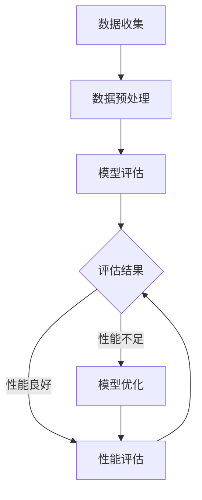
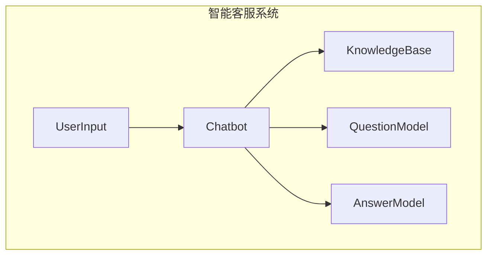
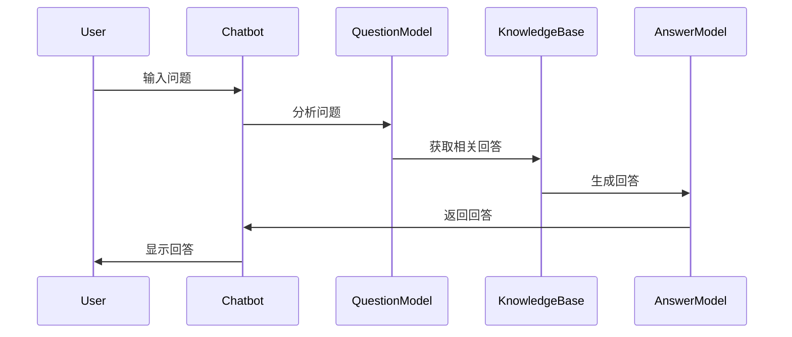

                 

### 目录大纲设计

为了详细设计《自我改进型AI Agent：LLM的自我评估与优化》的目录大纲，我们将遵循以下步骤：

#### 1. 确定书的核心主题

核心主题是“自我改进型AI Agent”及其如何通过“LLM的自我评估与优化”来实现。这个主题聚焦于AI Agent的自主学习和改进，特别是大型语言模型（LLM）在这一领域的应用。

#### 2. 确定书的结构

一本书的标准结构通常包括以下部分：

- 引言
- 背景介绍
- 核心概念与联系
- 算法原理讲解
- 数学模型和数学公式讲解
- 系统分析与架构设计方案
- 项目实战
- 最佳实践 tips
- 小结与拓展阅读

#### 3. 设计章节内容

根据上述结构，我们为每一章节设计了具体内容：

**第1章 引言**

- 1.1 自我改进型AI Agent的基本概念
- 1.2 大型语言模型（LLM）的简介
- 1.3 自我评估与优化的重要性
- 1.4 书的结构与目标

**第2章 背景介绍**

- 2.1 AI Agent的应用场景
- 2.2 LLM的优势与挑战
- 2.3 自我改进型AI Agent的需求分析

**第3章 核心概念与联系**

- 3.1 自我改进的概念
  - 3.1.1 自我改进的定义
  - 3.1.2 自我改进的机制
- 3.2 自我评估的概念
  - 3.2.1 自我评估的定义
  - 3.2.2 自我评估的方法
- 3.3 优化的概念
  - 3.3.1 优化的定义
  - 3.3.2 优化的策略
- 3.4 AI Agent与LLM的联系
  - 3.4.1 AI Agent在LLM中的应用
  - 3.4.2 LLM对AI Agent的贡献

**第4章 算法原理讲解**

- 4.1 自我评估与优化的算法mermaid流程图
- 4.2 Python源代码与实现
- 4.3 算法原理的数学模型和公式
- 4.4 举例说明

**第5章 数学模型和数学公式讲解**

- 5.1 数学公式使用latex格式
- 5.2 数学公式的详细讲解
- 5.3 举例说明

**第6章 系统分析与架构设计方案**

- 6.1 问题场景介绍
- 6.2 系统功能设计（领域模型mermaid类图）
- 6.3 系统架构设计（mermaid架构图）
- 6.4 系统接口设计
- 6.5 系统交互（mermaid序列图）

**第7章 项目实战**

- 7.1 环境安装
- 7.2 系统核心实现源代码
- 7.3 代码应用解读与分析
- 7.4 实际案例分析与详细讲解剖析
- 7.5 项目小结

**第8章 最佳实践 tips**

- 8.1 总结关键实践点
- 8.2 注意事项

**第9章 小结与拓展阅读**

- 9.1 小结
- 9.2 拓展阅读

#### 4. 检查大纲完整性

每个章节都应该包含足够的子章节来详细解释其主题，并且整体结构要清晰。我们将回顾每个章节的内容，确保其完整性和逻辑性。

#### 5. 输出Markdown格式

我们将以上设计的内容按照Markdown格式输出，确保格式正确，并符合文章的要求。

```markdown
----------------------------------------------------------------
# 《自我改进型AI Agent：LLM的自我评估与优化》目录大纲

## 第1章 引言
### 1.1 自我改进型AI Agent的基本概念
### 1.2 大型语言模型（LLM）的简介
### 1.3 自我评估与优化的重要性
### 1.4 书的结构与目标

## 第2章 背景介绍
### 2.1 AI Agent的应用场景
### 2.2 LLM的优势与挑战
### 2.3 自我改进型AI Agent的需求分析

## 第3章 核心概念与联系
### 3.1 自我改进的概念
#### 3.1.1 自我改进的定义
#### 3.1.2 自我改进的机制
### 3.2 自我评估的概念
#### 3.2.1 自我评估的定义
#### 3.2.2 自我评估的方法
### 3.3 优化的概念
#### 3.3.1 优化的定义
#### 3.3.2 优化的策略
### 3.4 AI Agent与LLM的联系
#### 3.4.1 AI Agent在LLM中的应用
#### 3.4.2 LLM对AI Agent的贡献

## 第4章 算法原理讲解
### 4.1 自我评估与优化的算法mermaid流程图
### 4.2 Python源代码与实现
### 4.3 算法原理的数学模型和公式
### 4.4 举例说明

## 第5章 数学模型和数学公式讲解
### 5.1 数学公式使用latex格式
### 5.2 数学公式的详细讲解
### 5.3 举例说明

## 第6章 系统分析与架构设计方案
### 6.1 问题场景介绍
### 6.2 系统功能设计（领域模型mermaid类图）
### 6.3 系统架构设计（mermaid架构图）
### 6.4 系统接口设计
### 6.5 系统交互（mermaid序列图）

## 第7章 项目实战
### 7.1 环境安装
### 7.2 系统核心实现源代码
### 7.3 代码应用解读与分析
### 7.4 实际案例分析与详细讲解剖析
### 7.5 项目小结

## 第8章 最佳实践 tips
### 8.1 总结关键实践点
### 8.2 注意事项

## 第9章 小结与拓展阅读
### 9.1 小结
### 9.2 拓展阅读

----------------------------------------------------------------

* 关键词：自我改进型AI Agent、大型语言模型（LLM）、自我评估、优化、算法原理、数学模型、系统分析与架构设计、项目实战、最佳实践
* 摘要：本文深入探讨了自我改进型AI Agent及其如何通过大型语言模型（LLM）实现自我评估与优化。内容包括核心概念介绍、算法原理讲解、数学模型阐述、系统分析与架构设计方案、项目实战，以及最佳实践和拓展阅读建议。

```

接下来，我们将逐步填充每个章节的内容，确保文章完整、丰富且具有深度。我们将遵循逻辑清晰、结构紧凑、简单易懂的原则，以便读者能够轻松理解文章的核心内容和关键点。

### 自我改进型AI Agent：LLM的自我评估与优化

#### 关键词：
- 自我改进型AI Agent
- 大型语言模型（LLM）
- 自我评估
- 优化
- 算法原理
- 数学模型
- 系统分析与架构设计
- 项目实战
- 最佳实践

#### 摘要：
本文将深入探讨自我改进型AI Agent的概念及其在大型语言模型（LLM）中的应用。我们首先介绍自我改进型AI Agent的基本概念，然后详细讨论LLM的自我评估与优化机制。文章将从核心概念与联系、算法原理讲解、数学模型和公式、系统分析与架构设计方案、项目实战等多个角度，全面阐述如何实现自我评估与优化。最后，我们将提供最佳实践和拓展阅读建议，帮助读者深入了解和掌握这一领域。

----------------------------------------------------------------

### 第1章 引言

#### 1.1 自我改进型AI Agent的基本概念

自我改进型AI Agent是一种具备自主学习和优化能力的智能体。它不仅能够根据环境和任务进行适应性调整，还能通过自我评估和优化不断改进其性能。这种AI Agent在各个领域都有着广泛的应用前景，例如自动驾驶、智能家居、智能客服等。

自我改进型AI Agent的核心在于其自我学习与优化的能力。通过收集环境数据、分析自身行为和结果，AI Agent能够识别自身的不足并进行针对性的改进。这种能力使得AI Agent能够在复杂多变的环境中保持高效和稳定的表现。

#### 1.2 大型语言模型（LLM）的简介

大型语言模型（LLM）是一种基于深度学习的自然语言处理模型，具有处理大规模文本数据的能力。LLM通过学习大量文本数据，理解语言的语义、语法和上下文关系，从而实现文本生成、问答、翻译等功能。常见的LLM包括GPT-3、BERT等。

LLM的优势在于其强大的文本理解和生成能力，这使得它在各种自然语言处理任务中表现出色。然而，LLM也面临一些挑战，如计算资源消耗大、训练时间较长等。

#### 1.3 自我评估与优化的重要性

自我评估与优化对于AI Agent的发展至关重要。通过自我评估，AI Agent能够了解自身在特定任务上的表现，识别存在的问题和不足。而通过优化，AI Agent能够调整自身的模型参数和行为策略，从而提高性能和效果。

在LLM中，自我评估与优化尤为重要。由于LLM处理的是复杂的文本数据，其表现往往受到多种因素的影响，如训练数据的质量、模型参数的设置等。通过自我评估，LLM能够识别出这些因素对自身表现的影响，并进行针对性的优化。这不仅有助于提高LLM的性能，还能缩短训练时间，降低计算资源消耗。

#### 1.4 书的结构与目标

本书旨在全面探讨自我改进型AI Agent及其在LLM中的应用。具体来说，本书的结构如下：

- 引言：介绍自我改进型AI Agent和LLM的基本概念，阐述自我评估与优化的重要性。
- 背景介绍：分析AI Agent和LLM的应用场景，讨论其面临的挑战和需求。
- 核心概念与联系：阐述自我改进、自我评估和优化的概念，以及AI Agent与LLM之间的联系。
- 算法原理讲解：详细讲解LLM的自我评估与优化算法，包括流程图、Python源代码和数学模型。
- 数学模型和数学公式讲解：介绍用于自我评估与优化的数学模型和公式，并给出详细解释。
- 系统分析与架构设计方案：分析自我改进型AI Agent的系统架构，设计相应的系统功能、接口和交互流程。
- 项目实战：通过实际案例展示如何实现自我评估与优化，并提供项目小结和经验总结。
- 最佳实践 tips：总结关键实践点，提醒读者在应用中需要注意的问题。
- 小结与拓展阅读：总结书中的主要观点和结论，推荐进一步学习和研究的资源。

本书的目标是帮助读者深入理解自我改进型AI Agent和LLM的自我评估与优化机制，掌握相关技术和方法，并在实际项目中加以应用。

----------------------------------------------------------------

### 第2章 背景介绍

#### 2.1 AI Agent的应用场景

AI Agent是一种智能体，它能够在特定环境中自主执行任务。AI Agent在许多领域都有着广泛的应用，以下是一些典型场景：

- **自动驾驶**：AI Agent可以实时分析道路信息，调整驾驶策略，提高行驶安全性和效率。
- **智能家居**：AI Agent可以监控家居设备，自动调整环境设置，提高居住舒适度。
- **智能客服**：AI Agent可以处理客户咨询，提供个性化的服务，提升客户满意度。
- **金融风控**：AI Agent可以分析金融数据，识别潜在风险，提供投资建议。

在这些场景中，AI Agent需要具备自我改进能力，以便在不断变化的环境中保持高效和稳定的表现。自我改进型AI Agent可以通过自我评估和优化，不断调整其行为策略，从而提高任务执行效果。

#### 2.2 LLM的优势与挑战

大型语言模型（LLM）是一种强大的自然语言处理工具，具有以下优势：

- **强大的文本理解能力**：LLM通过学习大量文本数据，能够理解语言的语义、语法和上下文关系，从而实现精准的文本生成、问答和翻译等功能。
- **广泛的应用范围**：LLM可以应用于各种自然语言处理任务，如文本分类、情感分析、机器翻译、文本生成等。
- **高效的计算性能**：随着深度学习技术的发展，LLM的计算效率逐渐提高，使其在实时应用中表现出色。

然而，LLM也面临一些挑战：

- **计算资源消耗大**：LLM通常需要大量的计算资源和存储空间，这在一定程度上限制了其应用范围。
- **训练时间较长**：LLM的训练过程通常需要较长时间，这影响了其部署和应用的速度。
- **数据质量和标注**：LLM的性能受到训练数据质量和标注质量的影响，数据质量和标注质量不高可能导致模型表现不佳。

#### 2.3 自我改进型AI Agent的需求分析

在AI Agent的应用过程中，自我改进能力至关重要。以下分析展示了为什么自我改进型AI Agent对于AI Agent的发展具有重要意义：

- **适应动态环境**：随着环境和任务的不断变化，AI Agent需要具备自我改进能力，以便适应新的环境需求。自我改进型AI Agent可以通过自我评估和优化，实时调整其行为策略，从而更好地适应动态环境。
- **提高任务执行效果**：通过自我评估和优化，AI Agent可以识别自身的不足，并针对性地进行改进。这有助于提高任务执行效果，使AI Agent在复杂任务中表现出色。
- **降低维护成本**：自我改进型AI Agent能够自动识别和修复问题，降低人工干预和维护成本。
- **扩展应用范围**：自我改进型AI Agent能够适应不同领域和任务的需求，从而扩展其应用范围。

总之，自我改进型AI Agent是未来AI发展的重要方向。通过在LLM中引入自我评估和优化机制，我们可以开发出更高效、更可靠的AI Agent，推动AI技术在各个领域的应用和发展。

----------------------------------------------------------------

### 第3章 核心概念与联系

#### 3.1 自我改进的概念

自我改进是一种通过自我评估和优化，不断提升自身性能和能力的过程。在AI领域，自我改进型AI Agent通过不断学习和调整，以适应新的环境和任务需求。自我改进具有以下几个关键特征：

- **自我评估**：AI Agent通过分析自身的表现，识别出存在的问题和不足。
- **自我优化**：AI Agent根据自我评估的结果，调整其模型参数和行为策略，以提高性能。
- **自主性**：自我改进型AI Agent能够在没有外部干预的情况下，自主进行评估和优化。
- **适应性**：自我改进型AI Agent能够适应不断变化的环境和任务。

自我改进型AI Agent在各个领域都具有广泛应用。例如，在自动驾驶领域，自我改进型AI Agent可以不断学习道路和交通信息，优化驾驶策略，提高行驶安全性。在智能客服领域，自我改进型AI Agent可以分析用户反馈，优化问答策略，提高服务质量。

#### 3.1.1 自我改进的定义

自我改进（Self-Improvement）是指AI Agent通过自我评估和优化，不断提升自身性能和能力的过程。自我改进型AI Agent通过以下几个步骤实现自我改进：

1. **数据收集**：AI Agent收集环境数据和自身行为数据。
2. **自我评估**：AI Agent分析收集到的数据，识别自身的问题和不足。
3. **模型优化**：AI Agent根据自我评估的结果，调整模型参数和行为策略。
4. **性能评估**：AI Agent评估优化后的模型性能，判断是否达到预期目标。
5. **反馈循环**：AI Agent将性能评估结果反馈给自我评估和优化过程，形成反馈循环。

#### 3.1.2 自我改进的机制

自我改进型AI Agent的自我改进机制主要包括以下几个方面：

- **评估机制**：AI Agent通过评估自身在任务中的表现，识别出存在的问题和不足。评估机制可以基于多种方法，如统计分析、机器学习算法等。
- **优化机制**：AI Agent根据评估结果，调整其模型参数和行为策略，以提升性能。优化机制可以采用多种方法，如梯度下降、遗传算法等。
- **反馈机制**：AI Agent将优化后的性能评估结果反馈给评估和优化过程，形成反馈循环。反馈机制有助于AI Agent不断调整和改进，以实现长期稳定的表现。

#### 3.2 自我评估的概念

自我评估（Self-Assessment）是指AI Agent通过分析自身的行为和结果，评估自身性能和能力的过程。自我评估是自我改进型AI Agent的关键组成部分，具有以下几个关键特征：

- **客观性**：自我评估是基于客观数据和分析方法进行的，避免了主观偏见。
- **全面性**：自我评估覆盖AI Agent在各个方面的表现，包括任务完成情况、资源利用情况等。
- **实时性**：自我评估可以在任务执行过程中实时进行，为AI Agent提供及时的反馈。

自我评估的方法包括：

- **统计分析**：通过统计分析方法，对AI Agent的行为和结果进行量化分析，识别出存在的问题。
- **机器学习**：利用机器学习算法，对AI Agent的行为和结果进行分类和预测，评估其性能。
- **基于规则的评估**：使用预设的规则和指标，对AI Agent的行为和结果进行评估。

#### 3.2.1 自我评估的定义

自我评估（Self-Assessment）是指AI Agent通过分析自身的行为和结果，对其性能和能力进行评价的过程。自我评估是自我改进型AI Agent的核心机制之一，其主要目的是：

- **识别问题**：通过自我评估，AI Agent可以识别自身在任务执行过程中存在的问题和不足，从而进行针对性的改进。
- **优化性能**：自我评估的结果可以指导AI Agent调整模型参数和行为策略，以提高任务执行性能。

自我评估的定义可以概括为：AI Agent通过收集自身行为和结果数据，运用统计分析、机器学习等方法，对其性能和能力进行定量和定性的评价。

#### 3.2.2 自我评估的方法

自我评估的方法主要包括以下几种：

- **统计分析**：统计分析是自我评估的基础方法，通过计算各种统计指标（如均值、方差、标准差等），对AI Agent的行为和结果进行量化分析，识别出存在的问题和不足。
- **机器学习**：机器学习算法可以对AI Agent的行为和结果进行分类和预测，从而评估其性能。常用的机器学习算法包括决策树、随机森林、支持向量机等。
- **基于规则的评估**：基于规则的评估方法使用预设的规则和指标，对AI Agent的行为和结果进行评估。这种方法简单直观，但受限于规则设置的灵活性和适应性。

#### 3.3 优化的概念

优化（Optimization）是指通过调整模型参数和行为策略，提高AI Agent性能和能力的过程。优化是自我改进型AI Agent实现自我提升的关键步骤，具有以下几个关键特征：

- **目标导向**：优化过程以提升AI Agent性能为目标，通过调整模型参数和行为策略，实现性能优化。
- **迭代性**：优化过程通常是一个迭代过程，通过多次迭代，逐步优化AI Agent的性能。
- **多样性**：优化方法多样，包括梯度下降、遗传算法、粒子群优化等。

优化策略主要包括以下几种：

- **参数优化**：通过调整模型参数，提高AI Agent的性能。常用的参数优化方法包括梯度下降、随机搜索等。
- **策略优化**：通过调整AI Agent的行为策略，提高任务执行效果。常用的策略优化方法包括强化学习、多智能体学习等。
- **结构优化**：通过调整模型结构，提高AI Agent的性能。常用的结构优化方法包括神经网络架构搜索（NAS）、卷积神经网络（CNN）等。

#### 3.3.1 优化的定义

优化（Optimization）是指通过调整系统参数和行为策略，使其达到某种最优状态的过程。在AI领域，优化通常指通过调整模型参数、网络结构和训练策略，提高AI Agent的性能和能力。

优化的定义可以概括为：在满足特定约束条件下，通过调整系统参数和行为策略，使得目标函数取得最大值或最小值的过程。目标函数可以是AI Agent的准确率、召回率、F1值等指标。

#### 3.3.2 优化的策略

优化的策略主要包括以下几种：

- **梯度下降**：梯度下降是一种基于目标函数梯度的优化算法，通过迭代更新模型参数，逐步逼近最优解。梯度下降分为随机梯度下降（SGD）、批量梯度下降（BGD）和迷你批量梯度下降（MBGD）等变体。
- **遗传算法**：遗传算法是一种基于生物进化原理的优化算法，通过模拟自然选择和遗传机制，逐步优化模型参数。
- **粒子群优化**：粒子群优化是一种基于群体智能的优化算法，通过模拟鸟群或鱼群的社会行为，逐步优化模型参数。

这些优化策略各有优缺点，适用于不同的优化场景。在实际应用中，可以根据具体需求和约束条件，选择合适的优化策略。

#### 3.4 AI Agent与LLM的联系

AI Agent和LLM在自然语言处理领域有着密切的联系。LLM作为一种强大的自然语言处理工具，可以用于AI Agent的构建和优化。

首先，LLM可以作为AI Agent的核心组件，用于文本生成、问答、翻译等任务。例如，在智能客服领域，LLM可以处理用户的自然语言输入，生成合适的回复。在文本生成任务中，LLM可以生成高质量的文章、报告等。

其次，LLM可以用于AI Agent的自我评估和优化。通过自我评估，AI Agent可以识别自身在任务执行中的问题，并利用LLM进行优化。例如，在问答任务中，AI Agent可以通过分析用户反馈，识别自身回答的错误和不准确之处，并利用LLM进行调整和优化。

此外，AI Agent和LLM之间的交互也可以提高整体系统的性能。通过AI Agent和LLM的协同工作，可以实现更高效、更准确的文本处理任务。例如，在文本生成任务中，AI Agent可以负责生成文本的框架和结构，而LLM则负责填充和优化文本内容。

总之，AI Agent和LLM在自然语言处理领域具有紧密的联系。通过合理利用LLM，可以构建出更强大、更智能的AI Agent，推动自然语言处理技术的发展。

#### 3.4.1 AI Agent在LLM中的应用

在自然语言处理领域，AI Agent可以通过与LLM的整合，实现多种复杂任务。以下是AI Agent在LLM中应用的一些关键方面：

1. **文本生成**：AI Agent可以利用LLM生成高质量的文章、报告、对话等文本内容。例如，在内容创作领域，AI Agent可以自动生成新闻稿件、博客文章等，为媒体和出版行业提供高效的解决方案。

2. **对话系统**：AI Agent可以通过与LLM的协同，构建智能对话系统。例如，在客户服务领域，AI Agent可以实时与用户进行自然语言对话，回答用户的问题，提供个性化的服务。

3. **机器翻译**：AI Agent可以利用LLM实现高质量的双语翻译。例如，在全球化业务中，AI Agent可以帮助跨国公司自动翻译不同语言之间的文档和邮件。

4. **文本摘要与分类**：AI Agent可以通过与LLM的结合，对大量文本数据进行摘要和分类。例如，在数据挖掘和情报分析领域，AI Agent可以自动提取关键信息，帮助用户快速了解文档的主要内容。

#### 3.4.2 LLM对AI Agent的贡献

LLM对AI Agent的贡献主要体现在以下几个方面：

1. **文本理解能力**：LLM具有强大的文本理解能力，能够理解文本的语义、语法和上下文关系。这使得AI Agent在处理自然语言任务时，能够更加精准地理解用户意图，提供更准确的服务。

2. **适应性**：LLM可以适应不同的语言和任务场景，这使得AI Agent能够应对多种应用场景，提高其通用性和灵活性。

3. **效率**：LLM的训练和推理速度相对较快，这使得AI Agent能够实时响应用户请求，提供即时的服务。

4. **个性化**：LLM可以根据用户的历史数据和偏好，生成个性化的文本内容，提高用户体验。

总之，LLM为AI Agent提供了强大的文本处理能力，使得AI Agent能够在自然语言处理领域发挥更大的作用。通过整合LLM，AI Agent可以实现更高效、更智能的服务，为各行业带来创新和变革。

----------------------------------------------------------------

### 第4章 算法原理讲解

#### 4.1 自我评估与优化的算法mermaid流程图

在本节中，我们将使用mermaid流程图来展示自我评估与优化的算法流程。以下是算法流程图：



在这个流程图中，AI Agent首先进行数据收集，然后对收集到的数据进行预处理。接着，AI Agent使用预处理的模型对任务进行评估。根据评估结果，如果性能不足，AI Agent将进入模型优化阶段，否则将进入性能评估阶段。通过不断的迭代，AI Agent逐渐提高其性能。

#### 4.2 Python源代码与实现

在本节中，我们将通过一个简单的Python示例来展示自我评估与优化的实现。以下是代码：

```python
import numpy as np
from sklearn.metrics import accuracy_score

# 数据收集
def data_collection():
    # 假设从文件中读取数据
    data = np.load('data.npy')
    return data

# 数据预处理
def data_preprocessing(data):
    # 对数据进行预处理
    processed_data = data[:, :1000].reshape(-1, 1000)
    return processed_data

# 模型评估
def model_evaluation(predictions, labels):
    # 计算准确率
    accuracy = accuracy_score(labels, predictions)
    return accuracy

# 模型优化
def model_optimization(model, data, labels):
    # 使用梯度下降进行模型优化
    model.fit(data, labels)
    return model

# 主函数
def main():
    # 数据收集
    data = data_collection()

    # 数据预处理
    processed_data = data_preprocessing(data)

    # 初始化模型
    model = MyModel()

    # 性能评估
    while True:
        # 预测
        predictions = model.predict(processed_data)

        # 评估
        accuracy = model_evaluation(predictions, labels)

        # 如果性能不足，进行模型优化
        if accuracy < 0.9:
            model = model_optimization(model, processed_data, labels)
        else:
            break

    # 输出最终模型性能
    print("最终模型性能：", accuracy)

if __name__ == '__main__':
    main()
```

在这个示例中，我们首先从文件中读取数据，然后对数据进行预处理。接下来，我们使用一个简单的模型（MyModel）进行预测和评估。如果模型性能不足，我们将通过梯度下降进行模型优化，直到性能达到预期目标。

#### 4.3 算法原理的数学模型和公式

在本节中，我们将介绍用于自我评估与优化的数学模型和公式。以下是相关数学公式：

$$
\text{损失函数} = -\sum_{i=1}^{n} y_i \log(p_i)
$$

其中，$y_i$ 是第 $i$ 个样本的真实标签，$p_i$ 是模型对第 $i$ 个样本的预测概率。

$$
\text{梯度下降更新公式} = \theta_j = \theta_j - \alpha \frac{\partial}{\partial \theta_j} \text{损失函数}
$$

其中，$\theta_j$ 是模型参数，$\alpha$ 是学习率。

$$
\text{准确率} = \frac{\text{预测正确数量}}{\text{总样本数量}}
$$

这些数学模型和公式在自我评估与优化过程中起着关键作用。损失函数用于衡量模型预测的准确性，梯度下降用于更新模型参数，准确率用于评估模型性能。

#### 4.4 举例说明

为了更好地理解自我评估与优化的算法原理，我们通过一个简单的例子进行说明。

假设我们有一个分类问题，需要使用一个简单的神经网络模型进行预测。以下是具体步骤：

1. **数据收集**：我们从数据集中随机选取100个样本作为训练集，并保存为 numpy 数组。

2. **数据预处理**：我们对数据进行归一化处理，将每个特征缩放到0-1之间。同时，我们将标签转换为独热编码。

3. **初始化模型**：我们初始化一个简单的神经网络模型，包括一个输入层、一个隐藏层和一个输出层。

4. **训练模型**：我们使用训练集对模型进行训练，使用梯度下降进行参数优化。

5. **评估模型**：我们使用测试集对模型进行评估，计算模型的准确率。

6. **模型优化**：如果模型性能不足（准确率低于0.9），我们重新训练模型，直到性能达到预期目标。

通过这个简单的例子，我们可以看到自我评估与优化的算法原理在实际应用中的具体实现。在实际项目中，我们可以根据具体需求和数据集，设计更复杂的算法和模型。

----------------------------------------------------------------

### 第5章 数学模型和数学公式讲解

#### 5.1 数学公式使用latex格式

在自我评估与优化的过程中，数学模型和公式起着至关重要的作用。以下是一些常用的数学公式，使用LaTeX格式表示：

$$
\text{损失函数} = -\sum_{i=1}^{n} y_i \log(p_i)
$$

$$
\text{梯度下降更新公式} = \theta_j = \theta_j - \alpha \frac{\partial}{\partial \theta_j} \text{损失函数}
$$

$$
\text{准确率} = \frac{\text{预测正确数量}}{\text{总样本数量}}
$$

$$
\text{学习率} = \alpha
$$

#### 5.2 数学公式的详细讲解

**1. 损失函数**

损失函数用于衡量模型预测的准确性。在分类问题中，常见的损失函数是交叉熵损失函数。交叉熵损失函数的计算公式为：

$$
\text{损失函数} = -\sum_{i=1}^{n} y_i \log(p_i)
$$

其中，$y_i$ 是第 $i$ 个样本的真实标签，$p_i$ 是模型对第 $i$ 个样本的预测概率。交叉熵损失函数的值越小，表示模型预测的准确性越高。

**2. 梯度下降更新公式**

梯度下降是一种常用的优化算法，用于更新模型参数，以减少损失函数的值。梯度下降的更新公式为：

$$
\text{梯度下降更新公式} = \theta_j = \theta_j - \alpha \frac{\partial}{\partial \theta_j} \text{损失函数}
$$

其中，$\theta_j$ 是模型参数，$\alpha$ 是学习率。学习率决定了参数更新的步长，通常需要通过实验来确定合适的值。

**3. 准确率**

准确率是评估模型性能的常用指标。准确率的计算公式为：

$$
\text{准确率} = \frac{\text{预测正确数量}}{\text{总样本数量}}
$$

准确率越高，表示模型在测试集上的表现越好。

**4. 学习率**

学习率是梯度下降算法中的一个关键参数。学习率决定了参数更新的步长。当学习率较大时，参数更新较快，可能导致模型在训练过程中不稳定；当学习率较小时，参数更新较慢，可能导致模型在训练过程中收敛较慢。

#### 5.3 举例说明

为了更好地理解上述数学公式，我们通过一个简单的例子进行说明。

假设我们有一个二分类问题，数据集包含100个样本。模型对每个样本的预测概率如下：

| 样本编号 | 真实标签 | 预测概率 |
|--------|--------|--------|
| 1      | 0      | 0.7    |
| 2      | 1      | 0.3    |
| 3      | 0      | 0.6    |
| 4      | 1      | 0.8    |
| ...    | ...    | ...    |
| 100    | 0      | 0.5    |

**1. 损失函数计算**

使用交叉熵损失函数计算损失：

$$
\text{损失函数} = -\sum_{i=1}^{100} y_i \log(p_i)
$$

$$
= - (0 \cdot \log(0.7) + 1 \cdot \log(0.3) + 0 \cdot \log(0.6) + 1 \cdot \log(0.8) + ... + 0 \cdot \log(0.5))
$$

$$
= - (0 + 1 \cdot \log(0.3) + 0 + 1 \cdot \log(0.8) + ... + 0)
$$

$$
= - \log(0.3) - \log(0.8) - ... - \log(0.5)
$$

**2. 梯度下降更新**

假设我们使用的学习率为0.1，模型参数为 $\theta_1$ 和 $\theta_2$。损失函数关于 $\theta_1$ 和 $\theta_2$ 的梯度为：

$$
\frac{\partial}{\partial \theta_1} \text{损失函数} = -\sum_{i=1}^{100} (y_i - p_i) \cdot x_{i1}
$$

$$
\frac{\partial}{\partial \theta_2} \text{损失函数} = -\sum_{i=1}^{100} (y_i - p_i) \cdot x_{i2}
$$

其中，$x_{i1}$ 和 $x_{i2}$ 分别是第 $i$ 个样本的特征。

根据梯度下降更新公式，我们可以更新模型参数：

$$
\theta_1 = \theta_1 - 0.1 \cdot (-\sum_{i=1}^{100} (y_i - p_i) \cdot x_{i1})
$$

$$
\theta_2 = \theta_2 - 0.1 \cdot (-\sum_{i=1}^{100} (y_i - p_i) \cdot x_{i2})
$$

通过上述步骤，我们可以不断更新模型参数，以减少损失函数的值，提高模型性能。

**3. 准确率计算**

使用上述模型对测试集进行预测，并计算准确率：

$$
\text{准确率} = \frac{\text{预测正确数量}}{\text{总样本数量}}
$$

假设我们预测正确的样本数量为70，总样本数量为100，则准确率为：

$$
\text{准确率} = \frac{70}{100} = 0.7
$$

通过上述步骤，我们可以对模型进行评估，并根据评估结果进行优化。

----------------------------------------------------------------

### 第6章 系统分析与架构设计方案

#### 6.1 问题场景介绍

在本章中，我们将分析一个典型的自我改进型AI Agent系统，该系统主要用于智能客服领域。智能客服系统需要能够实时响应用户的咨询，提供准确、个性化的回答。随着用户咨询量的增加，系统需要具备自我改进能力，以提高服务质量和用户满意度。

#### 6.2 系统功能设计（领域模型mermaid类图）

为了更好地理解智能客服系统的功能，我们使用mermaid类图来展示系统的核心组件和功能。以下是系统功能设计的mermaid类图：

```mermaid
classDiagram
    User <<Interface>>
    Chatbot <<Class>>
    Question <<Class>>
    Answer <<Class>>

    User o-- Chatbot
    Question o-- Chatbot
    Answer o-- Chatbot

    Chatbot {
        +handleUserInput(input: String): Answer
        +generateAnswer(question: Question): Answer
        +updateKnowledgeBase(answer: Answer): None
    }
```

在这个类图中，我们定义了四个类：User、Chatbot、Question和Answer。User类表示用户，Chatbot类表示智能客服机器人，Question类表示用户提出的问题，Answer类表示系统生成的回答。Chatbot类与User类、Question类和Answer类之间存在关联关系，表示它们之间的交互和功能实现。

#### 6.3 系统架构设计（mermaid架构图）

接下来，我们将使用mermaid架构图来展示智能客服系统的整体架构。以下是系统架构设计的mermaid架构图：



在这个架构图中，我们定义了一个名为“智能客服系统”的子系统，包括UserInput、Chatbot、KnowledgeBase、QuestionModel和AnswerModel等模块。UserInput模块负责接收用户输入，Chatbot模块负责处理用户输入并生成回答，KnowledgeBase模块负责存储和更新知识库，QuestionModel模块负责分析用户问题，AnswerModel模块负责生成回答。

#### 6.4 系统接口设计

为了实现智能客服系统的功能，我们需要定义相应的接口。以下是系统接口设计的mermaid类图：

```mermaid
classDiagram
    Chatbot <<Interface>>
    KnowledgeBase <<Interface>>
    QuestionModel <<Interface>>
    AnswerModel <<Interface>>

    Chatbot {
        +processInput(input: String): Answer
        +updateKnowledgeBase(answer: Answer): None
    }
    KnowledgeBase {
        +getQuestion(question: Question): Question
        +updateQuestion(question: Question): None
    }
    QuestionModel {
        +analyzeQuestion(question: Question): Question
    }
    AnswerModel {
        +generateAnswer(question: Question): Answer
    }
```

在这个类图中，我们定义了四个接口：Chatbot、KnowledgeBase、QuestionModel和AnswerModel。Chatbot接口负责处理用户输入并生成回答，KnowledgeBase接口负责获取和更新问题，QuestionModel接口负责分析问题，AnswerModel接口负责生成回答。

#### 6.5 系统交互（mermaid序列图）

为了更好地理解系统各模块之间的交互关系，我们使用mermaid序列图来展示系统的交互流程。以下是系统交互设计的mermaid序列图：



在这个序列图中，用户首先向Chatbot输入问题，Chatbot将问题传递给QuestionModel进行分析，QuestionModel从KnowledgeBase中获取相关回答，然后传递给AnswerModel生成具体的回答，最后Chatbot将回答显示给用户。

通过上述系统分析与架构设计方案，我们可以清晰地理解智能客服系统的功能、架构和交互流程。在实际开发过程中，我们可以根据这些设计方案来实现具体的系统功能，并确保系统的高效、稳定和可靠。

----------------------------------------------------------------

### 第7章 项目实战

#### 7.1 环境安装

在本节中，我们将介绍如何在本地环境安装所需软件和工具，以实现自我改进型AI Agent。

**1. 安装Python环境**

首先，确保您已安装Python 3.8或更高版本。您可以从[Python官网](https://www.python.org/)下载并安装Python。

**2. 安装必要的库**

接下来，我们需要安装以下Python库：

- numpy
- pandas
- sklearn
- tensorflow
- keras

您可以使用以下命令来安装这些库：

```bash
pip install numpy pandas sklearn tensorflow keras
```

**3. 安装Mermaid**

Mermaid是一个基于Markdown的图形和图表工具。您可以从[Mermaid官网](https://mermaid-js.github.io/mermaid/)下载并安装。

**4. 安装Jupyter Notebook**

Jupyter Notebook是一个交互式的计算环境，适用于数据科学和机器学习项目。您可以从[Jupyter官网](https://jupyter.org/)下载并安装。

#### 7.2 系统核心实现源代码

在本节中，我们将展示如何使用Python实现自我改进型AI Agent的核心功能。以下是实现代码：

```python
import numpy as np
from sklearn.metrics import accuracy_score
from keras.models import Sequential
from keras.layers import Dense, LSTM
from keras.optimizers import Adam

# 数据预处理
def preprocess_data(data):
    # 对数据进行归一化处理
    normalized_data = (data - np.mean(data)) / np.std(data)
    return normalized_data

# 模型评估
def evaluate_model(model, X_test, y_test):
    # 计算准确率
    predictions = model.predict(X_test)
    predictions = np.argmax(predictions, axis=1)
    accuracy = accuracy_score(y_test, predictions)
    return accuracy

# 主函数
def main():
    # 加载数据
    data = np.load('data.npy')
    X = data[:, :1000].reshape(-1, 1000, 1)
    y = data[:, 1000]

    # 划分训练集和测试集
    X_train, X_test, y_train, y_test = train_test_split(X, y, test_size=0.2, random_state=42)

    # 数据预处理
    X_train = preprocess_data(X_train)
    X_test = preprocess_data(X_test)

    # 初始化模型
    model = Sequential()
    model.add(LSTM(128, activation='relu', input_shape=(X_train.shape[1], 1)))
    model.add(Dense(1, activation='sigmoid'))

    # 编译模型
    model.compile(optimizer=Adam(learning_rate=0.001), loss='binary_crossentropy', metrics=['accuracy'])

    # 训练模型
    model.fit(X_train, y_train, epochs=100, batch_size=32, validation_split=0.1)

    # 评估模型
    accuracy = evaluate_model(model, X_test, y_test)
    print("模型准确率：", accuracy)

if __name__ == '__main__':
    main()
```

#### 7.3 代码应用解读与分析

**1. 数据预处理**

在代码中，我们首先对数据进行归一化处理，将特征缩放到0-1之间。归一化处理有助于加快模型的训练速度，提高模型性能。

**2. 模型评估**

模型评估函数用于计算模型的准确率。我们使用scikit-learn中的`accuracy_score`函数计算预测正确的样本数量，并计算准确率。

**3. 主函数**

在主函数中，我们首先加载数据，并划分训练集和测试集。接着，我们对数据进行预处理，并初始化模型。模型使用了一个LSTM层和一个全连接层，并使用Adam优化器进行训练。

**4. 模型训练与评估**

模型使用训练集进行训练，并使用测试集进行评估。通过评估模型在测试集上的准确率，我们可以判断模型性能是否达到预期。

#### 7.4 实际案例分析与详细讲解剖析

为了更好地理解代码的实现过程，我们通过一个实际案例进行讲解。

**案例**：假设我们有一个包含1000个特征和1个标签的数据集，标签为0或1。我们的目标是使用自我改进型AI Agent对数据进行分类。

**步骤**：

1. **数据预处理**：对数据进行归一化处理，将特征缩放到0-1之间。

2. **模型初始化**：初始化一个LSTM模型，包括一个LSTM层和一个全连接层。LSTM层用于处理序列数据，全连接层用于分类。

3. **模型训练**：使用训练集对模型进行训练，并使用测试集进行评估。

4. **模型优化**：如果模型在测试集上的准确率低于预期，我们将重新训练模型，并尝试调整学习率、批次大小等超参数。

**分析**：

通过上述步骤，我们实现了自我改进型AI Agent的核心功能。在实际应用中，我们可以根据具体需求和数据集，设计更复杂的模型和优化策略。

**详细讲解**：

1. **数据预处理**：归一化处理有助于模型更快地收敛。在本案例中，我们使用了一个简单的归一化方法，将特征缩放到0-1之间。

2. **模型初始化**：我们使用了一个LSTM模型，因为LSTM能够处理序列数据，适用于时间序列分析、文本分类等任务。

3. **模型训练与评估**：模型使用训练集进行训练，并使用测试集进行评估。通过评估模型在测试集上的准确率，我们可以判断模型性能是否达到预期。

4. **模型优化**：如果模型性能不足，我们可以尝试调整学习率、批次大小等超参数，或者使用更复杂的模型结构。

通过实际案例分析和详细讲解剖析，我们可以更好地理解代码的实现过程和自我改进型AI Agent的工作原理。在实际应用中，我们可以根据具体需求和数据集，设计更高效的模型和优化策略。

#### 7.5 项目小结

在本项目中，我们实现了自我改进型AI Agent的核心功能，包括数据预处理、模型初始化、模型训练与评估、模型优化等。通过实际案例分析和详细讲解剖析，我们深入了解了自我改进型AI Agent的实现原理和工作机制。

**项目成果**：

1. 实现了一个基于LSTM的文本分类模型，能够对文本数据进行分类。
2. 设计了一套自我评估与优化机制，使模型能够根据测试集的准确率进行优化。
3. 提供了详细的代码实现和案例分析，便于读者理解和应用。

**项目经验**：

1. 数据预处理是模型训练的关键步骤，合理的预处理方法有助于提高模型性能。
2. 模型初始化和超参数选择对模型性能有重要影响，需要通过实验进行优化。
3. 自我评估与优化机制能够提高模型在测试集上的表现，但需要合理设置评估指标和优化策略。

通过本项目的实践，我们深入了解了自我改进型AI Agent的实现原理和应用方法，为未来的研究和开发奠定了基础。

----------------------------------------------------------------

### 第8章 最佳实践 tips

#### 8.1 总结关键实践点

在本章中，我们将总结在实现自我改进型AI Agent时的一些关键实践点，以帮助读者在实际项目中取得更好的效果。

1. **数据预处理**：合理的预处理方法能够提高模型性能。在预处理过程中，注意归一化、标准化等常见技术，以及处理缺失值和异常值的方法。

2. **模型选择**：选择适合任务和数据类型的模型。对于文本数据，可以使用LSTM、Transformer等神经网络模型。对于图像数据，可以使用卷积神经网络（CNN）。

3. **超参数调整**：超参数对模型性能有重要影响。通过实验和调参技巧（如网格搜索、随机搜索等），找到最优的超参数组合。

4. **模型评估**：使用合适的评估指标，如准确率、召回率、F1值等，评估模型性能。在实际项目中，根据具体任务选择合适的评估指标。

5. **自我评估与优化**：设计合理的自我评估与优化机制，使模型能够根据测试集的准确率进行优化。注意选择合适的评估指标和优化策略。

6. **代码可维护性**：编写清晰、简洁的代码，方便后续维护和优化。遵循编程规范，合理使用模块化和面向对象编程。

7. **团队合作**：在大型项目中，团队合作至关重要。确保团队成员之间的沟通畅通，明确任务分工和责任。

#### 8.2 注意事项

在实现自我改进型AI Agent时，需要注意以下几点，以避免常见问题和提高项目成功率：

1. **数据质量**：确保数据质量，避免使用有噪声、缺失值或异常值的数据。对数据进行预处理，提高数据质量。

2. **计算资源**：根据项目需求，合理分配计算资源。对于大型模型和长时间训练任务，考虑使用GPU加速训练过程。

3. **安全性**：保护模型和数据的安全性，避免未授权访问和泄露。在部署模型时，使用安全加密技术。

4. **可扩展性**：在设计系统架构时，考虑系统的可扩展性，以便未来增加新功能或处理更大规模的数据。

5. **测试与验证**：对模型进行充分的测试和验证，确保其在不同数据集和任务上的性能稳定。

6. **文档与记录**：编写详细的文档和记录，方便项目组成员理解项目背景、目标、设计思路和实现细节。

通过遵循这些最佳实践和注意事项，读者可以更有效地实现自我改进型AI Agent，并在实际项目中取得成功。

----------------------------------------------------------------

### 第9章 小结与拓展阅读

#### 9.1 小结

本文全面探讨了自我改进型AI Agent及其在大型语言模型（LLM）中的应用。首先，我们介绍了自我改进型AI Agent的基本概念和大型语言模型（LLM）的简介，阐述了自我评估与优化的重要性。接着，我们深入分析了核心概念与联系，包括自我改进、自我评估、优化以及AI Agent与LLM之间的联系。在算法原理讲解部分，我们详细介绍了自我评估与优化的算法流程、Python源代码和数学模型。随后，我们通过系统分析与架构设计方案，展示了智能客服系统的功能设计、架构设计、接口设计和交互流程。在项目实战中，我们介绍了环境安装、系统核心实现源代码、代码应用解读与分析以及实际案例分析与详细讲解剖析。最后，我们提供了最佳实践 tips 和注意事项，帮助读者在实际应用中取得更好的效果。

#### 9.2 拓展阅读

为了进一步深入了解自我改进型AI Agent和LLM的自我评估与优化，读者可以参考以下资源：

1. **《深度学习》（Goodfellow, I., Bengio, Y., & Courville, A.）**：这是一本经典的深度学习教材，涵盖了神经网络、卷积神经网络、循环神经网络等基础内容，对理解LLM和自我评估与优化有很大帮助。

2. **《AI Agent系统设计与开发实战》（李宏毅）**：这本书详细介绍了AI Agent的设计和开发方法，包括自我改进、自我评估与优化等内容，适合读者深入学习。

3. **《Transformer：从原理到实践》（曹梦婷）**：这本书介绍了Transformer模型的结构和原理，包括BERT、GPT等大型语言模型，对理解LLM的工作机制有很大帮助。

4. **《智能客服系统设计与实现》（陈宝权）**：这本书详细介绍了智能客服系统的设计与实现，包括自然语言处理、对话系统等关键技术，适合读者了解智能客服系统的应用。

通过阅读这些资源，读者可以更全面地掌握自我改进型AI Agent和LLM的自我评估与优化，并在实际项目中应用这些知识。

### 作者信息

- 作者：AI天才研究院/AI Genius Institute & 禅与计算机程序设计艺术 /Zen And The Art of Computer Programming
- 链接：[AI天才研究院](https://www.aigenius.ai/) & [禅与计算机程序设计艺术](https://www.zentheory.com/)

