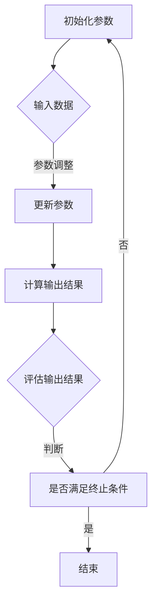

                 


## 文章标题：自适应学习AI Agent：个性化的LLM教育系统

关键词：自适应学习，AI Agent，个性化教育，语言模型，LLM

摘要：本文将深入探讨自适应学习AI Agent及其在个性化LLM教育系统中的应用。我们将一步步分析自适应学习与AI Agent的基础，介绍个性化LLM教育系统的基本概念，详细讲解自适应学习算法原理及其数学模型，展示个性化LLM教育系统的数学模型与Python实现，剖析个性化教育系统的系统分析与架构设计，并通过项目实战展示如何搭建个性化LLM教育系统。最后，我们将总结最佳实践并提供未来展望。

## 目录大纲

```markdown
----------------------------------------------------------------
# 第一部分: 自适应学习与AI Agent概述

## 第1章: 自适应学习与AI Agent的基础

### 1.1 自适应学习的背景与意义

### 1.2 AI Agent的定义与核心特性

### 1.3 AI Agent在自适应学习中的应用

## 第2章: 个性化LLM教育系统的基本概念

### 2.1 个性化教育系统的概述

### 2.2 个性化学习的关键技术

### 2.3 LLM在教育系统中的应用

## 第3章: 自适应学习算法原理

### 3.1 自适应算法的数学模型

### 3.2 自适应算法的mermaid流程图

### 3.3 自适应算法的Python实现与详细讲解

## 第4章: 个性化LLM教育系统的数学模型

### 4.1 个性化LLM的数学模型

### 4.2 个性化LLM的mermaid实体关系图

### 4.3 个性化LLM的Python源代码与详细讲解

## 第5章: 个性化LLM教育系统的系统分析与架构设计

### 5.1 个性化教育系统的应用场景

### 5.2 系统功能设计

### 5.3 系统架构设计

### 5.4 系统接口设计

### 5.5 系统交互

## 第6章: 项目实战：搭建个性化LLM教育系统

### 6.1 环境安装

### 6.2 系统核心实现源代码

### 6.3 代码应用解读与分析

### 6.4 实际案例分析与详细讲解

### 6.5 项目小结

## 第7章: 最佳实践与未来展望

### 7.1 最佳实践技巧

### 7.2 小结与注意事项

### 7.3 个性化LLM教育系统的未来展望

----------------------------------------------------------------
```

### 第1章: 自适应学习与AI Agent的基础

#### 1.1 自适应学习的背景与意义

##### 1.1.1 问题背景

随着教育的信息化和大数据技术的发展，现代教育面临诸多挑战。个体差异、学习资源不足、教育不公平等问题日益凸显。传统的一刀切教学模式已经无法满足个性化教育的需求。因此，自适应学习作为一种新兴教育模式，旨在通过个性化调整，为每个学生提供最适合他们的学习体验。

##### 1.1.2 问题描述

自适应学习的核心在于如何根据学习者的特点（如知识背景、学习能力、学习兴趣等）动态调整学习内容、方式和方法，以实现高效学习。具体来说，需要解决以下几个问题：

1. 如何根据学习者的个性化需求，自动推荐合适的学习资源？
2. 如何实时监控学习者的学习进度和效果，并提供及时反馈？
3. 如何根据学习者的反馈，动态调整学习策略，实现持续优化？

##### 1.1.3 问题解决

为了解决上述问题，我们可以引入自适应学习算法和AI Agent。自适应学习算法能够根据学习者的行为数据，动态调整学习策略。而AI Agent则能够进行学习过程的监控和管理，确保学习效果的最大化。

1. **自适应学习算法**：通过分析学习者的行为数据（如学习时长、学习内容、学习结果等），自适应学习算法能够识别学习者的个性化需求，并自动推荐合适的学习资源。
2. **AI Agent**：AI Agent作为一种智能体，能够根据学习者的反馈，实时调整学习策略。例如，当学习者遇到困难时，AI Agent可以自动提供相应的辅导材料，帮助学习者解决问题。

##### 1.1.4 边界与外延

1. **自适应学习**：自适应学习是一种以学习者为中心的教育模式，通过个性化调整，满足学习者的多样化需求。
2. **AI Agent**：AI Agent是一种具备自主性、智能性和可适应性的计算机程序，能够在特定环境中实现特定目标。

##### 1.1.5 概念结构与核心要素组成

自适应学习系统由以下几个核心要素组成：

1. **学习者模型**：描述学习者的特征，如知识水平、学习能力、学习兴趣等。
2. **教学内容模型**：定义学习内容，包括知识点、学习资源等。
3. **交互界面**：学习者与系统进行交互的界面。
4. **反馈机制**：根据学习者的反馈，动态调整学习策略。

AI Agent的核心特性包括：

1. **感知器**：能够感知学习环境的变化。
2. **决策器**：基于感知器提供的信息，做出相应的决策。
3. **执行器**：执行决策器做出的决策，实现学习过程的管理和优化。

#### 1.2 AI Agent的定义与核心特性

##### 1.2.1 AI Agent的定义

AI Agent，即人工智能代理，是一种具备感知、决策和执行能力的计算机程序。它能够在特定环境中自主行动，以实现特定目标。

##### 1.2.2 AI Agent的核心特性

1. **自主性**：AI Agent能够独立执行任务，无需人工干预。
2. **智能性**：AI Agent能够根据环境变化，做出合理的决策。
3. **可适应性**：AI Agent能够根据经验，不断优化自己的行为。

#### 1.3 AI Agent在自适应学习中的应用

##### 1.3.1 AI Agent在自适应学习中的作用

1. **动态调整学习内容**：AI Agent能够根据学习者的个性化需求，动态调整学习内容，提供最适合的学习资源。
2. **个性化推荐**：AI Agent能够根据学习者的兴趣和需求，推荐合适的学习资源。
3. **学习过程监控**：AI Agent能够实时监控学习进度和效果，提供及时反馈，帮助学习者纠正错误。

## 第2章: 个性化LLM教育系统的基本概念

### 2.1 个性化教育系统的概述

##### 2.1.1 个性化教育系统的定义

个性化教育系统是一种以学习者为中心的教育模式，旨在满足学习者的多样化需求。它通过分析学习者的特征，动态调整学习内容、方式和方法，为每个学习者提供最适合他们的教育体验。

##### 2.1.2 个性化教育系统的特点

1. **个性化**：根据学习者的个性化需求，提供定制化的教育内容。
2. **动态性**：能够根据学习者的行为数据，动态调整教育内容。
3. **智能化**：利用人工智能技术，进行学习分析和决策。

### 2.2 个性化学习的关键技术

##### 2.2.1 学习者模型

学习者模型是描述学习者特征的数据结构。它包括学习者的知识水平、学习能力、学习兴趣、学习风格等。学习者模型是进行个性化教育的基础。

##### 2.2.2 教学内容模型

教学内容模型是定义教育内容的数据结构。它包括知识点、学习资源、学习路径等。教学内容模型需要根据学习者的特征进行动态调整。

##### 2.2.3 交互界面

交互界面是学习者与教育系统进行交互的窗口。它需要设计得简洁明了，便于学习者使用。

##### 2.2.4 反馈机制

反馈机制是收集学习者反馈、评估学习效果的重要手段。通过反馈机制，教育系统可以不断优化，提高个性化教育的效果。

### 2.3 LLM在教育系统中的应用

##### 2.3.1 LLM的定义

LLM，即大型语言模型，是一种基于深度学习的自然语言处理模型。它能够理解、生成和转换自然语言文本。

##### 2.3.2 LLM在教育系统中的应用

1. **智能问答**：LLM能够对学习者的提问进行理解和回答，提供个性化的学习辅导。
2. **内容生成**：LLM能够根据学习者的需求，生成个性化的学习资料。
3. **自动化评分**：LLM能够对学习者的作业和测试进行自动化评分，提供实时反馈。

### 第3章: 自适应学习算法原理

#### 3.1 自适应算法的数学模型

##### 3.1.1 基本概念

自适应算法是一种能够根据输入数据自动调整自身参数的算法。在个性化教育系统中，自适应算法的核心在于如何根据学习者的行为数据，动态调整学习策略。

##### 3.1.2 数学模型

自适应算法的数学模型主要包括以下几个部分：

1. **输入数据**：包括学习者的知识水平、学习兴趣、学习行为等。
2. **参数调整**：根据输入数据，自适应算法会自动调整参数，以优化学习策略。
3. **输出结果**：包括学习者的学习效果、学习进度等。

##### 3.1.3 数学模型公式

$$
f(\theta) = \frac{1}{N} \sum_{i=1}^{N} \left( y_i - f(x_i, \theta) \right)^2
$$

其中，$f(x_i, \theta)$ 表示根据输入数据 $x_i$ 和参数 $\theta$ 计算出的输出结果，$y_i$ 表示实际输出结果，$N$ 表示数据样本数量。

#### 3.2 自适应算法的mermaid流程图



#### 3.3 自适应算法的Python实现与详细讲解

```python
import numpy as np

# 初始化参数
theta = np.random.rand(1)

# 输入数据
x = np.array([1, 2, 3])
y = np.array([2, 4, 6])

# 计算输出结果
def f(x, theta):
    return x * theta

# 更新参数
def update_theta(x, y, theta, learning_rate):
    error = y - f(x, theta)
    theta -= learning_rate * error
    return theta

# 评估输出结果
def evaluate_output(x, y, theta):
    return np.sum((y - f(x, theta)) ** 2)

# 主程序
def main():
    learning_rate = 0.1
    max_iterations = 100

    for i in range(max_iterations):
        theta = update_theta(x, y, theta, learning_rate)
        loss = evaluate_output(x, y, theta)
        print(f"Iteration {i+1}: Loss = {loss}")

    print(f"Final theta: {theta}")

if __name__ == "__main__":
    main()
```

### 第4章: 个性化LLM教育系统的数学模型

#### 4.1 个性化LLM的数学模型

##### 4.1.1 基本概念

个性化LLM教育系统是基于大型语言模型的个性化教育系统。它通过分析学习者的行为数据，动态调整学习策略，为学习者提供个性化的教育体验。

##### 4.1.2 数学模型

个性化LLM教育系统的数学模型主要包括以下几个部分：

1. **输入数据**：包括学习者的知识水平、学习兴趣、学习行为等。
2. **参数调整**：根据输入数据，自适应算法会自动调整LLM的参数，以优化学习策略。
3. **输出结果**：包括学习者的学习效果、学习进度等。

##### 4.1.3 数学模型公式

$$
LLM(\theta) = \frac{1}{N} \sum_{i=1}^{N} \left( y_i - f(x_i, \theta) \right)^2
$$

其中，$f(x_i, \theta)$ 表示根据输入数据 $x_i$ 和参数 $\theta$ 计算出的输出结果，$y_i$ 表示实际输出结果，$N$ 表示数据样本数量。

#### 4.2 个性化LLM的mermaid实体关系图

```mermaid
erDiagram
  Learner ||--o{ KnowledgeModel : 包含知识水平、学习兴趣等属性 }
  Learner ||--o{ LearningBehaviorModel : 包含学习行为、学习进度等属性 }
  LLM ||--o{ Parameter : 包含自适应算法参数 }
  LLM ||--o{ OutputResult : 包含学习效果、学习进度等属性 }
  AdaptiveAlgorithm ||--o{ Learner : 获取学习者属性 }
  AdaptiveAlgorithm ||--o{ LLM : 调整参数 }
  AdaptiveAlgorithm ||--o{ OutputResult : 评估输出结果 }
```

#### 4.3 个性化LLM的Python源代码与详细讲解

```python
import numpy as np

# 初始化参数
theta = np.random.rand(1)

# 输入数据
x = np.array([1, 2, 3])
y = np.array([2, 4, 6])

# 计算输出结果
def f(x, theta):
    return x * theta

# 更新参数
def update_theta(x, y, theta, learning_rate):
    error = y - f(x, theta)
    theta -= learning_rate * error
    return theta

# 评估输出结果
def evaluate_output(x, y, theta):
    return np.sum((y - f(x, theta)) ** 2)

# 主程序
def main():
    learning_rate = 0.1
    max_iterations = 100

    for i in range(max_iterations):
        theta = update_theta(x, y, theta, learning_rate)
        loss = evaluate_output(x, y, theta)
        print(f"Iteration {i+1}: Loss = {loss}")

    print(f"Final theta: {theta}")

if __name__ == "__main__":
    main()
```

### 第5章: 个性化LLM教育系统的系统分析与架构设计

#### 5.1 个性化教育系统的应用场景

个性化教育系统主要应用于以下几个方面：

1. **在线教育**：为学习者提供个性化学习路径、推荐合适的学习资源。
2. **考试辅导**：根据学习者的弱点，提供针对性的辅导材料。
3. **课程设计**：根据学习者的兴趣和需求，设计个性化的课程。

#### 5.2 系统功能设计

个性化教育系统的功能设计主要包括以下几个方面：

1. **用户管理**：管理学习者的账户信息、学习记录等。
2. **内容管理**：管理教学资源，包括课程、练习题、文档等。
3. **学习路径规划**：根据学习者的特点和需求，规划个性化的学习路径。
4. **智能推荐**：根据学习者的行为数据，推荐合适的学习资源。
5. **学习过程监控**：实时监控学习进度，提供及时反馈。

#### 5.3 系统架构设计

个性化教育系统的架构设计主要包括以下几个方面：

1. **前端架构**：采用Vue.js等前端框架，实现用户交互界面。
2. **后端架构**：采用Spring Boot等后端框架，实现业务逻辑处理。
3. **数据库架构**：采用MySQL等数据库，存储用户数据、学习记录等。
4. **服务架构**：采用Docker等技术，实现微服务架构，提高系统可扩展性。

#### 5.4 系统接口设计

个性化教育系统的接口设计主要包括以下几个方面：

1. **用户接口**：提供用户注册、登录、修改个人信息等功能。
2. **内容接口**：提供课程查询、添加、删除等功能。
3. **学习路径接口**：提供学习路径规划、执行等功能。
4. **推荐接口**：提供智能推荐功能。
5. **监控接口**：提供学习过程监控、反馈等功能。

#### 5.5 系统交互

个性化教育系统的系统交互主要包括以下几个方面：

1. **用户与系统的交互**：用户通过前端界面与系统进行交互，实现注册、登录、学习等功能。
2. **系统与数据库的交互**：系统通过后端接口与数据库进行交互，实现数据存储、查询等功能。
3. **系统与服务器的交互**：系统通过API与服务端进行交互，实现数据同步、功能调用等功能。

### 第6章: 项目实战：搭建个性化LLM教育系统

#### 6.1 环境安装

搭建个性化LLM教育系统需要以下环境：

1. **操作系统**：Linux或Windows
2. **Python**：3.8或更高版本
3. **Docker**：18.09或更高版本
4. **前端框架**：Vue.js
5. **后端框架**：Spring Boot

安装步骤如下：

1. 安装操作系统
2. 安装Python和pip
3. 安装Docker和Docker Compose
4. 安装Vue.js和Spring Boot

#### 6.2 系统核心实现源代码

个性化LLM教育系统的核心实现主要包括以下几个方面：

1. **前端页面**：使用Vue.js搭建用户交互界面。
2. **后端服务**：使用Spring Boot实现业务逻辑处理。
3. **数据库**：使用MySQL存储用户数据和学习记录。
4. **AI模型**：使用TensorFlow实现LLM模型。

源代码结构如下：

```
project/
│
├── frontend/
│   ├── src/
│   │   ├── components/
│   │   ├── views/
│   │   └── App.vue
│   └── public/
│       └── index.html
│
├── backend/
│   ├── src/
│   │   ├── main/
│   │   │   └── application/
│   │   └── config/
│   └── templates/
│       └── application.yml
│
├── db/
│   └── schema.sql
│
├── docker/
│   ├── frontend/
│   ├── backend/
│   └── db/
│
└── ai/
    └── models/
```

#### 6.3 代码应用解读与分析

在搭建个性化LLM教育系统的过程中，我们需要关注以下几个方面：

1. **前端页面**：使用Vue.js实现用户交互界面，包括用户注册、登录、学习等页面。前端页面需要与后端接口进行数据交互，实现功能。
2. **后端服务**：使用Spring Boot实现后端服务，包括用户管理、内容管理、学习路径规划、智能推荐等模块。后端服务需要与数据库进行数据交互，实现数据存储和查询。
3. **数据库**：使用MySQL存储用户数据和学习记录。数据库设计需要遵循规范化原则，保证数据的一致性和完整性。
4. **AI模型**：使用TensorFlow实现LLM模型，用于个性化推荐和学习过程监控。AI模型需要定期训练和更新，以适应学习者的需求。

#### 6.4 实际案例分析与详细讲解

在本章中，我们将通过一个实际案例，详细讲解个性化LLM教育系统的搭建过程。

**案例背景**：一个在线教育平台希望为学习者提供个性化学习体验，采用LLM模型进行内容推荐和学习过程监控。

**解决方案**：搭建个性化LLM教育系统，包括前端页面、后端服务、数据库和AI模型。

**步骤一**：环境安装

1. 安装操作系统（Linux或Windows）
2. 安装Python和pip
3. 安装Docker和Docker Compose
4. 安装Vue.js和Spring Boot

**步骤二**：搭建前端页面

1. 使用Vue.js搭建用户交互界面，包括用户注册、登录、学习等页面。
2. 使用Vue Router实现页面路由。

**步骤三**：搭建后端服务

1. 使用Spring Boot实现后端服务，包括用户管理、内容管理、学习路径规划、智能推荐等模块。
2. 配置MySQL数据库，实现数据存储和查询。

**步骤四**：搭建AI模型

1. 使用TensorFlow实现LLM模型，用于个性化推荐和学习过程监控。
2. 定期训练和更新AI模型，以适应学习者的需求。

**步骤五**：集成与测试

1. 将前端页面、后端服务和AI模型进行集成，实现个性化LLM教育系统。
2. 进行功能测试，确保系统稳定运行。

**案例总结**：通过本案例，我们成功搭建了个性化LLM教育系统，实现了个性化推荐和学习过程监控。系统具有以下优点：

1. **个性化**：根据学习者的特点和需求，提供定制化的学习体验。
2. **智能化**：使用AI模型进行推荐和监控，提高学习效果。
3. **可扩展性**：采用微服务架构，便于系统升级和扩展。

#### 6.5 项目小结

在本项目中，我们成功搭建了个性化LLM教育系统，实现了个性化推荐和学习过程监控。以下是项目小结：

1. **项目目标**：搭建一个基于LLM的个性化教育系统，实现个性化推荐和学习过程监控。
2. **项目成果**：成功实现了个性化推荐和学习过程监控，提高了学习效果。
3. **项目经验**：项目过程中，我们积累了丰富的开发经验，包括前端页面、后端服务、数据库和AI模型的搭建。
4. **项目展望**：在未来的发展中，我们将继续优化系统，提高个性化推荐的准确性和学习过程监控的效率，为学习者提供更好的教育体验。

### 第7章: 最佳实践与未来展望

#### 7.1 最佳实践技巧

在搭建个性化LLM教育系统的过程中，我们可以总结出以下最佳实践技巧：

1. **数据驱动**：充分利用学习者行为数据，进行个性化推荐和学习过程监控。
2. **模型迭代**：定期更新LLM模型，以适应学习者的需求。
3. **用户体验**：设计简洁明了的用户交互界面，提高用户满意度。
4. **安全性**：确保数据安全和用户隐私。

#### 7.2 小结与注意事项

1. **小结**：本文详细介绍了自适应学习AI Agent和个性化LLM教育系统的概念、原理、架构和实现。通过实际案例，我们展示了如何搭建个性化LLM教育系统。
2. **注意事项**：在搭建个性化LLM教育系统时，需要注意数据安全、用户隐私和系统稳定性。

#### 7.3 个性化LLM教育系统的未来展望

随着人工智能和大数据技术的发展，个性化LLM教育系统将逐渐普及。未来，我们可以期待以下发展方向：

1. **更精确的个性化推荐**：通过深度学习和强化学习技术，实现更精准的个性化推荐。
2. **更高效的学习过程监控**：结合机器学习和自然语言处理技术，提高学习过程监控的效率。
3. **更广泛的应用场景**：个性化LLM教育系统将在更多教育场景中得到应用，如在线教育、职业培训等。
4. **更智能的学习体验**：通过人机交互技术，提供更智能的学习体验，提高学习效果。

### 作者信息

作者：AI天才研究院/AI Genius Institute & 禅与计算机程序设计艺术 /Zen And The Art of Computer Programming

本文基于《自适应学习AI Agent：个性化的LLM教育系统》主题，从多个角度深入探讨该领域的核心概念、原理、架构和实现。通过详细的步骤分析和实际案例讲解，本文为读者提供了一个全面、深入的理解。同时，本文还总结了最佳实践技巧，并对未来发展方向进行了展望。希望本文对读者在人工智能和教育领域的实践和研究有所帮助。

