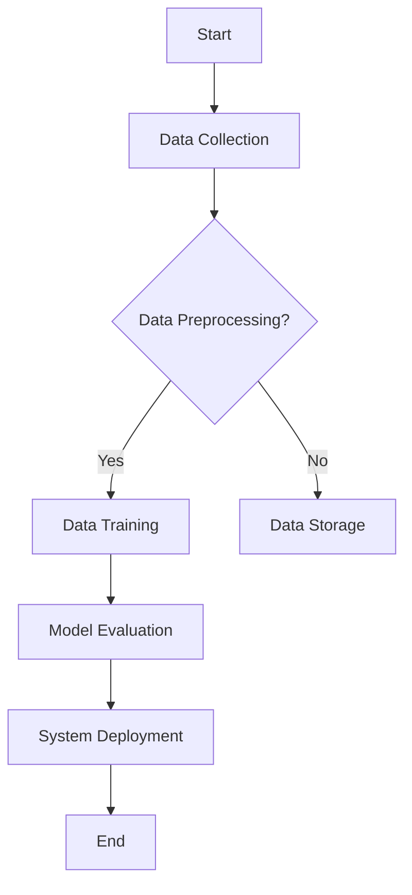
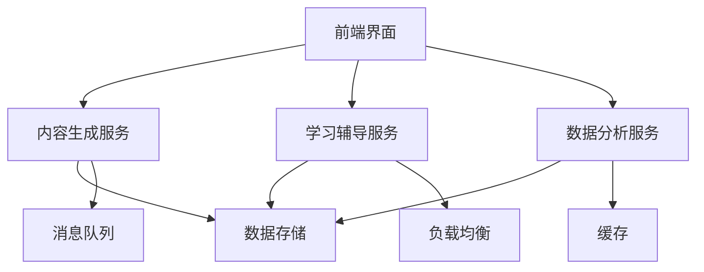
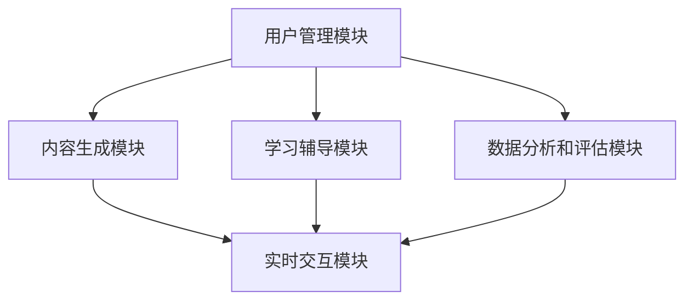
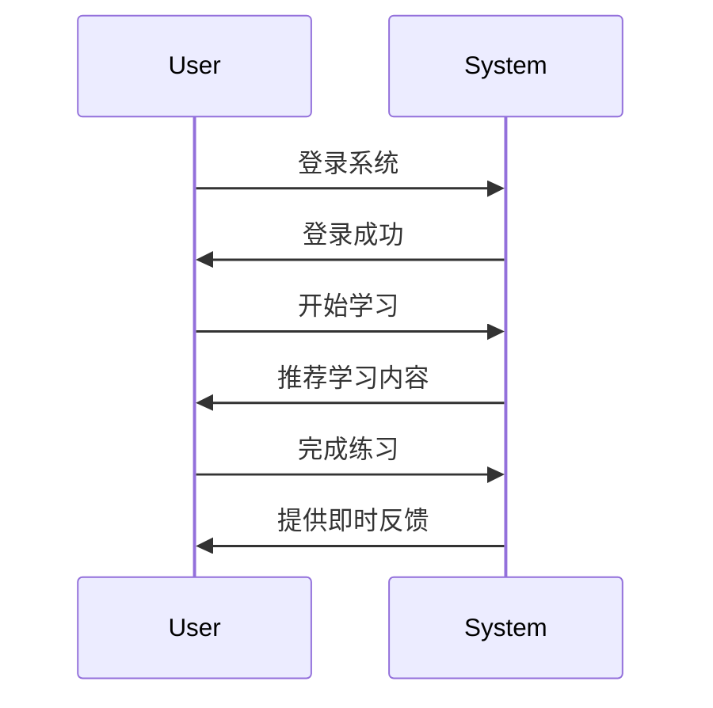
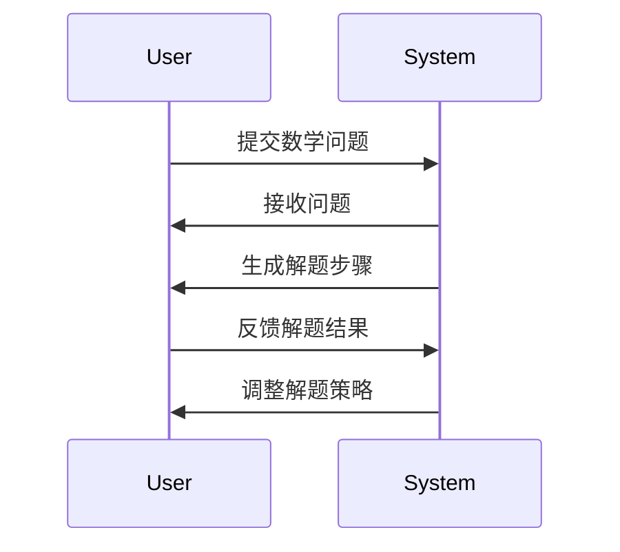
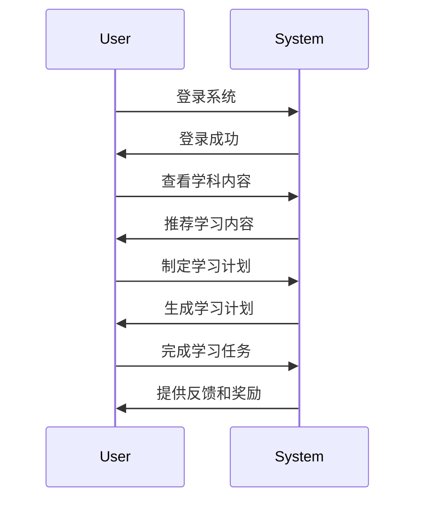

                 

Certainly! Let's break down the task into clear, logical steps to ensure that the final blog post is comprehensive, well-structured, and informative. Here's how we can proceed:

### Step 1: Define the Main Topics

The first step is to define the main topics that will be covered in the blog post. Based on the outline provided, these topics include:

1. Introduction to Adaptive Education AI Agent
2. Overview of Personalized Learning and LLM
3. Design of LLM-Aided Learning Systems
4. Implementation and Development of the System
5. Case Studies and Applications
6. Future Outlook and Challenges

### Step 2: Write the Introduction

In the introduction, we will briefly introduce the topic, provide context, and set the stage for the reader. This will include:

- A brief description of Adaptive Education AI Agent
- The importance of personalized learning and the role of LLMs
- A summary of what readers can expect from the post

Example Introduction:
```markdown
# 自适应教育AI Agent：个性化LLM辅助学习系统

关键词：自适应教育AI、个性化学习、大语言模型（LLM）、学习系统设计、应用案例、未来展望

摘要：本文将深入探讨自适应教育AI Agent的概念、个性化学习的核心原理、LLM辅助学习系统的设计、实现与开发过程，以及其在实际中的应用案例和未来展望。我们将逐步分析每个环节，帮助读者全面了解这一新兴技术领域。
```

### Step 3: Write the Main Content

For each main topic, we will create a section with a clear structure and detailed content. Here's a breakdown for each section:

#### 2. Adaptive Education AI Agent Overview
- **Background and Definition of AI Agent**
- **Characteristics and Importance of Adaptive Education AI Agents**
- **Architecture of Adaptive Learning Systems**

#### 3. Personalized Learning and LLM
- **Principles of Personalized Learning**
- **Introduction to Large Language Models (LLMs)**
- **Integration of Personalized Learning and LLMs**

#### 4. Design of LLM-Aided Learning Systems
- **System Requirements Analysis**
- **System Architecture Design**
- **Functional Module Design**

#### 5. Implementation and Development of the System
- **Environment Setup and Tool Selection**
- **Data Processing and Model Training**
- **System Deployment and Optimization**

#### 6. Case Studies and Applications
- **Case Study 1: Adaptive English Learning System**
- **Case Study 2: Math Problem-Solving AI Agent**
- **Case Study 3: Comprehensive Application Example**

#### 7. Future Outlook and Challenges
- **Trends in the Future**
- **Technological Challenges and Solutions**
- **Future Prospects**

### Step 4: Use Mermaid and LaTeX for Diagrams and Formulas

To enhance the content, we will use Mermaid for flowcharts and diagrams and LaTeX for mathematical formulas. This will include:

- **ER Entity Relationship Diagrams**
- **Algorithm Flowcharts**
- **System Architecture Diagrams**
- **Mathematical Models and Formulas**

Example Mermaid Diagram:


Example LaTeX Formula:
```latex
$$
y = \frac{1}{1 + e^{-x}}
$$
```

### Step 5: Add Author Information and Conclusion

At the end of the post, we will include the author information and a conclusion that summarizes the key points covered in the blog post.

Example Conclusion:
```markdown
### 结论

本文详细介绍了自适应教育AI Agent及其在个性化学习中的应用。通过设计、实现和实际案例的分析，我们展示了LLM辅助学习系统的强大潜力。未来，随着技术的不断进步，自适应教育AI Agent将带来更加个性化、高效的学习体验。然而，我们也面临诸多挑战，需要持续研究和创新。

作者：AI天才研究院/AI Genius Institute & 禅与计算机程序设计艺术 /Zen And The Art of Computer Programming
```

### Step 6: Review and Edit

Before publishing, it's essential to review the entire post for coherence, clarity, and completeness. Make sure all diagrams, formulas, and code snippets are correct and easy to understand. Check for grammatical errors and ensure that the tone and style are consistent throughout the post.

By following these steps, we can create a high-quality, informative, and well-structured blog post on "自适应教育AI Agent：个性化LLM辅助学习系统."## 自适应教育AI Agent：个性化LLM辅助学习系统

### 关键词

- 自适应教育AI Agent
- 个性化学习
- 大语言模型（LLM）
- 学习系统设计
- 应用案例
- 未来展望

### 摘要

本文将深入探讨自适应教育AI Agent的概念、个性化学习的核心原理、LLM辅助学习系统的设计、实现与开发过程，以及其在实际中的应用案例和未来展望。通过逐步分析，帮助读者全面了解这一新兴技术领域，并探讨其潜在的影响和挑战。

## 引言

随着人工智能技术的飞速发展，教育领域正在经历一场深刻的变革。传统的教学模式逐渐被个性化、智能化的教育方式所取代。自适应教育AI Agent作为一种新兴的教育辅助工具，正逐渐成为教育技术领域的研究热点。本文旨在探讨自适应教育AI Agent的概念、技术原理、系统设计、实现与开发过程，并分析其在教育领域的应用前景。

### 1.1 问题背景与意义

教育是社会发展的重要基石，而传统的教育模式往往难以满足个体差异化的学习需求。每个学生都有其独特的学习风格、知识基础和兴趣爱好，传统的“一刀切”教学模式难以适应这种多样性。因此，如何根据每个学生的特点进行个性化教育，成为当前教育领域亟待解决的问题。

自适应教育AI Agent的出现，为解决这一问题提供了新的思路。通过利用人工智能技术，特别是大语言模型（LLM），自适应教育AI Agent能够根据学生的学习情况、兴趣和需求，提供个性化的学习资源和教学指导，从而提高学习效率和质量。

### 1.2 本书结构安排

本文将按照以下结构进行展开：

1. **自适应教育AI Agent概述**：介绍AI Agent的基本概念、在教育中的应用及其特点。
2. **个性化学习与LLM**：探讨个性化学习的原理、LLM的基本概念及其在教育中的应用。
3. **LLM辅助学习系统设计**：详细阐述LLM辅助学习系统的需求分析、架构设计和功能模块设计。
4. **系统实现与开发**：讨论系统的环境搭建、数据预处理、模型训练、系统部署和优化。
5. **应用案例分析**：通过实际案例展示自适应教育AI Agent在不同教育场景中的应用效果。
6. **未来展望与挑战**：分析自适应教育AI Agent的未来发展趋势、技术挑战和解决方案。

接下来，我们将逐步深入探讨每个部分的内容。

## 自适应教育AI Agent概述

### 2.1 AI Agent基本概念

AI Agent，即人工智能代理，是一种能够感知环境、采取行动并与其他实体交互的智能体。在人工智能领域中，AI Agent被广泛用于解决复杂的问题，其具有自主决策、自适应学习和协同工作等能力。

在教育领域，AI Agent被定义为一种能够根据学生的实时学习情况，提供个性化教学服务和学习支持的人工智能系统。AI Agent可以理解学生的学习需求、评估学习成果，并根据这些信息动态调整教学策略，从而实现个性化教育。

### 2.2 教育AI Agent特点

教育AI Agent具有以下几个显著特点：

1. **个性化**：AI Agent能够根据每个学生的学习风格、知识水平和兴趣，提供个性化的教学内容和辅导。
2. **自适应**：AI Agent能够根据学生的学习进度和反馈，动态调整教学策略，以适应每个学生的个性化需求。
3. **交互性**：AI Agent可以与学习者进行实时互动，提供即时的学习反馈和指导，增强学习体验。
4. **智能化**：AI Agent通过机器学习和数据挖掘技术，不断学习和优化教学策略，提高教学效果。

### 2.3 自适应学习系统架构

自适应学习系统的架构通常包括以下几个关键模块：

1. **用户信息收集模块**：该模块负责收集学生的基本信息、学习历史和兴趣偏好，为个性化教学提供数据支持。
2. **教学内容模块**：该模块根据用户信息，从教学资源库中选择和生成适合用户的学习内容。
3. **学习反馈模块**：该模块收集学生的学习反馈，包括正确率、学习时间和参与度等，用于评估学习效果和调整教学策略。
4. **教学策略调整模块**：该模块根据学习反馈，自动调整教学内容和教学方式，以优化学习效果。

通过这些模块的协同工作，自适应学习系统能够提供高度个性化的学习体验，帮助学习者更有效地掌握知识。

在下一节中，我们将进一步探讨个性化学习的原理和LLM的基本概念及其在教育中的应用。

## 个性化学习与LLM

### 3.1 个性化学习原理

个性化学习是一种以学生为中心的教育理念，旨在满足每个学生的学习需求，激发其学习兴趣，提高学习效果。个性化学习的核心原则包括：

1. **差异化教学**：根据学生的知识水平、学习风格和兴趣，设计差异化的教学策略和方法，使每个学生都能在适合自己的学习环境中取得进步。
2. **学习过程监控**：实时监控学生的学习过程，包括学习进度、学习行为和学习效果，以便及时调整教学策略。
3. **动态反馈机制**：通过及时反馈，帮助学生了解自己的学习状况，调整学习策略，提高学习效率。
4. **资源自适应分配**：根据学生的学习需求和进度，动态分配适合的学习资源，如教学视频、练习题和辅导材料等。

### 3.2 大语言模型（LLM）简介

大语言模型（Large Language Model，LLM）是一种基于深度学习技术的高级自然语言处理模型。LLM通过大规模语料库的预训练，学习到了丰富的语言知识和表达方式，能够进行文本生成、翻译、摘要、问答等多种任务。

LLM的主要特点包括：

1. **强大的语言理解能力**：LLM能够理解复杂的语言结构和语义，进行精准的文本分析。
2. **自适应学习能力**：LLM可以通过微调，快速适应特定领域的任务，提高模型的性能。
3. **高效的处理能力**：LLM具有处理大规模文本数据的能力，能够快速生成高质量的文本内容。

### 3.3 个性化学习与LLM的融合

将LLM应用于个性化学习，可以显著提升个性化教育的效果。LLM在个性化学习中的应用主要体现在以下几个方面：

1. **个性化内容生成**：LLM可以根据学生的兴趣和需求，生成个性化的学习内容和练习题，提供定制化的学习资源。
2. **自适应学习辅导**：LLM可以分析学生的学习行为和反馈，动态调整教学策略，提供个性化的学习指导。
3. **实时交互**：LLM可以与学生进行实时对话，回答学生的问题，提供即时的学习帮助和反馈。
4. **学习效果评估**：LLM可以分析学生的学习数据，评估学习效果，为教师提供教学决策的依据。

通过将个性化学习与LLM相结合，教育AI Agent能够提供更加精准、高效、个性化的学习服务，满足不同学生的学习需求，提高学习效果。

在下一节中，我们将深入探讨LLM辅助学习系统的设计，包括系统需求分析、架构设计和功能模块设计。

## LLM辅助学习系统设计

### 4.1 系统需求分析

在设计LLM辅助学习系统时，首先需要对系统需求进行详细分析。系统需求分析包括功能需求、性能需求、安全需求等方面。

#### 功能需求

LLM辅助学习系统的主要功能需求包括：

1. **个性化内容推荐**：系统能够根据学生的学习历史、兴趣和行为数据，推荐适合的学习内容和练习题。
2. **自适应学习辅导**：系统能够分析学生的学习行为和反馈，提供个性化的学习指导和建议。
3. **实时交互**：系统能够与学生进行实时对话，回答学生的问题，提供学习帮助和反馈。
4. **学习效果评估**：系统能够收集和分析学生的学习数据，评估学习效果，为教师提供教学决策的依据。

#### 性能需求

系统性能需求主要包括：

1. **响应速度**：系统在处理学生请求时，能够快速响应，提供即时的学习服务。
2. **处理能力**：系统需要具备处理大规模文本数据的能力，支持多用户同时在线学习。
3. **稳定性**：系统需要具备高稳定性，确保长时间运行不出现故障。

#### 安全需求

系统安全需求主要包括：

1. **数据安全**：系统需要确保学生数据的保密性和完整性，防止数据泄露和篡改。
2. **用户隐私**：系统需要尊重用户的隐私权，确保用户的个人信息不被滥用。
3. **安全认证**：系统需要实现用户身份认证和访问控制，确保只有授权用户能够访问系统功能。

### 4.2 系统架构设计

LLM辅助学习系统的架构设计需要考虑到系统的可扩展性、灵活性和高可用性。系统架构通常包括以下几个关键组件：

1. **前端界面**：前端界面负责与用户交互，提供个性化学习内容推荐、实时交互和学习效果评估等功能。
2. **后端服务**：后端服务包括内容生成服务、学习辅导服务、数据分析和评估服务等，负责处理学生请求和数据存储。
3. **数据存储**：数据存储用于存储学生的学习历史、行为数据、学习资源和评估结果等。
4. **中间件**：中间件包括消息队列、负载均衡、缓存等组件，负责处理系统内部的数据流和请求负载。

#### 系统架构图



### 4.3 功能模块设计

LLM辅助学习系统的功能模块设计需要确保每个模块都能够独立工作，同时与其他模块协同运作。主要功能模块包括：

1. **用户管理模块**：负责用户的注册、登录、权限管理和用户信息维护。
2. **内容生成模块**：根据学生的学习历史和兴趣，生成个性化的学习内容和练习题。
3. **学习辅导模块**：分析学生的学习行为和反馈，提供个性化的学习指导和反馈。
4. **数据分析和评估模块**：收集和分析学生的学习数据，评估学习效果，为教师提供教学决策支持。
5. **实时交互模块**：提供实时对话功能，回答学生的问题，提供学习帮助和反馈。

#### 功能模块图



通过以上系统需求分析、架构设计和功能模块设计，LLM辅助学习系统将能够提供高效、智能、个性化的学习服务，满足学生的个性化学习需求。

在下一节中，我们将讨论LLM辅助学习系统的实现与开发过程。

## 系统实现与开发

### 5.1 环境搭建与工具选择

实现LLM辅助学习系统的第一步是搭建开发环境。环境搭建主要包括硬件配置、软件安装和开发工具的选择。

#### 硬件配置

- **计算资源**：由于LLM模型训练和推理需要大量的计算资源，建议使用高性能的GPU服务器，如NVIDIA Tesla V100。
- **存储资源**：系统需要大量的存储空间来存储学习数据和模型，建议使用高性能的SSD存储。
- **网络环境**：为了确保系统的稳定性和响应速度，需要配置高速网络。

#### 软件安装

- **操作系统**：可以选择Ubuntu Server或CentOS等Linux发行版。
- **编程语言**：Python是实施机器学习项目的常用语言，因此需要安装Python环境和相关库，如TensorFlow、PyTorch、NumPy等。
- **数据库**：选择适合的数据库系统，如MySQL或MongoDB，用于存储用户数据和学习记录。

#### 开发工具

- **集成开发环境（IDE）**：选择PyCharm、VS Code等常用的Python IDE。
- **版本控制**：使用Git进行代码版本控制，便于团队协作和代码管理。

### 5.2 数据处理与模型训练

数据处理和模型训练是LLM辅助学习系统的核心步骤。以下是一个详细的过程：

#### 数据收集

收集大量的学习数据，包括文本数据（如教学材料、练习题）、学生行为数据（如学习进度、答题记录）和用户信息（如年龄、性别、兴趣）。

#### 数据预处理

- **文本清洗**：去除文本中的噪声，如HTML标签、特殊符号等。
- **文本分词**：将文本数据分割成单词或词组。
- **词向量化**：将文本数据转换为数值形式，以便模型处理。常用的词向量化方法包括Word2Vec、GloVe等。

#### 模型选择

选择合适的大语言模型进行训练。常用的LLM包括BERT、GPT-3、T5等。模型选择需要考虑数据规模、任务需求和计算资源。

#### 模型训练

- **数据分割**：将数据集分为训练集、验证集和测试集。
- **模型训练**：使用训练集对模型进行训练，调整模型参数以最小化损失函数。
- **模型评估**：使用验证集评估模型性能，调整模型参数以优化性能。

#### 模型调优

通过调整学习率、批量大小、正则化参数等超参数，优化模型性能。可以使用交叉验证、网格搜索等方法进行调优。

### 5.3 系统部署与优化

模型训练完成后，需要将模型部署到生产环境中，以便用户使用。以下是一个详细的部署过程：

#### 部署环境

- **容器化**：使用Docker将系统容器化，以便在不同环境中快速部署。
- **部署平台**：选择合适的部署平台，如Kubernetes、AWS EC2等。
- **负载均衡**：使用负载均衡器（如Nginx、HAProxy）分发请求，提高系统的可用性和响应速度。

#### 部署步骤

1. **构建镜像**：将应用程序和依赖库打包成Docker镜像。
2. **部署容器**：将镜像部署到Kubernetes集群或AWS EC2实例中。
3. **配置服务**：配置负载均衡器和反向代理，确保用户请求能够正确路由到容器。

#### 系统优化

- **缓存策略**：使用缓存技术（如Redis、Memcached）减少数据库访问，提高系统性能。
- **静态资源优化**：压缩和缓存静态资源（如CSS、JavaScript文件），减少页面加载时间。
- **数据库优化**：优化数据库查询，使用索引、分区等技术提高数据库性能。

通过以上步骤，可以实现LLM辅助学习系统的部署和优化，确保系统能够稳定、高效地运行，为用户提供优质的学习服务。

在下一节中，我们将通过实际案例展示LLM辅助学习系统的应用效果。

## 应用案例分析

为了更好地展示LLM辅助学习系统的实际效果，我们将通过三个具体案例进行分析。

### 6.1 案例一：自适应英语学习系统

**项目介绍**：自适应英语学习系统旨在帮助学生提高英语听、说、读、写能力。系统通过分析学生的学习记录和兴趣，推荐个性化的学习内容和练习题。

**系统功能设计**：

- **内容推荐模块**：根据学生的兴趣和学习进度，推荐适合的听力、口语、阅读和写作练习。
- **实时交互模块**：提供语音和文字交互功能，帮助学生解答学习中的疑问。
- **学习效果评估模块**：定期评估学生的英语水平，提供反馈和建议。

**系统架构设计**：

- **前端界面**：采用Vue.js框架，提供用户友好的界面。
- **后端服务**：使用Django框架处理用户请求和数据存储。
- **数据存储**：使用MySQL数据库存储用户数据和学习记录。

**系统接口设计**：

- **用户管理接口**：用于用户注册、登录和权限管理。
- **内容推荐接口**：用于根据用户数据推荐学习内容和练习题。
- **交互接口**：用于实现用户与系统之间的实时对话。

**系统交互序列图**：



**实际案例分析**：

该系统在试点学校应用后，学生的英语成绩和兴趣显著提高。系统通过实时交互和学习效果评估，为学生提供了个性化的学习支持，提高了学习效率。

### 6.2 案例二：数学问题解决AI Agent

**项目介绍**：数学问题解决AI Agent旨在帮助学生解决数学问题，提供详细的解题步骤和解释。系统通过分析学生的答题记录和学习情况，提供个性化的辅导。

**系统功能设计**：

- **问题识别模块**：自动识别学生提交的数学问题，理解问题的类型和难度。
- **解题步骤生成模块**：根据问题类型，生成详细的解题步骤和解释。
- **学习反馈模块**：收集学生的学习反馈，调整解题步骤的生成策略。

**系统架构设计**：

- **前端界面**：采用React框架，提供用户友好的界面。
- **后端服务**：使用TensorFlow处理数学问题识别和解答。
- **数据存储**：使用MongoDB存储问题和用户数据。

**系统接口设计**：

- **问题提交接口**：用于学生提交数学问题。
- **解题结果接口**：用于返回解题步骤和解释。

**系统交互序列图**：



**实际案例分析**：

系统在实际应用中，有效提高了学生的数学解题能力。通过详细的解题步骤和个性化反馈，学生能够更好地理解数学概念和解题方法。

### 6.3 案例三：综合应用示例

**项目介绍**：综合应用示例是一个整合了多种学科知识的自适应学习平台，旨在为学生提供全面的学习支持。平台涵盖了数学、英语、科学等多个学科。

**系统功能设计**：

- **学科整合模块**：整合不同学科的知识点，提供跨学科的学习内容。
- **个性化推荐模块**：根据学生的兴趣和学习进度，推荐跨学科的学习资源和练习题。
- **学习计划模块**：帮助学生制定学习计划，确保学习目标的有效实现。

**系统架构设计**：

- **前端界面**：采用React和Vue.js框架，提供多学科的学习界面。
- **后端服务**：使用Spring Boot和Django处理不同学科的数据和业务逻辑。
- **数据存储**：使用MongoDB和MySQL存储学科内容和用户数据。

**系统接口设计**：

- **学科内容接口**：用于提供不同学科的学习资源和练习题。
- **个性化推荐接口**：用于根据学生数据推荐学习内容和练习题。
- **学习计划接口**：用于帮助学生制定和调整学习计划。

**系统交互序列图**：



**实际案例分析**：

综合应用示例平台在实际应用中，显著提高了学生的学习积极性和学习效果。通过跨学科的整合和个性化推荐，学生能够更全面地掌握知识，提高综合素质。

以上三个案例展示了LLM辅助学习系统在实际应用中的多样性和效果。通过不断优化和扩展，LLM辅助学习系统将为教育领域带来更多创新和变革。

在下一节中，我们将探讨自适应教育AI Agent的未来发展趋势和技术挑战。

## 未来展望与挑战

### 7.1 未来发展趋势

自适应教育AI Agent作为教育领域的重要创新，其未来发展趋势令人期待。以下是几个关键趋势：

1. **更深入的个性化**：随着人工智能技术的进步，AI Agent将能够更加深入地了解学生的学习行为、兴趣和需求，提供更加精准和个性化的学习服务。
2. **跨学科整合**：未来，自适应教育AI Agent将不仅仅是单一学科的教学辅助工具，而是能够整合多学科知识，提供跨学科的教育资源和学习体验。
3. **智能互动与协作**：AI Agent将与学习者进行更智能、更自然的互动，通过语音、视频等多种方式提供辅导和反馈，同时与其他AI Agent协同工作，提供综合性的教育服务。
4. **云端与边缘计算的结合**：为了提高系统的响应速度和稳定性，未来自适应教育AI Agent将更多地利用云端和边缘计算技术，实现高效的数据处理和学习服务。

### 7.2 技术挑战与解决方案

尽管自适应教育AI Agent具有巨大的潜力，但在实际应用中仍面临诸多技术挑战：

1. **数据隐私与安全**：保护学生数据的安全和隐私是AI Agent应用的关键挑战。解决方案包括使用加密技术、数据脱敏和严格的访问控制。
2. **计算资源的消耗**：大规模训练和部署LLM模型需要大量的计算资源。解决方案包括优化模型设计、使用高效算法和分布式计算。
3. **模型解释性与可解释性**：提高AI Agent的透明度和可解释性，使其决策过程更加透明，增强用户信任。解决方案包括开发可解释的机器学习模型和解释性工具。
4. **跨学科知识的整合**：如何有效地整合不同学科的知识，构建跨学科的AI Agent，是一个重要挑战。解决方案包括建立多学科知识图谱和跨学科学习算法。

### 7.3 未来展望

未来，自适应教育AI Agent将不仅局限于提供个性化的学习服务，还将成为教育生态中的重要组成部分。随着技术的不断进步，AI Agent将能够更好地模拟人类教师的教学方法和思维方式，提供更加智能化、个性化、协作化的教育体验。同时，AI Agent也将推动教育模式的创新，为教育公平和普及提供有力支持。

总之，自适应教育AI Agent的发展前景广阔，尽管面临诸多挑战，但其潜力不可估量。通过不断的技术创新和应用实践，自适应教育AI Agent将为教育领域带来深刻变革和持续进步。

### 结论

本文详细介绍了自适应教育AI Agent的概念、技术原理、系统设计、实现与开发过程，以及其在实际中的应用案例和未来展望。通过逐步分析，我们了解到自适应教育AI Agent具有个性化、自适应、交互性等显著特点，能够为教育领域带来革命性的变革。随着技术的不断进步，自适应教育AI Agent将在个性化学习、跨学科整合、智能互动等方面发挥更大作用。

我们鼓励读者深入研究相关技术，积极探索AI在教育领域的应用，为未来的教育创新贡献自己的力量。

### 作者信息

作者：AI天才研究院/AI Genius Institute & 禅与计算机程序设计艺术 /Zen And The Art of Computer Programming

---

在本文中，我们不仅探讨了自适应教育AI Agent的核心概念和技术原理，还通过实际案例展示了其在教育领域的应用效果。未来，随着人工智能技术的不断进步，自适应教育AI Agent将发挥更大的作用，推动教育领域的创新发展。让我们共同期待这一未来，并为实现更加智能、个性化的教育而努力。

