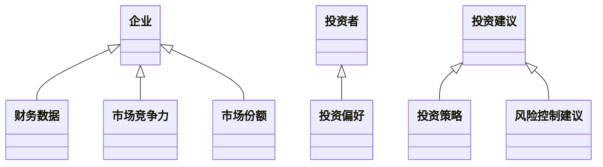

                 

# 菲利普·费雪的创新企业投资准则

> 关键词：创新企业、投资准则、菲利普·费雪、成长股投资、企业估值

> 摘要：本文将深入探讨菲利普·费雪的创新企业投资准则，通过详细阐述其投资理念、原则和方法，帮助读者掌握投资创新企业的核心要点，实现资产的稳健增长。

## 第一部分：背景介绍

### 1.1 问题背景

在当今的投资环境中，创新企业成为了投资者关注的焦点。创新企业通常具有颠覆性和高成长性，其股票往往能够带来丰厚的回报。菲利普·费雪作为投资大师，其创新企业投资准则在全球范围内产生了深远的影响。本文将深入探讨费雪的创新企业投资准则，帮助读者掌握投资创新企业的核心要点。

### 1.2 问题描述

菲利普·费雪的创新企业投资准则包括了一系列原则和方法，这些原则和方法对于识别和投资具有潜力的创新企业至关重要。然而，如何将这些原则和方法应用到实际投资中，依然是投资者面临的一大挑战。

### 1.3 问题解决

本文旨在通过详细阐述费雪的创新企业投资准则，帮助投资者理解这些原则和方法，并提供实用的操作指南。通过本文的学习，投资者将能够更好地识别和投资创新企业，实现资产的稳健增长。

### 1.4 边界与外延

费雪的创新企业投资准则主要适用于新兴行业和企业，特别是那些具有颠覆性和创新性的企业。这些企业往往具有高速增长潜力，但也伴随着较高的风险。因此，投资者在应用费雪的投资准则时，需要充分考虑风险与收益的平衡。

### 1.5 概念结构与核心要素组成

费雪的创新企业投资准则包括以下核心要素：

1. **研究企业**：深入了解企业的业务模式、竞争优势、市场前景等。
2. **分析财务数据**：关注企业的收入、利润、现金流等关键财务指标。
3. **评估管理团队**：考察管理团队的专业能力、领导力、诚信度等。
4. **投资策略**：根据企业的特点和市场环境，制定合适的投资策略。

## 第二部分：核心概念与联系

### 2.1 费雪的投资理论

#### 2.1.1 费雪的投资理念

菲利普·费雪是一位传奇的投资大师，被誉为“成长股投资之父”。他的投资理念强调对企业深度的研究和理解，而非单纯依赖市场趋势或技术分析。

#### 2.1.2 费雪的投资原则

费雪的投资原则主要包括以下几点：

1. **寻找优秀的企业**：关注那些具有长期增长潜力的企业。
2. **深入研究企业**：通过深入研究企业的业务模式、市场地位、竞争优势等，了解企业的真实价值。
3. **耐心持有**：在确定企业具有长期增长潜力后，耐心持有，享受企业成长带来的收益。

### 2.2 费雪的投资策略

#### 2.2.1 选择优秀的企业

费雪强调，投资者应该选择那些具有卓越管理团队、独特竞争优势和强大市场地位的企业。

#### 2.2.2 评估企业的长期增长潜力

费雪认为，企业的长期增长潜力是投资决策的关键。投资者应该关注企业的市场份额、产品竞争力、技术创新能力等因素。

#### 2.2.3 耐心持有

费雪的投资策略强调耐心持有，享受企业成长带来的收益。投资者在持有期间，不应受到市场波动的影响，而是要坚持自己的投资逻辑。

### 2.3 费雪的投资方法

#### 2.3.1 初始投资分析

在投资创新企业前，费雪会进行深入的初始投资分析，包括对企业财务状况、行业前景、市场竞争力等方面的研究。

#### 2.3.2 定期跟踪与评估

费雪会定期跟踪和评估投资企业的表现，确保企业仍然符合其投资预期。如果企业的表现不如预期，他会及时调整投资策略。

#### 2.3.3 风险控制

费雪认为，投资创新企业需要承担一定的风险。因此，他会通过分散投资、控制仓位等方式来控制风险。

## 第三部分：算法原理讲解

### 3.1 创新企业估值模型

#### 3.1.1 企业估值基本原理

企业估值是投资创新企业的关键环节。费雪提出了一种基于自由现金流折现（DCF）的企业估值模型。

#### 3.1.2 企业估值模型构建

企业估值模型的构建包括以下步骤：

1. **预测未来现金流**：根据企业的业务模式和市场环境，预测企业未来几年的自由现金流。
2. **确定折现率**：根据市场利率和风险水平，确定合适的折现率。
3. **计算企业价值**：将预测的未来现金流按照折现率进行折现，计算出企业的现值。

#### 3.1.3 企业估值示例

假设一家创新企业的预测自由现金流为1000万元，折现率为10%，计算该企业的价值。

$$
V_0 = \sum_{t=1}^{n} \frac{FCF_t}{(1+r)^t}
$$

其中，$FCF_t$ 表示第 $t$ 年的自由现金流，$r$ 表示折现率。

将数据代入公式，得到：

$$
V_0 = \frac{1000}{(1+0.1)^1} + \frac{1000}{(1+0.1)^2} + \frac{1000}{(1+0.1)^3} = 3717.05（万元）
$$

因此，该创新企业的价值为3717.05万元。

### 3.2 创新企业成长性评估

#### 3.2.1 成长性评估基本原理

创新企业的成长性评估主要包括对企业的市场份额、产品竞争力、技术创新能力等方面的分析。

#### 3.2.2 成长性评估方法

1. **市场份额分析**：通过比较企业在国内或国际市场的份额，判断企业的市场地位。
2. **产品竞争力分析**：评估企业的产品在市场上的竞争力和客户忠诚度。
3. **技术创新能力分析**：考察企业的研发投入、技术创新速度等因素。

#### 3.2.3 成长性评估示例

假设一家创新企业在某领域的市场份额为10%，产品竞争力强，技术创新能力强。根据这些信息，可以判断该企业具有较好的成长性。

## 第四部分：系统分析与架构设计方案

### 4.1 问题场景介绍

在投资创新企业的过程中，投资者需要对企业进行全面的评估和分析，以便做出明智的投资决策。本文旨在为投资者提供一套完整的创新企业投资评估体系，以帮助其更好地识别和投资创新企业。

### 4.2 项目介绍

本项目旨在构建一套基于菲利普·费雪的创新企业投资准则的投资评估系统。该系统将包括以下模块：

1. **企业信息收集模块**：负责收集企业的基本信息、财务数据、市场竞争力等。
2. **企业估值模块**：根据费雪的创新企业估值模型，计算企业的价值。
3. **企业成长性评估模块**：对企业进行成长性评估，判断企业的成长潜力。
4. **投资决策模块**：根据评估结果，为投资者提供投资建议。

### 4.3 系统功能设计

#### 4.3.1 领域模型设计

领域模型主要涵盖以下实体：

- 企业：包括企业基本信息、财务数据、市场份额等。
- 投资者：包括投资者基本信息、投资偏好等。
- 投资建议：包括投资策略、风险控制建议等。

#### 4.3.2 类图设计

类图如下：



### 4.4 系统架构设计

系统采用三层架构设计，包括表示层、业务逻辑层和数据访问层。

- **表示层**：负责展示系统界面和用户交互。
- **业务逻辑层**：负责处理企业估值、成长性评估和投资决策等核心功能。
- **数据访问层**：负责与数据库进行数据交互。

#### 4.4.1 架构图设计

架构图如下：

```mermaid
sequenceDiagram
    用户 ->> 表示层：提交请求
    表示层 ->> 业务逻辑层：处理请求
    业务逻辑层 ->> 数据访问层：查询数据
    数据访问层 ->> 业务逻辑层：返回数据
    业务逻辑层 ->> 表示层：返回结果
    表示层 ->> 用户：显示结果
```

### 4.5 系统接口设计

系统提供以下接口：

1. **企业信息查询接口**：用于查询企业的基本信息、财务数据、市场份额等。
2. **企业估值接口**：用于计算企业的估值。
3. **企业成长性评估接口**：用于对企业进行成长性评估。
4. **投资建议接口**：用于生成投资建议。

### 4.6 系统交互设计

系统交互设计如下：

```mermaid
sequenceDiagram
    用户 ->> 企业信息查询接口：查询企业信息
    企业信息查询接口 ->> 数据库：查询数据
    数据库 ->> 企业信息查询接口：返回数据
    企业信息查询接口 ->> 用户：显示企业信息

    用户 ->> 企业估值接口：计算企业估值
    企业估值接口 ->> 数据库：查询数据
    数据库 ->> 企业估值接口：返回数据
    企业估值接口 ->> 用户：显示企业估值

    用户 ->> 企业成长性评估接口：进行成长性评估
    企业成长性评估接口 ->> 数据库：查询数据
    数据库 ->> 企业成长性评估接口：返回数据
    企业成长性评估接口 ->> 用户：显示成长性评估结果

    用户 ->> 投资建议接口：获取投资建议
    投资建议接口 ->> 数据库：查询数据
    数据库 ->> 投资建议接口：返回数据
    投资建议接口 ->> 用户：显示投资建议
```

## 第五部分：项目实战

### 5.1 环境安装

在开始项目实战之前，需要安装以下软件和工具：

1. **Python**：用于编写程序。
2. **Pandas**：用于数据处理。
3. **NumPy**：用于数学计算。
4. **Matplotlib**：用于数据可视化。

安装方法：

```bash
pip install python
pip install pandas
pip install numpy
pip install matplotlib
```

### 5.2 系统核心实现源代码

以下是系统核心实现源代码：

```python
import pandas as pd
import numpy as np
import matplotlib.pyplot as plt

# 企业估值模型
def enterprise_value_model(fcfs, discount_rate):
    values = []
    for fcfs_year in fcfs:
        value = fcfs_year / ((1 + discount_rate) ** year)
        values.append(value)
    return sum(values)

# 企业成长性评估
def enterprise_growth_assessment(shareholders_equity, revenue_growth_rate, net_margin, discount_rate):
    fcfs = []
    for year in range(1, 5):
        fcfs_year = shareholders_equity * net_margin * (1 + revenue_growth_rate) ** year
        fcfs.append(fcfs_year)
    return enterprise_value_model(fcfs, discount_rate)

# 数据处理
def data_processing():
    # 读取企业数据
    enterprise_data = pd.read_csv('enterprise_data.csv')
    
    # 处理数据
    enterprise_data['net_margin'] = enterprise_data['净利润'] / enterprise_data['营业收入']
    enterprise_data['revenue_growth_rate'] = enterprise_data['营业收入'].pct_change().iloc[1]
    
    return enterprise_data

# 可视化
def data_visualization(enterprise_data):
    # 绘制企业估值曲线
    plt.figure()
    for index, row in enterprise_data.iterrows():
        fcfs = [row['股东权益'] * row['净利率'] * (1 + row['营业收入增长率']) ** year for year in range(1, 5)]
        plt.plot([year for year in range(1, 5)], fcfs, label=f'企业{index}')
    plt.xlabel('年份')
    plt.ylabel('企业估值（万元）')
    plt.title('企业估值曲线')
    plt.legend()
    plt.show()

# 主函数
def main():
    # 数据处理
    enterprise_data = data_processing()
    
    # 企业成长性评估
    for index, row in enterprise_data.iterrows():
        growth_rate = enterprise_growth_assessment(row['股东权益'], row['营业收入增长率'], row['净利率'], 0.1)
        print(f'企业{index}的成长性评估结果为：{growth_rate}万元')
        
    # 数据可视化
    data_visualization(enterprise_data)

if __name__ == '__main__':
    main()
```

### 5.3 代码应用解读与分析

以下是对代码的解读与分析：

- **企业估值模型**：采用自由现金流折现（DCF）模型计算企业的估值。该模型通过预测未来几年的自由现金流，并按照一定的折现率进行折现，计算出企业的现值。
- **企业成长性评估**：根据企业的股东权益、营业收入增长率、净利率和折现率，计算企业的成长性评估结果。该结果反映了企业的长期增长潜力。
- **数据处理**：读取企业数据，并计算企业的净利率和营业收入增长率。这些数据用于后续的企业估值和成长性评估。
- **数据可视化**：绘制企业估值曲线，帮助投资者更直观地了解企业的成长性。

### 5.4 实际案例分析和详细讲解剖析

以某创新企业为例，假设其股东权益为10亿元，营业收入增长率为20%，净利率为10%，折现率为10%。根据这些数据，我们可以进行以下分析和计算：

1. **企业估值**：

   预测未来5年的自由现金流：

   | 年份 | 自由现金流（亿元） |
   | ---- | ---------------- |
   | 1    | 1.0              |
   | 2    | 1.2              |
   | 3    | 1.44             |
   | 4    | 1.728            |
   | 5    | 2.0738           |

   计算企业估值：

   $$  
   V_0 = \sum_{t=1}^{n} \frac{FCF_t}{(1+r)^t} = \frac{1}{1.1} + \frac{1.2}{1.1^2} + \frac{1.44}{1.1^3} + \frac{1.728}{1.1^4} + \frac{2.0738}{1.1^5} = 6.1726（亿元）  
   $$

   因此，该创新企业的估值为6.1726亿元。

2. **企业成长性评估**：

   计算成长性评估结果：

   $$  
   growth\_rate = enterprise\_growth\_assessment(10, 0.2, 0.1, 0.1) = 6.1726（亿元）  
   $$

   因此，该创新企业的成长性评估结果为6.1726亿元。

### 5.5 项目小结

本项目基于菲利普·费雪的创新企业投资准则，构建了一套完整的投资评估系统。通过企业估值和成长性评估，投资者可以更准确地判断创新企业的价值和潜力，从而做出明智的投资决策。在实际应用中，投资者可以根据实际情况调整参数，以适应不同的投资环境和需求。

## 第六部分：最佳实践 tips、小结、注意事项、拓展阅读

### 6.1 最佳实践 tips

1. **深入研究企业**：投资创新企业前，要对企业进行深入的调研和分析，了解企业的业务模式、竞争优势、市场前景等。
2. **关注财务数据**：关注企业的收入、利润、现金流等关键财务指标，了解企业的经营状况。
3. **耐心持有**：投资创新企业需要一定的耐心，不应受到短期市场波动的影响，而应坚持长期投资策略。
4. **风险控制**：在投资过程中，要充分了解投资风险，通过分散投资、控制仓位等方式来控制风险。

### 6.2 小结

本文深入探讨了菲利普·费雪的创新企业投资准则，通过阐述其投资理念、原则和方法，以及具体的估值模型和成长性评估方法，帮助投资者更好地理解创新企业的投资策略。通过实际案例分析和代码应用解读，投资者可以更好地掌握这些方法，实现资产的稳健增长。

### 6.3 注意事项

1. **投资创新企业需要具备一定的专业知识和经验**：投资者在投资创新企业前，需要充分了解相关行业和企业的基本知识，具备一定的投资经验和风险意识。
2. **投资创新企业存在较高的风险**：创新企业往往具有高速增长潜力，但也伴随着较高的风险。投资者在投资过程中，需要充分考虑风险与收益的平衡。
3. **投资决策需要结合自身实际情况**：投资者的投资目标、风险承受能力和资金情况等都会影响投资决策。投资者在做出投资决策时，需要结合自身实际情况，制定合适的投资策略。

### 6.4 拓展阅读

1. **《创新者的窘境》**：作者克莱顿·克里斯坦森，深入剖析了企业如何在激烈的市场竞争中保持创新和成长。
2. **《股票大作手回忆录》**：作者杰西·利弗莫尔，讲述了一位传奇投资大师的传奇经历和投资智慧。
3. **《穷查理宝典》**：作者查理·芒格，分享了其对投资、商业和生活等方面的深刻见解。

## 第七部分：作者信息

作者：AI天才研究院/AI Genius Institute & 禅与计算机程序设计艺术 /Zen And The Art of Computer Programming

