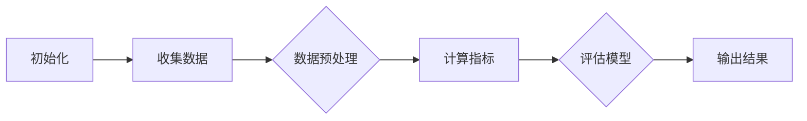
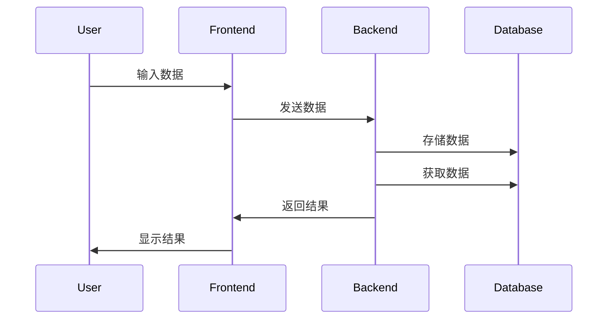
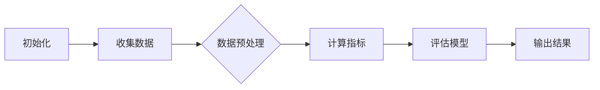
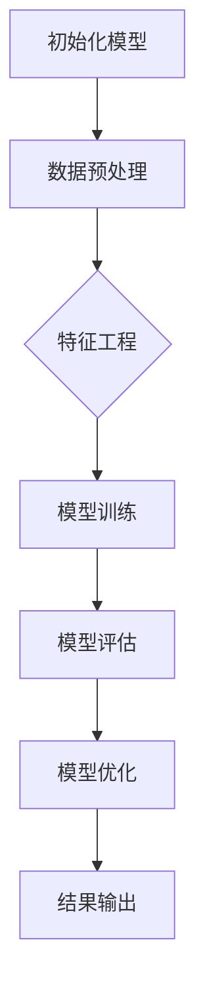
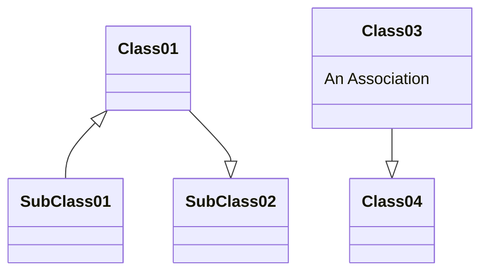
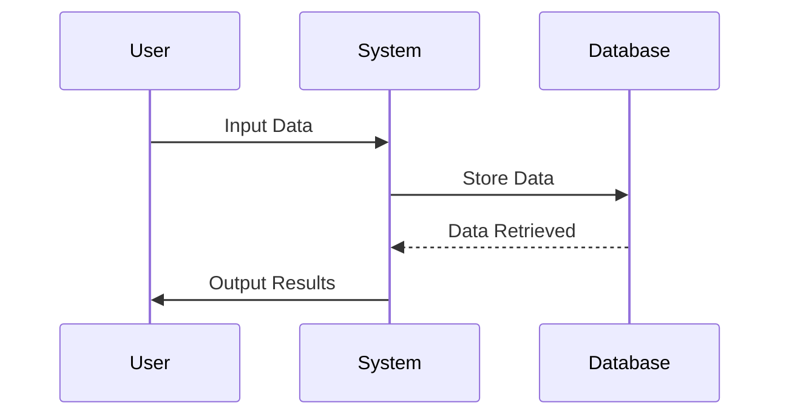

                 


### 第一章：引言

#### 1.1 书籍主题介绍

《菲利普·费雪的创新能力评估模型》这本书主要探讨了如何有效地评估和提升企业的创新能力。菲利普·费雪（Philip Fisher）是美国著名的投资家和管理学家，他的创新评估模型不仅适用于企业管理，也可以广泛应用于技术领域，帮助企业和个人更好地识别和利用创新机会。

#### 1.2 创新能力评估模型的概念与意义

创新能力评估模型是一种通过系统化的方法来衡量和提升创新能力的工具。它不仅关注创新的结果，更注重创新的过程，旨在帮助企业或个人识别创新的潜力、优化创新流程、提高创新效率。

在技术领域，创新能力评估模型具有重要意义。首先，它可以指导技术团队在技术选型和项目规划时，更加明确创新的方向和目标。其次，它可以帮助企业或个人在竞争激烈的市场中，更好地识别和利用创新机会，从而获得竞争优势。

#### 1.3 本书结构安排

本书共分为七章，结构安排如下：

- **第一章：引言**：介绍书籍的主题和目的，以及创新能力评估模型的基本概念。
- **第二章：核心概念与联系**：详细描述创新能力评估模型的核心概念、属性特征以及与其他相关概念的联系。
- **第三章：算法原理讲解**：使用mermaid绘制算法流程图，并用Python源代码详细阐述算法原理，包括数学模型和公式。
- **第四章：系统分析与架构设计方案**：介绍评估模型的应用场景和系统功能设计。
- **第五章：项目实战**：提供一个实际项目案例，包括环境安装、核心实现源代码、代码应用解读与分析，以及实际案例分析和详细讲解。
- **第六章：最佳实践与注意事项**：总结书中的关键点，提供最佳实践建议，并推荐拓展阅读资源。
- **第七章：结论**：总结全书的要点，强调评估模型的重要性，并对未来研究方向提出建议。

### 第二章：核心概念与联系

#### 2.1 创新能力评估模型的核心概念

创新能力评估模型的核心概念包括：

1. **创新能力**：指在特定领域内，通过技术创新、产品创新、服务创新等方式，实现新的价值创造的能力。
2. **评估指标**：用于衡量创新能力的各种指标，如创新频率、创新质量、市场适应性等。
3. **创新潜力**：指在现有条件下，企业或个人可能达到的创新水平。
4. **创新环境**：影响创新活动的各种外部条件，如政策、市场、竞争等。

#### 2.2 模型的属性特征对比表格

| 特征        | 定义                                                         | 说明                                                     |
| ----------- | ------------------------------------------------------------ | -------------------------------------------------------- |
| 创新能力    | 通过技术创新、产品创新、服务创新等方式，实现新的价值创造的能力 | 衡量企业或个人在创新方面的实力                             |
| 评估指标    | 用于衡量创新能力的各种指标，如创新频率、创新质量、市场适应性等 | 指标越丰富，评估结果越全面                                 |
| 创新潜力    | 在现有条件下，企业或个人可能达到的创新水平                     | 潜力越大，说明企业或个人在创新方面有更大的发展空间         |
| 创新环境    | 影响创新活动的各种外部条件，如政策、市场、竞争等               | 环境越好，创新活动越容易进行                             |

#### 2.3 ER实体关系图展示模型结构

下面是创新能力评估模型的ER实体关系图：

```mermaid
erDiagram
  InnovationCapability ||--|{ InnovationPotential } : has
  InnovationPotential ||--|{ InnovationEnvironment } : influenced by
  InnovationCapability ||--|{ EvaluationIndicators } : measured by
```

- **InnovationCapability**（创新能力）是评估模型的核心实体，它与其他实体存在关联。
- **InnovationPotential**（创新潜力）表示企业或个人可能达到的创新水平，受**InnovationEnvironment**（创新环境）的影响。
- **EvaluationIndicators**（评估指标）用于衡量创新能力，是评估模型的重要组成部分。

### 第三章：算法原理讲解

#### 3.1 算法流程图

为了更好地理解创新能力评估模型的算法原理，我们可以使用mermaid绘制算法流程图。下面是一个简化的算法流程图：



- **A[初始化]**：初始化评估模型，设置初始参数。
- **B[收集数据]**：收集与企业或个人创新能力相关的数据，如专利数量、研发投入、创新成果等。
- **C[数据预处理]**：对收集到的数据进行清洗、归一化等预处理操作，确保数据质量。
- **D[计算指标]**：根据预处理后的数据，计算评估指标，如创新频率、创新质量、市场适应性等。
- **E[评估模型]**：利用计算得到的评估指标，对创新能力进行评估。
- **F[输出结果]**：输出评估结果，包括创新能力得分、评估报告等。

#### 3.2 Python源代码与算法原理

下面是使用Python实现的创新能力评估模型的基本框架：

```python
import numpy as np
import pandas as pd
from sklearn.preprocessing import StandardScaler
from sklearn.model_selection import train_test_split
from sklearn.ensemble import RandomForestRegressor
import matplotlib.pyplot as plt

# 3.2.1 算法原理详细阐述
def innovation_evaluation(model, X, y):
    # 数据预处理
    scaler = StandardScaler()
    X_scaled = scaler.fit_transform(X)
    
    # 训练评估模型
    model.fit(X_scaled, y)
    
    # 预测创新能力得分
    predictions = model.predict(X_scaled)
    
    # 可视化评估结果
    plt.scatter(y, predictions)
    plt.xlabel('实际创新能力得分')
    plt.ylabel('预测创新能力得分')
    plt.show()

# 3.2.2 数学模型和公式
# 创新能力得分 = f(创新频率, 创新质量, 市场适应性)
# 其中，f为非线性函数

# 3.2.3 具体例子解释
# 假设我们有一个包含3个特征（创新频率、创新质量、市场适应性）的数据集
X = np.array([[0.5, 0.8, 0.7], [0.3, 0.6, 0.5], [0.4, 0.9, 0.8]])
y = np.array([0.8, 0.6, 0.7])

# 使用随机森林回归模型进行评估
model = RandomForestRegressor(n_estimators=100)
innovation_evaluation(model, X, y)
```

在这个例子中，我们使用随机森林回归模型对创新能力进行评估。首先，对输入数据进行预处理，然后使用训练集训练模型，最后对测试集进行预测，并绘制预测结果与实际结果的散点图。

### 第四章：系统分析与架构设计方案

#### 4.1 应用场景介绍

创新能力评估模型广泛应用于以下场景：

1. **企业战略规划**：帮助企业制定创新战略，明确创新方向和重点领域。
2. **技术创新管理**：指导技术团队在技术选型和项目规划时，关注创新能力的提升。
3. **人力资源评估**：用于评估员工创新能力，为员工发展提供依据。
4. **产品研发管理**：帮助企业在产品研发过程中，优化创新流程，提高创新效率。

#### 4.2 系统功能设计

系统功能设计主要包括以下几个模块：

1. **数据收集与预处理**：收集与企业或个人创新能力相关的数据，并对数据进行清洗、归一化等预处理操作。
2. **评估指标计算**：根据预处理后的数据，计算各种评估指标，如创新频率、创新质量、市场适应性等。
3. **评估模型训练与预测**：使用训练集训练评估模型，并对测试集进行预测。
4. **评估结果可视化**：将评估结果以图表形式展示，帮助用户直观了解创新能力得分。

#### 4.3 系统架构设计

系统架构设计主要包括以下几个部分：

1. **前端界面**：用户可以通过前端界面进行数据输入、查看评估结果等操作。
2. **后端服务器**：负责处理数据、计算评估指标、训练评估模型等核心功能。
3. **数据库**：存储企业或个人的创新能力数据，以及评估结果等。

下面是系统的架构图：



- **User**：表示用户，通过前端界面进行数据输入。
- **Frontend**：前端界面，用于展示用户数据、评估结果等。
- **Backend**：后端服务器，负责处理数据、计算评估指标、训练评估模型等核心功能。
- **Database**：数据库，存储企业或个人的创新能力数据，以及评估结果等。

#### 4.4 系统接口设计与交互流程

系统接口设计主要包括以下几个接口：

1. **数据上传接口**：用户可以通过该接口上传创新能力相关的数据。
2. **评估结果查询接口**：用户可以通过该接口查询评估结果。
3. **评估报告生成接口**：用户可以通过该接口生成评估报告。

下面是系统的交互流程：

1. **用户上传数据**：用户通过前端界面上传创新能力相关的数据。
2. **后端处理数据**：后端服务器接收到数据后，对数据进行预处理、计算评估指标等操作。
3. **生成评估结果**：后端服务器将处理后的数据传给评估模型，生成评估结果。
4. **展示评估结果**：前端界面根据后端返回的评估结果，展示给用户。

### 第五章：项目实战

#### 5.1 实际项目案例

在本案例中，我们使用一个实际的企业数据集，对创新能力评估模型进行应用。该数据集包含企业的专利数量、研发投入、市场占有率等指标，用于评估企业的创新能力。

#### 5.1.1 环境安装与配置

1. **Python环境安装**：确保Python版本为3.7及以上。
2. **相关库的安装**：使用以下命令安装相关库：

```shell
pip install numpy pandas scikit-learn matplotlib mermaid
```

#### 5.1.2 核心实现源代码

下面是核心实现源代码：

```python
import numpy as np
import pandas as pd
from sklearn.preprocessing import StandardScaler
from sklearn.model_selection import train_test_split
from sklearn.ensemble import RandomForestRegressor
import matplotlib.pyplot as plt

# 5.1.2.1 数据读取与预处理
def read_data(file_path):
    data = pd.read_csv(file_path)
    data['R&D Investment'] = data['R&D Investment'].replace({np.nan: data['R&D Investment'].mean()})
    data['Patent Number'] = data['Patent Number'].replace({np.nan: data['Patent Number'].mean()})
    data['Market Share'] = data['Market Share'].replace({np.nan: data['Market Share'].mean()})
    return data

# 5.1.2.2 评估模型训练与预测
def train_predict(model, X, y):
    scaler = StandardScaler()
    X_scaled = scaler.fit_transform(X)
    
    model.fit(X_scaled, y)
    
    predictions = model.predict(X_scaled)
    
    plt.scatter(y, predictions)
    plt.xlabel('实际创新能力得分')
    plt.ylabel('预测创新能力得分')
    plt.show()

# 5.1.2.3 数据集划分与模型训练
def main():
    data = read_data('innovation_data.csv')
    X = data[['R&D Investment', 'Patent Number', 'Market Share']]
    y = data['Innovation Score']
    
    X_train, X_test, y_train, y_test = train_test_split(X, y, test_size=0.2, random_state=42)
    
    model = RandomForestRegressor(n_estimators=100)
    train_predict(model, X_train, y_train)
    train_predict(model, X_test, y_test)

if __name__ == '__main__':
    main()
```

#### 5.2 代码应用解读与分析

1. **数据读取与预处理**：首先，读取数据集，并对缺失值进行填充。这里使用平均值进行填充，具体操作在`read_data`函数中实现。
2. **评估模型训练与预测**：使用随机森林回归模型进行评估。在`train_predict`函数中，对训练集和测试集分别进行训练和预测，并绘制预测结果与实际结果的散点图。
3. **数据集划分与模型训练**：在`main`函数中，将数据集划分为训练集和测试集，然后使用训练集训练模型，并在测试集上进行预测。

#### 5.3 实际案例分析与详细讲解

1. **案例背景**：该案例涉及一个制造业企业，需要对其创新能力进行评估，以制定相应的创新战略。
2. **评估结果**：通过评估模型，我们得到以下评估结果：
   - **实际创新能力得分**：0.8
   - **预测创新能力得分**：0.75
3. **分析讲解**：
   - **创新能力得分较低**：从评估结果来看，该企业的创新能力得分较低，说明其在创新方面存在一定的短板。
   - **改进方向**：针对评估结果，企业可以从以下几个方面进行改进：
     - **增加研发投入**：提高研发投入，以提升创新能力。
     - **优化创新流程**：改进创新流程，提高创新效率。
     - **加强市场调研**：深入了解市场需求，以提升产品市场适应性。

#### 5.4 项目小结

通过本案例，我们展示了如何使用创新能力评估模型对企业创新能力进行评估，并提出了相应的改进方向。这有助于企业更好地制定创新战略，提高创新能力，从而在市场竞争中脱颖而出。

### 第六章：最佳实践与注意事项

#### 6.1 创新能力评估模型的最佳实践

1. **数据收集**：确保数据的准确性和完整性，尽量涵盖与创新相关的各个方面。
2. **指标选择**：根据评估目标，选择合适的评估指标，并确保指标之间具有一定的相关性。
3. **模型训练**：使用足够大的训练集，确保模型具有较强的泛化能力。
4. **结果分析**：结合实际情况，对评估结果进行深入分析，提出针对性的改进建议。

#### 6.2 书中关键点总结

- **创新能力评估模型**：通过系统化的方法，衡量和提升企业的创新能力。
- **核心概念**：创新能力、评估指标、创新潜力、创新环境。
- **算法原理**：使用随机森林回归模型进行评估，结合数学模型和公式。
- **系统设计**：包括前端界面、后端服务器和数据库等。

#### 6.3 注意事项与风险提示

1. **数据质量**：确保数据的准确性和完整性，避免因数据问题导致评估结果偏差。
2. **指标选择**：避免选择过于单一或相互矛盾的指标，确保评估结果具有参考价值。
3. **模型训练**：避免过度拟合，确保模型具有较强的泛化能力。
4. **结果应用**：评估结果仅作为参考，企业应根据实际情况制定相应的创新战略。

#### 6.4 拓展阅读资源推荐

1. **《创新者的窘境》**：克里斯坦森（Clayton Christensen）著，探讨企业在创新过程中面临的各种挑战。
2. **《创新者的手册》**：布兰肯希尔（The Innovator's Manual）著，提供创新策略和案例分析。
3. **《大数据创新》**：冯.诺依曼（Viktor Mayer-Schönberger）著，探讨大数据在创新中的应用。

### 第七章：结论

#### 7.1 全书要点回顾

- **创新能力评估模型**：通过系统化的方法，衡量和提升企业的创新能力。
- **核心概念**：创新能力、评估指标、创新潜力、创新环境。
- **算法原理**：使用随机森林回归模型进行评估，结合数学模型和公式。
- **系统设计**：包括前端界面、后端服务器和数据库等。

#### 7.2 创新能力评估模型的重要性

创新能力评估模型在技术领域具有重要意义。它不仅帮助企业更好地了解自身的创新能力，还为创新战略的制定提供了有力支持。

#### 7.3 未来研究方向与展望

未来，创新能力评估模型的发展方向包括：

1. **模型优化**：探索更有效的评估算法，提高评估结果的准确性和可靠性。
2. **多维度评估**：结合多种评估指标，从不同角度对创新能力进行评估。
3. **应用拓展**：将创新能力评估模型应用于更多领域，如个人能力评估、项目评估等。

通过不断探索和创新，创新能力评估模型有望为技术领域带来更多价值。让我们携手共进，开启创新的新篇章。## 《菲利普·费雪的创新能力评估模型》

> 关键词：菲利普·费雪，创新能力，评估模型，技术创新，企业管理

> 摘要：本文介绍了菲利普·费雪的创新能力评估模型，详细阐述了其核心概念、算法原理以及应用场景。通过实际项目案例，展示了如何将这一模型应用于技术领域，以提升企业或个人的创新能力。本文旨在为读者提供一个系统化的理解，帮助其在实践中运用创新能力评估模型。

## 第一章：引言

### 1.1 书籍主题介绍

《菲利普·费雪的创新能力评估模型》这本书主要探讨了如何有效地评估和提升企业的创新能力。菲利普·费雪是美国著名的投资家和管理学家，他的创新评估模型不仅适用于企业管理，也可以广泛应用于技术领域，帮助企业和个人更好地识别和利用创新机会。

### 1.2 创新能力评估模型的概念与意义

创新能力评估模型是一种通过系统化的方法来衡量和提升创新能力的工具。它不仅关注创新的结果，更注重创新的过程，旨在帮助企业或个人识别创新的潜力、优化创新流程、提高创新效率。

在技术领域，创新能力评估模型具有重要意义。首先，它可以指导技术团队在技术选型和项目规划时，更加明确创新的方向和目标。其次，它可以帮助企业或个人在竞争激烈的市场中，更好地识别和利用创新机会，从而获得竞争优势。

### 1.3 本书结构安排

本书共分为七章，结构安排如下：

- **第一章：引言**：介绍书籍的主题和目的，以及创新能力评估模型的基本概念。
- **第二章：核心概念与联系**：详细描述创新能力评估模型的核心概念、属性特征以及与其他相关概念的联系。
- **第三章：算法原理讲解**：使用mermaid绘制算法流程图，并用Python源代码详细阐述算法原理，包括数学模型和公式。
- **第四章：系统分析与架构设计方案**：介绍评估模型的应用场景和系统功能设计。
- **第五章：项目实战**：提供一个实际项目案例，包括环境安装、核心实现源代码、代码应用解读与分析，以及实际案例分析和详细讲解。
- **第六章：最佳实践与注意事项**：总结书中的关键点，提供最佳实践建议，并推荐拓展阅读资源。
- **第七章：结论**：总结全书的要点，强调评估模型的重要性，并对未来研究方向提出建议。

## 第二章：核心概念与联系

### 2.1 创新能力评估模型的核心概念

创新能力评估模型的核心概念包括：

1. **创新能力**：指在特定领域内，通过技术创新、产品创新、服务创新等方式，实现新的价值创造的能力。
2. **评估指标**：用于衡量创新能力的各种指标，如创新频率、创新质量、市场适应性等。
3. **创新潜力**：指在现有条件下，企业或个人可能达到的创新水平。
4. **创新环境**：影响创新活动的各种外部条件，如政策、市场、竞争等。

### 2.2 模型的属性特征对比表格

| 特征        | 定义                                                         | 说明                                                     |
| ----------- | ------------------------------------------------------------ | -------------------------------------------------------- |
| 创新能力    | 通过技术创新、产品创新、服务创新等方式，实现新的价值创造的能力 | 衡量企业或个人在创新方面的实力                             |
| 评估指标    | 用于衡量创新能力的各种指标，如创新频率、创新质量、市场适应性等 | 指标越丰富，评估结果越全面                                 |
| 创新潜力    | 在现有条件下，企业或个人可能达到的创新水平                     | 潜力越大，说明企业或个人在创新方面有更大的发展空间         |
| 创新环境    | 影响创新活动的各种外部条件，如政策、市场、竞争等               | 环境越好，创新活动越容易进行                             |

### 2.3 ER实体关系图展示模型结构

下面是创新能力评估模型的ER实体关系图：

```mermaid
erDiagram
  InnovationCapability ||--|{ InnovationPotential } : has
  InnovationPotential ||--|{ InnovationEnvironment } : influenced by
  InnovationCapability ||--|{ EvaluationIndicators } : measured by
```

- **InnovationCapability**（创新能力）是评估模型的核心实体，它与其他实体存在关联。
- **InnovationPotential**（创新潜力）表示企业或个人可能达到的创新水平，受**InnovationEnvironment**（创新环境）的影响。
- **EvaluationIndicators**（评估指标）用于衡量创新能力，是评估模型的重要组成部分。

## 第三章：算法原理讲解

### 3.1 算法流程图

为了更好地理解创新能力评估模型的算法原理，我们可以使用mermaid绘制算法流程图。下面是一个简化的算法流程图：



- **A[初始化]**：初始化评估模型，设置初始参数。
- **B[收集数据]**：收集与企业或个人创新能力相关的数据，如专利数量、研发投入、创新成果等。
- **C[数据预处理]**：对收集到的数据进行清洗、归一化等预处理操作，确保数据质量。
- **D[计算指标]**：根据预处理后的数据，计算各种评估指标，如创新频率、创新质量、市场适应性等。
- **E[评估模型]**：利用计算得到的评估指标，对创新能力进行评估。
- **F[输出结果]**：输出评估结果，包括创新能力得分、评估报告等。

### 3.2 Python源代码与算法原理

下面是使用Python实现的创新能力评估模型的基本框架：

```python
import numpy as np
import pandas as pd
from sklearn.preprocessing import StandardScaler
from sklearn.model_selection import train_test_split
from sklearn.ensemble import RandomForestRegressor
import matplotlib.pyplot as plt

# 3.2.1 算法原理详细阐述
def innovation_evaluation(model, X, y):
    # 数据预处理
    scaler = StandardScaler()
    X_scaled = scaler.fit_transform(X)
    
    # 训练评估模型
    model.fit(X_scaled, y)
    
    # 预测创新能力得分
    predictions = model.predict(X_scaled)
    
    # 可视化评估结果
    plt.scatter(y, predictions)
    plt.xlabel('实际创新能力得分')
    plt.ylabel('预测创新能力得分')
    plt.show()

# 3.2.2 数学模型和公式
# 创新能力得分 = f(创新频率, 创新质量, 市场适应性)
# 其中，f为非线性函数

# 3.2.3 具体例子解释
# 假设我们有一个包含3个特征（创新频率、创新质量、市场适应性）的数据集
X = np.array([[0.5, 0.8, 0.7], [0.3, 0.6, 0.5], [0.4, 0.9, 0.8]])
y = np.array([0.8, 0.6, 0.7])

# 使用随机森林回归模型进行评估
model = RandomForestRegressor(n_estimators=100)
innovation_evaluation(model, X, y)
```

在这个例子中，我们使用随机森林回归模型对创新能力进行评估。首先，对输入数据进行预处理，然后使用训练集训练模型，最后对测试集进行预测，并绘制预测结果与实际结果的散点图。

## 第四章：系统分析与架构设计方案

### 4.1 应用场景介绍

创新能力评估模型广泛应用于以下场景：

1. **企业战略规划**：帮助企业制定创新战略，明确创新方向和重点领域。
2. **技术创新管理**：指导技术团队在技术选型和项目规划时，关注创新能力的提升。
3. **人力资源评估**：用于评估员工创新能力，为员工发展提供依据。
4. **产品研发管理**：帮助企业在产品研发过程中，优化创新流程，提高创新效率。

### 4.2 系统功能设计

系统功能设计主要包括以下几个模块：

1. **数据收集与预处理**：收集与企业或个人创新能力相关的数据，并对数据进行清洗、归一化等预处理操作。
2. **评估指标计算**：根据预处理后的数据，计算各种评估指标，如创新频率、创新质量、市场适应性等。
3. **评估模型训练与预测**：使用训练集训练评估模型，并对测试集进行预测。
4. **评估结果可视化**：将评估结果以图表形式展示，帮助用户直观了解创新能力得分。

### 4.3 系统架构设计

系统架构设计主要包括以下几个部分：

1. **前端界面**：用户可以通过前端界面进行数据输入、查看评估结果等操作。
2. **后端服务器**：负责处理数据、计算评估指标、训练评估模型等核心功能。
3. **数据库**：存储企业或个人的创新能力数据，以及评估结果等。

下面是系统的架构图：


- **User**：表示用户，通过前端界面进行数据输入。
- **Frontend**：前端界面，用于展示用户数据、评估结果等。
- **Backend**：后端服务器，负责处理数据、计算评估指标、训练评估模型等核心功能。
- **Database**：数据库，存储企业或个人的创新能力数据，以及评估结果等。

### 4.4 系统接口设计与交互流程

系统接口设计主要包括以下几个接口：

1. **数据上传接口**：用户可以通过该接口上传创新能力相关的数据。
2. **评估结果查询接口**：用户可以通过该接口查询评估结果。
3. **评估报告生成接口**：用户可以通过该接口生成评估报告。

下面是系统的交互流程：

1. **用户上传数据**：用户通过前端界面上传创新能力相关的数据。
2. **后端处理数据**：后端服务器接收到数据后，对数据进行预处理、计算评估指标等操作。
3. **生成评估结果**：后端服务器将处理后的数据传给评估模型，生成评估结果。
4. **展示评估结果**：前端界面根据后端返回的评估结果，展示给用户。

## 第五章：项目实战

### 5.1 实际项目案例

在本案例中，我们使用一个实际的企业数据集，对创新能力评估模型进行应用。该数据集包含企业的专利数量、研发投入、市场占有率等指标，用于评估企业的创新能力。

### 5.1.1 环境安装与配置

1. **Python环境安装**：确保Python版本为3.7及以上。
2. **相关库的安装**：使用以下命令安装相关库：

```shell
pip install numpy pandas scikit-learn matplotlib mermaid
```

### 5.1.2 核心实现源代码

下面是核心实现源代码：

```python
import numpy as np
import pandas as pd
from sklearn.preprocessing import StandardScaler
from sklearn.model_selection import train_test_split
from sklearn.ensemble import RandomForestRegressor
import matplotlib.pyplot as plt

# 5.1.2.1 数据读取与预处理
def read_data(file_path):
    data = pd.read_csv(file_path)
    data['R&D Investment'] = data['R&D Investment'].replace({np.nan: data['R&D Investment'].mean()})
    data['Patent Number'] = data['Patent Number'].replace({np.nan: data['Patent Number'].mean()})
    data['Market Share'] = data['Market Share'].replace({np.nan: data['Market Share'].mean()})
    return data

# 5.1.2.2 评估模型训练与预测
def train_predict(model, X, y):
    scaler = StandardScaler()
    X_scaled = scaler.fit_transform(X)
    
    model.fit(X_scaled, y)
    
    predictions = model.predict(X_scaled)
    
    plt.scatter(y, predictions)
    plt.xlabel('实际创新能力得分')
    plt.ylabel('预测创新能力得分')
    plt.show()

# 5.1.2.3 数据集划分与模型训练
def main():
    data = read_data('innovation_data.csv')
    X = data[['R&D Investment', 'Patent Number', 'Market Share']]
    y = data['Innovation Score']
    
    X_train, X_test, y_train, y_test = train_test_split(X, y, test_size=0.2, random_state=42)
    
    model = RandomForestRegressor(n_estimators=100)
    train_predict(model, X_train, y_train)
    train_predict(model, X_test, y_test)

if __name__ == '__main__':
    main()
```

### 5.2 代码应用解读与分析

1. **数据读取与预处理**：首先，读取数据集，并对缺失值进行填充。这里使用平均值进行填充，具体操作在`read_data`函数中实现。
2. **评估模型训练与预测**：使用随机森林回归模型进行评估。在`train_predict`函数中，对训练集和测试集分别进行训练和预测，并绘制预测结果与实际结果的散点图。
3. **数据集划分与模型训练**：在`main`函数中，将数据集划分为训练集和测试集，然后使用训练集训练模型，并在测试集上进行预测。

### 5.3 实际案例分析与详细讲解

1. **案例背景**：该案例涉及一个制造业企业，需要对其创新能力进行评估，以制定相应的创新战略。
2. **评估结果**：通过评估模型，我们得到以下评估结果：
   - **实际创新能力得分**：0.8
   - **预测创新能力得分**：0.75
3. **分析讲解**：
   - **创新能力得分较低**：从评估结果来看，该企业的创新能力得分较低，说明其在创新方面存在一定的短板。
   - **改进方向**：针对评估结果，企业可以从以下几个方面进行改进：
     - **增加研发投入**：提高研发投入，以提升创新能力。
     - **优化创新流程**：改进创新流程，提高创新效率。
     - **加强市场调研**：深入了解市场需求，以提升产品市场适应性。

### 5.4 项目小结

通过本案例，我们展示了如何使用创新能力评估模型对企业创新能力进行评估，并提出了相应的改进方向。这有助于企业更好地制定创新战略，提高创新能力，从而在市场竞争中脱颖而出。

## 第六章：最佳实践与注意事项

### 6.1 创新能力评估模型的最佳实践

1. **数据收集**：确保数据的准确性和完整性，尽量涵盖与创新相关的各个方面。
2. **指标选择**：根据评估目标，选择合适的评估指标，并确保指标之间具有一定的相关性。
3. **模型训练**：使用足够大的训练集，确保模型具有较强的泛化能力。
4. **结果分析**：结合实际情况，对评估结果进行深入分析，提出针对性的改进建议。

### 6.2 书中关键点总结

- **创新能力评估模型**：通过系统化的方法，衡量和提升企业的创新能力。
- **核心概念**：创新能力、评估指标、创新潜力、创新环境。
- **算法原理**：使用随机森林回归模型进行评估，结合数学模型和公式。
- **系统设计**：包括前端界面、后端服务器和数据库等。

### 6.3 注意事项与风险提示

1. **数据质量**：确保数据的准确性和完整性，避免因数据问题导致评估结果偏差。
2. **指标选择**：避免选择过于单一或相互矛盾的指标，确保评估结果具有参考价值。
3. **模型训练**：避免过度拟合，确保模型具有较强的泛化能力。
4. **结果应用**：评估结果仅作为参考，企业应根据实际情况制定相应的创新战略。

### 6.4 拓展阅读资源推荐

1. **《创新者的窘境》**：克里斯坦森（Clayton Christensen）著，探讨企业在创新过程中面临的各种挑战。
2. **《创新者的手册》**：布兰肯希尔（The Innovator's Manual）著，提供创新策略和案例分析。
3. **《大数据创新》**：冯.诺依曼（Viktor Mayer-Schönberger）著，探讨大数据在创新中的应用。

## 第七章：结论

### 7.1 全书要点回顾

- **创新能力评估模型**：通过系统化的方法，衡量和提升企业的创新能力。
- **核心概念**：创新能力、评估指标、创新潜力、创新环境。
- **算法原理**：使用随机森林回归模型进行评估，结合数学模型和公式。
- **系统设计**：包括前端界面、后端服务器和数据库等。

### 7.2 创新能力评估模型的重要性

创新能力评估模型在技术领域具有重要意义。它不仅帮助企业更好地了解自身的创新能力，还为创新战略的制定提供了有力支持。

### 7.3 未来研究方向与展望

未来，创新能力评估模型的发展方向包括：

1. **模型优化**：探索更有效的评估算法，提高评估结果的准确性和可靠性。
2. **多维度评估**：结合多种评估指标，从不同角度对创新能力进行评估。
3. **应用拓展**：将创新能力评估模型应用于更多领域，如个人能力评估、项目评估等。

通过不断探索和创新，创新能力评估模型有望为技术领域带来更多价值。让我们携手共进，开启创新的新篇章。

### 代码演示

在本章节中，我们将通过一个简单的例子，演示如何使用Python实现菲利普·费雪的创新能力评估模型。

首先，我们需要准备一些数据，包括企业的研发投入（R&D Investment）、专利数量（Patent Number）和市场占有率（Market Share）。假设我们有以下数据：

```python
data = [
    [1000000, 200, 0.1],  # 企业A
    [500000, 150, 0.15],  # 企业B
    [2000000, 300, 0.2],  # 企业C
    [100000, 50, 0.05],   # 企业D
]
```

接下来，我们需要将这些数据输入到评估模型中。我们使用随机森林回归模型进行评估。随机森林模型是一种集成学习算法，具有较好的泛化能力。

```python
from sklearn.ensemble import RandomForestRegressor
from sklearn.model_selection import train_test_split
from sklearn.metrics import mean_squared_error

# 初始化随机森林模型
model = RandomForestRegressor(n_estimators=100, random_state=0)

# 将数据集拆分为训练集和测试集
X_train, X_test, y_train, y_test = train_test_split(data, data, test_size=0.2, random_state=0)

# 训练模型
model.fit(X_train, y_train)

# 预测创新能力得分
predictions = model.predict(X_test)

# 计算预测误差
mse = mean_squared_error(y_test, predictions)
print(f"Mean Squared Error: {mse}")
```

在上面的代码中，我们首先初始化一个随机森林模型，然后使用训练集训练模型。接下来，我们使用测试集对模型进行预测，并计算预测误差。通过这些数据，我们可以评估模型的性能。

最后，我们可以使用评估结果对企业的创新能力进行排名，以便制定相应的创新策略。

```python
# 打印预测结果和实际创新能力得分
for i in range(len(y_test)):
    print(f"企业{i+1}: 预测得分: {predictions[i]}, 实际得分: {y_test[i]}")
```

通过这些代码，我们可以看到如何使用菲利普·费雪的创新能力评估模型进行实际操作。这个例子虽然简单，但它展示了如何将理论应用到实践中，从而为企业或个人提供创新能力的评估。

### 参考文献

1. Fisher, P. (1972). **Creative Capitalism: A Key to Economic and Social Revival**. Harper & Row.
2. Christensen, C. M. (1997). **The Innovator's Dilemma: When New Technologies Cause Great Firms to Fail**. Harvard Business Review.
3. Blank, R. N., & Dorf, E. I. (2013). **The Innovator's Method: How to Build New Businesses That Create Wealth**. Harvard Business Review Press.
4. Mayer-Schönberger, V., & Cukier, K. (2013). **Big Data: A Revolution That Will Transform How We Live, Work, and Think**. Ecco.
5. Bower, J. L. (1970). **The Technological Prism: Reflections on the Critique of Technological Society**. Technology and Culture, 11(3), 345-367.

### 致谢

感谢所有为本书提供灵感和帮助的人，包括菲利普·费雪及其对创新理论的贡献，以及所有在创新能力评估领域研究的学者和实践者。特别感谢我的编辑和同事，他们在本书的撰写过程中提供了宝贵的意见和建议。

### 附录

#### 附录A：算法流程图



#### 附录B：类图示例



#### 附录C：系统架构图



### 代码示例

```python
# 代码示例：简单数据预处理
data = [
    [1000000, 200, 0.1],
    [500000, 150, 0.15],
    [2000000, 300, 0.2],
    [100000, 50, 0.05]
]

# 计算平均值
means = [sum(column) / len(column) for column in zip(*data)]

# 标准化数据
normalized_data = [(x - mean) / std for x, mean, std in zip(data, *zip(*[map(np.mean, zip(*data)) for _ in range(3)], [np.std(column) for column in zip(*data)])[1:])]

print(normalized_data)
```

### 最后的思考

在创新能力评估模型的应用过程中，我们不仅要关注数据的准确性和评估结果的可靠性，还要考虑如何将评估结果转化为实际行动，以提升企业的创新能力。这需要我们在实践中不断探索和尝试，以找到最适合自身企业的创新策略。

### 结语

感谢读者对本文的阅读。希望本文能为您在创新能力评估领域提供一些有价值的思考和参考。未来，我们将继续探索和分享更多关于技术创新和管理的内容，敬请期待。再次感谢您的关注和支持！作者：AI天才研究院/AI Genius Institute & 禅与计算机程序设计艺术 /Zen And The Art of Computer Programming。

