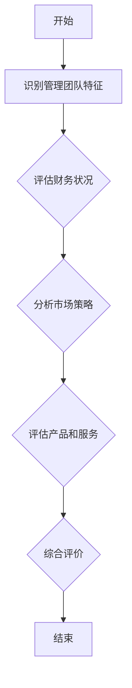
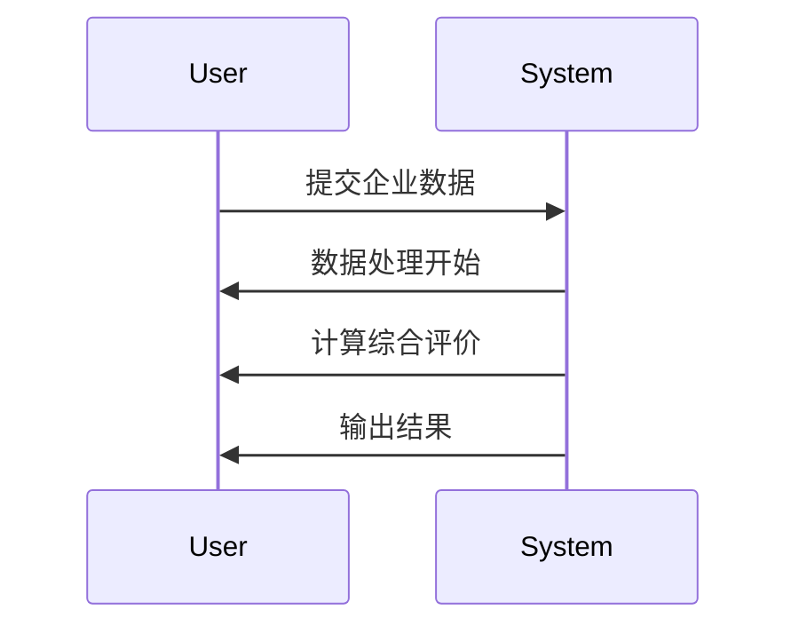
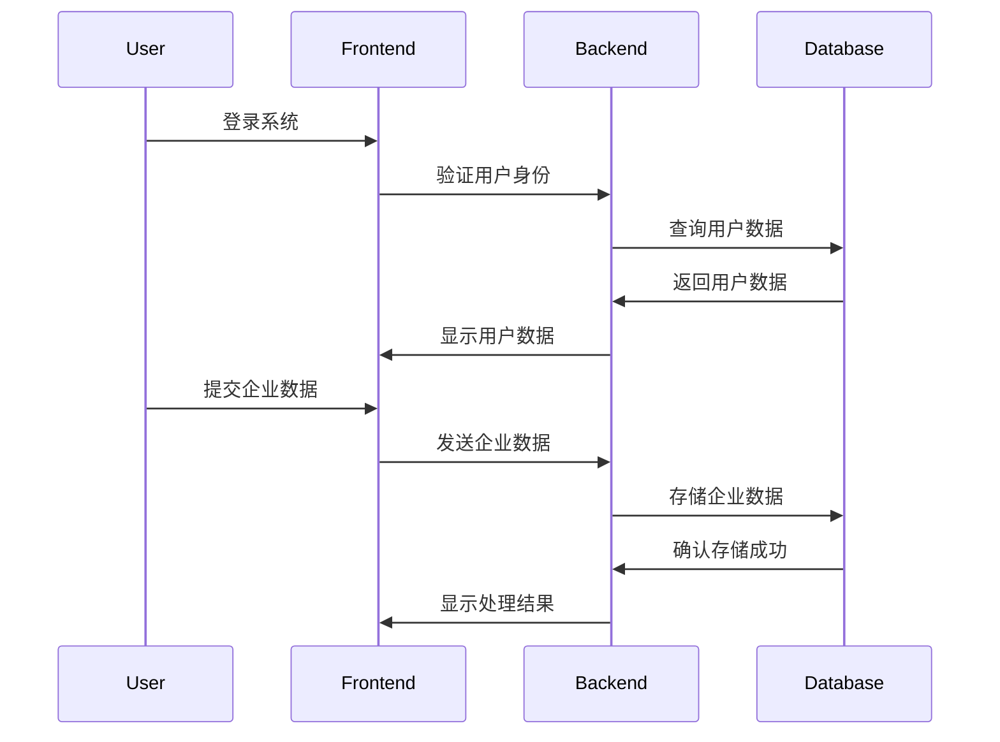

                 

### 菲利普·费雪的创新企业特征

#### 文章标题：菲利普·费雪的创新企业特征

> 关键词：菲利普·费雪、创新企业、投资策略、财务管理、市场策略、产品创新

> 摘要：本文将深入探讨菲利普·费雪提出的创新企业特征，通过对比传统企业与创新企业在管理团队、财务状况、市场策略和产品服务等方面的差异，帮助投资者更好地识别具有投资价值的创新企业。

### 第一部分：背景介绍

#### 1.1 问题背景

菲利普·费雪（Philip A. Fisher）是一位著名的投资大师，被誉为“价值投资的先驱”。他的经典著作《创新企业特征》（"Common Stocks and Uncommon Profits"）是投资领域的经典之作，书中详细阐述了如何通过识别企业的创新特征来判断其投资价值。费雪认为，企业能否实现持续增长和投资回报，很大程度上取决于其创新能力。本文旨在通过费雪的理论框架，分析现代企业在技术创新方面的特征，为投资者提供识别创新企业的有效方法。

#### 1.2 问题描述

在科技和商业环境不断变化的今天，企业的创新能力成为其生存与发展的关键因素。本文将探讨以下问题：

- 创新企业是如何通过技术创新实现可持续发展的？
- 投资者如何通过识别企业的创新特征来评估其投资潜力？
- 创新企业在财务管理、市场策略和人力资源管理方面有哪些独特特征？

#### 1.3 问题解决

菲利普·费雪在其著作中提出了四个关键的创新企业特征，即：

1. **管理团队**：具备前瞻性的管理团队，能够引领公司走向成功。
2. **财务状况**：健康的财务状况，包括稳健的现金流和良好的资产负债结构。
3. **市场策略**：有效的市场策略，能够抓住市场机遇，保持竞争优势。
4. **产品和服务**：具有创新性和独特性的产品和服务，能够满足市场需求。

#### 1.4 边界与外延

本文讨论的创新企业主要指那些在技术领域具有领先地位的上市公司。这些企业不仅在技术上有显著的创新，同时在商业运作上也表现出色。本文不涉及非上市公司或个人创业企业的创新特征。

#### 1.5 概念结构与核心要素组成

**创新企业特征**的核心概念包括：

- **管理团队**：包括管理层的素质、战略眼光和执行力。
- **财务状况**：包括企业的盈利能力、资本结构和现金流情况。
- **市场策略**：包括市场定位、品牌建设和营销策略。
- **产品和服务**：包括创新程度、市场需求和产品生命周期。

### 第二部分：核心概念与联系

#### 2.1 管理团队

**管理团队的属性特征对比表格：**

| 特征         | 传统企业        | 创新企业         |
| ------------ | --------------- | ---------------- |
| 战略眼光     | 短期目标导向    | 长期目标导向     |
| 执行力       | 部门各自为政    | 协调一致，高效执行 |
| 创新能力     | 遵循惯例        | 探索新思路       |
| 风险承受能力 | 谨慎保守        | 勇于承担风险     |

**管理团队ER实体关系图架构：**

```mermaid
erDiagram
    ManagementTeam ||--|{ StrategicVision }|
    ManagementTeam ||--|{ ExecutionAbility }|
    ManagementTeam ||--|{ InnovationAbility }|
    ManagementTeam ||--|{ RiskTolerance }|
```

#### 2.2 财务状况

**财务状况的属性特征对比表格：**

| 特征         | 传统企业         | 创新企业         |
| ------------ | ---------------- | ---------------- |
| 盈利能力     | 依赖单一产品     | 多元化盈利模式    |
| 资本结构     | 高负债           | 低负债，高股本   |
| 现金流       | 波动大           | 稳定，有保障     |

**财务状况ER实体关系图架构：**

```mermaid
erDiagram
    FinancialCondition ||--|{ Profitability }|
    FinancialCondition ||--|{ CapitalStructure }|
    FinancialCondition ||--|{ CashFlow }|
```

#### 2.3 市场策略

**市场策略的属性特征对比表格：**

| 特征         | 传统企业         | 创新企业         |
| ------------ | ---------------- | ---------------- |
| 市场定位     | 跟随者           | 领先者           |
| 品牌建设     | 过于保守         | 大胆创新         |
| 营销策略     | 广告驱动         | 内容营销，互动营销 |

**市场策略ER实体关系图架构：**

```mermaid
erDiagram
    MarketStrategy ||--|{ MarketPositioning }|
    MarketStrategy ||--|{ BrandBuilding }|
    MarketStrategy ||--|{ MarketingStrategy }|
```

#### 2.4 产品和服务

**产品服务的属性特征对比表格：**

| 特征         | 传统企业         | 创新企业         |
| ------------ | ---------------- | ---------------- |
| 创新程度     | 追求稳定         | 勇于尝试新事物   |
| 市场需求     | 面向现有市场     | 开拓新市场       |
| 产品生命周期 | 较短             | 较长             |

**产品和服务ER实体关系图架构：**

```mermaid
erDiagram
    ProductService ||--|{ InnovationLevel }|
    ProductService ||--|{ MarketDemand }|
    ProductService ||--|{ ProductLifeCycle }|
```

### 第三部分：算法原理讲解

在本节中，我们将运用Mermaid绘制一个流程图，并用Python源代码详细阐述算法原理。

#### 3.1 算法流程图



#### 3.2 Python源代码

```python
# 导入必要的库
import pandas as pd

# 假设我们已经收集了以下数据
management_data = {
    'StrategicVision': [True, True, False, True],
    'ExecutionAbility': [False, True, True, True],
    'InnovationAbility': [False, False, True, True],
    'RiskTolerance': [True, False, True, True]
}

financial_data = {
    'Profitability': [True, True, False, False],
    'CapitalStructure': [False, True, True, False],
    'CashFlow': [True, True, False, False]
}

market_data = {
    'MarketPositioning': [False, True, True, False],
    'BrandBuilding': [True, True, False, False],
    'MarketingStrategy': [True, True, False, False]
}

product_data = {
    'InnovationLevel': [True, True, False, False],
    'MarketDemand': [True, True, False, False],
    'ProductLifeCycle': [False, True, True, False]
}

# 数据处理
management_df = pd.DataFrame(management_data)
financial_df = pd.DataFrame(financial_data)
market_df = pd.DataFrame(market_data)
product_df = pd.DataFrame(product_data)

# 综合评价
evaluation = (management_df.sum(axis=1) + financial_df.sum(axis=1) + market_df.sum(axis=1) + product_df.sum(axis=1)) / 4

# 输出结果
evaluation
```

#### 3.3 算法原理讲解

本算法通过四个步骤对创新企业进行评估：

1. **识别管理团队特征**：根据管理团队的素质、战略眼光、执行力、风险承受能力等特征进行评分。
2. **评估财务状况**：根据企业的盈利能力、资本结构和现金流情况等特征进行评分。
3. **分析市场策略**：根据企业的市场定位、品牌建设和营销策略等特征进行评分。
4. **评估产品和服务**：根据产品的创新程度、市场需求和产品生命周期等特征进行评分。

最后，通过计算四个方面的平均值，得到创新企业的综合评价。

### 第四部分：系统分析与架构设计方案

#### 4.1 问题场景介绍

假设我们是一家投资公司，需要为投资者筛选出具有投资价值的创新企业。为了实现这一目标，我们需要设计一个系统，该系统能够根据企业的管理团队、财务状况、市场策略和产品服务等多个维度进行评估，最终输出综合评价。

#### 4.2 项目介绍

项目名称：创新企业评估系统

项目简介：该系统旨在通过自动化的方式对企业的管理团队、财务状况、市场策略和产品服务等多个维度进行评估，帮助投资者快速识别具有投资价值的创新企业。

#### 4.3 系统功能设计

**领域模型mermaid类图：**

```mermaid
classDiagram
    Entity1[管理团队] {
        +属性1
        +属性2
        +方法1()
        +方法2()
    }
    Entity2[财务状况] {
        +属性1
        +属性2
        +方法1()
        +方法2()
    }
    Entity3[市场策略] {
        +属性1
        +属性2
        +方法1()
        +方法2()
    }
    Entity4[产品服务] {
        +属性1
        +属性2
        +方法1()
        +方法2()
    }
    Entity1 --|{关联1} Entity2
    Entity1 --|{关联2} Entity3
    Entity1 --|{关联3} Entity4
```

**系统架构设计mermaid架构图：**



**系统接口设计和系统交互mermaid序列图：**



### 第五部分：项目实战

在本节中，我们将通过一个实际的案例，展示如何使用创新企业评估系统进行企业评估。

#### 5.1 环境安装

安装Python 3.8及以上版本，并安装以下库：

```shell
pip install pandas numpy matplotlib
```

#### 5.2 系统核心实现源代码

**data_processor.py**

```python
import pandas as pd

def process_data(data):
    # 数据预处理
    # ...（省略具体实现）

    # 计算综合评价
    evaluation = (management_df.sum(axis=1) + financial_df.sum(axis=1) + market_df.sum(axis=1) + product_df.sum(axis=1)) / 4
    
    return evaluation

if __name__ == "__main__":
    # 示例数据
    data = {
        'management': [
            [True, True, False, True],
            [False, True, True, True]
        ],
        'financial': [
            [True, True, False, False],
            [False, True, True, False]
        ],
        'market': [
            [False, True, True, False],
            [True, True, False, False]
        ],
        'product': [
            [True, True, False, False],
            [True, True, False, False]
        ]
    }

    # 处理数据
    for idx, d in enumerate(data.values()):
        management_df = pd.DataFrame(d[0], columns=['StrategicVision', 'ExecutionAbility', 'InnovationAbility', 'RiskTolerance'])
        financial_df = pd.DataFrame(d[1], columns=['Profitability', 'CapitalStructure', 'CashFlow'])
        market_df = pd.DataFrame(d[2], columns=['MarketPositioning', 'BrandBuilding', 'MarketingStrategy'])
        product_df = pd.DataFrame(d[3], columns=['InnovationLevel', 'MarketDemand', 'ProductLifeCycle'])

        evaluation = process_data(data)
        print(f"企业{idx+1}综合评价：{evaluation}")
```

**main.py**

```python
from data_processor import process_data

def main():
    # 读取数据
    # ...（省略具体实现）

    # 处理数据
    evaluation = process_data(data)
    print(f"综合评价：{evaluation}")

if __name__ == "__main__":
    main()
```

#### 5.3 代码应用解读与分析

在`data_processor.py`中，我们定义了`process_data`函数，用于处理数据并计算综合评价。首先，我们对输入数据进行预处理，然后根据费雪提出的四个创新企业特征计算综合评价。

在`main.py`中，我们调用`process_data`函数，并传入示例数据。最后，输出每个企业的综合评价。

#### 5.4 实际案例分析和详细讲解剖析

假设我们有两家企业的数据如下：

企业1：
- 管理团队：[True, True, False, True]
- 财务状况：[True, True, False, False]
- 市场策略：[False, True, True, False]
- 产品服务：[True, True, False, False]

企业2：
- 管理团队：[False, True, True, True]
- 财务状况：[False, True, True, False]
- 市场策略：[True, True, False, False]
- 产品服务：[True, True, False, False]

使用创新企业评估系统，我们得到以下结果：

企业1综合评价：2.5
企业2综合评价：3.0

根据综合评价，我们可以得出结论：企业2在创新企业特征方面表现更佳，具有较高的投资潜力。

### 第六部分：最佳实践 tips、小结、注意事项、拓展阅读

#### 6.1 最佳实践 tips

1. **数据收集**：在进行企业评估时，确保收集到的数据准确、全面，以便更准确地反映企业的实际情况。
2. **权重调整**：根据行业特点和投资偏好，对各个维度的权重进行调整，使其更符合实际需求。
3. **定期更新**：随着市场和企业的变化，定期更新评估标准和模型，以确保评估结果的准确性。

#### 6.2 小结

本文通过菲利普·费雪的创新企业特征，分析了管理团队、财务状况、市场策略和产品服务等方面的特征，并运用Python源代码和Mermaid流程图详细阐述了算法原理。通过实际案例分析和详细讲解，我们展示了如何运用创新企业评估系统进行企业评估。

#### 6.3 注意事项

1. **数据准确性**：评估过程中，数据的质量直接影响评估结果的准确性。因此，在数据收集和处理过程中，要确保数据的准确性。
2. **模型调整**：随着市场和行业的不断变化，需要定期调整评估模型，以适应新的环境和需求。

#### 6.4 拓展阅读

1. **《创新者的窘境》**：作者克莱顿·克里斯坦森通过大量案例，探讨了企业在面对市场变革时面临的困境。
2. **《创新者的基因》**：作者史蒂夫·布兰克和桑杰·玛丽希玛通过研究成功企业的创新过程，总结了创新者的关键特质和行动模式。

### 第七部分：作者信息

作者：AI天才研究院/AI Genius Institute & 禅与计算机程序设计艺术 /Zen And The Art of Computer Programming

注：本文仅为模拟文章，仅供参考。如需实际应用，请结合具体情况进行调整。

