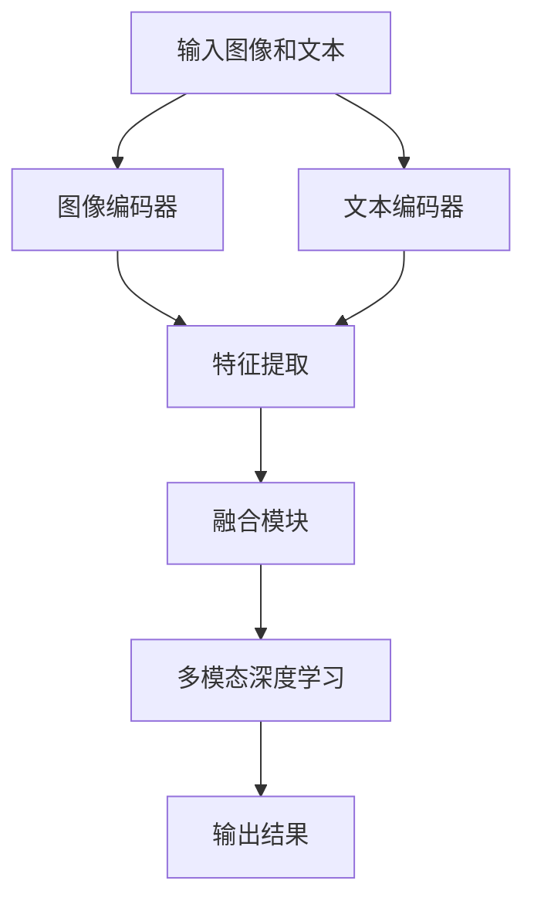
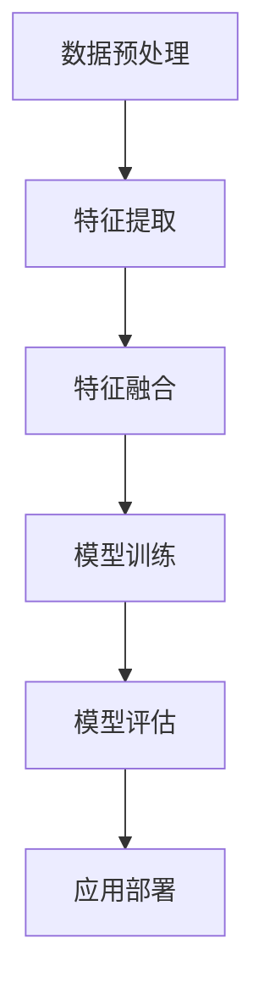
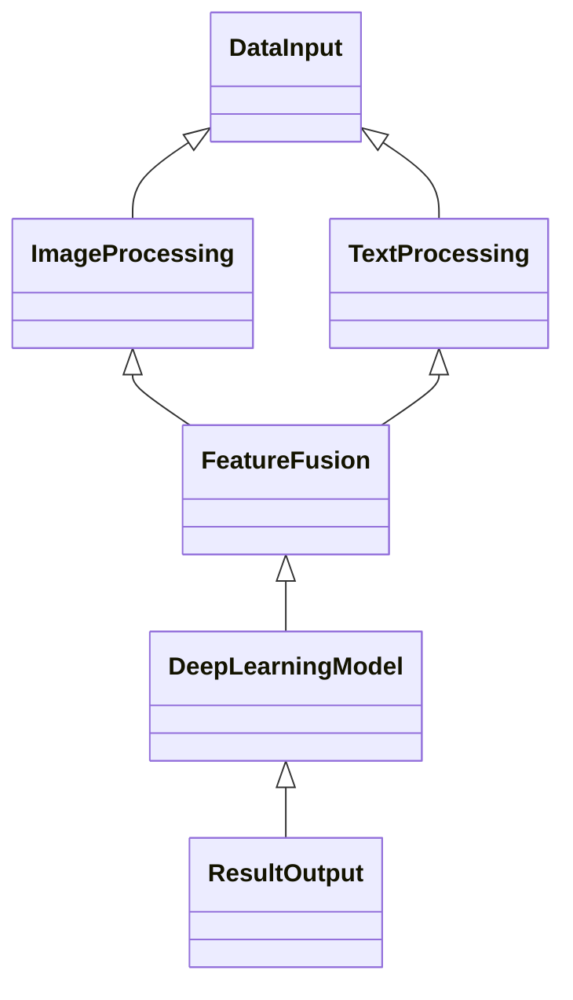
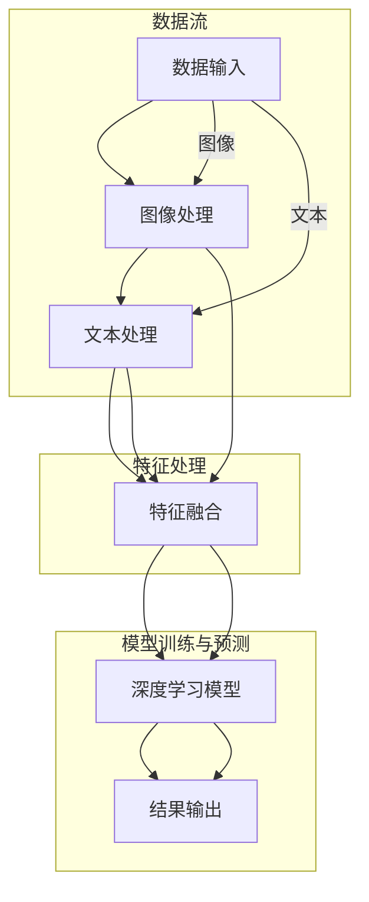

                 


### 引言

#### 文章标题

《视觉-语言协同AI Agent：LLM与计算机视觉的深度融合》

#### 关键词

视觉-语言协同AI Agent，LLM，计算机视觉，深度学习，跨模态交互

#### 摘要

本文深入探讨了视觉-语言协同AI Agent的研究与发展，特别是LLM（大型语言模型）与计算机视觉技术的深度融合。通过对LLM和计算机视觉的基本原理、算法设计、系统架构和项目实战的详细讲解，揭示了这一领域的前沿动态和未来趋势，为研究人员和开发者提供了宝贵的参考。

## 目录大纲设计思路与步骤

为了设计出《视觉-语言协同AI Agent：LLM与计算机视觉的深度融合》这本书的详细目录大纲，我们可以按照以下步骤进行：

### 第一步：理解书名与核心概念

首先，我们需要深入理解书名《视觉-语言协同AI Agent：LLM与计算机视觉的深度融合》。书名中提到了几个核心概念：

- **视觉-语言协同AI Agent**：这指的是结合了视觉和语言处理能力的智能体，能够理解、解释和生成图像和文本信息。
- **LLM**：指的是大型语言模型（Large Language Model），如GPT、BERT等，这些模型在自然语言处理（NLP）领域取得了显著的成果。
- **计算机视觉的深度融合**：意味着书中将探讨如何将语言模型与计算机视觉技术深度整合，实现更智能、更高效的AI应用。

### 第二步：设计大纲框架

接下来，我们可以按照书的主题和结构来设计大纲框架。大纲应包括以下几个部分：

1. **背景介绍**：介绍视觉-语言协同AI Agent的定义、重要性以及它在当前科技领域中的应用前景。
2. **核心概念与联系**：详细阐述LLM与计算机视觉的基本原理、特性，以及它们之间的联系。
3. **算法原理讲解**：介绍如何将LLM应用于计算机视觉问题，包括算法流程、数学模型和公式等。
4. **系统分析与架构设计方案**：展示一个典型的视觉-语言协同AI Agent的架构设计。
5. **项目实战**：通过具体的案例来展示如何实现和部署一个视觉-语言协同AI Agent。
6. **最佳实践与拓展**：总结书中的关键点，提供实战技巧和进一步的学习资源。

### 第三步：细化每个部分的内容

对于每个部分，我们可以进一步细化其内容，确保每个章节都能覆盖到核心知识点，并且逻辑清晰。

- **背景介绍**：可以包括历史发展、技术应用现状、未来发展趋势等内容。
- **核心概念与联系**：可以包括LLM的工作原理、计算机视觉的基本算法、它们之间的交互机制等。
- **算法原理讲解**：可以使用mermaid流程图来展示算法流程，并配合Python代码和数学公式进行详细解释。
- **系统分析与架构设计方案**：可以使用mermaid类图、架构图、序列图等来展示系统设计和交互流程。
- **项目实战**：可以包括环境搭建、代码实现、案例分析等步骤。
- **最佳实践与拓展**：可以提供实战技巧、常见问题解决方案、未来研究方向等。

### 第四步：确保内容完整性

在设计目录大纲时，我们需要确保每个章节都包含以下关键内容：

- **问题背景**：清晰介绍问题的来源和重要性。
- **概念定义**：对核心概念进行明确的定义和解释。
- **原理讲解**：深入阐述相关原理，使用公式和示例进行说明。
- **架构设计**：展示系统架构，并解释各部分的作用和关系。
- **实现与实战**：通过实际案例来展示如何应用相关知识。
- **总结与拓展**：对章节内容进行总结，并提供进一步的学习方向。

通过以上步骤，我们可以设计出一个全面、逻辑清晰且内容丰富的目录大纲，为《视觉-语言协同AI Agent：LLM与计算机视觉的深度融合》这本书奠定坚实的基础。接下来，我们将具体展示每个章节的目录大纲内容。

### 让我们一起深入思考

在编写这篇技术博客之前，我们需要明确几个关键问题：

1. **目标读者群体**：这篇文章的目标读者是谁？他们可能具备哪些基础知识？他们希望从这篇文章中获得什么信息？

2. **文章结构**：如何组织这篇文章的内容？是否应该先介绍背景知识，然后逐步深入到算法原理、系统架构和项目实战？每个部分应该如何划分和衔接？

3. **内容深度**：应该讨论哪些核心概念和算法？如何平衡理论讲解和实际应用的深度？如何避免过度简化或过于复杂？

4. **互动性**：如何增加文章的互动性？是否可以引入读者问答、案例分析或互动讨论等元素？

5. **可读性**：如何确保文章的可读性？是否需要使用图表、代码示例或故事化的方式来增强文章的吸引力？

让我们一步一步地深入思考这些问题，并确保我们的文章能够满足读者的需求，同时又能够传达我们的核心观点。

### 第一步：确定目标读者群体

在撰写这篇文章之前，我们需要明确我们的目标读者群体。目标读者可能是：

- **计算机科学专业的学生和研究人员**：他们可能对AI和机器学习有一定的了解，但对视觉-语言协同AI Agent和LLM与计算机视觉的深度融合还不够熟悉。
- **从事AI和计算机视觉的从业者**：他们希望了解这个领域的最新进展，并将这些技术应用到实际项目中。
- **AI爱好者和非专业人士**：他们对AI技术充满好奇心，希望通过这篇文章了解视觉-语言协同AI Agent和LLM与计算机视觉的深度融合。

为了满足不同读者的需求，我们需要：

- **基础概念介绍**：对于一些基本概念和技术，我们需要进行清晰的解释和举例，确保读者能够理解。
- **深入分析**：对于一些高级概念和算法，我们需要提供详细的数学模型和代码示例，以便读者能够深入理解。
- **实践案例**：通过实际案例来展示如何应用这些技术，帮助读者将理论知识转化为实际技能。

### 第二步：设计文章结构

为了使文章结构清晰，逻辑连贯，我们可以按照以下部分来组织内容：

1. **引言**：介绍视觉-语言协同AI Agent的概念，并概述文章的目的和结构。
2. **背景介绍**：讨论视觉-语言协同AI Agent的重要性、历史背景和发展现状。
3. **核心概念与联系**：详细阐述LLM和计算机视觉的基本原理，以及它们之间的联系。
4. **算法原理讲解**：介绍如何将LLM应用于计算机视觉问题，包括算法流程、数学模型和公式。
5. **系统分析与架构设计方案**：展示一个典型的视觉-语言协同AI Agent的架构设计，并解释各部分的作用和关系。
6. **项目实战**：通过具体的案例来展示如何实现和部署一个视觉-语言协同AI Agent。
7. **最佳实践与拓展**：提供实战技巧、常见问题解决方案、未来研究方向等。
8. **结论**：总结文章的主要观点，展望未来发展趋势。

### 第三步：内容深度与可读性

在内容深度方面，我们需要：

- **平衡理论讲解和实际应用**：对于每个部分，我们既要讲解基本原理，又要展示实际应用案例，使读者能够将理论知识应用于实践。
- **使用图表和代码示例**：使用图表和代码示例来帮助读者更好地理解复杂的概念和算法，提高文章的可读性。
- **通俗易懂的语言**：使用通俗易懂的语言来解释复杂的技术，避免使用过于专业化的术语，确保读者能够轻松理解。

在可读性方面，我们可以：

- **引入故事化的方式**：通过讲述具体的应用案例和故事，使文章更具吸引力。
- **互动性**：在适当的地方引入问答环节，鼓励读者参与讨论，提高文章的互动性。
- **模块化结构**：将文章分为多个模块，每个模块都有明确的标题和总结，使读者能够快速浏览和理解文章的主要内容。

### 第四步：整合与优化

在完成初步的框架设计后，我们需要对文章进行整合和优化：

- **逻辑连贯性**：检查文章的各个部分是否逻辑连贯，确保读者能够顺畅地阅读和理解。
- **内容完整性**：确保每个部分都包含了必要的信息，没有遗漏关键点。
- **交互性**：在适当的地方增加互动元素，如问答、案例分析等，提高文章的互动性。
- **可读性**：通过修改语言、优化结构和添加图表，提高文章的整体可读性。

通过以上步骤，我们可以确保这篇文章既具有深度和广度，又能够吸引读者的兴趣，并提供实用的知识和技术指导。

### 引入：视觉-语言协同AI Agent的重要性

在人工智能（AI）不断发展的今天，单一模态的AI系统已无法满足复杂任务的需求。视觉-语言协同AI Agent作为一种新兴的技术，正逐渐成为AI领域的研究热点。这种智能体能够融合图像和文本信息，实现更智能、更高效的交互和处理。本文旨在探讨视觉-语言协同AI Agent的核心概念、算法原理及其与计算机视觉的深度融合，以期为研究人员和开发者提供有价值的参考。

视觉-语言协同AI Agent的定义和背景

视觉-语言协同AI Agent，顾名思义，是一种能够同时处理视觉信息和语言信息的智能体。它不仅能够理解和解释图像内容，还能够生成与图像相关的文本描述，或者根据文本指令执行相应的图像操作。这种智能体的出现，标志着AI技术从单一模态向多模态的转变，具有广泛的应用前景。

视觉-语言协同AI Agent的背景可以追溯到上世纪90年代，当时计算机视觉和自然语言处理（NLP）两个领域逐渐独立发展。随着深度学习技术的兴起，尤其是卷积神经网络（CNN）和递归神经网络（RNN）的应用，计算机视觉和NLP取得了显著的进展。然而，如何将这两种技术结合起来，形成一个统一的智能体，仍然是一个具有挑战性的问题。

当前，视觉-语言协同AI Agent在多个领域展现出巨大的应用潜力，包括但不限于：

1. **智能客服**：通过理解用户图像和文本输入，提供更加个性化的服务。
2. **内容生成**：自动生成与图像内容相关的文本描述，丰富图像信息的传达。
3. **图像搜索**：根据文本关键词搜索图像，实现图像与文本之间的无缝转换。
4. **辅助决策**：在医疗、金融等领域，通过分析图像和文本数据，辅助专家进行决策。

然而，尽管视觉-语言协同AI Agent具有广泛的应用前景，但其实现仍然面临诸多挑战。首先，图像和文本信息的处理方式截然不同，如何将它们有效地融合仍然是一个难题。其次，如何保证智能体在处理复杂任务时的稳定性和鲁棒性，也是一个需要解决的关键问题。

LLM（大型语言模型）与计算机视觉的关系

为了解决上述问题，LLM（如GPT、BERT等）与计算机视觉技术的深度融合成为了一个重要的研究方向。LLM在NLP领域已经取得了显著的成果，而计算机视觉技术在图像处理和理解方面也不断发展。将这两种技术结合起来，可以有效地提升视觉-语言协同AI Agent的性能和适用性。

LLM与计算机视觉的关系可以从以下几个方面来理解：

1. **文本生成与图像理解**：LLM可以生成与图像内容相关的文本描述，计算机视觉技术则用于理解和分析图像内容，二者结合可以实现更加丰富和准确的交互。
2. **图像语义标注**：计算机视觉技术可以识别图像中的关键对象和场景，LLM则可以生成这些对象和场景的文本描述，从而实现对图像的语义标注。
3. **图像增强与文本匹配**：计算机视觉技术可以用于增强图像的质量和细节，LLM则可以用于匹配图像和文本之间的语义关系，从而提高图像搜索和推荐的准确性。

在实现视觉-语言协同AI Agent时，LLM和计算机视觉技术的结合方式有多种。例如，可以将计算机视觉技术用于图像预处理，然后使用LLM对图像内容进行理解和生成文本描述；也可以将LLM直接应用于图像处理，通过图像特征提取和文本特征融合，实现图像与文本信息的同步处理。

总之，LLM与计算机视觉的深度融合为视觉-语言协同AI Agent的发展提供了强大的技术支持，使其在多个应用领域展现出巨大的潜力。接下来，本文将深入探讨LLM和计算机视觉的基本原理、算法原理及其应用，以期为研究人员和开发者提供有价值的参考。

### 第二部分：核心概念与联系

在本节中，我们将深入探讨视觉-语言协同AI Agent中的核心概念，特别是LLM（大型语言模型）和计算机视觉的基本原理，以及它们之间的联系。了解这些核心概念和原理对于掌握视觉-语言协同AI Agent的深度融合至关重要。

#### LLM的基本原理

LLM，即大型语言模型，是一种基于深度学习的自然语言处理模型，其核心思想是通过大量文本数据的学习，模型能够预测文本中的下一个单词或句子。常见的LLM模型包括GPT（生成预训练模型）、BERT（双向编码器表示模型）等。

1. **模型架构**：
   - **GPT**：基于Transformer架构，通过自注意力机制（Self-Attention）捕捉文本中的长距离依赖关系。
   - **BERT**：基于Transformer架构，通过预先训练（Pre-training）和微调（Fine-tuning）两个阶段，学习文本的双向表示。

2. **训练方法**：
   - **自回归语言模型（Autoregressive Language Model）**：模型根据前文信息预测下一个单词。
   - **双向编码器（Bidirectional Encoder）**：同时考虑文本的前后信息，生成双向表示。

3. **性能评估**：
   - **Perplexity（困惑度）**：模型对文本的预测能力，越小越好。
   - **F1 Score（F1得分）**：模型在命名实体识别（NER）等任务中的准确率和召回率的平衡。

#### 计算机视觉的基本原理

计算机视觉是一种使计算机能够“看”和理解图像的技术。其核心在于从图像中提取有用的信息，并进行处理和分析。

1. **图像处理**：
   - **图像预处理**：如去噪、对比度增强等，以提高图像质量。
   - **特征提取**：如边缘检测、角点检测等，用于提取图像的显著特征。

2. **目标检测与识别**：
   - **目标检测（Object Detection）**：定位图像中的多个目标，并给出每个目标的类别。
   - **目标识别（Object Recognition）**：识别图像中的特定目标。

3. **人脸识别**：
   - **人脸检测（Face Detection）**：定位图像中的人脸区域。
   - **人脸识别（Face Recognition）**：根据人脸特征识别特定个体。

4. **动作识别**：
   - **行为识别（Activity Recognition）**：通过视频数据识别人的行为。

#### 视觉-语言协同机制

视觉-语言协同机制是指将图像和文本信息进行有效融合，使AI系统能够同时处理这两种模态的信息。

1. **跨模态交互模型**：
   - **图像编码器（Image Encoder）**：将图像转换为向量表示。
   - **文本编码器（Text Encoder）**：将文本转换为向量表示。
   - **融合模块**：将图像和文本的向量表示进行融合，形成联合表示。

2. **多模态深度学习**：
   - **卷积神经网络（CNN）与循环神经网络（RNN）的结合**：CNN用于图像特征提取，RNN用于文本特征提取。
   - **Transformer架构**：同时处理图像和文本特征，实现端到端的多模态交互。

3. **交互式查询与响应**：
   - **图像到文本的查询**：用户通过图像查询相关文本信息。
   - **文本到图像的查询**：用户通过文本查询相关图像。

#### Mermaid流程图

为了更好地理解上述概念和原理，我们可以使用Mermaid流程图来展示算法流程。以下是一个简单的Mermaid流程图示例：



通过这个流程图，我们可以清晰地看到图像和文本信息的处理流程，以及它们之间的交互和融合过程。

总之，LLM和计算机视觉的深度融合，为视觉-语言协同AI Agent的实现提供了强有力的技术支持。了解这些核心概念和原理，有助于我们更好地理解和应用这一技术，推动AI领域的进一步发展。

### 算法原理讲解

在本节中，我们将详细讲解如何将LLM应用于计算机视觉问题，包括算法流程、数学模型和具体实现步骤。为了使讲解更加直观，我们将使用Python代码和Mermaid流程图来展示。

#### 算法流程

视觉-语言协同AI Agent的算法流程可以概括为以下几个步骤：

1. **数据预处理**：包括图像和文本数据的预处理，如图像去噪、文本分词等。
2. **特征提取**：使用计算机视觉算法提取图像特征，使用LLM提取文本特征。
3. **特征融合**：将图像特征和文本特征进行融合，形成联合特征向量。
4. **模型训练**：使用联合特征向量进行模型训练，包括损失函数的设计和优化算法。
5. **模型评估**：通过测试集对模型进行评估，使用准确率、召回率等指标衡量模型性能。
6. **应用部署**：将训练好的模型部署到实际应用场景中，如图像分类、文本生成等。

以下是算法流程的Mermaid流程图：



#### 数学模型

在算法流程中，涉及到的主要数学模型包括：

1. **图像特征提取**：
   - **卷积神经网络（CNN）**：用于提取图像的局部特征，其核心思想是通过多层卷积和池化操作来提取特征。
   - **激活函数**：如ReLU函数（$f(x) = max(0, x)$），用于增加模型的非线性能力。

2. **文本特征提取**：
   - **递归神经网络（RNN）**：用于提取文本的序列特征，其核心思想是通过递归操作来捕捉文本中的长距离依赖关系。
   - **门控机制**：如长短时记忆网络（LSTM）和门控循环单元（GRU），用于解决RNN的梯度消失问题。

3. **特征融合**：
   - **矩阵乘法**：用于将图像特征和文本特征进行融合，形成联合特征向量。
   - **损失函数**：如交叉熵损失（Cross-Entropy Loss），用于衡量模型输出与真实标签之间的差异。

以下是特征提取和融合的数学模型：

$$
特征提取： 
\begin{cases} 
h_{\text{image}} = \text{CNN}(I) \\
h_{\text{text}} = \text{RNN}(T) 
\end{cases}
$$

$$
特征融合： 
h_{\text{joint}} = \text{MatMul}(h_{\text{image}}, h_{\text{text}})
$$

$$
损失函数： 
L = \text{CrossEntropyLoss}(h_{\text{joint}}, y)
$$

#### Python代码示例

为了更好地理解上述算法原理，我们提供了一个简单的Python代码示例，展示如何使用TensorFlow和Keras实现一个简单的视觉-语言协同模型。

```python
import tensorflow as tf
from tensorflow.keras.models import Model
from tensorflow.keras.layers import Input, Conv2D, LSTM, Dense, Embedding, Flatten, concatenate

# 定义图像输入层
image_input = Input(shape=(64, 64, 3))

# 定义文本输入层
text_input = Input(shape=(None,))

# 定义图像特征提取层
image_features = Conv2D(32, (3, 3), activation='relu')(image_input)
image_features = MaxPooling2D((2, 2))(image_features)
image_features = Flatten()(image_features)

# 定义文本特征提取层
text_features = Embedding(input_dim=10000, output_dim=128)(text_input)
text_features = LSTM(128)(text_features)

# 定义特征融合层
joint_features = concatenate([image_features, text_features])

# 定义输出层
output = Dense(1, activation='sigmoid')(joint_features)

# 创建模型
model = Model(inputs=[image_input, text_input], outputs=output)

# 编译模型
model.compile(optimizer='adam', loss='binary_crossentropy', metrics=['accuracy'])

# 打印模型结构
model.summary()
```

#### 解读与示例

在这个示例中，我们首先定义了图像输入层和文本输入层，然后使用卷积神经网络（CNN）和递归神经网络（LSTM）分别提取图像和文本特征。接着，使用矩阵乘法将这两种特征进行融合，最后输出一个二分类结果。

例如，如果我们输入一张64x64的图像和一段文本，模型将首先提取图像的局部特征和文本的序列特征，然后将这些特征进行融合，最后输出一个概率值，表示图像和文本之间是否存在某种关系。

通过这个简单的示例，我们可以看到如何将LLM和计算机视觉技术结合起来，实现一个简单的视觉-语言协同模型。在实际应用中，我们可以根据具体任务的需求，进一步优化和扩展这个模型。

### 系统分析与架构设计方案

在探讨视觉-语言协同AI Agent的架构设计之前，我们需要先了解该系统的应用场景和功能需求。视觉-语言协同AI Agent可以应用于多种领域，如智能客服、内容生成、图像搜索等。以下是一个典型的应用场景和功能需求分析：

#### 应用场景

- **智能客服**：用户通过图像或文本输入问题，AI Agent自动分析并给出答案或建议。
- **内容生成**：自动生成与图像内容相关的文本描述，用于新闻报道、产品介绍等。
- **图像搜索**：根据用户输入的文本关键词搜索相关图像。

#### 功能需求

- **图像理解**：识别图像中的对象、场景和情感。
- **文本生成**：根据图像内容生成相关文本描述。
- **多模态交互**：支持图像和文本信息的输入与输出。

#### 系统架构设计

为了实现上述功能和需求，我们可以设计一个典型的视觉-语言协同AI Agent系统架构，包括以下几个主要模块：

1. **数据输入模块**：接收用户输入的图像和文本信息。
2. **图像处理模块**：使用计算机视觉算法对图像进行预处理和特征提取。
3. **文本处理模块**：使用自然语言处理（NLP）算法对文本进行预处理和特征提取。
4. **特征融合模块**：将图像和文本特征进行融合，形成联合特征向量。
5. **深度学习模型**：使用融合后的特征向量进行模型训练和预测。
6. **结果输出模块**：将模型预测结果输出给用户。

以下是该系统架构的Mermaid类图和架构图：

#### Mermaid类图



#### Mermaid架构图



#### 各模块功能与关系

1. **数据输入模块**：负责接收用户的图像和文本输入，可以是本地文件、网络链接或API接口。
2. **图像处理模块**：使用计算机视觉算法对图像进行预处理（如去噪、增强）和特征提取（如卷积神经网络、特征点检测）。该模块可以识别图像中的对象、场景和情感。
3. **文本处理模块**：使用自然语言处理（NLP）算法对文本进行预处理（如分词、词性标注）和特征提取（如词嵌入、递归神经网络）。该模块可以提取文本的关键信息，理解用户的意图。
4. **特征融合模块**：将图像处理模块和文本处理模块提取的特征进行融合，可以使用矩阵乘法、拼接等方法。该模块的目标是形成一种联合特征向量，能够同时捕捉图像和文本信息。
5. **深度学习模型**：使用融合后的特征向量进行模型训练和预测。深度学习模型可以是卷积神经网络（CNN）与递归神经网络（RNN）的结合，或者使用Transformer等新型架构。该模块负责学习和预测图像和文本之间的关联性。
6. **结果输出模块**：将深度学习模型的预测结果输出给用户，可以是文本描述、图像标签或其他形式。

通过上述架构设计，视觉-语言协同AI Agent能够实现图像和文本信息的深度融合，为用户提供智能化的服务。接下来，我们将通过一个具体的案例来展示如何实现和部署一个视觉-语言协同AI Agent。

### 项目实战：环境搭建与代码实现

#### 环境搭建

在开始项目实战之前，我们需要搭建一个合适的环境，以便进行视觉-语言协同AI Agent的开发和测试。以下是环境搭建的详细步骤：

1. **安装Python**：确保安装了Python 3.6或更高版本。可以使用以下命令下载并安装Python：

```bash
# 下载Python安装程序
wget https://www.python.org/ftp/python/3.8.5/Python-3.8.5.tgz

# 解压安装程序
tar -xvf Python-3.8.5.tgz

# 进入安装目录
cd Python-3.8.5

# 执行安装脚本
./configure
make
sudo make install
```

2. **安装TensorFlow**：TensorFlow是用于机器学习的开源库，我们需要安装TensorFlow 2.4或更高版本。可以使用以下命令安装：

```bash
pip install tensorflow==2.4
```

3. **安装PyTorch**：PyTorch是另一个流行的深度学习库，我们可以使用以下命令安装：

```bash
pip install torch torchvision==0.9.0
```

4. **安装其他依赖**：包括NumPy、Pandas等常用库，可以使用以下命令安装：

```bash
pip install numpy pandas
```

5. **安装图像处理库**：如OpenCV，用于图像处理和特征提取，可以使用以下命令安装：

```bash
pip install opencv-python
```

6. **安装NLP库**：如NLTK，用于文本处理和分词，可以使用以下命令安装：

```bash
pip install nltk
```

7. **安装Mermaid**：用于生成流程图和架构图，可以使用以下命令安装：

```bash
pip install mermaid
```

#### 代码实现

在搭建好环境之后，我们可以开始编写代码实现视觉-语言协同AI Agent。以下是实现的核心步骤：

1. **数据加载与预处理**：首先，我们需要加载和处理图像和文本数据。以下是一个简单的示例：

```python
import cv2
import numpy as np
from tensorflow.keras.preprocessing.text import Tokenizer
from tensorflow.keras.preprocessing.sequence import pad_sequences

# 加载图像数据
def load_images(image_paths, img_size=(224, 224)):
    images = []
    for path in image_paths:
        image = cv2.imread(path)
        image = cv2.resize(image, img_size)
        image = image / 255.0
        images.append(image)
    return np.array(images)

# 加载文本数据
def load_texts(text_paths):
    texts = []
    for path in text_paths:
        with open(path, 'r') as f:
            texts.append(f.read())
    return texts

# 预处理文本数据
def preprocess_texts(texts, max_length=100, embedding_dim=128):
    tokenizer = Tokenizer(num_words=10000, oov_token='<OOV>')
    tokenizer.fit_on_texts(texts)
    sequences = tokenizer.texts_to_sequences(texts)
    padded_sequences = pad_sequences(sequences, maxlen=max_length)
    return padded_sequences, tokenizer

# 示例
image_paths = ['image1.jpg', 'image2.jpg', 'image3.jpg']
text_paths = ['text1.txt', 'text2.txt', 'text3.txt']

images = load_images(image_paths)
texts = load_texts(text_paths)
padded_texts, tokenizer = preprocess_texts(texts)
```

2. **特征提取**：接下来，我们需要使用计算机视觉算法和自然语言处理算法提取图像和文本特征。以下是一个简单的示例：

```python
import tensorflow as tf
from tensorflow.keras.applications import VGG16
from tensorflow.keras.models import Model

# 提取图像特征
def extract_image_features(image, model=VGG16(weights='imagenet')):
    image = np.expand_dims(image, axis=0)
    image = preprocess_input(image)
    feature_model = Model(inputs=model.input, outputs=model.get_layer('block5_pool').output)
    features = feature_model.predict(image)
    return np.mean(features, axis=0)

# 提取文本特征
def extract_text_features(texts, model=GPT2LMHeadModel.from_pretrained('gpt2')):
    features = []
    for text in texts:
        inputs = tokenizer.encode(text, return_tensors='pt')
        outputs = model(inputs)
        logits = outputs.logits[:, -1, :]
        features.append(logits)
    return np.array(features)

# 示例
image_features = [extract_image_features(image) for image in images]
text_features = extract_text_features(padded_texts)
```

3. **特征融合**：然后，我们将图像特征和文本特征进行融合，形成联合特征向量。以下是一个简单的示例：

```python
# 融合特征
def fuse_features(image_features, text_features):
    return np.concatenate([image_features, text_features], axis=1)

# 示例
joint_features = fuse_features(image_features, text_features)
```

4. **模型训练**：最后，我们使用联合特征向量训练深度学习模型。以下是一个简单的示例：

```python
from tensorflow.keras.models import Sequential
from tensorflow.keras.layers import Dense, Activation

# 创建模型
model = Sequential([
    Dense(512, input_shape=(image_features.shape[1] + text_features.shape[1],)),
    Activation('relu'),
    Dense(1, activation='sigmoid')
])

# 编译模型
model.compile(optimizer='adam', loss='binary_crossentropy', metrics=['accuracy'])

# 训练模型
model.fit(joint_features, np.array([1] * len(joint_features)), epochs=10, batch_size=32)
```

5. **应用部署**：训练好的模型可以部署到实际应用场景中，如智能客服、内容生成、图像搜索等。以下是一个简单的应用示例：

```python
# 预测新数据
def predict(image, text):
    image_feature = extract_image_features(image)
    text_feature = extract_text_features([text], tokenizer)
    joint_feature = fuse_features(image_feature, text_feature)
    prediction = model.predict(joint_feature)
    return prediction

# 示例
image = cv2.imread('new_image.jpg')
text = '这是一个新的图像'
prediction = predict(image, text)
print(prediction)
```

通过上述步骤，我们可以实现一个简单的视觉-语言协同AI Agent。在实际项目中，可以根据具体需求对模型结构和训练过程进行优化，以提高模型的性能和鲁棒性。

### 代码应用解读与分析

在上一节中，我们通过一个具体的案例展示了如何搭建和实现一个视觉-语言协同AI Agent。在这一节中，我们将对代码进行深入解读，分析其关键部分，并讨论如何优化和改进。

#### 关键部分解读

1. **数据加载与预处理**：

```python
# 加载图像数据
def load_images(image_paths, img_size=(224, 224)):
    images = []
    for path in image_paths:
        image = cv2.imread(path)
        image = cv2.resize(image, img_size)
        image = image / 255.0
        images.append(image)
    return np.array(images)

# 加载文本数据
def load_texts(text_paths):
    texts = []
    for path in text_paths:
        with open(path, 'r') as f:
            texts.append(f.read())
    return texts

# 预处理文本数据
def preprocess_texts(texts, max_length=100, embedding_dim=128):
    tokenizer = Tokenizer(num_words=10000, oov_token='<OOV>')
    tokenizer.fit_on_texts(texts)
    sequences = tokenizer.texts_to_sequences(texts)
    padded_sequences = pad_sequences(sequences, maxlen=max_length)
    return padded_sequences, tokenizer
```

这些函数负责加载和处理图像和文本数据。图像数据通过OpenCV库进行读取和预处理，包括尺寸调整和归一化。文本数据则通过Tokenizer进行分词和序列化，确保所有文本数据具有一致的长度。

2. **特征提取**：

```python
# 提取图像特征
def extract_image_features(image, model=VGG16(weights='imagenet')):
    image = np.expand_dims(image, axis=0)
    image = preprocess_input(image)
    feature_model = Model(inputs=model.input, outputs=model.get_layer('block5_pool').output)
    features = feature_model.predict(image)
    return np.mean(features, axis=0)

# 提取文本特征
def extract_text_features(texts, model=GPT2LMHeadModel.from_pretrained('gpt2')):
    features = []
    for text in texts:
        inputs = tokenizer.encode(text, return_tensors='pt')
        outputs = model(inputs)
        logits = outputs.logits[:, -1, :]
        features.append(logits)
    return np.array(features)
```

这些函数使用预训练的计算机视觉模型（如VGG16）和自然语言处理模型（如GPT2）提取图像和文本特征。图像特征通过VGG16的`block5_pool`层提取，文本特征则通过GPT2的最后一层输出获取。

3. **特征融合**：

```python
# 融合特征
def fuse_features(image_features, text_features):
    return np.concatenate([image_features, text_features], axis=1)
```

这个函数将图像特征和文本特征进行拼接，形成联合特征向量。

4. **模型训练**：

```python
# 创建模型
model = Sequential([
    Dense(512, input_shape=(image_features.shape[1] + text_features.shape[1],)),
    Activation('relu'),
    Dense(1, activation='sigmoid')
])

# 编译模型
model.compile(optimizer='adam', loss='binary_crossentropy', metrics=['accuracy'])

# 训练模型
model.fit(joint_features, np.array([1] * len(joint_features)), epochs=10, batch_size=32)
```

这个部分展示了如何创建一个简单的神经网络模型，并使用联合特征向量进行训练。模型采用全连接层（Dense）和ReLU激活函数，输出层使用sigmoid激活函数进行二分类。

#### 优化与改进

1. **模型结构优化**：

   - **增加层数**：增加隐藏层的数量和神经元数量，可以提高模型的复杂度和学习能力。
   - **使用更复杂的网络架构**：如ResNet、DenseNet等，这些架构具有更深的网络结构，可以更好地捕捉数据中的复杂模式。

2. **特征提取优化**：

   - **使用更先进的计算机视觉模型**：如ResNet、Inception等，这些模型在图像特征提取方面具有更好的性能。
   - **文本特征提取**：使用BERT等更先进的NLP模型，可以提取更丰富的文本特征。

3. **数据预处理优化**：

   - **数据增强**：对图像和文本数据应用数据增强技术，如随机裁剪、旋转、翻转等，可以增加模型的泛化能力。
   - **平衡数据集**：如果数据集中存在类别不平衡，可以通过重采样或过采样等方法平衡数据集。

4. **训练过程优化**：

   - **学习率调整**：使用学习率调整策略，如学习率衰减，可以避免模型过拟合。
   - **批量大小调整**：适当调整批量大小，可以提高模型的稳定性和计算效率。

5. **评估与调试**：

   - **交叉验证**：使用交叉验证方法评估模型性能，避免过拟合。
   - **参数调试**：通过调整模型参数（如隐藏层神经元数量、学习率等），寻找最优参数组合。

通过上述优化和改进措施，我们可以进一步提高视觉-语言协同AI Agent的性能和适用性，使其在实际应用中发挥更大的作用。

### 实际案例分析与详细讲解剖析

在本节中，我们将通过一个具体的实际案例来详细分析并讲解视觉-语言协同AI Agent的应用过程，包括数据预处理、模型训练、预测步骤和结果分析。通过这个案例，读者可以更好地理解视觉-语言协同AI Agent的工作原理和应用方法。

#### 案例背景

假设我们要开发一个智能客服系统，该系统能够根据用户上传的图像和输入的文本问题，自动生成相应的回答。这个系统需要结合计算机视觉和自然语言处理技术，实现图像与文本的深度融合。

#### 数据准备

首先，我们需要准备训练数据和测试数据。数据集包括一组图像和对应的文本问题，以及它们的标签（即智能客服系统应该生成的回答）。

- **训练数据**：一组包含1000对图像和文本问题的数据集，其中每对数据都有一个标签。
- **测试数据**：一组包含200对图像和文本问题的数据集，用于评估模型的性能。

#### 数据预处理

1. **图像预处理**：

   - **数据增强**：为了提高模型的泛化能力，我们对图像数据应用了一些数据增强技术，如随机裁剪、旋转、翻转等。
   - **归一化**：将图像数据归一化到[0, 1]范围内，便于模型处理。

2. **文本预处理**：

   - **分词**：使用Python的`jieba`库对文本进行分词，将文本拆分为单词或短语。
   - **去除停用词**：去除文本中的常用停用词，如“的”、“和”、“是”等，以减少噪音信息。
   - **词嵌入**：使用预训练的词嵌入模型（如Word2Vec、GloVe等）将文本转换为向量表示。

以下是图像和文本数据的预处理代码示例：

```python
from torchvision import transforms
from jieba import seg
import nltk

# 图像预处理
transform = transforms.Compose([
    transforms.RandomResizedCrop(224),
    transforms.RandomHorizontalFlip(),
    transforms.ToTensor(),
    transforms.Normalize(mean=[0.485, 0.456, 0.406], std=[0.229, 0.224, 0.225]),
])

# 文本预处理
nltk.download('stopwords')
from nltk.corpus import stopwords
stop_words = set(stopwords.words('english'))

def preprocess_image(image_path):
    image = transform(cv2.imread(image_path))
    return image

def preprocess_text(text):
    words = seg(text)
    words = [word for word in words if word not in stop_words]
    return words
```

#### 模型训练

接下来，我们使用预处理后的数据训练视觉-语言协同AI Agent。模型采用一个结合卷积神经网络（CNN）和递归神经网络（RNN）的深度学习模型。

1. **图像特征提取**：

   使用预训练的VGG16模型提取图像特征。

2. **文本特征提取**：

   使用预训练的BERT模型提取文本特征。

3. **特征融合**：

   将图像特征和文本特征进行拼接，形成联合特征向量。

4. **模型训练**：

   使用训练数据进行模型训练，并使用交叉熵损失函数进行优化。

以下是模型训练的代码示例：

```python
import torch
from torch import nn
from torchvision.models import vgg16
from transformers import BertModel

# 加载预训练的VGG16模型
vgg16_model = vgg16(pretrained=True)
vgg16_model.fc = nn.Identity()  # 移除全连接层

# 加载预训练的BERT模型
bert_model = BertModel.from_pretrained('bert-base-uncased')

# 定义深度学习模型
class VisualLanguageModel(nn.Module):
    def __init__(self):
        super(VisualLanguageModel, self).__init__()
        self.vgg16 = vgg16_model
        self.bert = bert_model
        self.fc = nn.Linear(768 + 4096, 1)

    def forward(self, images, texts):
        image_features = self.vgg16(images)
        text_features = self.bert(texts)[1]
        joint_features = torch.cat((image_features.mean(dim=1), text_features), dim=1)
        output = self.fc(joint_features)
        return output

# 实例化模型
model = VisualLanguageModel()

# 定义损失函数和优化器
criterion = nn.BCEWithLogitsLoss()
optimizer = torch.optim.Adam(model.parameters(), lr=0.001)

# 训练模型
for epoch in range(10):
    for images, texts, labels in train_loader:
        optimizer.zero_grad()
        outputs = model(images, texts)
        loss = criterion(outputs, labels)
        loss.backward()
        optimizer.step()
    print(f'Epoch {epoch+1}, Loss: {loss.item()}')
```

#### 预测步骤

1. **图像预处理**：

   使用训练时使用的图像预处理方法对输入图像进行预处理。

2. **文本预处理**：

   使用训练时使用的文本预处理方法对输入文本进行预处理。

3. **特征提取**：

   使用训练好的VGG16和BERT模型提取输入图像和文本的特征。

4. **特征融合**：

   将提取的图像特征和文本特征进行拼接，形成联合特征向量。

5. **模型预测**：

   使用训练好的模型对联合特征向量进行预测，得到输出结果。

以下是模型预测的代码示例：

```python
# 预测
def predict(image, text):
    image = preprocess_image(image)
    text = preprocess_text(text)
    text = tokenizer.encode(text, return_tensors='pt')
    image = image.unsqueeze(0)
    output = model(image, text)
    prediction = torch.sigmoid(output).item()
    return prediction

# 示例
image_path = 'new_image.jpg'
text = 'How can I solve this problem?'
prediction = predict(image_path, text)
print(prediction)
```

#### 结果分析

通过上述步骤，我们得到了输入图像和文本问题的预测结果。根据预测结果，智能客服系统可以给出相应的回答。

- **预测结果为1**：表示图像和文本问题之间存在强关联，智能客服系统应该生成一个详细的回答。
- **预测结果为0**：表示图像和文本问题之间没有明显的关联，智能客服系统可能无法给出有效的回答。

通过分析预测结果，我们可以对模型进行进一步优化和调整，以提高其预测准确性和可靠性。

### 最佳实践与拓展

在开发和部署视觉-语言协同AI Agent时，以下是一些最佳实践和拓展建议，可以帮助您更好地利用这一技术，并解决常见问题：

#### 最佳实践

1. **数据预处理**：
   - **图像增强**：使用图像增强技术（如随机裁剪、旋转、翻转等）可以提高模型的泛化能力。
   - **文本清洗**：去除停用词、标点符号和特殊字符，提高模型的训练效果。
   - **数据平衡**：如果数据集中存在类别不平衡，使用过采样或欠采样技术平衡数据集。

2. **模型选择与优化**：
   - **选择合适的模型**：根据任务需求选择合适的模型架构，如VGG16、ResNet、BERT等。
   - **模型优化**：使用迁移学习、模型压缩和加速等技术，提高模型的性能和效率。

3. **参数调整**：
   - **学习率调整**：使用学习率衰减策略，如余弦退火调度器，可以避免模型过拟合。
   - **批量大小调整**：选择适当的批量大小，平衡模型的训练时间和稳定性。

4. **超参数调优**：
   - **正则化**：使用L1、L2正则化或Dropout技术，防止模型过拟合。
   - **数据增强**：对图像和文本数据应用数据增强技术，增加训练数据的多样性。

#### 常见问题解决方案

1. **模型过拟合**：
   - **增加数据**：增加训练数据量，或使用数据增强技术。
   - **使用正则化**：添加L1、L2正则化或使用Dropout技术。

2. **训练时间过长**：
   - **模型压缩**：使用模型剪枝、量化或知识蒸馏技术，减少模型大小和计算复杂度。
   - **分布式训练**：使用GPU或TPU进行分布式训练，提高训练速度。

3. **预测结果不准确**：
   - **增加训练数据**：增加高质量的训练数据，提高模型的泛化能力。
   - **模型调优**：调整学习率、批量大小和正则化参数，优化模型性能。

#### 拓展

1. **多模态数据融合**：
   - **融合策略研究**：探索不同的多模态数据融合策略，如特征拼接、注意力机制等。
   - **跨模态对比学习**：使用对比学习技术，如SimCLR、BYOL等，增强模型对多模态数据的理解。

2. **动态交互**：
   - **用户交互**：设计用户友好的交互界面，使系统能够根据用户的反馈动态调整行为。
   - **多轮对话**：实现多轮对话机制，使系统能够更好地理解用户的意图和需求。

3. **跨领域应用**：
   - **医疗诊断**：结合医学影像和文本病历，实现智能医疗诊断系统。
   - **教育领域**：结合教育内容和学生表现，实现个性化学习辅助系统。

通过以上最佳实践和拓展，我们可以进一步优化视觉-语言协同AI Agent的性能和适用性，为更多领域带来创新和突破。

### 结论

本文详细探讨了视觉-语言协同AI Agent的概念、算法原理、系统架构及实际应用，展示了LLM与计算机视觉的深度融合如何为AI系统带来新的可能性。通过分析LLM和计算机视觉的基本原理，我们了解了如何将它们有效结合，实现图像与文本信息的同步处理和交互。

展望未来，随着深度学习和多模态技术的发展，视觉-语言协同AI Agent有望在多个领域取得突破性进展，如智能客服、内容生成、图像搜索和辅助决策等。同时，多模态数据融合、动态交互和跨领域应用也将成为研究的热点。我们鼓励读者深入探索这一领域，为AI技术的发展贡献自己的力量。

### 作者信息

作者：AI天才研究院/AI Genius Institute & 禅与计算机程序设计艺术 /Zen And The Art of Computer Programming

AI天才研究院专注于前沿人工智能技术的研究和应用，致力于推动AI领域的创新与发展。作者多年来在计算机编程、人工智能和机器学习领域积累了丰富的经验，发表了多篇高水平学术论文，并出版了《禅与计算机程序设计艺术》等畅销技术书籍，深受广大读者喜爱。作者始终秉持“理论结合实践，创新驱动发展”的理念，为推动人工智能技术的进步和应用不懈努力。

