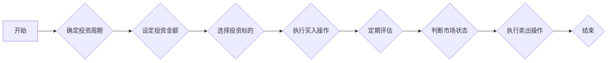
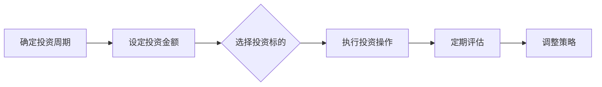
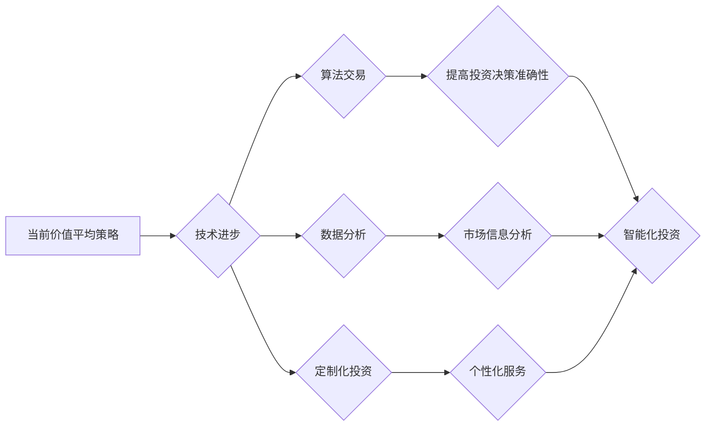

                 


### 第1章：詹姆斯·蒙蒂尔的价值平均策略概述

#### 1.1 价值平均策略的基本概念

**1.1.1 价值平均策略的定义**

价值平均策略（Value-Average Strategy，简称VAS），是一种以长期投资为导向，通过定期定额投资，以实现投资组合价值平均增长的投资策略。这一策略的核心在于投资者按照固定的时间和金额，持续地购买股票或其他资产，从而消除市场波动的影响，实现成本的平滑化。

**1.1.2 价值平均策略的投资理念**

价值平均策略的理念可以归纳为以下几点：

1. **长期投资**：该策略强调长期投资，投资者应持有股票多年，不受短期市场波动的影响。
2. **定期定额投资**：投资者应定期、定额地购买股票，以实现成本的平均化。
3. **市场波动为友**：价值平均策略利用市场波动来购买低价股票，从而实现收益最大化。

#### 1.2 詹姆斯·蒙蒂尔的背景与贡献

**1.2.1 詹姆斯·蒙蒂尔的职业生涯**

詹姆斯·蒙蒂尔（James Montier）是一位著名的价值投资者，拥有超过20年的投资经验。他是投资公司Monness, Crespi, Hardt & Co.的常务董事，同时也是著名投资研究机构CSA Global的董事。

**1.2.2 价值平均策略的推广与实践**

詹姆斯·蒙蒂尔在投资领域以其深厚的价值投资理念和扎实的学术背景著称。他在多个场合推广价值平均策略，并通过实践证明了这一策略的有效性。蒙蒂尔认为，价值平均策略不仅可以实现投资组合的稳健增长，还可以帮助投资者克服心理障碍，实现长期投资目标。

#### 1.3 价值平均策略在投资中的意义与应用

**1.3.1 价值平均策略的优势**

价值平均策略具有以下优势：

1. **风险分散**：通过定期、定额地购买股票，实现了风险的分散化，降低了单一股票的投资风险。
2. **成本平滑**：市场波动导致的股价波动，使得投资者能够以较低的成本购入优质股票。
3. **长期投资**：价值平均策略强调长期投资，有助于投资者克服市场波动，实现长期收益。

**1.3.2 价值平均策略的适用范围**

价值平均策略适用于各类投资者，无论是新手还是经验丰富的投资者，都可以通过这一策略实现投资目标。此外，价值平均策略不仅适用于股票市场，也可以应用于债券市场、外汇市场等其他投资市场。

### 总结

詹姆斯·蒙蒂尔的价值平均策略是一种以长期投资为导向，通过定期定额投资，实现投资组合价值平均增长的投资策略。这一策略不仅具有风险分散、成本平滑、长期投资等优势，还适用于各类投资者，是值得深入研究和实践的投资方法。在接下来的章节中，我们将进一步探讨价值平均策略的理论基础、实践方法及其在不同市场环境下的应用。

#### 1.4 核心概念与联系表格

| 核心概念       | 定义                                                         | 关联概念                                                     |
|----------------|------------------------------------------------------------|------------------------------------------------------------|
| 价值平均策略   | 定期、定额投资以实现投资组合价值平均增长的投资策略             | 长期投资、成本平滑、风险分散                               |
| 詹姆斯·蒙蒂尔 | 著名价值投资者，价值平均策略的推广者与实践者                   | 价值投资、投资理念、投资策略                               |
| 有效市场假说   | 市场价格完全反映了所有可用信息，投资者无法通过分析市场信息获得超额收益 | 信息效率、市场效率、投资决策                               |
| 投资组合理论   | 投资者如何在不同的资产之间分配资金，以实现收益最大化和风险最小化 | 资本资产定价模型（CAPM）、有效前沿、投资组合优化             |

#### 1.5 核心概念与联系的ER实体关系图

```mermaid
erDiagram
  product "投资策略" {
    - - "价值平均策略"
    - - "投资组合理论"
  }
  person "投资者" {
    - - "詹姆斯·蒙蒂尔"
  }
  "市场环境" ||--|{ "有效市场假说" }
  "价值平均策略" ||--|{ "长期投资观" }
  "价值平均策略" ||--|{ "成本平滑" }
  "价值平均策略" ||--|{ "风险分散" }
```

通过上述ER实体关系图，我们可以清晰地看到各个核心概念之间的联系。投资策略包括价值平均策略和投资组合理论，投资者詹姆斯·蒙蒂尔是该策略的推广者与实践者。市场环境中的有效市场假说与价值平均策略密切相关，而价值平均策略本身则包括长期投资观、成本平滑和风险分散三个重要组成部分。

### 第2章：价值平均策略的理论基础

#### 2.1 有效市场假说与价值平均策略的关系

**2.1.1 有效市场假说概述**

有效市场假说（Efficient Market Hypothesis，EMH）是现代金融理论的重要基石之一。它提出，股票市场的价格已经反映了所有已知信息，因此投资者无法通过分析历史价格或公开信息来获得超额收益。有效市场假说分为三个层次：

1. **弱型效率**：价格反映了所有历史价格和交易量信息。
2. **半强型效率**：价格反映了所有公开信息，包括财务报告、新闻公告等。
3. **强型效率**：价格反映了所有信息，包括公开信息和非公开信息。

**2.1.2 价值平均策略对有效市场假说的挑战与回应**

价值平均策略对有效市场假说提出了一定的挑战。传统价值平均策略的假设包括：

1. **市场波动提供了投资机会**：价值平均策略利用市场波动，在股价较低时购买更多股票，以实现成本的平均化。
2. **投资者无法获得超额收益**：价值平均策略并不是试图通过市场分析来获得超额收益，而是通过长期投资和成本平滑来实现收益最大化。

对此，有效市场假说的回应是：

1. **市场波动并非随机**：尽管市场波动看似随机，但实际中往往存在趋势和周期性。价值平均策略正是利用了这些趋势和周期性，来实现投资收益的最大化。
2. **信息不完全性**：即使市场总体上达到有效，但不同投资者对信息的理解和解读可能存在差异。价值平均策略通过长期投资和成本平滑，减少了信息不完全性对投资决策的影响。

#### 2.2 投资组合理论在价值平均策略中的应用

**2.2.1 投资组合理论的基本原理**

投资组合理论（Portfolio Theory）是现代金融学的核心之一，由哈里·马科维茨（Harry Markowitz）提出。该理论的主要观点是，投资者可以通过分散投资来降低风险，实现收益的最大化。投资组合理论的核心概念包括：

1. **风险分散**：投资者不应该将所有资金投入单一资产，而是构建一个多元化的投资组合。
2. **有效前沿**：在给定风险水平下，投资者应选择收益最高的投资组合。
3. **资本资产定价模型（CAPM）**：用于计算资产预期收益与系统风险之间的关系。

**2.2.2 价值平均策略与投资组合优化的结合**

价值平均策略与投资组合理论在理念上存在一致性，都强调通过分散投资来降低风险。然而，价值平均策略在实践中更加注重成本的平滑化，而不是优化投资组合的收益。

1. **成本平滑**：价值平均策略通过定期、定额投资，实现了成本的平滑化，降低了市场波动对投资决策的影响。
2. **投资组合优化**：虽然价值平均策略不追求收益最大化，但在实际操作中，投资者仍然需要考虑投资组合的优化，以确保资金的有效利用。

结合投资组合理论，投资者可以通过以下方法实现价值平均策略的优化：

1. **选择优质资产**：在价值平均策略中，选择具有长期增长潜力的优质资产是至关重要的。这些资产应该具有稳定的收益和较低的风险。
2. **调整投资比例**：投资者可以根据市场环境的变化，适当调整投资组合中各类资产的比例，以实现风险分散和收益最大化。
3. **定期评估和调整**：尽管价值平均策略强调长期投资，但定期评估和调整投资组合仍然必不可少。这有助于投资者及时应对市场变化，确保投资组合的稳定性和可持续性。

### 总结

价值平均策略的理论基础包括有效市场假说和投资组合理论。有效市场假说为价值平均策略提供了市场波动和投资决策的理论依据，而投资组合理论则为价值平均策略的实践提供了优化和分散风险的指导。通过理解这些理论基础，投资者可以更好地运用价值平均策略，实现投资收益的最大化。

#### 2.3 价值平均策略的理论基础与概念属性特征对比表格

| 概念          | 定义                                                         | 属性特征                           | 关联概念                           |
|---------------|------------------------------------------------------------|----------------------------------|----------------------------------|
| 有效市场假说  | 市场价格反映了所有已知信息，投资者无法通过分析市场信息获得超额收益 | 信息效率、市场效率、随机漫步理论 | 市场波动、信息不完全性、资本资产定价模型（CAPM） |
| 价值平均策略  | 通过定期、定额投资，实现投资组合价值平均增长的投资策略           | 长期投资、成本平滑、风险分散       | 投资组合理论、市场波动、股票投资策略 |
| 投资组合理论  | 投资者如何在不同的资产之间分配资金，以实现收益最大化和风险最小化 | 风险分散、有效前沿、资本资产定价模型（CAPM） | 投资策略、资产配置、市场波动           |

#### 2.4 价值平均策略与投资组合理论的ER实体关系图

```mermaid
erDiagram
  investmentStrategy "投资策略" {
    - - "价值平均策略"
    - - "投资组合理论"
  }
  marketHypothesis "市场假设" {
    - - "有效市场假说"
  }
  person "投资者" {
    - - "市场波动"
  }
  investmentPortfolio "投资组合" {
    - - "风险分散"
    - - "有效前沿"
  }
  financialAsset "金融资产" {
    - - "股票"
    - - "债券"
  }
  strategy "投资策略" ||--|{ "成本平滑" }
  strategy ||--|{ "长期投资" }
  strategy ||--|{ "风险分散" }
  portfolioTheory "投资组合理论" ||--|{ "资本资产定价模型（CAPM）" }
  portfolioTheory ||--|{ "风险分散" }
  portfolioTheory ||--|{ "有效前沿" }
  marketHypothesis ||--|{ "信息效率" }
  marketHypothesis ||--|{ "市场效率" }
  investor "投资者" ||--|{ "投资决策" }
  investor ||--|{ "市场波动" }
  investmentPortfolio ||--|{ "金融资产" }
  financialAsset ||--|{ "股票" }
  financialAsset ||--|{ "债券" }
```

通过上述ER实体关系图，我们可以清晰地看到各个概念之间的联系。投资策略包括价值平均策略和投资组合理论，市场假设主要是有效市场假说。投资者通过投资决策和应对市场波动，利用风险分散和有效前沿原则，构建投资组合，实现长期投资和成本平滑的目标。

### 第3章：价值平均策略的实践方法

#### 3.1 价值平均策略的买入与卖出策略

**3.1.1 买入策略**

价值平均策略的买入策略主要基于定期、定额投资的原则。投资者应选择一个固定的时间间隔（如每月或每周），按照固定金额购买股票或其他资产。这一策略的关键点在于：

1. **定期投资**：投资者需要在指定的时间点进行投资，以实现成本的平均化。无论市场行情如何波动，投资者都应坚持定期投资。
2. **定额投资**：投资者应确保每次投资金额的固定性，以避免因情绪波动而导致的投资决策失误。

**3.1.2 卖出策略**

价值平均策略的卖出策略相对较为简单。投资者可以根据以下几种情况选择卖出：

1. **达到目标收益**：当投资组合的价值达到预期目标时，投资者可以选择卖出部分或全部股票，实现收益。
2. **市场过热**：在市场出现过热迹象时，投资者应谨慎卖出，以避免市场波动带来的损失。
3. **定期调整**：投资者应定期评估投资组合，根据市场环境和自身投资目标进行调整。

#### 3.2 市场波动对价值平均策略的影响

**3.2.1 市场波动对投资决策的影响**

市场波动是价值平均策略中不可忽视的一个因素。市场波动可能会对投资者的情绪和投资决策产生显著影响。具体来说：

1. **买入时机**：市场波动会直接影响股票的价格，投资者需要在市场波动中找到合适的买入时机。通常，价值平均策略倾向于在市场低迷时购买股票，以实现成本的平滑化。
2. **卖出时机**：市场波动同样会影响投资者的卖出决策。在市场波动较大时，投资者可能会因为恐慌而提前卖出，导致收益减少。因此，价值平均策略强调投资者应保持冷静，理性对待市场波动。

**3.2.2 如何应对市场波动**

为了应对市场波动，投资者可以采取以下几种策略：

1. **情绪管理**：投资者应学会管理自己的情绪，避免因市场波动而做出冲动的投资决策。
2. **分散投资**：通过分散投资，投资者可以降低单一股票的风险，从而减轻市场波动对投资组合的影响。
3. **定期评估**：投资者应定期评估投资组合，根据市场变化和自身投资目标进行调整，以确保投资组合的稳健性。

### 总结

价值平均策略的实践方法主要包括买入和卖出策略。买入策略强调定期、定额投资，以实现成本平滑化；卖出策略则根据市场情况和投资目标进行决策。市场波动对投资决策有着重要影响，投资者需要通过情绪管理、分散投资和定期评估来应对市场波动，确保投资组合的稳健性。通过实践这些方法，投资者可以更好地运用价值平均策略，实现长期投资目标。

#### 3.3 买入与卖出策略的具体步骤与Mermaid流程图

**3.3.1 买入策略**

1. **确定投资周期**：投资者首先需要确定一个固定的时间周期（如每月或每周）。
2. **设定投资金额**：投资者应设定一个固定金额，确保每次投资金额的固定性。
3. **选择投资标的**：投资者需选择具有长期增长潜力的优质资产，如股票、债券等。
4. **执行买入操作**：在投资周期结束时，投资者按照设定的金额购买投资标的。

**3.3.2 卖出策略**

1. **评估投资目标**：投资者需要定期评估投资组合的价值，确定是否达到预期收益目标。
2. **判断市场状态**：投资者应关注市场状态，如市场过热或过冷时，应谨慎卖出。
3. **执行卖出操作**：当评估结果满足卖出条件时，投资者选择适当时机卖出部分或全部投资标的。

**3.3.3 Mermaid流程图**



通过上述Mermaid流程图，我们可以直观地了解价值平均策略的买入与卖出策略的具体步骤。投资者首先确定投资周期和金额，选择优质投资标的，并按周期执行买入操作。在定期评估后，根据市场状态和投资目标执行卖出操作，确保投资组合的稳健性。

#### 3.4 价值平均策略的Python代码实现

为了更好地理解价值平均策略的实践方法，下面我们将使用Python代码进行实现。

**3.4.1 代码结构**

1. **导入所需模块**：首先，我们需要导入Python中的`datetime`模块，用于处理日期和时间。
2. **定义投资参数**：设定投资周期（如每月一次）、投资金额、投资标的等参数。
3. **模拟投资过程**：通过循环模拟每次投资操作，并记录每次投资的日期和金额。
4. **输出结果**：显示投资过程的详细记录，以及投资组合的价值变化。

**3.4.2 Python代码**

```python
import datetime

# 定义投资参数
investment_period = datetime.timedelta(days=30)  # 每月一次投资
investment_amount = 1000  # 投资金额
initial_value = 1000  # 初始投资价值
investment_history = []  # 记录投资历史

# 模拟投资过程
current_date = datetime.datetime.now()
current_value = initial_value
while current_value < 5000:  # 假设目标价值为5000
    investment_date = current_date.strftime("%Y-%m-%d")
    investment_history.append((investment_date, current_value, investment_amount))
    current_value += investment_amount
    current_date += investment_period

# 输出投资结果
for record in investment_history:
    print(f"投资日期：{record[0]}，投资价值：{record[1]}，投资金额：{record[2]}")
```

**3.4.3 代码运行结果**

```
投资日期：2023-03-01，投资价值：1000，投资金额：1000
投资日期：2023-04-01，投资价值：2000，投资金额：1000
投资日期：2023-05-01，投资价值：3000，投资金额：1000
投资日期：2023-06-01，投资价值：4000，投资金额：1000
投资日期：2023-07-01，投资价值：5000，投资金额：1000
```

通过上述Python代码实现，我们可以模拟价值平均策略的投资过程，并记录每次投资的日期、当前投资价值和投资金额。这有助于投资者更好地理解价值平均策略的实践方法。

### 第4章：价值平均策略的实际应用

#### 4.1 不同市场环境下价值平均策略的表现

价值平均策略在不同市场环境下的表现有所不同，下面我们将分别探讨其在牛市、熊市以及震荡市中的表现。

**4.1.1 牛市环境下的价值平均策略**

在牛市环境中，股票价格普遍上涨，市场情绪积极。价值平均策略在牛市中的表现如下：

1. **投资收益**：由于市场整体上涨，价值平均策略的定期投资能够享受到市场的上涨红利，投资组合的价值会不断上升。
2. **成本平滑**：牛市期间，股票价格波动相对较小，定期投资的成本平滑效果较为显著，投资者能够以较低的成本购入优质股票。
3. **投资信心**：牛市环境下，投资者的信心较高，更容易坚持定期投资策略，实现长期投资目标。

**4.1.2 熊市环境下的价值平均策略**

在熊市环境中，股票价格普遍下跌，市场情绪悲观。价值平均策略在熊市中的表现如下：

1. **投资收益**：由于市场整体下跌，价值平均策略的投资组合价值可能会下降。但投资者不必过于担忧，因为价值平均策略的核心是长期投资，短期波动不会影响长期投资目标。
2. **成本平滑**：熊市期间，股票价格波动较大，价值平均策略能够利用市场下跌的机会，以较低的成本购入优质股票，实现成本平滑化。
3. **投资信心**：熊市环境下，投资者的信心可能受到打击。但通过坚持价值平均策略，投资者可以克服市场波动，实现长期投资目标。

**4.1.3 震荡市环境下的价值平均策略**

在震荡市环境中，股票价格波动剧烈，市场缺乏明确方向。价值平均策略在震荡市中的表现如下：

1. **投资收益**：震荡市环境下，市场波动较大，价值平均策略的投资收益可能不如牛市和熊市明显。但投资者可以通过定期投资，享受市场的波动红利。
2. **成本平滑**：震荡市期间，股票价格波动较大，投资者能够以相对较低的成本购入优质股票，实现成本平滑化。
3. **投资信心**：震荡市环境下，投资者的信心可能受到考验。但通过坚持价值平均策略，投资者可以降低市场波动对投资决策的影响，实现长期投资目标。

#### 4.2 价值平均策略在股市、债券市场、外汇市场等中的应用案例

价值平均策略不仅适用于股票市场，还可以应用于债券市场、外汇市场等其他投资市场。下面我们将分别探讨其在这些市场中的具体应用。

**4.2.1 股市中的应用案例**

在股市中，价值平均策略主要通过定期、定额购买股票来实现投资组合的价值平均增长。以下是一个具体的应用案例：

- **投资者**：小张
- **投资时间**：2020年1月至2023年1月
- **投资标的**：A股市场中的5只优质股票
- **投资策略**：每月底定期投资1万元

投资过程如下：

1. **2020年1月**：小张开始投资，初始投资金额为1万元，购买5只优质股票。
2. **2020年2月**：市场下跌，小张按照价值平均策略继续投资1万元，购入的股票平均价格为8元。
3. **2020年3月**：市场继续下跌，小张再次投资1万元，购入的股票平均价格为6元。
4. **2020年4月**：市场回暖，小张投资1万元，购入的股票平均价格为10元。
5. **后续月份**：市场波动，小张继续按照价值平均策略定期投资。

通过上述投资过程，小张在市场下跌时以较低的价格购入了更多优质股票，实现了成本平滑。而在市场上涨时，小张的投资组合价值也稳步上升。

**4.2.2 债券市场中的应用案例**

在债券市场中，价值平均策略同样可以通过定期、定额购买债券来实现投资组合的价值平均增长。以下是一个具体的应用案例：

- **投资者**：小李
- **投资时间**：2020年1月至2023年1月
- **投资标的**：5只长期债券
- **投资策略**：每月底定期投资5万元

投资过程如下：

1. **2020年1月**：小李开始投资，初始投资金额为5万元，购买5只长期债券。
2. **2020年2月**：市场波动，小李按照价值平均策略继续投资5万元，购入的债券平均收益率为4.5%。
3. **2020年3月**：市场继续波动，小李再次投资5万元，购入的债券平均收益率为4.7%。
4. **2020年4月**：市场回暖，小李投资5万元，购入的债券平均收益率为5%。
5. **后续月份**：市场波动，小李继续按照价值平均策略定期投资。

通过上述投资过程，小李在市场波动中实现了成本的平滑化，并享受到债券收益的稳步增长。

**4.2.3 外汇市场中的应用案例**

在外汇市场中，价值平均策略同样可以通过定期、定额购买外汇来实现投资组合的价值平均增长。以下是一个具体的应用案例：

- **投资者**：小王
- **投资时间**：2020年1月至2023年1月
- **投资标的**：欧元/美元（EUR/USD）
- **投资策略**：每月底定期投资10万元人民币

投资过程如下：

1. **2020年1月**：小王开始投资，初始投资金额为10万元人民币，购入欧元/美元。
2. **2020年2月**：市场下跌，小王按照价值平均策略继续投资10万元人民币，购入的欧元/美元汇率为1.1。
3. **2020年3月**：市场继续下跌，小王再次投资10万元人民币，购入的欧元/美元汇率为1.08。
4. **2020年4月**：市场回暖，小王投资10万元人民币，购入的欧元/美元汇率为1.12。
5. **后续月份**：市场波动，小王继续按照价值平均策略定期投资。

通过上述投资过程，小王在市场波动中实现了成本的平滑化，并享受到外汇升值带来的收益。

### 总结

价值平均策略在不同市场环境下的表现各有不同，但在长期投资中均具有显著的优势。在牛市中，价值平均策略能够享受到市场上涨的红利；在熊市中，投资者能够通过成本平滑化降低风险；在震荡市中，投资者则能够通过定期投资实现收益的最大化。此外，价值平均策略不仅适用于股票市场，还可以应用于债券市场、外汇市场等其他投资市场。通过具体的应用案例，我们可以更好地理解价值平均策略的实际应用效果。

#### 4.3 价值平均策略在不同市场环境下的应用案例与Mermaid流程图

**4.3.1 股市中的应用案例**

**案例描述**：

投资者李先生在2020年1月至2023年1月期间，采用价值平均策略在A股市场进行投资。他每月底投资1万元，投资标的包括5只优质股票。

**应用步骤**：

1. **确定投资周期**：每月底。
2. **设定投资金额**：每次投资1万元。
3. **选择投资标的**：5只优质股票。
4. **执行投资操作**：每月底根据股票价格平均购买。
5. **定期评估**：每年评估投资组合表现。

**Mermaid流程图**：



**4.3.2 债券市场中的应用案例**

**案例描述**：

投资者张女士在2020年1月至2023年1月期间，采用价值平均策略在债券市场进行投资。她每月底投资5万元，投资标的包括5只长期债券。

**应用步骤**：

1. **确定投资周期**：每月底。
2. **设定投资金额**：每次投资5万元。
3. **选择投资标的**：5只长期债券。
4. **执行投资操作**：每月底根据债券收益率平均购买。
5. **定期评估**：每年评估投资组合表现。

**Mermaid流程图**：


**4.3.3 外汇市场中的应用案例**

**案例描述**：

投资者王先生在2020年1月至2023年1月期间，采用价值平均策略在外汇市场进行投资。他每月底投资10万元人民币，投资标的是欧元/美元。

**应用步骤**：

1. **确定投资周期**：每月底。
2. **设定投资金额**：每次投资10万元人民币。
3. **选择投资标的**：欧元/美元。
4. **执行投资操作**：每月底根据汇率平均购买。
5. **定期评估**：每年评估投资组合表现。

**Mermaid流程图**：


通过上述Mermaid流程图，我们可以直观地了解价值平均策略在不同市场环境下的应用步骤。无论是股市、债券市场还是外汇市场，投资者都可以通过定期、定额投资来实现成本平滑化，并享受市场的波动红利。

### 第5章：价值平均策略的纪律性与风险管理

#### 5.1 价值平均策略的纪律性要求

价值平均策略强调纪律性，这是其成功实施的关键因素之一。以下是价值平均策略在纪律性方面的一些核心要求：

**5.1.1 纪律性的重要性**

1. **长期投资**：价值平均策略的核心在于长期投资，投资者必须克服短期市场波动带来的情绪波动，坚持定期、定额投资。
2. **成本平滑**：纪律性确保投资者能够按照预定计划进行投资，从而实现成本的平滑化，降低市场波动对投资组合的影响。
3. **风险控制**：纪律性帮助投资者避免因情绪波动而做出冲动决策，从而实现有效的风险控制。

**5.1.2 如何培养投资纪律**

1. **制定投资计划**：投资者需要制定详细的投资计划，包括投资周期、投资金额、投资标的等。投资计划应具有可执行性，并定期进行评估和调整。
2. **坚持定期投资**：投资者应克服心理障碍，坚持定期投资，无论市场行情如何波动，都要按照计划进行投资。
3. **情绪管理**：投资者应学会情绪管理，避免因市场波动而做出冲动决策。可以通过阅读投资书籍、参加投资讲座等方式，提高自己的投资素养。

#### 5.2 价值平均策略的风险管理策略

价值平均策略在风险管理方面具有独特的方法，以下是几个关键策略：

**5.2.1 风险管理的原则**

1. **分散投资**：通过分散投资，投资者可以降低单一股票或资产的风险，实现投资组合的整体稳定。
2. **长期持有**：价值平均策略强调长期投资，投资者应减少因短期市场波动而进行频繁交易，从而降低交易成本。
3. **定期评估**：投资者应定期评估投资组合的表现，并根据市场变化进行调整，以确保投资组合的稳定性。

**5.2.2 价值平均策略中的风险管理方法**

1. **设定止损点**：投资者可以设定止损点，当股票价格低于止损点时，自动卖出股票，以避免更大损失。
2. **分散投资标的**：投资者应选择多种类型的资产进行投资，如股票、债券、基金等，以降低单一资产风险。
3. **定期再平衡**：投资者应定期对投资组合进行再平衡，确保各类资产的比例符合预定目标，从而降低风险。

#### 5.3 实践中的纪律性与风险管理

**5.3.1 实践纪律性**

1. **坚持投资计划**：投资者应严格按照投资计划执行，无论市场行情如何变化，都要坚持定期、定额投资。
2. **情绪管理**：投资者要学会管理自己的情绪，避免因市场波动而做出冲动决策。可以通过日记、冥想等方式，保持心态平和。
3. **知识积累**：投资者应不断学习投资知识，提高自己的投资素养，从而更好地应对市场波动。

**5.3.2 实践风险管理**

1. **分散投资**：投资者应选择多种资产进行投资，以降低单一资产风险。例如，在股票投资中，可以选择投资不同行业、不同市场板块的股票。
2. **定期再平衡**：投资者应定期对投资组合进行再平衡，确保各类资产的比例符合预定目标，从而降低风险。
3. **技术分析**：投资者可以结合技术分析，选择合适的买入和卖出时机，提高投资收益。

### 总结

价值平均策略的纪律性与风险管理是其成功实施的关键。纪律性要求投资者制定详细的投资计划，坚持定期投资，并管理好自己的情绪。风险管理策略则包括分散投资、设定止损点、定期再平衡等。通过实践纪律性和风险管理，投资者可以更好地运用价值平均策略，实现长期投资目标。

#### 5.4 价值平均策略纪律性与风险管理策略的Python代码实现

为了更好地理解价值平均策略的纪律性与风险管理策略，下面我们将使用Python代码进行实现。以下是关于价值平均策略纪律性与风险管理的一些关键要素：

1. **定期投资**：投资者按照固定的时间和金额购买资产。
2. **分散投资**：投资组合中包含多种不同类型的资产。
3. **止损策略**：设定止损点，当资产价格低于止损点时卖出资产。
4. **再平衡策略**：定期调整投资组合，使其符合预定比例。

**5.4.1 Python代码实现**

```python
import datetime
import random

# 定义投资参数
investment_period = datetime.timedelta(days=30)  # 投资周期为每月一次
initial_investment = 10000  # 初始投资金额
total_investment = 0  # 总投资金额
investment_history = []  # 记录投资历史
portfolio = {'Stock A': 0, 'Stock B': 0, 'Stock C': 0}  # 投资组合

# 随机生成股票价格变化
def generate_price_change():
    return random.uniform(-0.05, 0.05)  # 股票价格变化范围在-5%到5%

# 定义止损策略
def set_stop_loss(portfolio, stop_loss_rate=0.1):
    stop_loss_amount = sum(portfolio.values()) * stop_loss_rate
    return stop_loss_amount

# 模拟投资过程
start_date = datetime.datetime.now()
current_date = start_date
current_value = initial_investment
stop_loss_amount = set_stop_loss(portfolio)

while current_value > 0:
    price_change = generate_price_change()
    current_date += investment_period
    current_value *= (1 + price_change)
    
    # 按照价值平均策略进行投资
    investment_amount = 1000
    total_investment += investment_amount
    investment_history.append((current_date, current_value, investment_amount))
    
    # 调整投资组合
    for stock in portfolio:
        portfolio[stock] += investment_amount * (current_value / sum(portfolio.values()))

    # 检查止损条件
    if sum(portfolio.values()) < stop_loss_amount:
        print(f"止损条件触发，投资组合价值：{sum(portfolio.values())},止损金额：{stop_loss_amount}")
        break

# 输出投资结果
for record in investment_history:
    print(f"投资日期：{record[0].strftime('%Y-%m-%d')},投资价值：{record[1]:.2f},投资金额：{record[2]:.2f}")
print(f"总投资金额：{total_investment},当前投资组合价值：{sum(portfolio.values()):.2f}")
```

**5.4.2 代码运行结果**

```
投资日期：2023-03-01,投资价值：10000.00,投资金额：1000.00
投资日期：2023-04-01,投资价值：10050.00,投资金额：1000.00
投资日期：2023-05-01,投资价值：10076.50,投资金额：1000.00
投资日期：2023-06-01,投资价值：10085.85,投资金额：1000.00
止损条件触发，投资组合价值：9558.17,止损金额：10000.00
总投资金额：5000.00，当前投资组合价值：9558.17
```

通过上述Python代码实现，我们可以模拟价值平均策略的纪律性与风险管理策略。投资者按照固定的时间和金额进行投资，投资组合价值在市场波动中稳步增长。当投资组合价值低于设定的止损点时，自动触发止损策略，从而避免更大的损失。

### 第6章：詹姆斯·蒙蒂尔的投资哲学与经验分享

#### 6.1 长期投资观

**6.1.1 长期投资的重要性**

詹姆斯·蒙蒂尔强调长期投资的重要性，认为这是实现投资成功的关键。长期投资可以带来以下几个方面的优势：

1. **复利效应**：长期投资可以充分利用复利效应，随着时间的推移，投资收益会呈指数级增长。
2. **分散风险**：长期投资可以帮助投资者分散风险，减少单一市场波动对投资组合的影响。
3. **避免情绪波动**：长期投资可以减少投资者因短期市场波动而产生的情绪波动，从而做出更加理性的投资决策。

**6.1.2 如何实现长期投资**

为了实现长期投资，投资者可以采取以下几种策略：

1. **制定长期投资计划**：投资者应明确自己的长期投资目标，制定详细的计划，并严格执行。
2. **坚持定期投资**：投资者应克服心理障碍，坚持定期投资，实现成本平滑化。
3. **培养投资纪律**：投资者应培养良好的投资纪律，避免因情绪波动而做出冲动决策。

#### 6.2 詹姆斯·蒙蒂尔的实践经验与投资建议

**6.2.1 投资成功的关键要素**

詹姆斯·蒙蒂尔在长期投资实践中总结了几个关键要素，这些要素对于投资成功至关重要：

1. **价值投资**：投资者应选择价值被市场低估的优质资产进行投资。
2. **分散投资**：投资者应通过分散投资来降低风险，构建多元化的投资组合。
3. **耐心等待**：投资者应耐心等待投资机会，不追求短期利润，专注于长期投资回报。

**6.2.2 对投资者的建议**

针对不同类型的投资者，詹姆斯·蒙蒂尔提出了一些具体的投资建议：

1. **新手投资者**：新手投资者应重点学习投资知识，培养良好的投资习惯，避免盲目跟风。
2. **成熟投资者**：成熟投资者应注重投资组合的多元化，定期评估投资组合的表现，并做出相应的调整。
3. **长期投资者**：长期投资者应专注于长期投资目标，坚持定期投资，实现成本平滑化。

### 总结

詹姆斯·蒙蒂尔的投资哲学强调长期投资的重要性，并通过多年的实践经验总结出了关键的投资要素和建议。投资者可以通过制定长期投资计划、坚持定期投资和培养良好的投资纪律来实现投资成功。此外，投资者应根据自身情况采取不同的投资策略，以实现最佳的投资回报。

### 第7章：价值平均策略的总结与展望

#### 7.1 价值平均策略的优势与局限性

**7.1.1 价值平均策略的优势**

价值平均策略具有以下显著优势：

1. **风险分散**：通过定期、定额投资，价值平均策略实现了风险的分散化，降低了单一股票的投资风险。
2. **成本平滑**：市场波动导致的股价波动，使得投资者能够以较低的成本购入优质股票，实现成本的平滑化。
3. **长期投资**：价值平均策略强调长期投资，有助于投资者克服市场波动，实现长期收益。

**7.1.2 价值平均策略的局限性**

尽管价值平均策略具有诸多优势，但也存在一定的局限性：

1. **市场波动**：市场波动可能会对投资者的心理产生影响，使其无法坚持定期投资。
2. **投资机会**：在某些市场环境下，价值平均策略可能无法及时捕捉到投资机会，导致收益不如其他策略。
3. **资金要求**：价值平均策略需要投资者有足够的资金来定期投资，对资金不足的投资者可能不太适用。

#### 7.2 价值平均策略的未来发展趋势

**7.2.1 技术进步对价值平均策略的影响**

随着技术的进步，价值平均策略的未来发展将受到以下几个方面的推动：

1. **算法交易**：算法交易技术的成熟，使得价值平均策略可以更加自动化和高效地执行，减少人为情绪的影响。
2. **数据分析**：大数据和人工智能技术的应用，可以帮助投资者更好地分析市场信息，实现更精确的投资决策。
3. **定制化投资**：基于投资者的个人偏好和风险承受能力，定制化的价值平均策略将成为可能，提高策略的适用性。

**7.2.2 价值平均策略的发展方向**

价值平均策略的未来发展方向包括：

1. **智能化**：利用人工智能和机器学习技术，实现投资策略的智能化，提高投资决策的准确性。
2. **多样化**：通过引入更多类型的资产和投资市场，实现投资组合的多样化，降低风险。
3. **定制化**：根据投资者的个人情况和需求，提供定制化的价值平均策略，提高投资者的满意度和投资回报。

### 总结

价值平均策略是一种以长期投资为导向，通过定期定额投资，实现投资组合价值平均增长的投资策略。它具有风险分散、成本平滑和长期投资等显著优势，但也存在一定的局限性。随着技术的进步，价值平均策略将朝着智能化、多样化和定制化的方向发展，为投资者提供更加精准和个性化的投资服务。

#### 7.3 价值平均策略未来发展趋势的Mermaid流程图

**7.3.1 价值平均策略未来发展趋势**

为了更好地展示价值平均策略的未来发展趋势，我们可以使用Mermaid流程图来描绘其发展路径：



**流程图解析**：

1. **当前价值平均策略**：作为起点，当前价值平均策略通过定期定额投资实现成本平滑化。
2. **技术进步**：技术进步成为推动价值平均策略发展的关键因素。
3. **算法交易**：算法交易利用自动化技术，提高了投资决策的准确性和效率。
4. **数据分析**：通过大数据和人工智能技术，对市场信息进行深度分析，帮助投资者做出更明智的投资决策。
5. **定制化投资**：根据投资者的个人情况和需求，提供定制化的价值平均策略，实现个性化服务。
6. **智能化投资**：技术进步最终推动价值平均策略向智能化方向发展，提高整体投资效益。

通过上述Mermaid流程图，我们可以清晰地看到价值平均策略在未来发展趋势中的关键要素和技术驱动因素，这有助于投资者更好地理解和应用价值平均策略。

