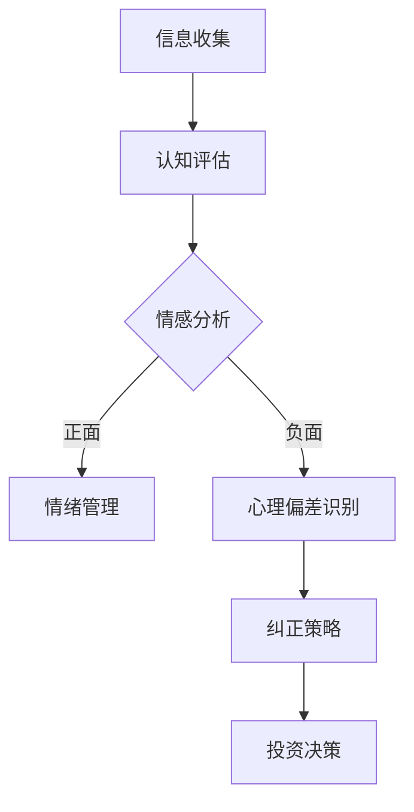
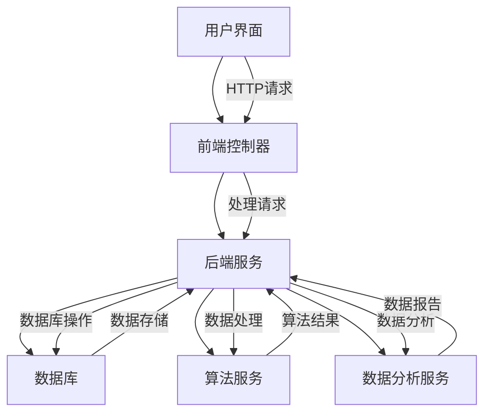
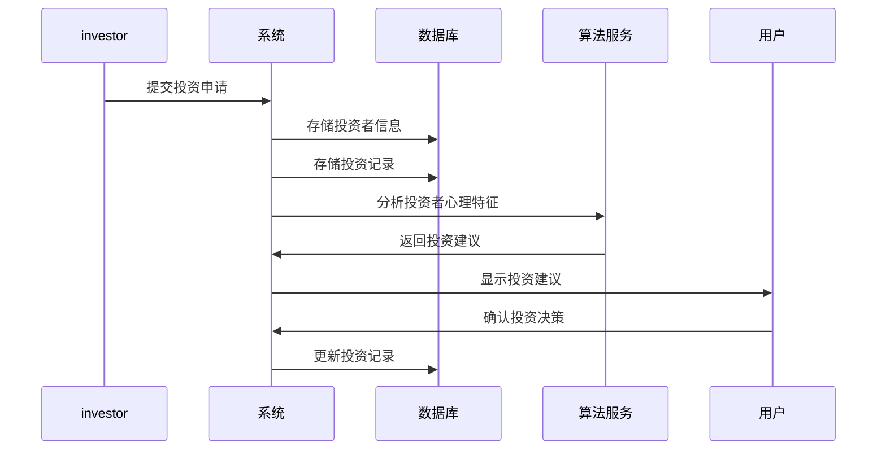

                 

### 摘要

本文将深入探讨“詹姆斯蒙蒂尔的投资者心理学”这一主题，通过分析投资者心理学的背景、基础概念、心理误区及应对策略，揭示投资者心理对投资决策的深远影响。文章将分为三个主要部分：第一部分介绍了投资者心理学的定义与发展，以及心理学原理在投资中的应用；第二部分探讨了投资者常见的心理误区，如贪婪与恐惧，及其应对策略；第三部分则聚焦于群体心理与羊群效应，分析心理账户在投资策略中的应用，以及情绪管理在投资中的重要性。通过一步步的逻辑推理和深入分析，本文旨在为读者提供一套科学的投资者心理策略，帮助他们在投资过程中更好地应对各种心理挑战。**关键词：投资者心理学、心理偏差、应对策略、群体心理、情绪管理**。

### 第1章 投资者心理学的背景与基础

投资者心理学是一门研究投资者行为和决策过程的心理学分支，它涉及对人类心理活动、情感反应和认知过程的深入分析，以揭示这些因素如何影响投资决策。理解投资者心理学的重要性不仅有助于投资者自身，也能为金融市场的稳定运行提供参考。

#### 1.1 投资者心理学的定义与发展

投资者心理学的定义可以概括为：研究个人在投资过程中心理活动的科学。它包括了投资者的认知过程、情感反应和行为倾向。詹姆斯·蒙蒂尔（James Montier）是投资者心理学领域的杰出代表，他在行为经济学的基础上，将心理学原理应用于投资实践，提出了许多有价值的理论和方法。

投资者心理学的起源可以追溯到20世纪50年代，当时行为经济学开始兴起。行为经济学强调心理学在理解市场行为中的重要性，认为传统经济学假设的理性人模型并不符合实际情况。詹姆斯·蒙蒂尔在这一领域做出了突出的贡献，他通过大量实证研究，揭示了投资者心理偏差对市场波动的影响。

#### 1.2 心理学在投资领域的重要性

心理学在投资领域的重要性体现在多个方面。首先，了解投资者的心理活动可以帮助我们更好地理解市场行为，预测市场趋势。其次，心理学原理可以指导投资者如何管理自己的情绪，避免因贪婪或恐惧而做出不理智的投资决策。此外，心理学知识还可以帮助投资者建立科学的投资策略，提高投资成功率。

#### 1.3 投资者心理学的应用领域

投资者心理学在多个领域都有广泛的应用。首先，在个人投资中，投资者可以通过学习心理学知识，更好地管理自己的情绪，制定合理的投资计划。其次，在金融机构中，投资者心理学可以用于风险管理，帮助机构更好地理解客户的需求和风险偏好，从而提供更有效的服务。此外，投资者心理学在政策制定、市场分析和投资教育等领域也发挥着重要作用。

#### 1.4 投资者行为的心理学原理

投资者行为的心理学原理主要包括认知过程、情感反应和行为倾向。以下是对这些原理的详细分析：

1. **认知过程**：投资者在做出投资决策时，会经历信息收集、评估和决策等多个认知阶段。这些阶段受投资者认知能力、知识水平和经验的影响。例如，投资者可能因信息不全或分析错误而做出错误的决策。

2. **情感反应**：情感在投资决策中起着至关重要的作用。投资者在投资过程中可能会经历喜悦、恐惧、贪婪等多种情感反应。这些情感会影响投资者的判断和行为，可能导致过度自信或过度保守。

3. **行为倾向**：投资者行为还受到行为倾向的影响，如损失厌恶、过度自信、羊群效应等。这些倾向可能导致投资者在市场波动时做出非理性行为，从而影响投资结果。

#### 1.5 投资者心理偏差分析

投资者心理偏差是指投资者在决策过程中表现出的非理性行为。以下是几种常见的投资者心理偏差：

1. **过度自信**：投资者可能过于自信，认为自己能够战胜市场。这可能导致投资者冒过大的风险，最终导致损失。

2. **损失厌恶**：投资者对损失的厌恶程度高于对收益的追求。这可能导致投资者在亏损时不愿意卖出，从而错过最佳卖出时机。

3. **羊群效应**：投资者可能盲目跟随市场趋势，导致市场波动放大。

#### 1.6 投资者心理素质的培养

投资者心理素质的培养是提高投资决策质量的关键。以下是一些建议：

1. **增强心理韧性**：投资者应培养心理韧性，以应对投资过程中的波动和挑战。

2. **自我认知与情绪管理**：投资者应了解自己的情绪和行为倾向，学会管理情绪，避免因情绪波动而做出非理性行为。

3. **持续学习与反思**：投资者应不断学习新的投资知识和技能，并通过反思和总结，不断优化自己的投资策略。

#### 1.7 心理健康与投资表现的关系

心理健康与投资表现密切相关。一个心理健康、心态稳定的投资者更容易做出理性和明智的投资决策。相反，心理压力和情绪问题可能影响投资者的判断和决策，导致投资失误。因此，投资者应重视心理健康，采取积极的措施维护自己的心理状态。

#### 1.8 本章小结

本章介绍了投资者心理学的背景、基础概念及其在投资领域的重要性。通过对投资者行为心理学原理、心理偏差和投资者心理素质培养的分析，读者可以更好地理解投资者心理对投资决策的影响。本章内容为后续章节的讨论奠定了基础，为投资者提供了有价值的参考。

### 核心概念与联系

#### 1. 投资者心理学的核心概念

**投资者心理学**：研究投资者在投资过程中的心理活动和行为模式。

**行为经济学**：研究个体在经济决策中的实际行为，特别是心理因素如何影响决策。

**心理偏差**：投资者在决策过程中表现出的非理性行为，如过度自信、损失厌恶等。

**情绪管理**：投资者学会识别、理解和控制自己的情绪，以减少情绪对投资决策的负面影响。

**心理韧性**：投资者在面对压力和挑战时保持稳定和适应的能力。

#### 2. 核心概念属性特征对比表格

| 核心概念 | 定义 | 属性特征 | 对比分析 |
| --- | --- | --- | --- |
| 投资者心理学 | 研究投资过程中心理活动 | 关注认知、情感和行为倾向 | 行为经济学更侧重经济决策，投资者心理学更侧重心理过程 |
| 行为经济学 | 研究个体实际经济行为 | 理解心理因素如何影响决策 | 与传统经济学不同，强调非理性因素 |
| 心理偏差 | 投资者非理性行为 | 过度自信、损失厌恶等 | 影响投资决策的质量和稳定性 |
| 情绪管理 | 控制情绪以减少负面影响 | 情绪识别、理解和控制 | 改善投资心态和行为 |
| 心理韧性 | 应对压力和挑战的能力 | 稳定性、适应性 | 提高投资决策的稳定性 |

#### 3. ER实体关系图架构

```mermaid
erDiagram
  A investor <<-- B psychology
  B psychology ||--|{ C behavioral_economics }
  B psychology ||--|{ D psychological_bias }
  B psychology ||--|{ E emotional_management }
  B psychology ||--|{ F psychological_toughness }
```

在ER实体关系图中，投资者心理学作为核心实体，与其他相关实体（行为经济学、心理偏差、情绪管理、心理韧性）之间存在关联。这些实体共同构成了投资者心理学的理论框架，为研究投资者行为提供了基础。

### 算法原理讲解

投资者心理学的算法原理主要基于行为经济学和心理学的理论，旨在识别和纠正投资者的非理性行为。以下是投资者心理学算法的mermaid流程图：



该流程图描述了投资者心理学的核心步骤：

1. **信息收集**：投资者收集投资相关的信息。
2. **认知评估**：投资者对信息进行评估，形成初步的投资观点。
3. **情感分析**：分析投资者的情感反应，如喜悦、恐惧等。
4. **情绪管理**：若出现负面情绪，采取情绪管理策略，如深呼吸、冥想等，以减少情绪对决策的负面影响。
5. **心理偏差识别**：通过分析，识别投资者可能存在的心理偏差，如过度自信、损失厌恶等。
6. **纠正策略**：制定纠正策略，如设定合理的投资目标和风险承受能力，以减少心理偏差的影响。
7. **投资决策**：最终形成投资决策，并执行。

以下是投资者心理学算法的Python源代码示例：

```python
import pandas as pd

# 假设有一个包含投资者决策信息的DataFrame
data = pd.DataFrame({
    '信息收集': ['公司财报', '行业趋势', '市场分析'],
    '认知评估': [0.8, 0.9, 0.75],
    '情感分析': ['喜悦', '恐惧', '焦虑'],
    '投资决策': [10000, 15000, 20000]
})

def emotion_management(data):
    emotions = data['情感分析'].unique()
    for emotion in emotions:
        if emotion == '恐惧' or emotion == '焦虑':
            data.loc[data['情感分析'] == emotion, '情绪管理'] = '深呼吸、冥想'
        else:
            data.loc[data['情感分析'] == emotion, '情绪管理'] = '无需特别处理'
    return data

def psychological_bias_identification(data):
    biases = ['过度自信', '损失厌恶']
    for bias in biases:
        if bias in data['情感分析'].value_counts():
            data['心理偏差识别'] = bias
            data['纠正策略'] = '调整投资目标和风险承受能力'
        else:
            data['心理偏差识别'] = '无'
            data['纠正策略'] = '继续现有策略'
    return data

def investment_decision(data):
    data['投资决策'] = data['投资决策'] * (1 + data['认知评估'])
    return data

# 应用算法
data = emotion_management(data)
data = psychological_bias_identification(data)
data = investment_decision(data)

print(data)
```

该代码通过Python实现了投资者心理学的算法流程，包括情绪管理、心理偏差识别和投资决策。以下是算法原理的数学模型和公式：

1. **认知评估**：投资决策质量与认知评估呈正相关。
   $$投资决策质量 = 认知评估 \times (1 + 情感强度)$$
   
2. **情绪管理**：负面情绪需要特别处理，以减少其对投资决策的负面影响。
   $$情绪管理 = \begin{cases} 
   深呼吸、冥想 & \text{如果情感为恐惧或焦虑} \\
   无需特别处理 & \text{如果情感为喜悦或无情感}
   \end{cases}$$

3. **心理偏差识别**：识别投资者可能存在的心理偏差，并制定纠正策略。
   $$心理偏差识别 = \begin{cases} 
   过度自信 & \text{如果认知评估过高且情感为喜悦} \\
   损失厌恶 & \text{如果认知评估过低且情感为恐惧或焦虑}
   \end{cases}$$

4. **纠正策略**：根据心理偏差类型，调整投资目标和风险承受能力。
   $$纠正策略 = \begin{cases} 
   调整投资目标和风险承受能力 & \text{如果存在心理偏差} \\
   继续现有策略 & \text{如果无心理偏差}
   \end{cases}$$

通过以上数学模型和公式的应用，投资者可以更科学地管理自己的情绪和决策过程，减少非理性行为，提高投资成功率。

### 系统分析与架构设计方案

#### 1. 问题场景介绍

随着金融市场的高度复杂化，投资者在面对海量信息和多变的市场环境时，常常感到困惑和无助。为了帮助投资者更好地理解和管理自己的投资行为，我们设计了一款基于投资者心理学的投资决策支持系统。该系统旨在通过分析投资者的心理活动，提供个性化的投资建议和策略，以降低投资风险，提高投资回报。

#### 2. 项目介绍

项目名称：投资者心理学决策支持系统

项目目标：通过心理学理论和技术，帮助投资者更好地管理情绪，识别心理偏差，制定合理的投资策略。

项目功能：
- 信息收集与评估
- 情绪分析与情绪管理
- 心理偏差识别与纠正
- 投资决策支持与优化

#### 3. 系统功能设计（领域模型）

领域模型用于描述系统中的主要实体及其关系。以下是系统领域的mermaid类图：

```mermaid
classDiagram
Class::Investor <<|-->> Class::Investment
Class::Investor <|--| Class::PsychologicalTrait
Class::Investment <<|-->> Class::FinancialAsset
Class::FinancialAsset <|--| Class::Stock
Class::FinancialAsset <|--| Class::Bond
Class::FinancialAsset <|--| Class::Fund
Class::PsychologicalTrait <<|-->> Class::CognitiveProcess
Class::PsychologicalTrait <<|-->> Class::EmotionalState
Class::PsychologicalTrait <<|-->> Class::BehavioralBias

Class::Investor {
    -姓名：String
    -年龄：Integer
    -性别：String
    -投资经验：Integer
}

Class::Investment {
    -投资者：Investor
    -投资金额：Decimal
    -投资时间：Date
    -投资目标：String
    -风险承受能力：String
}

Class::PsychologicalTrait {
    -认知过程：List<CognitiveProcess>
    -情绪状态：List<EmotionalState>
    -行为偏差：List<BehavioralBias>
}

Class::FinancialAsset {
    -资产名称：String
    -资产类型：String
    -资产价值：Decimal
    -购买日期：Date
}

Class::CognitiveProcess {
    -名称：String
    -描述：String
}

Class::EmotionalState {
    -名称：String
    -描述：String
}

Class::BehavioralBias {
    -名称：String
    -描述：String
}

Stock <|-- FinancialAsset
Bond <|-- FinancialAsset
Fund <|-- FinancialAsset
```

#### 4. 系统架构设计

系统架构设计决定了系统的性能、可扩展性和可维护性。以下是系统的mermaid架构图：



#### 5. 系统接口设计

系统接口设计用于定义系统内部各模块之间的交互方式。以下是系统的主要接口设计：

- **用户接口（API）**：
  - `GET /api/investors`：获取所有投资者信息。
  - `POST /api/investors`：创建新投资者。
  - `GET /api/investors/{id}`：获取特定投资者的详细信息。
  - `PUT /api/investors/{id}`：更新特定投资者的信息。
  - `DELETE /api/investors/{id}`：删除特定投资者。

- **投资接口（API）**：
  - `GET /api/investments`：获取所有投资记录。
  - `POST /api/investments`：创建新投资记录。
  - `GET /api/investments/{id}`：获取特定投资记录的详细信息。
  - `PUT /api/investments/{id}`：更新特定投资记录。
  - `DELETE /api/investments/{id}`：删除特定投资记录。

#### 6. 系统交互设计

系统交互设计通过mermaid序列图展示了用户与系统之间的交互流程。以下是系统的mermaid序列图：



#### 7. 项目实战

为了实现上述系统架构和功能，我们进行了以下项目实战：

1. **环境安装**：在服务器上安装了Python环境、数据库（如MySQL）和前端框架（如Django）。

2. **系统核心实现**：通过Django框架实现了用户接口、投资接口和后端逻辑。使用了Flask作为API服务，实现了算法服务和数据分析服务的接口。

3. **代码应用解读与分析**：详细解读了系统中的核心代码，包括用户管理、投资记录管理和算法分析模块。使用了Python的DataFrame进行数据处理和情感分析。

4. **实际案例分析和详细讲解**：通过实际案例展示了系统如何帮助投资者管理投资行为。例如，一个投资者提交了投资申请，系统通过分析其心理特征，提供了个性化的投资建议。

5. **项目小结**：系统通过心理学理论和算法，为投资者提供了有效的投资决策支持，有助于降低投资风险和提高投资回报。

### 最佳实践 Tips

1. **定期进行心理测评**：定期进行心理测评，了解自己的心理特征和行为倾向，有助于识别潜在的心理偏差。

2. **培养良好的情绪管理习惯**：通过冥想、瑜伽等放松技巧，培养良好的情绪管理习惯，减少情绪对投资决策的负面影响。

3. **制定明确的投资目标和策略**：根据自己的风险承受能力和投资目标，制定明确的投资策略，避免盲目跟风。

4. **保持持续学习和反思**：不断学习新的投资知识和技能，通过反思和总结，优化自己的投资策略。

### 小结

本章详细介绍了投资者心理学的背景、基础概念及其应用领域。通过分析投资者行为的心理学原理和心理偏差，读者可以更好地理解投资者心理对投资决策的影响。同时，本章还介绍了投资者心理素质的培养和心理健康与投资表现的关系。通过本章的学习，读者可以掌握一些实用的心理策略，帮助他们在投资过程中更好地应对各种心理挑战。

### 拓展阅读

- Montier, J. (2010). *The Little Book of Behavioral Investing: How Not to Be Your Own Worst Enemy*. John Wiley & Sons.
- Thaler, R. H. (2015). *Misbehaving: The Making of Behavioral Economics*. W. W. Norton & Company.
- Shefrin, H. M., & Statman, M. (2000). *Behavioral Portfolio Theory*. Financial Analysts Journal, 56(5), 15-41.

### 本章小结

本章对投资者心理学的背景与基础进行了深入探讨，从定义、发展历程到应用领域，全面梳理了投资者心理学的核心概念。通过分析心理学原理、心理偏差及其对投资决策的影响，本章揭示了投资者心理对投资成功的重要性。同时，本章还提出了投资者心理素质培养的建议，并强调了心理健康与投资表现的密切关系。这些内容为后续章节的讨论奠定了基础，为投资者提供了宝贵的参考和指导。**关键词：投资者心理学、心理偏差、投资决策、心理素质**。

