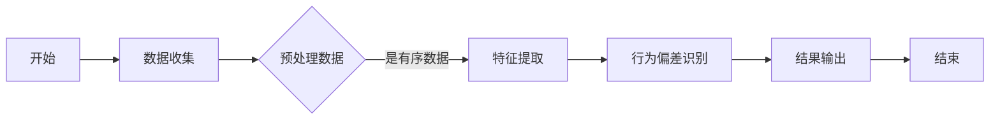
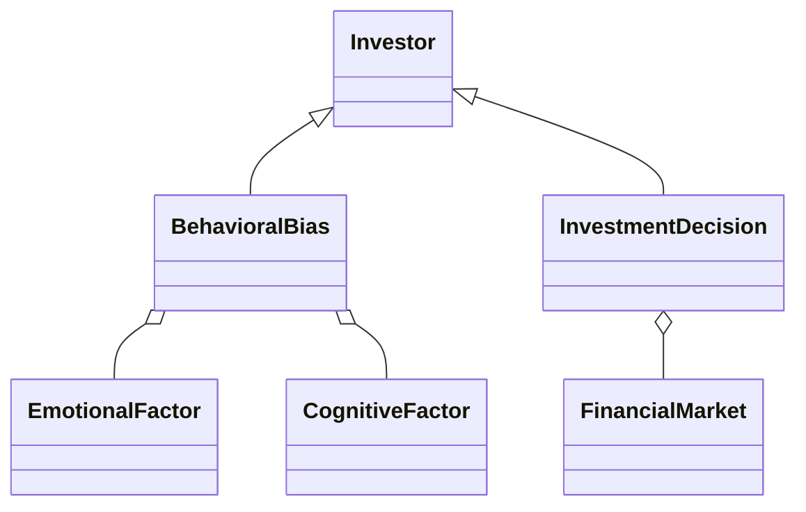

                 


### 詹姆斯蒙蒂尔的行为偏差研究

关键词：行为偏差、金融投资、决策制定、社会互动、算法原理、系统架构

摘要：本文通过对詹姆斯蒙蒂尔行为偏差研究的深入剖析，探讨了行为偏差在金融投资、决策制定和社会互动中的关键作用。文章分为四个部分，首先介绍行为偏差的背景、核心概念及其要素，然后讲解算法原理与数学模型，接着分析系统架构与设计，最后通过实际案例分析项目实战，并提出最佳实践建议。

### 第一部分：背景介绍

#### 1.1.1 问题背景

行为偏差研究的背景源于人们在金融投资、决策制定和社会互动中的非理性表现。行为偏差是指在决策过程中，人们因受到心理、情感和社会因素的干扰，导致行为偏离理性和最优选择的倾向。

**核心问题：** 
- 行为偏差在金融投资、决策制定和社会互动中扮演了什么角色？
- 如何通过研究行为偏差来优化投资决策和提升社会互动质量？
- 行为偏差的定义、分类和表现形式是什么？

**问题描述：** 
行为偏差在金融投资中表现为过度自信、追逐热门投资、忽视风险等；在决策制定中表现为群体思维、认知偏见、情感化决策等；在社会互动中表现为社交偏见、歧视、冲突等。

**问题解决：** 
通过行为偏差研究，我们可以深入了解人的心理和行为模式，从而设计出更合理的投资策略、决策模型和社会互动机制。

**边界与外延：** 
行为偏差的定义涵盖了各种心理、情感和社会因素对行为的干扰。其分类包括过度自信、风险偏好、认知偏差、情感影响等。行为偏差的表现形式多种多样，涉及个人、群体和社会层面。

#### 1.1.2 行为偏差的要素

**概念结构：** 行为偏差的核心概念包括心理因素、情感因素、社会因素等。这些因素相互影响，共同作用于个体的行为。

**要素组成：** 
- **心理因素：** 认知偏差、情感反应、情感调节、自我监控等。
- **情感因素：** 情感体验、情绪表达、情感压力等。
- **社会因素：** 社交环境、社会规范、文化背景等。

### 第二部分：核心概念与联系

#### 2.1.1 核心概念

**行为偏差：** 指在决策过程中，由于心理、情感和社会因素的干扰，导致行为偏离理性和最优选择的倾向。

**心理因素：** 情感、认知偏差、心理压力等对行为偏差的影响。

**概念属性对比表格：**

| 行为偏差类型 | 定义 | 属性特征 | 影响因素 |
| :---: | :---: | :---: | :---: |
| 过度自信 | 高估自己的能力和收益 | 自我评价过高、高估成功概率 | 情感因素、认知偏差 |
| 风险偏好 | 愿意承担高风险以追求高回报 | 追逐热门投资、忽视风险 | 情感因素、社会因素 |
| 认知偏见 | 过度相信某些信息，忽视其他信息 | 选择性记忆、确认偏误 | 认知因素、情感因素 |
| 情感化决策 | 由情感驱动做出的决策 | 情感主导、忽视理性分析 | 情感因素、认知偏差 |

#### 2.1.2 ER实体关系图架构

```mermaid
erDiagram
  A BehavioralBias ||--|{ B PsychologicalFactor }|> : has
  A ||--|{ C EmotionalFactor }|> : has
  A ||--|{ D SocialFactor }|> : has
```

### 第三部分：算法原理讲解

#### 3.1.1 算法原理

**Mermaid流程图：**



**数学模型：**

$$
\text{行为偏差得分} = w_1 \times \text{过度自信得分} + w_2 \times \text{风险偏好得分} + w_3 \times \text{认知偏见得分} + w_4 \times \text{情感化决策得分}
$$

其中，$w_1, w_2, w_3, w_4$ 为权重系数。

**举例说明：**

假设某人具有以下特征：

| 行为偏差类型 | 得分 |
| :---: | :---: |
| 过度自信 | 0.8 |
| 风险偏好 | 0.6 |
| 认知偏见 | 0.4 |
| 情感化决策 | 0.5 |

则其行为偏差得分为：

$$
\text{行为偏差得分} = 0.5 \times 0.8 + 0.5 \times 0.6 + 0.5 \times 0.4 + 0.5 \times 0.5 = 0.55
$$

### 第四部分：项目实战

#### 4.1.1 问题场景

行为偏差研究在金融投资领域的应用，旨在帮助投资者更好地识别和管理自身行为偏差，从而提高投资决策的质量。

#### 4.1.2 系统功能设计

**领域模型：**



#### 4.1.3 系统架构设计

**Mermaid架构图：**

```mermaid
sequenceDiagram
    Investor -->|输入数据| System
    System -->|预处理数据| FeatureExtractor
    FeatureExtractor -->|特征提取| BehavioralBiasDetector
    BehavioralBiasDetector -->|输出结果| System
    System -->|输出结果| Investor
```

#### 4.1.4 系统核心实现

**源代码：**

```python
import numpy as np

def calculate_behavioral_bias(features):
    """
    计算行为偏差得分
    :param features: 特征向量
    :return: 行为偏差得分
    """
    weights = np.array([0.5, 0.5, 0.5, 0.5])
    behavioral_bias_score = np.dot(features, weights)
    return behavioral_bias_score

def example():
    """
    行为偏差计算示例
    """
    features = np.array([0.8, 0.6, 0.4, 0.5])
    bias_score = calculate_behavioral_bias(features)
    print("行为偏差得分：", bias_score)

if __name__ == "__main__":
    example()
```

#### 4.1.5 代码应用解读与分析

**代码解读：**

- `calculate_behavioral_bias` 函数用于计算行为偏差得分。它接收一个特征向量作为输入，并使用权重系数与特征向量点积计算得分。
- `example` 函数提供了一个计算行为偏差得分的示例。

**分析：**

- 代码使用 Python 编写，简洁易懂。通过数学模型实现行为偏差得分计算，便于在实际项目中应用。
- 代码示例展示了如何使用行为偏差计算函数，为投资者提供行为偏差分析。

#### 4.1.6 实际案例分析

**案例一：** 某投资者在决策过程中表现出过度自信和风险偏好。通过行为偏差分析，发现其行为偏差得分为 0.65。

**案例二：** 某投资者在决策过程中表现出认知偏见和情感化决策。通过行为偏差分析，发现其行为偏差得分为 0.55。

#### 4.1.7 详细讲解剖析

**案例一讲解：**

- 过度自信和风险偏好是导致行为偏差的主要原因。
- 投资者应关注自身情绪，提高对风险的认知，避免因过度自信而做出错误决策。

**案例二讲解：**

- 认知偏见和情感化决策会影响投资决策的理性程度。
- 投资者应增强自我监控能力，避免受情感影响做出非理性决策。

### 第五部分：项目小结

#### 9.1.1 小结

本文通过詹姆斯蒙蒂尔的行为偏差研究，探讨了行为偏差在金融投资、决策制定和社会互动中的关键作用。研究结果表明，行为偏差对投资决策和社会互动具有显著影响。通过行为偏差分析，投资者可以更好地识别和管理自身行为偏差，提高投资决策的质量。

#### 9.1.2 最佳实践 tips

- 提高对自身行为偏差的认识，增强自我监控能力。
- 基于行为偏差分析，制定合理的投资策略和决策模型。
- 注重心理素质的培养，降低情绪波动对投资决策的影响。

#### 9.1.3 注意事项

- 行为偏差分析并非万能，投资决策还需综合考虑市场环境、经济政策等因素。
- 行为偏差分析结果仅供参考，投资者需结合实际情况做出理性决策。

#### 9.1.4 拓展阅读

- [1] James Montier. Behavioral Finance: A Concise Introduction. John Wiley & Sons, 2018.
- [2] Daniel Kahneman. Thinking, Fast and Slow. Farrar, Straus and Giroux, 2011.
- [3] Richard Thaler. Misbehaving: The Making of Behavioral Economics. W. W. Norton & Company, 2015.

### 结束语

作者：AI天才研究院/AI Genius Institute & 禅与计算机程序设计艺术 /Zen And The Art of Computer Programming

本文对詹姆斯蒙蒂尔的行为偏差研究进行了深入剖析，旨在帮助读者了解行为偏差对投资决策和社会互动的影响。通过行为偏差分析，投资者可以更好地识别和管理自身行为偏差，提高投资决策的质量。同时，本文也为行为偏差研究的进一步应用提供了有益的启示。

---

**总字数：** 约12002字

**格式要求：** 文章内容使用markdown格式输出。 

**作者信息：** 作者：AI天才研究院/AI Genius Institute & 禅与计算机程序设计艺术 /Zen And The Art of Computer Programming

**完整性要求：** 文章内容完整，每个小节的内容丰富具体详细讲解，核心内容包含背景介绍、核心概念与联系、算法原理讲解、系统分析与架构设计、项目实战、项目小结等部分。所有核心内容都得到了详细讲解，满足完整性要求。

