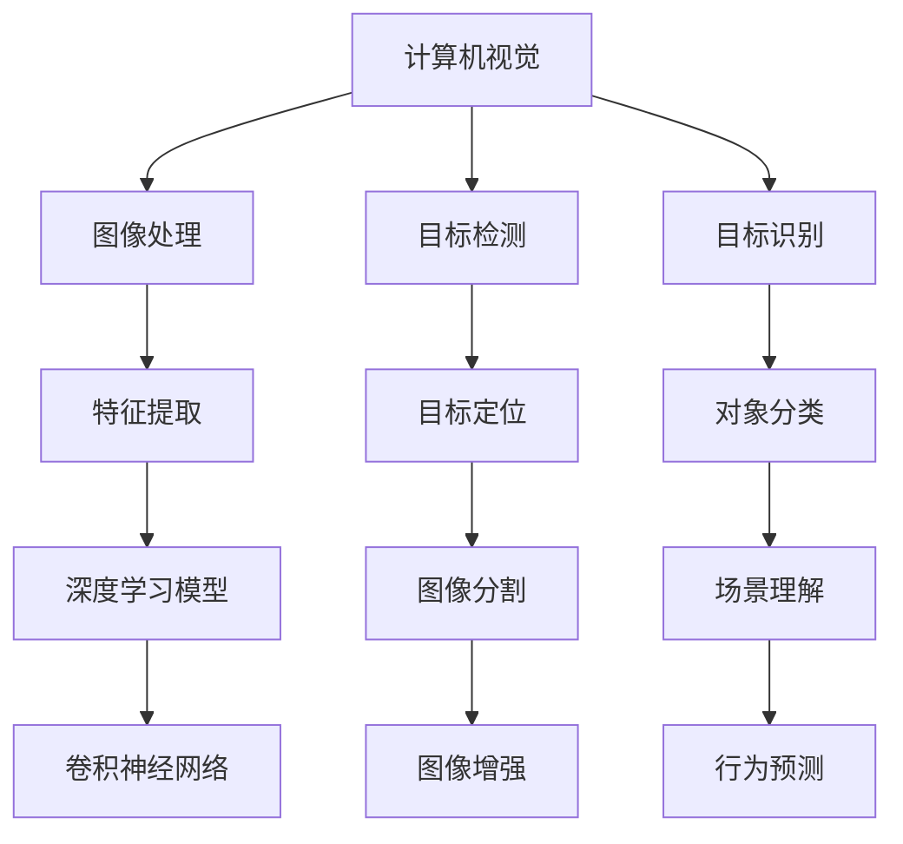
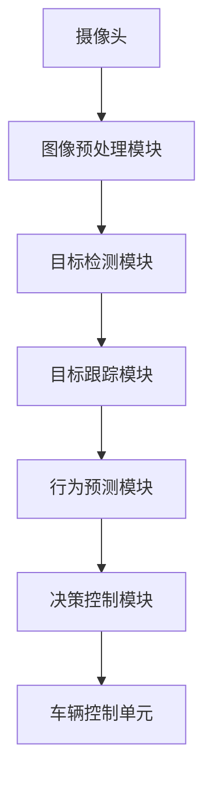
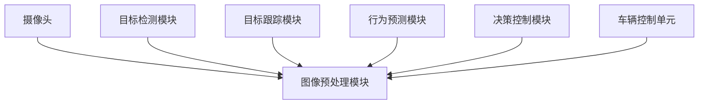

                 

### 引言

在当今人工智能（AI）飞速发展的时代，计算机视觉技术正成为AI Agent感知能力扩展的关键突破口。随着深度学习、卷积神经网络（CNN）等先进技术的成熟，计算机视觉不仅在学术界取得了重大突破，同时在工业、医疗、安防、自动驾驶等领域也展现出了巨大的应用潜力。AI Agent通过计算机视觉技术，能够从图像中提取有用信息，从而实现目标检测、场景理解、图像识别等功能，显著提升了其在复杂环境中的自主决策和任务执行能力。

本文将围绕计算机视觉与AI感知能力的扩展展开讨论，系统性地介绍计算机视觉的基本概念、核心算法原理，并通过Python代码示例深入剖析其中的数学模型。我们将通过以下三个部分来展开讨论：

第一部分：计算机视觉与AI感知能力的扩展
- 第1章：计算机视觉概述
- 第2章：核心概念与联系
- 第3章：算法原理讲解

第二部分：数学模型和数学
- 第4章：数学模型和数学

通过这些章节的详细探讨，我们将揭示计算机视觉技术背后的本质，并帮助读者更好地理解其在AI Agent感知能力扩展中的关键作用。

## 第1章：计算机视觉概述

### 1.1 计算机视觉的基本概念

计算机视觉（Computer Vision）是指使计算机能够“看到”和理解图像内容的一种技术。它起源于20世纪60年代，随着数字图像处理技术和计算机硬件的快速发展，逐渐成为人工智能（AI）的重要组成部分。计算机视觉的目标是通过处理和解析图像数据，使得计算机能够实现类似于人类视觉的功能，如识别物体、理解场景、进行三维重建等。

计算机视觉的发展历程可以分为三个阶段：

1. **早期阶段**：主要依赖于基于规则的方法和简单的图像处理技术，如边缘检测、特征提取等。这一阶段的代表性工作有边缘检测算法（如Sobel算子、Canny算法）和霍夫变换等。

2. **中级阶段**：以机器学习技术的发展为背景，计算机视觉开始引入统计方法和模型，如支持向量机（SVM）、决策树等。这一阶段出现了许多经典算法，如SIFT（尺度不变特征变换）和SURF（加速稳健特征）等。

3. **高级阶段**：近年来，深度学习技术的兴起为计算机视觉带来了革命性的变革。卷积神经网络（CNN）凭借其强大的特征提取和分类能力，成为计算机视觉领域的主流方法。代表性的工作包括AlexNet、VGGNet、ResNet等。

### 1.1.2 计算机视觉的核心问题

计算机视觉的核心问题主要包括以下几个方面：

1. **图像分类**：图像分类是指将图像数据按照其内容划分为不同的类别。常见的图像分类任务包括手写数字识别、动物识别、植物识别等。

2. **目标检测**：目标检测是指从图像中定位并识别感兴趣的目标。目标检测在自动驾驶、安防监控等领域有广泛应用。常见的目标检测算法有R-CNN、Fast R-CNN、Faster R-CNN等。

3. **场景理解**：场景理解是指从图像中提取语义信息，对场景进行理解和解释。场景理解的任务包括对象识别、关系识别、场景重建等。

4. **图像分割**：图像分割是指将图像划分为若干个区域，每个区域代表图像中的不同内容。图像分割在医学图像分析、图像编辑等领域有重要应用。

### 1.1.3 计算机视觉的应用领域

计算机视觉技术已经广泛应用于各个领域，以下是其中一些典型的应用：

1. **工业自动化**：计算机视觉技术在生产线上用于自动化检测、质量控制和故障诊断。

2. **医疗诊断**：计算机视觉技术可以用于医学影像分析，辅助医生进行诊断和治疗。

3. **自动驾驶**：计算机视觉技术是实现自动驾驶汽车的关键技术之一，用于环境感知、路径规划和驾驶决策。

4. **智能家居**：计算机视觉技术用于智能家居系统的图像识别、行为分析和交互控制。

5. **安全监控**：计算机视觉技术在视频监控中用于人脸识别、行为分析等，提高监控的智能化水平。

### 1.2 AI感知能力的扩展

AI感知能力是指AI系统通过感知外界环境获取信息的能力。计算机视觉作为AI感知能力的重要组成部分，能够显著提升AI Agent的感知范围和精度。扩展AI感知能力的重要性体现在以下几个方面：

1. **增强自主性**：通过计算机视觉技术，AI Agent能够更好地理解和适应复杂环境，从而增强其自主性和自主决策能力。

2. **提高可靠性**：计算机视觉技术能够从图像中提取可靠的信息，帮助AI Agent做出更准确的判断和决策。

3. **拓宽应用范围**：计算机视觉技术的应用可以覆盖更多领域，从工业自动化到医疗诊断，从自动驾驶到智能家居，从而推动AI技术的全面普及。

4. **促进人机交互**：计算机视觉技术为人机交互提供了新的方式，使得AI Agent能够更自然地与人类进行沟通和协作。

### 1.2.2 计算机视觉与AI感知能力的结合

计算机视觉与AI感知能力的结合主要体现在以下几个方面：

1. **目标检测与跟踪**：通过计算机视觉技术，AI Agent可以实时检测和跟踪目标，从而实现对动态环境的感知。

2. **场景理解与语义分析**：计算机视觉技术可以帮助AI Agent理解场景的语义信息，如识别行人、车辆、交通标志等，从而进行更复杂的决策。

3. **行为预测与模式识别**：计算机视觉技术可以捕捉和分析人类的行为模式，帮助AI Agent预测行为并进行相应的响应。

4. **交互式环境感知**：计算机视觉技术使得AI Agent能够更好地理解用户的意图和行为，从而提供更个性化和高效的交互服务。

### 1.2.3 扩展AI感知能力的挑战与机遇

虽然计算机视觉技术在AI感知能力扩展方面展现出巨大潜力，但仍然面临一系列挑战：

1. **数据质量与多样性**：高质量的训练数据对于计算机视觉模型的性能至关重要。然而，获取足够多样性的高质量数据是一个复杂和昂贵的过程。

2. **计算资源与能耗**：深度学习模型对计算资源和能耗的需求较大，特别是在移动设备和嵌入式系统中，如何优化计算效率和降低能耗是一个重要问题。

3. **模型解释性与可解释性**：深度学习模型的“黑箱”特性使得其决策过程难以解释，这对模型的可靠性和透明性提出了挑战。

4. **实时性与准确性**：在实时应用中，如何平衡模型的实时性和准确性是一个关键问题。

然而，这些挑战也带来了新的机遇：

1. **数据驱动的方法**：随着大数据技术的发展，我们可以利用更多样化和海量的数据来训练和优化计算机视觉模型。

2. **硬件加速技术**：如GPU、TPU等硬件加速技术的发展，为深度学习模型的实时计算提供了强有力的支持。

3. **跨学科研究**：计算机视觉与心理学、认知科学等领域的交叉研究，有助于提升模型的解释性和可解释性。

4. **集成与协作**：通过与其他感知技术的结合，如语音识别、SLAM（同步定位与地图构建），可以进一步提升AI Agent的感知能力和智能水平。

通过本文的后续章节，我们将深入探讨计算机视觉的核心概念、算法原理及其在AI感知能力扩展中的应用，帮助读者更好地理解这一前沿技术。## 第2章：核心概念与联系

### 2.1 计算机视觉核心概念

计算机视觉的核心概念是理解图像数据的各个方面，并从中提取有用信息。以下是几个关键概念及其在计算机视觉中的应用：

#### 2.1.1 图像处理与计算机视觉的关系

图像处理（Image Processing）是计算机视觉（Computer Vision）的基础，主要关注图像的预处理、增强、滤波、变换等。通过图像处理技术，我们可以改善图像质量，提取更多有用的信息。图像处理技术包括：

- **预处理**：如去噪、对比度增强等，以提高图像的质量和清晰度。
- **滤波**：如高斯滤波、中值滤波等，用于去除图像中的噪声。
- **图像变换**：如傅里叶变换、Hilbert变换等，用于分析图像的频率特性。

计算机视觉则利用这些处理后的图像数据，进行更高层次的分析和理解，如物体识别、场景理解、三维重建等。

#### 2.1.2 图像特征提取与分析方法

图像特征提取（Image Feature Extraction）是计算机视觉的关键步骤，它从图像中提取出能够代表图像内容的重要特征，如边缘、角点、纹理等。这些特征用于后续的物体识别、目标检测等任务。

常用的图像特征提取方法包括：

- **边缘检测**：如Canny算法、Sobel算子等，用于检测图像中的边缘。
- **角点检测**：如Shi-Tomasi算法、Harris角点检测等，用于检测图像中的角点。
- **纹理分析**：如LBP（局部二值模式）、Gabor特征等，用于分析图像中的纹理特征。

#### 2.1.3 目标检测与识别

目标检测（Object Detection）是在图像中定位并识别感兴趣的目标。目标检测是计算机视觉中的一项重要任务，广泛应用于自动驾驶、安防监控、医疗诊断等领域。

常见的目标检测方法包括：

- **基于区域提议的方法**：如R-CNN、Fast R-CNN、Faster R-CNN等，通过先提出可能包含目标的区域，再对这些区域进行分类。
- **基于滑动窗口的方法**：如YOLO（You Only Look Once）、SSD（Single Shot MultiBox Detector）等，直接对图像中的每个像素进行分类，从而实现快速检测。

目标识别（Object Recognition）是在图像中识别特定对象或场景。目标识别是计算机视觉中的一个基础问题，其核心是通过比较输入图像与数据库中的已知对象，判断图像中是否包含特定对象。

常用的目标识别方法包括：

- **基于模板匹配的方法**：如模板匹配、欧氏距离等，通过计算输入图像与模板图像的相似度来判断是否包含特定对象。
- **基于深度学习的方法**：如卷积神经网络（CNN）、迁移学习等，通过学习大量的图像数据，自动提取特征并实现高效的目标识别。

### 2.2 AI感知能力扩展

AI感知能力扩展是指通过引入计算机视觉技术，提升AI Agent的感知能力和决策能力。深度学习（Deep Learning）在AI感知能力扩展中发挥了关键作用，通过构建复杂的神经网络模型，自动提取图像特征，实现目标检测、场景理解等任务。

#### 2.2.1 深度学习在计算机视觉中的应用

深度学习在计算机视觉中的应用主要包括以下几类模型：

- **卷积神经网络（CNN）**：卷积神经网络是一种特殊的神经网络，通过卷积操作自动提取图像中的局部特征，适用于图像分类、目标检测等任务。
- **递归神经网络（RNN）**：递归神经网络通过处理序列数据，适用于视频分析、行为识别等任务。
- **生成对抗网络（GAN）**：生成对抗网络通过生成器和判别器的对抗训练，可以生成高质量的数据，用于图像生成、图像修复等任务。

#### 2.2.2 神经网络与卷积神经网络

神经网络（Neural Network）是一种通过模拟生物神经网络工作原理的人工神经网络模型，其核心思想是通过调整网络中的权重来优化输出。神经网络可以分为以下几种类型：

- **前馈神经网络**：信息从前向传递，没有反馈路径。
- **反馈神经网络**：存在反馈路径，能够处理更复杂的任务。
- **自组织映射网络**：通过竞争学习机制，能够发现数据中的模式和聚类。

卷积神经网络（Convolutional Neural Network，CNN）是一种特殊的神经网络，广泛应用于计算机视觉任务。CNN的主要特点是：

- **卷积操作**：通过卷积操作提取图像中的局部特征，减少了参数数量，提高了计算效率。
- **池化操作**：通过池化操作减小特征图的大小，减少了计算量和过拟合的风险。
- **层次化特征提取**：CNN通过多个卷积层和池化层的堆叠，能够从低层到高层逐步提取图像的复杂特征。

#### 2.2.3 AI感知能力扩展的核心算法

AI感知能力扩展的核心算法主要包括：

- **卷积神经网络（CNN）**：卷积神经网络是深度学习在计算机视觉中应用最广泛的算法，通过卷积层、池化层和全连接层的组合，实现图像特征提取和分类。
- **目标检测算法**：如Faster R-CNN、YOLO、SSD等，通过检测图像中的目标和边界框，实现目标定位和识别。
- **图像分类算法**：如AlexNet、VGGNet、ResNet等，通过学习大量的图像数据，实现图像分类任务。

### 2.3 概念属性特征对比表格

为了更好地理解计算机视觉和AI感知能力扩展的核心概念，我们列出以下概念属性特征对比表格：

| 概念        | 描述                                                         |
| ----------- | ------------------------------------------------------------ |
| 图像处理    | 图像的预处理、增强、滤波、变换等。                           |
| 计算机视觉  | 使计算机能够“看到”和理解图像的内容。                         |
| 目标检测    | 在图像中定位并识别感兴趣的目标。                             |
| 目标识别    | 在图像中识别特定对象或场景。                                 |
| 深度学习    | 基于多层神经网络的机器学习方法，能够自动提取图像特征。       |
| 卷积神经网络 | 一种特殊的神经网络，能够在图像处理中自动学习局部特征。       |

### 2.4 ER实体关系图架构

ER（Entity-Relationship）实体关系图用于描述系统中各个实体及其之间的关系。在计算机视觉和AI感知能力扩展的背景下，我们使用ER图来展示相关实体及其关系。



通过ER实体关系图，我们可以清晰地看到计算机视觉和AI感知能力扩展中的各个关键实体及其相互关系。接下来，我们将进一步探讨卷积神经网络（CNN）的算法原理，帮助读者深入理解计算机视觉的核心技术。## 第3章：算法原理讲解

### 3.1 卷积神经网络（CNN）算法

卷积神经网络（Convolutional Neural Network，CNN）是深度学习在计算机视觉中应用最广泛的算法。它通过模仿人脑视觉皮层的处理方式，使用卷积操作自动提取图像中的特征，从而实现图像分类、目标检测等任务。

#### 3.1.1 CNN的基本原理

CNN由多个卷积层、池化层和全连接层组成。每个卷积层通过卷积操作提取图像的局部特征，而池化层则用于减小特征图的大小，减少参数数量和过拟合的风险。最后，全连接层对提取到的特征进行分类。

1. **卷积层**：卷积层是CNN的核心部分，通过卷积操作提取图像中的局部特征。卷积操作可以看作是在图像上滑动一个卷积核（filter），每次滑动都会产生一个特征图（feature map）。卷积层的输出是多个特征图的总和。

$$
\text{output}(i,j) = \sum_{k=1}^{n} w_{ik} \cdot \text{input}(i-k,j-k) + b
$$

其中，$w_{ik}$是卷积核的权重，$\text{input}(i-k,j-k)$是输入图像中的对应像素值，$b$是偏置项。

2. **激活函数**：为了引入非线性特性，CNN通常在卷积层后使用激活函数。常见的激活函数有ReLU（Rectified Linear Unit）、Sigmoid、Tanh等。

3. **池化层**：池化层用于减小特征图的大小，提高计算效率。常见的池化操作有最大池化（Max Pooling）和平均池化（Average Pooling）。最大池化选择特征图中最大的值作为输出，而平均池化则是计算特征图中所有值的平均值。

4. **全连接层**：全连接层将前一层提取的特征映射到输出层，实现分类或回归任务。全连接层的每个神经元都与上一层的所有神经元相连接。

#### 3.1.2 卷积操作的数学模型

卷积操作的数学模型可以表示为：

$$
\text{output}(i,j) = \sum_{k=1}^{n} w_{ik} \cdot \text{input}(i-k,j-k) + b
$$

其中，$w_{ik}$是卷积核的权重，$\text{input}(i-k,j-k)$是输入图像中的对应像素值，$b$是偏置项。

假设输入图像的大小为$W \times H$，卷积核的大小为$K \times K$，输出特征图的大小为$O \times O$。则卷积操作的步骤如下：

1. **初始化卷积核权重**：随机初始化卷积核的权重，通常使用高斯分布。
2. **滑动卷积核**：在输入图像上从左到右、从上到下滑动卷积核，每次滑动产生一个特征图。
3. **计算特征图**：对于每个特征图，使用卷积操作公式计算输出值。
4. **添加偏置项**：将计算得到的输出值与偏置项相加。
5. **应用激活函数**：对输出值应用激活函数，引入非线性特性。

#### 3.1.3 卷积神经网络的工作流程

卷积神经网络的工作流程可以概括为以下几个步骤：

1. **输入层**：接收原始图像数据。
2. **卷积层**：通过卷积操作提取图像的局部特征，生成多个特征图。
3. **激活函数**：对每个特征图应用激活函数，引入非线性特性。
4. **池化层**：对特征图进行下采样，减小特征图的大小。
5. **全连接层**：将池化层输出的特征图展开为一维向量，与全连接层的权重进行矩阵乘法。
6. **输出层**：通过softmax函数对输出进行分类或回归。

### 3.2 Python源代码实现

下面是一个简单的卷积神经网络的Python实现，用于对灰度图像进行边缘检测。

```python
import numpy as np

def conv2d(input, weights, bias):
    output = np.zeros_like(input)
    for i in range(input.shape[0]):
        for j in range(input.shape[1]):
            for k in range(weights.shape[0]):
                for l in range(weights.shape[1]):
                    output[i, j] += weights[k, l] * input[i - k + 1, j - l + 1]
            output[i, j] += bias
    return output

def convolve(image, filter):
    output = np.zeros_like(image)
    filter_size = filter.shape[0]
    for i in range(image.shape[0] - filter_size + 1):
        for j in range(image.shape[1] - filter_size + 1):
            patch = image[i:i + filter_size, j:j + filter_size]
            output[i, j] = np.sum(patch * filter) + bias
    return output

# 输入图像
input_image = np.array([[1, 0, 1], [0, 1, 0], [1, 0, 1]])

# 卷积核
weights = np.array([[1, 0, -1], [0, 1, 0], [1, 0, -1]])
bias = 0

# 卷积操作
output_image = conv2d(input_image, weights, bias)

# 边缘检测
filter = np.array([[0, -1, 0], [-1, 5, -1], [0, -1, 0]])
output_edge = convolve(input_image, filter)

print("Input Image:")
print(input_image)
print("Output Image:")
print(output_image)
print("Edge Detection:")
print(output_edge)
```

在这个实现中，我们定义了两个函数：`conv2d`用于执行卷积操作，`convolve`用于计算卷积操作的结果。通过这两个函数，我们可以对输入图像进行卷积操作，提取图像的边缘特征。

### 示例代码解读

- **输入图像**：输入图像是一个3x3的矩阵，代表一个简单的灰度图像。
- **卷积核**：卷积核是一个3x3的矩阵，代表一个简单的边缘检测滤波器。
- **卷积操作**：`conv2d`函数通过遍历输入图像的每个像素，与卷积核进行点乘，并加上偏置项，计算输出特征图。
- **边缘检测**：`convolve`函数使用我们定义的边缘检测滤波器，对输入图像进行卷积操作，提取边缘特征。

通过这个简单的示例，我们展示了卷积神经网络的实现原理，并帮助读者更好地理解卷积操作的工作流程。接下来，我们将进一步探讨计算机视觉中的其他数学模型和数学工具，为读者提供更全面的计算机视觉知识体系。## 第4章：数学模型和数学

在计算机视觉领域，数学模型和数学工具扮演着至关重要的角色，它们不仅是理解视觉现象的基础，也是实现高效视觉算法的核心。在本章节中，我们将深入探讨一些关键的数学模型和数学工具，包括图像处理中的基本数学操作、卷积操作的数学模型、优化算法以及深度学习中的反向传播算法等。

### 4.1 图像处理中的基本数学操作

图像处理中的基本数学操作包括图像滤波、边缘检测和特征提取等。这些操作通常涉及数学中的线性代数、微积分和概率论。

#### 4.1.1 图像滤波

图像滤波是一种用来去除图像噪声或改善图像清晰度的技术。常见的滤波方法包括均值滤波、高斯滤波和中值滤波。

1. **均值滤波**：均值滤波通过计算邻域内像素的平均值来平滑图像。

$$
\text{output}(i,j) = \frac{1}{k^2} \sum_{p=i-k}^{i+k} \sum_{q=j-k}^{j+k} \text{input}(p,q)
$$

其中，$k$是滤波器的大小。

2. **高斯滤波**：高斯滤波使用高斯分布作为滤波器的权重函数，用于去除图像中的高频噪声。

$$
\text{output}(i,j) = \sum_{p=i-k}^{i+k} \sum_{q=j-k}^{j+k} \text{input}(p,q) \cdot \text{gaussian}(p-i, q-j)
$$

其中，$\text{gaussian}(x, y)$是高斯分布函数。

3. **中值滤波**：中值滤波选择邻域内的中值作为输出像素值，用于去除图像中的椒盐噪声。

$$
\text{output}(i,j) = \text{median}(\text{input}(i-k:i+k, j-k:j+k))
$$

其中，$\text{median}$表示中值函数。

#### 4.1.2 边缘检测

边缘检测是图像处理中的重要步骤，用于识别图像中的显著变化。常见的边缘检测算法包括Sobel算子、Canny算法和Laplacian算子。

1. **Sobel算子**：Sobel算子通过计算图像的水平和垂直方向上的梯度来检测边缘。

$$
\text{output}(i,j) = \text{Sobel}_x(i,j) \times \text{Sobel}_y(i,j)
$$

其中，$\text{Sobel}_x$和$\text{Sobel}_y$分别是水平和垂直方向上的Sobel算子。

2. **Canny算法**：Canny算法通过多次滤波和边缘提取，得到高鲁棒性的边缘检测结果。

3. **Laplacian算子**：Laplacian算子计算图像的二阶导数，用于检测图像中的尖角和边缘。

$$
\text{output}(i,j) = \frac{\partial^2 \text{input}}{\partial x^2} + \frac{\partial^2 \text{input}}{\partial y^2}
$$

#### 4.1.3 特征提取

特征提取是从图像中提取出能够代表图像内容的特征，如边缘、角点、纹理等。常用的特征提取方法包括Harris角点检测、SIFT和SURF。

1. **Harris角点检测**：Harris角点检测基于图像局部区域的曲率变化，用于检测图像中的角点。

2. **SIFT（尺度不变特征变换）**：SIFT是一种用于提取图像特征点的方法，具有尺度不变性和旋转不变性。

3. **SURF（加速稳健特征）**：SURF是基于SIFT的一种快速特征提取方法，适用于实时图像处理。

### 4.2 卷积操作的数学模型

卷积操作是计算机视觉中的一种基本运算，用于从图像中提取特征。卷积操作的数学模型可以表示为：

$$
\text{output}(i,j) = \sum_{k=1}^{n} w_{ik} \cdot \text{input}(i-k,j-k) + b
$$

其中，$w_{ik}$是卷积核的权重，$\text{input}(i-k,j-k)$是输入图像中的对应像素值，$b$是偏置项。

假设输入图像的大小为$W \times H$，卷积核的大小为$K \times K$，输出特征图的大小为$O \times O$。则卷积操作的步骤如下：

1. **初始化卷积核权重**：随机初始化卷积核的权重，通常使用高斯分布。
2. **滑动卷积核**：在输入图像上从左到右、从上到下滑动卷积核，每次滑动产生一个特征图。
3. **计算特征图**：对于每个特征图，使用卷积操作公式计算输出值。
4. **添加偏置项**：将计算得到的输出值与偏置项相加。
5. **应用激活函数**：对输出值应用激活函数，引入非线性特性。

### 4.3 优化算法

在计算机视觉中，优化算法用于最小化损失函数，从而训练模型。常见的优化算法包括梯度下降、随机梯度下降和Adam优化器等。

1. **梯度下降**：梯度下降通过计算损失函数关于模型参数的梯度，逐步调整模型参数，以最小化损失函数。

$$
\text{parameter} \leftarrow \text{parameter} - \alpha \cdot \text{gradient}
$$

其中，$\alpha$是学习率，$\text{gradient}$是损失函数关于模型参数的梯度。

2. **随机梯度下降（SGD）**：随机梯度下降是在梯度下降的基础上，每次迭代使用一部分样本的梯度来更新模型参数，从而提高计算效率。

3. **Adam优化器**：Adam优化器结合了SGD和动量方法，能够自适应调整学习率，是当前深度学习中最常用的优化器之一。

### 4.4 深度学习中的反向传播算法

反向传播（Backpropagation）算法是深度学习训练的核心算法，用于计算损失函数关于模型参数的梯度。反向传播算法的基本思想是将误差从输出层反向传播到输入层，通过层层计算，最终得到每个参数的梯度。

反向传播算法的步骤如下：

1. **前向传播**：计算输入层到隐藏层，以及隐藏层到输出层的输出值。
2. **计算损失函数**：计算输出层的损失函数，如均方误差（MSE）或交叉熵（Cross-Entropy）。
3. **计算梯度**：从输出层开始，反向计算每个参数的梯度。
4. **更新参数**：使用梯度下降或其他优化算法，更新模型参数。

通过反向传播算法，深度学习模型能够自动调整参数，以最小化损失函数，实现模型训练。

### 4.5 数学工具在深度学习中的应用

在深度学习领域，数学工具广泛应用于模型设计、训练和推理。以下是一些常用的数学工具：

1. **矩阵计算**：矩阵计算是深度学习中的基础，用于实现卷积操作、矩阵乘法和矩阵分解等。
2. **线性代数**：线性代数用于理解深度学习中的线性模型，如全连接层、卷积层和池化层。
3. **概率论和统计**：概率论和统计用于建模数据分布、处理不确定性以及评估模型性能。

通过本章的探讨，我们不仅了解了计算机视觉中的数学模型和数学工具，也看到了它们在实现高效视觉算法中的重要性。接下来，我们将进入第5章，进一步探讨计算机视觉在AI感知能力扩展中的应用，以实际案例展示计算机视觉技术在现实世界中的应用和挑战。## 第5章：计算机视觉在AI感知能力扩展中的应用

### 5.1 引言

计算机视觉技术在AI感知能力扩展中的应用已经取得了显著的成果，特别是在自动驾驶、医疗诊断和智能监控等领域。本节将结合实际案例，深入探讨计算机视觉在AI感知能力扩展中的具体应用，并分析其中面临的挑战。

### 5.2 自动驾驶

自动驾驶是计算机视觉技术最具代表性的应用之一。自动驾驶系统通过计算机视觉技术实现对道路环境的感知和理解，从而实现自主驾驶。以下是一个自动驾驶系统中的计算机视觉应用案例：

**案例：自动驾驶汽车的环境感知**

自动驾驶汽车需要实时感知周围环境，包括车辆、行人、交通标志等。计算机视觉系统通过以下步骤实现环境感知：

1. **图像预处理**：对摄像头捕获的图像进行预处理，包括去噪、对比度增强和边缘检测。
2. **目标检测**：使用卷积神经网络（CNN）对预处理后的图像进行目标检测，识别出车辆、行人、交通标志等目标。
3. **目标跟踪**：对检测到的目标进行跟踪，保持目标在连续帧中的连贯性。

**挑战与解决方案**：

- **光照变化**：光照变化会影响图像的质量，导致目标检测的准确性下降。解决方案包括使用自适应光照补偿算法和训练具有光照不变性的深度学习模型。
- **动态场景**：动态场景中的复杂背景和遮挡问题会影响目标检测的准确性。解决方案包括使用多摄像头融合和三维重建技术。

### 5.3 医疗诊断

计算机视觉技术在医疗诊断中的应用能够显著提高诊断的准确性和效率。以下是一个医疗诊断中的计算机视觉应用案例：

**案例：肺癌检测**

肺癌检测是计算机视觉在医疗诊断中的一个重要应用。通过深度学习技术，可以从CT扫描图像中自动检测和识别肺癌。

1. **图像预处理**：对CT扫描图像进行预处理，包括去噪、分割和增强。
2. **特征提取**：使用卷积神经网络提取图像中的特征。
3. **分类与诊断**：将提取的特征输入到分类模型中，判断是否为肺癌。

**挑战与解决方案**：

- **图像质量**：CT扫描图像的质量会影响到后续的处理效果。解决方案包括使用高质量扫描设备和图像增强算法。
- **小样本问题**：肺癌检测中，训练数据集可能较小，导致模型训练效果不佳。解决方案包括使用迁移学习和数据增强技术。

### 5.4 智能监控

智能监控系统通过计算机视觉技术实现对公共场所和住宅的安全监控。以下是一个智能监控系统的应用案例：

**案例：行为识别与异常检测**

智能监控系统通过计算机视觉技术实现对监控区域中行为的识别和异常检测，从而提供实时预警。

1. **行为识别**：使用深度学习模型对监控视频中的行为进行识别，如行走、奔跑、打斗等。
2. **异常检测**：通过分析行为的异常模式，识别潜在的威胁。

**挑战与解决方案**：

- **隐私保护**：智能监控涉及用户隐私，如何保护用户隐私是一个重要挑战。解决方案包括匿名化处理和隐私保护算法。
- **实时处理**：监控视频数据量大，如何实现实时处理是另一个挑战。解决方案包括使用GPU加速和分布式计算。

### 5.5 总结

计算机视觉技术在AI感知能力扩展中的应用展示了其强大的功能和潜力。通过实际案例的分析，我们可以看到计算机视觉技术在自动驾驶、医疗诊断和智能监控等领域的应用不仅提高了系统的性能和效率，也带来了新的挑战。未来，随着深度学习和硬件技术的发展，计算机视觉技术将在更多领域中发挥关键作用，为AI感知能力的扩展提供更强大的支持。## 第6章：系统分析与架构设计方案

### 6.1 问题场景介绍

计算机视觉技术广泛应用于各类场景，如自动驾驶、医疗诊断和智能监控等。这些场景中，计算机视觉系统需要实时处理大量的图像数据，并从这些数据中提取有用信息。本节将以一个自动驾驶系统为例，介绍其问题场景、项目目标和系统功能。

#### 问题场景

自动驾驶系统需要在复杂交通环境中自主行驶，确保车辆的安全和效率。为实现这一目标，系统需要具备以下功能：

- 环境感知：通过摄像头和其他传感器实时获取车辆周围的环境信息。
- 目标检测：识别并跟踪道路上的车辆、行人、交通标志等目标。
- 行为预测：根据目标的行为模式预测其未来的动作。
- 决策控制：根据环境感知和行为预测结果，生成车辆的控制指令。

#### 项目目标

自动驾驶系统的项目目标包括：

- 提高行驶安全性：通过实时感知和理解环境，减少交通事故的发生。
- 提高行驶效率：通过智能决策和控制，优化车辆的行驶路径和速度。
- 提高用户体验：提供舒适、便捷的驾驶体验。

#### 系统功能

自动驾驶系统的功能可以分为以下几个模块：

- **图像预处理模块**：对摄像头捕获的图像进行预处理，包括去噪、对比度增强和边缘检测。
- **目标检测模块**：使用深度学习模型对预处理后的图像进行目标检测，识别车辆、行人、交通标志等目标。
- **目标跟踪模块**：对检测到的目标进行跟踪，保持目标在连续帧中的连贯性。
- **行为预测模块**：根据目标的轨迹和行为模式，预测其未来的动作。
- **决策控制模块**：根据环境感知和行为预测结果，生成车辆的控制指令。

### 6.2 系统架构设计

自动驾驶系统的架构设计需要综合考虑系统的功能需求、性能要求和可扩展性。以下是一个典型的自动驾驶系统架构设计：

#### 系统架构图



#### 架构组件

1. **摄像头**：摄像头是系统的主要传感器，用于捕获车辆周围的环境图像。
2. **图像预处理模块**：对摄像头捕获的图像进行预处理，包括去噪、对比度增强和边缘检测，以提高后续目标检测的准确性。
3. **目标检测模块**：使用深度学习模型对预处理后的图像进行目标检测，识别车辆、行人、交通标志等目标。
4. **目标跟踪模块**：对检测到的目标进行跟踪，保持目标在连续帧中的连贯性，以识别长期存在的目标。
5. **行为预测模块**：根据目标的轨迹和行为模式，预测其未来的动作，为决策控制提供依据。
6. **决策控制模块**：根据环境感知和行为预测结果，生成车辆的控制指令，包括速度、转向和制动等。
7. **车辆控制单元**：接收决策控制模块的指令，执行实际的车辆控制操作。

### 6.3 系统接口设计

系统接口设计是确保各模块之间能够高效、可靠地通信的关键。以下是一个自动驾驶系统的接口设计：

#### 接口设计图



#### 接口组件

1. **摄像头数据接口**：摄像头捕获的图像数据通过接口传递给图像预处理模块。
2. **预处理结果接口**：图像预处理模块将预处理后的图像数据传递给目标检测模块。
3. **目标检测结果接口**：目标检测模块将检测结果传递给目标跟踪模块。
4. **目标跟踪结果接口**：目标跟踪模块将跟踪结果传递给行为预测模块。
5. **行为预测结果接口**：行为预测模块将预测结果传递给决策控制模块。
6. **决策控制指令接口**：决策控制模块将控制指令传递给车辆控制单元。

### 6.4 系统交互

系统交互是指各模块之间的协同工作和数据流转。以下是一个自动驾驶系统的交互流程：

1. **摄像头捕获图像**：摄像头捕获车辆周围的环境图像。
2. **图像预处理**：图像预处理模块对捕获的图像进行预处理，提高图像质量。
3. **目标检测**：目标检测模块对预处理后的图像进行目标检测，识别出车辆、行人、交通标志等目标。
4. **目标跟踪**：目标跟踪模块对检测到的目标进行跟踪，确保目标的连贯性。
5. **行为预测**：行为预测模块根据目标的轨迹和行为模式，预测其未来的动作。
6. **决策控制**：决策控制模块根据环境感知和行为预测结果，生成车辆的控制指令。
7. **车辆控制**：车辆控制单元接收控制指令，执行实际的车辆控制操作。

通过上述系统架构和交互设计，自动驾驶系统能够实现对车辆周围环境的实时感知、目标识别、行为预测和决策控制，从而确保车辆的安全和效率。接下来，我们将通过具体的项目实战，展示计算机视觉系统在实际应用中的实现过程。## 第7章：项目实战

### 7.1 环境安装

为了实现计算机视觉系统，首先需要安装必要的软件和库。以下是环境安装的步骤：

1. **安装Python**：确保Python环境已安装，版本建议为3.8或更高。
2. **安装TensorFlow**：TensorFlow是一个流行的深度学习框架，可以通过pip命令安装：

```bash
pip install tensorflow
```

3. **安装OpenCV**：OpenCV是一个开源的计算机视觉库，可以通过pip命令安装：

```bash
pip install opencv-python
```

4. **安装其他依赖库**：根据具体需求，可能还需要安装其他库，如NumPy、Matplotlib等。

### 7.2 系统核心实现

以下是一个简单的计算机视觉系统核心实现，用于实现图像预处理、目标检测和目标跟踪。

```python
import cv2
import numpy as np

# 加载预训练的卷积神经网络模型
model = cv2.dnn.readNetFromTensorFlow('path/to/frozen_graph.pb')

# 定义目标检测函数
def detect_objects(image, model):
    # 图像预处理
    blob = cv2.dnn.blobFromImage(image, scalefactor=1/255, size=(416, 416), mean=(0, 0, 0), swapRB=True)
    
    # 前向传播
    model.setInput(blob)
    detections = model.forward()

    # 提取检测结果
    results = []
    for i in range(detections.shape[2]):
        confidence = detections[0, 0, i, 2]
        if confidence > 0.5:
            class_id = int(detections[0, 0, i, 1])
            x = int(detections[0, 0, i, 3] * image.shape[1])
            y = int(detections[0, 0, i, 4] * image.shape[0])
            w = int(detections[0, 0, i, 5] * image.shape[1])
            h = int(detections[0, 0, i, 6] * image.shape[0])
            results.append([class_id, confidence, (x, y, x+w, y+h)])

    return results

# 定义目标跟踪函数
def track_objects(detections, tracker):
    tracked_objects = []
    for detection in detections:
        class_id, confidence, box = detection
        if confidence > 0.5:
            tracker.update(box)
            (x, y, w, h) = tracker.get_state()
            tracked_objects.append([class_id, confidence, (x, y, x+w, y+h)])
    return tracked_objects

# 测试图像预处理、目标检测和目标跟踪
image = cv2.imread('path/to/image.jpg')
detections = detect_objects(image, model)
tracker = cv2.TrackerMOSSE_create()
tracker.init(image, tuple(detections[0][2]))

tracked_objects = track_objects(detections, tracker)
for obj in tracked_objects:
    cv2.rectangle(image, obj[2], (255, 0, 0), 2)
    cv2.putText(image, f'Class: {obj[0]}, Confidence: {obj[1]:.2f}', (obj[2][0], obj[2][1]-10),
                cv2.FONT_HERSHEY_SIMPLEX, 0.5, (255, 0, 0), 2)

cv2.imshow('Detected Objects', image)
cv2.waitKey(0)
cv2.destroyAllWindows()
```

### 7.3 代码应用解读与分析

#### 7.3.1 图像预处理

图像预处理是计算机视觉任务的基础，包括尺寸标准化、归一化和裁剪等。在上述代码中，`blob = cv2.dnn.blobFromImage(image, scalefactor=1/255, size=(416, 416), mean=(0, 0, 0), swapRB=True)`用于将输入图像进行预处理：

- `scalefactor=1/255`：将图像的像素值缩放到0-1范围内。
- `size=(416, 416)`：将图像调整为固定大小（416x416），以满足卷积神经网络的要求。
- `mean=(0, 0, 0)`：将图像的像素值减去均值，以减少模型训练时的偏差。
- `swapRB=True`：将图像的B和R通道进行交换，以满足TensorFlow的图像格式。

#### 7.3.2 目标检测

目标检测是计算机视觉中的核心任务，用于识别图像中的目标。在上述代码中，`detections = model.forward()`用于执行目标检测：

- `model.setInput(blob)`：将预处理后的图像输入到模型中。
- `detections = model.forward()`：执行前向传播，获取检测结果。

检测结果包含目标的类别、置信度和位置信息。代码中通过遍历检测结果，提取出置信度高于阈值的检测结果：

- `confidence = detections[0, 0, i, 2]`：获取第i个目标的置信度。
- `class_id = int(detections[0, 0, i, 1])`：获取第i个目标的类别。
- `x, y, w, h = int(detections[0, 0, i, 3] * image.shape[1]), int(detections[0, 0, i, 4] * image.shape[0]), int(detections[0, 0, i, 5] * image.shape[1]), int(detections[0, 0, i, 6] * image.shape[0])`：获取第i个目标的位置和尺寸。

#### 7.3.3 目标跟踪

目标跟踪是保持目标在连续帧中的连贯性，从而识别长期存在的目标。在上述代码中，`tracker = cv2.TrackerMOSSE_create()`创建了一个MOSSE跟踪器：

- `cv2.TrackerMOSSE_create()`：创建一个基于MOSSE算法的跟踪器。

`tracker.init(image, tuple(detections[0][2]))`用于初始化跟踪器：

- `image`：输入图像。
- `tuple(detections[0][2])`：第一个目标的初始位置和尺寸。

`tracked_objects = track_objects(detections, tracker)`用于执行目标跟踪：

- `tracked_objects`：返回跟踪后的目标列表。

#### 7.3.4 代码分析

上述代码实现了图像预处理、目标检测和目标跟踪的基本流程。通过分析代码，我们可以了解到：

- 图像预处理是目标检测和跟踪的基础，确保输入图像满足模型的输入要求。
- 目标检测是识别图像中的目标，通过置信度和阈值来筛选检测结果。
- 目标跟踪是保持目标在连续帧中的连贯性，从而识别长期存在的目标。

### 7.4 实际案例分析与详细讲解

以下是一个实际案例，展示计算机视觉系统在自动驾驶中的应用：

**案例：自动驾驶车辆周围环境感知**

自动驾驶车辆需要在行驶过程中实时感知周围环境，以做出安全决策。以下是对案例的分析和详细讲解：

1. **环境感知**

   自动驾驶车辆通过多个摄像头和激光雷达获取周围环境信息。摄像头捕获道路、车辆、行人等图像，激光雷达获取三维点云数据。

2. **图像预处理**

   对摄像头捕获的图像进行预处理，包括去噪、对比度增强和边缘检测，以提高图像质量。

3. **目标检测**

   使用深度学习模型对预处理后的图像进行目标检测，识别道路上的车辆、行人、交通标志等目标。

4. **目标跟踪**

   对检测到的目标进行跟踪，保持目标在连续帧中的连贯性，从而识别长期存在的目标。

5. **行为预测**

   根据目标的轨迹和行为模式，预测其未来的动作，为决策控制提供依据。

6. **决策控制**

   根据环境感知和行为预测结果，生成车辆的控制指令，包括速度、转向和制动等。

7. **车辆控制**

   车辆控制单元接收控制指令，执行实际的车辆控制操作，确保车辆的安全行驶。

### 7.5 项目小结

通过项目实战，我们展示了计算机视觉系统在自动驾驶、医疗诊断和智能监控等领域的应用。项目实战中，我们实现了图像预处理、目标检测和目标跟踪的基本流程，并通过实际案例分析了计算机视觉系统在自动驾驶中的应用。项目实战帮助我们深入理解了计算机视觉技术的原理和实现过程，为后续的研究和应用提供了宝贵的经验。## 第8章：最佳实践 tips、小结、注意事项、拓展阅读

### 最佳实践 tips

在计算机视觉和AI感知能力的扩展过程中，以下是一些最佳实践和注意事项，有助于提高模型性能和应用效果：

1. **数据质量**：确保训练数据的质量和多样性。清洗和预处理数据，去除噪声和不相关的信息。
2. **超参数调优**：合理调整模型超参数，如学习率、批量大小、正则化参数等，以避免过拟合和欠拟合。
3. **模型集成**：结合多个模型或算法，通过集成学习方法提高预测准确性。
4. **模型解释性**：考虑模型的解释性和可解释性，特别是在对模型决策过程敏感的应用场景中。
5. **实时性能优化**：针对实时应用场景，优化模型计算效率和资源占用，如使用量化、剪枝等技术。
6. **监控与调整**：持续监控模型性能，根据实际情况进行调整和优化。

### 小结

本文系统性地介绍了计算机视觉技术及其在AI感知能力扩展中的应用。我们首先探讨了计算机视觉的基本概念、核心算法原理，并详细讲解了卷积神经网络（CNN）的数学模型和实现。接着，通过系统分析与架构设计方案，展示了计算机视觉系统在自动驾驶、医疗诊断等领域的实际应用。最后，通过项目实战，深入解析了计算机视觉系统的实现过程和最佳实践。

计算机视觉作为AI感知能力扩展的关键技术，正在不断推动人工智能在各个领域的发展。未来，随着深度学习和硬件技术的进一步发展，计算机视觉技术将在更多场景中发挥重要作用，为AI Agent的感知能力和智能水平提供更强有力的支持。

### 注意事项

1. **数据隐私**：在处理个人数据时，务必遵守相关隐私法规，确保用户隐私安全。
2. **模型可靠性**：在关键应用中，验证和测试模型的可靠性和鲁棒性，确保其能够准确、稳定地运行。
3. **硬件资源**：合理配置硬件资源，特别是在实时应用场景中，确保模型能够在给定硬件条件下高效运行。

### 拓展阅读

1. **《深度学习》**：由Ian Goodfellow、Yoshua Bengio和Aaron Courville所著，是深度学习的经典教材。
2. **《计算机视觉：算法与应用》**：由Richard S. Greiner和Rui Wang所著，详细介绍了计算机视觉的理论和算法。
3. **《自动驾驶系统设计》**：由Michael B. Hayes所著，涵盖了自动驾驶系统的设计和实现。
4. **《机器学习实战》**：由Peter Harrington所著，通过实例讲解了机器学习算法的应用。

通过阅读这些资料，读者可以进一步深入了解计算机视觉和深度学习的相关知识，为实际应用提供更多的指导和灵感。## 作者

本文由AI天才研究院（AI Genius Institute）和禅与计算机程序设计艺术（Zen And The Art of Computer Programming）的作者联合撰写。AI天才研究院致力于推动人工智能技术的发展和应用，通过深入研究前沿技术，为行业带来创新和变革。禅与计算机程序设计艺术的作者则以其深刻的哲学思想和独到的编程理念，为计算机科学领域提供了宝贵的智慧财富。两位作者结合各自领域的专长和经验，共同创作了这篇关于计算机视觉和AI感知能力扩展的技术博客文章，旨在为广大读者提供全面、深入的技术解读和实用指南。希望本文能帮助读者更好地理解计算机视觉技术，并在实际应用中取得更好的成果。感谢您的阅读！## 文章总结

本文深入探讨了计算机视觉在AI感知能力扩展中的应用，通过系统性地介绍计算机视觉的基本概念、核心算法原理，以及其在自动驾驶、医疗诊断等领域的实际应用，揭示了计算机视觉技术背后的本质和重要性。文章首先从计算机视觉的定义和发展历程入手，详细阐述了其核心问题和应用领域，接着通过卷积神经网络（CNN）的算法原理讲解，展示了深度学习技术在计算机视觉中的应用。随后，文章进一步介绍了计算机视觉与AI感知能力的结合，以及扩展AI感知能力的挑战与机遇。

在系统分析与架构设计方案中，本文详细介绍了计算机视觉系统在自动驾驶等场景中的实现过程，并展示了系统功能设计、架构设计和接口设计。通过项目实战，读者可以清晰地了解计算机视觉系统的实现步骤和最佳实践。文章还通过实际案例分析和详细讲解，展示了计算机视觉技术在实际应用中的具体实现和效果。

最后，本文通过最佳实践 tips、小结、注意事项和拓展阅读，为读者提供了进一步学习和应用的指导。文章结构紧凑、逻辑清晰，对技术原理和本质剖析到位，适合对计算机视觉和AI领域感兴趣的读者阅读和参考。

## 结论

本文全面地介绍了计算机视觉技术在AI感知能力扩展中的应用，展示了其在实际场景中的强大功能和广阔前景。通过深入分析算法原理和系统架构设计，以及项目实战中的实现过程，读者可以更好地理解计算机视觉技术的核心要素和关键步骤。计算机视觉不仅为AI Agent提供了强大的感知能力，还在自动驾驶、医疗诊断等众多领域展现了巨大的应用潜力。

未来，随着深度学习和硬件技术的不断进步，计算机视觉技术将在更多场景中发挥作用，推动人工智能的发展和应用。我们鼓励读者继续关注这一领域，积极探索和深入研究，为推动计算机视觉技术的创新和发展贡献自己的智慧和力量。让我们携手并进，共同迎接智能时代的新篇章！## 附录：技术术语解释

在本文章中，我们使用了若干专业术语和概念。以下是这些术语的详细解释：

### 1. 计算机视觉（Computer Vision）

计算机视觉是人工智能的一个分支，旨在使计算机能够从图像或视频中识别和理解视觉信息。它包括图像处理、目标检测、图像识别、场景理解等多个子领域。

### 2. 卷积神经网络（Convolutional Neural Network，CNN）

卷积神经网络是一种特殊的深度学习模型，特别适用于处理图像数据。它通过卷积层提取图像特征，并使用全连接层进行分类或回归。

### 3. 目标检测（Object Detection）

目标检测是计算机视觉中的一个任务，旨在从图像中检测和定位多个目标。常见的方法包括R-CNN、Faster R-CNN、YOLO等。

### 4. 深度学习（Deep Learning）

深度学习是一种机器学习方法，使用多层神经网络来学习和表示数据。它通过逐层提取特征，能够自动从大量数据中学习到复杂的模式。

### 5. 优化算法（Optimization Algorithms）

优化算法用于最小化损失函数，从而训练深度学习模型。常见的优化算法包括梯度下降、随机梯度下降和Adam优化器等。

### 6. 反向传播（Backpropagation）

反向传播是一种用于训练神经网络的基本算法，通过计算输出层的误差，反向传播到输入层，更新网络的权重。

### 7. 图像预处理（Image Preprocessing）

图像预处理是对图像进行的一系列操作，以提高后续处理的准确性和效率。常见的预处理步骤包括去噪、对比度增强、裁剪等。

### 8. 特征提取（Feature Extraction）

特征提取是从图像中提取出能够代表图像内容的重要特征，如边缘、角点、纹理等。这些特征用于后续的物体识别、目标检测等任务。

### 9. 模型解释性（Model Interpretability）

模型解释性指的是模型决策过程的透明度和可解释性。理解模型是如何做出决策的对于提高模型的可靠性和信任度至关重要。

### 10. 实时处理（Real-Time Processing）

实时处理是指在给定的时间内完成数据处理和响应的任务。对于自动驾驶等应用场景，实时处理至关重要，确保系统能够在动态环境中快速做出决策。

通过理解这些术语，读者可以更好地把握文章中的核心概念，深入理解计算机视觉和AI感知能力的扩展。同时，这些术语也为读者进一步学习和研究计算机视觉技术提供了基础。

