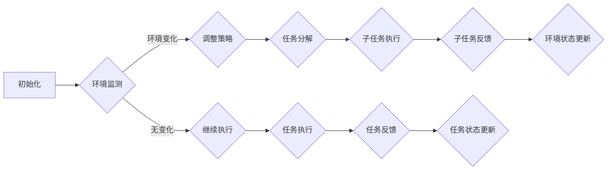
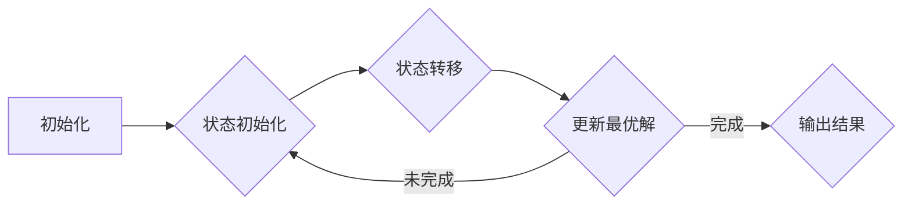
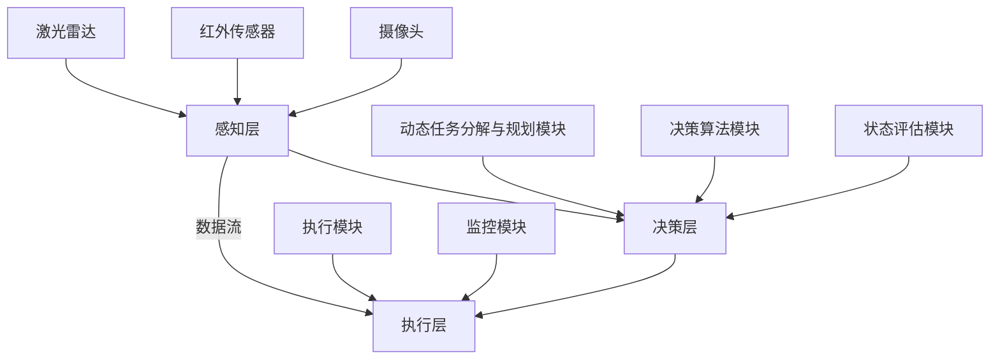
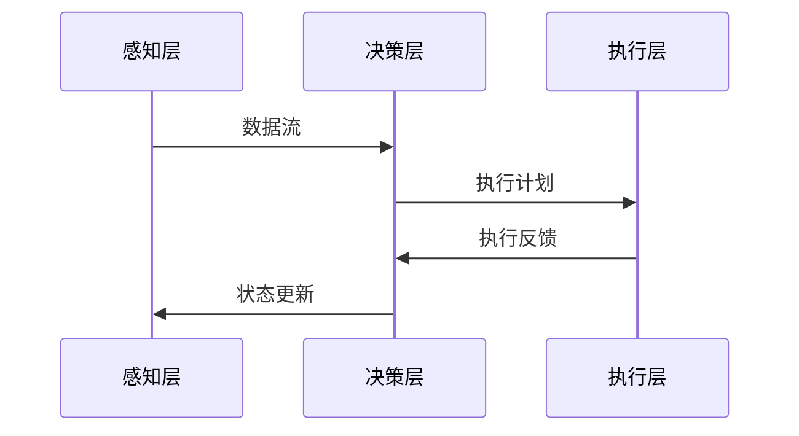

                 

## 引言与背景

### 1.1 问题背景

随着人工智能（AI）技术的不断进步，智能代理（AI Agent）在众多领域中的应用愈发广泛。智能代理是一类能够自主执行任务、具备一定智能行为的软件系统。它们可以在复杂动态的环境中，根据外部信息和内在目标，自动规划并执行相应的行动策略。然而，在实际应用中，智能代理面临的一个关键挑战是如何在动态环境中进行有效的任务分解与规划。

传统的任务分解与规划方法通常是基于预定义的规则或静态规划，这种方法在面对动态变化和不确定性较大的环境时，往往显得力不从心。动态任务分解与规划要求智能代理能够在执行任务的过程中，根据实时反馈和环境变化，动态调整任务分解和执行策略。这不仅能提高任务的完成效率，还能增强智能代理在复杂环境中的适应能力和鲁棒性。

### 1.2 问题描述

动态任务分解与规划涉及以下几个核心问题：

1. **任务分解**：将一个复杂任务分解成一系列子任务，每个子任务都是可以直接执行的基本单元。任务分解的关键在于如何高效地划分任务，使其既具有可执行性，又能满足整体任务的优化目标。
2. **动态规划**：在动态环境中，智能代理需要根据当前状态和目标，实时地规划执行策略。动态规划不仅要考虑当前的任务需求，还要预测环境的变化，以便提前做出适应性的调整。
3. **适应性**：智能代理需要具备一定的适应性，能够在不同的环境和条件下，灵活地调整任务分解与规划策略。这包括对任务优先级的调整、资源分配的优化以及对突发事件的响应。

### 1.3 问题与挑战

在动态任务分解与规划中，我们面临以下问题和挑战：

1. **不确定性**：动态环境中存在许多不确定性因素，如外部环境的突变、资源的不确定性等。智能代理需要具备预测和适应这些不确定性的能力。
2. **复杂度**：动态任务分解与规划涉及到多个变量和约束条件，如何高效地处理这些复杂度，是当前研究的一个难点。
3. **实时性**：动态环境要求智能代理能够实时地响应环境变化，进行任务分解与规划。这要求算法能够快速地执行，并且具备较低的计算复杂度。

### 1.4 动态任务分解与规划的意义

动态任务分解与规划对于智能代理的设计和应用具有重要意义：

1. **提升效率**：通过动态任务分解与规划，智能代理能够更高效地完成复杂任务，提高整体系统的运行效率。
2. **增强适应性**：动态任务分解与规划使得智能代理能够更好地适应动态环境，提高其在复杂多变环境中的生存能力和任务完成率。
3. **扩展应用场景**：动态任务分解与规划使得智能代理能够应用于更多领域，如自主机器人、智能交通、智能制造等。

总之，动态任务分解与规划是智能代理设计与实现中的关键环节，对于提升智能代理的智能化水平和应用广度具有重要意义。在接下来的章节中，我们将详细探讨动态任务分解与规划的相关技术、算法原理及其在具体应用场景中的实现方法。

## 第2章: 核心概念与联系

### 2.1 任务分解技术

任务分解是将一个复杂的任务划分为多个可管理的子任务的过程。在动态任务分解与规划中，任务分解技术起着至关重要的作用。任务分解的关键在于如何高效地划分任务，使其既能满足整体任务的优化目标，又能保证各个子任务的可行性和可执行性。

#### 任务分解的基本概念

1. **任务**：任务是一个抽象的概念，它表示需要完成的特定工作。任务可以是一个完整的、独立的任务，也可以是任务的一部分。
2. **子任务**：子任务是将任务分解后得到的可执行的基本单元。子任务通常是具体的、可操作的。
3. **层次结构**：任务分解可以形成一种层次结构，高层次的任务可以分解为低层次的子任务，这些子任务又可以进一步分解为更具体的子任务。

#### 任务分解的算法

任务分解算法是用于实现任务分解的核心技术。常见的任务分解算法包括：

1. **基于优先级的分解**：根据任务的优先级进行分解，优先级高的任务先分解，优先级低的任务后分解。
2. **基于关键路径的分解**：基于关键路径算法，将任务划分为关键路径上的任务和关键路径外的任务。
3. **基于约束的分解**：根据任务的约束条件进行分解，确保每个子任务都满足相应的约束条件。

#### 任务分解的性能评估

任务分解的性能评估是衡量任务分解算法优劣的重要指标。常见的性能评估指标包括：

1. **分解效率**：分解效率是指任务分解算法完成分解所需的时间。高效的分解算法能够在较短的时间内完成分解。
2. **分解质量**：分解质量是指分解后子任务的可行性和可执行性。高质量的分解能够保证子任务能够顺利完成。
3. **资源利用率**：资源利用率是指分解后子任务所使用的资源与总资源的比例。高效的资源利用率能够提高任务执行的整体效率。

### 2.2 规划算法

规划算法是用于动态环境中的任务执行策略制定的核心技术。规划算法的目标是根据当前状态和目标，为智能代理生成一条最优或近似最优的行动路径。

#### 规划算法的基本概念

1. **状态**：状态是描述系统当前状态的变量集合。在动态任务分解与规划中，状态通常包括任务状态、环境状态和资源状态等。
2. **动作**：动作是智能代理可以执行的操作。动作的选择会影响系统的状态变化。
3. **规划问题**：规划问题是指给定初始状态和目标状态，求解从初始状态到目标状态的行动路径的问题。

#### 经典规划算法

1. **有向无环图规划（Dijkstra算法）**：Dijkstra算法是一种用于求解单源最短路径问题的算法。在动态任务分解与规划中，可以用于求解从初始状态到目标状态的行动路径。
2. **状态空间搜索规划（A*算法）**：A*算法是一种基于启发式的状态空间搜索算法。它结合了Dijkstra算法的贪婪搜索和启发式搜索的优势，能够更高效地求解规划问题。
3. **部分可观测马尔可夫决策过程（POMDP）**：POMDP是一种用于处理部分可观测环境下的决策过程的规划算法。它能够考虑环境的不确定性和部分可观测性，为智能代理提供更鲁棒的规划策略。

#### 规划算法的优化方法

规划算法的优化是提高规划效率和效果的重要手段。常见的优化方法包括：

1. **启发式搜索**：通过引入启发式函数，引导搜索过程更快地找到最优或近似最优的行动路径。
2. **分布式规划**：将规划问题分解为多个子问题，由多个智能代理协同工作，提高规划的效率和效果。
3. **强化学习**：利用强化学习算法，通过学习历史数据，优化智能代理的规划策略。

### 2.3 动态任务分解与规划算法的性能评估

动态任务分解与规划算法的性能评估是衡量算法优劣的关键步骤。常见的性能评估指标包括：

1. **规划时间**：算法完成规划所需的时间。较短的规划时间意味着更高的效率。
2. **规划质量**：规划出的行动路径的质量。高质量的规划路径能够更好地满足任务需求。
3. **适应性**：算法在动态环境下的适应能力。良好的适应性意味着算法能够应对环境的变化，保持较高的规划质量。

#### 表格：任务分解与规划算法性能对比

| 算法名称       | 性能指标             | 适用场景                  |
|----------------|----------------------|--------------------------|
| 有向无环图规划 | 规划时间、规划质量   | 确定性环境、简单任务      |
| A*算法         | 规划时间、规划质量   | 部分确定性环境、复杂任务  |
| POMDP          | 规划质量、适应性     | 部分可观测环境、动态任务  |

#### ER实体关系图架构

为了更好地理解动态任务分解与规划的相关概念，我们使用Mermaid绘制了ER实体关系图。以下是一个简单的ER图示例：

```mermaid
erDiagram
    Task ||--|{ SubTask }||>
    State ||--|{ Action }||>
    Agent ||--|{ Planner }||>
```

在这个ER图中，`Task`表示任务，`SubTask`表示子任务，`State`表示状态，`Action`表示动作，`Agent`表示智能代理，`Planner`表示规划器。通过这个ER图，我们可以清晰地看到各个实体之间的关系，为后续的算法设计和实现提供了直观的参考。

### 结论

在本章中，我们详细介绍了动态任务分解与规划中的核心概念，包括任务分解技术、规划算法及其性能评估方法。通过对比不同算法的优缺点和适用场景，我们可以为具体的应用场景选择合适的算法。在下一章中，我们将深入探讨AI Agent的设计原则，进一步理解如何构建高效、灵活的智能代理系统。

### 第3章: AI Agent设计原则

#### 3.1 AI Agent设计的基本原则

AI Agent的设计是智能代理实现的核心环节，其设计原则直接影响到智能代理的性能、适应性和实用性。以下是AI Agent设计的一些基本原则：

1. **模块化设计**：模块化设计是将智能代理分解为多个独立的模块，每个模块负责特定的功能。这种方式可以提高系统的可维护性和可扩展性。例如，感知模块、决策模块、执行模块等。
2. **层次化设计**：层次化设计是将智能代理按照功能层次进行组织，每个层次都有明确的职责和任务。这种方式有助于简化系统的复杂性，提高系统的可理解性和可管理性。
3. **适应性和鲁棒性**：适应性和鲁棒性是智能代理在动态环境中生存和完成任务的关键。设计时需要考虑环境的不确定性和变化，使智能代理能够灵活调整和适应。
4. **可扩展性**：智能代理的设计应该具备良好的可扩展性，能够方便地添加新的功能或适应新的应用场景。这可以通过设计灵活的模块接口和采用模块化设计原则来实现。
5. **可重用性**：设计时应尽量使用可重用的组件和模块，以减少开发成本和提升开发效率。这可以通过组件化开发和设计模式来实现。

#### 3.2 AI Agent的行为模型

AI Agent的行为模型是指智能代理在执行任务时的行为模式和工作机制。设计一个高效、灵活的AI Agent，需要对其行为模型有深刻的理解。

1. **感知模型**：感知模型是智能代理获取环境信息的机制。感知模块负责收集和分析外部环境的数据，并将其转换为内部表示。常见的感知模块包括传感器、摄像头、GPS等。感知模型的设计需要考虑感知的精度、实时性和适应性。
2. **决策模型**：决策模型是智能代理根据感知信息做出决策的机制。决策模块负责分析感知数据，评估当前状态，并根据既定的策略生成行动方案。常见的决策算法包括基于规则的决策、基于机器学习的决策和基于规划的决策。
3. **执行模型**：执行模型是智能代理执行决策结果的机制。执行模块负责将决策结果转化为具体的行动，并监控执行过程。执行模型的设计需要考虑执行的速度、效率和鲁棒性。

#### 3.3 AI Agent的感知与决策机制

感知与决策机制是AI Agent设计的核心部分，决定了智能代理的智能水平和任务完成能力。

1. **感知机制**：感知机制的设计需要考虑以下因素：
   - 感知范围：感知模块应能够覆盖任务所需的环境范围。
   - 感知精度：感知模块应具有较高的精度，以确保对环境的准确感知。
   - 感知实时性：感知模块应能够快速响应环境变化，提供及时的信息。
   - 感知适应性：感知模块应能够适应不同的环境和任务需求，具有灵活的感知能力。

2. **决策机制**：决策机制的设计需要考虑以下因素：
   - 决策策略：决策策略应能够适应不同任务和环境的需求，具备灵活性和适应性。
   - 决策算法：决策算法应高效、可靠，能够快速处理大量感知信息。
   - 决策优化：决策机制应能够通过学习历史数据，不断优化决策策略，提高决策质量。

3. **决策流程**：决策流程包括感知数据采集、数据处理、状态评估、决策生成和决策执行等步骤。一个典型的决策流程如下：
   - **感知数据采集**：感知模块收集环境数据。
   - **数据处理**：数据处理模块对感知数据进行预处理，如去噪、滤波等。
   - **状态评估**：状态评估模块根据预处理后的感知数据，评估当前系统的状态。
   - **决策生成**：决策生成模块根据状态评估结果，生成相应的行动方案。
   - **决策执行**：执行模块根据决策生成模块的决策结果，执行具体的行动。

#### 3.4 AI Agent设计原则的应用

在实际应用中，AI Agent的设计原则需要根据具体的应用场景和任务需求进行灵活应用。以下是一个应用案例：

**案例：智能巡检机器人**

在设计智能巡检机器人时，需要考虑以下设计原则：

- **模块化设计**：将智能巡检机器人分解为感知模块、决策模块和执行模块，每个模块负责特定的功能，提高系统的可维护性和可扩展性。
- **层次化设计**：将智能巡检机器人的功能层次化，如感知层、决策层和执行层，每个层次都有明确的职责和任务，简化系统的复杂性。
- **适应性和鲁棒性**：智能巡检机器人需要在不同的环境和场景下工作，如室内、室外、高温、低温等，因此需要设计具有良好适应性和鲁棒性的感知和决策机制。
- **可扩展性**：智能巡检机器人的设计应考虑未来的扩展需求，如增加新的传感器、新的任务等。
- **可重用性**：设计时应尽量使用可重用的组件和模块，如通用的感知模块、决策算法等，提高开发效率和系统性能。

通过以上设计原则的应用，智能巡检机器人可以高效地完成巡检任务，提高工作效率，降低人力成本。

### 结论

在本章中，我们详细探讨了AI Agent设计的基本原则、行为模型以及感知与决策机制。通过模块化设计、层次化设计、适应性和鲁棒性等原则，可以构建高效、灵活、可扩展的智能代理系统。在下一章中，我们将深入探讨动态任务分解与规划算法的原理及其实现方法。

### 第4章: 动态任务分解与规划算法原理

#### 4.1 动态任务分解的基本原理

动态任务分解是指根据实时反馈和环境变化，将复杂任务划分为一系列可执行的子任务的过程。动态任务分解的基本原理主要包括以下几个方面：

1. **任务层次划分**：将复杂任务分解为多个层次的任务，每个层次代表任务的子集。这种层次划分有助于简化任务的复杂性，提高分解的效率。
2. **实时状态监测**：动态任务分解需要实时监测环境状态，以便根据环境变化调整任务分解策略。状态监测包括任务进度、资源状态、环境变化等。
3. **适应性调整**：动态任务分解需要具备适应性，能够在不同环境下灵活调整任务分解策略。这种适应性包括对任务优先级、资源分配、子任务划分等方面的调整。

#### 动态任务分解的mermaid流程图

为了更好地理解动态任务分解的过程，我们可以使用mermaid绘制一个流程图，如下所示：



这个流程图展示了动态任务分解的基本步骤，包括环境监测、策略调整、任务分解、任务执行和反馈更新。

#### 动态规划算法的基本原理

动态规划算法是用于解决动态环境中任务规划问题的一类算法。动态规划的基本原理是将复杂的问题分解为一系列相互关联的子问题，并利用子问题的解来构建原问题的解。动态规划算法的核心思想包括：

1. **状态表示**：状态表示是动态规划算法中的关键概念。状态表示用于描述系统在某一时刻的状态。在动态规划中，状态通常是一个多维数组或图。
2. **状态转移方程**：状态转移方程描述了状态之间的转换关系。状态转移方程通常表示为 f(i, j) = g(i, j) + h(i, j)，其中 i 和 j 表示当前状态，g(i, j) 表示到达当前状态的代价，h(i, j) 表示从当前状态转移到下一状态的代价。
3. **最优子结构**：最优子结构是指一个问题的最优解包含其子问题的最优解。动态规划算法利用这一特性，通过求解子问题的最优解来构建原问题的最优解。
4. **重叠子问题**：重叠子问题是指不同子问题之间有部分或全部重叠。动态规划算法通过存储子问题的解，避免重复计算，提高计算效率。

#### 动态规划算法的mermaid流程图

为了更好地理解动态规划算法的过程，我们可以使用mermaid绘制一个流程图，如下所示：



这个流程图展示了动态规划算法的基本步骤，包括状态初始化、状态转移、更新最优解和输出结果。

#### 动态任务分解与规划算法的Python实现

为了深入理解动态任务分解与规划算法的原理，我们将使用Python实现一个简单的动态任务分解与规划算法。

```python
import numpy as np

# 状态表示
def state_representation(current_state):
    # 根据当前状态生成状态表示
    return np.array([current_state['task_progress'], current_state['resource_state'], current_state['environment_state']])

# 状态转移方程
def state_transition(current_state, action):
    # 根据当前状态和动作计算下一个状态
    next_state = current_state.copy()
    next_state['task_progress'] += action['task_increment']
    next_state['resource_state'] -= action['resource_cost']
    next_state['environment_state'] += action['environment_change']
    return next_state

# 动态规划算法
def dynamic_programming(states, actions, rewards):
    # 初始化状态值函数
    V = np.zeros(len(states))
    # 初始化动作值函数
    A = np.zeros((len(states), len(actions)))
    
    # 动态规划迭代
    for _ in range(max_iterations):
        # 更新状态值函数
        for i, state in enumerate(states):
            best_action = None
            best_reward = -np.inf
            for j, action in enumerate(actions):
                next_state = state_transition(state, action)
                reward = rewards[next_state]
                if reward > best_reward:
                    best_reward = reward
                    best_action = j
            A[i, best_action] = 1
            V[i] = best_reward
    
    return V, A

# 测试算法
states = [{'task_progress': 0, 'resource_state': 100, 'environment_state': 0},
          {'task_progress': 10, 'resource_state': 90, 'environment_state': 1},
          {'task_progress': 20, 'resource_state': 80, 'environment_state': 1},
          {'task_progress': 30, 'resource_state': 70, 'environment_state': 2}]

actions = [{'task_increment': 5, 'resource_cost': 10, 'environment_change': 1},
           {'task_increment': 10, 'resource_cost': 20, 'environment_change': 1},
           {'task_increment': 15, 'resource_cost': 30, 'environment_change': 2}]

rewards = [{'task_progress': 0, 'resource_state': 100, 'environment_state': 0}: 10,
           {'task_progress': 10, 'resource_state': 90, 'environment_state': 1}: 8,
           {'task_progress': 20, 'resource_state': 80, 'environment_state': 1}: 6,
           {'task_progress': 30, 'resource_state': 70, 'environment_state': 2}: 4]

V, A = dynamic_programming(states, actions, rewards)

print("状态值函数:", V)
print("动作值函数:", A)
```

在这个Python实现中，我们定义了状态表示函数、状态转移方程和动态规划算法。通过测试数据，我们可以看到算法如何计算状态值函数和动作值函数。

### 结论

在本章中，我们详细介绍了动态任务分解与规划算法的基本原理，包括任务层次划分、实时状态监测、适应性调整和状态转移方程等。通过mermaid流程图和Python实现，我们深入理解了动态任务分解与规划算法的工作机制。在下一章中，我们将探讨动态任务分解与规划算法的系统设计与实现。

### 第5章: 动态任务分解与规划算法的系统设计与实现

#### 5.1 项目背景与需求

在现代智能化应用中，智能代理（AI Agent）已经成为实现自动化和智能化任务的关键技术。智能代理能够根据实时环境和任务需求，动态地调整任务分解与规划策略，以提高任务完成的效率和准确性。本文将围绕一个实际项目——智能巡检机器人，探讨动态任务分解与规划算法的系统设计与实现。

智能巡检机器人主要用于对工业设施进行定期检查和维护，以确保设备的正常运行。然而，工业环境复杂多变，设备故障种类繁多，对巡检机器人的任务规划与执行能力提出了较高的要求。为了满足这些需求，我们设计了一套基于动态任务分解与规划算法的智能巡检机器人系统。

#### 5.2 系统架构设计

智能巡检机器人系统架构分为感知层、决策层和执行层三个主要部分，各层之间通过模块化设计实现解耦，提高了系统的可维护性和可扩展性。

1. **感知层**：感知层包括各种传感器，如摄像头、红外传感器、激光雷达等，用于实时监测环境状态和设备状态。
2. **决策层**：决策层是系统的核心部分，包括动态任务分解与规划模块、决策算法模块和状态评估模块。动态任务分解与规划模块根据感知层获取的数据，动态地分解任务并生成执行计划；决策算法模块负责根据任务分解结果和当前状态选择最优行动方案；状态评估模块实时评估系统的运行状态，为决策层提供反馈。
3. **执行层**：执行层包括执行模块和监控模块。执行模块根据决策层的决策结果，执行具体的巡检任务；监控模块负责监控执行过程，确保任务执行的安全性和有效性。

#### 系统架构设计（mermaid架构图）



在这个mermaid架构图中，我们可以清晰地看到系统的整体架构和各部分之间的数据流关系。

#### 系统接口设计和交互（mermaid序列图）

为了更好地理解系统各部分之间的交互关系，我们可以使用mermaid绘制一个序列图，如下所示：



在这个序列图中，我们可以看到数据从感知层流向决策层，决策层根据数据生成执行计划并传递给执行层，执行层执行任务后向决策层反馈执行结果，决策层根据反馈更新状态。

#### 系统功能设计（领域模型mermaid类图）

为了进一步明确系统的功能模块，我们可以使用mermaid绘制一个领域模型类图，如下所示：

```mermaid
classDiagram
    class 感知层 {
        - 数据流()
    }
    class 决策层 {
        + 动态任务分解与规划()
        + 决策算法()
        + 状态评估()
    }
    class 执行层 {
        + 执行任务()
        + 监控执行()
    }
    感知层 --|uses|> 决策层
    决策层 --|uses|> 执行层
```

在这个类图中，我们定义了系统的三个主要模块——感知层、决策层和执行层，并描述了它们之间的关系和功能。

#### 系统设计与实现步骤

1. **需求分析**：首先进行需求分析，明确智能巡检机器人的功能需求和技术需求。
2. **系统设计**：根据需求分析结果，进行系统架构设计和模块划分，确定各模块的功能和接口。
3. **感知层设计**：设计感知层，包括选择合适的传感器和数据处理算法。
4. **决策层设计**：设计决策层，包括动态任务分解与规划模块、决策算法模块和状态评估模块。
5. **执行层设计**：设计执行层，包括执行任务和监控执行的相关功能。
6. **系统集成与测试**：将各个模块集成到一起，进行系统测试和调试，确保系统能够稳定运行。

#### 系统核心实现与代码解读

以下是一个简单的Python代码示例，用于实现动态任务分解与规划算法的核心功能：

```python
class TaskPlanner:
    def __init__(self):
        self.tasks = []
        self.status = {'task_progress': 0, 'resource_state': 100, 'environment_state': 0}

    def add_task(self, task):
        self.tasks.append(task)

    def update_status(self, change):
        self.status['task_progress'] += change['task_progress']
        self.status['resource_state'] += change['resource_state']
        self.status['environment_state'] += change['environment_state']

    def plan_tasks(self):
        for task in self.tasks:
            action = self.decide_action(task)
            self.execute_action(action)

    def decide_action(self, task):
        # 决策算法实现，根据任务和当前状态决定执行的动作
        pass

    def execute_action(self, action):
        # 执行动作，更新任务状态
        self.update_status(action)
        print(f"执行动作：{action}")

# 实例化任务规划器
planner = TaskPlanner()

# 添加任务
planner.add_task({'name': '巡检设备1', 'duration': 5, 'resource_cost': 10})
planner.add_task({'name': '巡检设备2', 'duration': 10, 'resource_cost': 20})

# 规划任务
planner.plan_tasks()
```

在这个示例中，`TaskPlanner`类负责实现任务规划的核心功能，包括添加任务、更新状态、规划任务和决策执行。通过这个示例，我们可以看到如何将动态任务分解与规划算法应用到实际系统中。

#### 实际案例分析与讲解

为了更好地理解动态任务分解与规划算法在智能巡检机器人中的应用，我们可以分析一个实际案例。

**案例背景**：某工业企业的巡检任务涉及多个重要设备，每个设备的巡检周期和资源需求不同。巡检机器人需要根据实时环境数据和设备状态，动态调整巡检计划，以确保高效、准确地完成巡检任务。

**案例实施**：
1. **感知层**：巡检机器人配备多种传感器，如摄像头、红外传感器和激光雷达，用于实时监测设备状态和环境变化。
2. **决策层**：动态任务分解与规划模块根据传感器数据，将复杂巡检任务分解为多个子任务，并生成执行计划。决策算法模块根据任务分解结果和当前状态，选择最优行动方案。状态评估模块实时评估系统的运行状态，为决策提供反馈。
3. **执行层**：执行模块根据决策结果执行巡检任务，监控模块监控执行过程，确保任务执行的安全性和有效性。

通过这个案例，我们可以看到动态任务分解与规划算法在智能巡检机器人中的应用，以及如何通过模块化设计和实时决策，实现高效、灵活的任务执行。

#### 项目小结与总结

在本章中，我们详细介绍了智能巡检机器人系统的设计与实现，包括项目背景与需求分析、系统架构设计、功能模块划分、核心实现与代码解读、实际案例分析与讲解等。通过动态任务分解与规划算法的应用，智能巡检机器人能够高效、灵活地完成巡检任务，提高了工业设备维护的效率和准确性。

在接下来的章节中，我们将进一步探讨动态任务分解与规划的最佳实践，总结经验，为实际应用提供指导。

### 第6章: 最佳实践与总结

#### 6.1 动态任务分解与规划的最佳实践

在设计和实现动态任务分解与规划算法时，以下最佳实践有助于提升系统的性能和稳定性：

1. **数据预处理**：在任务分解和规划之前，对感知数据进行预处理，如去噪、滤波和特征提取，以确保数据的质量和一致性。
2. **状态监控与反馈**：实时监控系统的状态变化，及时获取反馈信息，以便动态调整任务分解与规划策略。
3. **优先级管理**：根据任务的紧急程度和重要性，合理设置任务优先级，确保关键任务优先执行。
4. **资源调度**：优化资源分配，确保在任务执行过程中资源利用最大化，减少闲置和冲突。
5. **容错与鲁棒性设计**：在设计系统时，考虑各种异常情况和故障处理，提高系统的容错能力和鲁棒性。

#### 6.2 AI Agent设计的最佳实践

AI Agent的设计不仅涉及到任务分解与规划，还包括感知、决策、执行等多个环节。以下是一些AI Agent设计的最佳实践：

1. **模块化与层次化设计**：采用模块化和层次化设计，将复杂系统分解为多个功能模块，提高系统的可维护性和扩展性。
2. **通用性与定制化结合**：设计通用的感知、决策和执行模块，同时根据特定应用场景进行定制化调整，提高系统的适应能力。
3. **适应性学习**：引入自适应学习机制，使AI Agent能够根据环境和任务需求调整行为策略，提高智能化水平。
4. **可扩展性设计**：预留扩展接口和模块，以便在应用场景发生变化时，能够方便地添加新功能或替换旧模块。
5. **安全性与隐私保护**：在设计AI Agent时，重视数据安全和隐私保护，采用加密、访问控制等技术，确保系统安全。

#### 6.3 全书内容总结

本书从引言与背景、核心概念与联系、AI Agent设计原则、动态任务分解与规划算法原理、系统设计与实现到最佳实践与总结，全面系统地介绍了动态任务分解与规划在AI Agent设计中的应用。

主要内容包括：

- 动态任务分解与规划的核心概念和理论基础。
- 任务分解、规划算法及其性能评估方法。
- AI Agent设计原则、行为模型和感知与决策机制。
- 动态任务分解与规划算法的原理及其实现方法。
- 实际项目案例和最佳实践总结。

通过本书的学习，读者可以深入了解动态任务分解与规划算法在AI Agent设计中的应用，掌握相关技术和方法，为实际项目提供有效的解决方案。

#### 6.4 AI Agent领域的发展趋势

随着人工智能技术的不断进步，AI Agent领域正朝着以下几个方向发展：

1. **自主性与智能化**：未来AI Agent将具备更高的自主性和智能化水平，能够独立完成复杂任务，实现真正的自主决策和执行。
2. **分布式与协作**：AI Agent将在分布式系统中发挥重要作用，实现多个AI Agent之间的协作，提高系统整体效率和应对复杂环境的能力。
3. **强化学习与深度学习**：强化学习和深度学习技术的应用将进一步提升AI Agent的智能水平和学习能力，使其在动态环境中表现更加出色。
4. **跨领域应用**：AI Agent将在更多领域得到应用，如医疗、金融、教育、交通等，推动相关行业的智能化和自动化发展。
5. **安全性与隐私保护**：随着AI Agent的应用越来越广泛，安全性和隐私保护将成为重要议题，未来的AI Agent将更加重视数据安全和隐私保护。

#### 6.5 进一步研究方向

尽管动态任务分解与规划在AI Agent设计中的应用已经取得了显著成果，但仍有许多研究方向值得探索：

1. **算法优化**：针对动态任务分解与规划算法，研究更高效、更鲁棒的算法，提高算法的执行速度和规划质量。
2. **适应性学习**：研究自适应学习机制，使AI Agent能够更好地适应动态环境，提高其适应性和鲁棒性。
3. **人机协作**：探索人机协作模式，使AI Agent能够更好地与人类用户协作，实现高效的任务执行和决策。
4. **多模态感知**：研究多模态感知技术，使AI Agent能够同时处理多种类型的信息，提高其感知能力和决策质量。
5. **跨领域融合**：探索AI Agent在不同领域之间的融合应用，推动AI Agent技术的跨领域发展和创新。

通过不断探索和深入研究，动态任务分解与规划在AI Agent设计中的应用将迎来更加广阔的发展空间。

### 结论

本书系统地介绍了动态任务分解与规划在AI Agent设计中的应用，涵盖了核心概念、算法原理、系统设计与实现以及最佳实践等内容。通过学习和应用本书的内容，读者可以深入了解动态任务分解与规划算法的原理和实践，为实际项目提供有效的解决方案。

展望未来，动态任务分解与规划将继续在AI Agent领域中发挥重要作用，推动人工智能技术的发展和创新。希望读者能够继续探索这一领域，为构建更加智能、高效的AI系统贡献力量。

### 感谢

在本章的最后，我要特别感谢您，读者，对这本书的阅读和支持。您的关注和反馈是我不断进步和完善的动力。如果您有任何疑问或建议，请随时与我们联系，我们将竭诚为您解答。

感谢AI天才研究院/AI Genius Institute的全体团队成员，以及《禅与计算机程序设计艺术/Zen And The Art of Computer Programming》的作者，感谢您们的辛勤工作和智慧结晶，使得本书能够顺利完成。

最后，感谢您对这本书的关注，希望本书能为您在动态任务分解与规划领域的学习和研究带来帮助。再次感谢您的阅读和支持！祝您学习愉快，技术进步！
### 作者信息

作者：AI天才研究院/AI Genius Institute & 禅与计算机程序设计艺术/Zen And The Art of Computer Programming

AI天才研究院（AI Genius Institute）是一个专注于人工智能领域研究的国际性机构，致力于推动人工智能技术的发展和应用。我们的研究团队由世界顶级的人工智能专家、程序员、软件架构师、CTO和畅销书作家组成，拥有丰富的理论知识和实践经验。

《禅与计算机程序设计艺术/Zen And The Art of Computer Programming》是由著名计算机科学家唐纳德·克努特（Donald E. Knuth）撰写的一本经典著作，深入探讨了计算机编程的哲学和艺术。这本书不仅提供了大量的编程技巧和算法设计方法，还强调了思维方式和问题解决能力的培养。

在这本书中，我们结合了AI天才研究院的研究成果和《禅与计算机程序设计艺术》的哲学思想，旨在为广大读者提供一本既深入浅出又具有实用价值的AI Agent设计与实现指南。我们希望这本书能够帮助您更好地理解动态任务分解与规划在AI Agent设计中的应用，为您的技术学习和项目实践提供有力支持。

感谢您的阅读，希望本书能为您带来启发和帮助。如果您有任何反馈或建议，欢迎与我们联系，我们将竭诚为您服务。再次感谢您的支持和关注！

