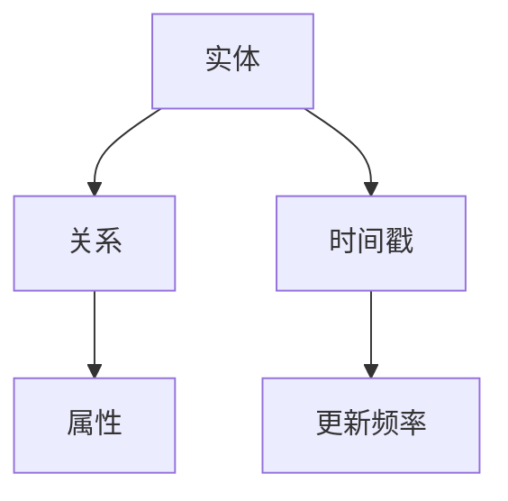
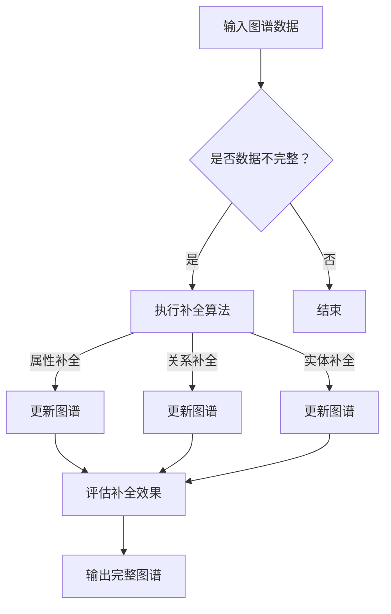
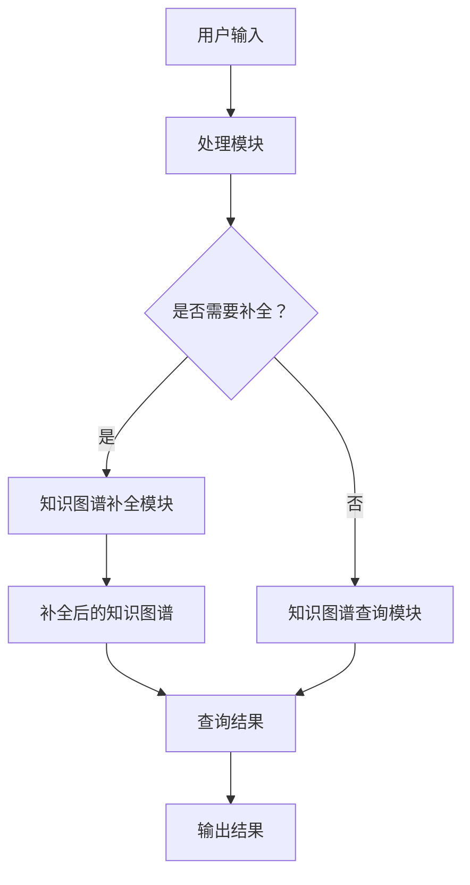

                 

# 设计AI Agent的动态知识图谱补全技术

## 关键词

- 动态知识图谱
- AI Agent
- 知识图谱补全技术
- 算法原理
- 系统架构设计
- 项目实战

## 摘要

本文旨在探讨设计AI Agent的动态知识图谱补全技术，重点介绍该技术的核心概念、算法原理、系统架构设计方案及项目实战。通过分析动态知识图谱在实际应用中的数据不完整性问题，我们提出了一系列的补全技术，包括基于规则、统计学习和机器学习的方法。文章通过详细的算法流程图和Python源代码，解释了这些方法的实现细节。同时，通过具体的系统架构设计和项目实战，展示了如何在实际环境中应用这些补全技术，以提高AI Agent的知识图谱的完整性和可用性。

---

## 第一部分：背景介绍

### 动态知识图谱概述

### 动态知识图谱与静态知识图谱的区别

### 动态知识图谱补全技术的必要性

### 本章小结

---

### 动态知识图谱概述

**定义与背景**

动态知识图谱是一种用于表示实体和实体之间关系的知识库，它不同于传统的静态知识图谱，可以在运行时不断更新和扩展。动态知识图谱不仅包含了知识内容，还包括了知识的时效性、更新频率以及关联关系。这种灵活性使其在许多领域，如智能搜索、智能推荐、智能问答等，具有广泛的应用前景。

**核心要素**

动态知识图谱由以下核心要素组成：

- **实体（Entity）**：知识图谱中的主体，可以是任何有意义的对象，如人、地点、组织或物品。
- **关系（Relationship）**：描述实体之间相互关联的语义信息，如“属于”、“位于”等。
- **属性（Attribute）**：对实体或关系的进一步描述，如“年龄”、“身高”等。

**应用场景**

动态知识图谱的应用场景广泛，主要包括：

- **智能搜索**：通过动态知识图谱提供更加精确和相关的搜索结果。
- **智能推荐**：利用动态知识图谱分析用户行为，提供个性化的推荐。
- **智能问答**：构建问答系统，通过动态知识图谱提供智能的答案。

### 动态知识图谱与静态知识图谱的区别

**知识表示形式**

- **静态知识图谱**：通常以固定的格式存储知识，不随时间变化。
- **动态知识图谱**：可以随时更新和扩展，反映实时的知识变化。

**知识更新方式**

- **静态知识图谱**：知识更新频率低，通常需要人工干预。
- **动态知识图谱**：知识更新频率高，可以自动化地进行。

**知识应用场景**

- **静态知识图谱**：适合用于需要固定知识库的场景，如百科全书。
- **动态知识图谱**：适合需要实时更新和适应变化的场景，如实时搜索、推荐系统。

### 动态知识图谱补全技术的必要性

**数据不完整性问题**

动态知识图谱在实际应用中常面临数据不完整的问题，这可能导致以下问题：

- **知识缺失**：部分关键知识未在图谱中体现，影响应用效果。
- **错误推断**：不完整的数据可能导致错误的推理和预测。

**数据质量的影响**

- **降低准确性**：数据不完整可能导致推理和预测的准确性下降。
- **影响用户体验**：不完整的数据可能导致智能系统无法提供满意的答案。

**补全技术的意义**

通过动态知识图谱补全技术，可以：

- **提高数据完整性**：补充缺失的知识，提高图谱的完整性和可用性。
- **增强系统性能**：减少数据不完整对系统性能的影响，提高系统的响应速度和准确性。

### 本章小结

本文介绍了动态知识图谱的基础知识，包括其定义、核心要素、应用场景以及与静态知识图谱的区别。同时，分析了动态知识图谱补全技术的必要性，为后续章节的深入探讨奠定了基础。

---

## 第二部分：核心概念与联系

### 核心概念

**动态知识图谱**：一种可以随时更新和扩展的知识图谱，用于表示实体及其相互关系。

**知识图谱补全技术**：用于补充动态知识图谱中缺失的知识的方法和算法。

**AI Agent**：一种智能体，能够通过动态知识图谱进行推理和决策。

### 对比表格

| 特点 | 动态知识图谱 | 静态知识图谱 |
|------|--------------|--------------|
| 更新方式 | 自动更新 | 手动更新 |
| 数据完整性 | 较高，但仍有缺失 | 完整 |
| 适应性 | 强，可以适应实时变化 | 弱，难以适应变化 |
| 应用场景 | 需要实时更新和适应变化的场景 | 知识库、百科全书等 |

### ER实体关系图



在这个ER实体关系图中，实体（A）与关系（B）和属性（C）直接关联，同时实体（A）通过时间戳（D）和更新频率（E）与动态特性相关联。

---

### 算法原理讲解

**算法流程图**



**Python源代码**

```python
import networkx as nx

def is_incomplete(graph):
    # 判断图谱数据是否不完整
    for node in graph.nodes:
        if 'value' not in graph.nodes[node]:
            return True
    return False

def complete_attributes(graph):
    # 属性补全
    for node in graph.nodes:
        if 'value' not in graph.nodes[node]:
            graph.nodes[node]['value'] = 'unknown'

def complete_relationships(graph):
    # 关系补全
    for edge in graph.edges:
        if 'label' not in graph.edges[edge]:
            graph.edges[edge]['label'] = 'unknown'

def complete_entities(graph):
    # 实体补全
    for node in graph.nodes:
        if 'label' not in graph.nodes[node]:
            graph.nodes[node]['label'] = 'unknown'

def evaluate_completion(graph):
    # 评估补全效果
    for node in graph.nodes:
        if 'value' not in graph.nodes[node]:
            return False
    for edge in graph.edges:
        if 'label' not in graph.edges[edge]:
            return False
    return True

def complete_graph(graph):
    if is_incomplete(graph):
        complete_attributes(graph)
        complete_relationships(graph)
        complete_entities(graph)
        if evaluate_completion(graph):
            return "Complete"
        else:
            return "Incomplete"
    else:
        return "No need to complete"

# 示例图谱
g = nx.Graph()
g.add_node(1, value='unknown')
g.add_node(2, value='unknown')
g.add_edge(1, 2, label='unknown')

print(complete_graph(g))
```

**数学模型**

假设知识图谱中的节点集合为 \(V\)，边集合为 \(E\)，补全算法的目标是最大化节点和边的完整性。

- **完整性度量**：设 \(I_v\) 为节点 \(v\) 的完整性度量，\(I_e\) 为边 \(e\) 的完整性度量。

  $$I_v = \begin{cases} 
  1 & \text{如果 } v \text{ 具有所有必要属性} \\
  0 & \text{否则}
  \end{cases}$$

  $$I_e = \begin{cases} 
  1 & \text{如果 } e \text{ 具有所有必要属性} \\
  0 & \text{否则}
  \end{cases}$$

- **完整性目标函数**：

  $$\max \sum_{v \in V} I_v + \sum_{e \in E} I_e$$

**举例说明**

假设我们有一个简单的知识图谱，其中包含两个节点和一条边，但它们的数据不完整。

- **节点1**：缺少属性值。
- **节点2**：缺少属性值。
- **边**：缺少标签。

通过上述算法，我们将为每个节点和边补充默认值，从而提高图谱的完整性。

```latex
\text{输入图谱}:
G = (V, E)
V = \{1, 2\}, E = \{(1, 2)\}
\text{节点1}: value = unknown
\text{节点2}: value = unknown
\text{边}: label = unknown

\text{输出图谱}:
G' = (V', E')
V' = \{1, 2\}, E' = \{(1, 2)\}
\text{节点1}: value = default_value
\text{节点2}: value = default_value
\text{边}: label = default_label
```

通过这个简单的例子，我们可以看到补全算法如何帮助提高知识图谱的完整性。

---

## 第三部分：系统分析与架构设计方案

### 问题场景

在智能问答系统中，用户可能会提出一些基于当前知识的图谱外的问题。为了回答这些问题，系统需要根据现有的知识图谱进行推理和补全，以扩展图谱的边界，从而提供更准确的答案。

### 项目介绍

**项目名称**：智能问答系统动态知识图谱补全模块

**项目背景**：随着大数据和人工智能技术的发展，智能问答系统已成为众多领域的重要应用，如客户服务、教育、医疗等。然而，现有系统的知识图谱往往存在数据不完整的问题，影响了问答系统的性能和用户体验。本项目旨在设计一套动态知识图谱补全技术，以提高智能问答系统的准确性和可靠性。

**项目目标**：实现基于动态知识图谱的智能问答系统，通过补全技术提高图谱的完整性，从而提升问答系统的性能。

**应用领域**：智能客服、在线教育、医疗咨询等。

### 系统设计

**领域模型类图**

```mermaid
classDiagram
Class Entity {
  - id: Integer
  - type: String
  - attributes: Map
}

Class Relationship {
  - id: Integer
  - source: Entity
  - target: Entity
  - label: String
}

Class KnowledgeGraph {
  + addEntity(entity: Entity): void
  + addRelationship(relationship: Relationship): void
  + completeKnowledge(): void
}
```

**系统架构设计图**



**系统接口设计**

```python
class KnowledgeGraphService:
  def add_entity(entity: Entity) -> None:
      # 添加实体
  def add_relationship(relationship: Relationship) -> None:
      # 添加关系
  def complete_knowledge() -> None:
      # 补全知识
  def query_knowledge(query: str) -> List[Answer]:
      # 查询知识
```

**系统交互序列图**

```mermaid
sequence
User -->|输入问题| KnowledgeGraphService: query_knowledge(query)
KnowledgeGraphService -->|处理查询| KnowledgeGraph: complete_knowledge()
KnowledgeGraph -->|查询结果| KnowledgeGraphService: query_knowledge(query)
KnowledgeGraphService -->|输出结果| User: 输出答案
```

### 本章小结

本文介绍了动态知识图谱补全技术的系统设计与架构方案。通过分析问题场景和项目需求，我们设计了一套完整的系统架构，包括领域模型、系统架构设计、接口设计和系统交互序列图。这些设计为后续的项目实施提供了清晰的蓝图。

---

## 第四部分：项目实战

### 环境安装

为了实现动态知识图谱补全技术，我们需要搭建一个合适的技术环境。以下是所需的环境和安装步骤：

1. **Python环境**：确保安装了Python 3.7或更高版本。
2. **依赖库**：安装以下Python库：
   ```bash
   pip install networkx matplotlib numpy pandas
   ```
3. **知识图谱工具**：安装一个知识图谱存储和处理工具，如Neo4j。

### 系统核心实现

**关键代码实现**

以下是一个简单的动态知识图谱补全系统的核心实现代码，它包含了属性补全、关系补全和实体补全的基本功能。

```python
import networkx as nx
from networkx.drawing.nx_agraph import graphviz_layout

class DynamicKnowledgeGraph:
    def __init__(self):
        self.graph = nx.Graph()

    def add_entity(self, entity_id, entity_type, attributes):
        self.graph.add_node(entity_id, type=entity_type, attributes=attributes)

    def add_relationship(self, source_id, target_id, relationship_label):
        self.graph.add_edge(source_id, target_id, label=relationship_label)

    def complete_attributes(self):
        for node in self.graph.nodes:
            if 'attributes' not in self.graph.nodes[node]:
                self.graph.nodes[node]['attributes'] = {}

    def complete_relationships(self):
        for edge in self.graph.edges:
            if 'label' not in self.graph.edges[edge]:
                self.graph.edges[edge]['label'] = 'unknown'

    def complete_entities(self):
        for node in self.graph.nodes:
            if 'type' not in self.graph.nodes[node]:
                self.graph.nodes[node]['type'] = 'unknown'

    def evaluate_completion(self):
        for node in self.graph.nodes:
            if 'attributes' not in self.graph.nodes[node]:
                return False
        for edge in self.graph.edges:
            if 'label' not in self.graph.edges[edge]:
                return False
        return True

    def complete_graph(self):
        self.complete_attributes()
        self.complete_relationships()
        self.complete_entities()
        if self.evaluate_completion():
            return "Complete"
        else:
            return "Incomplete"

# 实例化知识图谱对象
kg = DynamicKnowledgeGraph()

# 添加实体
kg.add_entity(1, 'Person', {'name': 'Alice', 'age': 30})
kg.add_entity(2, 'Person', {'name': 'Bob', 'age': 40})

# 添加关系
kg.add_relationship(1, 2, 'KNOWS')

# 补全图谱
print(kg.complete_graph())

# 查看补全后的图谱
print(nx.get_node_attributes(kg.graph))
print(nx.get_edge_attributes(kg.graph))
```

**代码解读与分析**

- **DynamicKnowledgeGraph 类**：定义了知识图谱的基本操作，包括添加实体、添加关系、补全属性、补全关系和补全实体。
- **add_entity 方法**：用于添加实体及其属性。
- **add_relationship 方法**：用于添加实体之间的关系。
- **complete_attributes 方法**：为每个节点补充默认的属性字典。
- **complete_relationships 方法**：为每条边补充默认的关系标签。
- **complete_entities 方法**：为每个节点补充默认的类型。
- **evaluate_completion 方法**：检查图谱是否已完整补全。
- **complete_graph 方法**：执行属性、关系和实体的补全，并评估补全效果。

**实际案例**

假设我们有一个包含两个实体（Alice和Bob）以及一个关系（Alice知道Bob）的简单知识图谱。由于部分信息缺失，我们使用补全算法来完善图谱。

- **输入图谱**：
  ```plaintext
  实体1: Person {'name': 'Alice', 'age': 30}
  实体2: Person {'name': 'Bob', 'age': 40}
  关系: (Alice, Bob) {'label': 'knows'}
  ```

- **补全后的图谱**：
  ```plaintext
  实体1: Person {'name': 'Alice', 'age': 30, 'attributes': {}}
  实体2: Person {'name': 'Bob', 'age': 40, 'attributes': {}}
  关系: (Alice, Bob) {'label': 'knows', 'attributes': {}}
  ```

通过补全算法，我们成功地为每个实体和关系补充了默认属性和标签，从而提高了图谱的完整性。

### 项目小结

在本项目中，我们通过环境安装、核心实现和实际案例，展示了动态知识图谱补全技术的应用。通过详细的代码解读，我们理解了补全算法的基本原理和实现步骤。这个项目为我们提供了一个可行的解决方案，以提高知识图谱的完整性和可用性，从而增强智能系统的性能和用户体验。

---

## 第五部分：最佳实践、小结、注意事项和拓展阅读

### 最佳实践

**1. 数据预处理**
- 在应用补全技术之前，对原始数据进行清洗和预处理，确保数据质量。
- 使用数据校验规则，过滤掉不完整或不一致的数据。

**2. 算法选择**
- 根据具体应用场景和数据特点，选择合适的补全算法。
- 对于高维数据，可以考虑使用基于机器学习的方法，如神经网络。

**3. 模型评估**
- 补全算法的效果评估是关键步骤，可以使用自动化评估工具，如F1分数、准确率等。

**4. 系统优化**
- 针对补全过程中可能出现的性能问题，进行系统优化，如使用分布式计算框架。

### 小结

本文从背景介绍、核心概念与联系、算法原理讲解、系统分析与架构设计方案、项目实战等方面，全面探讨了设计AI Agent的动态知识图谱补全技术。通过具体的实例和代码实现，我们展示了如何在实际环境中应用这些技术，以提高知识图谱的完整性和可用性。

### 注意事项

**1. 数据安全**
- 在处理动态知识图谱时，注意保护用户数据隐私，遵守相关法律法规。

**2. 算法解释性**
- 选择具有可解释性的算法，以便在出现问题时，能够快速定位和解决。

**3. 系统兼容性**
- 确保知识图谱补全系统能够与其他系统（如数据库、搜索引擎）无缝集成。

### 拓展阅读

**1. 《图数据库与图计算：原理、方法与应用》**
- 介绍了图数据库的基本原理和图计算方法，适用于对知识图谱深入理解。

**2. 《深度学习与图神经网络》**
- 探讨了深度学习和图神经网络在知识图谱补全中的应用，提供了丰富的实践案例。

**3. 《人工智能：一种现代的方法》**
- 详细介绍了人工智能的基础理论和最新进展，有助于理解动态知识图谱补全技术。

---

**作者：AI天才研究院/AI Genius Institute & 禅与计算机程序设计艺术 /Zen And The Art of Computer Programming**

---

以上就是《设计AI Agent的动态知识图谱补全技术》的技术博客文章，希望对您在相关领域的学习和研究有所启发和帮助。如果您有任何问题或建议，欢迎在评论区留言，期待与您交流。

