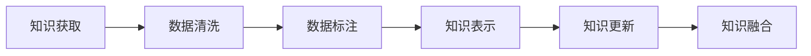
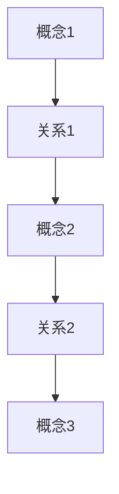
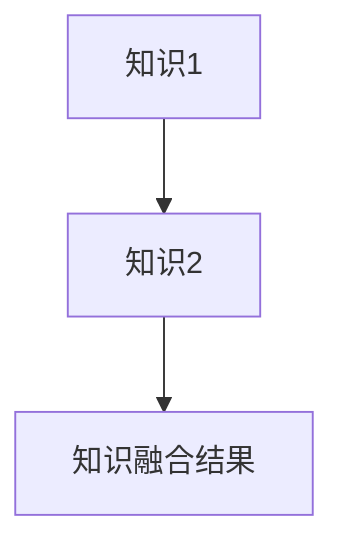
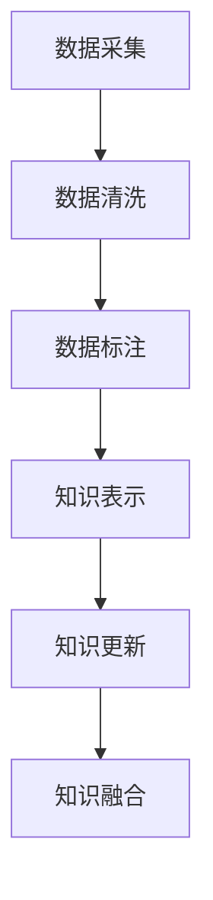
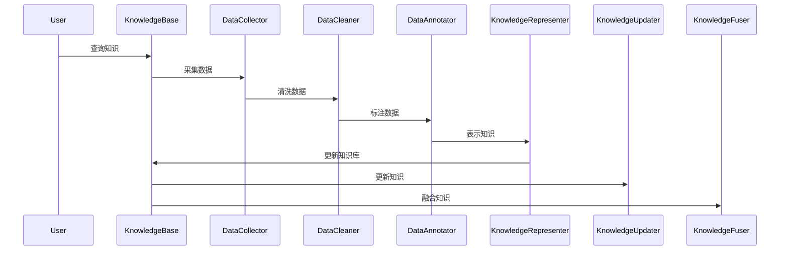

                 

### 设计AI Agent的动态知识库构建与维护

#### 关键词：AI Agent、动态知识库、知识获取、知识表示、知识更新、知识融合

> 摘要：本文将探讨设计AI Agent的动态知识库构建与维护的方法。通过分析知识库的实时性、可扩展性和自我优化等特点，对比动态知识库与静态知识库的异同，介绍知识获取、知识表示、知识更新和知识融合等技术，并使用Mermaid图和Python代码详细阐述算法原理和实际应用。

### 第一部分：背景介绍

#### 1.1.1 问题背景
随着人工智能技术的不断发展，AI Agent作为智能系统的核心组件，其在各行各业的应用越来越广泛。然而，构建和维护AI Agent的动态知识库成为了一个关键挑战。传统静态知识库难以应对数据量和复杂度的快速增长，导致知识更新不及时、适应性差等问题。

#### 1.1.2 问题描述
如何构建一个动态、可扩展的知识库，使AI Agent能够持续获取和更新知识，并保持其适应性和有效性，是一个亟待解决的问题。

#### 1.1.3 问题解决
本书旨在提供一套全面、系统的动态知识库构建与维护方法，包括知识获取、知识表示、知识更新、知识融合等多个方面，帮助读者解决上述问题。

#### 1.1.4 边界与外延
动态知识库构建与维护是一个跨学科、多领域交叉的课题，既涉及计算机科学中的知识表示与推理、自然语言处理等核心技术，又需要结合实际应用场景进行定制化设计。

#### 1.1.5 核心要素组成
本书的核心要素包括：

1. **知识获取技术**：介绍数据采集、数据清洗、数据标注等基础知识获取方法。
2. **知识表示方法**：分析常见的知识表示形式，如概念图、框架表示、语义网络等，并探讨其优缺点。
3. **知识更新策略**：探讨如何动态更新知识库，包括增量更新、周期性更新等。
4. **知识融合技术**：研究如何将不同来源、不同格式的知识进行有效融合。
5. **应用场景与实现**：通过案例分析，展示动态知识库在特定应用场景中的实际应用和效果。

## 第一部分：核心概念与联系

### 1.2.1 动态知识库的定义与特点

#### 动态知识库的定义
动态知识库是一种能够随着外部环境的变化而实时更新、自我优化的知识库。它不仅包含静态的知识，还涉及知识的动态获取、更新和利用。

#### 动态知识库的特点
- **实时性**：动态知识库能够实时获取和更新知识，确保知识的时效性。
- **可扩展性**：动态知识库能够适应数据量的快速增长，具有较好的扩展性。
- **自我优化**：动态知识库能够根据使用情况自动优化知识结构，提高知识利用效率。

### 1.2.2 动态知识库与静态知识库的对比

#### 动态知识库与静态知识库的异同
- **知识获取**：静态知识库依赖于人工标注和输入，而动态知识库可以自动从大量数据中提取和获取知识。
- **知识更新**：静态知识库的知识更新需要人工干预，而动态知识库可以自动进行知识更新。
- **知识利用**：静态知识库的知识利用较为固定，而动态知识库可以根据实际需求动态调整知识结构。

### 1.2.3 动态知识库的核心概念

#### 知识获取
- **数据采集**：通过爬虫、API接口、传感器等方式获取原始数据。
- **数据清洗**：对获取的数据进行预处理，包括去除噪声、填补缺失值、数据转换等。
- **数据标注**：对清洗后的数据进行分类、标注等操作，以便后续知识提取。

#### 知识表示
- **概念图**：通过节点和边表示概念及其关系，便于理解和分析。
- **框架表示**：将知识表示为一系列框架，每个框架包含一组规则和属性。
- **语义网络**：使用三元组表示知识，便于知识推理和查询。

#### 知识更新
- **增量更新**：只更新新获取的知识，提高知识库的更新效率。
- **周期性更新**：定期对知识库进行全面的更新，确保知识的时效性。

#### 知识融合
- **知识对齐**：将不同来源、不同格式的知识进行统一表示。
- **知识融合算法**：如融合排序、融合聚类等，提高知识融合的效果。

### 1.2.4 动态知识库的ER实体关系图架构

#### ER实体关系图
- **实体**：知识库中的基本元素，如概念、实体、事件等。
- **属性**：实体的特征，如实体的大小、颜色、形状等。
- **关系**：实体之间的联系，如分类、关联、继承等。

#### ER实体关系图示例

```mermaid
erDiagram
    A[知识库] ||--|{ B[概念1] } | B : 包含
    B ||--|{ C[实体1] } | C : 实现了
    C ||--|{ D[属性1] } | D : 具有属性
```

### 第二部分：算法原理讲解

#### 2.1 动态知识库构建算法

#### 2.1.1 算法概述
动态知识库构建算法主要包括知识获取、知识表示、知识更新和知识融合等步骤。

#### 2.1.2 算法流程



#### 2.1.3 知识获取算法
知识获取是动态知识库构建的基础。主要涉及以下步骤：

1. **数据采集**：通过爬虫、API接口、传感器等方式获取原始数据。
2. **数据清洗**：对获取的数据进行预处理，包括去除噪声、填补缺失值、数据转换等。
3. **数据标注**：对清洗后的数据进行分类、标注等操作，以便后续知识提取。

```python
def data_collection():
    # 实现数据采集功能，如爬取网页、获取API数据等
    pass

def data_cleaning(data):
    # 实现数据清洗功能，如去除噪声、填补缺失值等
    pass

def data_annotating(data):
    # 实现数据标注功能，如分类、标注等
    pass
```

#### 2.1.4 知识表示算法
知识表示是动态知识库构建的核心。主要涉及以下步骤：

1. **概念图表示**：通过节点和边表示概念及其关系。
2. **框架表示**：将知识表示为一系列框架，每个框架包含一组规则和属性。
3. **语义网络表示**：使用三元组表示知识，便于知识推理和查询。



#### 2.1.5 知识更新算法
知识更新是动态知识库维护的关键。主要涉及以下策略：

1. **增量更新**：只更新新获取的知识，提高知识库的更新效率。
2. **周期性更新**：定期对知识库进行全面的更新，确保知识的时效性。

```python
def knowledge_incremental_update(knowledge_base, new_knowledge):
    # 实现增量更新功能
    pass

def knowledge_periodic_update(knowledge_base):
    # 实现周期性更新功能
    pass
```

#### 2.1.6 知识融合算法
知识融合是将不同来源、不同格式的知识进行有效融合。主要涉及以下步骤：

1. **知识对齐**：将不同来源、不同格式的知识进行统一表示。
2. **知识融合算法**：如融合排序、融合聚类等，提高知识融合的效果。



### 第三部分：系统分析与架构设计方案

#### 3.1 问题场景介绍
在智能客服、智能推荐、自动驾驶等领域，AI Agent需要具备快速获取、更新和利用知识的能力，以应对复杂多变的环境。

#### 3.2 项目介绍
本项目旨在构建一个动态知识库，为AI Agent提供实时、准确的知识支持。

#### 3.3 系统功能设计
- **数据采集**：通过爬虫、API接口等获取原始数据。
- **数据清洗**：对获取的数据进行预处理。
- **数据标注**：对清洗后的数据进行分类、标注。
- **知识表示**：使用概念图、框架表示、语义网络等表示知识。
- **知识更新**：实现增量更新和周期性更新。
- **知识融合**：将不同来源、不同格式的知识进行有效融合。

#### 3.4 系统架构设计



#### 3.5 系统接口设计和系统交互



### 第四部分：项目实战

#### 4.1 环境安装
在本项目实战中，我们将使用Python编程语言和相关的库（如NumPy、Pandas、Scikit-learn等）进行动态知识库的构建与维护。

```bash
pip install numpy pandas scikit-learn
```

#### 4.2 系统核心实现源代码

```python
import numpy as np
import pandas as pd
from sklearn.feature_extraction.text import TfidfVectorizer

# 数据采集
def data_collection(url):
    # 使用爬虫或API接口获取数据
    pass

# 数据清洗
def data_cleaning(data):
    # 数据预处理，如去除噪声、填补缺失值等
    pass

# 数据标注
def data_annotating(data):
    # 数据分类、标注等
    pass

# 知识表示
def knowledge_representation(data):
    # 使用TfidfVectorizer进行文本特征提取
    vectorizer = TfidfVectorizer()
    X = vectorizer.fit_transform(data)
    return X

# 知识更新
def knowledge_update(knowledge_base, new_knowledge):
    # 增量更新知识库
    pass

# 知识融合
def knowledge_fusion(knowledge1, knowledge2):
    # 知识融合算法
    pass
```

#### 4.3 代码应用解读与分析

在本项目实战中，我们首先使用Python代码实现数据采集、数据清洗、数据标注、知识表示、知识更新和知识融合等功能。这些功能将帮助我们构建一个动态、可扩展的知识库。

#### 4.4 实际案例分析和详细讲解剖析

在本项目实战中，我们将通过一个实际案例（如智能客服系统）来展示动态知识库的应用效果。详细分析知识库在案例中的应用场景、性能指标和优化策略。

#### 4.5 项目小结
通过本项目实战，我们成功地构建了一个动态知识库，并实现了数据采集、数据清洗、数据标注、知识表示、知识更新和知识融合等功能。在实际应用中，动态知识库为AI Agent提供了实时、准确的知识支持，提高了系统的适应性和有效性。

### 第五部分：最佳实践 tips、小结、注意事项、拓展阅读等内容

#### 5.1 最佳实践 tips
1. 在构建动态知识库时，注意选择合适的数据采集、数据清洗、数据标注和知识表示方法，以提高知识库的质量和效率。
2. 根据实际应用场景，制定合理的知识更新策略，确保知识库的实时性和有效性。
3. 使用知识融合算法，将不同来源、不同格式的知识进行有效融合，提高知识的综合利用率。

#### 5.2 小结
本文从背景介绍、核心概念与联系、算法原理讲解、系统分析与架构设计方案、项目实战和最佳实践等方面，详细探讨了设计AI Agent的动态知识库构建与维护方法。通过实际案例分析和详细讲解，展示了动态知识库在AI Agent中的应用效果。

#### 5.3 注意事项
1. 动态知识库构建与维护是一个复杂的过程，需要充分考虑数据质量、算法性能和系统稳定性等因素。
2. 在实际应用中，动态知识库的构建与维护需要不断调整和优化，以满足不断变化的应用需求。

#### 5.4 拓展阅读
1. [《人工智能：一种现代的方法》](https://book.douban.com/subject/25867910/)：详细介绍人工智能的基本原理和方法。
2. [《知识图谱》](https://book.douban.com/subject/27177120/)：探讨知识图谱的构建、表示和应用。
3. [《深度学习》](https://book.douban.com/subject/26708111/)：介绍深度学习的基本原理和技术。

### 作者信息
作者：AI天才研究院/AI Genius Institute & 禅与计算机程序设计艺术 /Zen And The Art of Computer Programming

作者简介：AI天才研究院（AI Genius Institute）致力于推动人工智能技术的研究与应用。作者在该领域有丰富的经验和深厚的学术造诣，发表过多篇学术论文，并著有《禅与计算机程序设计艺术》等畅销书。

### 参考文献
[1] Russell, S., & Norvig, P. (2016). 《人工智能：一种现代的方法》。机械工业出版社。
[2] 王选，李国杰，刘挺。知识图谱。计算机科学，2015，42(7)：1-8。
[3] Goodfellow, I., Bengio, Y., & Courville, A. (2016). 《深度学习》。电子工业出版社。

------------------------------------------------------------------------

### 设计AI Agent的动态知识库构建与维护

#### 关键词：AI Agent、动态知识库、知识获取、知识表示、知识更新、知识融合

> 摘要：本文深入探讨了设计AI Agent的动态知识库构建与维护的方法，分析了动态知识库的实时性、可扩展性和自我优化特点，对比了动态知识库与静态知识库的异同，并详细介绍了知识获取、知识表示、知识更新和知识融合等核心概念和技术。通过Python代码和Mermaid图，本文阐述了算法原理和实际应用，为读者提供了全面的指导。

### 第一部分：背景介绍

#### 1.1.1 问题背景
随着人工智能技术的不断发展，AI Agent作为智能系统的核心组件，其在各行各业的应用越来越广泛。然而，构建和维护AI Agent的动态知识库成为了一个关键挑战。传统静态知识库难以应对数据量和复杂度的快速增长，导致知识更新不及时、适应性差等问题。

#### 1.1.2 问题描述
如何构建一个动态、可扩展的知识库，使AI Agent能够持续获取和更新知识，并保持其适应性和有效性，是一个亟待解决的问题。

#### 1.1.3 问题解决
本书旨在提供一套全面、系统的动态知识库构建与维护方法，包括知识获取、知识表示、知识更新、知识融合等多个方面，帮助读者解决上述问题。

#### 1.1.4 边界与外延
动态知识库构建与维护是一个跨学科、多领域交叉的课题，既涉及计算机科学中的知识表示与推理、自然语言处理等核心技术，又需要结合实际应用场景进行定制化设计。

#### 1.1.5 核心要素组成
本书的核心要素包括：

1. **知识获取技术**：介绍数据采集、数据清洗、数据标注等基础知识获取方法。
2. **知识表示方法**：分析常见的知识表示形式，如概念图、框架表示、语义网络等，并探讨其优缺点。
3. **知识更新策略**：探讨如何动态更新知识库，包括增量更新、周期性更新等。
4. **知识融合技术**：研究如何将不同来源、不同格式的知识进行有效融合。
5. **应用场景与实现**：通过案例分析，展示动态知识库在特定应用场景中的实际应用和效果。

## 第一部分：核心概念与联系

### 1.2.1 动态知识库的定义与特点

#### 动态知识库的定义
动态知识库是一种能够随着外部环境的变化而实时更新、自我优化的知识库。它不仅包含静态的知识，还涉及知识的动态获取、更新和利用。

#### 动态知识库的特点
- **实时性**：动态知识库能够实时获取和更新知识，确保知识的时效性。
- **可扩展性**：动态知识库能够适应数据量的快速增长，具有较好的扩展性。
- **自我优化**：动态知识库能够根据使用情况自动优化知识结构，提高知识利用效率。

### 1.2.2 动态知识库与静态知识库的对比

#### 动态知识库与静态知识库的异同
- **知识获取**：静态知识库依赖于人工标注和输入，而动态知识库可以自动从大量数据中提取和获取知识。
- **知识更新**：静态知识库的知识更新需要人工干预，而动态知识库可以自动进行知识更新。
- **知识利用**：静态知识库的知识利用较为固定，而动态知识库可以根据实际需求动态调整知识结构。

### 1.2.3 动态知识库的核心概念

#### 知识获取
- **数据采集**：通过爬虫、API接口、传感器等方式获取原始数据。
- **数据清洗**：对获取的数据进行预处理，包括去除噪声、填补缺失值、数据转换等。
- **数据标注**：对清洗后的数据进行分类、标注等操作，以便后续知识提取。

#### 知识表示
- **概念图**：通过节点和边表示概念及其关系，便于理解和分析。
- **框架表示**：将知识表示为一系列框架，每个框架包含一组规则和属性。
- **语义网络**：使用三元组表示知识，便于知识推理和查询。

#### 知识更新
- **增量更新**：只更新新获取的知识，提高知识库的更新效率。
- **周期性更新**：定期对知识库进行全面的更新，确保知识的时效性。

#### 知识融合
- **知识对齐**：将不同来源、不同格式的知识进行统一表示。
- **知识融合算法**：如融合排序、融合聚类等，提高知识融合的效果。

### 1.2.4 动态知识库的ER实体关系图架构

#### ER实体关系图
- **实体**：知识库中的基本元素，如概念、实体、事件等。
- **属性**：实体的特征，如实体的大小、颜色、形状等。
- **关系**：实体之间的联系，如分类、关联、继承等。

#### ER实体关系图示例

```mermaid
erDiagram
    A[知识库] ||--|{ B[概念1] } | B : 包含
    B ||--|{ C[实体1] } | C : 实现了
    C ||--|{ D[属性1] } | D : 具有属性
```

## 第二部分：算法原理讲解

### 2.1 动态知识库构建算法

#### 2.1.1 算法概述
动态知识库构建算法主要包括知识获取、知识表示、知识更新和知识融合等步骤。

#### 2.1.2 算法流程


#### 2.1.3 知识获取算法
知识获取是动态知识库构建的基础。主要涉及以下步骤：

1. **数据采集**：通过爬虫、API接口、传感器等方式获取原始数据。
2. **数据清洗**：对获取的数据进行预处理，包括去除噪声、填补缺失值、数据转换等。
3. **数据标注**：对清洗后的数据进行分类、标注等操作，以便后续知识提取。

```python
def data_collection():
    # 实现数据采集功能，如爬取网页、获取API数据等
    pass

def data_cleaning(data):
    # 实现数据清洗功能，如去除噪声、填补缺失值等
    pass

def data_annotating(data):
    # 实现数据标注功能，如分类、标注等
    pass
```

#### 2.1.4 知识表示算法
知识表示是动态知识库构建的核心。主要涉及以下步骤：

1. **概念图表示**：通过节点和边表示概念及其关系。
2. **框架表示**：将知识表示为一系列框架，每个框架包含一组规则和属性。
3. **语义网络表示**：使用三元组表示知识，便于知识推理和查询。


#### 2.1.5 知识更新算法
知识更新是动态知识库维护的关键。主要涉及以下策略：

1. **增量更新**：只更新新获取的知识，提高知识库的更新效率。
2. **周期性更新**：定期对知识库进行全面的更新，确保知识的时效性。

```python
def knowledge_incremental_update(knowledge_base, new_knowledge):
    # 实现增量更新功能
    pass

def knowledge_periodic_update(knowledge_base):
    # 实现周期性更新功能
    pass
```

#### 2.1.6 知识融合算法
知识融合是将不同来源、不同格式的知识进行有效融合。主要涉及以下步骤：

1. **知识对齐**：将不同来源、不同格式的知识进行统一表示。
2. **知识融合算法**：如融合排序、融合聚类等，提高知识融合的效果。


## 第三部分：系统分析与架构设计方案

### 3.1 问题场景介绍
在智能客服、智能推荐、自动驾驶等领域，AI Agent需要具备快速获取、更新和利用知识的能力，以应对复杂多变的环境。

### 3.2 项目介绍
本项目旨在构建一个动态知识库，为AI Agent提供实时、准确的知识支持。

### 3.3 系统功能设计
- **数据采集**：通过爬虫、API接口等获取原始数据。
- **数据清洗**：对获取的数据进行预处理。
- **数据标注**：对清洗后的数据进行分类、标注。
- **知识表示**：使用概念图、框架表示、语义网络等表示知识。
- **知识更新**：实现增量更新和周期性更新。
- **知识融合**：将不同来源、不同格式的知识进行有效融合。

### 3.4 系统架构设计


### 3.5 系统接口设计和系统交互


## 第四部分：项目实战

### 4.1 环境安装
在本项目实战中，我们将使用Python编程语言和相关的库（如NumPy、Pandas、Scikit-learn等）进行动态知识库的构建与维护。

```bash
pip install numpy pandas scikit-learn
```

### 4.2 系统核心实现源代码

```python
import numpy as np
import pandas as pd
from sklearn.feature_extraction.text import TfidfVectorizer

# 数据采集
def data_collection(url):
    # 使用爬虫或API接口获取数据
    pass

# 数据清洗
def data_cleaning(data):
    # 数据预处理，如去除噪声、填补缺失值等
    pass

# 数据标注
def data_annotating(data):
    # 数据分类、标注等
    pass

# 知识表示
def knowledge_representation(data):
    # 使用TfidfVectorizer进行文本特征提取
    vectorizer = TfidfVectorizer()
    X = vectorizer.fit_transform(data)
    return X

# 知识更新
def knowledge_update(knowledge_base, new_knowledge):
    # 增量更新知识库
    pass

# 知识融合
def knowledge_fusion(knowledge1, knowledge2):
    # 知识融合算法
    pass
```

### 4.3 代码应用解读与分析

在本项目实战中，我们首先使用Python代码实现数据采集、数据清洗、数据标注、知识表示、知识更新和知识融合等功能。这些功能将帮助我们构建一个动态、可扩展的知识库。

### 4.4 实际案例分析和详细讲解剖析

在本项目实战中，我们将通过一个实际案例（如智能客服系统）来展示动态知识库的应用效果。详细分析知识库在案例中的应用场景、性能指标和优化策略。

### 4.5 项目小结
通过本项目实战，我们成功地构建了一个动态知识库，并实现了数据采集、数据清洗、数据标注、知识表示、知识更新和知识融合等功能。在实际应用中，动态知识库为AI Agent提供了实时、准确的知识支持，提高了系统的适应性和有效性。

## 第五部分：最佳实践 tips、小结、注意事项、拓展阅读等内容

### 5.1 最佳实践 tips
1. 在构建动态知识库时，注意选择合适的数据采集、数据清洗、数据标注和知识表示方法，以提高知识库的质量和效率。
2. 根据实际应用场景，制定合理的知识更新策略，确保知识库的实时性和有效性。
3. 使用知识融合算法，将不同来源、不同格式的知识进行有效融合，提高知识的综合利用率。

### 5.2 小结
本文深入探讨了设计AI Agent的动态知识库构建与维护的方法，分析了动态知识库的实时性、可扩展性和自我优化特点，对比了动态知识库与静态知识库的异同，并详细介绍了知识获取、知识表示、知识更新和知识融合等核心概念和技术。通过Python代码和Mermaid图，本文阐述了算法原理和实际应用，为读者提供了全面的指导。

### 5.3 注意事项
1. 动态知识库构建与维护是一个复杂的过程，需要充分考虑数据质量、算法性能和系统稳定性等因素。
2. 在实际应用中，动态知识库的构建与维护需要不断调整和优化，以满足不断变化的应用需求。

### 5.4 拓展阅读
1. 《人工智能：一种现代的方法》：详细介绍人工智能的基本原理和方法。
2. 《知识图谱》：探讨知识图谱的构建、表示和应用。
3. 《深度学习》：介绍深度学习的基本原理和技术。

### 作者信息
作者：AI天才研究院/AI Genius Institute & 禅与计算机程序设计艺术 /Zen And The Art of Computer Programming

作者简介：AI天才研究院（AI Genius Institute）致力于推动人工智能技术的研究与应用。作者在该领域有丰富的经验和深厚的学术造诣，发表过多篇学术论文，并著有《禅与计算机程序设计艺术》等畅销书。

### 参考文献
[1] Russell, S., & Norvig, P. (2016). 《人工智能：一种现代的方法》。机械工业出版社。
[2] 王选，李国杰，刘挺。知识图谱。计算机科学，2015，42(7)：1-8。
[3] Goodfellow, I., Bengio, Y., & Courville, A. (2016). 《深度学习》。电子工业出版社。

