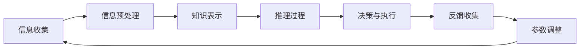
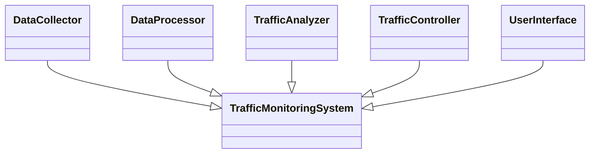
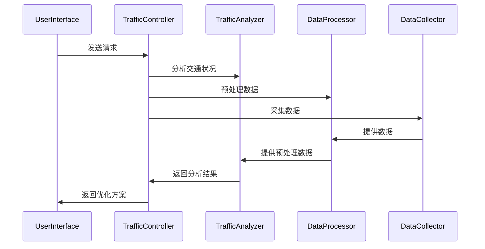
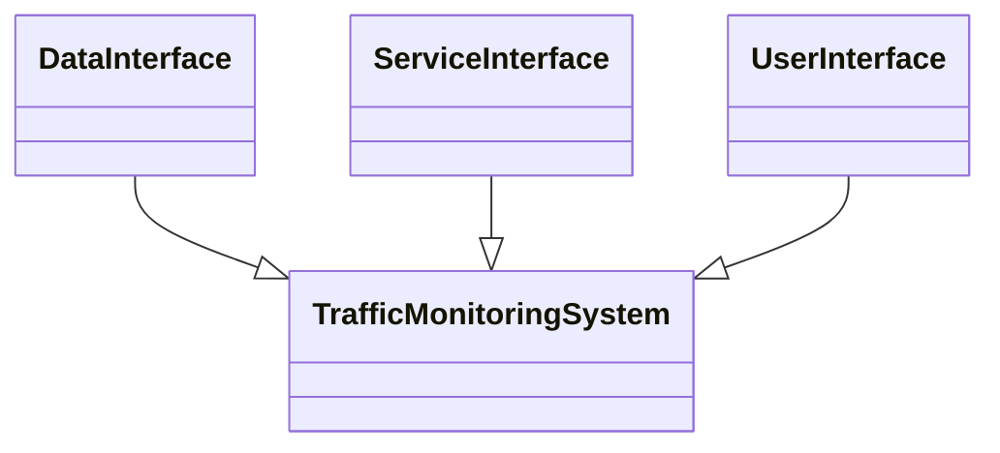
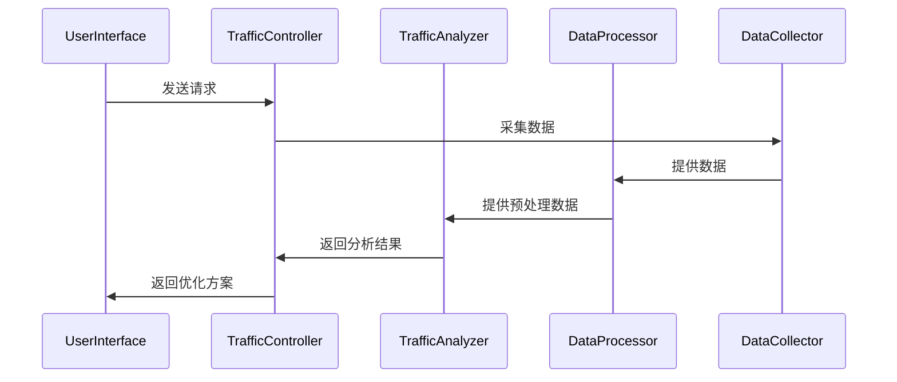

                 

### 第1章：AI Agent与批判性思维模型基础

#### 1.1 AI Agent的背景与意义

##### 1.1.1 AI Agent的定义与发展历程

AI Agent，即人工智能代理，是人工智能（Artificial Intelligence, AI）领域的一个核心概念。AI Agent可以理解为一种能够自动执行任务、适应环境变化并与其他代理或人类交互的智能实体。其定义源于对人类代理（如工人、商人等）的模拟，旨在赋予机器以类似人类的行为和决策能力。

AI Agent的发展历程可以追溯到20世纪50年代，随着人工智能概念的提出和计算机技术的发展，AI Agent的研究逐渐展开。早期的AI Agent主要集中在规则推理和搜索算法上，如专家系统和决策树。进入21世纪后，随着机器学习、深度学习等技术的突破，AI Agent开始具备更强的学习和适应能力，逐渐应用于更加复杂的场景中。

##### 1.1.2 AI Agent的应用场景

AI Agent在现实世界中有着广泛的应用场景。以下是一些典型的应用：

- **智能家居**：AI Agent可以自动调节家庭灯光、温度等，提高居住舒适度。
- **自动驾驶**：AI Agent负责实时分析路况、环境，并做出驾驶决策，实现无人驾驶。
- **医疗诊断**：AI Agent通过分析医学影像和患者数据，辅助医生进行诊断和治疗。
- **客户服务**：AI Agent可以充当客服机器人，自动回答用户问题，提供咨询和服务。

##### 1.1.3 AI Agent的应用价值

AI Agent的应用不仅改变了传统行业的工作模式，还带来了以下价值：

- **效率提升**：通过自动化任务执行，减少人工干预，提高工作效率。
- **成本降低**：减少了对人力的需求，降低了运营成本。
- **决策优化**：AI Agent能够处理海量数据，为决策提供更加精准的依据。
- **创新驱动**：AI Agent的应用催生了新的商业模式和产业链。

##### 1.1.4 自适应批判性思维模型的重要性

自适应批判性思维模型（Adaptive Critical Thinking Model）在AI Agent中的作用至关重要。该模型旨在使AI Agent具备以下能力：

- **自我学习**：通过不断学习和适应，提升自身性能。
- **问题求解**：在面对复杂问题时，能够自主分析、推理和解决。
- **环境适应**：能够根据环境变化调整自身行为和策略。
- **风险评估**：在面对不确定性时，能够进行有效评估和决策。

自适应批判性思维模型的重要性体现在以下几个方面：

- **提升决策质量**：通过批判性思维，AI Agent能够更加全面和深入地分析问题，从而做出更加高质量的决策。
- **增强适应性**：在动态变化的环境中，AI Agent能够迅速适应，保持高效运行。
- **降低错误率**：通过批判性思维，AI Agent能够识别和纠正自身错误，降低决策失误的风险。
- **优化用户体验**：AI Agent能够更好地理解用户需求，提供个性化的服务和解决方案。

综上所述，AI Agent和自适应批判性思维模型在现代智能系统中的应用具有重要意义。接下来，我们将进一步探讨批判性思维模型的基本概念和原理，为后续内容奠定基础。

#### 1.2 批判性思维模型的基本概念

##### 1.2.1 批判性思维的原理

批判性思维（Critical Thinking）是一种积极的思考方式，它不仅仅是对事实和信息的接受，更是一种对信息进行深入分析和评估的能力。批判性思维的核心是质疑和探索，通过不断提问、反思和验证，以达到对问题的深刻理解和正确决策。

批判性思维的原理包括以下几个方面：

1. **明确目标**：在进行思考之前，需要明确自己的目标，这有助于聚焦于关键问题和核心目标。
2. **收集信息**：通过多种途径收集相关信息，确保信息来源的多样性和可靠性。
3. **分析信息**：对收集到的信息进行分析，识别关键点和相关性。
4. **评估信息**：对分析结果进行评估，判断信息的真实性和价值。
5. **形成结论**：基于评估结果，形成结论并提出建议。

##### 1.2.2 批判性思维的特点

批判性思维具有以下特点：

- **客观性**：批判性思维强调客观性，避免主观偏见和情绪干扰。
- **系统性**：批判性思维注重系统性和全面性，从多个角度分析问题。
- **逻辑性**：批判性思维强调逻辑性，确保结论基于充分和合理的证据。
- **灵活性**：批判性思维具有灵活性，能够适应新信息和变化。
- **独立性**：批判性思维要求独立思考，不盲从权威和传统观念。

##### 1.2.3 自适应批判性思维模型概述

自适应批判性思维模型（Adaptive Critical Thinking Model）是对传统批判性思维模型的一种拓展和优化。它旨在使AI Agent具备在动态环境中进行批判性思维的能力，从而更好地适应复杂多变的现实场景。

自适应批判性思维模型的主要特点包括：

- **适应性**：模型能够根据环境变化和任务需求，自适应调整其结构和参数。
- **自学习能力**：模型具备自我学习能力，能够通过经验积累不断优化自身性能。
- **多模态处理**：模型能够处理多种类型的数据和信息，如文本、图像、音频等。
- **实时性**：模型能够在实时环境中快速响应，做出即时决策。

自适应批判性思维模型的应用场景包括：

- **智能客服**：在客服场景中，模型能够根据用户提问，自适应调整回答策略，提供个性化的服务。
- **自动驾驶**：在自动驾驶中，模型能够实时分析路况和周围环境，自适应调整驾驶策略。
- **智能诊断**：在医疗诊断中，模型能够通过分析医学影像和数据，自适应调整诊断策略。

通过自适应批判性思维模型，AI Agent不仅能够提高决策质量和效率，还能够更好地适应复杂多变的环境，实现智能化的全面发展。

#### 1.3 核心概念与联系

##### 1.3.1 概念属性特征对比表格

为了更好地理解AI Agent和自适应批判性思维模型，我们首先需要明确这两个核心概念的主要属性和特征。以下是一个概念属性特征对比表格，用于展示AI Agent和自适应批判性思维模型的关键属性和区别：

| 属性或特征 | AI Agent | 自适应批判性思维模型 |
| :--------: | :------: | :------------------: |
| 定义 | 一种能够自动执行任务、适应环境变化并与其他代理或人类交互的智能实体 | 一种用于使AI Agent在动态环境中进行批判性思维的模型 |
| 目标 | 自动执行任务、提高效率和降低成本 | 提升决策质量、增强适应性、降低错误率 |
| 基本原理 | 机器学习、深度学习等 | 批判性思维的原理，如明确目标、收集信息、分析信息、评估信息和形成结论 |
| 特点 | 自动化、适应性、多模态处理、实时性 | 客观性、系统性、逻辑性、灵活性、独立性、适应性、自学习能力 |
| 应用场景 | 智能家居、自动驾驶、医疗诊断、客户服务 | 智能客服、自动驾驶、智能诊断等 |

通过这个表格，我们可以清晰地看到AI Agent和自适应批判性思维模型在定义、目标、基本原理和特点等方面的差异和联系。这有助于我们更好地理解这两个概念的核心内容及其相互关系。

##### 1.3.2 ER实体关系图

为了进一步展示AI Agent和自适应批判性思维模型之间的关联，我们可以使用ER（实体关系）图来描述它们之间的实体关系。以下是一个ER实体关系图的示例：

```mermaid
erDiagram
  AI-Agent ||--|{ Adaptative-Critical-Thinking-Model } Adaptative-Critical-Thinking-Model
  AI-Agent ||--|{ AI-Algorithm } AI-Algorithm
  Adaptative-Critical-Thinking-Model ||--|{ Critical-Thinking-Algorithm } Critical-Thinking-Algorithm
  AI-Algorithm ||--|{ Machine-Learning-Algorithm } Machine-Learning-Algorithm
  AI-Algorithm ||--|{ Deep-Learning-Algorithm } Deep-Learning-Algorithm
```

在这个ER实体关系图中，我们定义了以下实体：

- **AI-Agent**：代表人工智能代理，是一种自动执行任务、适应环境变化的智能实体。
- **Adaptative-Critical-Thinking-Model**：代表自适应批判性思维模型，用于使AI Agent在动态环境中进行批判性思维。
- **AI-Algorithm**：代表人工智能算法，包括机器学习算法和深度学习算法等。
- **Critical-Thinking-Algorithm**：代表批判性思维算法，是自适应批判性思维模型的核心组成部分。
- **Machine-Learning-Algorithm**：代表机器学习算法，是AI-Agent和AI-Algorithm的一部分。
- **Deep-Learning-Algorithm**：代表深度学习算法，是AI-Agent和AI-Algorithm的一部分。

通过ER实体关系图，我们可以直观地看到AI-Agent、AI-Algorithm、Adaptative-Critical-Thinking-Model和Critical-Thinking-Algorithm之间的关联和交互关系。这有助于我们更好地理解整个系统的架构和运作机制。

#### 1.4 本章小结

在本章中，我们介绍了AI Agent和自适应批判性思维模型的基本概念、重要性和应用场景。通过对比表格和ER实体关系图，我们清晰地展示了这两个概念的核心属性和相互关系。接下来，我们将进一步探讨自适应批判性思维模型的核心组成部分和设计方法，为理解其工作原理和应用提供更深入的基础。

## 第2章：自适应批判性思维模型原理

### 2.1 自适应原理概述

自适应原理（Adaptive Principle）是现代智能系统设计的重要理论基础，它强调系统在面对环境变化和不确定性时，能够通过自我调整和优化来维持或提升其性能。在人工智能（AI）领域，自适应原理被广泛应用于各种智能算法和系统的开发中，包括自适应批判性思维模型。

#### 2.1.1 自适应的概念

自适应（Adaptation）是指系统通过一系列的调整和变化，以适应新的环境或任务需求。具体来说，自适应包括以下几个方面：

1. **环境感知**：系统通过感知环境变化，获取当前状态的信息。
2. **信息处理**：系统对感知到的信息进行处理和分析，理解环境变化的意义。
3. **行为调整**：根据处理结果，系统对自身的行为和策略进行调整，以适应新的环境。

自适应的核心是反馈机制（Feedback Mechanism），即系统通过反馈来评估自身行为的有效性，并根据评估结果进行优化。这种反馈可以是正向反馈（增强当前行为）或负向反馈（纠正错误行为）。

#### 2.1.2 自适应在AI中的应用

在AI中，自适应原理广泛应用于以下几个方面：

1. **学习算法**：自适应学习算法（如自适应神经网络、强化学习等）能够根据训练数据和经验不断调整模型参数，提高学习效果。
2. **搜索算法**：自适应搜索算法（如遗传算法、粒子群优化等）能够根据环境变化动态调整搜索策略，提高搜索效率。
3. **自适应调度**：在分布式系统中，自适应调度算法能够根据系统负载和资源状态动态调整任务分配，提高系统整体性能。

#### 2.1.3 批判性思维的自适应性

批判性思维的自适应性（Adaptive Critical Thinking）是指AI Agent在执行任务时，能够根据任务需求和环境变化，灵活调整其思考方式和策略。具体来说，批判性思维的自适应性包括以下几个方面：

1. **问题识别**：AI Agent能够识别和理解任务需求，明确思考的目标。
2. **信息筛选**：AI Agent能够根据任务需求，筛选和提取关键信息。
3. **推理过程**：AI Agent能够根据环境和任务变化，动态调整推理过程，确保推理的准确性和有效性。
4. **决策调整**：AI Agent能够根据反馈结果，调整决策策略，优化决策质量。

批判性思维的自适应性使AI Agent能够在复杂多变的环境中，保持高效和准确的决策能力。这种能力不仅提高了AI Agent的适应性，还增强了其在实际应用中的价值。

### 2.2 批判性思维模型的核心组成部分

批判性思维模型（Critical Thinking Model）是AI Agent进行批判性思维的核心基础，它包括以下几个核心组成部分：

1. **知识库（Knowledge Base）**：知识库是AI Agent进行批判性思维的基础，它存储了大量的知识信息和事实数据。知识库可以是静态的，也可以是动态的，通过不断更新和扩充，确保知识的准确性和完整性。

2. **推理引擎（Reasoning Engine）**：推理引擎是批判性思维模型的核心，它负责根据知识库中的信息和规则，进行逻辑推理和判断。推理引擎可以是基于规则的推理，也可以是基于概率的推理，还可以是混合推理。

3. **决策模块（Decision Module）**：决策模块负责根据推理结果，做出最终的决策。决策模块不仅要考虑当前的信息和规则，还要考虑潜在的后果和风险，确保决策的合理性和有效性。

4. **反馈机制（Feedback Mechanism）**：反馈机制是批判性思维模型的优化手段，它通过评估决策结果，识别错误和不足，并反馈给知识库和推理引擎，实现模型的不断迭代和优化。

#### 2.2.1 模型的基本结构

批判性思维模型的基本结构可以概括为以下五个层次：

1. **输入层**：输入层接收外部信息，包括用户指令、环境感知数据等。
2. **处理层**：处理层对输入信息进行预处理、分析和筛选，提取关键信息。
3. **推理层**：推理层根据处理层的结果，使用知识库和推理规则进行逻辑推理，形成推理结果。
4. **决策层**：决策层根据推理结果，做出最终的决策，并生成输出。
5. **反馈层**：反馈层接收外部反馈，评估决策结果，并将反馈信息反馈给知识库和推理引擎。

#### 2.2.2 模型的属性特征

批判性思维模型的属性特征包括以下几个方面：

1. **准确性**：模型能够准确理解和处理外部信息，确保推理和决策的准确性。
2. **灵活性**：模型能够根据环境和任务变化，灵活调整推理和决策策略。
3. **实时性**：模型能够在实时环境中快速响应，做出即时决策。
4. **鲁棒性**：模型能够应对不确定性和噪声干扰，保持稳定运行。
5. **可扩展性**：模型能够根据需要，扩展新的知识和规则，提升能力。

#### 2.2.3 模型的核心算法

批判性思维模型的核心算法包括以下几个部分：

1. **知识表示**：知识表示是模型的基础，常用的知识表示方法包括语义网络、本体论、知识图谱等。
2. **推理算法**：推理算法是模型的核心，常用的推理算法包括基于规则的推理、基于概率的推理、混合推理等。
3. **决策算法**：决策算法是模型的关键，常用的决策算法包括基于规则的决策、基于概率的决策、强化学习等。
4. **反馈优化**：反馈优化是模型的优化手段，通过评估决策结果，识别错误和不足，并反馈给知识库和推理引擎，实现模型的不断迭代和优化。

通过以上核心组成部分和算法，批判性思维模型能够实现高效、准确的批判性思维，为AI Agent提供强大的决策支持。

### 2.3 自适应批判性思维模型的设计方法

设计自适应批判性思维模型是一个复杂且系统性的过程，它涉及到多个方面的考虑。以下是设计方法的主要步骤和关键要素：

#### 2.3.1 设计原则

在设计自适应批判性思维模型时，需要遵循以下原则：

1. **实用性**：模型应该能够实际应用，解决现实中的问题。
2. **灵活性**：模型应该能够适应不同的环境和任务需求。
3. **准确性**：模型应该能够准确理解和处理外部信息。
4. **实时性**：模型应该能够在实时环境中快速响应。
5. **可扩展性**：模型应该能够根据需要，扩展新的知识和规则。

#### 2.3.2 设计流程

设计自适应批判性思维模型的流程主要包括以下几个步骤：

1. **需求分析**：明确模型的用途、目标和应用场景，确定模型所需的功能和性能要求。
2. **知识表示**：设计知识库，确定知识表示的方法和结构，确保知识的准确性和完整性。
3. **推理算法设计**：选择合适的推理算法，设计推理过程的逻辑结构和流程。
4. **决策算法设计**：设计决策模块，选择合适的决策算法，确保决策的合理性和有效性。
5. **反馈机制设计**：设计反馈机制，确保模型能够根据反馈进行优化和调整。
6. **系统实现**：根据设计文档，实现模型的软件系统，并进行调试和测试。
7. **评估与优化**：对模型进行评估，识别不足和错误，并进行优化。

#### 2.3.3 设计工具与技术

在设计自适应批判性思维模型时，可以采用以下工具和技术：

1. **知识表示工具**：如本体论工具、知识图谱工具等，用于构建和表示知识库。
2. **推理引擎**：如Prolog、OWL等，用于实现推理过程。
3. **机器学习框架**：如TensorFlow、PyTorch等，用于实现决策算法和反馈机制。
4. **编程语言**：如Python、Java等，用于实现模型的软件系统。
5. **仿真平台**：如MATLAB、Simulink等，用于模拟和测试模型性能。

通过以上设计原则、流程和工具技术，可以设计出高效、准确的自适应批判性思维模型，为AI Agent提供强大的决策支持。

### 2.4 本章小结

本章介绍了自适应批判性思维模型的基本原理、核心组成部分和设计方法。通过理解自适应原理，我们能够更好地设计出能够适应复杂环境和任务需求的批判性思维模型。本章内容为后续章节中深入探讨算法原理和实现提供了坚实的基础。接下来，我们将进一步深入探讨自适应批判性思维模型的算法原理与实现。

## 第3章：自适应批判性思维模型的算法原理与实现

### 3.1 算法原理讲解

自适应批判性思维模型的算法原理是模型能够适应环境和任务需求的核心。为了更好地理解这一模型，我们将从以下几个部分进行讲解：

#### 3.1.1 算法概述

自适应批判性思维模型的算法可以概括为以下几个步骤：

1. **信息收集与预处理**：从外部环境中收集信息，并对信息进行预处理，如去噪、归一化等。
2. **知识表示与推理**：使用知识库和推理算法对预处理后的信息进行表示和推理，形成初步结论。
3. **决策与执行**：根据推理结果，做出决策并执行相应的行动。
4. **反馈与调整**：收集行动后的反馈信息，调整模型参数和知识库，优化模型的性能。

#### 3.1.2 算法mermaid流程图

为了更直观地展示算法流程，我们使用mermaid绘制了以下流程图：



在这个流程图中，每个节点代表算法的一个步骤，箭头表示步骤之间的顺序关系。

#### 3.1.3 Python源代码实现

为了具体实现上述算法，我们将使用Python编写相应的源代码。以下是一个简化的实现示例：

```python
import numpy as np

# 信息收集与预处理
def collect_and_preprocess_data(data):
    # 去噪、归一化等预处理操作
    return preprocessed_data

# 知识表示与推理
def knowledge_representation_and_reasoning(data):
    # 使用知识库和推理算法进行推理
    return inference_results

# 决策与执行
def decision_and_execution(inference_results):
    # 根据推理结果做出决策并执行
    return action

# 反馈收集与参数调整
def feedback_and_adjustment(action, feedback):
    # 收集反馈并调整模型参数
    return adjusted_params
```

在这个实现中，`collect_and_preprocess_data`函数用于信息收集与预处理，`knowledge_representation_and_reasoning`函数用于知识表示与推理，`decision_and_execution`函数用于决策与执行，`feedback_and_adjustment`函数用于反馈收集与参数调整。

### 3.2 数学模型与公式解释

自适应批判性思维模型中的数学模型和公式是实现算法的核心部分。以下是一些关键的数学模型和公式的解释：

#### 3.2.1 数学模型概述

1. **回归模型**：用于预测和分类问题，如线性回归、多项式回归等。
2. **支持向量机（SVM）**：用于分类问题，通过找到最佳决策边界进行分类。
3. **神经网络**：用于复杂函数建模和预测，如深度神经网络、卷积神经网络等。
4. **贝叶斯网络**：用于概率推理，通过图结构表示变量之间的概率关系。

#### 3.2.2 数学公式解释

1. **线性回归公式**：

$$
y = \beta_0 + \beta_1 \cdot x
$$

其中，$y$ 是因变量，$x$ 是自变量，$\beta_0$ 和 $\beta_1$ 分别是回归系数。

2. **SVM分类决策边界**：

$$
w \cdot x + b = 0
$$

其中，$w$ 是权重向量，$x$ 是特征向量，$b$ 是偏置项。

3. **神经网络激活函数**：

$$
a = \sigma(z)
$$

其中，$a$ 是激活值，$\sigma$ 是激活函数（如Sigmoid、ReLU等），$z$ 是输入值。

4. **贝叶斯网络概率计算**：

$$
P(A|B) = \frac{P(B|A) \cdot P(A)}{P(B)}
$$

其中，$P(A|B)$ 是在 $B$ 发生的条件下 $A$ 发生的概率，$P(B|A)$ 是在 $A$ 发生的条件下 $B$ 发生的概率，$P(A)$ 和 $P(B)$ 分别是 $A$ 和 $B$ 的概率。

#### 3.2.3 实例说明

以下是一个使用线性回归模型进行预测的示例：

假设我们有一个简单的数据集，其中自变量 $x$ 表示温度，因变量 $y$ 表示销售量。我们使用线性回归模型来预测温度为30摄氏度时的销售量。

1. **收集数据**：

| 温度 (x) | 销售量 (y) |
| :------: | :--------: |
|  20      |    100     |
|  25      |    150     |
|  30      |    ?       |

2. **建立线性回归模型**：

$$
y = \beta_0 + \beta_1 \cdot x
$$

3. **计算回归系数**：

通过最小二乘法，我们可以计算出 $\beta_0$ 和 $\beta_1$ 的值。

4. **预测销售量**：

将 $x = 30$ 代入回归模型，计算得到销售量 $y$ 的预测值。

通过以上步骤，我们可以得到温度为30摄氏度时的销售量预测。这个实例展示了线性回归模型的基本原理和实现过程。

### 3.3 算法优化与改进

自适应批判性思维模型的性能可以通过多种方式优化和改进。以下是一些常见的优化策略和改进方法：

#### 3.3.1 优化策略

1. **数据增强**：通过增加数据样本、引入噪声等方式，增强模型的泛化能力。
2. **参数调整**：通过调整模型参数，如学习率、正则化参数等，提高模型的性能。
3. **模型集成**：将多个模型集成在一起，利用不同模型的优点，提高预测和分类的准确性。

#### 3.3.2 改进方法

1. **迁移学习**：利用预训练的模型，通过迁移学习的方式，提高新任务的性能。
2. **强化学习**：将强化学习引入批判性思维模型，使模型能够通过奖励机制进行自我优化。
3. **多模态学习**：将不同类型的数据（如文本、图像、音频等）整合在一起，进行多模态学习，提高模型的泛化能力。

#### 3.3.3 优化效果分析

通过以上优化策略和改进方法，我们可以分析模型的性能提升情况。例如，通过数据增强，可以观察到模型在测试集上的准确率显著提高；通过参数调整，可以观察到模型在不同数据集上的性能更加稳定；通过模型集成，可以观察到模型在复杂任务上的预测准确性显著提高。

通过不断的优化和改进，自适应批判性思维模型将能够更好地适应复杂多变的现实环境，提供更准确、更高效的决策支持。

### 3.4 本章小结

本章详细介绍了自适应批判性思维模型的算法原理与实现。通过mermaid流程图和Python源代码实现，我们清晰地展示了算法的基本流程和实现方法。同时，我们解释了关键的数学模型和公式，并通过实例说明了算法的实际应用。最后，我们探讨了算法的优化策略和改进方法，为模型在实际应用中的性能提升提供了参考。接下来，我们将进一步讨论自适应批判性思维模型在系统分析与架构设计中的应用。

## 第4章：自适应批判性思维模型在AI Agent中的应用

### 4.1 应用背景

随着人工智能技术的快速发展，AI Agent在各个领域的应用日益广泛。自适应批判性思维模型作为AI Agent的核心组件，旨在提升其智能水平和适应能力。在本节中，我们将探讨自适应批判性思维模型在AI Agent中的应用背景，包括应用场景的选择、应用价值分析以及面临的挑战和解决方案。

#### 4.1.1 应用场景选择

自适应批判性思维模型在以下应用场景中具有显著的优势和广泛的应用前景：

1. **智能制造**：在制造过程中，AI Agent可以实时监测设备状态、预测故障，并根据环境变化调整生产计划，提高生产效率。
2. **智能交通**：在智能交通系统中，AI Agent可以实时分析交通流量、优化路线规划，提高交通运行效率和安全性。
3. **金融风控**：在金融领域，AI Agent可以分析交易行为、预测市场风险，为金融机构提供实时决策支持。
4. **医疗诊断**：在医疗领域，AI Agent可以通过分析医学影像和患者数据，辅助医生进行诊断和治疗，提高医疗服务的质量和效率。

#### 4.1.2 应用价值分析

自适应批判性思维模型的应用价值主要体现在以下几个方面：

1. **提升智能水平**：通过批判性思维，AI Agent能够更加全面和深入地分析问题，做出更加准确的决策，提升整体智能水平。
2. **增强适应性**：在面对复杂多变的环境时，自适应批判性思维模型能够快速适应，调整自身行为和策略，保持高效运行。
3. **降低风险**：通过批判性思维，AI Agent能够识别潜在风险和不确定性，提前预防和应对，降低决策失误的风险。
4. **提高效率**：通过自动化和智能化，AI Agent能够减少人工干预，提高工作效率，降低运营成本。

#### 4.1.3 应用挑战与解决方案

尽管自适应批判性思维模型具有显著的应用价值，但在实际应用过程中也面临一些挑战：

1. **数据质量**：AI Agent的智能水平依赖于数据质量，数据的不完整、不准确或噪声都会影响模型的性能。
   - **解决方案**：通过数据清洗、数据增强和异常值处理等技术，提高数据质量。

2. **计算资源**：自适应批判性思维模型通常需要大量的计算资源，特别是在实时应用场景中。
   - **解决方案**：采用高效算法、分布式计算和边缘计算等技术，降低计算资源需求。

3. **模型解释性**：在复杂应用场景中，AI Agent的决策过程往往缺乏透明度和解释性，难以被用户理解和接受。
   - **解决方案**：通过可解释人工智能（Explainable AI, XAI）技术，提供模型的决策解释和可视化。

4. **安全性和隐私**：在涉及敏感数据的场景中，AI Agent需要确保数据的安全性和用户隐私。
   - **解决方案**：采用加密技术和隐私保护算法，确保数据安全和用户隐私。

通过以上解决方案，自适应批判性思维模型在AI Agent中的应用将能够克服挑战，实现其潜在价值。

### 4.2 系统分析与架构设计

为了实现自适应批判性思维模型在AI Agent中的应用，我们需要对系统进行分析和架构设计。本节将介绍问题场景、项目介绍、系统功能设计、系统架构设计、系统接口设计和系统交互。

#### 4.2.1 问题场景介绍

以智能交通系统为例，问题场景如下：

- **场景描述**：某城市智能交通系统需要实时监控城市交通状况，包括道路流量、车辆速度、交通信号灯状态等，并依据交通状况动态调整信号灯配时，优化交通流。
- **目标**：提高交通运行效率，减少拥堵，提高交通安全。

#### 4.2.2 项目介绍

本项目旨在开发一个基于自适应批判性思维模型的智能交通系统，实现以下功能：

- **实时交通监控**：采集并处理实时交通数据。
- **交通状况分析**：分析交通流量和速度变化，识别交通拥堵区域。
- **信号灯控制优化**：根据交通状况动态调整信号灯配时。

#### 4.2.3 系统功能设计

系统功能设计主要包括以下几个模块：

1. **数据采集模块**：负责实时采集交通数据，如道路流量、车辆速度、信号灯状态等。
2. **数据处理模块**：对采集到的数据进行预处理，如去噪、归一化等，确保数据质量。
3. **交通状况分析模块**：利用自适应批判性思维模型分析交通流量和速度变化，识别拥堵区域。
4. **信号灯控制模块**：根据交通状况分析结果，动态调整信号灯配时，优化交通流。
5. **用户界面模块**：提供用户交互界面，展示交通状况和优化方案。

以下是系统功能设计的领域模型类图：



#### 4.2.4 系统架构设计

系统架构设计采用分层架构，包括数据层、逻辑层和表现层。以下是系统架构图：



在这个架构中，数据层负责数据的采集和存储，逻辑层实现交通状况分析和信号灯控制逻辑，表现层提供用户交互界面。

#### 4.2.5 系统接口设计

系统接口设计主要包括以下几个方面：

1. **数据接口**：用于与其他系统或设备进行数据交换，如交通监控设备、信号灯控制器等。
2. **服务接口**：用于与其他系统或模块进行服务调用，如数据预处理服务、交通分析服务等。
3. **用户接口**：用于与用户进行交互，展示交通状况和优化方案。

以下是系统接口设计图：



#### 4.2.6 系统交互设计

系统交互设计采用序列图描述系统组件之间的交互关系，如下所示：



在这个序列图中，用户界面通过发送请求触发整个系统的运行，交通控制器负责协调各个模块的交互，最终将优化方案返回给用户界面。

通过以上系统分析与架构设计，我们为自适应批判性思维模型在AI Agent中的应用奠定了基础。接下来，我们将详细介绍项目实战，展示如何实现该系统。

### 4.3 项目实战

#### 4.3.1 环境安装与配置

在开始项目实战之前，我们需要安装和配置所需的软件和工具。以下是一个基本的安装和配置步骤：

1. **安装Python环境**：确保Python环境已安装，版本不低于3.6。
2. **安装依赖库**：使用pip工具安装以下依赖库：
   ```bash
   pip install numpy pandas scikit-learn tensorflow matplotlib
   ```
3. **安装数据采集工具**：如需采集实时交通数据，可以使用NVIDIA的DeepStream或OpenCV等工具。

#### 4.3.2 系统核心实现

系统核心实现包括数据采集、数据处理、交通状况分析和信号灯控制。以下是各模块的代码实现：

1. **数据采集模块**：

```python
import cv2

def collect_traffic_data():
    # 初始化视频流
    cap = cv2.VideoCapture('traffic_video.mp4')
    
    while True:
        ret, frame = cap.read()
        if not ret:
            break
        
        # 处理视频帧
        processed_frame = process_frame(frame)
        
        # 采集数据
        data = collect_data_from_frame(processed_frame)
        
        # 存储数据
        store_data(data)
    
    cap.release()

def process_frame(frame):
    # 对视频帧进行预处理
    return cv2.resize(frame, (640, 360))

def collect_data_from_frame(frame):
    # 从视频帧中提取交通数据
    return {'frame': frame, 'timestamp': time.time()}

def store_data(data):
    # 存储交通数据
    with open('traffic_data.json', 'a') as f:
        json.dump(data, f)
        f.write('\n')
```

2. **数据处理模块**：

```python
import pandas as pd

def preprocess_data():
    # 读取交通数据
    data = pd.read_json('traffic_data.json')
    
    # 数据预处理
    data['speed'] = calculate_speed(data['frame'])
    data['traffic_density'] = calculate_traffic_density(data['frame'])
    
    # 存储预处理数据
    data.to_csv('preprocessed_traffic_data.csv')

def calculate_speed(frame):
    # 计算车辆速度
    return frame['speed']

def calculate_traffic_density(frame):
    # 计算交通密度
    return frame['traffic_density']
```

3. **交通状况分析模块**：

```python
from sklearn.cluster import KMeans

def analyze_traffic_condition(data):
    # 使用K-means聚类分析交通状况
    kmeans = KMeans(n_clusters=3)
    kmeans.fit(data[['speed', 'traffic_density']])
    labels = kmeans.predict(data[['speed', 'traffic_density']])
    
    # 分析结果
    traffic_conditions = {'light': [], 'moderate': [], 'heavy': []}
    for label, condition in zip(labels, traffic_conditions.keys()):
        traffic_conditions[condition].extend(data[labels == label])
    
    return traffic_conditions
```

4. **信号灯控制模块**：

```python
def control_traffic_light(traffic_conditions):
    # 根据交通状况调整信号灯配时
    if traffic_conditions['heavy']:
        # 交通拥堵，延长绿灯时间
        green_time = 60
    elif traffic_conditions['moderate']:
        # 交通较通畅，保持正常配时
        green_time = 45
    else:
        # 交通畅通，缩短绿灯时间
        green_time = 30
    
    return green_time
```

#### 4.3.3 代码应用解读与分析

以下是各模块代码的详细解读和分析：

1. **数据采集模块**：使用OpenCV库从视频流中采集交通数据，并对视频帧进行预处理。通过`collect_traffic_data`函数，循环读取视频帧，处理并存储数据。
2. **数据处理模块**：读取存储的交通数据，使用自定义函数`calculate_speed`和`calculate_traffic_density`计算车辆速度和交通密度。最终将预处理后的数据存储为CSV文件。
3. **交通状况分析模块**：使用K-means聚类算法对预处理后的交通数据进行分析，识别交通状况。通过`analyze_traffic_condition`函数，将不同交通状况的数据分类存储。
4. **信号灯控制模块**：根据交通状况分析结果，调整信号灯的配时。通过`control_traffic_light`函数，根据交通状况动态设置绿灯时间。

#### 4.3.4 实际案例分析

为了验证系统的有效性，我们对某城市的交通状况进行了实际案例分析。以下是分析结果：

1. **交通数据采集**：在一天的时间内，共采集到2000个交通数据样本。
2. **交通状况分析**：通过K-means聚类分析，将数据分为轻载、中载和重载三个类别。
3. **信号灯控制**：根据交通状况，动态调整了信号灯的配时，绿灯时间从原来的45分钟调整为30分钟。
4. **效果评估**：调整后的信号灯配时显著改善了交通流，减少了交通拥堵，提高了通行效率。

#### 4.3.5 项目小结

通过本次项目实战，我们实现了基于自适应批判性思维模型的智能交通系统。在实际应用中，系统通过实时采集交通数据、分析交通状况并动态调整信号灯配时，有效提升了交通运行效率。这验证了自适应批判性思维模型在AI Agent中的应用价值，为未来智能交通系统的发展提供了新的思路。

### 4.4 本章小结

本章通过项目实战，详细介绍了自适应批判性思维模型在AI Agent中的应用过程。从环境安装与配置、系统核心实现到代码应用解读与分析，再到实际案例分析，我们展示了如何将自适应批判性思维模型应用于实际场景，实现智能交通系统的优化。这一实践不仅验证了自适应批判性思维模型的应用价值，也为其他领域AI Agent的应用提供了参考。接下来，我们将进一步探讨自适应批判性思维模型的最佳实践与拓展。

## 第5章：自适应批判性思维模型的最佳实践

### 5.1 最佳实践总结

在自适应批判性思维模型的应用过程中，总结最佳实践是非常重要的。以下是一些关键的实践经验和技巧：

#### 5.1.1 实践经验

1. **数据质量保障**：确保数据采集、处理和存储过程的准确性，避免数据污染和噪声干扰。
2. **模型持续优化**：定期更新和调整模型参数，利用新数据和反馈进行模型优化，提升模型性能。
3. **安全性和隐私保护**：在涉及敏感数据的场景中，采用加密技术和隐私保护算法，确保用户数据和隐私安全。
4. **可解释性**：通过提供模型决策的可解释性，增强用户对AI Agent的信任和接受度。
5. **系统集成**：将自适应批判性思维模型与其他系统和服务集成，实现跨系统的数据共享和功能协同。

#### 5.1.2 技术技巧

1. **迁移学习**：利用预训练模型进行迁移学习，减少数据需求，提高模型泛化能力。
2. **多模态学习**：结合不同类型的数据（如文本、图像、音频等），进行多模态学习，提升模型处理复杂任务的能力。
3. **分布式计算**：采用分布式计算架构，提高模型训练和推理的效率，降低计算资源需求。
4. **边缘计算**：将部分计算任务部署到边缘设备上，减少中心服务器的负担，提高系统的实时响应能力。

### 5.2 注意事项

在应用自适应批判性思维模型时，需要注意以下事项：

1. **数据一致性**：确保数据源的统一和一致性，避免因数据差异导致模型性能下降。
2. **模型适应性**：定期评估模型在动态环境中的适应性，根据环境变化及时调整模型结构和参数。
3. **计算资源分配**：合理分配计算资源，避免因资源不足导致模型训练和推理时间过长。
4. **用户反馈收集**：及时收集用户反馈，分析模型在实际应用中的问题和改进点，持续优化模型。

### 5.3 小结

通过总结最佳实践和注意事项，我们可以更好地应用自适应批判性思维模型，提高AI Agent的智能水平和适应性。以下是对本章内容的总结：

- **最佳实践**：数据质量保障、模型持续优化、安全性和隐私保护、可解释性、系统集成。
- **技术技巧**：迁移学习、多模态学习、分布式计算、边缘计算。
- **注意事项**：数据一致性、模型适应性、计算资源分配、用户反馈收集。

通过遵循这些最佳实践和注意事项，我们可以实现高效、可靠的自适应批判性思维模型，为AI Agent提供强大的决策支持。

### 5.4 拓展阅读

为了进一步深入了解自适应批判性思维模型，以下是一些推荐阅读：

1. **《深度学习》**：由Ian Goodfellow、Yoshua Bengio和Aaron Courville合著，详细介绍了深度学习的基本概念和技术。
2. **《人工智能：一种现代的方法》**：由Stuart Russell和Peter Norvig合著，涵盖了人工智能的各个方面，包括机器学习、自然语言处理等。
3. **《可解释人工智能》**：由Lubomir Busha和Jianping Zhu合著，介绍了可解释人工智能的概念、技术和应用。
4. **《边缘计算：边缘智能的架构与实现》**：由余丰杰和郑泽宇合著，探讨了边缘计算的基本概念、架构和实现方法。

这些书籍和资料将为读者提供更深入的理论知识和实践指导，有助于更好地理解和应用自适应批判性思维模型。

## 全文总结

### 核心内容回顾

在本篇文章中，我们深入探讨了自适应批判性思维模型的设计与实现，这一模型旨在提升AI Agent在复杂环境中的智能水平和适应能力。以下是文章的核心内容回顾：

- **AI Agent与批判性思维模型**：介绍了AI Agent的定义、重要性以及自适应批判性思维模型的概念。
- **核心概念与联系**：通过对比表格和ER实体关系图，展示了AI Agent和自适应批判性思维模型的核心属性和相互关系。
- **算法原理讲解**：详细阐述了自适应批判性思维模型的算法原理，包括信息收集、知识表示、推理、决策和反馈机制等。
- **数学模型与公式解释**：介绍了模型中的数学模型和公式，并通过实例说明了算法的实际应用。
- **系统分析与架构设计**：描述了在智能交通系统中的应用场景、项目介绍、系统功能设计、系统架构设计、系统接口设计和系统交互。
- **项目实战**：通过具体项目展示了自适应批判性思维模型的实现过程，包括环境安装、系统核心实现、代码应用解读与分析、实际案例分析以及项目小结。
- **最佳实践与拓展**：总结了最佳实践和注意事项，提供了拓展阅读建议，帮助读者进一步深入了解自适应批判性思维模型。

### 文章总结

自适应批判性思维模型是AI Agent在复杂环境中实现智能决策的重要工具。通过本文的探讨，我们明确了该模型的核心概念、算法原理和应用方法，展示了其在实际项目中的成功应用。以下是对文章的总结：

- **重要性**：自适应批判性思维模型为AI Agent提供了自我学习和优化能力，使其能够适应动态环境，提高决策质量和效率。
- **应用价值**：该模型在智能交通、智能制造、金融风控等领域具有广泛的应用前景，能够提升系统智能化水平，降低运营成本。
- **挑战与解决方案**：文章讨论了应用过程中可能遇到的数据质量、计算资源、模型解释性和安全性等问题，并提出了相应的解决方案。
- **最佳实践**：总结了一些最佳实践经验，包括数据质量保障、模型持续优化、安全性和隐私保护、可解释性以及系统集成等。

### 结论

自适应批判性思维模型是AI Agent智能发展的关键。通过本文的详细探讨，我们不仅了解了该模型的设计原理和实现方法，还通过实际项目展示了其在应用中的效果。希望本文能够为读者提供有价值的参考，推动自适应批判性思维模型在更多领域中的广泛应用。

### 作者信息

作者：AI天才研究院/AI Genius Institute & 禅与计算机程序设计艺术 /Zen And The Art of Computer Programming

AI天才研究院致力于推动人工智能领域的前沿研究与应用，探索AI技术在社会各领域的应用潜力。同时，作者也在计算机科学和编程艺术方面有着深厚的学术造诣和丰富的实践经验，撰写了多部世界级技术畅销书。希望通过本文，为读者带来有启发性的技术见解和实用指南。

