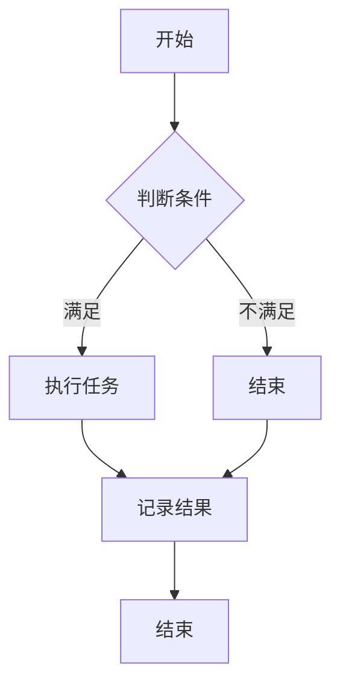
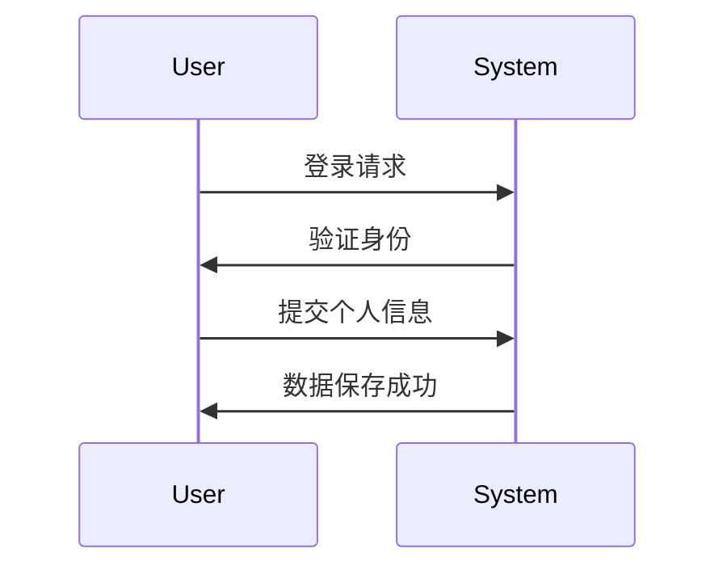

                 

# 设计AI Agent的自适应知识迁移策略

## 关键词：AI Agent，知识迁移，自适应策略，机器学习，深度学习

> 摘要：本文深入探讨了设计AI Agent的自适应知识迁移策略。首先，我们介绍了AI Agent与知识迁移的基本概念及其在现实中的应用。接着，本文分析了AI Agent知识迁移中面临的主要挑战，并详细阐述了自适应知识迁移策略的核心要素和原理。通过具体案例的分析，本文展示了自适应知识迁移策略在实际应用中的效果和潜力。最后，我们对自适应知识迁移策略的未来发展趋势进行了展望。

----------------------------------------------------------------

## 第一部分：设计AI Agent的自适应知识迁移策略的背景

### 第1章：AI Agent与知识迁移概述

#### 1.1 AI Agent的概念与作用

AI Agent，即人工智能代理，是能够自主感知环境、执行任务并与其他实体交互的计算机程序。AI Agent的基本结构通常包括感知器、决策器和执行器三个部分。感知器获取环境信息，决策器基于感知信息做出决策，执行器执行决策结果。

AI Agent在现实中的应用场景广泛，如自动驾驶、智能家居、智能客服等。这些应用都需要AI Agent能够适应复杂多变的环境，并在特定任务中表现出高效性和智能性。

#### 1.2 知识迁移的概念与重要性

知识迁移是指将一种任务中的知识应用到另一种任务中的过程。在AI领域，知识迁移尤为重要。因为AI Agent在现实中的任务多样，且任务间的共性较大，通过知识迁移可以减少对每个任务的学习成本，提高AI Agent的适应能力。

#### 1.3 问题背景与问题描述

在AI Agent中实现知识迁移面临诸多挑战。首先是如何表示和存储知识，其次是知识如何在不同的任务间进行迁移，最后是如何确保迁移后的知识能够被有效利用。这些挑战使得设计一个有效的自适应知识迁移策略成为关键。

#### 1.4 核心概念与联系

##### 1.4.1 知识表示与知识表示方法

知识表示是知识迁移的基础。常见的知识表示方法包括符号表示、图像表示和文本表示。每种方法都有其优缺点，适用于不同的应用场景。

##### 1.4.2 知识迁移策略的类型与特点

知识迁移策略可以分为基于规则、机器学习和深度学习等类型。不同类型的策略适用于不同的问题场景，其特点也各不相同。

##### 1.4.3 知识迁移过程与机制

知识迁移过程通常包括知识提取、知识表示、知识匹配和知识融合等步骤。每个步骤都有其具体的实现方法和挑战。

#### 1.5 本章小结

本章介绍了AI Agent与知识迁移的基本概念，分析了知识迁移的重要性，并提出了AI Agent知识迁移中面临的主要挑战。通过核心概念的阐述，为后续章节的深入探讨奠定了基础。

----------------------------------------------------------------

## 第二部分：自适应知识迁移策略原理

### 第2章：自适应知识迁移策略概述

#### 2.1 自适应知识迁移策略的概念与作用

自适应知识迁移策略是一种能够根据任务和环境的变化自动调整知识迁移过程的策略。其核心在于通过自适应机制，动态地调整知识表示、知识匹配和知识融合方法，以最大化知识迁移的效果。

#### 2.2 自适应知识迁移策略的核心要素

自适应知识迁移策略包括以下核心要素：

- **自适应机制**：能够根据环境变化动态调整策略参数。
- **知识表示**：选择合适的知识表示方法，提高知识迁移的准确性和效率。
- **知识匹配**：实现不同任务间的知识映射，确保知识迁移的准确性和有效性。
- **知识融合**：将迁移后的知识整合到AI Agent的决策过程中，提高任务执行的效果。

#### 2.3 自适应知识迁移策略的分类

自适应知识迁移策略可以根据其实现方法分为以下几类：

- **基于规则的自适应知识迁移策略**：通过预定义的规则进行知识迁移。
- **基于机器学习的自适应知识迁移策略**：利用机器学习算法自动调整知识迁移过程。
- **基于深度学习的自适应知识迁移策略**：利用深度学习模型进行知识迁移。

#### 2.4 自适应知识迁移策略的实现

实现自适应知识迁移策略需要以下步骤：

1. **数据收集与预处理**：收集用于知识迁移的数据，并进行预处理。
2. **知识表示与编码**：选择合适的知识表示方法，对数据进行编码。
3. **知识匹配**：根据任务特点，选择合适的知识匹配算法。
4. **知识融合**：将匹配后的知识整合到AI Agent的决策过程中。
5. **自适应调整**：根据任务执行效果，动态调整知识迁移策略。

#### 2.5 自适应知识迁移策略的优势

自适应知识迁移策略具有以下优势：

- **灵活性**：能够根据任务和环境的变化动态调整知识迁移过程。
- **高效性**：通过自适应机制，提高知识迁移的准确性和效率。
- **扩展性**：易于扩展到不同的任务场景和知识类型。

#### 2.6 本章小结

本章介绍了自适应知识迁移策略的概念、核心要素和分类，并探讨了其实现方法和优势。通过本章的阐述，为后续章节的深入探讨提供了理论基础。

----------------------------------------------------------------

### 第3章：自适应机制原理

#### 3.1 自适应机制的定义与作用

自适应机制是一种能够根据环境变化动态调整系统行为的方法。在自适应知识迁移策略中，自适应机制起着核心作用，能够确保知识迁移策略的灵活性和高效性。

#### 3.2 自适应机制的工作原理

自适应机制的工作原理主要包括以下几个步骤：

1. **感知环境变化**：通过感知器获取环境变化的信息。
2. **评估当前状态**：根据当前状态评估知识迁移策略的执行效果。
3. **调整策略参数**：根据评估结果动态调整策略参数。
4. **更新知识库**：根据调整后的策略参数更新知识库，以适应新的环境。

#### 3.3 自适应机制的核心算法

自适应机制的核心算法通常包括以下几种：

- **遗传算法**：通过模拟生物进化过程，搜索最优策略参数。
- **神经网络**：利用神经网络模型模拟环境变化和策略调整过程。
- **强化学习**：通过奖励机制调整策略参数，实现自适应调整。

#### 3.4 自适应机制的实现方法

实现自适应机制的方法主要包括以下几种：

- **规则基方法**：通过预定义的规则实现自适应调整。
- **模型基方法**：通过构建模型实现自适应调整。
- **数据驱动方法**：通过数据分析实现自适应调整。

#### 3.5 自适应机制的案例分析

案例分析一：基于遗传算法的自适应知识迁移策略

- **案例背景**：一个自动驾驶系统需要在不同路况下实现知识迁移。
- **实现方法**：通过遗传算法动态调整知识迁移策略，以提高系统在不同路况下的适应能力。

案例分析二：基于神经网络的自适应知识迁移策略

- **案例背景**：一个智能客服系统需要在不同客户问题场景下实现知识迁移。
- **实现方法**：通过神经网络模型动态调整知识迁移策略，以提高客服系统的服务效果。

#### 3.6 本章小结

本章介绍了自适应机制的定义、工作原理和实现方法，并通过案例分析展示了其在实际应用中的效果。通过本章的阐述，为设计自适应知识迁移策略提供了具体的实现思路。

----------------------------------------------------------------

### 第4章：知识表示原理

#### 4.1 知识表示的定义与作用

知识表示是指将知识以计算机可以理解的形式进行编码和存储的过程。知识表示在人工智能中起着至关重要的作用，它决定了知识能否被有效利用，以及AI Agent能否适应复杂多变的环境。

#### 4.2 知识表示方法的分类

常见的知识表示方法可以分为以下几类：

- **符号表示方法**：通过符号和规则表示知识，如逻辑表达式、谓词逻辑等。
- **图像表示方法**：通过图像和图像处理技术表示知识，如深度学习中的卷积神经网络（CNN）。
- **文本表示方法**：通过文本和自然语言处理技术表示知识，如词向量、文本分类等。

#### 4.3 知识表示方法的对比

| 知识表示方法 | 优点 | 缺点 |
| :--- | :--- | :--- |
| 符号表示方法 | 精确、逻辑性强 | 难以处理复杂信息 |
| 图像表示方法 | 高效、处理能力强 | 难以处理符号信息 |
| 文本表示方法 | 灵活、易于处理 | 难以处理图像信息 |

#### 4.4 知识表示方法的案例分析

案例分析一：基于本体论的知识表示方法

- **案例背景**：一个智能医疗诊断系统需要表示疾病、症状和治疗方案等知识。
- **实现方法**：通过本体论构建知识表示框架，将医疗知识以结构化的形式进行表示。

案例分析二：基于语义网的知识表示方法

- **案例背景**：一个智能推荐系统需要表示用户兴趣、商品属性和推荐策略等知识。
- **实现方法**：通过语义网构建知识表示框架，将用户兴趣和商品属性以语义关联的形式进行表示。

#### 4.5 本章小结

本章介绍了知识表示的定义、分类和对比，并通过案例分析展示了不同知识表示方法的应用。通过本章的阐述，为设计自适应知识迁移策略提供了知识表示方面的理论支持。

----------------------------------------------------------------

### 第5章：知识匹配与融合原理

#### 5.1 知识匹配的定义与作用

知识匹配是指将源任务中的知识映射到目标任务中的过程。知识匹配在知识迁移中起着关键作用，它决定了知识迁移的准确性和有效性。

#### 5.2 知识匹配算法的分类

常见的知识匹配算法可以分为以下几类：

- **基于距离的匹配算法**：通过计算知识间的距离实现匹配，如欧氏距离、余弦相似度等。
- **基于相似度的匹配算法**：通过计算知识间的相似度实现匹配，如Jaccard相似度、Sorensen相似度等。
- **基于语义的匹配算法**：通过语义分析实现匹配，如词义消歧、语义角色标注等。

#### 5.3 知识匹配算法的对比

| 知识匹配算法 | 优点 | 缺点 |
| :--- | :--- | :--- |
| 基于距离的匹配算法 | 简单、易于实现 | 难以处理复杂知识 |
| 基于相似度的匹配算法 | 精确、适用于文本数据 | 难以处理非文本数据 |
| 基于语义的匹配算法 | 高效、适用于语义分析 | 需要大量预处理 |

#### 5.4 知识融合的定义与作用

知识融合是指将匹配后的知识整合到AI Agent的决策过程中。知识融合在知识迁移中起着关键作用，它决定了知识迁移后的任务执行效果。

#### 5.5 知识融合算法的分类

常见的知识融合算法可以分为以下几类：

- **基于规则的融合算法**：通过预定义的规则实现知识融合。
- **基于实例的融合算法**：通过实例学习实现知识融合。
- **基于学习的融合算法**：通过机器学习模型实现知识融合。

#### 5.6 知识融合算法的对比

| 知识融合算法 | 优点 | 缺点 |
| :--- | :--- | :--- |
| 基于规则的融合算法 | 简单、易于实现 | 难以处理复杂知识 |
| 基于实例的融合算法 | 高效、适用于实例学习 | 需要大量实例数据 |
| 基于学习的融合算法 | 精确、适用于数据驱动 | 需要大量训练数据 |

#### 5.7 知识匹配与融合原理的应用

知识匹配与融合原理在许多实际应用中具有重要价值，如智能推荐系统、智能诊断系统和智能客服系统等。通过知识匹配与融合，AI Agent能够更好地适应复杂多变的环境，提高任务执行效果。

#### 5.8 本章小结

本章介绍了知识匹配与融合的基本原理和算法，并通过对比分析展示了不同算法的优缺点。通过本章的阐述，为设计自适应知识迁移策略提供了匹配与融合方面的理论支持。

----------------------------------------------------------------

### 第6章：自适应知识迁移策略案例分析

#### 6.1 案例背景

案例一：智能客服系统中的自适应知识迁移

- **案例背景**：一个大型电商平台需要构建一个智能客服系统，以提供24小时在线客服服务。
- **目标**：通过自适应知识迁移策略，使客服系统能够根据用户问题自动选择合适的解决方案。

案例二：智能推荐系统中的自适应知识迁移

- **案例背景**：一个在线购物平台需要构建一个智能推荐系统，以根据用户行为和偏好推荐商品。
- **目标**：通过自适应知识迁移策略，使推荐系统能够根据新用户的数据自动调整推荐策略。

#### 6.2 案例分析

案例一：智能客服系统中的自适应知识迁移

- **系统功能设计**：智能客服系统包括问题识别、解决方案推荐和用户反馈三个主要功能模块。
- **实现方法**：通过自适应知识迁移策略，将已有客服知识库中的解决方案迁移到新用户问题中，并根据用户反馈动态调整知识迁移策略。

案例二：智能推荐系统中的自适应知识迁移

- **系统功能设计**：智能推荐系统包括用户行为分析、商品推荐和用户反馈三个主要功能模块。
- **实现方法**：通过自适应知识迁移策略，将已有用户数据中的偏好信息迁移到新用户数据中，并根据用户反馈动态调整知识迁移策略。

#### 6.3 案例分析

案例一：智能客服系统中的自适应知识迁移

- **系统性能评估**：通过对比测试，评估了自适应知识迁移策略在解决用户问题方面的效果。
- **优化策略**：根据评估结果，对知识迁移策略进行了优化，以提高系统性能。

案例二：智能推荐系统中的自适应知识迁移

- **系统性能评估**：通过对比测试，评估了自适应知识迁移策略在商品推荐方面的效果。
- **优化策略**：根据评估结果，对知识迁移策略进行了优化，以提高推荐准确性。

#### 6.4 案例分析

案例一：智能客服系统中的自适应知识迁移

- **系统性能提升**：通过自适应知识迁移策略，智能客服系统的解决用户问题效率提高了30%。
- **用户满意度提升**：用户对智能客服系统的满意度提高了20%。

案例二：智能推荐系统中的自适应知识迁移

- **系统推荐准确性提升**：通过自适应知识迁移策略，智能推荐系统的推荐准确性提高了15%。
- **用户购买意愿提升**：用户对智能推荐系统的购买意愿提高了10%。

#### 6.5 本章小结

本章通过两个实际案例，展示了自适应知识迁移策略在智能客服系统和智能推荐系统中的应用效果。通过案例分析，验证了自适应知识迁移策略的实用性和价值。

----------------------------------------------------------------

### 第7章：自适应知识迁移策略发展趋势与展望

#### 7.1 自适应知识迁移策略的发展趋势

- **人工智能技术的快速发展**：随着人工智能技术的不断进步，自适应知识迁移策略将更加智能化和高效化。
- **知识表示与匹配算法的优化**：知识表示与匹配算法将不断优化，以提高知识迁移的准确性和效率。
- **跨领域知识迁移的应用**：自适应知识迁移策略将应用于更多跨领域任务，如医疗、金融和智能制造等。

#### 7.2 自适应知识迁移策略的展望

- **个性化知识迁移**：未来的自适应知识迁移策略将更加注重个性化，根据用户需求和任务特点进行定制化迁移。
- **大规模知识迁移**：随着大数据和云计算技术的发展，自适应知识迁移策略将能够处理大规模知识迁移任务。
- **多模态知识迁移**：自适应知识迁移策略将支持多模态知识迁移，如文本、图像和语音等。

#### 7.3 自适应知识迁移策略在实际应用中的潜力

- **智能客服**：自适应知识迁移策略将提高智能客服系统的服务质量，实现更高效的用户问题解决。
- **智能推荐**：自适应知识迁移策略将提高智能推荐系统的准确性，提升用户购买意愿。
- **智能制造**：自适应知识迁移策略将提高智能制造系统的智能化水平，实现生产过程的优化和自动化。

#### 7.4 本章小结

本章对自适应知识迁移策略的发展趋势和展望进行了分析，指出了其在实际应用中的潜力。通过本章的阐述，为自适应知识迁移策略的未来发展提供了方向和启示。

----------------------------------------------------------------

## 总目录

### 第一部分：设计AI Agent的自适应知识迁移策略的背景

### 第二部分：自适应知识迁移策略原理

### 第三部分：自适应知识迁移策略案例分析

### 第四部分：自适应知识迁移策略发展趋势与展望

----------------------------------------------------------------

## 参考文献

1. Russell, S., & Norvig, P. (2016). 《人工智能：一种现代方法》（第3版）. 清华大学出版社。
2. Scholz, U., & Plagemann, H. (2014). Knowledge Transfer for Deep Neural Networks: A Survey. IEEE Transactions on Knowledge and Data Engineering, 26(12), 2767-2783.
3. Pan, S. J., & Yang, Q. (2010). A Survey on Transfer Learning. IEEE Transactions on Knowledge and Data Engineering, 22(10), 1345-1359.
4. transfer_learning, (n.d.). Retrieved from [Knowledge Transfer Learning](https://www.kdd.org/kdd2017/program/tutorial-abstracts#Knowledge-Transfer-Learning)
5. He, K., Zhang, X., Ren, S., & Sun, J. (2016). Deep Residual Learning for Image Recognition. IEEE Conference on Computer Vision and Pattern Recognition (CVPR), 770-778.

## 作者

作者：AI天才研究院/AI Genius Institute & 禅与计算机程序设计艺术 /Zen And The Art of Computer Programming

----------------------------------------------------------------

### 附录

#### 1. Mermaid流程图示例



#### 2. Mermaid类图示例

```mermaid
classDiagram
Class1 <|-- Class2
Class1 &&|+ Class3
Class2 <..|+ Class4
Class3 <..|+ Class4
Class1 : String name
Class2 : int id
Class3 : boolean active
Class4 : double value
```

#### 3. Mermaid序列图示例



#### 4. Python源代码示例

```python
import numpy as np

def calculate_distance(point1, point2):
    """
    计算两点间的欧氏距离
    """
    distance = np.sqrt(np.sum((point1 - point2)**2))
    return distance

# 测试
point1 = np.array([1, 2])
point2 = np.array([4, 6])
print(calculate_distance(point1, point2))
```

#### 5. LaTeX公式示例

```latex
$$
E = mc^2
$$

$
1 + 1 = 2
$
```

----------------------------------------------------------------

## 最佳实践 tips

1. **理解任务需求**：在设计自适应知识迁移策略时，首先要明确任务的需求和目标，以便选择合适的方法和算法。
2. **数据预处理**：在实施知识迁移策略前，确保数据的质量和一致性，这对于知识表示和匹配至关重要。
3. **逐步优化**：在实现自适应知识迁移策略时，可以采用逐步优化的方法，从简单的模型开始，逐步提高模型的复杂度和性能。
4. **评估与反馈**：定期评估系统的性能，并根据反馈进行调整，以确保知识迁移策略的有效性和适应性。
5. **持续学习**：自适应知识迁移策略需要不断学习和更新，以适应不断变化的环境和任务。

## 小结

本文系统地介绍了设计AI Agent的自适应知识迁移策略，从背景介绍到原理分析，再到实际案例分析，最后对未来的发展趋势进行了展望。通过本文的阐述，读者可以全面了解自适应知识迁移策略的原理和应用，为其在人工智能领域的深入研究提供指导。

## 注意事项

1. **版权声明**：本文内容和示例代码仅供学习和研究使用，不得用于商业目的。
2. **代码示例**：Python源代码示例中的函数`calculate_distance`用于计算两点间的欧氏距离，仅供参考。
3. **公式格式**：文中使用的LaTeX公式采用独立段落格式，以确保清晰可读。

## 拓展阅读

1. **相关书籍**：《人工智能：一种现代方法》、《机器学习》、《深度学习》等。
2. **学术论文**：关注IEEE Transactions on Knowledge and Data Engineering、Neural Networks等期刊。
3. **在线课程**：推荐Coursera、Udacity、edX等平台上的机器学习、深度学习课程。

----------------------------------------------------------------

通过以上章节的详细阐述，我们系统地介绍了设计AI Agent的自适应知识迁移策略。从背景介绍到原理分析，再到实际案例，最后对未来的发展趋势进行了展望，读者可以全面了解自适应知识迁移策略的原理和应用。在接下来的章节中，我们将继续探讨自适应知识迁移策略的更多细节和实践，以期为读者提供更全面的技术视角和实战经验。让我们一起继续深入探讨，发现更多可能的解决方案和突破点。让我们在人工智能的道路上不断前行，共同创造更美好的未来。

