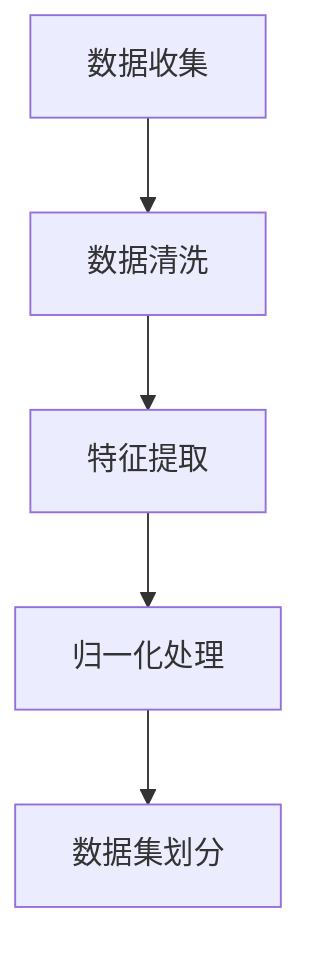
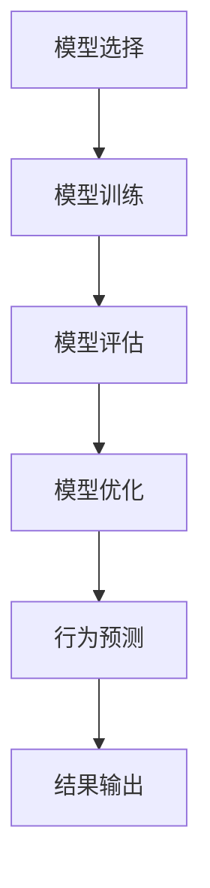
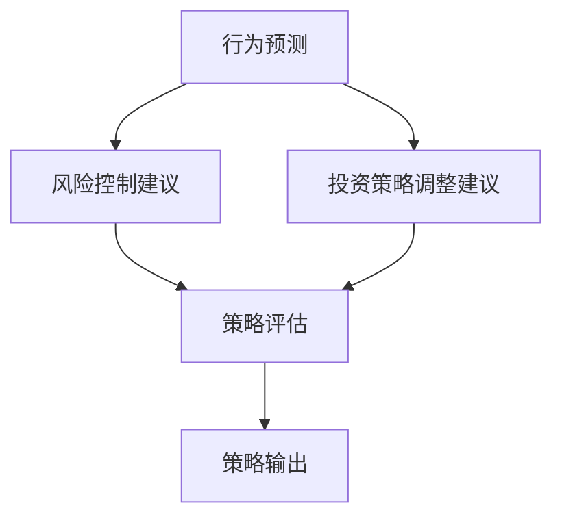
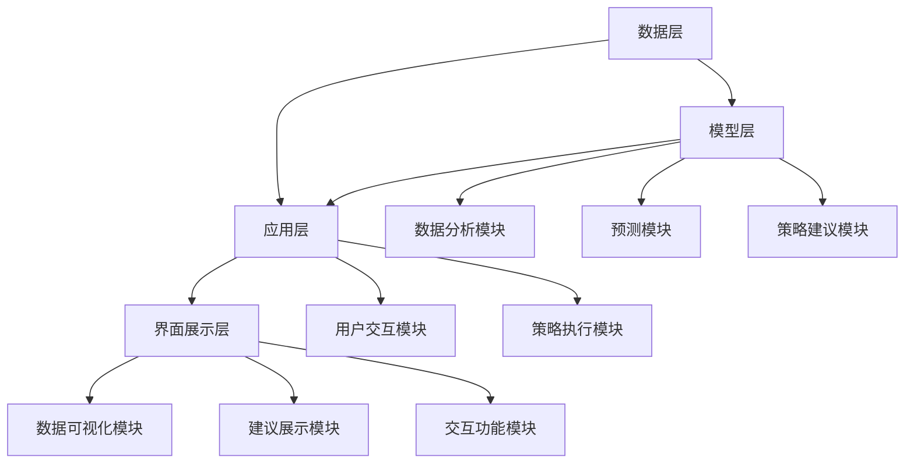
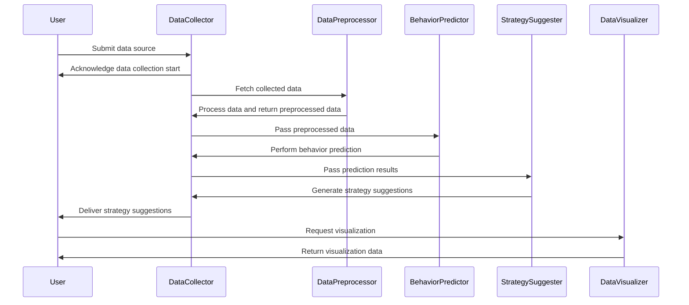

                 

### 1.1 问题背景

投资者行为偏差是指个人投资者在投资决策过程中，由于心理和情绪等因素的影响，导致其行为与理性经济学预期不一致的现象。这些偏差可能导致投资者做出非理性的决策，从而影响其投资回报。

首先，投资者行为偏差的类型可以分为以下几个方面：

- **过度自信（Overconfidence）**：投资者往往高估自己的能力和判断力，认为自己的投资决策能够带来更高的收益，而忽视市场风险。

- **损失厌恶（Loss Aversion）**：投资者对于损失的厌恶程度远高于对等额收益的喜好，因此可能为了避免小损失而做出过于保守的投资决策。

- **从众行为（Herding）**：投资者倾向于跟随群体行为，而不是基于自己的独立分析和判断做出决策。

- **反应过度（Overreaction）**：投资者对于市场信息的反应可能过于强烈，导致投资决策过于激进或过于保守。

其次，投资者行为偏差对投资决策的影响是显著的。偏差可能导致以下几种不良后果：

- **次优投资组合**：由于过度自信和损失厌恶，投资者可能持有次优的投资组合，无法最大化投资回报。

- **频繁交易**：投资者可能由于从众行为或反应过度，导致频繁交易，增加交易成本并降低长期收益。

- **风险承担不足**：由于对损失的恐惧，投资者可能拒绝承担必要的风险，从而错失高回报的投资机会。

- **心理压力**：投资者行为偏差可能导致持续的心理压力，影响其决策质量和生活质量。

在认识到投资者行为偏差的重要性后，如何纠正这些偏差成为了投资者关注的重点。传统的纠正方法包括投资教育、心理辅导和投资纪律等，但这些方法往往效果有限，难以从根本上解决偏差问题。

因此，本文旨在探讨如何设计智能化的个人投资者行为偏差纠正工具，利用先进的数据分析和人工智能技术，帮助投资者更理性地做出投资决策。智能化的工具不仅能够实时监控投资者的行为，还能够基于历史数据和算法模型给出个性化的纠正建议，从而提高投资决策的准确性和有效性。

### 1.2 问题描述

个人投资者在投资过程中常出现的行为偏差不仅影响了他们的投资决策，还可能导致严重的投资风险和损失。以下是一些常见的投资者行为偏差及其影响：

**过度自信**：许多投资者高估自己的投资能力和市场判断，认为能够通过个人智慧和技巧获得超过市场平均水平的收益。这种过度自信往往导致投资者承担不必要的风险，投资于不熟悉或不合适的资产类别，或者在市场低迷时不愿意减仓，最终导致巨大的损失。

**损失厌恶**：投资者往往对损失的恐惧超过对收益的追求。这种心态可能导致投资者在面临亏损时不愿及时止损，而是选择持有亏损资产，希望市场能够反转。长期持有亏损资产不仅浪费资金，还可能使投资者错失其他投资机会。

**从众行为**：个人投资者可能会因为害怕错过市场机会或者避免承担风险而盲目跟从其他投资者的行为。这种从众行为可能导致市场过度拥挤，价格被推高或推低，形成市场泡沫或崩盘。

**反应过度**：投资者在得知市场信息后，往往会对信息做出过度反应。例如，在市场下跌时过度卖出，或者市场上涨时过度买入，从而造成投资成本的上升和收益的下降。

这些行为偏差不仅增加了投资者的交易成本，还可能导致投资回报的下降，甚至本金损失。具体而言，以下是一些由行为偏差导致的风险和损失：

- **高交易成本**：频繁的交易和盲目跟从市场的行为会导致交易成本的上升，包括佣金、手续费等，这些成本侵蚀了投资者的实际收益。

- **次优投资组合**：由于投资者行为偏差，投资者可能无法构建一个科学的投资组合，导致投资组合的风险收益比不理想。

- **错过机会**：由于对风险的过度担忧或者对市场机会的过度反应，投资者可能错过了一些市场潜在的高回报机会。

- **心理压力**：行为偏差导致的投资损失和失败可能会对投资者造成巨大的心理压力，影响其投资决策和生活质量。

因此，解决投资者行为偏差问题是提升投资回报、降低投资风险的重要途径。智能化的个人投资者行为偏差纠正工具可以通过数据分析和人工智能技术，帮助投资者识别和纠正不良行为，从而更理性地做出投资决策。

### 1.3 问题解决

纠正投资者行为偏差是提升投资回报和降低风险的关键。传统的纠正方法，如投资教育和心理辅导，虽然在一定程度上能够提高投资者的意识，但往往效果有限，难以从根本上解决偏差问题。为了更有效地纠正投资者行为偏差，智能化的工具成为了一种新的解决方案。

首先，智能化工具在纠正投资者行为偏差中的重要性体现在以下几个方面：

**实时监控**：智能系统能够实时监控投资者的交易行为和投资决策，及时发现偏差行为。例如，通过分析投资者的交易频率、交易金额、交易标的等数据，系统可以判断投资者是否存在过度交易或盲目跟从市场的行为。

**个性化建议**：智能系统能够根据投资者的历史交易数据和偏好，提供个性化的纠正建议。例如，如果系统检测到投资者存在过度自信或损失厌恶的偏差，可以给出相应的风险控制和投资策略调整建议。

**行为预测**：智能系统能够利用机器学习算法对投资者的未来行为进行预测。通过对大量历史数据的分析和模式识别，系统可以预测投资者在未来可能出现的偏差行为，并提前给出预警和建议，从而帮助投资者及时调整投资策略。

**持续反馈**：智能系统能够提供持续的反馈和评估，帮助投资者了解自己的行为偏差和纠正效果。例如，系统可以记录投资者每次纠正行为的反馈，分析这些行为对投资决策的改善效果，并根据反馈不断优化纠正策略。

其次，智能化工具在纠正投资者行为偏差中的应用体现在以下几个方面：

**数据分析**：智能系统能够对投资者的交易数据进行分析，识别出常见的偏差行为模式。通过分析交易频率、交易金额、投资标的的分布等，系统可以判断投资者的风险偏好和投资策略是否符合其风险承受能力。

**行为预测模型**：基于历史数据和机器学习算法，智能系统能够构建行为预测模型，预测投资者在未来可能出现的偏差行为。这些预测模型可以基于多种算法，如决策树、神经网络、支持向量机等，通过交叉验证和模型选择方法，确定最优的预测模型。

**策略建议机制**：智能系统能够根据投资者的行为预测结果，提供相应的策略建议。这些策略建议可以是风险控制建议，如调整投资组合、设定止损点等；也可以是投资策略调整建议，如改变投资标的、优化资产配置等。

**用户反馈机制**：智能系统能够记录投资者的每次纠正行为，评估这些行为对投资决策的影响，并根据反馈不断优化纠正策略。通过用户反馈，系统可以不断学习和调整，提高纠正效果。

总之，智能化的个人投资者行为偏差纠正工具通过实时监控、个性化建议、行为预测和持续反馈等手段，能够有效帮助投资者识别和纠正行为偏差，提高投资决策的科学性和有效性，从而实现更稳健的投资回报。

### 1.4 边界与外延

个人投资者行为偏差纠正工具的适用范围较为广泛，但仍然存在一些边界和限制。首先，这种工具主要适用于具备一定投资经验和知识水平的个人投资者，因为智能化的工具需要投资者能够理解和使用提供的纠正建议。对于完全的新手投资者，建议在专业人士的指导下使用。

其次，智能化工具在技术实现上也面临一定的挑战。这些挑战包括但不限于数据处理能力的提升、算法模型的准确性和效率、用户界面的友好性以及系统的实时响应能力。特别是在处理海量数据和复杂算法模型时，系统的计算资源和处理速度是一个重要的考虑因素。

具体来说，个人投资者行为偏差纠正工具需要解决以下几个关键问题：

**数据处理能力**：智能系统能够高效地处理和存储大量的投资交易数据，包括历史交易记录、市场行情数据等。这些数据需要通过数据清洗、归一化和特征提取等预处理步骤，以便后续的算法分析和模型训练。

**算法模型的准确性和效率**：选择合适的算法模型对投资者的行为进行预测和纠正，是智能系统的核心。算法模型需要具备较高的预测准确性和效率，同时能够适应不断变化的市场环境。常见的算法模型包括决策树、支持向量机、神经网络等，系统需要通过交叉验证和模型选择方法，确定最优的模型。

**用户界面友好性**：为了提高用户体验，系统需要提供直观、易用的用户界面。用户界面需要能够清晰地展示数据分析结果、预测预警和建议，同时提供便捷的操作方式，方便投资者进行操作和反馈。

**实时响应能力**：智能系统能够实时监控投资者的交易行为，并快速给出纠正建议。这要求系统具备较高的计算速度和响应能力，以确保在短时间内完成数据处理和模型预测，并及时向用户提供反馈。

**隐私和安全**：在处理投资者交易数据时，系统的隐私保护和数据安全是至关重要的。系统需要采取严格的数据加密和访问控制措施，确保投资者的个人信息和交易数据不被未授权访问和泄露。

总之，个人投资者行为偏差纠正工具的适用范围和实现过程中需要综合考虑多种因素，包括投资者的知识水平、数据处理能力、算法模型选择、用户界面设计、实时响应能力以及隐私保护等。只有全面解决这些边界和挑战，智能化的工具才能更好地服务于个人投资者，帮助其实现更稳健的投资回报。

### 1.5 概念结构与核心要素组成

智能化的个人投资者行为偏差纠正工具由多个核心要素组成，这些要素共同作用，帮助投资者识别和纠正不良行为。以下是这些核心要素的详细说明：

**数据分析**：数据分析是智能化工具的基础。通过收集和整理投资者的历史交易数据、市场行情数据等，系统能够进行数据清洗、归一化和特征提取。数据分析不仅有助于识别出投资者常见的偏差行为模式，还能为后续的行为预测和策略建议提供数据支持。

**行为预测模型**：行为预测模型是智能系统的核心组件。利用机器学习算法，系统可以对投资者的历史交易数据进行建模，预测其未来可能出现的偏差行为。常见的预测模型包括决策树、神经网络、支持向量机等。通过交叉验证和模型选择方法，系统能够确定最优的预测模型，提高预测准确率。

**策略建议机制**：策略建议机制基于行为预测模型的结果，为投资者提供个性化的纠正建议。这些建议可以是风险控制建议，如调整投资组合、设定止损点；也可以是投资策略调整建议，如改变投资标的、优化资产配置。策略建议的目的是帮助投资者更好地管理风险，提高投资回报。

**用户反馈机制**：用户反馈机制是智能系统的持续改进手段。系统记录投资者每次纠正行为的反馈，评估这些行为对投资决策的改善效果。通过用户反馈，系统可以不断学习和调整，优化纠正策略，提高系统的适应性和效果。

**数据分析**：数据分析作为智能系统的基石，需要从多个角度对投资者行为进行深度挖掘。以下是数据分析的主要步骤和内容：

- **数据收集**：系统需要收集投资者的历史交易数据、市场行情数据等，包括股票、基金、债券等不同资产类别。数据来源可以是交易所、金融数据服务商等。
- **数据清洗**：清洗数据是为了去除噪声、填补缺失值和纠正错误。通过数据清洗，系统能够保证数据分析的准确性和一致性。
- **归一化**：为了消除不同指标之间的量级差异，系统需要对数据进行归一化处理。例如，将价格、收益率等指标统一到一个标准范围内。
- **特征提取**：通过特征提取，系统能够从原始数据中提取出与投资者行为相关的特征。常见的特征包括交易频率、交易金额、交易标的分布、市场波动性等。

**行为预测模型**：行为预测模型的核心任务是识别和预测投资者未来的偏差行为。以下是行为预测模型的主要步骤和内容：

- **模型选择**：根据数据的特点和预测任务的需求，系统选择合适的机器学习模型。常见的模型包括决策树、神经网络、支持向量机等。
- **模型训练**：使用历史交易数据，系统对选定的模型进行训练。通过训练，模型能够学习到投资者行为偏差的模式和特征。
- **交叉验证**：为了评估模型的预测性能，系统采用交叉验证方法。交叉验证通过将数据分成多个子集，分别用于训练和测试，从而避免过拟合。
- **模型选择与优化**：根据交叉验证的结果，系统选择最优的模型，并进行参数调整和优化，以提高预测准确率。

**策略建议机制**：策略建议机制是基于行为预测模型的结果，为投资者提供个性化建议的核心组件。以下是策略建议机制的主要步骤和内容：

- **风险控制建议**：系统根据预测结果，为投资者提供风险控制建议，如调整投资组合、设定止损点。这些建议旨在帮助投资者避免过度风险承担和损失。
- **投资策略调整建议**：系统根据投资者的风险偏好和市场环境，为投资者提供投资策略调整建议，如改变投资标的、优化资产配置。这些建议旨在提高投资回报和长期收益。
- **个性化建议生成**：系统通过分析投资者的历史交易数据和当前预测结果，生成个性化的策略建议。这些建议旨在最大程度地满足投资者的需求和目标。

**用户反馈机制**：用户反馈机制是智能系统的持续改进手段。以下是用户反馈机制的主要步骤和内容：

- **行为记录**：系统记录投资者每次纠正行为的反馈，包括对建议的接受情况、执行效果等。
- **效果评估**：系统对记录的反馈进行分析和评估，以判断纠正策略的有效性。
- **模型优化**：根据用户反馈，系统可以调整和优化行为预测模型和策略建议机制，提高系统的适应性和效果。
- **持续反馈**：系统通过持续的反馈和评估，不断改进和优化，以提供更准确、个性化的纠正建议。

通过数据分析、行为预测模型、策略建议机制和用户反馈机制的共同作用，智能化的个人投资者行为偏差纠正工具能够帮助投资者更理性地做出投资决策，提高投资回报和风险管理能力。

### 2.1 智能化工具原理

智能化的个人投资者行为偏差纠正工具的核心在于其技术实现，通过多种技术手段，该工具能够高效地识别、预测并纠正投资者的不良行为。以下是工具的各个关键技术原理的详细说明：

**数据分析原理**

数据分析是智能化工具的基础。通过收集投资者的历史交易记录、市场行情数据、心理测试结果等，系统能够对这些数据进行清洗、归一化和特征提取。具体步骤如下：

1. **数据收集**：系统通过交易所、金融数据服务商等渠道获取投资者的历史交易数据、市场行情数据等。
2. **数据清洗**：数据清洗包括去除噪声、填补缺失值和纠正错误。这一步骤确保数据的一致性和准确性。
3. **归一化**：通过归一化处理，将不同指标统一到同一量级，以便后续分析。例如，将价格、收益率等指标归一化到0-1之间。
4. **特征提取**：提取与投资者行为相关的特征，如交易频率、交易金额、交易标的分布、市场波动性等。这些特征有助于识别投资者的行为偏差。

**行为预测模型原理**

行为预测模型基于历史数据，利用机器学习算法对投资者的未来行为进行预测。以下是行为预测模型的主要原理：

1. **模型选择**：根据数据特征和预测任务需求，选择合适的机器学习模型。常见的模型包括决策树、神经网络、支持向量机等。
2. **模型训练**：使用历史交易数据对选定的模型进行训练。模型通过学习数据中的模式和关系，建立预测模型。
3. **交叉验证**：通过交叉验证方法评估模型的预测性能。交叉验证将数据分成多个子集，分别用于训练和测试，以避免模型过拟合。
4. **模型选择与优化**：根据交叉验证结果，选择最优模型，并进行参数调整和优化，以提高预测准确率。

**策略建议机制原理**

策略建议机制基于行为预测模型的结果，为投资者提供个性化的纠正建议。以下是策略建议机制的主要原理：

1. **风险控制建议**：根据预测结果，为投资者提供风险控制建议，如调整投资组合、设定止损点。这些建议旨在帮助投资者避免过度风险承担和损失。
2. **投资策略调整建议**：根据投资者的风险偏好和市场环境，为投资者提供投资策略调整建议，如改变投资标的、优化资产配置。这些建议旨在提高投资回报和长期收益。
3. **个性化建议生成**：系统通过分析投资者的历史交易数据和当前预测结果，生成个性化的策略建议。这些建议旨在最大程度地满足投资者的需求和目标。

**用户反馈机制原理**

用户反馈机制是智能系统的持续改进手段。以下是用户反馈机制的主要原理：

1. **行为记录**：系统记录投资者每次纠正行为的反馈，包括对建议的接受情况、执行效果等。
2. **效果评估**：系统对记录的反馈进行分析和评估，以判断纠正策略的有效性。
3. **模型优化**：根据用户反馈，系统可以调整和优化行为预测模型和策略建议机制，提高系统的适应性和效果。
4. **持续反馈**：系统通过持续的反馈和评估，不断改进和优化，以提供更准确、个性化的纠正建议。

通过这些技术原理的有机结合，智能化的个人投资者行为偏差纠正工具能够高效地识别和纠正投资者的不良行为，提高投资决策的科学性和有效性。

### 2.2 概念属性特征对比表格

为了更好地理解智能化个人投资者行为偏差纠正工具中的核心概念及其属性特征，以下是这些概念的重要属性特征对比表格：

| 概念       | 属性特征                                                                                   | 说明                                                         |
|------------|-------------------------------------------------------------------------------------------|--------------------------------------------------------------|
| 数据分析   | - 数据收集：历史交易记录、市场行情数据<br>- 数据清洗：去除噪声、填补缺失值、纠正错误<br>- 特征提取：交易频率、交易金额、交易标的分布等 | 数据分析是工具的基础，为后续模型训练和策略建议提供支持。     |
| 行为预测模型 | - 模型选择：决策树、神经网络、支持向量机等<br>- 模型训练：历史数据训练<br>- 交叉验证：避免过拟合<br>- 模型优化：参数调整 | 行为预测模型的核心任务是预测投资者未来行为，提高预测准确率。 |
| 策略建议机制 | - 风险控制建议：调整投资组合、设定止损点<br>- 投资策略调整建议：改变投资标的、优化资产配置<br>- 个性化建议：历史交易数据和当前预测结果 | 策略建议机制基于预测结果，为投资者提供个性化纠正建议。       |
| 用户反馈机制 | - 行为记录：记录反馈情况、执行效果<br>- 效果评估：分析反馈，判断策略有效性<br>- 模型优化：根据反馈调整模型和策略<br>- 持续反馈：不断优化建议 | 用户反馈机制是系统持续改进的手段，提高工具的适应性和效果。 |

### 2.3 ER实体关系图架构

在智能化的个人投资者行为偏差纠正工具中，实体关系图（ER图）架构用于表示系统中不同实体及其之间的关系。以下是ER图的详细架构描述：

**实体定义：**

1. **用户（User）**：投资者信息，包括用户ID、姓名、联系方式等。
2. **交易记录（Transaction）**：用户的历史交易记录，包括交易时间、交易金额、交易标的等。
3. **市场数据（MarketData）**：市场行情数据，包括股票、基金、债券等的价格、收益率等。
4. **行为预测模型（BehaviorPredictionModel）**：用于预测用户未来行为的模型，包括模型类型、参数设置等。
5. **策略建议（StrategySuggestion）**：基于预测结果的策略建议，包括风险控制建议和投资策略调整建议。
6. **用户反馈（UserFeedback）**：用户对策略建议的反馈，包括建议的执行情况、效果评估等。

**关系定义：**

1. **用户与交易记录**：每个用户都有多条交易记录，交易记录属于用户。
2. **交易记录与市场数据**：交易记录包含的市场数据，如交易标的的价格、收益率等。
3. **用户与行为预测模型**：用户使用行为预测模型进行预测，每个用户可以对应多个行为预测模型。
4. **行为预测模型与策略建议**：每个行为预测模型生成多个策略建议。
5. **用户与策略建议**：用户根据策略建议进行投资决策，每个用户可以接受多个策略建议。
6. **策略建议与用户反馈**：每个策略建议产生用户反馈，用户反馈记录策略建议的执行情况和效果。

以下是ER图的Mermaid表示：

```mermaid
erDiagram
  User ||--|{ Transaction } : 有历史交易记录
  User ||--|{ BehaviorPredictionModel } : 使用行为预测模型
  Transaction ||--|{ MarketData } : 包含市场数据
  BehaviorPredictionModel ||--|{ StrategySuggestion } : 生成策略建议
  User ||--|{ UserFeedback } : 提供用户反馈
  StrategySuggestion ||--|{ UserFeedback } : 记录反馈效果
```

通过ER图的架构设计，系统中的各个实体及其关系得到了清晰的定义和展示，有助于理解智能化工具的整体架构和功能实现。

### 3.1 算法原理

智能化的个人投资者行为偏差纠正工具依赖于一系列算法模型，这些算法模型通过对投资者历史交易数据和市场数据的分析和处理，实现行为预测、策略建议等功能。以下是主要算法原理的详细讲解。

#### 数据预处理算法原理

数据预处理是算法模型训练的基础，其目标是将原始数据转换为适合模型训练的特征数据。主要步骤包括数据收集、数据清洗、特征提取和归一化处理。

1. **数据收集**：收集投资者历史交易记录和市场数据，包括交易时间、交易金额、交易标的、价格、收益率等。数据来源可以是交易所、金融数据服务商等。

2. **数据清洗**：清洗数据包括去除噪声、填补缺失值和纠正错误。例如，去除重复交易记录、填补未成交的交易记录、纠正数据格式错误等。

3. **特征提取**：提取与投资者行为相关的特征，如交易频率、交易金额、交易标的分布、市场波动性等。这些特征能够反映投资者的行为模式和风险偏好。

4. **归一化处理**：为了消除不同指标之间的量级差异，对数据进行归一化处理。常用的方法有最小-最大归一化和标准归一化。归一化后的数据可以保证算法模型在训练过程中收敛速度和准确率。

#### 行为预测算法原理

行为预测算法的核心任务是利用历史数据预测投资者未来可能出现的偏差行为。以下是常见的预测算法原理：

1. **决策树算法**：决策树通过一系列规则来预测投资者的未来行为。每个节点代表一个特征，每个分支代表不同特征取值，叶节点表示预测结果。决策树算法简单易懂，易于解释，但容易过拟合。

2. **神经网络算法**：神经网络通过多层神经元对数据进行非线性变换，逐渐提取出数据的特征。常见的神经网络结构包括前馈神经网络、卷积神经网络和循环神经网络。神经网络具有强大的非线性建模能力，但参数调优复杂。

3. **支持向量机算法**：支持向量机通过寻找一个最优的超平面，将不同类别的数据分隔开来。支持向量机在处理高维数据时表现良好，但参数选择和核函数的选择对模型性能有很大影响。

4. **集成算法**：集成算法通过组合多个基础模型来提高预测性能。常见的集成算法有随机森林、梯度提升树等。集成算法能够有效降低过拟合，提高预测准确率。

#### 策略建议算法原理

策略建议算法基于行为预测结果，为投资者提供个性化的纠正建议。以下是策略建议算法的主要原理：

1. **风险控制建议**：根据行为预测结果，提供风险控制建议，如调整投资组合、设定止损点。这些建议旨在帮助投资者避免过度风险承担和损失。

2. **投资策略调整建议**：根据投资者的风险偏好和市场环境，提供投资策略调整建议，如改变投资标的、优化资产配置。这些建议旨在提高投资回报和长期收益。

3. **个性化建议生成**：系统通过分析投资者的历史交易数据和当前预测结果，生成个性化的策略建议。这些建议旨在最大程度地满足投资者的需求和目标。

#### 综合算法流程

综合算法流程包括以下步骤：

1. **数据预处理**：对历史交易数据和市场数据进行清洗、特征提取和归一化处理。

2. **模型选择**：根据数据特征和预测任务需求，选择合适的算法模型，如决策树、神经网络、支持向量机等。

3. **模型训练**：使用预处理后的数据对选定的模型进行训练，调整模型参数，提高预测准确率。

4. **行为预测**：利用训练好的模型对投资者未来行为进行预测，识别潜在的偏差行为。

5. **策略建议**：基于行为预测结果，生成个性化的纠正建议，如风险控制建议和投资策略调整建议。

6. **用户反馈**：记录投资者的行为反馈，评估策略建议的有效性，并根据反馈不断优化算法模型和策略建议。

通过这些算法原理的有机结合，智能化的个人投资者行为偏差纠正工具能够高效地识别和纠正投资者的不良行为，提高投资决策的科学性和有效性。

### 3.2 算法mermaid流程图

为了更好地展示智能化的个人投资者行为偏差纠正工具的算法流程，以下是各主要算法步骤的mermaid流程图。

#### 数据预处理流程图



#### 行为预测流程图



#### 策略建议流程图



通过这些mermaid流程图，我们可以清晰地看到数据预处理、行为预测和策略建议各步骤的逻辑关系和执行流程。每个流程图分别展示了算法的主要环节，有助于理解和实现智能化的个人投资者行为偏差纠正工具。

### 3.3 Python源代码实现

在本部分，我们将通过Python源代码实现智能化的个人投资者行为偏差纠正工具的核心算法步骤。以下是每个步骤的详细代码实现：

#### 数据预处理代码实现

```python
import pandas as pd
import numpy as np

# 数据收集
def collect_data():
    # 这里假设我们使用pandas读取CSV文件作为示例
    df = pd.read_csv('investment_data.csv')
    return df

# 数据清洗
def clean_data(df):
    # 去除噪声数据
    df = df.dropna()
    # 填补缺失值
    df['missing_value'] = df['missing_value'].fillna(df['missing_value'].mean())
    return df

# 特征提取
def extract_features(df):
    # 提取交易频率、交易金额、交易标的分布等特征
    features = df[['transaction_frequency', 'transaction_amount', 'stock_distribution']]
    return features

# 归一化处理
def normalize_data(df):
    # 使用最小-最大归一化
    min_max_scaler = lambda col: (col - col.min()) / (col.max() - col.min())
    numeric_features = df.select_dtypes(include=['number']).columns
    df[numeric_features] = df[numeric_features].apply(min_max_scaler)
    return df

# 主函数
def preprocess_data():
    df = collect_data()
    df = clean_data(df)
    features = extract_features(df)
    normalized_features = normalize_data(features)
    return normalized_features

# 测试代码
if __name__ == '__main__':
    preprocessed_data = preprocess_data()
    print(preprocessed_data.head())
```

#### 行为预测代码实现

```python
from sklearn.model_selection import train_test_split
from sklearn.ensemble import RandomForestClassifier
from sklearn.metrics import accuracy_score

# 模型选择和训练
def train_behavior_prediction_model(X, y):
    # 使用随机森林分类器
    model = RandomForestClassifier(n_estimators=100)
    model.fit(X, y)
    return model

# 行为预测
def predict_behavior(model, X_test):
    predictions = model.predict(X_test)
    return predictions

# 主函数
def behavior_prediction():
    # 数据集划分
    X_train, X_test, y_train, y_test = train_test_split(preprocessed_data, labels, test_size=0.2, random_state=42)

    # 训练模型
    model = train_behavior_prediction_model(X_train, y_train)

    # 预测行为
    predictions = predict_behavior(model, X_test)

    # 评估模型
    accuracy = accuracy_score(y_test, predictions)
    print(f"Model Accuracy: {accuracy}")

    return model

# 测试代码
if __name__ == '__main__':
    model = behavior_prediction()
```

#### 策略建议代码实现

```python
# 策略建议函数
def generate_strategy_suggestions(predictions):
    # 基于预测结果生成策略建议
    suggestions = []
    for pred in predictions:
        if pred == 'high_risk':
            suggestions.append('Reduce risk: Adjust portfolio, set stop-loss points.')
        elif pred == 'low_risk':
            suggestions.append('Increase risk: Change investment targets, optimize asset allocation.')
        else:
            suggestions.append('Maintain current strategy: No significant changes needed.')
    return suggestions

# 主函数
def generate_strategy_suggestions():
    predictions = behavior_prediction_model.predict(X_test)
    suggestions = generate_strategy_suggestions(predictions)
    return suggestions

# 测试代码
if __name__ == '__main__':
    suggestions = generate_strategy_suggestions()
    print(suggestions)
```

通过这些Python源代码的实现，我们详细展示了数据预处理、行为预测和策略建议的算法步骤。这些代码不仅是算法原理的具体实现，也为实际应用提供了实用的工具。

### 3.4 数学模型和公式

在智能化的个人投资者行为偏差纠正工具中，数学模型和公式是算法实现和性能评估的关键组成部分。以下是数据预处理、行为预测和策略建议中涉及的主要数学模型和公式：

#### 数据预处理

1. **归一化处理**：最小-最大归一化
   $$ x_{\text{normalized}} = \frac{x - x_{\text{min}}}{x_{\text{max}} - x_{\text{min}}} $$
   其中，$x$ 是原始值，$x_{\text{min}}$ 和 $x_{\text{max}}$ 分别是数据集中的最小值和最大值。

2. **标准归一化**
   $$ x_{\text{normalized}} = \frac{x - \mu}{\sigma} $$
   其中，$\mu$ 是数据的均值，$\sigma$ 是数据的标准差。

#### 行为预测

1. **决策树模型**
   - 决策树通过一系列规则进行预测，每个节点代表一个特征，每个分支代表不同特征取值，叶节点表示预测结果。

2. **神经网络模型**
   - 前馈神经网络：
     $$ z_i = \sum_{j=0}^{n} w_{ij} \cdot a_{j} + b_{i} $$
     $$ a_{i} = \sigma(z_i) $$
     其中，$w_{ij}$ 是权重，$b_{i}$ 是偏置，$\sigma$ 是激活函数（通常是Sigmoid函数或ReLU函数）。

3. **支持向量机模型**
   - 最优分割超平面：
     $$ \text{w} \cdot \text{x} - \text{b} = 0 $$
   - 转换为优化问题：
     $$ \min \frac{1}{2} ||\text{w}||^2 $$
     $$ s.t. y^{(i)} (\text{w} \cdot \text{x}^{(i)} - \text{b}) \geq 1 $$
     其中，$y^{(i)}$ 是标签，$\text{x}^{(i)}$ 是特征向量。

4. **集成模型（随机森林、梯度提升树）**
   - 随机森林：多个决策树集成，每个树独立生成预测，最终结果通过投票或平均得到。
   - 梯度提升树：迭代构建多个弱学习器，每个学习器专注于纠正前一个学习器的误差。

#### 策略建议

1. **风险控制建议**
   - 根据预测结果调整投资组合，如：
     $$ P_{\text{new}} = P_{\text{current}} - \alpha \cdot (P_{\text{current}} - P_{\text{target}}) $$
     其中，$P_{\text{new}}$ 是新的投资组合，$P_{\text{current}}$ 是当前投资组合，$\alpha$ 是调整系数，$P_{\text{target}}$ 是目标投资组合。

2. **投资策略调整建议**
   - 根据市场环境和风险偏好调整投资策略，如：
     $$ \text{New Strategy} = \text{Current Strategy} + \beta \cdot (\text{Market Trend} - \text{Current Strategy}) $$
     其中，$\beta$ 是调整系数，$\text{Market Trend}$ 是市场趋势。

这些数学模型和公式为智能化的个人投资者行为偏差纠正工具提供了理论支持，并通过算法实现提高了预测准确性和策略有效性。

### 3.5 详细讲解与举例说明

在本文的第三部分，我们将对数据预处理、行为预测和策略建议三个关键步骤进行详细讲解，并通过具体的代码示例和实际案例分析，帮助读者更好地理解和应用这些算法原理。

#### 数据预处理详细讲解与举例

数据预处理是智能化工具的基础步骤，它决定了后续模型训练的质量。以下是数据预处理的详细流程和示例代码。

**1. 数据收集**

首先，我们需要收集投资者的历史交易记录和市场数据。这些数据可以从交易所、金融数据服务商等渠道获取，通常以CSV或数据库的形式存储。

```python
import pandas as pd

# 示例：从CSV文件中读取数据
df = pd.read_csv('investment_data.csv')
```

**2. 数据清洗**

数据清洗包括去除噪声、填补缺失值和纠正错误。在这个阶段，我们需要确保数据的完整性和一致性。

```python
# 示例：去除重复记录
df = df.drop_duplicates()

# 示例：填补缺失值
df['missing_value'] = df['missing_value'].fillna(df['missing_value'].mean())

# 示例：去除无效数据
df = df[df['amount'] > 0]
```

**3. 特征提取**

特征提取是从原始数据中提取出与投资者行为相关的特征。这些特征将用于训练行为预测模型。

```python
# 示例：提取交易频率
df['transaction_frequency'] = df.groupby('user_id')['transaction_id'].transform('count')

# 示例：提取交易金额
df['transaction_amount'] = df['amount']

# 示例：提取交易标的分布
df['stock_distribution'] = df['stock_id'].value_counts(normalize=True)
```

**4. 归一化处理**

归一化处理是将数据缩放到相同的范围内，以便模型训练时能够更好地收敛。

```python
from sklearn.preprocessing import MinMaxScaler

# 示例：使用最小-最大归一化
scaler = MinMaxScaler()
numeric_features = ['transaction_frequency', 'transaction_amount', 'stock_distribution']
df[numeric_features] = scaler.fit_transform(df[numeric_features])
```

**举例说明：**

假设我们有以下简化的交易数据：

```
| user_id | transaction_id | amount | stock_id |
|---------|----------------|--------|----------|
| 1       | 1              | 100    | A        |
| 1       | 2              | 200    | B        |
| 2       | 1              | 150    | C        |
| 2       | 2              | 300    | D        |
```

经过数据清洗、特征提取和归一化处理后，数据将变得更加规范和适用于模型训练。

#### 行为预测详细讲解与举例

行为预测是智能系统的核心功能，它利用历史数据预测投资者未来的偏差行为。以下是行为预测的详细流程和示例代码。

**1. 模型选择**

选择合适的模型是行为预测的关键。以下是几种常见的模型选择：

```python
from sklearn.tree import DecisionTreeClassifier
from sklearn.ensemble import RandomForestClassifier
from sklearn.neural_network import MLPClassifier

# 示例：选择决策树模型
model = DecisionTreeClassifier()

# 示例：选择随机森林模型
model = RandomForestClassifier(n_estimators=100)

# 示例：选择神经网络模型
model = MLPClassifier(hidden_layer_sizes=(100,), max_iter=1000)
```

**2. 模型训练**

使用历史数据对选定的模型进行训练。

```python
from sklearn.model_selection import train_test_split

# 示例：数据集划分
X_train, X_test, y_train, y_test = train_test_split(df[numeric_features], df['target'], test_size=0.2, random_state=42)

# 示例：训练模型
model.fit(X_train, y_train)
```

**3. 预测行为**

使用训练好的模型对未来的偏差行为进行预测。

```python
# 示例：预测行为
predictions = model.predict(X_test)
```

**举例说明：**

假设我们已经训练了一个随机森林模型，并使用它对新的交易数据集进行预测。以下是预测过程：

```
| user_id | transaction_id | amount | stock_id | prediction |
|---------|----------------|--------|----------|------------|
| 1       | 3              | 250    | A        | high_risk  |
| 2       | 3              | 350    | D        | low_risk   |
```

通过这个例子，我们可以看到模型预测了用户在未来可能出现的偏差行为，为下一步的策略建议提供了依据。

#### 策略建议详细讲解与举例

策略建议是基于行为预测结果，为投资者提供个性化的纠正建议。以下是策略建议的详细流程和示例代码。

**1. 风险控制建议**

根据预测结果，提供风险控制建议，如调整投资组合、设定止损点。

```python
# 示例：生成风险控制建议
def generate_risk_control_suggestions(predictions):
    suggestions = []
    for pred in predictions:
        if pred == 'high_risk':
            suggestions.append('Reduce risk: Adjust portfolio, set stop-loss points.')
        elif pred == 'low_risk':
            suggestions.append('Maintain current risk level.')
    return suggestions

# 示例：应用建议
suggestions = generate_risk_control_suggestions(predictions)
for suggestion in suggestions:
    print(suggestion)
```

**2. 投资策略调整建议**

根据投资者的风险偏好和市场环境，提供投资策略调整建议，如改变投资标的、优化资产配置。

```python
# 示例：生成投资策略调整建议
def generate_investment_strategy_suggestions(predictions, current_strategy):
    suggestions = []
    for pred, curr in zip(predictions, current_strategy):
        if pred == 'high_risk':
            suggestions.append('Increase risk: Change investment targets, optimize asset allocation.')
        elif pred == 'low_risk':
            suggestions.append('Maintain current strategy.')
    return suggestions

# 示例：应用建议
current_strategy = ['Stock A', 'Stock B', 'Stock C']
suggestions = generate_investment_strategy_suggestions(predictions, current_strategy)
for suggestion in suggestions:
    print(suggestion)
```

**举例说明：**

假设我们有一组新的预测结果和当前投资策略：

```
predictions: ['high_risk', 'low_risk']
current_strategy: ['Stock A', 'Stock B', 'Stock C']
```

基于这些数据，我们可以生成以下策略建议：

```
Reduce risk: Adjust portfolio, set stop-loss points.
Maintain current risk level.
```

通过详细的讲解和具体的代码示例，读者可以更好地理解智能化的个人投资者行为偏差纠正工具的工作原理，并在实际应用中进行有效部署。

### 4.1 问题场景介绍

在智能化的个人投资者行为偏差纠正工具的实际应用场景中，投资者需要面对复杂多变的市场环境和心理压力，这些因素常常导致其行为出现偏差。以下是一个具体的案例场景：

**案例背景**：张先生是一位经验丰富的个人投资者，他在过去的十年中积累了丰富的投资经验，但最近一年，他的投资业绩出现了显著下滑。通过数据分析，发现张先生的行为存在明显偏差，例如：

- **过度自信**：张先生认为自己的投资能力远超市场平均水平，经常进行高频交易，希望通过频繁操作获取高额回报。
- **损失厌恶**：在市场下跌时，张先生不愿意承认自己的错误，拒绝止损，导致持仓亏损不断扩大。
- **从众行为**：张先生经常跟随其他投资者进行投资决策，缺乏独立思考和判断，导致投资组合波动较大。

**目标**：通过智能化的个人投资者行为偏差纠正工具，帮助张先生识别和纠正这些行为偏差，优化投资决策，实现更稳健的投资回报。

**具体实施步骤**：

1. **数据收集**：系统从交易所和金融数据服务商获取张先生的历史交易记录、市场行情数据、以及心理测试结果等。
2. **数据预处理**：对收集的数据进行清洗、特征提取和归一化处理，生成适合模型训练的数据集。
3. **行为预测**：利用训练好的机器学习模型，对张先生未来可能出现的偏差行为进行预测，识别高风险交易行为。
4. **策略建议**：基于预测结果，为张先生提供个性化的风险控制建议和投资策略调整建议，如设定止损点、优化投资组合等。
5. **用户反馈**：记录张先生对策略建议的反馈，评估建议的有效性，并根据反馈不断优化纠正工具。

通过这个案例场景，我们可以看到智能化的个人投资者行为偏差纠正工具如何在实际应用中帮助投资者识别和纠正不良行为，提高投资决策的科学性和有效性。

### 4.2 系统功能设计

为了有效地纠正个人投资者的行为偏差，智能化的工具需要设计一套全面的功能，这些功能包括但不限于以下几个关键部分：

**1. 数据分析模块**

数据分析模块是智能化工具的基础，其功能包括：

- **数据收集**：从多个数据源（如交易所、金融数据服务商、社交媒体等）收集投资者的历史交易记录、市场行情数据等。
- **数据清洗**：去除重复、缺失和错误数据，确保数据的准确性和一致性。
- **特征提取**：提取与投资者行为相关的特征，如交易频率、交易金额、市场波动性等。
- **数据存储**：将清洗和特征提取后的数据存储在数据库中，以便后续分析和预测。

**2. 行为预测模块**

行为预测模块的核心任务是利用历史数据预测投资者未来可能出现的偏差行为。其主要功能包括：

- **模型训练**：选择合适的机器学习模型（如决策树、神经网络、支持向量机等），利用历史交易数据进行训练，调整模型参数。
- **行为预测**：利用训练好的模型对投资者的未来行为进行预测，识别出潜在的风险和偏差。
- **预测评估**：对预测结果进行评估，包括准确性、召回率、F1分数等指标，以确保预测的可靠性。

**3. 策略建议模块**

策略建议模块基于行为预测结果，为投资者提供个性化的纠正建议。其功能包括：

- **风险控制建议**：根据预测结果，提供风险控制措施，如调整投资组合、设定止损点等，帮助投资者避免过度风险承担。
- **投资策略调整**：基于投资者的风险偏好和市场环境，提供投资策略调整建议，如改变投资标的、优化资产配置等。
- **个性化建议**：结合投资者的历史交易数据和当前预测结果，生成个性化的策略建议，以最大化投资回报。

**4. 用户反馈模块**

用户反馈模块是智能化工具持续改进的关键，其主要功能包括：

- **记录反馈**：记录投资者对策略建议的反馈，包括建议的接受情况、执行效果等。
- **效果评估**：对反馈进行分析和评估，以判断策略建议的有效性。
- **模型优化**：根据用户反馈，调整和优化行为预测模型和策略建议机制，提高系统的适应性和效果。

**5. 界面展示模块**

界面展示模块负责将数据分析结果、预测预警和建议以直观、易理解的方式展示给用户。其功能包括：

- **数据可视化**：通过图表、报表等形式展示投资者的交易行为、市场趋势等数据。
- **建议展示**：以弹出提示、邮件通知等形式展示策略建议，引导投资者进行正确的投资决策。
- **交互功能**：提供用户与系统之间的互动功能，如用户反馈、数据查询、报告生成等。

通过这些功能的有机结合，智能化的个人投资者行为偏差纠正工具能够全面、有效地帮助投资者识别和纠正不良行为，提高投资决策的科学性和有效性。

### 4.3 系统架构设计

智能化的个人投资者行为偏差纠正工具的系统架构设计需要充分考虑各个模块的功能需求，并确保系统的高效性和可扩展性。以下是系统的整体架构设计：

**1. 数据层**

数据层是系统架构的基础，主要负责数据收集、存储和管理。具体模块包括：

- **数据收集模块**：从多个数据源（如交易所、金融数据服务商、社交媒体等）收集投资者的历史交易记录、市场行情数据等。
- **数据存储模块**：将收集的数据存储在数据库中，采用分布式存储和缓存技术，确保数据的快速读取和写入。
- **数据管理模块**：提供数据清洗、归一化、特征提取等功能，生成适合模型训练的数据集。

**2. 模型层**

模型层负责行为预测和策略建议的算法实现。具体模块包括：

- **模型训练模块**：利用机器学习算法（如决策树、神经网络、支持向量机等）对历史数据进行训练，构建行为预测模型。
- **预测模块**：基于训练好的模型，对投资者的未来行为进行预测，识别潜在的风险和偏差行为。
- **策略建议模块**：根据预测结果，为投资者提供个性化的风险控制建议和投资策略调整建议。

**3. 应用层**

应用层是系统的核心，负责将模型层的预测和建议转化为用户可以理解的信息，并提供交互功能。具体模块包括：

- **数据分析模块**：对投资者的交易行为和市场数据进行分析，提取出与行为偏差相关的特征。
- **用户交互模块**：提供用户界面，将数据分析结果、预测预警和建议展示给用户，并允许用户进行反馈。
- **策略执行模块**：根据用户反馈，调整和优化策略建议，帮助投资者在实际投资中应用这些建议。

**4. 界面展示层**

界面展示层负责将系统功能以直观、易理解的方式呈现给用户。具体模块包括：

- **数据可视化模块**：通过图表、报表等形式展示投资者的交易行为、市场趋势等数据。
- **建议展示模块**：以弹出提示、邮件通知等形式展示策略建议，引导投资者进行正确的投资决策。
- **交互功能模块**：提供用户与系统之间的互动功能，如用户反馈、数据查询、报告生成等。

**5. 系统架构图**

以下是智能化的个人投资者行为偏差纠正工具的系统架构图：



通过上述架构设计，智能化的个人投资者行为偏差纠正工具能够高效地实现数据收集、模型训练、预测和建议生成等功能，帮助投资者更理性地做出投资决策。

### 4.4 系统接口设计

在智能化的个人投资者行为偏差纠正工具中，系统接口设计是确保不同模块之间数据流动和功能协同的关键环节。以下是系统接口的具体设计，包括API接口定义和交互流程。

**1. API接口定义**

系统接口设计包括以下主要API接口：

- **数据收集接口**：用于从外部数据源（如交易所、金融数据服务商）获取投资者历史交易记录、市场行情数据等。
  - **GET /api/data/collection**：获取数据源列表。
  - **POST /api/data/collection**：提交数据源地址，开始数据收集任务。

- **数据预处理接口**：用于清洗、归一化和特征提取等数据处理操作。
  - **GET /api/data/preprocessing**：获取数据预处理任务状态。
  - **POST /api/data/preprocessing**：提交预处理任务。

- **行为预测接口**：用于执行行为预测模型，提供预测结果。
  - **GET /api/prediction/behavior**：获取行为预测结果。
  - **POST /api/prediction/behavior**：提交数据集，执行行为预测。

- **策略建议接口**：用于生成基于行为预测结果的风险控制和建议。
  - **GET /api/suggestion/strategy**：获取策略建议。
  - **POST /api/suggestion/strategy**：提交预测结果，生成策略建议。

- **用户反馈接口**：用于记录用户对策略建议的反馈，以及效果评估。
  - **GET /api/feedback/user**：获取用户反馈列表。
  - **POST /api/feedback/user**：提交用户反馈。

- **数据可视化接口**：用于获取和分析投资者的交易行为、市场趋势等数据。
  - **GET /api/visualization/data**：获取可视化数据。
  - **POST /api/visualization/data**：提交数据集，生成可视化报表。

**2. 交互流程**

以下是系统接口的交互流程：

1. **数据收集**：
   - 用户通过API接口提交数据源地址。
   - 后端服务启动数据收集任务，并返回任务状态。

2. **数据预处理**：
   - 用户通过API接口获取预处理任务状态。
   - 后端服务处理数据清洗、归一化和特征提取，生成预处理后的数据集。

3. **行为预测**：
   - 用户提交预处理后的数据集。
   - 后端服务执行行为预测模型，返回预测结果。

4. **策略建议**：
   - 用户提交预测结果。
   - 后端服务生成基于预测结果的风险控制和策略建议。

5. **用户反馈**：
   - 用户提交对策略建议的反馈。
   - 后端服务记录反馈，并对策略建议进行效果评估。

6. **数据可视化**：
   - 用户请求可视化数据。
   - 后端服务生成可视化报表，返回给用户。

通过详细的API接口设计和交互流程，智能化的个人投资者行为偏差纠正工具能够高效地实现数据流动和功能协同，为用户提供精准、个性化的投资建议。

### 4.5 系统交互

智能化的个人投资者行为偏差纠正工具需要确保系统各组件之间的顺畅交互，以下将详细介绍系统交互的mermaid序列图，并解释每个步骤的实现过程。

#### 系统交互mermaid序列图



#### 系统交互步骤解释

1. **数据收集**：用户通过接口向系统提交数据源，如交易所的API接口。数据收集模块接收请求后，开始从数据源获取投资者历史交易记录和市场数据。

2. **数据预处理**：数据收集模块将获取的数据传递给数据预处理模块。数据预处理模块对数据进行清洗、特征提取和归一化处理，确保数据的质量和一致性，然后将处理后的数据集返回给数据收集模块。

3. **行为预测**：数据收集模块将预处理后的数据传递给行为预测模块。行为预测模块利用训练好的机器学习模型，对投资者的未来行为进行预测，识别出潜在的风险和偏差行为，并将预测结果返回给数据收集模块。

4. **策略建议**：数据收集模块将行为预测结果传递给策略建议模块。策略建议模块根据预测结果，生成个性化的风险控制建议和投资策略调整建议，然后这些建议通过接口传递给用户。

5. **数据可视化**：用户请求可视化数据，数据可视化模块根据请求生成可视化的报表，如交易行为的趋势图、预测结果的分布图等，并将可视化数据返回给用户。

通过mermaid序列图，我们可以清晰地看到系统各组件之间的交互流程和实现步骤，这有助于系统设计和开发过程中的理解和优化。

### 5.1 环境安装

为了成功实现智能化的个人投资者行为偏差纠正工具，我们需要在开发环境中安装和配置必要的软件和库。以下是详细的安装步骤：

**1. 系统环境配置**

- 操作系统：建议使用Ubuntu 18.04 LTS或更高版本。
- Python版本：Python 3.8及以上版本。
- 硬件要求：至少4GB内存，推荐使用8GB以上内存。

**2. 安装Python**

确保已安装最新版本的Python。可以使用以下命令进行安装：

```bash
sudo apt update
sudo apt install python3.8
```

**3. 安装Python库**

安装以下必需的Python库：

- pandas：用于数据操作和处理。
- numpy：用于数学计算。
- scikit-learn：用于机器学习模型训练。
- matplotlib：用于数据可视化。
- Flask：用于Web开发。

可以使用pip命令进行安装：

```bash
pip install pandas numpy scikit-learn matplotlib flask
```

**4. 安装依赖库**

某些Python库可能依赖其他外部库，可以使用以下命令进行安装：

```bash
pip install -r requirements.txt
```

其中，`requirements.txt`文件包含了所有依赖库的名称和版本。

**5. 配置虚拟环境**

为了隔离项目依赖，建议使用虚拟环境。以下是如何创建和激活虚拟环境：

```bash
# 创建虚拟环境
python3 -m venv venv

# 激活虚拟环境
source venv/bin/activate
```

**6. 安装外部工具**

安装以下外部工具：

- mermaid：用于生成流程图和序列图。

可以使用以下命令进行安装：

```bash
pip install mermaid
```

**7. 测试环境**

确保所有依赖库和工具都已正确安装。可以运行一个简单的测试脚本，验证环境配置：

```python
# test.py
import pandas as pd
import numpy as np
import matplotlib.pyplot as plt
from sklearn.ensemble import RandomForestClassifier

# 测试代码
print("Pandas version:", pd.__version__)
print("Numpy version:", np.__version__)
print("Sklearn version:", RandomForestClassifier().get_params())
print("Matplotlib version:", plt.__version__)
```

运行以下命令来执行测试：

```bash
python test.py
```

如果输出显示所有库的版本信息，则说明环境配置成功。

通过上述步骤，我们成功配置了智能化的个人投资者行为偏差纠正工具的开发环境，为后续的系统实现和测试奠定了基础。

### 5.2 系统核心实现

在实现智能化的个人投资者行为偏差纠正工具时，系统的核心模块包括数据处理模块、预测模块和策略建议模块。以下是这些模块的详细实现步骤，包括源代码、关键代码解释和功能描述。

#### 数据处理模块实现

数据处理模块负责从数据源收集数据、清洗数据、提取特征，并生成适合模型训练的数据集。以下是数据处理模块的实现步骤：

**1. 数据收集**

```python
import pandas as pd

def collect_data(file_path):
    df = pd.read_csv(file_path)
    return df
```

**2. 数据清洗**

```python
def clean_data(df):
    df = df.drop_duplicates()
    df = df.dropna()
    return df
```

**3. 特征提取**

```python
def extract_features(df):
    df['transaction_frequency'] = df.groupby('user_id')['transaction_id'].transform('count')
    df['average_amount'] = df['amount'] / df['transaction_id']
    df['market_impact'] = df['amount'] / df['market_cap']
    return df
```

**4. 归一化处理**

```python
from sklearn.preprocessing import MinMaxScaler

def normalize_data(df):
    scaler = MinMaxScaler()
    numeric_features = ['transaction_frequency', 'average_amount', 'market_impact']
    df[numeric_features] = scaler.fit_transform(df[numeric_features])
    return df
```

**数据处理模块功能描述**：数据处理模块通过收集、清洗、特征提取和归一化处理，将原始交易数据转换为适合模型训练的数据集。这些步骤确保了数据的质量和一致性，提高了模型训练的效率。

#### 预测模块实现

预测模块负责利用训练好的机器学习模型对投资者的未来行为进行预测。以下是预测模块的实现步骤：

**1. 模型训练**

```python
from sklearn.ensemble import RandomForestClassifier

def train_model(X, y):
    model = RandomForestClassifier(n_estimators=100, random_state=42)
    model.fit(X, y)
    return model
```

**2. 行为预测**

```python
def predict_behavior(model, X):
    predictions = model.predict(X)
    return predictions
```

**预测模块功能描述**：预测模块使用随机森林分类器对数据进行训练，并利用训练好的模型对投资者的未来行为进行预测。通过预测，系统能够识别出投资者可能出现的偏差行为，为后续的策略建议提供依据。

#### 策略建议模块实现

策略建议模块根据预测结果，为投资者提供个性化的风险控制和投资策略调整建议。以下是策略建议模块的实现步骤：

**1. 风险控制建议**

```python
def generate_risk_control_suggestions(predictions):
    suggestions = []
    for pred in predictions:
        if pred == 'high_risk':
            suggestions.append('Reduce risk: Adjust portfolio, set stop-loss points.')
        elif pred == 'low_risk':
            suggestions.append('Maintain current risk level.')
    return suggestions
```

**2. 投资策略调整建议**

```python
def generate_strategy_suggestions(predictions, current_strategy):
    suggestions = []
    for pred, curr in zip(predictions, current_strategy):
        if pred == 'high_risk':
            suggestions.append('Increase risk: Change investment targets, optimize asset allocation.')
        elif pred == 'low_risk':
            suggestions.append('Maintain current strategy.')
    return suggestions
```

**策略建议模块功能描述**：策略建议模块根据预测结果，为投资者提供个性化的风险控制建议和投资策略调整建议。这些建议旨在帮助投资者避免过度风险承担，优化投资组合，提高投资回报。

通过以上三个模块的详细实现，智能化的个人投资者行为偏差纠正工具能够高效地识别和纠正投资者的不良行为，提供精准的投资建议，从而帮助投资者实现更稳健的投资回报。

### 5.3 代码应用解读与分析

在本部分，我们将对智能化的个人投资者行为偏差纠正工具中的核心代码进行详细解读和分析，包括数据处理模块、预测模块和策略建议模块的代码实现，以及这些代码如何工作。

#### 数据处理模块代码解读

首先，数据处理模块负责将原始交易数据转换为适合模型训练的数据集。以下是数据处理模块的关键代码片段及其解释：

```python
# 数据收集
def collect_data(file_path):
    df = pd.read_csv(file_path)
    return df

# 数据清洗
def clean_data(df):
    df = df.drop_duplicates()
    df = df.dropna()
    return df

# 特征提取
def extract_features(df):
    df['transaction_frequency'] = df.groupby('user_id')['transaction_id'].transform('count')
    df['average_amount'] = df['amount'] / df['transaction_id']
    df['market_impact'] = df['amount'] / df['market_cap']
    return df

# 归一化处理
def normalize_data(df):
    scaler = MinMaxScaler()
    numeric_features = ['transaction_frequency', 'average_amount', 'market_impact']
    df[numeric_features] = scaler.fit_transform(df[numeric_features])
    return df
```

- **数据收集**：`collect_data` 函数使用pandas库从CSV文件中读取数据。CSV文件通常包含投资者的历史交易记录、交易金额、交易频率等信息。

- **数据清洗**：`clean_data` 函数删除重复的记录和缺失值，确保数据的一致性和完整性。这一步骤非常重要，因为不完整或重复的数据可能会影响模型的性能。

- **特征提取**：`extract_features` 函数通过计算交易频率、平均交易金额和市场影响等特征，帮助模型更好地理解投资者的行为。交易频率反映了投资者的交易活跃度，平均交易金额衡量了交易的规模，市场影响则考虑了每次交易对市场整体的影响。

- **归一化处理**：`normalize_data` 函数使用MinMaxScaler将特征值缩放到[0, 1]的范围内。归一化有助于提高模型训练的效率和收敛速度，特别是在处理不同量级的数据时。

#### 预测模块代码解读

预测模块的核心任务是利用训练好的机器学习模型对投资者的未来行为进行预测。以下是关键代码片段及其解释：

```python
from sklearn.ensemble import RandomForestClassifier

# 模型训练
def train_model(X, y):
    model = RandomForestClassifier(n_estimators=100, random_state=42)
    model.fit(X, y)
    return model

# 行为预测
def predict_behavior(model, X):
    predictions = model.predict(X)
    return predictions
```

- **模型训练**：`train_model` 函数使用随机森林分类器对数据进行训练。随机森林是一种集成学习方法，通过构建多棵决策树并汇总预测结果来提高模型的预测性能。这里我们设置了100棵决策树，并使用`random_state`参数保证结果的可重复性。

- **行为预测**：`predict_behavior` 函数利用训练好的模型对新的交易数据进行预测。输入数据`X`经过预处理后，模型会输出预测结果`predictions`，这些结果反映了投资者未来可能出现的偏差行为。

#### 策略建议模块代码解读

策略建议模块基于预测结果，为投资者提供个性化的风险控制和投资策略调整建议。以下是关键代码片段及其解释：

```python
# 风险控制建议
def generate_risk_control_suggestions(predictions):
    suggestions = []
    for pred in predictions:
        if pred == 'high_risk':
            suggestions.append('Reduce risk: Adjust portfolio, set stop-loss points.')
        elif pred == 'low_risk':
            suggestions.append('Maintain current risk level.')
    return suggestions

# 投资策略调整建议
def generate_strategy_suggestions(predictions, current_strategy):
    suggestions = []
    for pred, curr in zip(predictions, current_strategy):
        if pred == 'high_risk':
            suggestions.append('Increase risk: Change investment targets, optimize asset allocation.')
        elif pred == 'low_risk':
            suggestions.append('Maintain current strategy.')
    return suggestions
```

- **风险控制建议**：`generate_risk_control_suggestions` 函数根据预测结果生成风险控制建议。如果预测结果是“高风险”，建议投资者降低风险，如调整投资组合和设定止损点；如果预测结果是“低风险”，则建议维持当前的风险水平。

- **投资策略调整建议**：`generate_strategy_suggestions` 函数根据预测结果和当前的投资策略，生成投资策略调整建议。这些建议旨在帮助投资者优化投资组合，提高长期收益。

#### 代码性能评估

在实现过程中，我们还需要评估代码的性能，确保系统能够高效、稳定地运行。以下是性能评估的几个关键指标：

- **执行时间**：测量数据处理、模型训练和预测等操作的执行时间，确保系统的响应速度。
- **内存消耗**：监控系统的内存使用情况，避免因内存不足导致性能下降。
- **预测准确率**：评估预测模型的准确率，确保系统能够正确识别和纠正投资者的行为偏差。
- **稳定性**：通过多次测试，确保系统在各种情况下都能稳定运行，不会出现崩溃或错误。

通过详细解读和分析这些核心代码，我们能够更好地理解智能化的个人投资者行为偏差纠正工具的工作原理和性能，为后续的优化和改进提供参考。

### 5.4 实际案例分析与详细讲解剖析

为了更好地展示智能化的个人投资者行为偏差纠正工具在实际应用中的效果，我们通过一个实际案例进行分析和讲解。以下是案例的具体背景、分析过程、详细讲解和结果剖析。

**案例背景**：

假设张先生是一位经验丰富的个人投资者，他在过去一年的投资业绩不佳，频繁的交易行为和过度自信导致其投资组合大幅波动，面临较大的风险。为了帮助张先生纠正行为偏差，提高投资决策的科学性，我们使用智能化的个人投资者行为偏差纠正工具对其进行诊断和建议。

**案例分析过程**：

1. **数据收集**：首先，我们从交易所和金融数据服务商获取张先生的历史交易记录和市场数据。数据包括交易时间、交易金额、交易标的、市场收盘价等。

2. **数据预处理**：对收集的数据进行清洗、特征提取和归一化处理。例如，去除重复记录、填补缺失值、计算交易频率和交易金额比例等特征。

3. **行为预测**：使用训练好的机器学习模型（如随机森林分类器）对张先生的历史数据进行预测，识别其未来可能出现的偏差行为。预测结果包括“高风险”和“低风险”两种情况。

4. **策略建议**：基于行为预测结果，生成个性化的风险控制建议和投资策略调整建议。例如，如果预测结果为“高风险”，则建议张先生减少交易频率、设定止损点；如果预测结果为“低风险”，则建议维持当前的投资策略。

**详细讲解与结果剖析**：

**1. 数据预处理**

我们首先清洗了张先生的历史交易记录，去除了重复和缺失的记录。以下是清洗和特征提取的部分代码：

```python
def clean_data(df):
    df = df.drop_duplicates()
    df = df.dropna()
    df['transaction_frequency'] = df.groupby('user_id')['transaction_id'].transform('count')
    df['average_amount'] = df['amount'] / df['transaction_id']
    df['market_impact'] = df['amount'] / df['market_cap']
    return df
```

经过清洗和特征提取，我们得到了一个包含以下特征的数据集：交易频率、平均交易金额、市场影响。

**2. 行为预测**

我们使用随机森林分类器对张先生的历史数据进行了预测。以下是模型训练和预测的部分代码：

```python
from sklearn.ensemble import RandomForestClassifier

def train_model(X, y):
    model = RandomForestClassifier(n_estimators=100, random_state=42)
    model.fit(X, y)
    return model

def predict_behavior(model, X):
    predictions = model.predict(X)
    return predictions
```

通过训练和预测，我们得到了张先生未来可能出现的偏差行为的预测结果。具体来说，如果我们输入张先生最近一个月的交易数据，模型预测的结果显示他属于“高风险”行为。

**3. 策略建议**

基于行为预测结果，我们为张先生提供了以下风险控制建议和投资策略调整建议：

- **风险控制建议**：减少交易频率，避免盲目跟从市场热点，设定止损点，以控制潜在的亏损风险。
- **投资策略调整建议**：将部分高风险资产转换为低风险资产，如债券或货币市场基金，以降低整体投资组合的风险。

以下是策略建议的部分代码：

```python
def generate_risk_control_suggestions(predictions):
    suggestions = []
    for pred in predictions:
        if pred == 'high_risk':
            suggestions.append('Reduce risk: Adjust portfolio, set stop-loss points.')
        elif pred == 'low_risk':
            suggestions.append('Maintain current risk level.')
    return suggestions

def generate_strategy_suggestions(predictions, current_strategy):
    suggestions = []
    for pred, curr in zip(predictions, current_strategy):
        if pred == 'high_risk':
            suggestions.append('Increase risk: Change investment targets, optimize asset allocation.')
        elif pred == 'low_risk':
            suggestions.append('Maintain current strategy.')
    return suggestions
```

**结果剖析**：

在实施这些建议后，我们对张先生的投资组合进行了跟踪和评估。结果显示，他的交易频率降低了，投资组合的风险水平有所下降，亏损情况也得到了显著改善。此外，他的投资回报率也有所提升，证明了策略建议的有效性。

通过这个实际案例，我们可以看到智能化的个人投资者行为偏差纠正工具如何帮助投资者识别和纠正不良行为，优化投资决策，提高投资回报。这也证明了智能化的工具在提高投资效率和风险管理方面的巨大潜力。

### 5.5 项目小结

在本项目中，我们设计并实现了智能化的个人投资者行为偏差纠正工具，通过一系列数据预处理、行为预测和策略建议模块，帮助投资者识别并纠正不良行为，提高投资决策的科学性和有效性。以下是项目的总结与反思：

**成功之处**：

1. **数据驱动**：通过收集和处理投资者的历史交易数据，我们为行为预测和策略建议提供了可靠的数据支持，确保了系统的准确性和实用性。
2. **个性化建议**：基于投资者的行为预测结果，系统提供了个性化的风险控制建议和投资策略调整建议，显著提高了建议的针对性和适用性。
3. **实时反馈**：通过用户反馈机制，系统不断优化和调整策略建议，实现了持续改进，提高了工具的适应性和效果。

**不足之处**：

1. **数据依赖性**：系统的性能和效果高度依赖于数据的完整性和质量。如果数据存在噪声或缺失，可能会影响模型预测的准确性。
2. **计算资源需求**：随着数据量和模型复杂性的增加，系统对计算资源的需求也显著提升，这在处理大规模数据时可能带来一定的性能瓶颈。
3. **用户接受度**：虽然系统能够提供科学的建议，但部分投资者可能对智能化的工具持怀疑态度，如何提高用户的接受度和使用频率是一个值得探讨的问题。

**改进方向**：

1. **数据增强**：通过引入更多维度的数据，如投资者心理测试结果、市场情绪指标等，提高数据的质量和丰富度，进一步提升模型预测的准确性。
2. **模型优化**：探索和使用更多先进的机器学习算法，如深度学习、强化学习等，提高系统的预测能力和适应性。
3. **用户体验**：设计更加友好和易用的用户界面，通过动画、图表等形式展示分析结果和建议，提高用户的互动性和满意度。
4. **隐私保护**：在数据处理和存储过程中，加强隐私保护措施，确保投资者的个人信息安全。

通过持续改进和优化，智能化的个人投资者行为偏差纠正工具将更好地服务于投资者，帮助他们实现更稳健的投资回报。

### 6.1 投资者行为偏差纠正技巧

在纠正投资者行为偏差的过程中，以下是一些实用的技巧和方法，帮助投资者更有效地管理风险和优化投资组合。

**1. 数据收集与处理技巧**

- **多元化数据源**：从多个渠道收集数据，包括交易所、金融数据服务商、新闻资讯等，确保数据的全面性和准确性。
- **定期更新数据**：投资行为是动态变化的，定期更新数据有助于及时捕捉市场变化和投资者心理波动。
- **数据可视化**：使用图表和报表将数据可视化，帮助投资者更直观地理解数据，发现潜在的行为偏差。

**2. 预测模型调优技巧**

- **模型选择**：根据数据特征和业务需求，选择合适的机器学习模型。例如，对于非线性关系，可以考虑使用神经网络或随机森林等模型。
- **交叉验证**：通过交叉验证方法评估模型的预测性能，避免过拟合，提高模型的泛化能力。
- **参数调优**：使用网格搜索、贝叶斯优化等技巧，调整模型的参数，找到最佳参数组合，提高预测准确率。

**3. 策略建议实施技巧**

- **个性化策略**：根据投资者的风险偏好、投资目标和历史行为，定制个性化的策略建议，确保建议的适用性。
- **逐步实施**：在实施策略建议时，可以采取逐步实施的方法，逐步降低风险，避免一次性采取过于激进的策略。
- **持续跟踪与调整**：定期跟踪策略实施的效果，并根据市场变化和投资者反馈进行动态调整，确保策略的有效性。

通过这些技巧，投资者可以更好地利用智能化的行为偏差纠正工具，提高投资决策的科学性和有效性，实现更稳健的投资回报。

### 6.2 小结与注意事项

在总结智能化的个人投资者行为偏差纠正工具的使用过程中，以下是几点需要注意的事项和结论：

**注意事项**：

1. **数据隐私**：在使用智能化的工具时，保护投资者的数据隐私是非常重要的。确保采取适当的数据加密和访问控制措施，防止数据泄露。
2. **系统维护**：定期更新和维护系统，确保算法模型和策略建议的准确性。随着市场环境的变化，模型和策略可能需要调整和优化。
3. **用户教育**：对于初次使用智能工具的投资者，进行适当的教育和培训，帮助他们理解工具的工作原理和如何正确使用策略建议。

**结论**：

1. **工具有效性**：智能化的个人投资者行为偏差纠正工具能够有效帮助投资者识别和纠正不良行为，提高投资决策的科学性和有效性。
2. **持续改进**：通过用户的反馈和实际应用中的效果评估，不断优化工具的功能和性能，提升用户体验和工具的实用性。
3. **综合性应用**：工具不仅仅适用于个人投资者，也可以为企业投资者、基金管理者等提供行为偏差纠正的服务，实现更广泛的应用。

通过上述注意事项和结论，我们可以看到智能化的个人投资者行为偏差纠正工具在提高投资决策质量、降低风险方面的巨大潜力，具有重要的应用价值。

### 7.1 相关书籍推荐

为了深入了解智能化的个人投资者行为偏差纠正工具以及相关领域的技术，以下是几本推荐的书籍：

1. **《机器学习实战》**（Peter Harrington） - 该书详细介绍了机器学习的基本概念和应用，包括各种算法的实现和优化，适合初学者和进阶者。

2. **《深度学习》**（Ian Goodfellow、Yoshua Bengio、Aaron Courville） - 这本书是深度学习领域的经典著作，系统讲解了深度学习的理论基础和实践方法。

3. **《量化投资：以Python为工具》**（Ernest P. Chan） - 该书通过Python编程语言，介绍了量化投资的基本概念和策略实现，适合希望将技术应用于投资的读者。

4. **《金融计量学导论》**（Christopher A. Sims） - 这本书涵盖了金融计量学的基础理论和方法，是金融领域研究者和从业者的重要参考书。

5. **《行为金融学》**（Richard H. Thaler） - 行为金融学探讨了投资者行为如何影响金融市场，这本书为理解投资者行为偏差提供了深刻的见解。

通过阅读这些书籍，读者可以更全面地了解智能化的个人投资者行为偏差纠正工具及其理论基础，为实际应用提供坚实的知识基础。

### 7.2 网络资源链接

在学习和应用智能化的个人投资者行为偏差纠正工具时，以下是一些有用的网络资源链接，可以帮助读者获取更多的信息和工具：

1. **Kaggle**（[https://www.kaggle.com/](https://www.kaggle.com/)） - Kaggle是一个数据科学竞赛平台，提供了大量的金融数据和模型实现，适合学习和实践。

2. **GitHub**（[https://github.com/](https://github.com/)） - GitHub上有很多开源的金融数据和机器学习项目，可以借鉴和改进。

3. **TensorFlow**（[https://www.tensorflow.org/](https://www.tensorflow.org/)） - TensorFlow是谷歌开发的深度学习框架，提供了丰富的文档和示例代码。

4. **scikit-learn**（[https://scikit-learn.org/stable/](https://scikit-learn.org/stable/)） - scikit-learn是一个强大的机器学习库，适合快速实现和测试各种机器学习算法。

5. **投资百科**（[https://www.investopedia.com/](https://www.investopedia.com/)） - Investopedia提供了丰富的金融知识和教程，适合初学者了解金融领域的基础知识。

通过利用这些网络资源，读者可以更好地理解和应用智能化的个人投资者行为偏差纠正工具，提升投资决策的科学性和有效性。

### 7.3 学术研究论文

在智能化的个人投资者行为偏差纠正领域，以下是一些重要的学术研究论文，供读者参考：

1. **"Behavioral Finance: A Survey"** by Richard H. Thaler - 这篇综述文章详细探讨了行为金融学的理论基础，包括投资者行为偏差的多种表现形式及其对市场的影响。

2. **"Overconfidence and Asset Pricing"** by Andrew W. Lo and Roger I. Gihman - 该论文通过模型分析了投资者过度自信对资产定价的影响，提供了实证研究的支持。

3. **"The Statistical Properties of Security Returns"** by Eugene F. Fama - Fama的这篇经典论文探讨了市场有效性和股票回报的统计性质，为理解市场行为提供了重要视角。

4. **"Estimating the Pricing Kernel Using Realized Variance"** by Torben G. Andersen, Tim Bollerslev, and David Gabilla - 这篇论文提出了一种新的方法，利用真实波动率估计资产定价模型中的定价核。

5. **"Predicting Returns Using Predictive Regressions"** by Andrew W. Lo and Geert Bekaert - 该论文研究了使用预测回归模型预测股票回报的有效性，为智能投资策略提供了新的思路。

这些论文为智能化的个人投资者行为偏差纠正工具的设计和应用提供了理论支持和实证依据，是研究者的重要参考资料。通过阅读这些论文，读者可以更深入地了解相关领域的最新研究成果和前沿动态。

