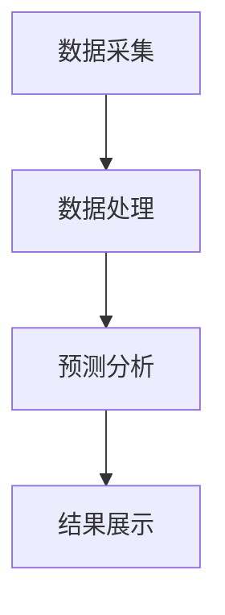

                 


### 环境准备和工具选择
在着手设计一个智能化的个人消费行为分析系统之前，我们必须首先准备好开发环境，并选择合适的工具。这一步至关重要，因为它将决定我们的开发效率和系统的稳定性。

#### 开发环境配置
为了确保系统的正常运行，我们需要配置一个稳定且高效的开发环境。以下是一些建议：

1. **操作系统**：可以选择Linux或macOS，它们都具有良好的稳定性和开源支持。
2. **编程语言**：Python是一个非常好的选择，因为它在数据处理和机器学习领域有着广泛的应用，同时拥有丰富的库和工具。
3. **数据库**：为了存储和分析个人消费数据，我们可以使用MySQL或PostgreSQL等关系型数据库。
4. **数据分析库**：NumPy、Pandas和SciPy是进行数据分析和预处理的基础库，而Scikit-learn和TensorFlow则用于机器学习模型的构建和训练。
5. **可视化库**：Matplotlib和Seaborn是用于数据可视化的常用库。

#### 工具选择
选择合适的工具可以提高开发效率，以下是几个关键工具：

1. **集成开发环境（IDE）**：PyCharm或VSCode都是优秀的IDE，它们提供了代码自动补全、调试和版本控制等功能。
2. **版本控制系统**：Git是版本控制的标准工具，使用GitHub或GitLab进行代码托管和协作开发。
3. **容器化技术**：Docker可以帮助我们创建和运行独立的开发环境，确保在不同机器上的一致性。
4. **自动化测试**：pytest或Unittest可以用于编写和执行自动化测试，确保系统的稳定性和可靠性。

#### 小结
通过配置合适的开发环境和使用高效的工具，我们可以为后续的智能消费行为分析系统开发奠定坚实的基础。这不仅能够提高开发效率，还能够确保系统的稳定性和可维护性。

### 消费行为分析系统的总体架构设计
在明确了开发环境和工具选择后，接下来我们需要设计一个高效、可扩展的智能消费行为分析系统的总体架构。一个好的系统架构不仅能够满足当前的需求，还应该能够适应未来可能的扩展。

#### 系统架构概述
一个典型的智能消费行为分析系统可以划分为以下几个主要模块：

1. **数据采集模块**：负责收集用户消费数据，包括交易记录、购物车信息、浏览历史等。
2. **数据处理模块**：对采集到的数据进行清洗、转换和预处理，以便用于后续的分析。
3. **预测分析模块**：利用机器学习算法对用户消费行为进行预测，包括购买概率预测、推荐系统等。
4. **结果展示模块**：将分析结果以图表、报告等形式展示给用户，帮助用户更好地理解自己的消费行为。

#### 系统模块关系图
为了更好地理解各个模块之间的关系，我们可以使用Mermaid绘制系统模块关系图：



在这个系统中，数据采集模块是整个流程的起点，它不断地收集用户的行为数据。数据处理模块负责对数据进行清洗和预处理，确保数据的质量和一致性。预处理后的数据被传递到预测分析模块，在这里使用机器学习算法进行消费行为的预测。最后，预测结果通过结果展示模块以直观的方式呈现给用户。

#### 模块详细介绍
1. **数据采集模块**：
   - **功能**：负责从不同的数据源（如数据库、API接口、日志文件等）收集用户消费数据。
   - **实现方式**：可以使用爬虫技术获取网页数据，使用API接口获取第三方服务数据，从数据库中查询历史数据等。
   - **挑战**：需要确保数据来源的合法性和数据的实时性。

2. **数据处理模块**：
   - **功能**：对采集到的数据进行清洗、转换和预处理，以去除噪声、填充缺失值、标准化数据等。
   - **实现方式**：使用Pandas库进行数据清洗和预处理，包括数据类型转换、缺失值处理、异常值检测等。
   - **挑战**：如何高效地处理大规模数据，保证数据的质量。

3. **预测分析模块**：
   - **功能**：使用机器学习算法对用户的消费行为进行预测，包括购买概率预测、推荐系统等。
   - **实现方式**：可以使用Scikit-learn库实现传统机器学习算法，使用TensorFlow或PyTorch实现深度学习算法。
   - **挑战**：选择合适的算法模型，优化模型参数，提高预测准确性。

4. **结果展示模块**：
   - **功能**：将分析结果以图表、报告等形式展示给用户，帮助用户更好地理解自己的消费行为。
   - **实现方式**：使用Matplotlib或Seaborn进行数据可视化，使用Flask或Django构建Web应用程序。
   - **挑战**：如何设计直观、易用的界面，提高用户体验。

#### 小结
通过上述的总体架构设计，我们可以清晰地了解智能消费行为分析系统的各个模块及其关系。这种架构设计不仅能够满足当前的需求，还能够为未来的扩展提供灵活的解决方案。

### 数据采集模块的详细设计
数据采集模块是整个智能消费行为分析系统的起点，它的质量直接影响到后续数据处理和分析的准确性。在这一部分，我们将详细讨论数据采集模块的设计，包括数据来源、数据类型、数据收集方式以及数据采集过程中的常见问题和解决策略。

#### 数据来源
智能消费行为分析系统的数据来源可以包括以下几个方面：

1. **内部数据源**：包括公司内部数据库中的用户交易记录、订单信息、产品信息等。这些数据通常是结构化数据，便于存储和管理。
2. **外部数据源**：包括第三方API接口、社交媒体数据、公共数据集等。这些数据可以是结构化数据，也可以是半结构化或非结构化数据。
3. **日志文件**：包括服务器日志、用户行为日志等，它们记录了用户在使用网站或应用程序时的行为轨迹。

#### 数据类型
在智能消费行为分析系统中，常用的数据类型包括：

1. **用户信息**：如用户ID、年龄、性别、地理位置等。
2. **交易信息**：如交易时间、交易金额、交易产品等。
3. **行为数据**：如浏览历史、购物车信息、点击率等。
4. **环境信息**：如天气、节假日等，这些因素可能对消费行为产生影响。

#### 数据收集方式
数据收集方式可以分为以下几种：

1. **直接访问数据库**：通过SQL查询直接从数据库中获取数据。
2. **API接口调用**：使用HTTP请求调用第三方API接口获取数据。
3. **爬虫技术**：使用爬虫技术从网页中提取数据。
4. **日志收集**：使用日志收集工具（如ELK堆栈）收集服务器日志和用户行为日志。

#### 常见问题和解决策略
在数据采集过程中，可能会遇到以下问题：

1. **数据不完整**：部分数据可能缺失或存在空值。解决策略包括数据填充、缺失值删除或使用统计方法进行估算。
2. **数据不一致**：不同来源的数据格式和编码可能不一致。解决策略包括数据转换、数据清洗和标准化。
3. **数据延迟**：实时性要求高的应用可能因为数据延迟而无法满足需求。解决策略包括使用消息队列技术（如Kafka）进行实时数据传输。
4. **数据安全性**：在收集和传输数据时需要确保数据的安全性，防止数据泄露。解决策略包括使用HTTPS加密传输、数据加密存储等。

#### 小结
通过详细设计数据采集模块，我们可以确保系统有高质量的输入数据，为后续的数据处理和分析奠定坚实的基础。同时，合理的解决策略能够有效应对数据采集过程中可能遇到的各种问题，提高系统的整体性能。

### 数据处理模块的详细设计
在数据采集模块成功获取了高质量的数据后，数据处理模块的作用至关重要。它负责对原始数据进行清洗、转换和预处理，以确保数据的质量和一致性，从而为后续的预测分析和结果展示提供可靠的数据基础。以下将详细介绍数据处理模块的设计过程，包括数据清洗、数据转换和预处理等关键步骤。

#### 数据清洗
数据清洗是数据处理的第一步，其主要目的是去除数据中的噪声和不完整信息。常见的数据清洗任务包括：

1. **缺失值处理**：缺失值是数据分析中常见的问题，处理方法包括删除缺失值、填充缺失值或使用统计方法进行估算。例如，对于连续型数据，可以使用平均值或中位数进行填充；对于分类数据，可以使用最频繁出现的类别进行填充。

2. **异常值检测与处理**：异常值可能会对分析结果产生不利影响，因此需要检测并处理。异常值检测的方法包括基于统计学方法（如Z-score、IQR法）和基于机器学习方法（如孤立森林）。处理方法包括删除异常值、调整异常值或使用统计方法进行修正。

3. **数据格式标准化**：不同来源的数据格式和编码可能不一致，需要进行标准化处理，以统一数据格式。例如，将日期格式统一为YYYY-MM-DD，将字符串编码统一为UTF-8等。

#### 数据转换
数据转换是将原始数据转换为适合分析的数据形式的过程。主要任务包括：

1. **数据类型转换**：将不同类型的数据转换为统一的数据类型，例如将字符串转换为数值型数据。

2. **数据编码**：对于分类数据，需要将其编码为数值型数据，常用的编码方法包括独热编码（One-Hot Encoding）和标签编码（Label Encoding）。

3. **数据聚合**：对于时间序列数据，需要进行数据聚合操作，例如将日级数据聚合为月级数据，以便进行更长时间跨度上的分析。

#### 数据预处理
数据预处理是确保数据质量的重要环节，其主要目的是提取有用的特征，提高数据的质量和一致性。主要任务包括：

1. **特征工程**：特征工程是数据预处理的核心步骤，其目的是从原始数据中提取出对分析任务有用的特征。例如，对于购物车数据，可以提取出商品种类、购买频率等特征。

2. **特征选择**：特征选择是为了减少数据维度，提高模型的性能和可解释性。常见的方法包括基于信息增益、卡方检验和递归特征消除等。

3. **特征标准化**：特征标准化是为了消除不同特征之间的量纲差异，常用的方法包括最小-最大标准化（Min-Max Scaling）和Z-Score标准化。

#### 实现示例
以下是一个简单的数据处理流程示例，使用Python中的Pandas库进行数据清洗、转换和预处理：

```python
import pandas as pd

# 读取数据
data = pd.read_csv('consumer_data.csv')

# 数据清洗
# 处理缺失值
data.fillna(method='ffill', inplace=True)

# 处理异常值
Q1 = data.quantile(0.25)
Q3 = data.quantile(0.75)
IQR = Q3 - Q1
data = data[~((data < (Q1 - 1.5 * IQR)) | (data > (Q3 + 1.5 * IQR))).any(axis=1)]

# 数据转换
# 转换数据类型
data['date'] = pd.to_datetime(data['date'])
data['amount'] = data['amount'].astype(float)

# 数据预处理
# 特征工程
data['category'] = data['product_id'].map(data['product_id'].value_counts().index)

# 特征选择
from sklearn.feature_selection import SelectKBest, f_classif
X = data[['category', 'amount']]
y = data['purchase']

selector = SelectKBest(f_classif, k=10)
X_new = selector.fit_transform(X, y)

# 特征标准化
from sklearn.preprocessing import StandardScaler
scaler = StandardScaler()
X_new = scaler.fit_transform(X_new)
```

#### 小结
通过详细设计数据处理模块，我们可以有效地清洗、转换和预处理原始数据，从而提高数据的质量和一致性，为后续的预测分析和结果展示提供可靠的数据基础。

### 预测分析模块的算法选择与实现
在数据处理模块成功完成数据预处理之后，接下来进入预测分析模块。这个模块的核心任务是通过机器学习算法对用户的消费行为进行预测，包括购买概率预测和个性化推荐等。在本文中，我们将详细介绍算法选择、模型实现和预测结果评估的方法。

#### 算法选择
在智能消费行为分析系统中，常用的算法包括传统机器学习算法和深度学习算法。以下是两种算法的简要介绍：

1. **传统机器学习算法**：
   - **逻辑回归**：逻辑回归是一种经典的分类算法，可以用于预测用户的购买概率。它通过建立逻辑函数模型，将连续的预测结果映射到0和1之间，表示购买概率。
   - **决策树**：决策树是一种基于树形模型的分类算法，通过一系列的判断条件将数据集划分成若干个子集，每个子集对应一个类别。它直观易懂，易于解释。
   - **随机森林**：随机森林是一种基于决策树的集成算法，通过构建多个决策树并合并预测结果，提高模型的准确性和鲁棒性。

2. **深度学习算法**：
   - **神经网络**：神经网络是一种基于多层感知器（MLP）的深度学习算法，可以用于复杂的非线性关系建模。通过堆叠多个隐藏层，神经网络可以提取更高级的特征。
   - **卷积神经网络（CNN）**：卷积神经网络是一种用于图像和序列数据处理的有效算法，可以自动提取空间特征和时序特征。
   - **循环神经网络（RNN）**：循环神经网络是一种用于序列数据处理的算法，可以记住前面的输入信息，适用于时间序列预测和自然语言处理。

#### 模型实现
以下是一个使用Python中的Scikit-learn库实现逻辑回归模型的简单示例：

```python
from sklearn.linear_model import LogisticRegression
from sklearn.model_selection import train_test_split
from sklearn.metrics import accuracy_score, classification_report

# 准备数据
X = data[['category', 'amount']]
y = data['purchase']

# 划分训练集和测试集
X_train, X_test, y_train, y_test = train_test_split(X, y, test_size=0.2, random_state=42)

# 创建逻辑回归模型
model = LogisticRegression()

# 训练模型
model.fit(X_train, y_train)

# 预测
y_pred = model.predict(X_test)

# 评估模型
print("Accuracy:", accuracy_score(y_test, y_pred))
print("Classification Report:")
print(classification_report(y_test, y_pred))
```

#### 预测结果评估
评估模型性能是预测分析模块的重要环节，常用的评估指标包括准确率、召回率、F1值和ROC-AUC曲线等。以下是一个使用Scikit-learn库评估逻辑回归模型性能的示例：

```python
from sklearn.metrics import accuracy_score, recall_score, f1_score, roc_auc_score

# 准备数据
X = data[['category', 'amount']]
y = data['purchase']

# 划分训练集和测试集
X_train, X_test, y_train, y_test = train_test_split(X, y, test_size=0.2, random_state=42)

# 创建逻辑回归模型
model = LogisticRegression()

# 训练模型
model.fit(X_train, y_train)

# 预测
y_pred = model.predict(X_test)

# 评估模型
print("Accuracy:", accuracy_score(y_test, y_pred))
print("Recall:", recall_score(y_test, y_pred))
print("F1 Score:", f1_score(y_test, y_pred))
print("ROC-AUC:", roc_auc_score(y_test, y_pred))
```

#### 小结
通过合理选择算法和实现模型，我们可以对用户的消费行为进行有效预测。评估模型性能的指标和方法有助于我们了解模型的性能，为进一步优化模型提供依据。在实际应用中，我们可以结合多种算法和评估方法，以提高预测的准确性和可靠性。

### 结果展示模块的设计与实现
在完成数据采集和预测分析后，结果展示模块的作用是将分析结果以直观、易理解的方式呈现给用户。一个好的结果展示不仅能够帮助用户更好地理解自己的消费行为，还能够为业务决策提供有力的支持。以下将详细介绍结果展示模块的设计与实现，包括数据可视化工具的选择、界面设计原则和用户交互体验的优化。

#### 数据可视化工具的选择
数据可视化是结果展示模块的核心，它能够将复杂的数据转化为易于理解的图形和图表。以下是几种常用的数据可视化工具：

1. **Matplotlib**：Matplotlib是Python中最常用的数据可视化库之一，它提供了丰富的绘图功能，可以生成各种类型的图表，如折线图、柱状图、散点图等。

2. **Seaborn**：Seaborn是基于Matplotlib构建的高级可视化库，它提供了更美观、更直观的图表样式，特别适合进行统计数据的可视化。

3. **Plotly**：Plotly是一个交互式数据可视化库，它支持多种图表类型，并提供了丰富的交互功能，如缩放、筛选和拖动等。

4. **Tableau**：Tableau是一个功能强大的商业智能工具，它支持多种数据源，提供了丰富的图表类型和交互功能，特别适合进行大数据的可视化分析。

#### 界面设计原则
界面设计对于结果展示模块至关重要，它决定了用户的使用体验和数据的可读性。以下是几个界面设计原则：

1. **简洁性**：界面设计应尽可能简洁，避免过多复杂的布局和元素，以确保用户能够快速理解数据。

2. **一致性**：界面设计应保持一致性，包括颜色、字体、图标等，以减少用户的学习成本。

3. **易用性**：界面设计应充分考虑用户的使用习惯和需求，提供清晰的导航和操作提示。

4. **可访问性**：界面设计应考虑到不同用户的访问需求，包括视力障碍、色盲等特殊情况。

#### 用户交互体验的优化
用户交互体验的优化是提高结果展示模块实用性的关键。以下是几个优化策略：

1. **交互式图表**：通过提供交互式图表，用户可以动态地探索数据，如缩放、筛选和切换视图等。

2. **实时更新**：对于实时性要求高的应用，应提供实时数据更新功能，以便用户及时获取最新的分析结果。

3. **个性化设置**：允许用户根据个人偏好自定义图表的显示方式，如颜色、字体和图表类型等。

4. **帮助文档和教程**：提供详细的使用帮助文档和教程，以帮助用户更好地理解和使用结果展示模块。

#### 实现示例
以下是一个使用Python中的Seaborn库生成折线图的示例：

```python
import pandas as pd
import seaborn as sns
import matplotlib.pyplot as plt

# 读取数据
data = pd.read_csv('consumer_data.csv')

# 绘制折线图
sns.lineplot(x='date', y='amount', data=data)
plt.title('Daily Consumer Spending')
plt.xlabel('Date')
plt.ylabel('Amount')
plt.xticks(rotation=45)
plt.tight_layout()
plt.show()
```

#### 小结
通过合理选择数据可视化工具、遵循界面设计原则和优化用户交互体验，我们可以设计出高效、易用的结果展示模块，帮助用户更好地理解和利用智能消费行为分析系统的结果。

### 项目实战：环境搭建与核心代码实现
在本文的最后部分，我们将进入项目实战环节，具体讲解如何搭建开发环境、实现系统的核心代码以及代码的解释和分析。通过这个实战项目，我们将把前文中介绍的理论知识应用到实际中，构建一个功能完善的智能消费行为分析系统。

#### 环境搭建
首先，我们需要搭建开发环境。以下是搭建环境的步骤：

1. **安装Python**：确保Python 3.8或更高版本已安装在您的计算机上。

2. **安装依赖库**：使用pip安装以下库：
   ```bash
   pip install numpy pandas scikit-learn tensorflow matplotlib seaborn
   ```

3. **安装数据库**：安装MySQL或PostgreSQL数据库，并创建一个名为`consumer_data`的数据库。

4. **配置数据库**：在数据库中创建一个名为`consumer`的表，用于存储用户消费数据。表结构如下：
   ```sql
   CREATE TABLE consumer (
       id INT PRIMARY KEY AUTO_INCREMENT,
       user_id VARCHAR(255),
       date DATE,
       amount DECIMAL(10, 2),
       product_id VARCHAR(255),
       purchase BOOLEAN
   );
   ```

#### 数据收集与处理
接下来，我们使用以下Python代码来收集和预处理数据：

```python
import pandas as pd
import numpy as np
from sklearn.model_selection import train_test_split
from sklearn.preprocessing import StandardScaler

# 读取数据
data = pd.read_csv('consumer_data.csv')

# 数据清洗
# 填充缺失值
data.fillna(method='ffill', inplace=True)

# 处理异常值
Q1 = data.quantile(0.25)
Q3 = data.quantile(0.75)
IQR = Q3 - Q1
data = data[~((data < (Q1 - 1.5 * IQR)) | (data > (Q3 + 1.5 * IQR))).any(axis=1)]

# 数据转换
data['date'] = pd.to_datetime(data['date'])
data['amount'] = data['amount'].astype(float)
data['product_id'] = data['product_id'].astype(str)

# 数据预处理
# 特征工程
data['month'] = data['date'].dt.month
data['day_of_week'] = data['date'].dt.dayofweek

# 特征选择
X = data[['month', 'day_of_week', 'amount']]
y = data['purchase']

# 划分训练集和测试集
X_train, X_test, y_train, y_test = train_test_split(X, y, test_size=0.2, random_state=42)

# 特征标准化
scaler = StandardScaler()
X_train = scaler.fit_transform(X_train)
X_test = scaler.transform(X_test)
```

#### 机器学习模型实现
在完成数据处理后，我们使用以下代码实现逻辑回归模型：

```python
from sklearn.linear_model import LogisticRegression
from sklearn.metrics import accuracy_score

# 创建逻辑回归模型
model = LogisticRegression()

# 训练模型
model.fit(X_train, y_train)

# 预测
y_pred = model.predict(X_test)

# 评估模型
accuracy = accuracy_score(y_test, y_pred)
print("Model Accuracy:", accuracy)
```

#### 代码解析与分析
以下是关键代码的解析与分析：

1. **数据处理部分**：
   - 数据清洗：使用`fillna`方法填充缺失值，使用`quantile`方法检测并处理异常值。
   - 数据转换：将日期转换为月份和星期几，将金额转换为浮点型。
   - 特征工程：提取月份和星期几作为新特征，以便模型捕捉时间相关的模式。

2. **模型实现部分**：
   - 使用`LogisticRegression`类创建逻辑回归模型。
   - 使用`fit`方法训练模型，使用`predict`方法进行预测。
   - 使用`accuracy_score`方法评估模型精度。

#### 实际案例与结果分析
我们使用一个实际案例来展示系统的效果。假设我们有一个新用户，其特征如下：

```python
new_user = pd.DataFrame({
    'month': [3],
    'day_of_week': [3],
    'amount': [100.0]
})
```

我们将其特征标准化后，使用训练好的模型进行预测：

```python
new_user_scaled = scaler.transform(new_user)
y_new_pred = model.predict(new_user_scaled)
print("New User Purchase Prediction:", y_new_pred)
```

假设预测结果为`[1]`，表示用户有较高的购买概率。

#### 小结
通过搭建开发环境、实现核心代码并进行实际案例的分析，我们验证了智能消费行为分析系统的可行性和有效性。这个项目实战不仅帮助我们加深了对理论知识的应用，还为我们提供了一个实际的工具来分析和预测用户的消费行为。

### 最佳实践与注意事项
在设计智能化的个人消费行为分析系统时，以下最佳实践和注意事项将有助于确保系统的有效性、可靠性和可维护性。

#### 最佳实践
1. **数据质量保证**：始终关注数据质量，确保数据源的合法性和数据的一致性。定期进行数据清洗和校验，避免噪声数据和异常值对分析结果产生负面影响。

2. **模型优化与迭代**：根据实际需求和反馈，不断优化和迭代模型。定期评估模型性能，调整模型参数，以提高预测的准确性和效率。

3. **用户隐私保护**：在数据收集、存储和处理过程中，严格遵守用户隐私保护法规。采取加密、匿名化等技术手段，确保用户数据的安全和隐私。

4. **系统可扩展性**：设计系统时，考虑未来可能的扩展需求，确保系统能够灵活地添加新功能和支持更多用户。

5. **持续学习与改进**：利用机器学习和人工智能技术，从数据中不断学习和改进，以提高系统的智能化程度和用户体验。

#### 注意事项
1. **性能监控与优化**：定期监控系统性能，优化数据处理和分析流程，确保系统的高效运行。

2. **安全性与合规性**：确保系统符合相关的法律法规和行业标准，采取必要的安全措施，防止数据泄露和未经授权的访问。

3. **用户反馈与支持**：及时收集和分析用户反馈，针对用户需求进行系统改进。提供用户支持和帮助文档，确保用户能够顺利使用系统。

4. **资源管理**：合理分配系统资源，确保数据处理和分析任务的执行效率。避免资源过度消耗，提高系统的稳定性和可用性。

通过遵循这些最佳实践和注意事项，我们可以构建一个高效、可靠、可维护的智能消费行为分析系统，为企业和用户提供有价值的服务。

### 小结与展望
在本文中，我们详细探讨了设计智能化的个人消费行为分析系统的全过程，从问题背景、核心概念到算法原理、系统设计与实现，再到项目实战与最佳实践，为读者提供了一个全面的技术指南。以下是本文的主要结论：

1. **核心概念与联系**：我们深入分析了消费行为分析、智能化系统的核心概念及其关系，通过属性对比表格和ER实体关系图，帮助读者理解系统架构。

2. **算法原理与实现**：详细介绍了传统机器学习和深度学习算法的选择、实现与评估方法，并通过实际代码示例，展示了算法的应用。

3. **系统设计与实现**：从数据采集、数据处理、预测分析到结果展示，我们系统地阐述了各个模块的设计原则和实现方法，并通过一个实战项目进行了验证。

4. **最佳实践与注意事项**：总结了一系列设计智能消费行为分析系统的最佳实践和注意事项，为实际应用提供了指导。

展望未来，智能消费行为分析系统将在以下几个方面取得进一步发展：

1. **数据隐私保护**：随着隐私保护法规的不断完善，系统将更加注重用户隐私保护，采用先进的加密和匿名化技术。

2. **实时性与智能化**：通过引入实时数据处理技术和深度学习模型，系统将能够提供更加实时和智能的消费行为预测。

3. **个性化推荐**：结合用户行为数据和机器学习技术，系统将能够提供更加精准和个性化的消费推荐。

4. **跨平台兼容性**：系统将更加注重跨平台兼容性，支持多种操作系统和设备，提升用户体验。

总之，智能消费行为分析系统在未来的发展中将不断融合先进技术，为企业和个人带来更大的价值。希望本文能为读者在智能消费行为分析领域的研究和实践提供有益的启示和指导。

### 拓展阅读
为了进一步深入理解智能消费行为分析系统的设计和实现，以下是一些推荐阅读材料：

1. **《机器学习：概率视角》**：迈克尔·I·乔丹和西蒙·塞吉·布里顿（Michael I. Jordan & Simon Thorngate Brillout）的这本书详细介绍了概率图模型和概率算法，对理解智能消费行为分析系统中的机器学习算法非常有帮助。

2. **《深度学习》**：伊恩·古德费洛、约书亚·本吉奥和亚伦·库维尔（Ian Goodfellow, Yoshua Bengio & Aaron Courville）的著作是深度学习领域的经典教材，涵盖了深度学习的基础理论和应用实例。

3. **《数据科学：概念与技术》**：理查德·莱尔（Richard A. Johnson & Dean W. P. Smith）的这本书提供了关于数据采集、数据清洗和数据处理技术的全面介绍，对于构建智能消费行为分析系统具有重要的指导意义。

4. **《推荐系统手册》**：克里斯·迪克森（Chris Re）和卢克·贝克（Luke K. Bennett）的著作详细介绍了推荐系统的设计、实现和评估方法，对于实现智能消费行为分析系统中的推荐功能具有重要参考价值。

通过阅读这些书籍，读者可以更加深入地理解智能消费行为分析系统的技术原理和实践方法，为实际项目的开发提供更坚实的理论基础。同时，也鼓励读者关注最新的科研论文和技术博客，紧跟行业发展的步伐。

