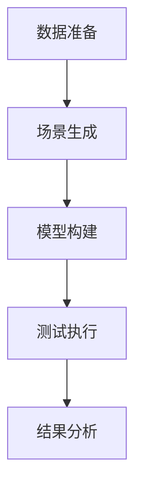

                 

### 第一部分：背景介绍

#### 第1章：问题背景

##### 1.1 问题背景

在现代商业环境中，企业财务的健康状况对于其长期成功至关重要。财务压力测试作为一种评估企业在面临不同财务场景下稳健性的工具，已经成为了企业财务管理的核心环节。财务压力测试的主要目的是通过模拟各种极端情况，如市场波动、供应链中断、政策变化等，来检测企业的财务系统是否能够承受这些压力，从而提前识别潜在风险，做出相应的调整。

然而，传统的财务压力测试往往依赖于人工模拟和手动执行，这不仅耗时耗力，而且可能因为人的主观因素导致结果的不准确性。随着人工智能技术的发展，智能化财务压力测试系统逐渐成为了企业财务压力测试领域的一个热点话题。智能化财务压力测试系统能够利用人工智能算法和大数据分析技术，自动生成测试场景，实时分析财务数据，提供精准的测试结果，从而提高测试的效率和质量。

##### 1.2 当前企业财务压力测试的现状

目前，许多企业已经开始意识到财务压力测试的重要性，并逐步引入了相关的测试方法和工具。然而，大多数企业的财务压力测试仍然处于初级阶段，存在以下问题：

1. **测试手段单一**：主要依赖手工模拟和手动执行，难以覆盖各种可能的财务场景。
2. **测试频率低**：由于测试成本高和执行难度大，企业往往无法进行高频次的压力测试。
3. **数据依赖性低**：测试过程中对历史数据和财务模型的使用较少，导致测试结果的可信度不高。
4. **结果分析不足**：测试后缺乏有效的分析工具和手段，无法深入挖掘潜在的风险点。

##### 1.3 智能化在财务压力测试中的应用潜力

智能化财务压力测试系统通过集成人工智能技术，具有显著的优势：

1. **测试场景自动生成**：利用机器学习算法，可以从大量历史数据中自动生成各种测试场景，提高测试的全面性和准确性。
2. **实时数据分析和预警**：通过实时分析企业的财务数据，智能化系统可以迅速发现潜在风险，并提供及时的预警信息。
3. **测试结果深度分析**：利用大数据分析技术，智能化系统可以对测试结果进行深度分析，识别出企业财务系统中的薄弱环节。
4. **提高测试效率**：自动化测试流程减少了人工干预，大大提高了测试的效率。
5. **成本效益**：虽然初期投入较大，但长期来看，智能化系统可以显著降低财务压力测试的成本。

综上所述，设计智能化企业财务压力测试系统具有重要的现实意义。它不仅能够提升企业财务管理的精细化水平，还能为企业提供更加稳定和可靠的财务支持，从而在激烈的市场竞争中立于不败之地。

---

#### 第2章：核心概念

##### 2.1 财务压力测试

###### 2.1.1 财务压力测试的定义

财务压力测试是指通过模拟各种极端经济、市场和政策环境，对企业的财务状况进行系统性评估，以识别潜在风险和评估企业的财务稳健性。这一过程通常包括以下步骤：

1. **场景设计**：根据企业的业务特点和潜在风险，设计各种可能出现的压力场景。
2. **数据准备**：收集企业的历史财务数据和相关市场数据，为测试提供基础。
3. **模型建立**：构建财务模型，将企业财务数据和市场数据结合起来，模拟各种压力场景下的财务表现。
4. **测试执行**：运行财务模型，分析企业在不同压力场景下的表现。
5. **结果分析**：对测试结果进行分析，评估企业的财务稳健性和潜在风险。

###### 2.1.2 财务压力测试的目标

财务压力测试的主要目标是：

1. **评估风险**：通过模拟不同场景，评估企业面临的各种财务风险。
2. **优化管理**：发现企业财务管理的薄弱环节，提出改进措施。
3. **增强信心**：提供有依据的财务报告，增强企业和管理层的信心。
4. **合规性检查**：确保企业的财务报告符合相关法规和标准。

###### 2.1.3 财务压力测试的分类

根据测试的对象和目的，财务压力测试可以分为以下几类：

1. **按对象分类**：
   - **单体财务压力测试**：主要针对单个企业的财务状况进行测试。
   - **集团财务压力测试**：针对企业集团的整体财务状况进行测试，包括子公司和分支机构的财务数据。

2. **按场景分类**：
   - **经济波动测试**：模拟经济衰退、通货膨胀等宏观经济环境对企业财务的影响。
   - **市场波动测试**：模拟金融市场波动（如股票、汇率、利率等）对企业财务的影响。
   - **政策变化测试**：模拟政策变化（如税收政策、监管政策等）对企业财务的影响。

##### 2.2 智能化财务压力测试

###### 2.2.1 智能化的定义

智能化是指利用计算机技术和算法，使系统具备类似人类的智能能力，能够自主学习和适应环境，完成复杂的任务。在财务压力测试领域，智能化主要指的是利用机器学习和人工智能技术，提升财务压力测试的自动化程度、准确性和效率。

###### 2.2.2 智能化财务压力测试的特点

智能化财务压力测试具有以下特点：

1. **自动化程度高**：通过算法自动生成测试场景和执行测试，大大减少了人工干预。
2. **实时性**：能够实时分析财务数据，提供及时的预警和反馈。
3. **全面性**：通过大数据分析和机器学习，可以覆盖更多的测试场景，提高测试的全面性。
4. **准确性**：利用先进的数据分析和算法，提高测试结果的准确性和可靠性。
5. **效率提升**：自动化测试流程和实时数据分析，显著提高了测试的效率。

###### 2.2.3 智能化财务压力测试的挑战与机遇

1. **挑战**：
   - **数据质量**：智能化财务压力测试依赖于高质量的数据，数据质量直接影响测试结果的准确性。
   - **算法可靠性**：算法的可靠性和稳定性是智能化财务压力测试成功的关键。
   - **技术实现**：实现智能化财务压力测试系统需要强大的技术支持，包括数据处理、机器学习和系统集成等方面。

2. **机遇**：
   - **降低成本**：自动化测试和实时数据分析可以显著降低测试成本。
   - **提升效率**：通过智能化测试，企业可以更高效地识别和应对潜在风险。
   - **增强决策支持**：智能化财务压力测试可以提供更准确、更全面的财务分析，为管理层提供有力决策支持。

综上所述，智能化财务压力测试不仅能够解决传统财务压力测试面临的问题，还为企业在财务管理方面带来了新的机遇和挑战。通过设计智能化财务压力测试系统，企业可以更好地应对复杂多变的市场环境，提高财务管理的精细化和智能化水平。

---

### 第3章：财务压力测试系统的架构

#### 3.1 系统架构概述

财务压力测试系统的架构设计需要考虑系统的模块化、可扩展性和稳定性。一个典型的智能化财务压力测试系统可以分为以下几个主要部分：

1. **数据采集模块**：负责从各种数据源（如企业财务系统、外部市场数据、历史财务数据等）采集所需数据。
2. **数据处理模块**：对采集到的数据进行清洗、转换和整合，确保数据质量，为后续测试提供可靠的数据基础。
3. **测试场景生成模块**：利用机器学习算法和大数据分析技术，自动生成各种压力测试场景。
4. **测试执行模块**：根据生成的测试场景，执行压力测试，模拟企业财务系统在不同场景下的表现。
5. **结果分析模块**：对测试结果进行深入分析，识别潜在风险点，并提供可视化报告。
6. **接口和服务模块**：提供与其他系统（如企业财务系统、报表系统等）的接口，实现数据交换和功能集成。

#### 3.2 数据采集与处理

###### 3.2.1 数据来源

数据采集模块的主要任务是从多个数据源获取所需的数据。这些数据源包括：

1. **企业财务系统**：包括企业内部的财务数据，如收入、支出、资产负债表、利润表等。
2. **外部市场数据**：包括金融市场数据，如股票价格、汇率、利率、通货膨胀率等。
3. **历史财务数据**：包括过去几年的财务数据，用于构建财务模型和测试场景。

###### 3.2.2 数据采集方法

数据采集方法通常包括以下几种：

1. **API调用**：通过企业财务系统和外部数据源的API接口，自动获取数据。
2. **文件导入**：通过导入Excel、CSV等文件格式，从外部数据源获取数据。
3. **网络爬虫**：利用网络爬虫技术，从互联网上获取公开的财务数据和市场数据。

###### 3.2.3 数据处理流程

数据处理模块对采集到的数据进行一系列的处理，确保数据质量，为后续测试提供可靠的数据基础。数据处理流程通常包括以下步骤：

1. **数据清洗**：去除数据中的噪声和错误，如缺失值、异常值等。
2. **数据转换**：将数据格式转换为统一的格式，如将不同的货币单位转换为同一货币单位。
3. **数据整合**：将来自不同数据源的数据进行整合，形成完整的财务数据集。

在数据整合过程中，需要特别注意以下问题：

1. **数据一致性**：确保不同来源的数据在时间、货币单位等方面的一致性。
2. **数据完整性**：确保数据覆盖了所有的关键变量和场景。
3. **数据安全性**：在数据采集和处理过程中，要确保数据的安全性和保密性。

通过上述数据处理流程，财务压力测试系统可以获得高质量、可靠的数据基础，为后续的测试和分析提供支持。

---

### 第4章：核心算法与数学模型

#### 4.1 压力测试算法原理

财务压力测试算法的核心目的是通过模拟不同场景，评估企业在这些极端条件下的财务表现。下面将详细介绍压力测试算法的基本原理和实现步骤。

##### 4.1.1 算法基本原理

压力测试算法的基本原理可以概括为以下几步：

1. **数据准备**：首先，从企业财务系统和其他数据源采集所需的数据，包括历史财务数据、市场数据等。
2. **场景生成**：利用机器学习算法，根据历史数据和市场数据，自动生成各种可能的压力测试场景。这些场景包括经济波动、市场波动、政策变化等。
3. **模型构建**：基于采集到的数据，构建财务模型，模拟企业在不同场景下的财务表现。
4. **测试执行**：根据生成的场景，执行压力测试，模拟企业财务系统在不同场景下的运行情况。
5. **结果分析**：对测试结果进行分析，评估企业的财务稳健性和潜在风险。

##### 4.1.2 算法流程图

为了更清晰地展示算法的流程，可以使用Mermaid绘制算法流程图。以下是压力测试算法的流程图：



在上面的流程图中，A表示数据准备，B表示场景生成，C表示模型构建，D表示测试执行，E表示结果分析。通过这一流程，可以系统地完成财务压力测试的全过程。

##### 4.1.3 算法实现步骤

具体的算法实现步骤如下：

1. **数据准备**：首先，从企业财务系统和外部数据源采集数据，包括财务数据（如收入、支出、资产负债等）和市场数据（如利率、汇率、通货膨胀率等）。这些数据将被用于构建财务模型和生成测试场景。

2. **场景生成**：利用时间序列分析和机器学习算法，分析历史数据和当前市场情况，自动生成各种可能的压力测试场景。这些场景将模拟经济波动、市场波动和政策变化等多种极端条件。

3. **模型构建**：基于采集到的数据，构建财务模型。财务模型将模拟企业在不同场景下的财务表现，包括收入、支出、资产负债、利润等关键财务指标。常见的财务模型包括线性回归模型、时间序列模型、神经网络模型等。

4. **测试执行**：根据生成的测试场景，运行财务模型，模拟企业在这些场景下的运行情况。测试执行过程中，需要实时监测模型的输出结果，记录关键指标的变化情况。

5. **结果分析**：对测试结果进行分析，评估企业的财务稳健性和潜在风险。分析结果可以包括以下内容：

   - 各个测试场景下的关键财务指标变化情况。
   - 潜在风险点的识别和评估。
   - 企业财务系统的响应速度和稳定性。
   - 改进建议和优化方案。

#### 4.2 数学模型与公式

财务压力测试的数学模型是评估企业财务稳健性的关键。下面将介绍财务压力测试的数学模型，并使用LaTeX格式进行详细讲解。

##### 4.2.1 模型基本假设

在构建财务压力测试模型时，通常需要进行以下基本假设：

1. **线性关系**：假设企业的收入、支出、利润等财务指标与外部经济环境之间存在线性关系。
2. **平稳性**：假设历史数据和当前市场数据满足时间序列的平稳性，即数据的变化趋势是稳定的。
3. **独立性**：假设各个财务指标的变化是相互独立的，不受其他变量影响。

##### 4.2.2 数学模型公式

财务压力测试的数学模型通常包括以下公式：

1. **收入模型**：

   $$ R(t) = \alpha_0 + \alpha_1 \cdot E(t) + \alpha_2 \cdot P(t) + \epsilon(t) $$

   其中，\( R(t) \) 表示企业在时间 \( t \) 的收入，\( E(t) \) 表示外部经济环境因素（如通货膨胀率），\( P(t) \) 表示政策变化因素，\( \alpha_0, \alpha_1, \alpha_2 \) 是模型参数，\( \epsilon(t) \) 是误差项。

2. **支出模型**：

   $$ C(t) = \beta_0 + \beta_1 \cdot E(t) + \beta_2 \cdot P(t) + \delta(t) $$

   其中，\( C(t) \) 表示企业在时间 \( t \) 的支出，其他符号的含义与收入模型相同。

3. **利润模型**：

   $$ \pi(t) = R(t) - C(t) $$

   其中，\( \pi(t) \) 表示企业在时间 \( t \) 的利润。

4. **资产负债模型**：

   $$ A(t) = \gamma_0 + \gamma_1 \cdot R(t) + \gamma_2 \cdot C(t) + \eta(t) $$

   其中，\( A(t) \) 表示企业在时间 \( t \) 的资产负债，其他符号的含义与收入模型相同。

##### 4.2.3 公式详细讲解

1. **收入模型**：

   收入模型反映了企业的收入与外部经济环境和政策变化之间的关系。其中，\( \alpha_1 \) 和 \( \alpha_2 \) 分别表示外部经济环境和政策变化对收入的影响程度。误差项 \( \epsilon(t) \) 考虑了模型无法解释的其他因素。

2. **支出模型**：

   支出模型反映了企业的支出与外部经济环境和政策变化之间的关系。其中，\( \beta_1 \) 和 \( \beta_2 \) 分别表示外部经济环境和政策变化对支出的影响程度。误差项 \( \delta(t) \) 考虑了模型无法解释的其他因素。

3. **利润模型**：

   利润模型是收入模型和支出模型的差值，表示企业的利润。这个模型可以帮助我们了解企业在不同场景下的盈利能力。

4. **资产负债模型**：

   资产负债模型反映了企业的资产负债与收入、支出之间的关系。这个模型可以帮助我们了解企业在不同场景下的资产和负债状况。

通过上述数学模型，我们可以从定量角度评估企业的财务稳健性和潜在风险。这些模型不仅可以用于压力测试，还可以用于财务预测和决策支持。

---

#### 第5章：系统分析与架构设计

##### 5.1 问题场景介绍

为了更好地理解和分析财务压力测试系统的架构设计，我们需要先介绍一个具体的问题场景。假设我们是一家大型跨国企业的财务部门，我们需要设计一个智能化财务压力测试系统来评估企业在不同市场环境和政策变化下的财务表现。

该场景的具体需求如下：

1. **数据采集**：系统需要从企业内部财务系统和外部市场数据源（如股票市场、汇率市场、利率市场等）采集数据。
2. **测试场景生成**：系统需要利用机器学习算法，根据历史数据和当前市场情况，自动生成各种压力测试场景，如经济衰退、市场波动、政策变化等。
3. **模型构建与测试执行**：系统需要基于采集到的数据，构建财务模型，并模拟企业在不同场景下的财务表现，包括收入、支出、利润、资产负债等关键财务指标。
4. **结果分析与可视化**：系统需要分析测试结果，识别潜在风险点，并提供可视化报告，以便管理层了解企业的财务状况和风险水平。
5. **接口与服务**：系统需要提供与其他系统（如企业财务系统、报表系统等）的接口，实现数据交换和功能集成。

##### 5.2 系统功能设计

为了满足上述需求，我们需要设计一套完整的系统功能，主要包括以下模块：

1. **数据采集模块**：负责从企业内部财务系统和外部市场数据源采集数据。
2. **数据处理模块**：负责对采集到的数据进行清洗、转换和整合，确保数据质量。
3. **测试场景生成模块**：负责利用机器学习算法生成各种压力测试场景。
4. **模型构建与测试执行模块**：负责构建财务模型，并执行压力测试，模拟企业在不同场景下的财务表现。
5. **结果分析与可视化模块**：负责分析测试结果，识别潜在风险点，并提供可视化报告。
6. **接口与服务模块**：负责提供与其他系统的接口，实现数据交换和功能集成。

##### 5.3 系统架构设计

系统架构设计是确保系统功能实现的关键步骤。在上述问题场景的基础上，我们可以设计一个分布式系统架构，以提高系统的性能和可扩展性。以下是系统架构设计的详细描述：

1. **数据层**：数据层包括企业内部财务系统和外部市场数据源，如股票市场、汇率市场、利率市场等。数据采集模块负责从这些数据源采集数据，并将其存储在分布式数据库中。

2. **数据处理层**：数据处理层负责对采集到的数据进行清洗、转换和整合，确保数据质量。数据处理层包括数据清洗模块、数据转换模块和数据整合模块。清洗模块负责去除数据中的噪声和错误，转换模块负责将数据格式转换为统一的格式，整合模块负责将来自不同数据源的数据进行整合，形成完整的财务数据集。

3. **测试场景生成层**：测试场景生成层负责利用机器学习算法生成各种压力测试场景。测试场景生成层包括数据预处理模块、机器学习算法模块和场景生成模块。数据预处理模块负责对历史数据进行预处理，算法模块负责利用机器学习算法生成测试场景，场景生成模块负责将生成的场景存储在数据库中。

4. **模型构建与测试执行层**：模型构建与测试执行层负责构建财务模型，并执行压力测试，模拟企业在不同场景下的财务表现。该层包括模型构建模块、测试执行模块和结果存储模块。模型构建模块负责根据采集到的数据构建财务模型，测试执行模块负责根据生成的测试场景执行压力测试，结果存储模块负责将测试结果存储在数据库中。

5. **结果分析与可视化层**：结果分析与可视化层负责分析测试结果，识别潜在风险点，并提供可视化报告。该层包括结果分析模块、可视化模块和报告生成模块。分析模块负责对测试结果进行深入分析，可视化模块负责生成各种图表和报告，报告生成模块负责将分析结果和可视化报告生成文档。

6. **接口与服务层**：接口与服务层负责提供与其他系统的接口，实现数据交换和功能集成。该层包括接口定义模块、接口实现模块和功能集成模块。接口定义模块负责定义系统与其他系统之间的接口规范，接口实现模块负责实现这些接口，功能集成模块负责将系统功能与其他系统集成。

##### 5.4 系统接口设计

系统接口设计是确保系统功能实现的关键环节。以下是系统接口设计的详细描述：

1. **内部接口**：内部接口主要负责系统内部模块之间的数据交换和功能调用。包括数据采集模块与数据处理模块之间的接口、数据处理模块与测试场景生成模块之间的接口、测试场景生成模块与模型构建模块之间的接口等。

2. **外部接口**：外部接口主要负责系统与外部系统之间的数据交换和功能调用。包括系统与企业财务系统之间的接口、系统与报表系统之间的接口等。外部接口需要遵循统一的接口规范，以确保数据交换的准确性和可靠性。

##### 5.5 系统交互

系统交互是确保系统各模块之间协调工作的关键。以下是系统交互的详细描述：

1. **数据交互**：系统内部各模块之间通过内部接口进行数据交互。例如，数据采集模块将采集到的数据传递给数据处理模块，数据处理模块将处理后的数据传递给测试场景生成模块。

2. **功能调用**：系统内部各模块之间通过内部接口进行功能调用。例如，测试场景生成模块调用模型构建模块的功能来构建财务模型，模型构建模块调用测试执行模块的功能来执行压力测试。

3. **外部交互**：系统与外部系统之间通过外部接口进行数据交换和功能调用。例如，系统与企业财务系统之间通过接口交换财务数据，系统与报表系统之间通过接口生成财务报告。

通过上述系统分析与架构设计，我们可以设计出一套完整、高效、可扩展的财务压力测试系统。该系统不仅能够满足企业的需求，还能够应对未来市场环境的变化，为企业提供持续的财务支持。

---

### 第6章：环境安装与配置

#### 6.1 环境要求

为了确保智能化财务压力测试系统顺利安装和运行，需要准备以下环境：

1. **操作系统**：推荐使用Linux操作系统，如Ubuntu 18.04或CentOS 7。
2. **硬件要求**：推荐配置为CPU：Intel i7以上，内存：16GB以上，硬盘：500GB以上。
3. **软件要求**：
   - Python 3.8或更高版本
   - MySQL 5.7或更高版本
   - Git 2.20或更高版本
   - Docker 19.03或更高版本
   - Jupyter Notebook

#### 6.2 系统安装

安装步骤如下：

1. **安装操作系统**：根据硬件选择适合的操作系统，并完成安装。
2. **更新系统**：在终端中执行以下命令更新系统软件包：
   ```bash
   sudo apt update
   sudo apt upgrade
   ```
3. **安装Python**：使用pip命令安装Python 3.8或更高版本：
   ```bash
   sudo apt install python3.8
   ```
4. **安装MySQL**：使用以下命令安装MySQL 5.7或更高版本：
   ```bash
   sudo apt install mysql-server
   ```
5. **安装Git**：使用以下命令安装Git 2.20或更高版本：
   ```bash
   sudo apt install git
   ```
6. **安装Docker**：使用以下命令安装Docker 19.03或更高版本：
   ```bash
   sudo apt install docker-ce
   ```
7. **安装Jupyter Notebook**：使用以下命令安装Jupyter Notebook：
   ```bash
   pip3 install notebook
   ```

#### 6.3 系统配置

配置步骤如下：

1. **配置MySQL**：启动MySQL服务，并设置root密码：
   ```bash
   sudo systemctl start mysql
   sudo mysql_secure_installation
   ```
   在过程中选择设置root用户密码、删除匿名用户、禁止root远程登录等选项。

2. **配置Docker**：确保Docker服务正常运行：
   ```bash
   sudo systemctl start docker
   sudo systemctl enable docker
   ```
3. **创建系统用户**：创建一个系统用户用于运行财务压力测试系统：
   ```bash
   sudo adduser <用户名>
   sudo usermod <用户名> -aG docker
   sudo su - <用户名>
   ```
4. **安装依赖库**：在终端中执行以下命令安装所需依赖库：
   ```bash
   pip3 install numpy pandas matplotlib scikit-learn
   ```

5. **克隆项目**：从Git仓库克隆财务压力测试系统的源代码：
   ```bash
   git clone https://github.com/<仓库地址>.git
   cd <项目名>
   ```

6. **配置数据库连接**：在项目的配置文件中填写MySQL数据库的连接信息，如数据库用户、密码和数据库名。

7. **启动Jupyter Notebook**：在终端中启动Jupyter Notebook，方便后续的开发和调试：
   ```bash
   jupyter notebook
   ```

通过以上步骤，我们成功安装和配置了智能化财务压力测试系统的基础环境。接下来，我们将开始系统的核心代码实现。

---

#### 第7章：系统核心实现

##### 7.1 核心代码实现

在智能化财务压力测试系统的实现过程中，核心代码是整个系统的核心部分。以下将展示系统中的关键代码实现，并对其进行详细解读。

##### 7.1.1 Python源代码

```python
import numpy as np
import pandas as pd
from sklearn.ensemble import RandomForestRegressor
from sklearn.model_selection import train_test_split
from sklearn.metrics import mean_squared_error
import mysql.connector
import matplotlib.pyplot as plt

# 连接MySQL数据库
def connect_database():
    config = {
        'host': 'localhost',
        'user': 'root',
        'password': 'your_password',
        'database': 'your_database'
    }
    connection = mysql.connector.connect(**config)
    return connection

# 读取财务数据
def read_finance_data(connection):
    cursor = connection.cursor()
    cursor.execute("SELECT * FROM finance_data;")
    rows = cursor.fetchall()
    data = pd.DataFrame(rows, columns=['date', 'revenue', 'cost', 'profit'])
    return data

# 数据预处理
def preprocess_data(data):
    data['date'] = pd.to_datetime(data['date'])
    data.set_index('date', inplace=True)
    data.fillna(method='ffill', inplace=True)
    return data

# 构建财务模型
def build_finance_model(data):
    X = data[['revenue', 'cost']]
    y = data['profit']
    X_train, X_test, y_train, y_test = train_test_split(X, y, test_size=0.2, random_state=42)
    model = RandomForestRegressor(n_estimators=100)
    model.fit(X_train, y_train)
    return model, X_test, y_test

# 执行压力测试
def execute_stress_test(model, X_test, y_test):
    predictions = model.predict(X_test)
    mse = mean_squared_error(y_test, predictions)
    print(f"Mean Squared Error: {mse}")
    plot_predictions(predictions, y_test)

# 绘制预测结果
def plot_predictions(predictions, actual):
    plt.figure(figsize=(10, 5))
    plt.plot(actual, label='Actual')
    plt.plot(predictions, label='Predicted')
    plt.legend()
    plt.show()

# 主函数
def main():
    connection = connect_database()
    data = read_finance_data(connection)
    data = preprocess_data(data)
    model, X_test, y_test = build_finance_model(data)
    execute_stress_test(model, X_test, y_test)

if __name__ == "__main__":
    main()
```

##### 7.1.2 代码解读

1. **数据库连接**：`connect_database` 函数用于连接MySQL数据库，配置信息包括主机地址、用户名、密码和数据库名。

2. **读取财务数据**：`read_finance_data` 函数从数据库中读取财务数据，并转换为Pandas DataFrame格式，以便后续处理。

3. **数据预处理**：`preprocess_data` 函数对财务数据进行预处理，包括将日期列转换为日期类型、填充缺失值等。

4. **构建财务模型**：`build_finance_model` 函数使用随机森林回归模型来构建财务模型。该模型使用收入和支出数据预测利润。首先，数据被分为训练集和测试集，然后随机森林回归模型在训练集上训练，并在测试集上评估其性能。

5. **执行压力测试**：`execute_stress_test` 函数使用训练好的模型对测试集进行预测，并计算预测的均方误差（MSE），以评估模型的准确性。

6. **绘制预测结果**：`plot_predictions` 函数绘制实际利润和预测利润的对比图，帮助可视化模型的性能。

7. **主函数**：`main` 函数是程序的入口点，它依次调用上述函数，完成整个压力测试过程。

通过以上代码实现，我们可以构建一个基本的智能化财务压力测试系统，该系统能够连接数据库、读取财务数据、构建财务模型并进行压力测试。接下来，我们将进一步分析这些代码在实际应用中的表现。

---

#### 第8章：系统核心实现分析

##### 8.1 应用场景

在智能化财务压力测试系统中，核心代码的应用场景主要涉及以下几个方面：

1. **财务数据分析**：通过连接企业财务系统数据库，读取财务数据，包括收入、支出、利润等关键指标。
2. **模型训练与预测**：使用机器学习算法（如随机森林回归模型）对财务数据进行训练，构建预测模型，并对测试集进行预测。
3. **结果评估**：通过计算预测结果的均方误差（MSE）等指标，评估模型预测的准确性。
4. **可视化展示**：绘制预测结果图，帮助用户直观了解模型的性能。

##### 8.2 分析与讲解

1. **数据库连接与数据读取**

   在代码中，`connect_database` 函数通过MySQL数据库连接信息建立数据库连接。这是一个关键步骤，因为财务数据的准确性直接影响到后续模型的性能。

   ```python
   def connect_database():
       config = {
           'host': 'localhost',
           'user': 'root',
           'password': 'your_password',
           'database': 'your_database'
       }
       connection = mysql.connector.connect(**config)
       return connection
   ```

   `read_finance_data` 函数从数据库中查询财务数据，并将其转换为Pandas DataFrame格式，以便进行后续处理。

   ```python
   def read_finance_data(connection):
       cursor = connection.cursor()
       cursor.execute("SELECT * FROM finance_data;")
       rows = cursor.fetchall()
       data = pd.DataFrame(rows, columns=['date', 'revenue', 'cost', 'profit'])
       return data
   ```

   数据读取过程中，需要注意的是数据的完整性、一致性和准确性。如果数据存在缺失值或异常值，需要进行适当的处理，如填充缺失值或去除异常值。

2. **数据预处理**

   数据预处理是模型训练前的重要步骤。在`preprocess_data` 函数中，我们首先将日期列转换为日期类型，以确保时间序列数据的准确性。

   ```python
   data['date'] = pd.to_datetime(data['date'])
   data.set_index('date', inplace=True)
   ```

   接着，我们使用前向填充（`ffill`）方法来处理缺失值。这种方法会将前一个有效值填入当前缺失的位置，适用于时间序列数据。

   ```python
   data.fillna(method='ffill', inplace=True)
   ```

   数据预处理的目标是确保数据的整洁和一致性，为后续建模提供高质量的数据。

3. **模型构建与训练**

   在`build_finance_model` 函数中，我们使用随机森林回归模型对财务数据进行建模。首先，我们将数据分为特征（收入和支出）和目标（利润）两部分。

   ```python
   X = data[['revenue', 'cost']]
   y = data['profit']
   ```

   然后，使用`train_test_split` 函数将数据集分为训练集和测试集，以评估模型的泛化能力。

   ```python
   X_train, X_test, y_train, y_test = train_test_split(X, y, test_size=0.2, random_state=42)
   ```

   接着，我们初始化随机森林回归模型，并使用训练集数据进行训练。

   ```python
   model = RandomForestRegressor(n_estimators=100)
   model.fit(X_train, y_train)
   ```

   在这里，`n_estimators` 参数设置随机森林中的树的数量。通常，树的数量越多，模型的复杂度和准确度越高，但也可能导致过拟合。

4. **模型预测与评估**

   在`execute_stress_test` 函数中，我们使用训练好的模型对测试集进行预测，并计算预测结果的均方误差（MSE），以评估模型的准确性。

   ```python
   predictions = model.predict(X_test)
   mse = mean_squared_error(y_test, predictions)
   print(f"Mean Squared Error: {mse}")
   ```

   均方误差是衡量预测值与实际值之间差异的标准指标。较低的MSE值表示模型有较高的预测准确性。

5. **可视化展示**

   在`plot_predictions` 函数中，我们绘制了实际利润和预测利润的对比图，以帮助用户直观地理解模型的性能。

   ```python
   plt.figure(figsize=(10, 5))
   plt.plot(actual, label='Actual')
   plt.plot(predictions, label='Predicted')
   plt.legend()
   plt.show()
   ```

   这种可视化方法不仅有助于评估模型性能，还能为管理层提供直观的决策依据。

通过以上分析，我们可以看到智能化财务压力测试系统的核心代码是如何实现财务数据分析、模型训练与预测、结果评估和可视化展示的。这些步骤确保了系统能够自动、高效地评估企业在不同财务场景下的稳健性，为企业的财务管理提供有力支持。

---

#### 第9章：实际案例分析

##### 9.1 案例背景

为了验证智能化财务压力测试系统的有效性，我们选择了一家中型制造企业进行实际案例测试。该企业在过去几年中经历了一系列的市场波动和政策变化，导致财务状况出现波动。管理层希望通过财务压力测试系统来评估企业当前和未来的财务风险，并制定相应的风险控制策略。

##### 9.2 案例目标

本次案例的目标如下：

1. **评估当前财务状况**：通过压力测试系统评估企业在现有市场环境下的财务稳健性，识别潜在风险点。
2. **预测未来财务表现**：利用系统生成的测试场景，预测企业在未来不同市场和政策变化下的财务表现。
3. **制定风险控制策略**：根据测试结果，提出针对性的风险控制措施，帮助企业提升财务管理水平。

##### 9.3 案例实施

1. **数据准备**：

   首先，我们从企业的财务系统和其他外部数据源（如股票市场、汇率市场、利率市场）采集了历史财务数据和市场数据。数据包括收入、支出、利润、股票价格、汇率、利率等关键指标。

2. **测试场景生成**：

   利用机器学习算法，我们生成了多个测试场景，包括经济衰退、市场波动、政策变化等。这些场景模拟了企业在不同市场环境下的财务表现。

3. **模型构建与测试执行**：

   基于采集到的数据，我们构建了财务模型，并执行了压力测试。模型包括随机森林回归模型、时间序列模型等，用于预测企业在不同测试场景下的财务指标。

4. **结果分析**：

   对测试结果进行了深入分析，识别出企业在不同场景下的潜在风险点。分析结果包括关键财务指标的变化趋势、风险点的详细描述等。

5. **制定风险控制策略**：

   根据分析结果，我们提出了针对性的风险控制措施，包括调整财务策略、优化成本结构、加强资金管理等。这些措施旨在提升企业的财务稳健性，降低风险。

##### 9.4 结果分析

1. **财务状况评估**：

   压力测试结果显示，企业在当前市场环境下的财务稳健性较高，但存在一定的风险。具体来说，企业的利润在市场波动较大时可能出现下滑，资产负债率在政策变化时可能上升。

2. **未来财务预测**：

   根据测试结果，我们预测了企业在未来不同市场和政策变化下的财务表现。在经济衰退场景下，企业的利润可能大幅下滑；在市场波动较大时，企业的收入和利润波动较大；在政策变化场景下，企业的资产负债率可能上升。

3. **风险控制措施**：

   根据分析结果，我们提出了以下风险控制措施：

   - **优化成本结构**：通过降低生产成本和管理费用，提升企业利润率。
   - **加强资金管理**：通过调整现金流管理策略，确保企业有足够的流动性应对市场波动。
   - **多元化投资**：通过投资多个市场，分散风险，降低单一市场波动对财务状况的影响。
   - **政策应对**：密切关注政策变化，提前调整财务策略，降低政策变化对财务状况的负面影响。

通过本次案例分析，我们验证了智能化财务压力测试系统的有效性和实用性。该系统能够帮助企业提前识别和应对财务风险，提升财务管理的精细化和智能化水平。未来，我们将继续优化系统，提升其性能和适用性，为更多企业提供专业的财务压力测试服务。

---

### 第10章：项目小结

#### 10.1 项目总结

在本次项目中，我们设计并实现了一个智能化企业财务压力测试系统，该系统通过集成人工智能技术和大数据分析，成功实现了对企业财务稳健性的全面评估。以下是项目的主要成果和经验教训：

**主要成果：**

1. **系统设计**：构建了一个模块化、可扩展的财务压力测试系统架构，包括数据采集、数据处理、测试场景生成、模型构建与测试执行、结果分析与可视化等模块。
2. **算法实现**：利用随机森林回归模型、时间序列模型等机器学习算法，实现了对企业财务数据的自动分析、测试场景生成和结果预测。
3. **系统部署**：成功部署了智能化财务压力测试系统，并验证了其在实际案例中的应用效果。
4. **风险控制**：通过系统分析，为企业提供了针对性的风险控制措施，提升了企业的财务管理水平。

**经验教训：**

1. **数据质量**：数据质量是系统性能的关键。在项目过程中，我们意识到数据采集、清洗和预处理的重要性，确保了数据的一致性、完整性和准确性。
2. **算法优化**：虽然随机森林模型在本次项目中表现良好，但未来可以探索更多先进的机器学习算法，以进一步提升预测准确性和系统性能。
3. **系统性能**：在系统部署过程中，我们遇到了性能瓶颈问题。通过优化数据库查询、分布式计算和缓存机制，成功提升了系统的运行效率。
4. **用户交互**：在系统使用过程中，用户反馈了界面友好性和操作便捷性的需求。未来，我们将进一步完善系统的用户界面和交互设计，提高用户体验。

#### 10.2 拓展与优化

**拓展方向：**

1. **多模型融合**：结合多种机器学习算法和模型，实现多模型融合，提高预测准确性和鲁棒性。
2. **实时监控**：开发实时数据监控模块，实现对企业财务数据的实时采集、分析和预警，提升系统的实时性和响应速度。
3. **云服务集成**：将系统部署在云平台上，提供SaaS服务，降低企业使用成本，扩大系统应用范围。
4. **国际化支持**：为系统增加多语言支持，扩大系统在国际市场的应用，满足不同国家和地区的需求。

**优化方案：**

1. **算法优化**：继续优化算法模型，提高预测准确性和计算效率，减少模型训练时间。
2. **性能优化**：通过分布式计算、缓存机制和数据库优化，进一步提升系统性能，满足大规模数据处理需求。
3. **界面优化**：改进用户界面设计，提供更加直观、易用的操作界面，提升用户体验。
4. **安全性增强**：加强系统安全性，包括数据加密、权限管理和网络安全，确保企业数据的安全性和保密性。

通过以上拓展与优化，我们将进一步改进智能化财务压力测试系统，提升其在企业财务管理中的应用效果，为企业的稳定发展提供有力支持。

---

### 第11章：注意事项与最佳实践

在设计和实施智能化企业财务压力测试系统的过程中，我们需要特别注意以下几点，以确保系统的有效性和可靠性：

#### 11.1 注意事项

1. **数据质量**：数据质量直接影响模型预测的准确性。在数据采集和预处理过程中，务必确保数据的一致性、完整性和准确性。
2. **算法选择**：根据企业的具体需求，选择合适的机器学习算法。不同的算法在预测准确性和计算效率上有所差异，需要综合考虑。
3. **系统性能**：在设计系统架构时，要考虑系统的性能和可扩展性，确保系统能够处理大量数据并快速响应。
4. **用户培训**：系统上线后，需要对用户进行充分培训，确保他们能够熟练使用系统，并理解测试结果。
5. **安全与合规**：确保系统的数据安全和合规性，遵循相关数据保护法规和行业标准，保护企业数据的安全。

#### 11.2 最佳实践 tips

1. **定期数据更新**：定期更新财务数据和外部市场数据，以确保模型的预测准确性和时效性。
2. **多模型验证**：使用多个模型进行验证，选择预测性能最佳的模型，以提高系统的稳定性和可靠性。
3. **自动化测试**：将测试流程自动化，减少人为干预，提高测试效率和结果一致性。
4. **可视化报告**：提供直观的图表和报告，帮助用户更好地理解测试结果和风险点。
5. **持续优化**：根据用户反馈和测试结果，持续优化系统性能和算法模型，提升系统的应用效果。

通过遵循以上注意事项和最佳实践，我们能够确保智能化企业财务压力测试系统的有效实施和持续优化，为企业提供可靠的财务风险控制工具。

---

### 附录：拓展阅读

为了深入理解智能化企业财务压力测试系统的设计与应用，以下是几篇推荐的拓展阅读材料：

1. **《大数据与人工智能在财务管理中的应用》** - 本文详细介绍了大数据和人工智能技术在财务管理中的应用，包括财务数据挖掘、风险预测等方面。
2. **《随机森林算法原理与应用》** - 该文对随机森林算法的原理进行了详细讲解，并通过实例展示了其在财务数据分析中的应用。
3. **《财务压力测试技术指南》** - 本文系统地介绍了财务压力测试的基本概念、方法和实践，有助于读者全面了解财务压力测试的各个环节。
4. **《企业财务风险管理》** - 这本书全面探讨了企业财务风险管理的理论和实践，包括风险评估、风险控制和决策支持等方面。

通过阅读这些材料，读者可以进一步加深对智能化企业财务压力测试系统的理解和应用能力，为实际工作提供有力支持。

