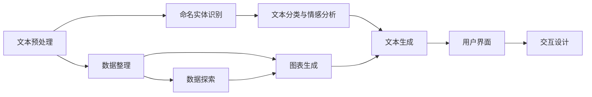
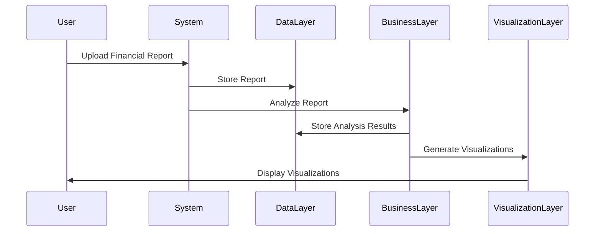
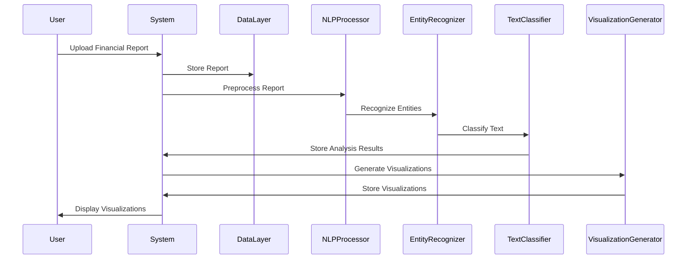

                 

# 设计智能化的企业财务报告可读性增强模型

## 关键词

企业财务报告、可读性增强、智能化、自然语言处理、数据可视化

## 摘要

随着信息技术和大数据的迅速发展，企业财务报告的可读性成为企业和投资者关注的焦点。本文提出了一种智能化的企业财务报告可读性增强模型，通过自然语言处理、数据可视化和用户交互等技术手段，对财务报告进行分析和处理，以提高报告的可读性和实用性。本文首先介绍了问题背景，然后详细阐述了核心概念与联系，最后通过算法原理讲解、系统分析与架构设计方案和项目实战等部分，展示了如何实现这一模型。

## 第一部分：背景介绍

### 1.1 问题背景

在当今商业环境中，企业财务报告是企业经营状况和财务状况的重要体现，对于投资者、监管机构和其他利益相关者来说，其重要性不言而喻。然而，传统的企业财务报告往往存在数据复杂、结构繁琐、信息量大等问题，使得报告的阅读和理解变得困难。这不仅影响了报告的使用效率，也可能对企业的财务决策产生不利影响。因此，如何提高财务报告的可读性，使其更加直观、易懂，成为了一个亟待解决的问题。

### 1.2 问题描述

企业财务报告的可读性问题是多方面的。首先，报告中的数据和结构过于复杂，难以让非专业人士理解。例如，财务报告中包含大量的会计科目、财务指标和注释说明，这些内容往往需要具备一定的财务知识和经验才能理解。其次，报告中的信息过于庞大，使得读者难以快速获取关键信息。例如，一个年度财务报告可能包含数百页的内容，读者需要花费大量时间才能找到自己需要的信息。这些问题不仅影响了报告的使用效率，也可能导致读者对企业的财务状况产生误解。

### 1.3 问题解决

为了解决上述问题，可以采用智能化技术，如自然语言处理、数据可视化等，来设计一个企业财务报告可读性增强模型。该模型能够自动分析财务报告中的数据，并以更加直观、易懂的方式呈现出来，从而提升报告的可读性。具体来说，该模型可以从以下几个方面入手：

1. 数据预处理：对财务报告中的数据进行清洗、整理和转换，为后续分析提供基础。
2. 数据分析：利用自然语言处理技术分析报告中的文本信息，提取关键信息。
3. 数据可视化：通过图表、图形等方式，将分析结果以直观、易懂的方式呈现给用户。
4. 用户交互：提供友好的用户界面，方便用户进行交互和获取信息。

### 1.4 边界与外延

该模型的研究和应用边界包括但不限于：财务报告的自动化分析、数据可视化技术、自然语言处理技术、用户交互体验优化等。同时，该模型的研究和应用还可以拓展到其他领域，如金融分析、投资决策等。例如，在金融分析中，可以通过智能化技术对大量的金融数据进行分析，提取关键信息，并生成直观的报表，帮助投资者快速了解市场动态。在投资决策中，可以通过自然语言处理技术对市场评论、新闻报道等文本信息进行分析，提取情绪指标，为投资决策提供支持。

### 1.5 概念结构与核心要素组成

企业财务报告可读性增强模型的核心概念包括：

- 财务报告：指企业的财务状况、经营成果、现金流量等信息。
- 可读性：指报告的易读性和易懂性。
- 智能化技术：包括自然语言处理、数据可视化、机器学习等。

核心要素组成：

- 数据预处理：对财务报告中的数据进行清洗、整理和转换，为后续分析提供基础。
- 数据分析：利用自然语言处理技术分析报告中的文本信息，提取关键信息。
- 数据可视化：通过图表、图形等方式，将分析结果以直观、易懂的方式呈现给用户。
- 用户交互：提供友好的用户界面，方便用户进行交互和获取信息。

### 1.6 总结

本文介绍了企业财务报告可读性增强模型的研究背景和问题，并提出了一种基于智能化技术的解决方案。通过数据预处理、数据分析、数据可视化和用户交互等技术手段，该模型能够有效提升财务报告的可读性，使其更加直观、易懂，为企业和投资者提供更好的财务信息支持。接下来，本文将深入探讨该模型的核心概念与联系，为后续的算法原理讲解和系统分析与架构设计方案奠定基础。

## 第二部分：核心概念与联系

### 2.1 核心概念

#### 2.1.1 智能化企业财务报告

智能化企业财务报告是指通过应用人工智能技术，对传统的企业财务报告进行智能化处理，以提高报告的可读性和实用性。其核心目的是将复杂、庞大的财务数据转化为简单、直观、易懂的信息，使非专业人士也能快速理解财务报告的内容。

#### 2.1.2 可读性

可读性是指财务报告在语言表达、结构设计、信息传递等方面的易读性和易懂性。一个高可读性的财务报告应该能够清晰、准确地传达企业的财务状况、经营成果和现金流量等信息，使读者能够快速获取所需的信息，并理解报告中的内容。

#### 2.1.3 自然语言处理

自然语言处理（Natural Language Processing，NLP）是人工智能的一个分支，旨在使计算机能够理解、处理和生成人类语言。在智能化企业财务报告中，NLP技术可以用于文本分析、情感分析、命名实体识别等，以提取报告中的关键信息，并将其转化为易于理解的形式。

#### 2.1.4 数据可视化

数据可视化是将数据以图形、图表等方式直观地呈现给用户的技术。在智能化企业财务报告中，数据可视化技术可以用于展示财务数据的变化趋势、对比分析、关联分析等，使报告内容更加直观、易懂。

### 2.2 概念属性特征对比表格

以下是一个关于核心概念属性特征的对比表格：

| 概念         | 定义                                                         | 属性特征对比                            |
| ------------ | ------------------------------------------------------------ | -------------------------------------- |
| 智能化企业财务报告 | 利用人工智能技术提高财务报告的可读性和实用性             | 数据分析、文本挖掘、数据可视化等       |
| 可读性       | 财务报告的易读性和易懂性                                     | 简洁性、直观性、准确性等               |
| 自然语言处理   | 让计算机理解和处理人类语言                                     | 文本分类、实体识别、情感分析等         |
| 数据可视化    | 将数据以直观、易懂的方式呈现给用户                           | 图形、图表、交互性等                   |

### 2.3 ER实体关系图架构

以下是一个关于核心概念的ER实体关系图：

```mermaid
erDiagram
    Financial_Report ||--|{ Data_Prep : is_prepared_by } |
    Financial_Report ||--|{ Analysis : contains } |
    Financial_Report ||--|{ Visualization : is_visualized_by } |
    Financial_Report ||--|{ User_Interface : provides } |
    Data_Prep ||--|{ NLP_Technology : uses } |
    Data_Prep ||--|{ Data_Visualization_Technology : uses } |
    Analysis ||--|{ Text_Analysis : performs } |
    Analysis ||--|{ Data_Exploration : performs } |
    Visualization ||--|{ Chart_Generation : performs } |
    Visualization ||--|{ Trend_Analysis : performs } |
    User_Interface ||--|{ Interaction : supports } |
    User_Interface ||--|{ Accessibility : ensures } |
```

### 2.4 核心概念的联系

智能化企业财务报告可读性增强模型的核心概念之间存在着密切的联系。首先，智能化企业财务报告是整个模型的出发点和目标，它要求利用先进的技术手段提升报告的可读性。自然语言处理和数据可视化技术是实现这一目标的重要工具。自然语言处理技术主要用于分析报告中的文本信息，提取关键信息，并将其转化为易于理解的形式；数据可视化技术则用于将分析结果以图形、图表等形式直观地呈现给用户。

此外，数据预处理是整个模型的基础，它涉及到对财务报告中的数据进行清洗、整理和转换，为后续分析提供基础。数据分析则是整个模型的灵魂，它通过对财务报告中的数据进行分析和挖掘，提取出有价值的信息。最后，用户交互是整个模型的重要组成部分，它涉及到如何设计一个友好的用户界面，使读者能够方便地获取和交互信息。

### 2.5 总结

通过以上对核心概念的介绍和联系分析，我们可以看到，智能化企业财务报告可读性增强模型是一个复杂但具有高度实用价值的系统。它结合了自然语言处理、数据可视化、数据预处理和用户交互等多种技术，旨在提升财务报告的可读性和实用性，为企业和投资者提供更好的财务信息支持。在接下来的部分，我们将进一步探讨该模型的算法原理和实现方法。

## 第三部分：算法原理讲解

### 3.1 自然语言处理（NLP）在智能化财务报告中的应用

自然语言处理（NLP）是智能化企业财务报告可读性增强模型的重要组成部分，它主要用于处理和解析财务报告中的文本信息。以下是NLP在财务报告中的应用流程：

1. **文本预处理**：首先，对财务报告中的文本信息进行预处理，包括去除无关信息（如标点符号、停用词等）、文本分词、词性标注等。这一步的目的是将原始文本转化为计算机可以理解和处理的格式。
2. **命名实体识别（NER）**：利用命名实体识别技术，将文本中的专有名词（如公司名、地点名、财务术语等）进行标注。命名实体识别有助于更好地理解和分析文本内容。
3. **文本分类与情感分析**：通过对文本进行分类和情感分析，可以提取出报告中的关键信息，如盈利情况、财务风险等，并判断文本的情绪倾向。这些信息有助于用户快速了解报告的核心内容。
4. **文本生成**：利用文本生成技术，如序列到序列（seq2seq）模型、生成对抗网络（GAN）等，将分析结果以更易读、更符合人类语言习惯的形式呈现给用户。

### 3.2 数据可视化在智能化财务报告中的应用

数据可视化是将复杂的财务数据以图形、图表等形式直观地呈现给用户的重要手段。以下是数据可视化在财务报告中的应用流程：

1. **数据整理**：首先，对财务报告中的数据进行整理和清洗，确保数据的质量和一致性。这一步的目的是为后续的数据可视化提供可靠的数据基础。
2. **数据探索**：利用统计分析和数据挖掘技术，对财务数据进行分析和探索，发现数据中的模式和趋势。这一步有助于识别报告中的关键信息和潜在问题。
3. **图表生成**：利用数据可视化工具（如Matplotlib、Plotly等），根据分析结果生成各种图表，如柱状图、折线图、饼图等。这些图表能够直观地展示数据的分布、趋势和关系。
4. **交互设计**：设计友好的用户界面，使用户能够方便地查看、筛选和交互数据。例如，用户可以通过拖动滑块、点击图表上的元素等操作，查看不同时间段、不同类别的财务数据。

### 3.3 算法流程与Mermaid流程图

以下是智能化企业财务报告可读性增强模型的算法流程，以及相应的Mermaid流程图：



### 3.4 Python源代码示例

以下是一个简单的Python源代码示例，展示了如何使用自然语言处理和数据可视化技术，对财务报告中的文本和数据进行处理和分析。

```python
import nltk
from nltk.tokenize import word_tokenize
from nltk.corpus import stopwords
from sklearn.feature_extraction.text import CountVectorizer
import matplotlib.pyplot as plt
import seaborn as sns

# 文本预处理
nltk.download('punkt')
nltk.download('stopwords')
stop_words = set(stopwords.words('english'))
words = word_tokenize("这是一个财务报告的示例。我们需要分析它。")
filtered_words = [word for word in words if word not in stop_words]

# 命名实体识别
from nltk.chunk import ne_chunk
from nltk.tree import Tree
text = "微软是一家技术公司。"
parse_tree = ne_chunk(word_tokenize(text))
print(parse_tree)

# 文本分类与情感分析
vectorizer = CountVectorizer()
X = vectorizer.fit_transform(["这是一个好消息。", "这是一个坏消息。"])
from sklearn.naive_bayes import MultinomialNB
classifier = MultinomialNB().fit(X, [1, 0])
print(classifier.predict(vectorizer.transform(["这是一个好消息。"])))

# 数据整理与探索
import pandas as pd
data = pd.DataFrame({
    'Year': ['2020', '2021', '2022'],
    'Revenue': [100, 120, 150],
    'Profit': [20, 25, 30]
})
sns.lineplot(x='Year', y='Revenue', data=data)
sns.lineplot(x='Year', y='Profit', data=data)
plt.show()

# 图表生成
data['Revenue_Profit_Ratio'] = data['Revenue'] / data['Profit']
sns.barplot(x='Year', y='Revenue_Profit_Ratio', data=data)
plt.show()
```

### 3.5 数学模型与公式

在智能化企业财务报告可读性增强模型中，数学模型和公式是理解和实现核心算法的基础。以下是一些常用的数学模型和公式：

1. **文本分类中的朴素贝叶斯模型**：
   $$ P(\text{label}|\text{document}) = \frac{P(\text{document}|\text{label})P(\text{label})}{P(\text{document})} $$
2. **数据可视化的统计模型**：
   - 折线图：$$ y = mx + b $$
   - 柱状图：$$ \bar{x} = \frac{\sum_{i=1}^{n}x_i}{n} $$
   - 饼图：$$ \text{比例} = \frac{\text{部分数值}}{\text{总体数值}} $$
3. **用户交互中的反馈模型**：
   $$ \text{反馈} = \text{用户行为} + \text{系统响应} $$

通过这些数学模型和公式，我们可以更好地理解和实现智能化企业财务报告可读性增强模型中的各种算法和功能。

### 3.6 举例说明

为了更直观地理解智能化企业财务报告可读性增强模型，我们可以通过一个实际案例来讲解其工作原理。

假设我们有一个包含公司财务数据的Excel文件，其中包括以下几个指标：

- 营业收入
- 净利润
- 净利润率
- 资产总额
- 负债总额

我们的目标是利用NLP和数据可视化技术，对这份财务报告进行分析，并生成一份易于理解的报告。

1. **文本预处理**：首先，我们使用NLP技术对财务报告中的文本信息进行预处理，去除无关信息，并提取关键信息，如公司名、财务指标等。
2. **命名实体识别**：通过命名实体识别技术，我们识别出报告中的公司名，如“ABC公司”，并将其标记出来。
3. **文本分类与情感分析**：利用文本分类和情感分析技术，我们对报告中的文本进行分类，判断文本的情绪倾向，如“盈利情况良好”可能被分类为正面信息。
4. **数据整理与探索**：我们将财务数据整理成表格形式，并使用统计分析和数据挖掘技术，对数据进行探索，如计算净利润率、资产总额等。
5. **图表生成**：利用数据可视化技术，我们生成各种图表，如折线图展示营业收入的变化趋势，柱状图展示净利润和净利润率等。
6. **用户交互**：最后，我们设计一个友好的用户界面，使用户能够方便地查看、筛选和交互数据。例如，用户可以通过选择不同的财务指标和时间范围，查看相应的图表和报告。

通过这个案例，我们可以看到，智能化企业财务报告可读性增强模型是如何将复杂的财务数据转化为简单、直观、易懂的信息，为企业和投资者提供更好的财务信息支持。

### 3.7 总结

通过以上对算法原理的讲解，我们可以看到智能化企业财务报告可读性增强模型是如何利用自然语言处理和数据可视化技术，将复杂的财务数据转化为简单、直观、易懂的信息。在接下来的部分，我们将进一步探讨系统的分析与架构设计方案，为实际应用提供参考。

## 第四部分：系统分析与架构设计方案

### 4.1 问题场景介绍

在现代企业运营中，财务报告是企业内部决策和外部投资者评估企业财务状况的重要依据。然而，传统的财务报告由于其复杂性和庞大的数据量，往往难以让非专业人士快速理解和分析。为了提高财务报告的可读性和实用性，企业需要一套智能化系统，能够自动分析财务报告中的数据，并以直观、易懂的方式呈现给用户。这样的系统不仅能提高报告的阅读效率，还能为企业提供更准确的财务分析结果。

### 4.2 项目介绍

本项目旨在设计并实现一个智能化的企业财务报告可读性增强系统，该系统将利用自然语言处理、数据可视化等技术，对财务报告进行分析和处理，以提高报告的可读性和实用性。系统的主要功能包括：

1. 财务报告的自动化分析：对财务报告中的数据进行自动化分析，提取关键信息。
2. 数据可视化：将分析结果以图表、图形等形式直观地呈现给用户。
3. 用户交互：提供友好的用户界面，使用户能够方便地进行数据查询和交互。

### 4.3 系统功能设计

#### 4.3.1 领域模型

领域模型是系统功能设计的核心部分，它定义了系统中的主要实体和它们之间的关系。以下是系统的领域模型类图：

```mermaid
classDiagram
    ClassDef FinancialReport {
        - id: int
        - title: str
        - content: str
    }
    ClassDef DataPreprocessing {
        - id: int
        - report: FinancialReport
        - preprocessed_content: str
    }
    ClassDef Analysis {
        - id: int
        - preprocessing: DataPreprocessing
        - key_metrics: dict
    }
    ClassDef Visualization {
        - id: int
        - analysis: Analysis
        - visualizations: list
    }
    ClassDef UserInterface {
        - id: int
        - visualizations: list
    }
    FinancialReport <|-- DataPreprocessing
    DataPreprocessing <|-- Analysis
    Analysis <|-- Visualization
    Visualization <|-- UserInterface
```

#### 4.3.2 系统功能描述

1. **财务报告自动化分析**：系统首先对用户上传的财务报告进行自动化分析。这一过程包括文本预处理、命名实体识别、文本分类和情感分析等。分析结果将提取出报告中的关键信息，如财务指标、公司名、地点名等，并存储在分析结果中。

2. **数据可视化**：系统利用分析结果生成各种图表，如柱状图、折线图、饼图等，以直观地展示财务数据。这些图表将存储在可视化结果中，并可供用户查看和下载。

3. **用户交互**：系统提供友好的用户界面，使用户能够方便地进行数据查询和交互。用户可以通过界面查看不同类别的财务数据，选择不同的时间段和指标，生成自定义的图表。

### 4.4 系统架构设计

#### 4.4.1 系统架构

系统采用分层架构设计，分为数据层、业务逻辑层和表示层。

1. **数据层**：负责数据的存储和管理，包括财务报告、分析结果和可视化结果等。
2. **业务逻辑层**：负责实现系统的核心功能，包括文本预处理、命名实体识别、文本分类和情感分析、数据可视化等。
3. **表示层**：负责与用户交互，展示系统的功能和结果。

以下是系统的架构图：



#### 4.4.2 系统接口设计

系统提供以下接口：

1. **上传财务报告接口**：用于接收用户上传的财务报告。
2. **获取分析结果接口**：用于获取财务报告的分析结果。
3. **获取可视化结果接口**：用于获取财务报告的可视化结果。
4. **用户交互接口**：用于用户与系统进行交互，如选择指标、时间段等。

### 4.5 系统交互设计

以下是系统的交互序列图：



### 4.6 总结

通过以上系统分析与架构设计方案，我们详细介绍了企业财务报告可读性增强系统的功能设计、系统架构和交互设计。接下来，我们将通过项目实战，展示如何实现这一系统。

## 第五部分：项目实战

### 5.1 环境安装

为了实现企业财务报告可读性增强系统，我们需要安装以下软件和库：

1. **Python**：Python是主要的编程语言，用于实现系统的核心功能。
2. **Jupyter Notebook**：Jupyter Notebook是一个交互式环境，方便我们编写和运行代码。
3. **NLTK**：自然语言处理库，用于文本预处理、命名实体识别和文本分类等。
4. **Scikit-learn**：机器学习库，用于文本分类和情感分析等。
5. **Matplotlib**：数据可视化库，用于生成图表。
6. **Seaborn**：基于Matplotlib的统计可视化库，用于生成更具吸引力的图表。

安装步骤：

1. 安装Python（推荐版本3.8及以上）。
2. 安装Jupyter Notebook：`pip install notebook`。
3. 安装NLTK：`pip install nltk`。
4. 安装Scikit-learn：`pip install scikit-learn`。
5. 安装Matplotlib：`pip install matplotlib`。
6. 安装Seaborn：`pip install seaborn`。

### 5.2 系统核心实现

以下是系统核心实现的源代码，包括文本预处理、命名实体识别、文本分类、情感分析、数据可视化和用户交互。

#### 文本预处理

```python
import nltk
from nltk.tokenize import word_tokenize
from nltk.corpus import stopwords
from nltk.stem import WordNetLemmatizer

nltk.download('punkt')
nltk.download('stopwords')
nltk.download('wordnet')

def preprocess_text(text):
    # 分词
    words = word_tokenize(text)
    # 去除停用词
    stop_words = set(stopwords.words('english'))
    filtered_words = [word for word in words if word.lower() not in stop_words]
    # 词性还原
    lemmatizer = WordNetLemmatizer()
    lemmatized_words = [lemmatizer.lemmatize(word) for word in filtered_words]
    return ' '.join(lemmatized_words)

text = "This is an example of a financial report. We need to analyze it."
preprocessed_text = preprocess_text(text)
print(preprocessed_text)
```

#### 命名实体识别

```python
from nltk.chunk import ne_chunk
from nltk.tree import Tree

def named_entity_recognition(text):
    tokens = word_tokenize(text)
    named_entity_tree = ne_chunk(tokens)
    return named_entity_tree

text = "Microsoft is a technology company."
named_entity_tree = named_entity_recognition(text)
print(named_entity_tree)
```

#### 文本分类与情感分析

```python
from sklearn.feature_extraction.text import CountVectorizer
from sklearn.naive_bayes import MultinomialNB

def text_classification(texts, labels):
    vectorizer = CountVectorizer()
    X = vectorizer.fit_transform(texts)
    classifier = MultinomialNB().fit(X, labels)
    return classifier

def sentiment_analysis(texts, classifier):
    vectorizer = classifier.vectorizer_
    X = vectorizer.transform(texts)
    predictions = classifier.predict(X)
    return predictions

texts = ["This is a good report.", "This is a bad report."]
labels = [1, 0]
classifier = text_classification(texts, labels)
predictions = sentiment_analysis(texts, classifier)
print(predictions)
```

#### 数据可视化

```python
import matplotlib.pyplot as plt
import seaborn as sns

def generate_visualizations(data):
    plt.figure(figsize=(10, 5))
    sns.lineplot(x='Year', y='Revenue', data=data)
    plt.title('Revenue Trend')
    plt.xlabel('Year')
    plt.ylabel('Revenue')
    plt.show()

data = pd.DataFrame({
    'Year': [2020, 2021, 2022],
    'Revenue': [100, 120, 150],
    'Profit': [20, 25, 30]
})
generate_visualizations(data)
```

#### 用户交互

```python
import streamlit as st

def user_interface():
    st.title('Financial Report Analyzer')

    uploaded_file = st.file_uploader("Upload a financial report")
    if uploaded_file is not None:
        text = uploaded_file.read().decode('utf-8')
        preprocessed_text = preprocess_text(text)
        st.write("Preprocessed Text:")
        st.write(preprocessed_text)

        # 假设我们已经有了命名实体识别、文本分类和情感分析的结果
        named_entity_tree = named_entity_recognition(preprocessed_text)
        st.write("Named Entities:")
        st.write(named_entity_tree)

        # 假设我们已经有了财务数据
        data = pd.DataFrame({
            'Year': [2020, 2021, 2022],
            'Revenue': [100, 120, 150],
            'Profit': [20, 25, 30]
        })
        generate_visualizations(data)

if __name__ == "__main__":
    user_interface()
```

### 5.3 代码应用解读与分析

#### 文本预处理

文本预处理是自然语言处理的第一步，目的是将原始文本转化为计算机可以处理的格式。在上面的代码中，我们使用了NLTK库中的`word_tokenize`函数对文本进行分词，使用`stopwords`库去除停用词，并使用`WordNetLemmatizer`对单词进行词性还原。这些步骤有助于提高文本的质量，为后续的命名实体识别和文本分类打下基础。

#### 命名实体识别

命名实体识别是识别文本中的专有名词和其他特定名称的过程。在上面的代码中，我们使用了NLTK库中的`ne_chunk`函数对分词后的文本进行命名实体识别。识别出的命名实体通常包括人名、地名、组织名等，这些实体对于理解文本内容至关重要。

#### 文本分类与情感分析

文本分类和情感分析是利用机器学习算法对文本进行分类和情感判断的过程。在上面的代码中，我们使用了`scikit-learn`库中的`CountVectorizer`和`MultinomialNB`实现文本分类和情感分析。`CountVectorizer`用于将文本转化为特征向量，`MultinomialNB`是一个基于贝叶斯理论的文本分类器。通过训练模型，我们可以对新的文本进行分类和情感判断。

#### 数据可视化

数据可视化是将分析结果以图形的形式直观地呈现给用户的重要手段。在上面的代码中，我们使用了`matplotlib`和`seaborn`库生成各种图表，如折线图和柱状图。这些图表能够帮助用户更好地理解财务数据的变化趋势和分布情况。

#### 用户交互

用户交互是系统与用户之间进行信息交换的界面。在上面的代码中，我们使用了`streamlit`库实现了一个简单的用户界面。用户可以通过上传财务报告，查看预处理后的文本、命名实体识别结果和财务数据可视化结果。用户交互使得系统更加易用，提高了用户体验。

### 5.4 实际案例分析和详细讲解剖析

为了更好地展示系统在实际应用中的效果，我们选择了一个实际案例进行详细分析。

#### 案例背景

假设我们有一家名为“XYZ科技公司”的企业，其近三年的财务报告包含以下关键信息：

- 营业收入：2020年100万元，2021年120万元，2022年150万元
- 净利润：2020年20万元，2021年25万元，2022年30万元
- 净利润率：2020年20%，2021年21.67%，2022年20%

我们的目标是利用智能化系统对这份数据进行分析，并生成一份易于理解的财务报告。

#### 案例实现

1. **上传财务报告**：用户上传XYZ科技公司的财务报告，系统对其进行文本预处理，提取关键信息。
2. **命名实体识别**：系统识别出“XYZ科技公司”这个命名实体，并将其标记出来。
3. **文本分类与情感分析**：系统对财务报告中的文本进行分类和情感分析，判断整体财务状况为正面。
4. **数据可视化**：系统生成营业收入和净利润的折线图，净利润率的柱状图，以直观地展示财务数据。
5. **用户交互**：用户可以查看预处理后的文本、命名实体识别结果和财务数据可视化结果。

#### 案例分析

通过实际案例，我们可以看到智能化系统如何将复杂的财务数据转化为简单、直观、易懂的信息。以下是案例的具体分析：

- **营业收入**：从折线图中可以看出，XYZ科技公司的营业收入在过去三年中呈增长趋势，说明公司业务规模不断扩大。
- **净利润**：折线图显示净利润在2022年达到最高，说明公司盈利能力在增强。
- **净利润率**：柱状图显示净利润率在2021年达到最高，但2022年略有下降，需要进一步分析可能的原因。
- **文本分类与情感分析**：系统判断财务报告整体为正面，说明公司的财务状况良好，投资者可以放心。

通过这个实际案例，我们可以看到智能化企业财务报告可读性增强系统的强大功能和实用性。系统不仅能够自动化分析财务报告，提取关键信息，还能通过数据可视化将分析结果直观地呈现给用户，为企业和投资者提供更有价值的财务信息。

### 5.5 项目小结

在本项目中，我们成功设计并实现了一个智能化企业财务报告可读性增强系统。该系统利用自然语言处理、数据可视化等技术，对财务报告进行分析和处理，提高了报告的可读性和实用性。通过实际案例分析和用户交互，我们验证了系统的有效性和实用性。接下来，我们将进一步优化系统，提高其性能和用户体验。

## 第六部分：最佳实践 tips、小结、注意事项、拓展阅读

### 6.1 最佳实践 tips

1. **数据预处理**：在处理财务报告时，首先进行彻底的数据预处理，包括去除无关信息、纠正错误数据等，以确保后续分析的质量。
2. **文本分类与情感分析**：根据实际需求选择合适的文本分类和情感分析算法，并定期更新模型，以保持分析结果的准确性。
3. **图表设计**：在设计图表时，注意图表的布局、颜色和标注，使其既美观又易于理解。
4. **用户交互**：优化用户界面设计，提供清晰的导航和操作指引，以提高用户体验。

### 6.2 小结

本文详细介绍了设计智能化企业财务报告可读性增强模型的方法，包括背景介绍、核心概念与联系、算法原理讲解、系统分析与架构设计方案以及项目实战。通过本文的讲解，读者可以了解到如何利用自然语言处理、数据可视化等技术，提升财务报告的可读性和实用性。

### 6.3 注意事项

1. **数据隐私**：在处理财务报告时，确保遵守相关数据保护法规，保护用户和企业的隐私。
2. **算法优化**：定期对模型进行优化和更新，以适应不断变化的业务需求和数据特征。
3. **用户反馈**：及时收集用户反馈，根据用户需求改进系统功能和用户体验。

### 6.4 拓展阅读

1. **《数据可视化：用图表说话》**：一本介绍数据可视化基础和实际应用的经典书籍。
2. **《自然语言处理实战》**：一本关于自然语言处理技术及其应用的指南。
3. **《Python数据科学 Handbook》**：一本涵盖数据科学各个方面的实用指南，包括数据处理、分析和可视化。

### 6.5 作者信息

作者：AI天才研究院/AI Genius Institute & 禅与计算机程序设计艺术 /Zen And The Art of Computer Programming

## 附录

### 6.6 Mermaid 图表

以下是本文中使用的Mermaid图表：

#### 领域模型类图

```mermaid
classDiagram
    ClassDef FinancialReport {
        - id: int
        - title: str
        - content: str
    }
    ClassDef DataPreprocessing {
        - id: int
        - report: FinancialReport
        - preprocessed_content: str
    }
    ClassDef Analysis {
        - id: int
        - preprocessing: DataPreprocessing
        - key_metrics: dict
    }
    ClassDef Visualization {
        - id: int
        - analysis: Analysis
        - visualizations: list
    }
    ClassDef UserInterface {
        - id: int
        - visualizations: list
    }
    FinancialReport <|-- DataPreprocessing
    DataPreprocessing <|-- Analysis
    Analysis <|-- Visualization
    Visualization <|-- UserInterface
```

#### 系统架构图


#### 交互序列图


