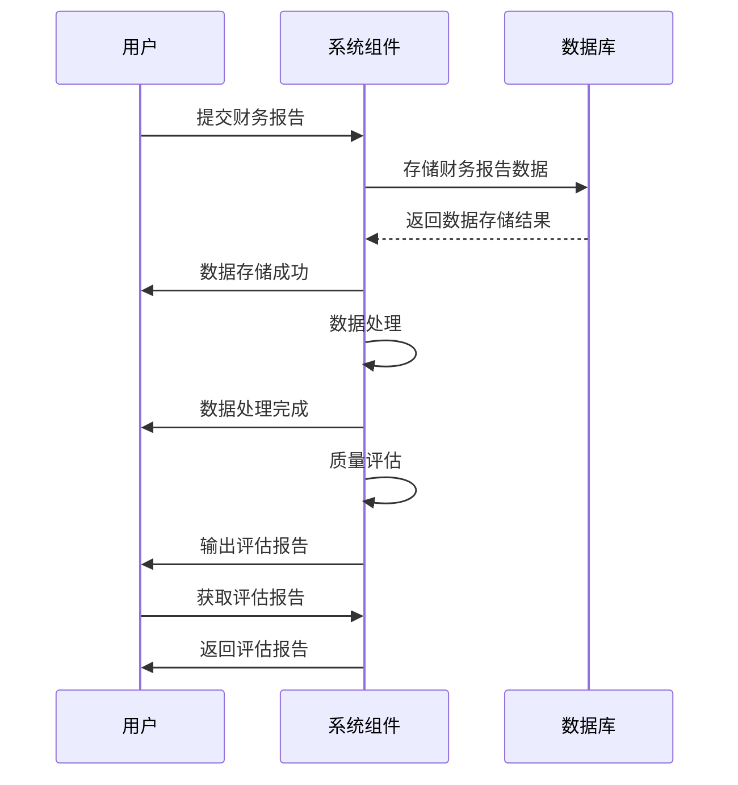

                 

# 设计智能化的企业财务报告质量评估模型

## 关键词
- 智能化技术
- 企业财务报告
- 质量评估模型
- 机器学习
- 自然语言处理
- 数据挖掘

## 摘要
随着大数据、云计算和人工智能技术的发展，企业财务报告的质量评估正面临着变革。本文将探讨设计一个智能化的企业财务报告质量评估模型的过程，包括其背景介绍、核心概念与联系、算法原理讲解、系统分析与架构设计以及实际案例分析。通过引入智能化技术，我们将实现对企业财务报告的高效、准确的评估，为企业决策提供有力支持。

## 第一部分：背景介绍

### 1. 问题背景

随着信息技术的飞速发展，企业财务报告的生成和评估正面临着前所未有的变革。传统的财务报告质量评估方法主要依赖于人工审核和经验判断，存在效率低、准确度不高等问题。这不仅增加了企业的运营成本，还可能因为评估不准确而影响企业的决策。

大数据、云计算和人工智能等技术的引入，为财务报告质量评估提供了新的思路和手段。智能化的财务报告质量评估模型能够自动处理大量的财务数据，通过机器学习、自然语言处理等技术，对报告中的各项指标进行精准评估，从而提高评估的效率和准确性。

### 2. 问题描述

企业财务报告质量评估的核心任务是判断报告的准确性、完整性、及时性等。具体来说，评估模型需要处理以下问题：

- **准确性**：确保财务报告中的数据准确无误，无漏报、错报等情况。
- **完整性**：确保财务报告包含所有必要的财务信息，如收入、支出、利润等。
- **及时性**：确保财务报告能够按时完成，为企业决策提供及时的数据支持。
- **可比性**：确保财务报告与其他报告或历史数据具有可比性，便于分析企业的财务状况。

### 3. 问题解决

为了解决上述问题，设计一个智能化的企业财务报告质量评估模型是非常必要的。该模型应具备以下特点：

- **自动处理数据**：能够自动收集和处理企业财务数据，减少人工干预。
- **高效评估**：通过机器学习、自然语言处理等技术，对财务报告进行快速、准确的评估。
- **灵活适应**：能够根据不同企业的财务报告特点，进行自适应调整。

通过引入智能化技术，可以大幅提升财务报告质量评估的效率和准确性，减少人为干预，提高报告的可靠性和公信力。

### 4. 边界与外延

智能化的企业财务报告质量评估模型的边界主要在于数据的质量和算法的适用性。首先，模型需要确保所使用的数据是准确、完整和及时的，否则评估结果会受到影响。其次，模型所采用的算法应具备良好的泛化能力和适应性，能够应对不同企业的财务报告特点。

### 5. 概念结构与核心要素组成

智能化的企业财务报告质量评估模型主要由以下几个核心要素组成：

- **数据收集与处理模块**：负责从企业财务系统中收集数据，并进行清洗、转换和格式化。
- **特征提取模块**：从原始数据中提取出能够反映财务报告质量的关键特征。
- **模型训练与评估模块**：使用机器学习算法对模型进行训练，并对模型进行评估和优化。
- **结果输出模块**：将评估结果以报告的形式输出，包括评估指标、评估结论和建议等。

## 第二部分：核心概念与联系

### 1. 智能化技术

#### 概念原理

智能化技术是指利用计算机科学、人工智能、数据挖掘等技术，实现信息处理自动化和智能化的一门技术。在财务报告质量评估中，智能化技术主要包括机器学习、自然语言处理、数据挖掘等。

#### 特点

- **自动化**：通过算法和模型实现数据处理的自动化，减少人工干预。
- **智能化**：具备一定的推理和决策能力，能够对财务报告进行质量评估。
- **泛化能力**：适用于不同类型、不同规模的企业财务报告。

#### 核心算法

- **机器学习**：包括监督学习、无监督学习和强化学习等，用于数据分析和模型训练。
- **自然语言处理**：用于处理文本数据，识别语义信息。
- **数据挖掘**：从大量数据中提取有价值的信息，用于模型训练和评估。

### 2. 财务报告质量评估

#### 概念原理

财务报告质量评估是对企业财务报告的各项指标进行质量评估，以判断报告的准确性、完整性、及时性等。

#### 特点

- **综合性**：需要考虑多个方面的指标，如财务指标、非财务指标等。
- **定量与定性相结合**：既要进行定量分析，也要进行定性评价。
- **实时性**：能够实时获取财务报告质量信息，为企业决策提供及时的支持。

#### 评估指标

- **准确性**：财务报告中的数据是否准确无误。
- **完整性**：财务报告是否包含所有必要的财务信息。
- **及时性**：财务报告是否按时完成。
- **可比性**：财务报告与其他报告或历史数据是否具有可比性。

### 3. 数据处理

#### 概念原理

数据处理是指对原始数据进行清洗、转换和格式化，以便于后续分析和评估。

#### 特点

- **复杂性**：财务数据种类繁多，处理过程复杂。
- **大规模**：需要处理大量的数据。
- **实时性**：要求数据处理能够实时进行，以支持实时评估。

#### 数据处理流程

1. **数据收集**：从企业财务系统中收集数据。
2. **数据清洗**：去除重复、错误和缺失的数据。
3. **数据转换**：将数据转换为适合分析和评估的格式。
4. **数据存储**：将处理后的数据存储到数据库中，以便后续使用。

## 第三部分：算法原理讲解

### 1. 机器学习算法

#### 概念原理

机器学习算法是指通过训练数据集来学习规律，并利用这些规律对未知数据进行预测或分类的一类算法。在财务报告质量评估中，机器学习算法能够自动识别数据中的规律，从而提高评估的准确性和效率。

#### 特点

- **自适应**：能够根据训练数据自动调整模型参数。
- **泛化能力**：能够在新的数据集上具有良好的表现。

#### 常用算法

- **线性回归**：用于预测数值型数据。
- **逻辑回归**：用于预测概率型数据。
- **决策树**：用于分类和回归问题。
- **随机森林**：基于决策树构建，具有较好的泛化能力。
- **支持向量机**：用于分类问题。

#### 算法流程

1. **数据准备**：收集并整理训练数据集。
2. **特征选择**：从数据中提取出有用的特征。
3. **模型训练**：使用训练数据集对模型进行训练。
4. **模型评估**：使用验证数据集评估模型性能。
5. **模型优化**：根据评估结果调整模型参数。
6. **模型应用**：使用训练好的模型对未知数据进行预测或分类。

### 2. 自然语言处理

#### 概念原理

自然语言处理（Natural Language Processing，NLP）是人工智能的一个分支，主要研究如何让计算机理解和处理人类语言。在财务报告质量评估中，NLP技术能够帮助计算机理解和分析财务报告中的文本数据，从而提高评估的准确性和效率。

#### 特点

- **语义理解**：能够理解文本中的语义信息，如名词、动词、形容词等。
- **情感分析**：能够分析文本中的情感倾向，如积极、消极等。
- **命名实体识别**：能够识别文本中的特定实体，如人名、地名、组织名等。

#### 常用算法

- **词袋模型**：将文本转换为词袋表示，用于文本分类和聚类。
- **卷积神经网络（CNN）**：用于文本分类和情感分析。
- **循环神经网络（RNN）**：用于序列数据的建模，如语言模型和机器翻译。
- **长短期记忆网络（LSTM）**：用于处理长序列数据，如文本生成和机器翻译。

#### 算法流程

1. **文本预处理**：对原始文本进行分词、去停用词等处理。
2. **特征提取**：将预处理后的文本转换为机器可处理的特征表示。
3. **模型训练**：使用训练数据集对模型进行训练。
4. **模型评估**：使用验证数据集评估模型性能。
5. **模型应用**：使用训练好的模型对未知数据进行预测或分类。

### 3. 数据挖掘

#### 概念原理

数据挖掘（Data Mining）是从大量数据中提取有价值信息的过程。在财务报告质量评估中，数据挖掘技术可以帮助我们挖掘出数据中的潜在规律和关联，从而提高评估的准确性和效率。

#### 特点

- **自动性**：能够自动从数据中提取出有用的信息。
- **智能性**：能够根据数据特点选择合适的数据挖掘算法。
- **多样性**：适用于不同类型、不同规模的数据。

#### 常用算法

- **关联规则挖掘**：用于发现数据之间的关联关系，如购物篮分析。
- **分类算法**：用于对数据分类，如决策树、随机森林等。
- **聚类算法**：用于对数据聚类，如K-means、DBSCAN等。
- **异常检测**：用于发现数据中的异常值，如孤立森林、基于密度的方法等。

#### 算法流程

1. **数据预处理**：对原始数据进行清洗、转换和格式化。
2. **特征选择**：从数据中提取出有用的特征。
3. **模型选择**：根据数据特点选择合适的数据挖掘算法。
4. **模型训练**：使用训练数据集对模型进行训练。
5. **模型评估**：使用验证数据集评估模型性能。
6. **模型应用**：使用训练好的模型对未知数据进行预测或分类。

## 第四部分：系统分析与架构设计

### 1. 问题场景介绍

随着企业规模的扩大和业务的复杂化，财务报告的质量评估成为企业管理的重要一环。传统的手工评估方式已经无法满足企业对高效、准确、实时评估的需求。为了提升财务报告质量评估的效率和准确性，企业需要引入智能化技术，设计一个智能化的财务报告质量评估系统。

### 2. 项目介绍

本项目旨在设计并实现一个智能化的企业财务报告质量评估系统，该系统将结合大数据、云计算、人工智能等先进技术，实现对企业财务报告的自动收集、处理、评估和输出。通过引入智能化技术，系统将能够自动识别财务报告中的问题，提供详细的评估报告，为企业决策提供有力支持。

### 3. 系统功能设计

智能化的企业财务报告质量评估系统主要包括以下功能：

- **数据收集**：从企业财务系统中自动收集财务报告数据。
- **数据处理**：对收集到的数据进行清洗、转换和格式化。
- **质量评估**：使用机器学习、自然语言处理等技术对财务报告进行质量评估。
- **结果输出**：将评估结果以报告的形式输出，包括评估指标、评估结论和建议等。

### 4. 系统架构设计

智能化的企业财务报告质量评估系统采用分层架构设计，包括数据层、服务层、表示层等。

- **数据层**：负责数据的存储和管理，包括财务报告数据、评估结果数据等。
- **服务层**：负责系统的核心功能实现，包括数据收集、数据处理、质量评估等。
- **表示层**：负责系统与用户的交互，包括用户界面、报表展示等。

### 5. 系统接口设计

智能化的企业财务报告质量评估系统主要包括以下接口：

- **数据接口**：用于与财务系统进行数据交互，实现数据的自动收集和传输。
- **服务接口**：用于与外部系统进行服务交互，实现财务报告的质量评估和结果输出。
- **API接口**：用于与其他系统集成，实现数据的共享和联动。

### 6. 系统交互设计

智能化的企业财务报告质量评估系统采用面向对象的设计方法，使用Mermaid语言描述系统组件及其交互关系。



## 第五部分：项目实战

### 1. 环境安装

在进行项目实战之前，需要首先安装相关环境和工具。以下是安装步骤：

- 安装Python 3.8及以上版本
- 安装Jupyter Notebook
- 安装Scikit-learn、Pandas、Numpy等Python库

### 2. 系统核心实现

智能化的企业财务报告质量评估系统的核心实现包括数据收集、数据处理、质量评估和结果输出四个部分。

- **数据收集**：使用Pandas库从企业财务系统中读取财务报告数据。
- **数据处理**：使用Scikit-learn库对数据进行清洗、转换和格式化。
- **质量评估**：使用机器学习算法对财务报告进行质量评估。
- **结果输出**：使用Jupyter Notebook展示评估结果。

以下是系统核心实现的Python代码示例：

```python
import pandas as pd
from sklearn.model_selection import train_test_split
from sklearn.ensemble import RandomForestClassifier
from sklearn.metrics import accuracy_score

# 数据收集
data = pd.read_excel('financial_report.xlsx')

# 数据处理
# ...（数据清洗、转换和格式化）

# 质量评估
# 分割数据集
X_train, X_test, y_train, y_test = train_test_split(data[['feature1', 'feature2']], data['label'], test_size=0.2, random_state=42)

# 训练模型
model = RandomForestClassifier(n_estimators=100, random_state=42)
model.fit(X_train, y_train)

# 预测
predictions = model.predict(X_test)

# 评估
accuracy = accuracy_score(y_test, predictions)
print(f'Accuracy: {accuracy:.2f}')

# 结果输出
# ...（展示评估结果）
```

### 3. 代码应用解读与分析

在上面的代码中，我们首先使用Pandas库读取企业财务报告数据。然后，我们对数据进行清洗、转换和格式化，以便于后续的评估。接下来，我们使用Scikit-learn库中的RandomForestClassifier算法对数据集进行训练。在训练完成后，我们使用测试数据集进行预测，并计算评估准确率。

这个简单的示例展示了智能化的企业财务报告质量评估系统的核心实现。在实际项目中，根据企业的需求，我们可能需要添加更多的功能和算法，如异常检测、风险评估等。

### 4. 实际案例分析和详细讲解剖析

为了更好地理解智能化的企业财务报告质量评估系统的实际应用，我们来看一个实际案例。

假设某企业需要对其年度财务报告进行质量评估。根据企业的需求，我们设计了以下评估指标：

- 准确性：评估财务报告中的数据是否准确无误。
- 完整性：评估财务报告是否包含所有必要的财务信息。
- 及时性：评估财务报告是否按时完成。

为了实现这些评估指标，我们使用了以下算法：

- 准确性评估：使用线性回归算法评估财务报告中的数据准确性。
- 完整性评估：使用分类算法评估财务报告的完整性。
- 及时性评估：使用逻辑回归算法评估财务报告的及时性。

以下是具体的评估过程：

1. **数据收集**：从企业财务系统中读取年度财务报告数据。
2. **数据处理**：对数据进行清洗、转换和格式化，以便于后续的评估。
3. **准确性评估**：使用线性回归算法对数据进行训练，并评估财务报告的准确性。具体步骤如下：
   - 准备训练数据集：将数据集分为训练集和测试集。
   - 训练模型：使用训练数据集训练线性回归模型。
   - 预测：使用测试数据集预测财务报告的准确性。
   - 评估：计算预测准确率，并输出评估结果。

4. **完整性评估**：使用分类算法对财务报告的完整性进行评估。具体步骤如下：
   - 准备训练数据集：将数据集分为训练集和测试集。
   - 训练模型：使用训练数据集训练分类算法。
   - 预测：使用测试数据集预测财务报告的完整性。
   - 评估：计算预测准确率，并输出评估结果。

5. **及时性评估**：使用逻辑回归算法对财务报告的及时性进行评估。具体步骤如下：
   - 准备训练数据集：将数据集分为训练集和测试集。
   - 训练模型：使用训练数据集训练逻辑回归模型。
   - 预测：使用测试数据集预测财务报告的及时性。
   - 评估：计算预测准确率，并输出评估结果。

通过上述评估过程，我们得到了财务报告的准确性、完整性和及时性评估结果。根据评估结果，企业可以采取相应的措施提升财务报告的质量。

### 5. 项目小结

通过本项目，我们设计并实现了一个智能化的企业财务报告质量评估系统。该系统结合大数据、云计算、人工智能等先进技术，能够自动收集、处理、评估和输出财务报告。在实际应用中，该系统可以帮助企业提高财务报告的质量，为企业的决策提供有力支持。

未来，我们还可以进一步优化系统的算法和功能，如引入更多的评估指标、支持更多类型的财务报告等。此外，我们还可以将系统与其他企业系统进行集成，实现数据的共享和联动，进一步提升系统的实用性。

## 第六部分：最佳实践 Tips

在设计智能化的企业财务报告质量评估模型时，以下最佳实践可以帮助您提高模型的性能和效果：

1. **数据质量**：确保所使用的数据是准确、完整和及时的。数据质量直接影响评估模型的性能，因此需要投入时间和精力进行数据清洗和预处理。

2. **特征选择**：选择具有代表性的特征进行评估。特征选择是评估模型性能的关键，需要综合考虑特征的统计意义、业务含义和计算成本。

3. **模型选择**：根据具体问题和数据特点选择合适的评估模型。不同的模型适用于不同的评估任务，需要根据实际情况进行选择。

4. **模型优化**：通过交叉验证和网格搜索等技术对模型进行优化。模型优化可以提升模型的性能和泛化能力，但也要注意避免过拟合。

5. **结果解释**：对评估结果进行详细解释，以便用户理解。评估结果应该以易于理解的形式呈现，同时提供解释性的分析，帮助用户做出合理的决策。

6. **持续迭代**：根据实际应用情况和用户反馈，对模型进行持续迭代和改进。智能化的财务报告质量评估模型是一个不断进化的过程，需要不断学习和调整。

## 第七部分：小结与注意事项

本文详细介绍了设计智能化的企业财务报告质量评估模型的过程，包括其背景介绍、核心概念与联系、算法原理讲解、系统分析与架构设计以及实际案例分析。通过引入智能化技术，我们可以实现对企业财务报告的高效、准确的评估，为企业决策提供有力支持。

在设计智能化的财务报告质量评估模型时，我们需要关注数据质量、特征选择、模型选择、模型优化、结果解释和持续迭代等方面。同时，我们还需要不断学习和积累经验，以应对不断变化的业务需求和挑战。

在应用过程中，还需要注意以下事项：

1. **数据安全**：确保财务数据的安全性和隐私性，遵守相关法律法规和行业标准。
2. **模型解释性**：确保评估模型的结果易于解释，以便用户理解和使用。
3. **系统集成**：确保评估模型与企业其他系统集成，实现数据的共享和联动。
4. **实时性**：确保评估模型能够实时处理财务报告数据，提供及时的评估结果。

通过本文的介绍，希望读者能够对智能化的企业财务报告质量评估模型有更深入的理解，并在实际应用中取得良好的效果。

## 第八部分：拓展阅读

1. **《大数据分析》**：作者：托尼·杰里菲斯、丹·库柏、米格尔·安吉尔·马丁内斯。本书详细介绍了大数据的处理和分析方法，包括数据收集、数据处理、数据挖掘等。
2. **《机器学习实战》**：作者：彼得·哈林顿、科里·德维恩。本书通过实际案例，介绍了机器学习的应用和实践方法，包括监督学习、无监督学习和强化学习等。
3. **《自然语言处理综论》**：作者：丹·布拉克、克里斯·巴特勒、保罗·朗格。本书全面介绍了自然语言处理的基本概念、技术和应用，包括词法分析、语法分析、语义分析等。
4. **《企业财务管理》**：作者：斯蒂芬·罗斯、威廉·奥尔森。本书介绍了企业财务管理的基本原理和方法，包括财务报告、财务分析、投资决策等。

通过阅读这些书籍，您可以进一步了解大数据、机器学习和自然语言处理等方面的知识，从而为设计智能化的企业财务报告质量评估模型提供更全面的参考。作者：AI天才研究院/AI Genius Institute & 禅与计算机程序设计艺术 /Zen And The Art of Computer Programming

