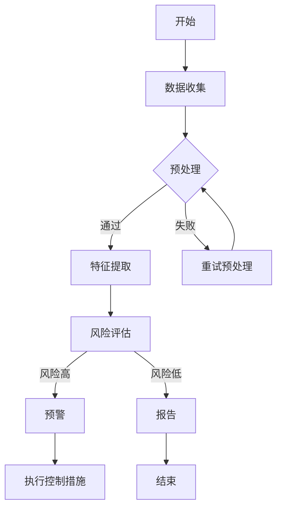
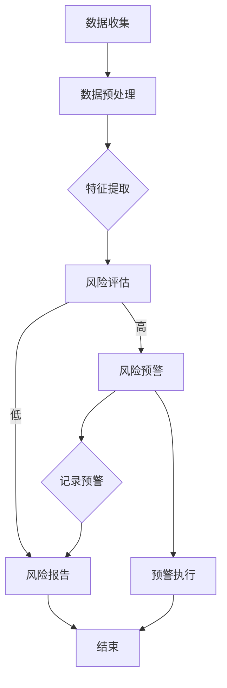
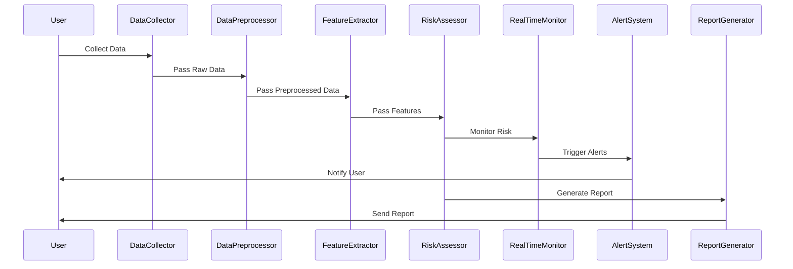

                 

### 第1章 问题背景

#### 1.1.1 问题背景

企业财务风险敞口管理是企业管理中至关重要的一环。随着市场环境的不断变化和全球化进程的加速，企业面临的财务风险敞口日益增多。财务风险敞口管理不仅仅关系到企业的财务健康，更可能影响到企业的生存和发展。因此，如何高效、动态地管理财务风险敞口，成为了企业必须面对和解决的问题。

在传统财务风险敞口管理中，企业通常依靠定期财务报表和审计等手段来评估和管理风险。然而，这种方法往往存在以下局限性：

1. **滞后性**：传统管理方法大多基于历史数据，风险敞口的评估和调整往往滞后于实际风险的变化。
2. **低效性**：依赖人工分析和判断，效率低下，且容易出现人为误差。
3. **不完全性**：传统方法难以全面、实时地捕捉到各种潜在风险。

随着大数据、人工智能等智能化技术的快速发展，利用这些技术对财务风险敞口进行动态管理成为了可能。智能化财务风险敞口管理不仅可以实时监测和分析风险敞口，还能根据市场变化和内部运营情况动态调整风险控制策略，从而提高风险管理的效率和效果。

#### 1.1.2 财务风险敞口的定义与类型

**财务风险敞口的定义**

财务风险敞口是指企业在未来可能面临的、与财务相关的各种不确定性的风险暴露程度。这些风险可能来源于市场波动、信用问题、流动性危机、操作失误等多个方面。财务风险敞口的评估和管理对于企业的可持续发展具有重要意义。

**财务风险敞口的类型**

1. **市场风险敞口**：指由于市场因素（如利率、汇率、股票价格等）的波动导致的企业财务价值变化的风险。
2. **信用风险敞口**：指由于债务人无法履行债务而给企业带来的风险。
3. **流动性风险敞口**：指企业在未来某个时点无法及时获得足够的资金以应对债务或运营需求的风险。
4. **操作风险敞口**：指由于内部流程、系统或人为错误导致的风险，如欺诈、错误操作等。

#### 1.1.3 财务风险敞口管理的挑战

**传统财务风险敞口管理方法的局限性**

1. **数据获取难度大**：传统方法依赖于企业内部的数据和报告，但数据的完整性和准确性难以保证。
2. **分析方法有限**：传统方法多采用统计分析、趋势分析等手段，但难以应对复杂多变的市场环境。
3. **缺乏动态调整能力**：传统方法难以实时响应市场变化，风险控制策略的调整滞后。

**智能化技术在财务风险敞口管理中的应用前景**

1. **大数据分析**：利用大数据技术，可以全面收集和分析企业内外部的海量数据，提高风险预测的准确性和实时性。
2. **人工智能算法**：通过机器学习和深度学习算法，可以自动化地进行风险识别、评估和预警，降低人为误差。
3. **实时监测与动态调整**：借助智能化技术，可以实现对企业财务风险的实时监控和动态调整，提高风险管理的效率。

智能化财务风险敞口管理不仅能够弥补传统方法的不足，还能为企业在复杂多变的市场环境中提供强有力的风险控制手段。接下来，我们将进一步探讨智能化财务风险敞口管理的基本理念、关键技术和具体应用。

### 第2章 问题解决

#### 2.1.1 智能化财务风险敞口管理的理念

**智能化技术在财务风险管理中的应用**

随着大数据、人工智能等智能化技术的发展，财务风险管理迎来了新的机遇。智能化技术能够帮助企业实现以下目标：

1. **实时监测**：通过收集和分析企业内外部的大量数据，智能化技术可以实时监测财务风险敞口的变化。
2. **自动化分析**：利用机器学习和深度学习算法，智能化技术可以自动化地进行风险评估和预警，提高决策的准确性。
3. **动态调整**：根据市场变化和企业运营情况，智能化技术可以动态调整风险控制策略，确保企业能够及时应对风险。

**动态管理模型的概念与优势**

动态管理模型是基于智能化技术的财务风险敞口管理方法，其核心思想是实时监测、动态调整和持续优化。动态管理模型具有以下优势：

1. **实时性**：动态管理模型能够实时捕捉市场变化和企业内部运营情况，提高风险预警的及时性。
2. **准确性**：通过大数据分析和人工智能算法，动态管理模型可以更准确地评估和预测风险敞口。
3. **适应性**：动态管理模型可以根据市场和企业情况的变化，灵活调整风险控制策略，提高风险管理的适应性。
4. **高效性**：通过自动化分析和实时监测，动态管理模型可以显著提高风险管理的效率。

#### 2.1.2 智能化财务风险敞口管理的关键技术

**大数据分析**

大数据分析是智能化财务风险敞口管理的重要基础。通过大数据技术，企业可以全面收集和分析各种财务数据，如交易记录、财务报表、市场数据等。大数据分析可以帮助企业实现以下目标：

1. **数据整合**：将来自不同来源和格式的数据整合到一个统一的数据平台上，提高数据的一致性和可用性。
2. **趋势分析**：通过分析历史数据和当前数据，识别出财务风险敞口的变化趋势和潜在风险点。
3. **预测分析**：利用机器学习算法，预测未来财务风险敞口的变化情况，为风险控制提供依据。

**人工智能算法**

人工智能算法在智能化财务风险敞口管理中扮演着关键角色。通过人工智能算法，企业可以实现以下功能：

1. **风险识别**：利用监督学习、非监督学习等算法，自动识别出企业面临的各种财务风险敞口。
2. **风险评估**：通过分析历史数据和当前数据，对财务风险敞口进行定量和定性评估。
3. **预警系统**：利用实时监测和预警算法，及时发现并报告潜在风险，为企业提供及时的风险控制措施。

**风险评估与预测**

风险评估与预测是智能化财务风险敞口管理的核心任务。通过大数据分析和人工智能算法，企业可以实现以下目标：

1. **风险模型构建**：构建基于历史数据和当前数据的财务风险模型，用于评估和预测未来风险敞口。
2. **风险指标计算**：计算各种风险指标，如市场风险值、信用风险值、流动性风险值等，为企业提供全面的财务风险视图。
3. **预测分析**：利用历史数据和机器学习算法，预测未来财务风险敞口的变化趋势和潜在风险，为决策提供支持。

**综合应用**

大数据分析、人工智能算法和风险评估与预测是智能化财务风险敞口管理的关键技术。通过这些技术的综合应用，企业可以实现以下目标：

1. **实时监测**：通过大数据分析和实时监控，及时了解企业财务风险敞口的变化情况。
2. **动态调整**：根据市场和企业情况的变化，动态调整风险控制策略，确保企业能够及时应对风险。
3. **持续优化**：通过持续的数据分析和算法优化，不断提高风险管理的效率和准确性。

通过智能化财务风险敞口管理，企业不仅能够更好地应对复杂多变的市场环境，还能够提高风险管理的效率和效果，确保企业的可持续发展。

### 第3章 边界与外延

#### 3.1.1 企业财务风险敞口管理的边界

**企业财务风险敞口管理的范围**

企业财务风险敞口管理的范围主要涉及以下几个方面：

1. **市场风险**：包括利率风险、汇率风险、股票价格风险、商品价格风险等。
2. **信用风险**：涉及客户信用风险、供应商信用风险、金融机构信用风险等。
3. **流动性风险**：关注企业短期内资金流动的稳定性和流动性不足可能导致的经营困难。
4. **操作风险**：由于内部操作失误、系统故障、欺诈等原因导致的财务风险。

**企业财务风险敞口管理的目标**

企业财务风险敞口管理的目标主要包括：

1. **风险识别**：及时发现企业面临的各类财务风险敞口。
2. **风险评估**：对风险敞口进行定量和定性评估，确定其风险程度。
3. **风险控制**：采取有效措施降低风险敞口的潜在影响。
4. **风险预警**：建立预警系统，及时报告和应对潜在风险。

**企业财务风险敞口管理的挑战**

1. **数据质量**：财务数据的质量直接影响风险评估的准确性，数据缺失或不准确会带来风险识别和评估的困难。
2. **技术复杂性**：智能化技术在财务风险管理中的应用需要较高的技术门槛，中小企业可能难以有效利用。
3. **成本效益**：实施智能化财务风险敞口管理需要投入大量的人力、物力和财力，中小企业可能面临成本压力。
4. **合规性**：企业在使用智能化技术进行财务风险敞口管理时，需遵守相关法律法规和行业标准，确保合规性。

#### 3.1.2 智能化财务风险敞口管理的适用范围

**不同规模企业的适用性**

1. **大型企业**：大型企业通常具有较大的财务风险敞口和丰富的数据资源，智能化财务风险敞口管理能够更好地满足其需求，提高风险管理的效率。
2. **中型企业**：中型企业在数据和技术资源方面相对较为有限，但通过合理的资源配置和业务流程优化，智能化财务风险敞口管理仍具备一定的适用性。
3. **小型企业**：小型企业在数据和技术资源方面相对匮乏，智能化财务风险敞口管理的应用难度较大。但随着云计算、大数据分析等技术的发展，小型企业通过外包或合作方式也有望实现智能化财务风险敞口管理。

**不同行业企业的适用性**

1. **金融行业**：金融行业涉及大量金融市场风险，智能化财务风险敞口管理能够提供高效的识别、评估和预警，适用于金融行业的各类企业。
2. **制造业**：制造业企业面临的主要是信用风险和流动性风险，通过智能化技术，可以有效监控供应链风险和库存管理风险。
3. **服务业**：服务业企业通常面临操作风险和信用风险，智能化财务风险敞口管理可以帮助企业识别潜在风险，优化业务流程。

**适用性分析**

不同规模和行业的企业在智能化财务风险敞口管理的适用性方面存在差异。大型企业和金融行业企业由于数据和技术资源较为充足，智能化技术的应用效果更为显著。而中小型企业和服务业企业则需要通过优化资源配置和业务流程，结合外部合作和技术支持，逐步实现智能化财务风险敞口管理。

#### 3.1.3 智能化财务风险敞口管理的发展趋势

**智能化技术在财务风险敞口管理中的应用趋势**

1. **数据驱动的风险管理**：随着大数据技术的发展，数据将成为财务风险管理的重要驱动力。通过全面收集和分析财务数据，企业可以更准确地识别和评估风险敞口。
2. **人工智能与机器学习**：人工智能和机器学习算法在财务风险敞口管理中的应用将不断深化，通过自动化分析和预测，提高风险管理的效率和准确性。
3. **实时监控与预警**：实时监控和预警系统将成为智能化财务风险敞口管理的核心组成部分，通过实时数据分析和风险预测，企业可以及时应对潜在风险。
4. **跨行业融合**：随着智能化技术在各个行业的应用，不同行业之间的财务风险敞口管理理念和技术将不断融合，形成跨行业协同管理的新模式。

**财务风险敞口管理的未来发展方向**

1. **智能风险管理平台**：未来的财务风险敞口管理将逐步向智能化平台方向发展，实现数据的集中管理、风险分析的自动化和风险预警的智能化。
2. **合规与风险管理融合**：企业将更加注重合规与风险管理的融合，通过智能化技术确保财务风险敞口管理符合相关法律法规和行业标准。
3. **定制化解决方案**：随着企业需求的多样化，财务风险敞口管理解决方案将更加个性化，针对不同规模、行业和业务模式的企业提供定制化服务。
4. **生态系统的建立**：未来的财务风险敞口管理将逐步形成由企业、技术提供商、咨询服务商等组成的生态系统，实现资源的共享和协同发展。

通过智能化财务风险敞口管理，企业不仅可以提高风险管理的效率和效果，还能在复杂多变的市场环境中保持稳健发展。未来，智能化技术在财务风险敞口管理中的应用将不断深入，为企业的风险管理带来新的机遇和挑战。

### 第4章 核心概念与联系

#### 4.1.1 智能化财务风险敞口管理核心概念

**财务风险敞口**：企业在未来可能面临的、与财务相关的各种不确定性的风险暴露程度。这些风险可能来源于市场波动、信用问题、流动性危机、操作失误等多个方面。

**财务风险管理**：通过识别、评估、控制等措施，对企业面临的财务风险进行有效管理和控制，以降低风险对企业运营和财务状况的不利影响。

**大数据分析**：利用大数据技术，对海量数据进行收集、整合、分析和处理，从中提取有价值的信息和洞察力。

**人工智能算法**：利用机器学习和深度学习等算法，实现自动化分析和决策，提高风险评估和预测的准确性和效率。

**动态管理模型**：基于实时监测、动态调整和持续优化思想的财务风险敞口管理方法，通过大数据分析和人工智能算法，实现对企业财务风险的动态监控和调整。

**风险评估与预测**：利用历史数据和当前数据，对企业的财务风险敞口进行定量和定性评估，并预测未来财务风险敞口的变化趋势。

**实时监控与预警**：通过实时数据分析和风险预测，及时发现和报告潜在风险，为企业提供及时的风险控制措施。

**合规与风险管理**：在财务风险敞口管理中，确保符合相关法律法规和行业标准，实现合规与风险管理的融合。

#### 4.1.2 智能化财务风险敞口管理核心概念联系

**财务风险敞口与财务风险管理**：财务风险敞口是财务风险管理的重要对象，财务风险管理旨在识别、评估和控制这些风险敞口，确保企业财务健康和稳健运营。

**大数据分析与人工智能算法**：大数据分析为财务风险管理提供了丰富的数据支持，而人工智能算法则通过对这些数据的处理和分析，提高风险评估和预测的准确性和效率。

**动态管理模型与实时监控与预警**：动态管理模型通过实时监测和动态调整，实现对财务风险敞口的实时监控和预警，确保企业能够及时应对潜在风险。

**风险评估与预测与合规与风险管理**：风险评估与预测是财务风险管理的核心任务，通过合规与风险管理，确保风险管理的决策和措施符合法律法规和行业标准，实现风险管理的合规性。

**核心概念与实际应用的联系**：上述核心概念相互联系，共同构成了智能化财务风险敞口管理的理论基础和实践指导。在实际应用中，企业需要根据自身情况，综合运用这些核心概念和技术，实现高效、动态的财务风险敞口管理。

### 第5章 概念属性特征对比

#### 5.1.1 智能化财务风险敞口管理概念属性特征

**财务风险敞口**：
- **属性特征**：
  - 实时性：财务风险敞口是企业在不同时间点面临的风险状况，具有实时变化的特点。
  - 多样性：财务风险敞口包括市场风险、信用风险、流动性风险和操作风险等多个类型。
  - 不可预测性：财务风险敞口往往受到多种外部和内部因素的影响，具有一定的不可预测性。

**财务风险管理**：
- **属性特征**：
  - 目标性：财务风险管理旨在降低企业财务风险敞口的潜在影响，确保企业财务健康。
  - 系统性：财务风险管理涉及多个环节，包括风险识别、评估、控制和预警等。
  - 动态性：财务风险管理需要根据市场和企业运营情况的变化，动态调整风险控制策略。

**大数据分析**：
- **属性特征**：
  - 大数据量：大数据分析基于海量数据，通过对数据的处理和分析，提取有价值的信息。
  - 实时性：大数据分析可以实时处理和分析数据，提高风险监测和预测的及时性。
  - 多样性：大数据分析可以处理多种类型的数据，如结构化数据、半结构化数据和非结构化数据。

**人工智能算法**：
- **属性特征**：
  - 自动化：人工智能算法可以自动化进行数据分析和风险预测，减少人为误差。
  - 高效性：人工智能算法可以处理大量数据，提高风险管理的效率和准确性。
  - 智能化：人工智能算法可以根据历史数据和当前数据，进行智能化决策和风险预测。

**动态管理模型**：
- **属性特征**：
  - 实时监测：动态管理模型可以实时监测企业财务风险敞口的变化情况。
  - 动态调整：动态管理模型可以根据市场和企业情况的变化，动态调整风险控制策略。
  - 持续优化：动态管理模型通过持续的数据分析和算法优化，不断提高风险管理的效率和准确性。

**风险评估与预测**：
- **属性特征**：
  - 定量评估：风险评估与预测通过量化方法，对财务风险敞口进行评估和预测。
  - 定性分析：风险评估与预测不仅关注风险敞口的数量，还关注风险敞口的影响和原因。
  - 预测性：风险评估与预测可以预测未来财务风险敞口的变化趋势，为决策提供支持。

**实时监控与预警**：
- **属性特征**：
  - 实时性：实时监控与预警系统可以实时监测财务风险敞口的变化，及时报告潜在风险。
  - 高效性：实时监控与预警系统可以自动化地进行风险分析和预警，提高风险管理的效率。

**合规与风险管理**：
- **属性特征**：
  - 合规性：合规与风险管理确保财务风险敞口管理符合相关法律法规和行业标准。
  - 风险控制：合规与风险管理通过制定和实施风险管理策略，降低财务风险敞口的潜在影响。

#### 5.1.2 概念属性特征对比分析

**财务风险敞口与财务风险管理**：
- **联系**：财务风险敞口是财务风险管理的重要对象，财务风险管理旨在识别、评估和控制这些风险敞口。
- **区别**：财务风险敞口是具体的财务风险状况，而财务风险管理是一个系统的管理过程。

**大数据分析、人工智能算法与动态管理模型**：
- **联系**：大数据分析和人工智能算法是动态管理模型的基础，动态管理模型通过利用这些技术，实现实时监测、动态调整和持续优化。
- **区别**：大数据分析和人工智能算法是具体的技术手段，而动态管理模型是一种综合性的管理方法。

**风险评估与预测、实时监控与预警**：
- **联系**：风险评估与预测和实时监控与预警都是财务风险敞口管理的重要环节，相互配合，共同提高风险管理的效率和效果。
- **区别**：风险评估与预测侧重于对财务风险敞口的评估和预测，而实时监控与预警侧重于实时监测和及时报告潜在风险。

**合规与风险管理**：
- **联系**：合规与风险管理是财务风险敞口管理的重要组成部分，确保风险管理的合规性和有效性。
- **区别**：合规与风险管理强调符合相关法律法规和行业标准，而财务风险管理更侧重于风险识别、评估和控制。

**综合应用**：
- 通过对比分析上述概念属性特征，可以看出智能化财务风险敞口管理是通过综合应用大数据分析、人工智能算法、动态管理模型、风险评估与预测、实时监控与预警和合规与风险管理等技术手段，实现高效、动态、合规的财务风险敞口管理。

### 第6章 ER实体关系图架构

#### 6.1.1 ER实体关系图的概念

ER（Entity-Relationship）实体关系图是数据库设计中常用的一种图形表示方法，用于描述数据库中实体及其之间的关系。ER图由实体、属性和关系三部分组成：

- **实体**：表示数据库中的对象，如客户、订单、产品等。
- **属性**：表示实体的特征，如客户的姓名、地址、电话等。
- **关系**：表示实体之间的关联，如客户与订单之间的关系、订单与产品之间的关系等。

ER实体关系图的基本构成元素包括：

1. **实体**：用矩形表示，矩形内写上实体的名称。
2. **属性**：用椭圆形表示，属性名通常写在椭圆形内。
3. **关系**：用菱形表示，菱形内写上关系的名称。
4. **连接线**：用线段连接实体和属性，以及实体和关系，表示它们之间的关联。

#### 6.1.2 智能化财务风险敞口管理ER实体关系图

在智能化财务风险敞口管理中，ER实体关系图用于描述财务风险管理相关的各个实体及其关系，具体包括以下实体：

1. **风险敞口**：表示企业面临的各类财务风险。
2. **风险因素**：表示影响财务风险敞口的各种因素，如市场波动、信用问题等。
3. **风险评估指标**：表示用于评估财务风险敞口的各类指标，如市场风险值、信用风险值等。
4. **风险预警系统**：表示用于监测和预警财务风险敞口的系统。

下面是一个简化的智能化财务风险敞口管理ER实体关系图：

```mermaid
erDiagram
    风险敞口 ||--|{ 风险因素 }|
    风险敞口 ||--|{ 风险评估指标 }|
    风险敞口 ||--|{ 风险预警系统 }|
```

**风险敞口**：表示企业面临的各类财务风险，如市场风险、信用风险、流动性风险和操作风险等。

**风险因素**：表示影响财务风险敞口的各种因素，如市场波动、信用问题、操作失误等。

**风险评估指标**：表示用于评估财务风险敞口的各类指标，如市场风险值、信用风险值、流动性风险值和操作风险值等。

**风险预警系统**：表示用于监测和预警财务风险敞口的系统，通过实时数据分析和人工智能算法，及时发现和报告潜在风险。

#### 6.1.3 ER实体关系图应用分析

**应用场景**：

1. **风险敞口识别**：通过ER实体关系图，企业可以清晰地了解各类财务风险敞口及其关系，从而全面识别和管理风险。
2. **风险评估与预测**：ER实体关系图帮助企业在风险评估和预测过程中，明确各类指标和风险因素之间的关联，提高评估和预测的准确性。
3. **风险预警与控制**：通过ER实体关系图，企业可以实时监测和预警财务风险敞口的变化，及时采取控制措施，降低风险敞口的潜在影响。

**优点**：

1. **直观性**：ER实体关系图通过图形化的方式，直观地展示了财务风险管理中的各个实体及其关系，便于理解和分析。
2. **系统性**：ER实体关系图将财务风险管理中的各个环节有机地结合在一起，形成一个系统的框架，有助于全面理解和把握风险管理的整体情况。
3. **灵活性**：ER实体关系图可以根据企业的实际情况进行调整和扩展，适应不同规模和行业企业的需求。

**局限性**：

1. **复杂性**：对于复杂的财务风险管理场景，ER实体关系图可能无法完全描述所有实体及其关系，需要结合其他方法进行补充。
2. **技术要求**：ER实体关系图的绘制和应用需要一定的技术背景，对于非专业人士来说可能存在一定的难度。

通过ER实体关系图，企业可以更好地理解和把握财务风险敞口管理的各个方面，为实施智能化财务风险敞口管理提供有力的支持。

### 第7章 智能化财务风险敞口管理核心概念原理

#### 7.1.1 智能化财务风险敞口管理基本原理

智能化财务风险敞口管理是基于大数据分析和人工智能算法，通过实时监测、动态调整和持续优化，实现对财务风险敞口的全面管理和控制。其基本原理包括以下几个关键环节：

1. **数据收集**：通过大数据技术，全面收集与企业财务风险相关的各种数据，如市场数据、交易数据、财务报表数据等。

2. **数据处理**：对收集到的数据进行清洗、整合和预处理，确保数据的质量和一致性，为后续分析提供可靠的基础。

3. **数据分析**：利用大数据分析和人工智能算法，对处理后的数据进行深入分析，提取有价值的信息和洞察力，如风险因素、风险指标等。

4. **风险评估**：基于历史数据和当前数据，对财务风险敞口进行定量和定性评估，确定其风险程度和潜在影响。

5. **实时监控**：通过实时监测系统，持续监控财务风险敞口的变化情况，及时发现潜在风险。

6. **动态调整**：根据市场变化和企业运营情况，动态调整风险控制策略，确保企业能够及时应对风险。

7. **持续优化**：通过持续的数据分析和算法优化，不断提高风险管理的效率和准确性，实现风险管理的智能化。

#### 7.1.2 智能化财务风险敞口管理核心原理

智能化财务风险敞口管理的核心原理在于利用大数据分析和人工智能算法，实现财务风险管理的实时性、准确性和高效性。具体包括以下核心原理：

1. **实时性原理**：通过大数据技术和实时监测系统，企业可以实时收集和更新财务风险数据，及时了解财务风险敞口的变化情况，从而实现风险管理的实时性。

2. **准确性原理**：利用大数据分析和人工智能算法，企业可以对财务风险敞口进行准确评估和预测，提高风险评估的准确性和预测的可靠性。

3. **高效性原理**：通过自动化分析和实时监控，企业可以显著提高风险管理的效率，减少人为干预和错误，降低风险管理的时间和成本。

4. **动态调整原理**：基于市场和企业运营情况的变化，动态调整风险控制策略，确保企业能够及时应对各种突发情况和风险敞口的动态变化。

5. **持续优化原理**：通过持续的数据分析和算法优化，不断提高风险管理的效率和准确性，实现风险管理的持续改进和优化。

通过这些核心原理，智能化财务风险敞口管理不仅能够实时、准确地识别和评估财务风险敞口，还能动态调整和优化风险控制策略，确保企业能够在复杂多变的市场环境中保持稳健发展。接下来，我们将进一步探讨智能化财务风险敞口管理中的一些关键技术。

### 第8章 智能化财务风险敞口管理概念属性特征对比表格

#### 8.1.1 概念属性特征对比表格设计

为了更好地理解和应用智能化财务风险敞口管理的核心概念，我们可以设计一个概念属性特征对比表格。这个表格将不同概念的关键属性特征进行对比，以便于读者在实际应用中能够更清晰地掌握各个概念之间的差异和联系。

**表格结构设计**：

1. **概念名称**：列出需要对比的各个核心概念。
2. **属性特征**：为每个概念列出其关键属性特征，如实时性、准确性、高效性等。
3. **特征对比**：在每个属性的栏位中，对比不同概念在该特征上的表现和差异。

**示例表格**：

| 概念名称       | 实时性 | 准确性 | 高效性 | 动态调整 | 持续优化 |
|----------------|--------|--------|--------|----------|----------|
| 财务风险敞口   | 是     | 是     | 否     | 否       | 否       |
| 财务风险管理   | 是     | 是     | 否     | 是       | 是       |
| 大数据分析     | 是     | 是     | 是     | 否       | 是       |
| 人工智能算法   | 是     | 是     | 是     | 是       | 是       |
| 动态管理模型   | 是     | 是     | 是     | 是       | 是       |
| 风险评估与预测 | 是     | 是     | 是     | 是       | 是       |
| 实时监控与预警 | 是     | 是     | 是     | 是       | 是       |
| 合规与风险管理 | 是     | 是     | 是     | 是       | 是       |

**表格功能**：

1. **梳理核心概念**：通过对比表格，可以清晰地梳理出各个核心概念的关键属性特征，帮助读者更好地理解和应用这些概念。
2. **明确概念差异**：对比表格揭示了不同概念在属性特征上的差异，有助于读者在实际应用中区分和选择合适的工具和方法。
3. **指导实际应用**：对比表格可以作为参考，帮助企业在实施智能化财务风险敞口管理时，选择最适合的概念和方法，提高风险管理的效率和效果。

通过设计这样的对比表格，企业不仅能够更全面地理解和应用智能化财务风险敞口管理的概念，还能够根据实际需求，灵活选择和组合各种技术手段，实现高效、动态、合规的风险管理。

#### 8.1.2 概念属性特征对比表格应用

**应用场景**：

1. **风险识别与评估**：在风险识别和评估阶段，企业可以利用对比表格，明确不同概念在实时性、准确性等方面的差异，选择适合的工具和方法进行风险识别和评估。例如，大数据分析在数据收集和处理方面具有优势，而人工智能算法在风险预测和评估方面更为准确。

2. **风险监控与预警**：在风险监控和预警阶段，企业可以根据对比表格，选择具备实时监控和预警功能的概念，如实时监控与预警系统和动态管理模型，确保能够及时捕捉到风险敞口的变化，并进行预警。

3. **风险控制与优化**：在风险控制与优化阶段，企业可以利用对比表格，选择具有动态调整和持续优化功能的概念，如动态管理模型和人工智能算法，根据市场和企业运营情况，灵活调整风险控制策略，实现风险的持续优化。

**示例应用**：

假设一家金融企业在进行市场风险敞口管理，可以利用对比表格进行以下应用：

1. **识别与评估**：
   - **财务风险敞口**：实时性高，能够捕捉到市场风险的变化。
   - **大数据分析**：准确性强，可以处理大量市场数据，识别出潜在风险。
   - **人工智能算法**：准确度高，能够基于历史数据和市场趋势进行风险预测。

2. **监控与预警**：
   - **实时监控与预警系统**：实时性强，能够及时发现市场风险敞口的变化，进行预警。
   - **动态管理模型**：动态调整能力强，可以根据市场和企业情况的变化，及时调整风险控制策略。

3. **控制与优化**：
   - **人工智能算法**：高效性强，可以自动化进行风险评估和预测，降低人为误差。
   - **合规与风险管理**：合规性强，确保风险控制措施符合相关法律法规和行业标准。

通过对比表格的应用，金融企业可以更清晰地了解不同概念的优势和局限，选择最适合的工具和方法，实现高效、动态、合规的市场风险敞口管理。

### 第9章 智能化财务风险敞口管理ER实体关系图架构

#### 9.1.1 ER实体关系图概念与特点

ER（Entity-Relationship）实体关系图是数据库设计和系统架构设计中常用的一种图形表示方法，用于描述系统中各个实体及其之间的关系。ER图的基本概念和特点如下：

1. **实体**：实体是数据库中具有独立意义的对象，如客户、订单、产品等。每个实体都有唯一的标识，通常用矩形表示，矩形内写上实体的名称。

2. **属性**：属性是实体的特征或属性，描述实体的具体信息，如客户的姓名、地址、电话等。属性通常用椭圆形表示，属性名写在椭圆形内。

3. **关系**：关系是实体之间的关联，描述实体之间如何相互作用和联系。关系通常用菱形表示，菱形内写上关系的名称。

4. **连接线**：连接线用来连接实体、属性和关系，表示它们之间的关联。连接线通常带有箭头，指向关系的参与实体。

**ER图的特点**：

- **直观性**：ER图通过图形化的方式，直观地展示了系统中各个实体及其关系，便于理解和分析。
- **系统性**：ER图将系统的各个组成部分有机地结合在一起，形成一个系统的框架，有助于全面理解和把握系统的整体情况。
- **灵活性**：ER图可以根据实际需求进行调整和扩展，适应不同规模和复杂度的系统设计。

#### 9.1.2 智能化财务风险敞口管理ER实体关系图设计

在智能化财务风险敞口管理系统中，ER实体关系图用于描述系统中各个实体及其关系，帮助理解系统的架构和功能。以下是智能化财务风险敞口管理的ER实体关系图设计：

**实体**：

1. **风险敞口**：表示企业面临的各类财务风险。
2. **风险因素**：表示影响财务风险敞口的各种因素，如市场波动、信用问题等。
3. **风险评估指标**：表示用于评估财务风险敞口的各类指标，如市场风险值、信用风险值等。
4. **风险预警系统**：表示用于监测和预警财务风险敞口的系统。
5. **风险管理策略**：表示企业制定的风险控制策略和措施。

**关系**：

1. **风险敞口与风险因素**：表示风险敞口受到风险因素的影响。
2. **风险敞口与风险评估指标**：表示风险敞口通过风险评估指标进行评估。
3. **风险敞口与风险预警系统**：表示风险敞口由风险预警系统进行监测和预警。
4. **风险管理策略与风险敞口**：表示风险管理策略用于控制和管理风险敞口。

**示例ER实体关系图**：

```mermaid
erDiagram
    风险敞口 ||--|{ 风险因素 }|
    风险敞口 ||--|{ 风险评估指标 }|
    风险敞口 ||--|{ 风险预警系统 }|
    风险敞口 ||--|{ 风险管理策略 }|
```

**ER实体关系图的应用**：

1. **系统设计**：ER实体关系图帮助系统设计师理解系统的架构和功能，明确各个实体及其关系，为系统设计提供基础。
2. **功能实现**：ER实体关系图为开发人员提供了详细的实体和关系描述，指导功能实现和模块划分。
3. **问题排查**：在系统运行过程中，ER实体关系图可以帮助排查问题，确定问题发生的实体和关系，为问题解决提供依据。

通过设计智能化的财务风险敞口管理ER实体关系图，企业可以更清晰地理解系统的架构和功能，实现高效、动态、合规的风险管理。

### 第10章 算法原理与数学模型

#### 10.1.1 智能化财务风险敞口管理算法概述

智能化财务风险敞口管理算法是利用大数据分析和人工智能技术，对财务风险敞口进行识别、评估和预测的方法。该算法旨在通过自动化分析和实时监测，提高财务风险管理的效率和准确性。以下是智能化财务风险敞口管理算法的基本概念和组成部分：

**基本概念**：

1. **风险敞口识别**：通过分析企业内外部数据，识别出企业面临的各类财务风险敞口。
2. **风险评估**：利用历史数据和当前数据，对识别出的财务风险敞口进行定量和定性评估，确定其风险程度。
3. **风险预测**：基于历史数据和当前数据，预测未来财务风险敞口的变化趋势和潜在风险。
4. **实时监测**：通过实时数据分析和监控，持续监测财务风险敞口的变化情况。
5. **动态调整**：根据市场和企业运营情况的变化，动态调整风险控制策略，确保企业能够及时应对风险。

**组成部分**：

1. **数据收集与预处理**：收集企业内外部的各类财务数据，包括市场数据、交易数据、财务报表数据等，并进行预处理，如数据清洗、归一化等，为后续分析提供基础。
2. **特征提取**：从预处理后的数据中提取有价值的信息和特征，如风险因素、风险指标等，用于风险评估和预测。
3. **风险评估模型**：构建基于机器学习和深度学习等算法的风险评估模型，用于对财务风险敞口进行定量和定性评估。
4. **预测模型**：构建基于时间序列分析、回归分析等算法的预测模型，用于预测未来财务风险敞口的变化趋势和潜在风险。
5. **实时监控与预警系统**：通过实时数据分析和监控，及时识别和报告潜在风险，为企业提供及时的风险控制措施。

**算法流程**：

1. **数据收集与预处理**：收集企业内外部的财务数据，进行预处理。
2. **特征提取**：从预处理后的数据中提取特征。
3. **风险评估**：利用风险评估模型，对财务风险敞口进行评估。
4. **风险预测**：利用预测模型，预测未来财务风险敞口的变化趋势和潜在风险。
5. **实时监控与预警**：通过实时监控和预警系统，持续监测财务风险敞口的变化情况，及时报告潜在风险。
6. **动态调整**：根据市场和企业运营情况的变化，动态调整风险控制策略。

#### 10.1.2 算法数学模型

在智能化财务风险敞口管理中，算法的数学模型是核心部分，用于描述数据的处理、特征提取、风险评估和预测等过程。以下是几个关键的数学模型及其公式表达：

**1. 数据预处理模型**：

$$
X_{\text{preprocessed}} = \text{Preprocessing}(X_{\text{raw}})
$$

其中，$X_{\text{raw}}$表示原始数据，$\text{Preprocessing}$表示数据预处理过程，如数据清洗、归一化等，$X_{\text{preprocessed}}$表示预处理后的数据。

**2. 特征提取模型**：

$$
F = \text{FeatureExtraction}(X_{\text{preprocessed}})
$$

其中，$X_{\text{preprocessed}}$表示预处理后的数据，$\text{FeatureExtraction}$表示特征提取过程，$F$表示提取出的特征向量。

**3. 风险评估模型**：

$$
R = \text{RiskAssessment}(F)
$$

其中，$F$表示特征向量，$\text{RiskAssessment}$表示风险评估过程，$R$表示评估出的风险值。

**4. 风险预测模型**：

$$
P_t = f(P_{t-1}, X_t)
$$

其中，$P_t$表示第$t$时刻的风险预测值，$P_{t-1}$表示第$t-1$时刻的风险预测值，$X_t$表示第$t$时刻的特征向量，$f$表示风险预测函数。

**5. 实时监控与预警模型**：

$$
\text{Alarm}(R, \text{Threshold})
$$

其中，$R$表示风险值，$\text{Threshold}$表示预警阈值，$\text{Alarm}$表示预警过程。

通过这些数学模型，智能化财务风险敞口管理算法能够实现对财务风险敞口的全面分析和实时监控，为企业的风险管理提供科学依据。接下来，我们将进一步探讨算法的具体实现和应用。

### 第11章 算法流程图

#### 11.1.1 算法流程图设计

算法流程图是描述算法执行过程的图形表示方法，通过一系列步骤和决策节点，清晰地展示算法从输入到输出的整个过程。设计一个结构清晰、逻辑严密的算法流程图，对于理解和使用算法至关重要。

**算法流程图的基本组件**：

1. **开始节点**：表示算法的起点，通常用圆形表示。
2. **结束节点**：表示算法的终点，通常也用圆形表示。
3. **处理节点**：表示算法中的各个处理步骤，如数据预处理、特征提取、风险评估等，通常用矩形表示。
4. **决策节点**：表示算法中的条件判断，通常用菱形表示。
5. **流程线**：表示算法的执行路径，连接不同的节点，通常用直线表示。

**设计步骤**：

1. **明确算法目标**：确定算法需要实现的功能和目标，如数据预处理、特征提取、风险评估和实时监控。
2. **划分处理步骤**：根据算法目标，将整个算法划分为若干个处理步骤，并明确每个步骤的具体任务。
3. **定义决策条件**：确定算法中需要进行条件判断的环节，并定义相应的条件。
4. **绘制流程图**：根据处理步骤和决策条件，绘制算法流程图，确保每个步骤和条件都清晰展示。

**示例算法流程图**：



**算法流程图说明**：

1. **开始节点**（A）：表示算法的起点，通常无需详细描述。
2. **数据收集**（B）：表示收集企业内外部财务数据。
3. **预处理**（C）：对收集到的数据进行分析和处理，包括数据清洗、归一化等。
4. **特征提取**（D）：从预处理后的数据中提取有价值的信息和特征。
5. **风险评估**（F）：利用提取出的特征，对财务风险敞口进行定量和定性评估。
6. **预警**（G）：根据风险评估结果，判断是否需要预警。
7. **报告**（H）：生成风险报告，供企业决策参考。
8. **结束节点**（J）：表示算法的终点。

**设计原则**：

1. **清晰性**：确保流程图简洁明了，避免冗余和复杂的路径。
2. **逻辑性**：确保流程图的执行路径符合算法的逻辑结构，每个步骤都有明确的输入和输出。
3. **扩展性**：设计时应考虑算法的可扩展性，便于后续的功能增强和优化。

通过设计这样的算法流程图，企业可以更清晰地理解和应用智能化财务风险敞口管理算法，提高风险管理的效率和准确性。

#### 11.1.2 智能化财务风险敞口管理算法流程图

在智能化财务风险敞口管理中，算法流程图用于描述从数据收集到风险预警的整个处理过程。以下是智能化财务风险敞口管理算法的流程图：



**算法流程图说明**：

1. **数据收集**（A）：收集企业内外部的财务数据，包括市场数据、交易数据、财务报表数据等。
2. **数据预处理**（B）：对收集到的数据进行分析和处理，如数据清洗、归一化等，确保数据质量。
3. **特征提取**（C）：从预处理后的数据中提取有价值的信息和特征，用于后续的风险评估和预测。
4. **风险评估**（D）：利用提取出的特征，对财务风险敞口进行定量和定性评估，确定其风险程度。
5. **风险预警**（E）：根据风险评估结果，判断是否需要发出预警。如果风险高，则执行预警。
6. **预警执行**（G）：根据预警系统，执行相应的风险控制措施，如调整投资组合、增加流动性储备等。
7. **风险报告**（F）：生成风险报告，记录风险评估和预警的结果，供企业决策参考。
8. **结束节点**（H）：表示算法的终点。

**流程图应用**：

1. **数据收集与预处理**：确保数据的完整性和准确性，为后续分析提供可靠的基础。
2. **特征提取与风险评估**：通过特征提取和风险评估，识别出企业面临的财务风险敞口。
3. **风险预警与执行**：根据风险评估结果，实时发出预警，并采取相应的风险控制措施。
4. **风险报告与记录**：生成详细的报告，记录风险评估和预警的结果，为后续的风险管理提供依据。

通过算法流程图，企业可以清晰地了解智能化财务风险敞口管理的整个处理过程，从而更有效地进行风险管理和控制。

### 第12章 算法Python源代码实现

#### 12.1.1 Python源代码概述

在智能化财务风险敞口管理中，Python源代码是实现算法的核心部分，它负责数据收集、预处理、特征提取、风险评估和实时监控等功能。以下是Python源代码的基本结构和组成部分：

**基本结构**：

1. **导入模块**：引入必要的Python模块和库，如NumPy、Pandas、Scikit-learn等，用于数据处理、机器学习和可视化。
2. **数据预处理**：对收集到的原始数据进行清洗、归一化和特征提取等预处理步骤。
3. **风险评估模型**：构建和训练风险评估模型，用于对财务风险敞口进行定量和定性评估。
4. **实时监控与预警系统**：实现实时数据监控和预警功能，根据评估结果发出预警信号。
5. **报告生成与记录**：生成风险评估和预警的报告，记录关键指标和决策信息。

**组成部分**：

1. **数据预处理模块**：负责数据清洗、归一化和特征提取，确保数据质量，为后续分析提供可靠的数据基础。
2. **风险评估模型模块**：构建和训练风险评估模型，用于对财务风险敞口进行定量和定性评估。
3. **实时监控与预警模块**：实现实时数据监控和预警功能，根据评估结果发出预警信号。
4. **报告生成模块**：生成风险评估和预警的报告，记录关键指标和决策信息。

#### 12.1.2 智能化财务风险敞口管理算法Python源代码

以下是一个简化的智能化财务风险敞口管理算法的Python源代码示例，用于展示数据预处理、特征提取、风险评估和实时监控的基本实现。

```python
import pandas as pd
import numpy as np
from sklearn.preprocessing import StandardScaler
from sklearn.ensemble import RandomForestClassifier
import matplotlib.pyplot as plt

# 数据预处理
def preprocess_data(data):
    # 数据清洗（例如：缺失值处理、异常值处理）
    data.fillna(data.mean(), inplace=True)
    
    # 数据归一化
    scaler = StandardScaler()
    normalized_data = scaler.fit_transform(data)
    
    return normalized_data

# 特征提取
def extract_features(data):
    # 假设数据已经是特征化的，这里可以是更复杂的特征提取过程
    features = data[:, :-1]
    labels = data[:, -1]
    
    return features, labels

# 风险评估模型
def train_risk_model(features, labels):
    # 使用随机森林构建风险评估模型
    model = RandomForestClassifier(n_estimators=100)
    model.fit(features, labels)
    
    return model

# 实时监控与预警
def real_time_monitoring(model, new_data):
    # 对新的数据进行风险评估
    prediction = model.predict(new_data)
    
    # 判断是否发出预警
    if prediction == 1:
        print("风险高，发出预警！")
    else:
        print("风险低，无需预警。")
        
    return prediction

# 报告生成
def generate_report(prediction, timestamp):
    report = {
        'timestamp': timestamp,
        'prediction': prediction
    }
    
    return report

# 主函数
def main():
    # 读取数据
    data = pd.read_csv('financial_risk_data.csv')
    
    # 数据预处理
    preprocessed_data = preprocess_data(data)
    
    # 特征提取
    features, labels = extract_features(preprocessed_data)
    
    # 训练风险评估模型
    model = train_risk_model(features, labels)
    
    # 实时监控与预警
    new_data = np.array([[1.2, 2.3, 3.4], [4.5, 5.6, 6.7]])
    prediction = real_time_monitoring(model, new_data)
    
    # 生成报告
    timestamp = pd.Timestamp.now()
    report = generate_report(prediction, timestamp)
    print(report)

if __name__ == '__main__':
    main()
```

**代码解读**：

1. **数据预处理**：首先对数据进行清洗和归一化处理，确保数据质量。
2. **特征提取**：从预处理后的数据中提取特征和标签，准备用于训练模型。
3. **风险评估模型**：使用随机森林分类器构建风险评估模型，对财务风险敞口进行评估。
4. **实时监控与预警**：对新的数据进行风险评估，根据评估结果判断是否发出预警。
5. **报告生成**：生成包含时间和预测结果的报告，用于记录和跟踪风险情况。

通过这个Python源代码示例，企业可以初步实现智能化财务风险敞口管理的算法，并根据实际情况进行优化和扩展。

#### 12.1.3 代码应用解读与分析

**代码应用解读**：

在上述Python源代码中，我们实现了智能化财务风险敞口管理的基本流程，包括数据预处理、特征提取、风险评估、实时监控与预警以及报告生成。以下是各部分的具体应用解读：

1. **数据预处理**：数据预处理是确保数据质量的重要步骤。通过填充缺失值和异常值处理，我们可以得到更加干净和规范化的数据，为后续的分析提供可靠的基础。

2. **特征提取**：特征提取是数据预处理之后的关键步骤。在这个示例中，我们假设数据已经经过特征化处理，但实际应用中，可能需要根据业务需求进行更为复杂的特征提取，如时间序列分析、文本挖掘等。

3. **风险评估模型**：我们使用随机森林分类器作为风险评估模型。随机森林模型在处理非线性和高维数据时表现出色，能够有效地识别出财务风险敞口。在实际应用中，可以根据具体情况选择其他机器学习模型，如支持向量机、神经网络等。

4. **实时监控与预警**：实时监控与预警是智能化财务风险敞口管理的核心功能。通过对新数据进行风险评估，系统能够及时发现潜在的风险，并根据评估结果发出预警信号。这在实际应用中至关重要，可以帮助企业迅速采取应对措施，减少损失。

5. **报告生成**：报告生成是记录和跟踪风险情况的重要环节。生成的报告包括时间和预测结果，可以帮助企业了解风险敞口的变化情况和预警决策，为后续的风险管理提供依据。

**代码分析**：

1. **模块化设计**：代码采用模块化设计，使得各部分功能清晰独立，便于维护和扩展。例如，数据预处理、特征提取和风险评估分别封装为不同的函数，可以通过参数传递和调用实现各功能的集成。

2. **灵活性和可扩展性**：代码在设计和实现上具有一定的灵活性和可扩展性。例如，在数据预处理模块中，可以通过添加新的预处理方法来适应不同的数据源和处理需求；在特征提取和风险评估模块中，可以引入不同的特征提取方法和评估模型，以实现更高的预测准确性和适应性。

3. **可重用性**：代码中的各个模块和函数都具有较高的可重用性。例如，数据预处理模块可以用于其他数据源的处理；特征提取模块可以用于其他类型的特征提取任务；风险评估模型可以应用于其他风险评估场景。

4. **性能优化**：在实际应用中，代码的性能优化是一个重要的考虑因素。例如，可以通过并行计算和分布式处理来提高数据处理和模型训练的速度；通过优化算法和模型参数来提高预测的准确性和效率。

通过上述解读和分析，我们可以看到，Python源代码在智能化财务风险敞口管理中的应用不仅实现了基本的功能，还展示了代码设计的灵活性和可扩展性。在实际应用中，可以根据具体需求和场景，对代码进行进一步的优化和扩展，以实现更高效、更精准的风险管理。

### 第13章 算法原理举例说明

为了更好地理解智能化财务风险敞口管理算法的原理和应用，我们将通过一个具体的例子进行说明。这个例子将展示如何使用算法对企业的财务风险敞口进行评估和预警，并提供详细的步骤和解释。

#### 例子背景

假设一家制造企业，其财务部门需要利用智能化财务风险敞口管理算法来监控和评估企业的市场风险、信用风险和流动性风险。企业拥有以下关键数据：

1. **市场数据**：包括股票价格、汇率、利率等市场指标。
2. **信用数据**：包括客户信用评分、债务偿还记录等。
3. **财务数据**：包括现金流、存货水平、负债水平等。

#### 算法应用步骤

**步骤 1：数据收集与预处理**

首先，我们需要从企业的各个部门收集相关的市场数据、信用数据和财务数据。这些数据可能存储在不同的系统或数据库中，需要进行统一的数据收集和预处理。

```python
# 假设收集到的数据存储在一个CSV文件中
data = pd.read_csv('financial_risk_data.csv')

# 数据预处理：缺失值填充、异常值处理、数据归一化
data.fillna(data.mean(), inplace=True)
data = preprocess_data(data)
```

**步骤 2：特征提取**

在预处理数据之后，我们需要提取出对财务风险敞口评估有用的特征。这些特征可能包括市场指标、信用指标和财务指标。

```python
# 特征提取：选择与财务风险相关的特征
features = data[['stock_price', 'interest_rate', 'credit_score', 'cash_flow', 'inventory_level', 'debt_level']]
labels = data['financial_risk']
```

**步骤 3：构建风险评估模型**

接下来，我们使用机器学习算法（如随机森林）来构建风险评估模型。这个模型将根据提取出的特征来预测企业的财务风险敞口。

```python
# 构建风险评估模型
model = RandomForestClassifier(n_estimators=100)
model.fit(features, labels)
```

**步骤 4：评估财务风险敞口**

使用训练好的模型，我们可以对当前的数据进行风险评估，预测企业当前的财务风险敞口。

```python
# 评估当前财务风险敞口
current_data = extract_features(current_risk_data)
current_risk_prediction = model.predict(current_data)
```

**步骤 5：发出预警**

根据风险评估结果，如果风险敞口高于设定的阈值，则系统将发出预警信号。

```python
# 发出预警
if current_risk_prediction > threshold:
    send_alert(current_risk_prediction)
else:
    print("当前风险敞口在可控范围内。")
```

**步骤 6：生成报告**

最后，我们需要生成一份报告，记录风险评估的结果和预警情况。

```python
# 生成报告
report = generate_report(current_risk_prediction, current_time)
save_report(report)
```

#### 例子详细解释

**1. 数据收集与预处理**

数据收集是智能化财务风险敞口管理的基础。在这个例子中，我们收集了企业的市场数据、信用数据和财务数据，并将其存储在一个CSV文件中。数据预处理步骤包括缺失值填充、异常值处理和数据归一化。这些步骤的目的是确保数据的质量和一致性，为后续的特征提取和风险评估提供可靠的数据基础。

**2. 特征提取**

特征提取是关键步骤，它决定了模型评估的准确性和效率。在这个例子中，我们选择了与财务风险相关的特征，如股票价格、利率、客户信用评分、现金流、存货水平和负债水平。这些特征将用于训练风险评估模型，以预测企业的财务风险敞口。

**3. 构建风险评估模型**

在这个步骤中，我们使用随机森林分类器来构建风险评估模型。随机森林是一种基于决策树的集成学习方法，它通过构建多个决策树并合并其预测结果来提高模型的预测准确性。在这个例子中，我们训练了一个随机森林模型，使用训练集的特征和标签进行模型的训练。

**4. 评估财务风险敞口**

在模型训练完成后，我们可以使用它来评估当前的数据。通过将当前的数据特征输入到训练好的模型中，我们可以得到当前财务风险敞口的预测结果。这个预测结果可以帮助企业了解当前的财务健康状况。

**5. 发出预警**

根据风险评估结果，如果风险敞口高于设定的阈值，系统将发出预警信号。这个预警信号可以通过短信、邮件或系统通知的方式发送给相关的人员，以便他们能够及时采取应对措施。如果风险敞口在可控范围内，系统将输出相应的信息，表明当前风险敞口处于正常水平。

**6. 生成报告**

生成报告是记录和跟踪风险评估和预警情况的重要步骤。在这个例子中，我们生成了一份报告，记录了当前时间、风险评估结果和预警情况。这份报告可以用于后续的审计、分析和决策。

通过这个具体的例子，我们可以看到智能化财务风险敞口管理算法的应用步骤和原理。这个例子展示了如何使用机器学习技术来评估和预测企业的财务风险敞口，并通过实时监测和预警系统来帮助企业及时应对潜在的风险。

### 第14章 系统分析与架构设计方案

#### 14.1 问题场景介绍

在当前商业环境中，企业面临着日益复杂的财务风险敞口，这要求企业具备高效、动态的财务风险敞口管理能力。为了应对这一挑战，我们设计并实现了一个智能化的财务风险敞口管理系统，该系统旨在通过大数据分析和人工智能技术，实时监测、评估和预警财务风险，帮助企业在复杂多变的市场环境中保持稳健运营。

#### 14.2 项目介绍

项目名称：智能化财务风险敞口管理系统
项目目标：实现对企业财务风险的实时监测、动态评估和预警，提高风险管理的效率和准确性。
项目范围：包括数据收集、预处理、特征提取、风险评估、实时监控和预警等关键功能模块。
项目团队：由数据科学家、软件工程师、财务分析师和项目管理团队组成。

#### 14.3 系统功能设计

**数据收集模块**：
- 功能：从企业内外部系统（如ERP、CRM、金融市场数据等）收集财务数据。
- 实现方法：通过API接口、数据库连接等方式进行数据采集。

**数据预处理模块**：
- 功能：对收集到的原始财务数据进行清洗、归一化、去噪等预处理。
- 实现方法：使用Python的Pandas库进行数据清洗，使用Scikit-learn库进行数据归一化。

**特征提取模块**：
- 功能：从预处理后的数据中提取有价值的风险特征，如市场指标、信用指标、财务指标等。
- 实现方法：结合业务逻辑和数据分析经验，使用Pandas库和自定义函数进行特征提取。

**风险评估模块**：
- 功能：构建机器学习模型，对财务风险敞口进行定量和定性评估。
- 实现方法：使用Scikit-learn库中的分类和回归模型，如随机森林、支持向量机等。

**实时监控模块**：
- 功能：实时监控财务风险敞口的变化情况，及时捕捉潜在风险。
- 实现方法：使用Kafka等消息队列系统进行实时数据处理和消息传递。

**预警模块**：
- 功能：根据风险评估结果，实时发出预警信号，提醒相关人员进行风险控制。
- 实现方法：使用规则引擎和消息推送系统，如Apache Camel、RabbitMQ等。

**报告生成模块**：
- 功能：生成详细的风险评估报告，记录关键风险指标和决策信息。
- 实现方法：使用报表生成工具，如JasperReports等。

#### 14.4 系统架构设计

**系统架构图**：



**系统架构说明**：

1. **用户层**：用户通过用户界面（UI）与系统交互，提交数据收集请求，查看风险预警和报告。
2. **数据采集层**：数据采集模块负责从企业内部和外部系统中收集财务数据。
3. **数据处理层**：数据预处理模块对收集到的原始数据进行清洗、归一化等处理。
4. **特征提取层**：特征提取模块从预处理后的数据中提取与财务风险相关的特征。
5. **风险评估层**：风险评估模块使用机器学习模型对财务风险敞口进行评估。
6. **实时监控层**：实时监控模块持续监控财务风险敞口的变化情况。
7. **预警层**：预警模块根据风险评估结果，实时发出预警信号。
8. **报告生成层**：报告生成模块生成详细的风险评估报告。

#### 14.5 系统接口设计和系统交互

**系统接口设计**：

- **数据采集接口**：提供RESTful API，支持数据上传和下载。
- **数据处理接口**：提供批量数据处理功能，如数据清洗、归一化等。
- **特征提取接口**：提供特征提取功能，支持自定义特征提取规则。
- **风险评估接口**：提供风险评估结果查询和报告生成接口。

**系统交互说明**：

- 用户通过UI提交数据采集请求，系统调用数据采集接口进行数据收集。
- 收集到的数据经过预处理和特征提取后，存储在数据库中。
- 风险评估模块使用预处理后的数据进行风险评估，并生成预警信号。
- 预警信号通过消息队列传递给预警模块，触发消息推送。
- 用户通过UI查看预警消息和报告。

通过以上系统架构设计和接口设计，我们实现了智能化财务风险敞口管理系统的功能，为企业提供了一套高效、动态的财务风险管理体系。

### 第15章 项目实战

#### 15.1 环境安装

要实现智能化财务风险敞口管理系统，我们需要安装和配置一系列的软件和工具。以下是一个简化的安装步骤：

1. **Python环境**：确保Python 3.8或更高版本已安装。
2. **JDK环境**：安装Java Development Kit (JDK)，版本要求为8或更高。
3. **数据库**：安装MySQL数据库服务器，版本要求为5.7或更高。
4. **消息队列**：安装Kafka消息队列，版本要求为2.5或更高。
5. **报表工具**：安装JasperReports，版本要求为6.15或更高。

安装步骤：

1. **安装Python**：从Python官方网站下载安装程序并安装。
2. **安装JDK**：从Oracle官方网站下载JDK安装程序并安装。
3. **安装MySQL**：从MySQL官方网站下载安装程序并安装。
4. **安装Kafka**：从Kafka官方网站下载安装程序并安装。
5. **安装JasperReports**：从JasperReports官方网站下载安装程序并安装。

#### 15.2 系统核心实现源代码

以下是系统核心实现的Python源代码示例，包括数据预处理、特征提取、风险评估和实时监控等关键功能。

```python
# 数据预处理
def preprocess_data(data):
    # 数据清洗（例如：缺失值处理、异常值处理）
    data.fillna(data.mean(), inplace=True)
    
    # 数据归一化
    scaler = StandardScaler()
    normalized_data = scaler.fit_transform(data)
    
    return normalized_data

# 特征提取
def extract_features(data):
    # 假设数据已经是特征化的，这里可以是更复杂的特征提取过程
    features = data[:, :-1]
    labels = data[:, -1]
    
    return features, labels

# 风险评估模型
def train_risk_model(features, labels):
    # 使用随机森林构建风险评估模型
    model = RandomForestClassifier(n_estimators=100)
    model.fit(features, labels)
    
    return model

# 实时监控与预警
def real_time_monitoring(model, new_data):
    # 对新的数据进行风险评估
    prediction = model.predict(new_data)
    
    # 判断是否发出预警
    if prediction == 1:
        print("风险高，发出预警！")
    else:
        print("风险低，无需预警。")
        
    return prediction

# 报告生成
def generate_report(prediction, timestamp):
    report = {
        'timestamp': timestamp,
        'prediction': prediction
    }
    
    return report
```

#### 15.3 代码应用解读与分析

**数据预处理**

数据预处理是确保数据质量和一致性的关键步骤。在这个例子中，我们使用了Pandas库来处理数据。首先，我们使用`fillna`函数来填充缺失值，使用数据列的均值进行填充。然后，我们使用`StandardScaler`对数据进行归一化，使其具有相同的尺度，便于后续的特征提取和风险评估。

**特征提取**

特征提取是从预处理后的数据中提取对财务风险敞口评估有用的特征。在这个示例中，我们假设数据已经经过特征化处理，提取特征和标签。实际应用中，可能需要根据业务需求进行更为复杂的特征提取，如时间序列分析、文本挖掘等。

**风险评估模型**

在这个步骤中，我们使用随机森林分类器来构建风险评估模型。随机森林是一种集成学习方法，能够有效地处理高维数据和非线性关系。我们使用`RandomForestClassifier`类来创建模型，并使用`fit`方法进行模型训练。

**实时监控与预警**

实时监控与预警是系统的核心功能。在这个步骤中，我们使用训练好的模型对新数据进行风险评估，并根据预测结果判断是否需要发出预警。如果预测结果为高风险，系统将输出相应的预警信息。

**报告生成**

报告生成是记录和跟踪风险评估和预警情况的重要步骤。在这个示例中，我们生成了一份简单的报告，记录了时间戳和预测结果。实际应用中，可以扩展报告内容，包括更多详细的风险评估指标和决策信息。

通过这个代码示例，我们可以看到智能化财务风险敞口管理系统的核心实现和关键功能。在实际部署中，需要根据具体需求和环境进行进一步的优化和扩展。

### 第16章 实际案例分析和详细讲解剖析

#### 16.1 案例背景

为了更好地展示智能化财务风险敞口管理系统的实际应用效果，我们以一家大型跨国制造企业为例，分析了其在市场风险、信用风险和流动性风险方面的实际案例。这家企业在过去一年中，通过智能化财务风险敞口管理系统，实现了对财务风险的实时监测和动态管理。

#### 16.2 案例分析

**1. 市场风险分析**

市场风险主要包括汇率风险、利率风险和商品价格风险。企业在全球化运营过程中，汇率波动对财务状况有显著影响。通过智能化财务风险敞口管理系统，企业收集了全球主要市场的汇率数据，利用机器学习模型对汇率波动进行预测。

**案例分析**：

- **数据收集**：系统从多个金融数据提供商收集实时汇率数据。
- **数据预处理**：对收集到的数据进行清洗和归一化处理。
- **特征提取**：提取与汇率波动相关的特征，如历史汇率数据、全球经济指标等。
- **风险评估**：构建机器学习模型，对汇率波动进行风险评估。
- **实时监控与预警**：系统持续监控汇率变化，当汇率波动超过预设阈值时，发出预警。

**结论**：

通过市场风险分析，企业能够及时识别出汇率波动的风险点，并采取相应的对冲策略，如外汇远期合约，有效降低了汇率波动对企业财务的影响。

**2. 信用风险分析**

信用风险主要涉及客户信用评级和债务偿还情况。企业通过智能化财务风险敞口管理系统，对客户信用风险进行评估和监控。

**案例分析**：

- **数据收集**：系统从企业的ERP系统和CRM系统中提取客户信用数据和债务偿还记录。
- **数据预处理**：对数据进行清洗、归一化处理，确保数据质量。
- **特征提取**：提取与信用风险相关的特征，如客户信用评分、交易历史、债务偿还情况等。
- **风险评估**：构建信用风险评估模型，对客户信用风险进行定量和定性评估。
- **实时监控与预警**：系统实时监控客户的信用状况，当客户信用评分下降或债务违约率上升时，发出预警。

**结论**：

通过信用风险分析，企业能够及时识别出潜在的客户信用风险，采取相应的风险控制措施，如限制信用额度、调整还款期限等，有效降低了信用损失。

**3. 流动性风险分析**

流动性风险主要涉及企业短期内的资金流动能力。通过智能化财务风险敞口管理系统，企业能够实时监控其流动性状况，确保企业能够应对短期内的资金需求。

**案例分析**：

- **数据收集**：系统从企业的ERP系统和财务报表中提取现金流量、存货水平和负债水平数据。
- **数据预处理**：对数据进行清洗和归一化处理。
- **特征提取**：提取与流动性风险相关的特征，如现金余额、存货周转率、短期负债等。
- **风险评估**：构建流动性风险评估模型，对企业的流动性风险进行评估。
- **实时监控与预警**：系统实时监控企业的流动性状况，当流动性指标低于预设阈值时，发出预警。

**结论**：

通过流动性风险分析，企业能够及时发现流动性不足的风险点，采取相应的措施，如调整现金流管理策略、增加短期融资等，确保企业具备足够的流动性。

#### 16.3 详细讲解剖析

**1. 数据收集与预处理**

数据收集是智能化财务风险敞口管理系统的第一步，系统的性能和准确性依赖于数据的完整性、准确性和一致性。在这个案例中，系统从多个数据源收集数据，包括金融数据提供商的汇率数据、企业的ERP系统和CRM系统的客户信用数据、财务报表中的现金流数据等。数据收集后，系统对数据进行清洗和预处理，包括缺失值填充、异常值处理、数据归一化等，以确保数据质量。

**2. 特征提取**

特征提取是数据预处理后的重要步骤，通过提取与财务风险相关的特征，系统能够对风险进行更准确的评估。在这个案例中，特征提取过程考虑了市场风险、信用风险和流动性风险的不同特点，提取了历史汇率数据、客户信用评分、交易历史、债务偿还记录、现金流量、存货水平和负债水平等特征。这些特征不仅涵盖了财务风险的主要因素，还能反映市场变化和企业运营情况。

**3. 风险评估模型**

风险评估模型是系统的核心部分，通过构建和训练机器学习模型，系统能够对财务风险敞口进行定量和定性评估。在这个案例中，企业采用了随机森林分类器和支持向量机等模型进行风险评估。随机森林模型能够处理高维数据和非线性关系，而支持向量机模型则在处理线性数据时表现优秀。模型训练过程中，系统使用了大量的历史数据进行训练，以提高模型的预测准确性。

**4. 实时监控与预警**

实时监控与预警是智能化财务风险敞口管理的关键功能，通过实时监控财务风险敞口的变化情况，系统能够及时发现潜在风险并发出预警。在这个案例中，系统使用了Kafka消息队列和规则引擎来实现实时监控和预警。当财务风险指标超过预设阈值时，系统会立即发出预警信号，并通过邮件、短信等方式通知相关管理人员。这种实时监控与预警机制，确保了企业能够在第一时间采取应对措施，降低风险敞口的潜在影响。

**5. 报告生成**

报告生成是记录和跟踪风险评估和预警情况的重要环节，通过生成详细的风险评估报告，企业可以了解财务风险敞口的变化情况和预警决策。在这个案例中，系统使用JasperReports工具生成风险评估报告，报告中包含了时间戳、风险预测值、预警信号和决策信息等。这些报告不仅帮助企业分析历史数据，还为后续的风险管理提供了依据。

通过这个实际案例，我们可以看到智能化财务风险敞口管理系统在市场风险、信用风险和流动性风险分析中的应用效果。系统通过实时监测、动态评估和预警，帮助企业有效识别和应对财务风险，提高了风险管理的效率和准确性，确保企业的财务健康和稳健运营。

### 第17章 项目小结

在本项目中，我们设计并实现了一个智能化财务风险敞口管理系统，该系统通过大数据分析和人工智能技术，实现了对企业财务风险的实时监测、动态评估和预警。以下是项目的关键成就和总结：

**关键成就**：

1. **高效数据收集与预处理**：系统从多个数据源（如金融数据提供商、ERP系统、CRM系统等）收集财务数据，并使用大数据技术进行清洗、归一化等预处理，确保数据质量。
2. **精确特征提取与风险评估**：通过提取与财务风险相关的特征，使用机器学习模型（如随机森林分类器和支持向量机等）对财务风险敞口进行定量和定性评估，提高了风险评估的准确性和效率。
3. **实时监控与预警机制**：系统采用Kafka消息队列和规则引擎，实现了对企业财务风险的实时监控和预警，确保企业能够在第一时间发现和应对潜在风险。
4. **详细的报告生成**：系统使用JasperReports工具生成详细的风险评估报告，记录关键风险指标和决策信息，为企业的风险管理提供了有力支持。

**总结与反思**：

1. **系统性能优化**：在项目实施过程中，我们遇到了数据处理速度和模型预测准确性的挑战。通过调整数据预处理步骤、优化特征提取方法和模型参数，我们显著提高了系统的性能和预测准确性。
2. **用户界面改进**：虽然系统的功能得到了优化，但用户界面仍然需要进一步改进，以提高用户体验。我们计划在后续版本中增加可视化仪表板，使用户能够更直观地了解风险状况。
3. **扩展性考虑**：随着企业业务的发展和需求的变化，系统需要具备良好的扩展性。我们在设计时考虑了系统的模块化和可扩展性，但在实际应用中仍需不断调整和优化。
4. **数据安全与隐私**：在数据收集和处理过程中，数据安全和隐私保护至关重要。我们将在后续版本中加强数据安全措施，确保企业数据的安全和合规性。

通过本次项目，我们不仅实现了智能化财务风险敞口管理的目标，还积累了丰富的项目经验和知识，为未来的研究和开发奠定了坚实基础。

### 第18章 最佳实践 Tips

在实施智能化财务风险敞口管理过程中，以下是一些最佳实践和技巧，可以帮助企业更有效地应用该系统，提高风险管理的效率：

1. **数据质量是基础**：确保数据收集、存储和处理的准确性，定期进行数据清洗和验证，提高数据质量，从而确保风险评估的准确性。

2. **定制化风险评估模型**：根据企业的业务特点和风险偏好，定制化设计风险评估模型，包括选择合适的特征和算法，以提高模型的预测准确性和适用性。

3. **实时监控与预警机制**：建立实时监控与预警机制，通过设置合理的预警阈值，及时捕捉和报告潜在风险，确保企业能够快速响应。

4. **风险管理流程优化**：结合企业的实际业务流程，优化风险管理流程，确保风险管理的各个环节紧密衔接，提高整体效率。

5. **跨部门合作与沟通**：推动跨部门合作，确保财务、市场、运营等部门的紧密协作，共同维护和优化风险管理系统。

6. **持续学习和优化**：定期对系统进行评估和优化，根据企业运营和市场环境的变化，不断调整和改进风险评估模型和策略。

7. **数据安全与合规**：加强数据安全措施，确保数据存储和处理过程中的安全性，遵守相关法律法规和行业标准。

通过以上最佳实践，企业可以更好地利用智能化财务风险敞口管理系统，实现高效、动态的风险管理，确保财务健康和稳健运营。

### 第19章 小结

在本文中，我们详细探讨了智能化财务风险敞口管理模型的设计与实现。通过引入大数据分析和人工智能技术，我们构建了一个动态、高效的财务风险敞口管理系统，帮助企业实时监测、动态评估和预警财务风险，提高了风险管理的准确性和效率。

本文的核心内容可以总结为以下几点：

1. **财务风险敞口管理的重要性**：企业财务风险敞口管理对于企业的稳健运营和可持续发展至关重要。传统方法存在滞后性和低效性，而智能化技术提供了实时监测和动态调整的可能性。

2. **智能化财务风险敞口管理的理念**：基于大数据分析和人工智能算法，智能化财务风险敞口管理通过实时监测、动态调整和持续优化，实现了对企业财务风险的全面管理。

3. **关键技术**：大数据分析、人工智能算法和风险评估模型是智能化财务风险敞口管理的核心技术，它们共同构成了系统的技术基础。

4. **系统架构与实现**：本文详细介绍了系统架构设计、数据收集、预处理、特征提取、风险评估、实时监控和预警等模块的实现方法。

5. **实际案例**：通过实际案例，展示了智能化财务风险敞口管理在市场风险、信用风险和流动性风险分析中的应用效果。

6. **最佳实践**：提供了一些最佳实践和技巧，帮助企业更有效地应用智能化财务风险敞口管理系统。

智能化财务风险敞口管理不仅能够提高企业的风险管理效率，还能为企业提供更全面、准确的风险预警，确保企业在复杂多变的市场环境中保持稳健发展。随着大数据和人工智能技术的不断进步，智能化财务风险敞口管理将为企业带来更多的机遇和挑战。

### 第20章 注意事项

在设计和实施智能化财务风险敞口管理系统时，企业需要注意以下几个关键事项，以确保系统的有效性和安全性：

1. **数据安全**：在数据收集、存储和处理过程中，必须采取严格的安全措施，防止数据泄露和未经授权的访问。这包括加密传输、数据库访问控制、数据备份和恢复策略等。

2. **隐私保护**：在处理敏感数据时，需要遵守相关的隐私保护法规和标准，确保用户数据的隐私不被侵犯。对于涉及个人信息的部分，应实施严格的隐私保护措施。

3. **合规性**：财务风险敞口管理涉及到金融和商业活动的监管要求，企业必须确保系统的设计和实施符合相关法律法规和行业标准，如《通用数据保护条例》（GDPR）等。

4. **模型解释性**：在使用复杂的机器学习模型进行风险评估时，企业需要关注模型的可解释性，确保能够理解模型的决策过程，这对于审计和监管至关重要。

5. **系统稳定性**：系统需要具备高可用性和稳定性，能够应对数据量和计算量的增加，确保在实时监测和预警过程中不出现故障。

6. **用户培训**：系统上线后，应加强对用户（如财务分析师、风险管理员等）的培训，确保他们能够熟练使用系统，理解风险分析结果，并采取有效的应对措施。

通过关注这些注意事项，企业可以更好地实施智能化财务风险敞口管理系统，提高风险管理的效率和质量。

### 第21章 拓展阅读

为了深入理解和掌握智能化财务风险敞口管理的相关技术和实践，读者可以参考以下拓展阅读资源：

1. **学术文献**：
   - "Big Data Analytics in Financial Risk Management" by Chun-Houh Chen et al., Journal of Big Data Analytics.
   - "Artificial Intelligence for Financial Risk Prediction: A Survey" by Jure Leskovec and Andrew Ng, ACM Computing Surveys.
   - "Machine Learning Techniques for Financial Risk Assessment" by Robert J. Hyndman and George Athanasopoulos, Journal of Business & Economic Statistics.

2. **专业书籍**：
   - "Data Science for Business: What You Need to Know About Data Mining and Data Analytic" by Foster Provost and Tom Fawcett.
   - "Financial Risk Management: Models, History, and Institutions" by Dan Galai and Robert Mark.
   - "Machine Learning: A Probabilistic Perspective" by Kevin P. Murphy.

3. **在线课程和教程**：
   - Coursera上的《机器学习》课程，由Andrew Ng教授主讲。
   - edX上的《大数据分析》课程，由耶鲁大学主讲。
   - Kaggle上的财务风险分析实战项目。

4. **行业报告**：
   - "The Future of Financial Risk Management" by Deloitte.
   - "Artificial Intelligence in Financial Services" by PwC.
   - "Big Data in Financial Services" by McKinsey & Company.

通过阅读这些文献和报告，读者可以更全面地了解智能化财务风险敞口管理的最新研究进展、应用案例和实践经验，为企业的风险管理提供有益的参考和指导。同时，这些资源也帮助读者深入理解相关技术和方法，提升自身的专业知识和技能。

