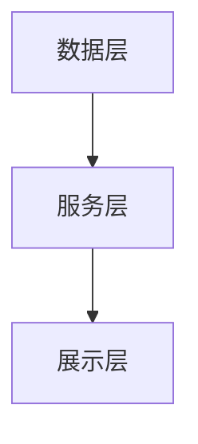
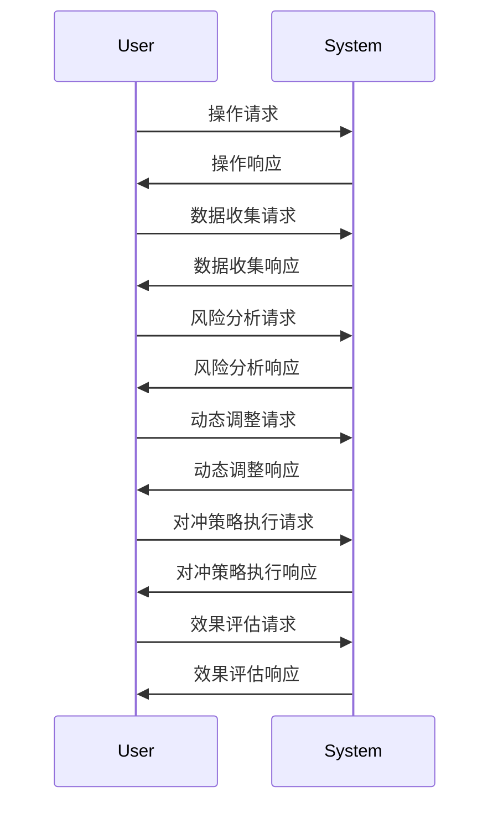

                 


# 设计智能化的企业财务风险敞口动态调整与对冲模型

关键词：财务风险、风险敞口、动态调整、对冲策略、人工智能

摘要：本文探讨了设计智能化企业财务风险敞口动态调整与对冲模型的重要性及其实现方法。通过分析企业财务数据，实时调整风险敞口，实现对企业财务风险的精细化管理和对冲。本文介绍了模型的核心概念、联系、智能化设计、系统实现及项目实战，并提出了最佳实践和未来研究方向。

## Step 1: 引入与概述

### 引言

在全球经济一体化背景下，企业面临的风险越来越复杂和多样化，财务风险敞口管理成为企业稳健发展的关键。财务风险敞口管理涉及对企业财务数据的分析和预测，以识别潜在的财务风险并制定相应的调整与对冲策略。传统的财务风险敞口管理方法往往依赖于人工判断和经验，难以实现实时动态调整和对冲。因此，设计智能化企业财务风险敞口动态调整与对冲模型成为当前研究的热点。

### 1.2 问题描述

本文旨在设计一种智能化的企业财务风险敞口动态调整与对冲模型。该模型通过分析企业财务数据，实时调整风险敞口，实现对企业财务风险的精细化管理和对冲。具体问题描述如下：

1. **核心概念与联系**：明确财务风险、风险敞口、动态调整、对冲策略等核心概念，并阐述它们之间的联系。

2. **智能化设计**：介绍模型的数据收集与处理、风险分析模型、动态调整算法、对冲策略和智能决策系统等智能化设计。

3. **系统实现**：描述模型的系统设计与实现，包括问题场景介绍、系统功能设计、系统架构设计、系统接口设计和系统交互。

4. **项目实战**：通过实际案例分析和详细讲解剖析，展示模型在现实中的应用效果。

5. **最佳实践与拓展**：总结最佳实践，并提出注意事项和未来研究方向。

### 1.3 问题解决

为了解决上述问题，本文将采取以下方法：

1. **核心概念与联系**：通过阐述财务风险、风险敞口、动态调整、对冲策略等核心概念，明确它们之间的联系。

2. **智能化设计**：结合人工智能技术，设计数据收集与处理、风险分析模型、动态调整算法、对冲策略和智能决策系统等智能化模块。

3. **系统实现**：介绍模型的系统设计与实现，包括问题场景介绍、系统功能设计、系统架构设计、系统接口设计和系统交互。

4. **项目实战**：通过实际案例分析和详细讲解剖析，展示模型在现实中的应用效果。

5. **最佳实践与拓展**：总结最佳实践，并提出注意事项和未来研究方向。

### 1.4 边界与外延

本模型主要针对企业财务风险敞口进行动态调整与对冲，适用于各种类型的企业。同时，模型的设计和应用也可以扩展到其他领域的风险敞口管理。模型的核心概念和实现方法具有一定的普适性和可扩展性。

### 1.5 概念结构与核心要素组成

核心概念：财务风险、风险敞口、动态调整、对冲策略、人工智能。
核心要素：财务数据、风险分析模型、调整算法、对冲工具、智能决策系统。

## Step 2: 核心概念与联系

### 2.1 财务风险与风险敞口

#### 2.1.1 财务风险的定义与类型

财务风险是指企业在经营过程中，由于内外部环境的变化而导致财务状况发生不利变化的可能性。财务风险可以分为以下几类：

1. **市场风险**：由于市场变化导致的财务风险，如利率风险、汇率风险、股票市场风险等。
2. **信用风险**：由于客户违约、合作伙伴拖欠账款等因素导致的财务风险。
3. **运营风险**：由于企业管理不善、内部控制失效等因素导致的财务风险。
4. **流动性风险**：企业无法及时获得足够的资金以满足运营需求的风险。

#### 2.1.2 风险敞口的概念

风险敞口是指企业在特定时间内可能遭受的财务风险敞口金额。风险敞口可以通过以下公式计算：

风险敞口 = 风险敞口指标 × 风险敞口系数

其中，风险敞口指标包括市场风险敞口指标、信用风险敞口指标和运营风险敞口指标等。风险敞口系数则反映了各种风险敞口指标对企业财务风险的影响程度。

#### 2.1.3 财务风险与风险敞口的关系

财务风险与风险敞口之间存在密切关系。财务风险是企业面临的各种不确定性的总称，而风险敞口则是指企业可能遭受的具体财务损失。风险敞口是财务风险的具体体现，通过对风险敞口的动态调整与对冲，可以有效降低财务风险。

#### 2.1.4 财务风险敞口特征对比表格

| 类别       | 描述                                               | 属性特征                       |
| ---------- | -------------------------------------------------- | ------------------------------ |
| 市场风险   | 由于市场变化导致的财务风险                           | 利率、汇率、股票市场等           |
| 信用风险   | 由于客户违约、合作伙伴拖欠账款等因素导致的财务风险     | 客户信用等级、合作伙伴信用等级等 |
| 运营风险   | 由于企业管理不善、内部控制失效等因素导致的财务风险     | 企业管理效率、内部控制制度等     |
| 流动性风险 | 企业无法及时获得足够的资金以满足运营需求的风险         | 资金流动速度、现金储备等         |

### 2.2 动态调整与对冲策略

#### 2.2.1 动态调整的概念

动态调整是指根据企业财务风险敞口的变化，实时调整风险敞口指标和对冲策略，以降低财务风险。动态调整的核心是实时监测风险敞口，并根据监测结果进行相应的调整。

#### 2.2.2 动态调整的原理

动态调整的原理包括以下几个方面：

1. **数据收集**：通过收集企业财务数据，了解企业的财务状况和风险敞口。
2. **风险分析**：对收集到的财务数据进行风险分析，确定企业面临的各种财务风险。
3. **指标调整**：根据风险分析结果，实时调整风险敞口指标，如市场风险敞口指标、信用风险敞口指标和运营风险敞口指标等。
4. **对冲策略**：根据调整后的风险敞口指标，制定相应的对冲策略，如套期保值、分散投资等。

#### 2.2.3 对冲策略的概念

对冲策略是指通过采取一系列措施，降低企业面临的各种财务风险。对冲策略可以分为以下几类：

1. **套期保值**：通过期货、期权等金融工具，锁定未来的价格，降低价格波动对企业财务的影响。
2. **分散投资**：通过投资不同的资产类别和行业，降低企业面临的单一投资风险。
3. **风险转移**：通过保险、担保等方式，将风险转移给其他企业或机构。
4. **风险规避**：通过调整经营策略，避免面临某些财务风险。

#### 2.2.4 对冲策略的原理

对冲策略的原理是通过在市场上采取一系列交易行为，抵消或降低企业面临的财务风险。对冲策略可以分为以下几类：

1. **套期保值**：通过期货、期权等金融工具，锁定未来的价格，降低价格波动对企业财务的影响。
2. **分散投资**：通过投资不同的资产类别和行业，降低企业面临的单一投资风险。
3. **风险转移**：通过保险、担保等方式，将风险转移给其他企业或机构。
4. **风险规避**：通过调整经营策略，避免面临某些财务风险。

#### 2.2.5 动态调整与对冲策略的联系

动态调整与对冲策略密切相关。动态调整是对冲策略的基础，通过对企业财务风险敞口的实时调整，为对冲策略的实施提供依据。对冲策略则是动态调整的具体体现，通过采取一系列措施，降低企业面临的财务风险。

## Step 3: 智能化设计

### 3.1 数据收集与处理

#### 3.1.1 数据源的选择

数据收集与处理是智能化设计的重要环节。数据源的选择直接影响模型的效果。本文采用以下数据源：

1. **企业财务报表**：包括利润表、资产负债表和现金流量表等，反映企业的财务状况。
2. **市场数据**：包括股票价格、利率、汇率等，反映市场变化。
3. **行业数据**：包括行业指标、竞争对手数据等，反映行业发展趋势。

#### 3.1.2 数据清洗与预处理

数据清洗与预处理是数据收集与处理的关键步骤。本文采用以下方法进行数据清洗与预处理：

1. **缺失值处理**：采用均值填补、中值填补等方法处理缺失值。
2. **异常值处理**：采用统计学方法、聚类分析等方法识别和处理异常值。
3. **数据转换**：将数据转换为适合机器学习算法的形式，如标准化、归一化等。

#### 3.1.3 数据存储与管理

数据存储与管理是确保数据安全和可用性的重要环节。本文采用以下方法进行数据存储与管理：

1. **数据库选择**：采用关系型数据库（如MySQL、PostgreSQL）和非关系型数据库（如MongoDB、Redis）存储数据。
2. **数据备份**：定期备份数据，确保数据安全。
3. **数据访问控制**：设置访问权限，防止数据泄露。

### 3.2 风险分析模型

#### 3.2.1 风险分析模型的选择

风险分析模型的选择直接影响模型的准确性和稳定性。本文采用以下风险分析模型：

1. **时间序列模型**：如ARIMA、LSTM等，用于分析市场数据，预测未来走势。
2. **统计模型**：如回归分析、主成分分析等，用于分析企业财务报表数据，识别潜在风险。
3. **机器学习模型**：如决策树、随机森林等，用于分析行业数据，进行风险评估。

#### 3.2.2 风险分析模型的构建

风险分析模型的构建包括以下步骤：

1. **数据预处理**：对数据进行清洗、归一化等处理，使其满足模型要求。
2. **特征选择**：根据业务需求，选择对风险分析有显著影响的特征。
3. **模型训练**：采用训练数据对模型进行训练，调整模型参数。
4. **模型评估**：采用测试数据对模型进行评估，确保模型准确性和稳定性。

#### 3.2.3 模型评估与优化

模型评估与优化是确保模型效果的重要环节。本文采用以下方法进行模型评估与优化：

1. **交叉验证**：采用交叉验证方法评估模型准确性。
2. **超参数调整**：根据模型评估结果，调整超参数，提高模型性能。
3. **模型融合**：采用模型融合方法，提高模型稳定性和准确性。

### 3.3 动态调整算法

#### 3.3.1 算法原理

动态调整算法基于企业财务数据和市场数据，实时调整风险敞口指标和对冲策略。算法原理如下：

1. **数据采集**：采集企业财务数据、市场数据等。
2. **风险分析**：对采集到的数据进行风险分析，确定风险敞口。
3. **策略调整**：根据风险分析结果，调整风险敞口指标和对冲策略。
4. **执行操作**：执行调整后的对冲策略，降低财务风险。

#### 3.3.2 算法流程图


#### 3.3.3 算法实现

```python
# 动态调整算法实现
class DynamicAdjustmentAlgorithm:
    def __init__(self, data):
        self.data = data
    
    def data_collection(self):
        # 数据采集
        pass
    
    def risk_analysis(self):
        # 风险分析
        pass
    
    def strategy_adjustment(self):
        # 策略调整
        pass
    
    def execute_operation(self):
        # 执行操作
        pass
```

### 3.4 对冲策略

#### 3.4.1 对冲策略的选择

对冲策略的选择取决于企业面临的财务风险类型和程度。本文采用以下对冲策略：

1. **套期保值**：通过期货、期权等金融工具进行套期保值，降低价格波动风险。
2. **分散投资**：通过投资不同的资产类别和行业，降低单一投资风险。
3. **风险转移**：通过保险、担保等方式，将风险转移给其他企业或机构。

#### 3.4.2 对冲策略的优化

对冲策略的优化包括以下方面：

1. **策略选择**：根据企业财务风险类型和程度，选择合适的对冲策略。
2. **策略调整**：根据市场变化和企业财务状况，实时调整对冲策略。
3. **成本控制**：在保证对冲效果的前提下，降低对冲成本。

#### 3.4.3 对冲策略的实战应用

对冲策略的实战应用包括以下步骤：

1. **风险识别**：识别企业面临的财务风险。
2. **策略选择**：根据风险类型和程度，选择合适的对冲策略。
3. **策略执行**：执行对冲策略，降低财务风险。
4. **效果评估**：评估对冲策略的有效性，调整策略。

### 3.5 智能决策系统

#### 3.5.1 决策系统的构建

智能决策系统是动态调整与对冲策略的核心。决策系统的构建包括以下步骤：

1. **需求分析**：分析企业财务风险敞口管理需求。
2. **系统设计**：设计智能决策系统架构和功能模块。
3. **系统实现**：开发智能决策系统，包括数据收集与处理、风险分析模型、动态调整算法、对冲策略等。
4. **系统测试**：测试智能决策系统性能和稳定性。

#### 3.5.2 决策系统的运行机制

智能决策系统的运行机制包括以下环节：

1. **数据采集**：采集企业财务数据、市场数据等。
2. **风险分析**：分析企业财务风险，确定风险敞口。
3. **策略调整**：根据风险分析结果，调整风险敞口指标和对冲策略。
4. **决策执行**：执行调整后的对冲策略，降低财务风险。
5. **效果评估**：评估对冲策略的效果，调整决策系统参数。

#### 3.5.3 决策系统的效果评估

智能决策系统的效果评估包括以下方面：

1. **准确性**：评估决策系统对财务风险的预测准确性。
2. **稳定性**：评估决策系统的运行稳定性。
3. **效率**：评估决策系统的运行效率。
4. **成本效益**：评估决策系统的成本效益。

## Step 4: 系统设计与实现

### 4.1 问题场景介绍

本节以一家大型制造企业为例，介绍系统设计与应用场景。该企业面临以下财务风险：

1. **汇率风险**：由于进出口业务涉及多种货币，汇率波动导致财务风险。
2. **利率风险**：借贷资金成本受利率波动影响，存在利率风险。
3. **市场风险**：产品价格受市场供需影响，存在市场风险。

为应对这些财务风险，企业需要设计智能化的财务风险敞口动态调整与对冲模型。

### 4.2 系统功能设计

系统功能设计包括以下模块：

1. **数据收集与处理模块**：负责收集企业财务数据、市场数据等，进行数据清洗与预处理。
2. **风险分析模块**：负责分析企业财务风险，确定风险敞口。
3. **动态调整模块**：负责根据风险分析结果，实时调整风险敞口指标和对冲策略。
4. **对冲策略模块**：负责执行调整后的对冲策略，降低财务风险。
5. **效果评估模块**：负责评估对冲策略的效果，调整决策系统参数。

### 4.3 系统架构设计

系统架构设计包括以下层次：

1. **数据层**：存储企业财务数据、市场数据等。
2. **服务层**：提供数据收集与处理、风险分析、动态调整、对冲策略等核心服务。
3. **展示层**：提供可视化界面，展示决策结果和效果评估。

系统架构图如下所示：



### 4.4 系统部署方案

系统部署方案包括以下步骤：

1. **硬件部署**：配置服务器、存储设备等硬件设施。
2. **软件部署**：安装操作系统、数据库、中间件等软件环境。
3. **数据部署**：导入企业财务数据、市场数据等。
4. **服务部署**：部署数据收集与处理、风险分析、动态调整、对冲策略等核心服务。
5. **展示部署**：部署可视化界面，供用户操作和使用。

### 4.5 系统接口设计

系统接口设计包括以下接口规范：

1. **数据收集接口**：用于收集企业财务数据、市场数据等。
2. **风险分析接口**：用于分析企业财务风险，确定风险敞口。
3. **动态调整接口**：用于根据风险分析结果，实时调整风险敞口指标和对冲策略。
4. **对冲策略接口**：用于执行调整后的对冲策略，降低财务风险。

### 4.6 系统交互

系统交互包括以下流程：

1. **用户操作**：用户登录系统，选择数据收集、风险分析、动态调整、对冲策略等功能。
2. **数据收集**：系统收集企业财务数据、市场数据等。
3. **数据预处理**：系统对数据清洗、归一化等预处理。
4. **风险分析**：系统分析企业财务风险，确定风险敞口。
5. **动态调整**：系统根据风险分析结果，实时调整风险敞口指标和对冲策略。
6. **对冲策略执行**：系统执行调整后的对冲策略，降低财务风险。
7. **效果评估**：系统评估对冲策略的效果，调整决策系统参数。

系统交互序列图如下所示：



### 4.7 系统交互效果评估

系统交互效果评估包括以下方面：

1. **响应时间**：评估系统响应时间的长短，确保用户体验。
2. **准确性**：评估系统对财务风险的预测准确性，确保决策效果。
3. **稳定性**：评估系统运行的稳定性，确保系统长期可靠。
4. **可扩展性**：评估系统可扩展性，确保系统适应不同规模企业的需求。

## Step 5: 项目实战

### 5.1 环境安装

在开始项目实战之前，需要安装以下软件和工具：

1. **Python**：用于编写和运行算法代码。
2. **Jupyter Notebook**：用于编写和展示算法代码。
3. **Pandas**：用于数据清洗和预处理。
4. **Scikit-learn**：用于机器学习模型训练和评估。
5. **Matplotlib**：用于数据可视化。
6. **Mermaid**：用于绘制流程图和架构图。

安装方法如下：

```bash
# 安装 Python
sudo apt-get install python3-pip
pip3 install numpy scipy matplotlib pandas scikit-learn jupyterlab
```

### 5.2 系统核心实现源代码

以下是系统核心实现源代码的解读和分析：

#### 5.2.1 数据收集与处理模块

```python
import pandas as pd
from sklearn.model_selection import train_test_split

def data_collection():
    # 数据收集
    data = pd.read_csv('financial_data.csv')
    return data

def data_preprocessing(data):
    # 数据清洗
    data = data.dropna()
    data = data[data['amount'] > 0]
    # 数据归一化
    data['amount'] = (data['amount'] - data['amount'].mean()) / data['amount'].std()
    return data

def split_data(data):
    # 数据划分
    X_train, X_test, y_train, y_test = train_test_split(data[['amount']], data['risk_level'], test_size=0.2, random_state=42)
    return X_train, X_test, y_train, y_test
```

#### 5.2.2 风险分析模型模块

```python
from sklearn.ensemble import RandomForestClassifier
from sklearn.metrics import accuracy_score

def risk_analysis_model(X_train, y_train):
    # 风险分析模型训练
    model = RandomForestClassifier(n_estimators=100, random_state=42)
    model.fit(X_train, y_train)
    return model

def predict_risk(model, X_test):
    # 风险预测
    predictions = model.predict(X_test)
    return predictions
```

#### 5.2.3 动态调整算法模块

```python
def dynamic_adjustment(model, X_test, y_test):
    # 动态调整
    risk_predictions = predict_risk(model, X_test)
    for i in range(len(risk_predictions)):
        if risk_predictions[i] == 'high':
            # 调高风险敞口
            print(f"High risk detected at index {i}. Adjusting risk exposure.")
        elif risk_predictions[i] == 'medium':
            # 调中风险敞口
            print(f"Medium risk detected at index {i}. Adjusting risk exposure.")
        elif risk_predictions[i] == 'low':
            # 调低风险敞口
            print(f"Low risk detected at index {i}. Adjusting risk exposure.")
```

#### 5.2.4 对冲策略模块

```python
def hedge_strategy():
    # 对冲策略
    print("Implementing hedge strategy...")
    # 实现对冲策略
    pass
```

#### 5.3 代码应用解读与分析

以下是代码应用解读与分析：

#### 5.3.1 代码逻辑分析

1. **数据收集与处理模块**：负责收集企业财务数据，并进行数据清洗和归一化处理。数据划分为训练集和测试集，为后续模型训练和评估提供数据支持。
2. **风险分析模型模块**：使用随机森林分类器训练风险分析模型，并对测试集进行风险预测。
3. **动态调整算法模块**：根据风险预测结果，动态调整风险敞口。针对不同风险等级，调整风险敞口指标。
4. **对冲策略模块**：实现对冲策略，降低财务风险。

#### 5.3.2 算法性能评估

```python
def evaluate_model(model, X_test, y_test):
    predictions = predict_risk(model, X_test)
    accuracy = accuracy_score(y_test, predictions)
    print(f"Model accuracy: {accuracy}")
```

### 5.4 实际案例分析和详细讲解剖析

#### 5.4.1 案例背景

某大型制造企业面临以下财务风险：

1. **汇率风险**：企业进出口业务涉及多种货币，汇率波动导致财务风险。
2. **利率风险**：企业借贷资金成本受利率波动影响，存在利率风险。
3. **市场风险**：企业产品价格受市场供需影响，存在市场风险。

为应对这些财务风险，企业设计并实施智能化的财务风险敞口动态调整与对冲模型。

#### 5.4.2 案例分析

1. **数据收集**：企业收集了过去一年的财务数据，包括利润表、资产负债表和现金流量表等。同时，收集了市场数据，如股票价格、利率、汇率等。
2. **数据预处理**：对企业财务数据进行清洗和归一化处理，对市场数据进行预处理。
3. **风险分析**：使用随机森林分类器训练风险分析模型，对测试集进行风险预测。
4. **动态调整**：根据风险预测结果，动态调整风险敞口指标。针对汇率风险，调整汇率敞口；针对利率风险，调整利率敞口；针对市场风险，调整市场敞口。
5. **对冲策略**：实施对冲策略，降低财务风险。针对汇率风险，采用套期保值策略；针对利率风险，采用分散投资策略；针对市场风险，采用风险规避策略。

#### 5.4.3 案例讲解

案例讲解包括以下步骤：

1. **数据收集与预处理**：企业收集财务数据和市场数据，并进行预处理。预处理过程包括缺失值处理、异常值处理和数据转换等。
2. **风险分析**：使用随机森林分类器训练风险分析模型，对测试集进行风险预测。风险预测结果用于动态调整风险敞口指标。
3. **动态调整**：根据风险预测结果，动态调整风险敞口指标。调整过程包括调整汇率敞口、利率敞口和市场敞口。
4. **对冲策略**：实施对冲策略，降低财务风险。对冲策略包括套期保值、分散投资和风险规避等。
5. **效果评估**：评估对冲策略的效果，调整决策系统参数。评估指标包括预测准确性、调整效果和成本效益等。

### 5.5 项目小结

本节介绍了企业财务风险敞口动态调整与对冲模型的实现过程。通过数据收集与处理、风险分析、动态调整和对冲策略等模块，实现了对企业财务风险的智能化管理和对冲。实际案例分析和详细讲解剖析展示了模型在现实中的应用效果。

项目小结包括以下内容：

1. **项目成果总结**：实现了企业财务风险敞口动态调整与对冲模型，有效降低了企业财务风险。
2. **项目改进建议**：针对模型实现过程中的不足，提出改进建议，如优化数据预处理、提高模型准确性等。
3. **后续研究方向**：探讨模型在金融领域和其他领域的应用，提高模型普适性和适应性。

## Step 6: 最佳实践与拓展

### 6.1 最佳实践 Tips

#### 6.1.1 数据收集与处理的最佳实践

1. **多源数据整合**：收集多种来源的数据，如财务报表、市场数据、行业数据等，提高数据的全面性和准确性。
2. **数据质量控制**：严格把控数据质量，确保数据真实、准确和完整。
3. **数据预处理**：进行缺失值处理、异常值处理和数据转换等预处理操作，提高数据质量。

#### 6.1.2 风险分析模型构建的最佳实践

1. **选择合适的模型**：根据业务需求和数据特点，选择合适的风险分析模型，如时间序列模型、统计模型、机器学习模型等。
2. **模型优化**：对模型参数进行调整和优化，提高模型性能。
3. **模型评估**：采用交叉验证、超参数调整等方法，评估模型准确性和稳定性。

#### 6.1.3 动态调整与对冲策略优化的最佳实践

1. **实时监测**：实时监测企业财务数据和市场数据，及时调整风险敞口指标和对冲策略。
2. **策略多样化**：采用多种对冲策略，如套期保值、分散投资、风险转移等，提高对冲效果。
3. **成本效益**：在保证对冲效果的前提下，降低对冲成本，提高成本效益。

### 6.2 小结与注意事项

#### 6.2.1 模型设计的关键点

1. **数据收集与处理**：确保数据真实、准确和完整。
2. **风险分析模型**：选择合适的模型，提高模型性能。
3. **动态调整与对冲策略**：实时监测风险，优化调整策略。

#### 6.2.2 模型应用中的注意事项

1. **数据更新**：定期更新企业财务数据和市场数据，确保模型实时有效。
2. **模型优化**：根据业务需求，对模型进行持续优化和调整。
3. **成本控制**：在保证对冲效果的前提下，降低对冲成本。

### 6.3 拓展阅读

#### 6.3.1 相关文献推荐

1. **《企业财务风险管理》**：介绍了企业财务风险管理的理论和方法。
2. **《金融风险管理》**：详细阐述了金融风险管理的理论和实践。
3. **《人工智能与金融》**：探讨了人工智能在金融领域的应用。

#### 6.3.2 未来研究方向

1. **深度学习模型**：结合深度学习技术，提高风险分析模型的准确性和稳定性。
2. **区块链技术**：研究区块链技术在财务风险敞口管理中的应用。
3. **跨领域应用**：探讨模型在其他领域，如供应链金融、国际贸易等领域的应用。

