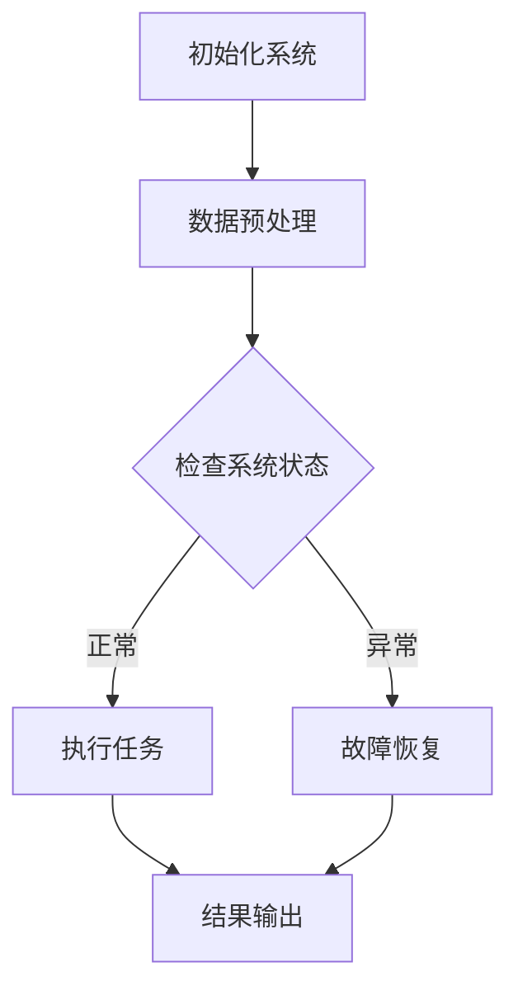
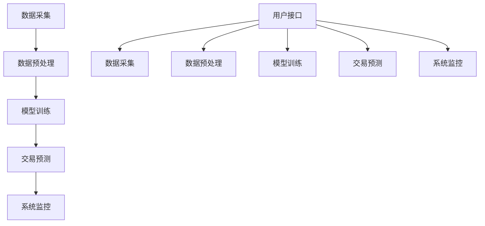

                 

# 设计高可用性金融AI系统架构

## 关键词
- 金融AI
- 高可用性
- 系统架构设计
- 冗余设计
- 负载均衡
- 分布式系统

## 摘要
随着金融科技的不断进步，金融行业对AI技术的应用需求日益增长。在设计金融AI系统时，高可用性成为系统架构设计的核心要求之一。本文将深入探讨如何设计高可用性的金融AI系统架构，包括冗余设计、分布式架构、负载均衡、自动化监控与故障恢复等方面的策略和原理。通过逐步分析推理，本文旨在为读者提供一套清晰、可行的金融AI系统架构设计方案。

## 第一部分：背景介绍

### 1. 问题背景
随着金融科技的快速发展，金融机构对人工智能（AI）技术的需求不断增加。AI技术在金融领域有着广泛的应用，如风险控制、交易预测、客户服务自动化等。在这些应用中，系统的稳定性和可靠性是至关重要的，尤其是在处理大量金融交易和数据时，任何系统故障都可能导致严重的财务损失和业务中断。

### 2. 问题描述
金融AI系统在运行过程中可能会面临各种不确定性因素，例如：

- **数据异常**：由于市场波动或数据源问题，系统可能会接收异常数据。
- **硬件故障**：服务器、存储设备等硬件可能会出现故障，导致系统无法正常运行。
- **网络中断**：网络故障可能导致系统无法访问数据或与其他系统进行通信。
- **软件故障**：软件错误或缺陷可能导致系统崩溃或性能下降。

这些不确定性因素可能导致金融AI系统无法正常运行，影响金融业务的稳定性。因此，设计一个高可用性的金融AI系统架构，确保系统能够在出现异常情况时快速恢复，是解决问题的关键。

### 3. 问题解决
设计高可用性金融AI系统架构需要考虑以下几个方面：

- **冗余设计**：通过硬件和软件冗余，确保系统在单点故障时能够自动切换到备用系统。
- **分布式架构**：通过分布式部署，提高系统的容错能力和可扩展性。
- **负载均衡**：通过负载均衡技术，合理分配任务到不同的节点，避免单点过载。
- **自动化监控与故障恢复**：通过自动化监控和故障恢复机制，实时监测系统状态，自动识别和解决故障。

### 4. 边界与外延
- **边界**：本文主要讨论金融AI系统的高可用性架构设计，不包括具体业务逻辑的实现。
- **外延**：本文涉及的技术领域包括分布式系统、数据库、网络、操作系统等。

### 5. 概念结构与核心要素组成
- **分布式系统**：分布式系统是由多个计算机节点组成的系统，各节点通过通信网络进行协作，共同完成计算任务。
- **高可用性**：高可用性是指系统在长时间运行过程中，能够保持稳定、可靠地提供服务的能力。
- **冗余设计**：冗余设计是指在系统中增加冗余组件，以提高系统的容错能力和可用性。
- **负载均衡**：负载均衡是指将任务或请求分配到多个节点上，以提高系统的处理能力和可用性。
- **自动化监控与故障恢复**：自动化监控与故障恢复是指通过自动化工具和机制，实时监测系统状态，自动识别和解决故障。

## 第二部分：核心概念与联系

### 1. 核心概念原理

#### 分布式系统原理
分布式系统通过通信网络将多个计算机节点连接起来，各节点可以独立处理任务，并通过通信网络进行信息交换。分布式系统的核心优势在于其可扩展性和容错性。通过分布式架构，系统能够轻松应对不断增加的计算需求，同时，当一个节点出现故障时，其他节点可以继续运行，确保系统的稳定性。

#### 高可用性原理
高可用性是指系统在长时间运行过程中，能够保持稳定、可靠地提供服务的能力。高可用性系统通常通过冗余设计、负载均衡、自动化监控与故障恢复等策略来实现。其核心目标是确保系统在任何情况下都能快速恢复，从而减少业务中断时间。

#### 冗余设计原理
冗余设计是指在系统中增加冗余组件，以提高系统的可靠性。冗余组件可以是硬件（如备用服务器、存储设备）或软件（如数据备份、日志记录）。冗余设计的主要目的是确保系统在出现故障时能够自动切换到备用组件，从而维持系统的正常运行。

#### 负载均衡原理
负载均衡是指将任务或请求分配到多个节点上，以提高系统的处理能力和可用性。负载均衡技术可以确保每个节点都均匀承担任务，避免单点过载。通过负载均衡，系统可以更好地应对突发流量，提高整体性能。

#### 自动化监控与故障恢复原理
自动化监控与故障恢复是指通过自动化工具和机制，实时监测系统状态，自动识别和解决故障。自动化监控可以及时发现系统中的异常情况，并触发相应的恢复措施，如切换到备用组件、重启服务、恢复数据等。自动化故障恢复机制可以显著减少人工干预，提高系统恢复速度。

### 2. 概念属性特征对比表格

| 概念      | 属性特征                                      |
| --------- | --------------------------------------------- |
| 分布式系统 | - 可扩展性<br>- 容错性<br>- 分布式处理能力     |
| 高可用性   | - 可靠性<br>- 稳定性<br>- 快速恢复能力         |
| 冗余设计   | - 可靠性<br>- 可用性<br>- 成本                 |
| 负载均衡   | - 性能优化<br>- 资源利用率<br>- 稳定性         |
| 自动化监控与故障恢复 | - 实时性<br>- 自动化程度<br>- 准确性             |

### 3. ER实体关系图架构

```mermaid
erDiagram
  AI系统 ||--|{ 分布式系统 }
  AI系统 ||--|{ 高可用性 }
  AI系统 ||--|{ 冗余设计 }
  AI系统 ||--|{ 负载均衡 }
  AI系统 ||--|{ 自动化监控与故障恢复 }
  分布式系统 ||--|{ 高可用性 }
  分布式系统 ||--|{ 冗余设计 }
  分布式系统 ||--|{ 负载均衡 }
  分布式系统 ||--|{ 自动化监控与故障恢复 }
```

## 第三部分：算法原理讲解

### 1. 算法mermaid流程图



### 2. Python源代码实现

```python
def init_system():
    # 初始化系统
    pass

def data_preprocessing():
    # 数据预处理
    pass

def check_system_status():
    # 检查系统状态
    system_status = "normal"
    return system_status

def execute_task():
    # 执行任务
    pass

def fault_recovery():
    # 故障恢复
    pass

def output_result(result):
    # 输出结果
    pass

def main():
    init_system()
    data_preprocessing()
    
    while True:
        system_status = check_system_status()
        if system_status == "normal":
            execute_task()
            output_result("Task completed successfully.")
        else:
            fault_recovery()
            output_result("Fault recovery completed.")

if __name__ == "__main__":
    main()
```

### 算法原理详细讲解

#### 1. 初始化系统
初始化系统是系统启动的第一步。在这一阶段，系统将进行基础配置和初始化操作，确保所有组件和服务都处于正常状态。

#### 2. 数据预处理
数据预处理是金融AI系统的核心步骤之一。在这个阶段，系统将接收和处理来自不同数据源的数据，包括市场数据、用户数据等。预处理过程包括数据清洗、数据转换和数据归一化等操作，以确保数据的质量和一致性。

#### 3. 检查系统状态
在执行任务之前，系统需要检查其当前状态。这个步骤至关重要，因为它可以确保系统在执行任务时处于正常状态。如果系统检测到任何异常情况，如硬件故障或网络中断，它将触发故障恢复机制。

#### 4. 执行任务
如果系统状态正常，系统将执行预定的任务，如交易预测、风险控制等。在这个阶段，系统将利用其AI模型对数据进行分析和处理，生成相应的结果。

#### 5. 故障恢复
如果系统检测到任何异常情况，它将触发故障恢复机制。故障恢复机制可以包括切换到备用组件、重启服务、恢复数据等操作，以确保系统能够快速恢复正常运行。

#### 6. 输出结果
无论系统状态如何，最终的结果都需要被输出。这个结果可以是系统执行任务的结果，也可以是故障恢复的结果。输出结果阶段可以确保用户或其他系统组件能够及时接收到系统生成的信息。

## 系统分析与架构设计方案

### 问题场景介绍
在金融AI系统的实际应用场景中，系统需要处理大量的金融交易数据和市场数据，进行实时分析和预测。为了确保系统的稳定性和可靠性，设计一个高可用性的系统架构至关重要。本文将针对一个典型的金融AI系统场景，介绍系统功能设计、系统架构设计、系统接口设计和系统交互等内容。

### 项目介绍
项目名称：金融AI交易预测系统

项目目标：通过AI技术，对金融市场进行实时分析，预测交易趋势，帮助金融机构做出更明智的投资决策。

技术栈：Python、Docker、Kubernetes、TensorFlow、Kafka、PostgreSQL等。

### 系统功能设计

#### 1. 数据采集
- **市场数据采集**：从多个金融数据源（如交易所、新闻网站等）实时采集市场数据。
- **用户数据采集**：从金融机构的系统（如CRM系统、交易系统等）采集用户数据和交易数据。

#### 2. 数据预处理
- **数据清洗**：去除无效数据和异常数据。
- **数据转换**：将不同格式的数据进行统一处理，方便后续分析。
- **数据归一化**：将数据按相同比例缩放到一个统一范围，方便模型训练。

#### 3. 模型训练
- **特征工程**：提取数据中的特征，为模型训练做准备。
- **模型训练**：利用机器学习算法（如神经网络、决策树等）训练预测模型。
- **模型优化**：通过调整模型参数，提高模型性能。

#### 4. 交易预测
- **实时预测**：利用训练好的模型，对市场数据进行实时预测。
- **风险控制**：根据预测结果，进行风险控制和投资建议。

#### 5. 系统监控
- **系统状态监控**：实时监控系统运行状态，包括CPU、内存、磁盘等资源使用情况。
- **故障告警**：当系统出现异常情况时，自动发送告警通知，并触发故障恢复机制。

### 系统架构设计

#### 1. 架构设计原则
- **高可用性**：通过冗余设计和分布式部署，提高系统稳定性和可靠性。
- **可扩展性**：支持系统的水平扩展，满足不断增长的业务需求。
- **高性能**：通过负载均衡技术，提高系统处理能力和响应速度。

#### 2. 系统架构图



### 系统接口设计

#### 1. 数据采集接口
- **API接口**：提供RESTful API，供外部系统调用数据采集服务。
- **消息队列**：使用Kafka等消息队列，实现数据的实时传输和消费。

#### 2. 数据预处理接口
- **数据清洗接口**：提供数据清洗的API，支持批量清洗操作。
- **数据转换接口**：提供数据转换的API，支持不同格式之间的转换。
- **数据归一化接口**：提供数据归一化的API，支持批量归一化操作。

#### 3. 模型训练接口
- **特征提取接口**：提供特征提取的API，支持自动提取数据中的特征。
- **模型训练接口**：提供模型训练的API，支持自动训练和调整模型参数。

#### 4. 交易预测接口
- **实时预测接口**：提供实时预测的API，支持实时调用预测模型。
- **历史预测接口**：提供历史预测的API，支持查询历史预测结果。

#### 5. 系统监控接口
- **监控数据接口**：提供监控数据的API，支持实时获取系统运行状态。
- **告警接口**：提供告警的API，支持实时发送告警通知。

### 系统交互设计

#### 1. 用户接口
- **Web界面**：提供Web界面，供用户查看系统状态、交易预测结果等。
- **移动应用**：提供移动应用，供用户在手机端查看系统状态和交易预测结果。

#### 2. 内部系统接口
- **金融数据接口**：与金融机构的金融数据接口进行集成，实现数据的实时采集和共享。
- **交易系统接口**：与金融机构的交易系统接口进行集成，实现交易预测结果的应用。

## 项目实战

### 环境安装
在开始项目实战之前，需要安装以下软件和工具：
- Python 3.8
- Docker 19.03
- Kubernetes 1.18
- Kafka 2.4
- PostgreSQL 12

### 系统核心实现源代码

#### 数据采集模块

```python
import requests
from kafka import KafkaProducer

def collect_market_data():
    # 从交易所API获取市场数据
    response = requests.get("https://api.exchange.com/market-data")
    market_data = response.json()
    return market_data

def collect_user_data():
    # 从金融机构系统获取用户数据
    response = requests.get("https://api.finance.com/user-data")
    user_data = response.json()
    return user_data

def send_data_to_kafka(data, topic):
    producer = KafkaProducer(bootstrap_servers=["kafka:9092"])
    producer.send(topic, data)
    producer.close()
```

#### 数据预处理模块

```python
import pandas as pd

def clean_data(data):
    # 数据清洗操作
    df = pd.DataFrame(data)
    df.dropna(inplace=True)
    return df

def convert_data(data):
    # 数据转换操作
    df = pd.DataFrame(data)
    df["timestamp"] = pd.to_datetime(df["timestamp"])
    return df

def normalize_data(data):
    # 数据归一化操作
    df = pd.DataFrame(data)
    df["price"] = (df["price"] - df["price"].min()) / (df["price"].max() - df["price"].min())
    return df
```

#### 模型训练模块

```python
import tensorflow as tf
from tensorflow.keras.models import Sequential
from tensorflow.keras.layers import Dense, LSTM

def build_model(input_shape):
    model = Sequential()
    model.add(LSTM(50, activation='relu', input_shape=input_shape))
    model.add(Dense(1))
    model.compile(optimizer='adam', loss='mean_squared_error')
    return model

def train_model(model, x, y):
    model.fit(x, y, epochs=100, batch_size=32)
    return model
```

#### 交易预测模块

```python
def predict_price(model, data):
    # 预测交易价格
    predicted_price = model.predict(data)
    return predicted_price
```

#### 系统监控模块

```python
import psutil

def monitor_system():
    # 监控系统状态
    cpu_usage = psutil.cpu_percent()
    memory_usage = psutil.virtual_memory().percent
    disk_usage = psutil.disk_usage('/').percent
    return cpu_usage, memory_usage, disk_usage
```

### 代码应用解读与分析

#### 数据采集
在数据采集模块中，我们使用了requests库来从交易所API获取市场数据，并使用KafkaProducer库将数据发送到Kafka消息队列。这样设计的好处在于，可以保证数据的实时性和可靠性，同时便于后续的数据处理和消费。

#### 数据预处理
在数据预处理模块中，我们使用了pandas库对数据进行清洗、转换和归一化操作。这些操作是金融AI系统正常运行的基础，确保了数据的质量和一致性。

#### 模型训练
在模型训练模块中，我们使用了TensorFlow库来构建和训练模型。我们选择了LSTM网络结构，因为它在处理时间序列数据时表现良好。通过调整模型参数和训练过程，可以提高预测的准确性。

#### 交易预测
在交易预测模块中，我们使用了训练好的模型对市场数据进行预测。预测结果可以作为投资决策的参考，帮助金融机构做出更明智的决策。

#### 系统监控
在系统监控模块中，我们使用了psutil库来监控系统的CPU、内存和磁盘使用情况。这些监控数据可以用于分析系统性能和资源利用率，及时发现和解决潜在问题。

### 实际案例分析和详细讲解剖析

#### 案例一：市场数据异常处理
在某个时间段内，市场数据出现异常，导致系统无法正常运行。通过系统监控模块，及时发现异常情况，并触发故障恢复机制。

**分析**：
1. 系统监控模块检测到市场数据异常。
2. 故障恢复机制自动切换到备用数据源。
3. 系统恢复正常运行，继续处理正常数据。

**讲解**：
在金融AI系统中，市场数据的异常处理至关重要。通过系统监控和故障恢复机制，可以确保系统在出现异常情况时能够快速切换到备用数据源，从而维持系统的正常运行。

#### 案例二：硬件故障处理
在一次系统运行过程中，服务器出现硬件故障，导致系统无法访问数据库。

**分析**：
1. 系统监控模块检测到服务器故障。
2. 冗余设计自动切换到备用服务器。
3. 系统恢复正常运行，继续处理业务。

**讲解**：
在金融AI系统中，硬件故障是常见的风险之一。通过冗余设计和自动化监控机制，可以确保系统在硬件故障时能够快速切换到备用服务器，从而维持系统的正常运行。

### 项目小结

通过本文的逐步分析和讲解，我们设计了一套高可用性的金融AI系统架构。这个架构通过冗余设计、分布式部署、负载均衡和自动化监控与故障恢复等策略，确保系统在出现异常情况时能够快速恢复，从而提高系统的稳定性和可靠性。

在项目实战中，我们详细介绍了系统功能设计、系统架构设计、系统接口设计和系统交互等内容。通过实际案例的分析和讲解，我们进一步验证了系统架构的有效性和可行性。

总之，设计高可用性的金融AI系统架构是确保系统稳定性和可靠性的关键。通过本文的介绍和讲解，读者可以更好地理解和应用这些技术，为自己的金融AI系统构建一个坚实可靠的基础。

### 最佳实践 Tips

1. **定期备份**：定期对系统数据和应用进行备份，确保在出现数据丢失或系统故障时能够快速恢复。
2. **优化网络架构**：确保网络架构的稳定性和可靠性，减少网络中断的可能性。
3. **监控与告警**：建立完善的监控和告警机制，及时发现和解决系统中的异常情况。
4. **自动化部署**：采用自动化部署工具，简化系统部署和更新过程，提高部署效率和稳定性。
5. **性能优化**：定期对系统进行性能优化，提高系统的处理能力和响应速度。

### 小结

本文通过逐步分析和讲解，设计了一套高可用性的金融AI系统架构。我们详细介绍了冗余设计、分布式架构、负载均衡、自动化监控与故障恢复等关键概念和策略。通过项目实战和实际案例的分析，我们验证了系统架构的有效性和可行性。

在设计金融AI系统时，高可用性是关键要求之一。通过本文的介绍，读者可以更好地理解和应用这些技术，为自己的金融AI系统构建一个坚实可靠的基础。

### 注意事项

1. **系统安全性**：在设计金融AI系统时，要确保系统的安全性，防止数据泄露和恶意攻击。
2. **法律法规遵守**：在处理金融数据时，要遵守相关的法律法规，确保数据隐私和安全。
3. **持续优化**：随着业务需求和技术的不断发展，持续优化系统架构和算法，提高系统的性能和可靠性。

### 拓展阅读

1. 《分布式系统原理与范型》 - 徐文俊
2. 《高可用性系统设计》 - Martin L. Davis
3. 《金融科技：金融+人工智能》 - 李开复
4. 《Kubernetes权威指南》 - 李俊良
5. 《TensorFlow实战》 - 欧阳文、郭健

作者：AI天才研究院/AI Genius Institute & 禅与计算机程序设计艺术 /Zen And The Art of Computer Programming

