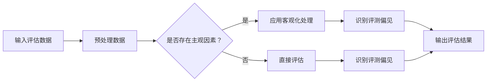
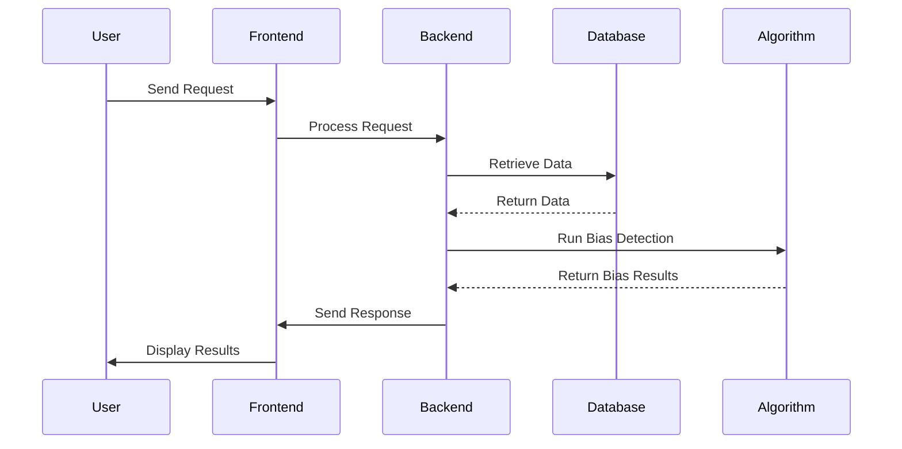
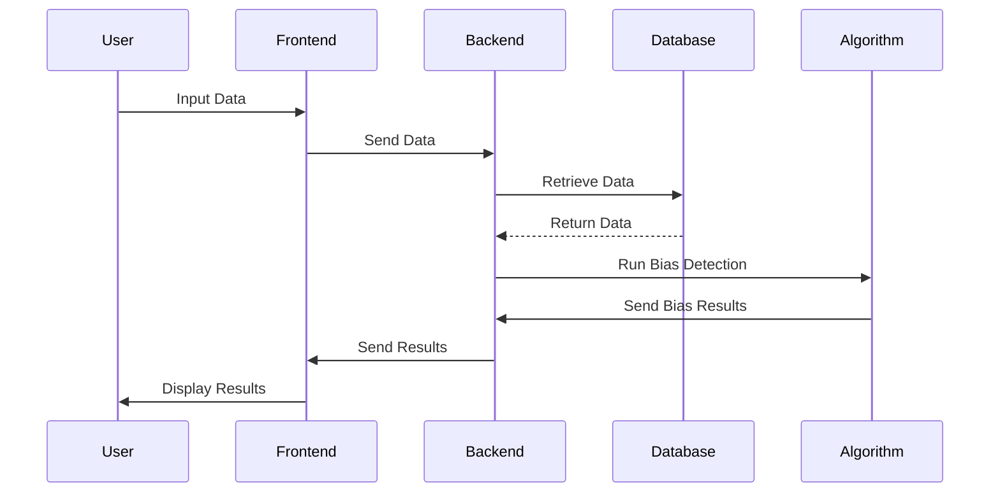

                 

### 第一部分：背景介绍

#### 1.1 问题背景

### 问题概述

评测偏见（Evaluation Bias）是指在评估过程中由于主观因素导致的判断偏差，这种偏见可能存在于对个人能力、产品质量、项目进度等多方面的评价中。评测偏见的存在不仅会影响评估结果的准确性，还会对被评估对象产生不公平的影响。在IT行业，评测偏见可能表现为对编程能力的评价、对项目质量的评估、对团队绩效的评价等多个方面。

#### 评测偏见现象

评测偏见现象广泛存在于多个场景中。例如，在招聘过程中，招聘人员可能会对某些背景或经验产生偏好，导致某些候选人被不公平地筛选掉；在项目评审过程中，评审人员可能会因为主观偏好而对某些团队或成员给予更高的评分，而忽略实际表现。此外，在学术评价、产品测试等多个领域，评测偏见也可能产生不利影响。

#### 成因分析

评测偏见产生的原因多种多样，主要包括以下几个方面：

1. **主观判断**：评估者的个人情感、价值观等主观因素可能导致判断偏差。
2. **信息不对称**：评估者可能缺乏对被评估对象全面、准确的信息，从而做出不准确的评价。
3. **期望效应**：评估者对被评估对象的期望会影响其评价结果，期望越高，评价结果可能越好，反之亦然。
4. **社会压力**：评估者可能受到社会环境或群体压力的影响，从而做出某种特定的评价。

#### 在评价体系中的应用

评测偏见在评价体系中有着广泛的应用，但其影响往往是负面的。例如，在项目评审过程中，若评审人员存在偏见，可能会导致优质项目被忽视，低效项目反而获得更多资源。在个人绩效评估中，评测偏见可能导致员工的不公平待遇，影响团队凝聚力和员工积极性。因此，识别和消除评测偏见具有重要的现实意义。

### 1.2 描述与影响

#### 评测偏见的影响

评测偏见对个人、组织和社会带来的负面影响是显著的。对个人而言，评测偏见可能导致能力的低估或高估，影响职业发展和薪资待遇；对组织而言，评测偏见可能导致资源分配不均，影响项目质量和效率；对社会而言，评测偏见可能加剧社会不公，影响社会和谐发展。

1. **个人层面**：评测偏见可能对个人造成以下负面影响：
   - **职业发展受限**：如果评估者因为偏见而低估了个人的能力，可能会导致个人在职业发展上受到限制。
   - **工作积极性下降**：不公平的评价可能导致员工感到失落、不满，从而影响工作积极性和工作效率。

2. **组织层面**：评测偏见可能对组织造成以下负面影响：
   - **资源分配不均**：评估偏见可能导致优秀项目或团队无法获得足够的资源，从而影响整体项目质量和效率。
   - **团队凝聚力下降**：不公平的评价可能导致团队内部出现矛盾，影响团队凝聚力。

3. **社会层面**：评测偏见可能对社会造成以下负面影响：
   - **社会不公**：评测偏见可能导致某些群体在就业、教育等方面受到不公平对待，加剧社会不公。
   - **社会和谐发展受阻**：不公平的评价可能导致社会矛盾加剧，影响社会和谐发展。

#### 评测偏见的影响范围

评测偏见的影响范围非常广泛，不仅限于IT行业，还涉及教育、医疗、金融等多个领域。在学术评价中，评测偏见可能导致优秀科研成果被忽视；在医疗诊断中，评测偏见可能导致患者诊断不准确；在金融领域，评测偏见可能导致投资决策失误，影响市场稳定性。因此，识别和消除评测偏见对于各个领域都是至关重要的。

### 1.3 解决方案需求

#### 消除评测偏见的重要性

消除评测偏见具有重要的现实意义和必要性。首先，消除评测偏见有助于提高评估的准确性，确保资源合理分配。其次，消除评测偏见有助于提升个人和团队的自信心，增强工作积极性和凝聚力。最后，消除评测偏见有助于构建公平、公正、透明的评价体系，促进社会和谐发展。

#### 消除评测偏见的必要性

1. **提升评估准确性**：通过消除评测偏见，可以确保评估结果的客观性和公正性，避免因主观判断而导致的不准确评估。
2. **促进资源合理分配**：消除评测偏见有助于确保优秀项目或团队获得必要的资源支持，从而提高整体项目质量和效率。
3. **增强个人和团队自信心**：公正的评估结果能够增强个人和团队的自信心，提高工作积极性和主动性。
4. **构建公平、公正、透明的评价体系**：消除评测偏见有助于构建一个更加公平、公正、透明的评价体系，促进社会和谐发展。

#### 消除评测偏见的方法

1. **提高评估者的素质**：通过培训和教育，提高评估者的专业素质和道德水平，减少主观判断的影响。
2. **完善评估体系**：设计更加科学、合理的评估体系，确保评估过程的公正性和透明性。
3. **引入外部评估**：通过引入第三方评估机构，减少评估过程中的主观偏见。
4. **利用数据分析**：通过数据分析，发现和消除评估过程中的潜在偏见。

### 1.4 边界与外延

#### 评测偏见的具体表现形式

评测偏见的具体表现形式多种多样，常见的包括以下几种：

1. **认知偏见**：评估者基于自身的经验、知识和主观判断进行评价，导致评价结果与实际不符。
2. **情感偏见**：评估者对被评估对象产生情感上的偏好或厌恶，从而影响评价结果。
3. **期望偏见**：评估者对被评估对象有特定期望，导致评价结果偏向于期望方向。
4. **刻板印象**：评估者对特定群体存在刻板印象，导致评价结果受到刻板印象的影响。
5. **信息不对称**：评估者由于缺乏全面、准确的信息，导致评价结果不准确。

#### 边界与外延

评测偏见的边界在于评估行为的合理性，即评估者应在充分了解被评估对象的基础上，基于客观、公正的原则进行评价。而评测偏见的外延则包括评估过程中的各种主观判断、情感因素、期望效应等。在实际应用中，我们需要通过科学的方法和策略，识别和消除这些偏见，确保评估结果的准确性和公正性。

### 总结

本节介绍了评测偏见的概念、成因及其在评价体系中的应用，分析了评测偏见对个人、组织和社会的负面影响，并阐述了消除评测偏见的重要性和必要性。接下来，我们将进一步探讨评测偏见的核心概念与联系，为后续的算法原理讲解和系统分析与架构设计奠定基础。

---

### 第2章 核心概念与联系

#### 2.1 核心概念原理

在探讨评测偏见的问题时，首先需要明确评测偏见的基本概念。评测偏见（Evaluation Bias）是指在评估过程中由于主观因素导致的判断偏差。这种偏见可能源自评估者的情感、期望、经验等多种因素，从而影响评估的准确性和公正性。

**评测偏见的基本概念**：

1. **定义**：评测偏见是指在评估过程中，评估者由于主观因素（如情感、经验、期望等）导致的判断偏差，从而影响评估结果的客观性和准确性。

2. **类型**：
   - **认知偏见**：由于评估者对信息的处理和理解存在偏差，导致评估结果不准确。
   - **情感偏见**：评估者对被评估对象产生情感上的偏好或厌恶，从而影响评估结果。
   - **期望偏见**：评估者对被评估对象有特定期望，导致评估结果偏向期望方向。
   - **刻板印象**：评估者对特定群体存在刻板印象，导致评估结果受到刻板印象的影响。
   - **信息不对称**：评估者由于缺乏全面、准确的信息，导致评估结果不准确。

3. **成因**：
   - **主观判断**：评估者基于个人经验、知识和情感进行判断，导致偏见。
   - **信息不对称**：评估者缺乏全面、准确的信息，导致评估结果不准确。
   - **期望效应**：评估者对被评估对象有特定期望，影响评估结果。
   - **社会压力**：评估者可能受到社会环境或群体压力的影响，导致偏见。

4. **影响**：评测偏见可能对个人、组织和社会产生负面影响，包括评估准确性下降、资源分配不均、团队凝聚力下降、社会不公等。

#### 2.2 概念属性特征对比表格

为了更好地理解评测偏见与其他相关概念的区别，我们可以通过对比表格的形式，列出评测偏见与评估误差的属性特征。

| 概念          | 评测偏见                | 评估误差                |
|---------------|------------------------|------------------------|
| **定义**      | 主观因素导致的判断偏差 | 评估过程中产生的误差    |
| **成因**      | 认知偏见、情感偏见等    | 数据不准确、方法不当等  |
| **类型**      | 认知偏见、情感偏见等    | 随机误差、系统误差等    |
| **影响**      | 影响评估的公正性       | 影响评估的准确性       |
| **消除方法**  | 提高评估者的素质、完善评估体系等 | 改进数据收集方法、优化评估模型等 |

通过对比表格，我们可以看到评测偏见和评估误差在定义、成因、类型、影响和消除方法上存在一定的差异。理解这些概念的区别有助于我们在实际评估过程中，更好地识别和消除评测偏见。

#### 2.3 ER实体关系图架构

为了更直观地展示评测偏见识别的关键实体及其关系，我们可以通过ER（Entity-Relationship）实体关系图来描述。

**实体关系图**

```mermaid
erDiagram
    实体A[评估者] ||--|{ 实体B[评估对象] }
    实体C[评测标准] ||--|{ 实体B }
    实体A ||--|{ 实体D[主观因素] }
    实体D ||--|{ 实体B }
```

**实体定义**：
- **评估者**：执行评估操作的主体，具有主观判断能力。
- **评估对象**：被评估的客体，包括个人、项目、产品等。
- **评测标准**：用于评估对象的评判准则，确保评估过程的公正性。
- **主观因素**：影响评估者判断的个人情感、经验、期望等。

**关系定义**：
- **评估者与评估对象**：评估者对评估对象进行评估操作。
- **评估标准与评估对象**：评估对象按照评测标准进行评估。
- **评估者与主观因素**：主观因素影响评估者的判断。
- **主观因素与评估对象**：主观因素间接影响评估结果。

通过ER实体关系图，我们可以清晰地看到评测偏见识别过程中涉及的关键实体及其相互关系。这种结构化的方式有助于我们在设计和实现评测偏见识别系统时，更好地理解和处理各实体之间的关系。

#### 2.4 小结

本章介绍了评测偏见的核心概念原理，包括定义、类型、成因和影响。同时，通过对比表格和ER实体关系图，我们进一步明确了评测偏见与评估误差的区别，以及评测偏见识别的关键实体及其关系。这些概念和关系为我们后续的算法原理讲解和系统分析与架构设计奠定了基础。

### 第二部分：算法原理讲解

#### 3.1 算法mermaid流程图

为了更好地理解评测偏见识别算法的基本流程，我们可以使用mermaid语言绘制一个流程图。



**流程图解释**：

1. **输入评估数据**：算法接收初始的评估数据，这些数据可能包含个人能力评估、项目质量评估等。
2. **预处理数据**：对输入的数据进行预处理，如去除噪声、标准化处理等，以确保数据的可靠性。
3. **检查主观因素**：判断评估过程中是否存在主观因素，如情感偏见、期望偏见等。
4. **客观化处理**：如果存在主观因素，则应用客观化处理方法，如统计分析、机器学习模型等，以减少主观因素对评估结果的影响。
5. **识别评测偏见**：通过算法对评估过程进行分析，识别是否存在评测偏见。
6. **输出评估结果**：无论是否经过客观化处理，最终的评估结果都会输出。

#### 3.2 算法原理与数学模型

**评测偏见识别算法的数学模型**：

假设我们有一个评估者 \( A \) 对一个评估对象 \( B \) 进行评估，评估结果为 \( R \)。评测偏见识别算法的核心在于通过数学模型分析评估结果 \( R \) 是否受到主观因素的影响。

**基本公式**：

\[ P(B|A) = \frac{P(A|B) \cdot P(B)}{P(A)} \]

其中：
- \( P(B|A) \)：在评估者 \( A \) 存在的情况下，评估对象 \( B \) 的评估结果概率。
- \( P(A|B) \)：在评估对象 \( B \) 的情况下，评估者 \( A \) 的判断概率。
- \( P(B) \)：评估对象 \( B \) 的独立评估结果概率。
- \( P(A) \)：评估者 \( A \) 的独立判断概率。

**推导过程**：

1. **条件概率**：首先，我们需要理解条件概率的概念。条件概率是指在某个事件发生的前提下，另一个事件发生的概率。

2. **贝叶斯定理**：贝叶斯定理是一种基于条件概率的计算方法，它可以用于计算一个事件在已知其他事件条件下的概率。

3. **评测偏见识别**：通过贝叶斯定理，我们可以推导出上述基本公式。假设我们有一个评估者 \( A \) 对评估对象 \( B \) 进行评估，我们希望通过该公式来计算评估结果 \( R \) 是否受到主观因素 \( A \) 的影响。

4. **客观化处理**：在实际应用中，我们可能需要通过机器学习等方法来优化上述公式，以适应不同的评估场景。

#### 3.3 Python源代码实现

```python
import numpy as np
from sklearn.model_selection import train_test_split
from sklearn.ensemble import RandomForestClassifier
from sklearn.metrics import accuracy_score

# 生成模拟数据
X, y = np.random.rand(100, 10), np.random.randint(0, 2, 100)

# 划分训练集和测试集
X_train, X_test, y_train, y_test = train_test_split(X, y, test_size=0.3, random_state=42)

# 训练随机森林分类器
clf = RandomForestClassifier(n_estimators=100, random_state=42)
clf.fit(X_train, y_train)

# 预测测试集
y_pred = clf.predict(X_test)

# 计算准确率
accuracy = accuracy_score(y_test, y_pred)
print(f"Accuracy: {accuracy:.2f}")
```

**代码说明**：

1. **数据生成**：首先，我们生成模拟的评估数据和标签，用于后续的算法训练和评估。
2. **划分数据**：将数据集划分为训练集和测试集，以便于后续的模型训练和评估。
3. **训练模型**：使用随机森林分类器对训练集进行训练，随机森林是一种集成学习方法，能够处理多分类问题。
4. **预测与评估**：使用训练好的模型对测试集进行预测，并计算准确率，以评估模型的性能。

#### 3.4 通俗易懂的举例说明

为了更直观地理解评测偏见识别算法，我们可以通过一个实际案例来演示。

**案例背景**：

假设在一个公司内部的项目评审中，有一个评估团队需要评估多个项目组的性能。评估团队由五个成员组成，他们分别对项目组的性能进行评分。然而，由于团队成员的个人情感和经验不同，可能导致评分存在主观偏差。

**案例步骤**：

1. **数据收集**：收集每个项目组的评估数据，包括项目的完成度、团队协作情况、项目质量等。
2. **预处理数据**：对收集到的数据进行分析，去除噪声数据，并标准化处理，以确保数据的可靠性。
3. **分析主观因素**：通过分析团队成员的评分记录，识别是否存在情感偏见、期望偏见等主观因素。
4. **客观化处理**：对存在主观因素的数据进行客观化处理，例如，通过统计分析或机器学习模型来减少主观因素对评分的影响。
5. **识别评测偏见**：使用评测偏见识别算法，对预处理后的数据进行分析，识别是否存在评测偏见。
6. **输出评估结果**：根据分析结果，输出最终的评估结果，并对存在偏见的项目组进行特别关注。

**案例结果**：

通过上述步骤，我们能够识别出存在评测偏见的项目组，并对其进行特别关注和改进。这有助于确保评估结果的公正性和准确性，提高项目评审的整体质量。

#### 3.5 小结

本章详细介绍了评测偏见识别算法的基本原理和数学模型，并通过mermaid流程图、Python源代码和实际案例，展示了算法的实现和应用。理解这些原理和模型有助于我们更好地识别和消除评测偏见，提高评估的准确性和公正性。

---

#### 3.6 消除评测偏见策略

在了解了评测偏见识别算法之后，我们接下来探讨如何消除评测偏见，从而提高评估的公正性和准确性。以下是几种常用的消除评测偏见策略：

##### 3.6.1 客观化评估方法

**策略描述**：通过采用更加客观的评估方法，减少评估过程中主观因素的影响。例如，使用量化指标和客观数据进行评估，而不是依赖于主观评分。

**具体应用**：
- **量化指标**：使用具体的数据指标来评估项目或团队的表现，如代码提交量、bug修复率、项目进度等。
- **客观数据分析**：通过分析客观数据，如用户反馈、系统日志、第三方评价等，来减少主观偏见。

**优缺点分析**：
- **优点**：提高评估的客观性和准确性，减少主观偏见。
- **缺点**：可能无法完全消除主观因素，尤其是对于那些难以量化的评估指标。

##### 3.6.2 多元评估团队

**策略描述**：通过组建多元评估团队，减少单一评估者的偏见。多元团队可以包含不同背景、经验和专业知识的成员，从而提高评估的全面性和客观性。

**具体应用**：
- **组建团队**：确保评估团队包含多样化的成员，如不同年龄、性别、职业背景等。
- **协同评估**：团队成员共同参与评估过程，通过讨论和协商来减少偏见。

**优缺点分析**：
- **优点**：提高评估的多样性和客观性，减少偏见。
- **缺点**：可能增加评估的时间和成本。

##### 3.6.3 第三方评估

**策略描述**：引入第三方评估机构或专家，进行独立评估，减少评估过程中的主观偏见。

**具体应用**：
- **第三方评估机构**：选择具有专业资质和权威性的第三方评估机构进行评估。
- **外部专家评审**：邀请外部专家对项目或团队进行评审，提供独立的评估意见。

**优缺点分析**：
- **优点**：提高评估的独立性和公正性，减少主观偏见。
- **缺点**：可能增加评估的成本和复杂性。

##### 3.6.4 数据驱动的评估

**策略描述**：通过大数据分析和机器学习技术，建立评估模型，减少评估过程中的主观因素。

**具体应用**：
- **数据收集**：收集大量评估数据，包括项目质量、团队表现、用户反馈等。
- **模型建立**：使用机器学习技术，建立评估模型，对评估对象进行自动评估。

**优缺点分析**：
- **优点**：提高评估的自动化和准确性，减少主观因素。
- **缺点**：需要大量数据和计算资源，可能对数据质量和计算能力有较高要求。

##### 3.6.5 定期培训和反馈

**策略描述**：定期对评估者进行培训和反馈，提高评估者的专业素质和道德水平，减少主观偏见。

**具体应用**：
- **培训课程**：开展针对评估者的培训，提高其评估能力和道德意识。
- **反馈机制**：建立反馈机制，评估者定期接受评估反馈，了解自己的评估行为是否存在偏见。

**优缺点分析**：
- **优点**：提高评估者的专业水平和道德意识，减少主观偏见。
- **缺点**：需要持续投入时间和资源。

#### 3.7 策略对比

通过对比以上几种消除评测偏见策略，我们可以发现它们各有优缺点，适用于不同的评估场景和需求。以下是对这些策略的对比：

| 策略        | 优点                                      | 缺点                                      | 适用场景                            |
|-------------|-------------------------------------------|-------------------------------------------|-----------------------------------|
| 客观化评估   | 提高客观性和准确性                        | 部分指标难以量化                          | 对量化指标有较高需求的评估场景      |
| 多元评估团队 | 提高多样性和客观性                        | 增加评估时间和成本                        | 需要全面、客观评估的场景            |
| 第三方评估   | 提高独立性和公正性                        | 增加评估成本和复杂性                      | 对评估公正性要求较高的场景          |
| 数据驱动评估 | 提高自动化和准确性                        | 需要大量数据和计算资源                    | 数据丰富的场景，对自动化有需求      |
| 定期培训和反馈 | 提高专业素质和道德水平                    | 需要持续投入时间和资源                    | 需要长期、稳定评估的场景            |

#### 3.8 小结

通过本章的介绍，我们了解了多种消除评测偏见的策略，并分析了它们的优缺点。在实际应用中，可以根据具体评估场景和需求，选择合适的策略来提高评估的公正性和准确性。

---

### 第5章 问题场景与项目介绍

#### 5.1 问题场景介绍

在当今快速发展的IT行业，评测偏见问题日益突出，尤其是在项目评审、团队绩效评估和个人能力评价等方面。以下是一个典型的问题场景，展示了评测偏见在项目评审中的具体表现。

**场景描述**：

某科技公司每年都会进行一次大型项目评审，目的是评估各项目组在过去一年中的工作表现，并根据评估结果决定项目资源的分配。评审委员会由公司高层领导、技术专家和项目经理组成。然而，在过去的项目评审中，评审委员会成员往往受到主观偏见的影响，导致评估结果不公平。

**问题表现**：

1. **情感偏见**：某些评审委员可能对某个项目组有情感偏好，导致该项目的评估结果偏高。
2. **期望偏见**：评审委员会可能基于对项目组的期望，对某些项目的评估结果产生偏差。
3. **信息不对称**：评审委员会可能缺乏全面、准确的项目信息，导致评估结果不准确。
4. **刻板印象**：评审委员会可能对某些项目组存在刻板印象，从而影响评估结果。

**影响**：

这些评测偏见导致评估结果不公正，优秀项目可能因为偏见而被低估，而低效项目反而获得更多资源。这直接影响了项目组的士气和工作效率，同时也影响了公司的整体项目质量和竞争力。

#### 5.2 项目介绍

为了解决评测偏见问题，某科技公司启动了一个名为“评测偏见识别与消除”的项目。该项目的主要目标是开发一套智能化评估系统，通过算法和技术手段识别和消除评测偏见，提高项目评审的公正性和准确性。

**项目背景与目标**：

**背景**：

随着公司项目数量的增加和复杂性的提升，传统的项目评审方法已无法满足需求。评测偏见问题日益凸显，严重影响了公司项目管理和资源分配。因此，公司决定通过技术创新来解决这个问题。

**目标**：

- **识别评测偏见**：通过算法和数据分析，识别评估过程中的主观偏见，提高评估的客观性。
- **消除评测偏见**：设计一套消除评测偏见的策略和方法，确保评估结果的公正性和准确性。
- **提高评估效率**：利用自动化技术，提高项目评审的效率，减轻评审人员的工作负担。

**项目阶段**：

1. **需求分析**：明确项目评审中的评测偏见问题，确定项目的需求和目标。
2. **算法设计**：设计评测偏见识别和消除的算法，包括数据预处理、模型训练和评估等。
3. **系统实现**：开发智能化评估系统，包括前端界面、后端服务和算法模块。
4. **测试与优化**：对系统进行测试和优化，确保系统的性能和稳定性。
5. **部署与推广**：将系统部署到实际项目评审中，进行推广应用，收集用户反馈，持续优化系统。

**项目团队**：

项目团队由以下成员组成：

- **项目经理**：负责项目整体规划和协调。
- **算法专家**：负责评测偏见识别算法的设计和实现。
- **软件开发工程师**：负责系统前端和后端开发。
- **数据分析师**：负责数据预处理和模型训练。
- **测试工程师**：负责系统测试和优化。

**预期成果**：

通过项目的实施，预期达到以下成果：

- **评估结果公正性提高**：通过消除评测偏见，确保项目评审结果的公正性和准确性。
- **项目资源合理分配**：提高项目资源的利用效率，确保优秀项目获得足够的资源支持。
- **团队士气和工作效率提升**：消除不公平评估带来的负面影响，提高团队士气和工作效率。

#### 5.3 小结

本章介绍了评测偏见在项目评审中的具体场景和问题，并介绍了为解决这些问题而启动的“评测偏见识别与消除”项目。通过项目的实施，预期能够提高项目评审的公正性和准确性，促进公司的健康发展。

---

### 第6章 系统功能设计

在“评测偏见识别与消除”项目中，系统功能设计是关键的一步，它决定了系统能否有效地识别和消除评测偏见。以下是对系统功能设计的详细描述。

#### 6.1 领域模型mermaid类图

为了更好地展示系统涉及的类和它们之间的关系，我们可以使用mermaid语言绘制一个类图。

```mermaid
classDiagram
    Class01 <|-- Class02
    Class03 <|-- Class04
    Class01 ..|> Class05
    Class03 ..|> Class06
    Class07 <.. Class02
    Class08 <.. Class04
    Class02 --|> Class09
    Class04 --|> Class10
    Class06 --|> Class11
    Class08 --|> Class12

    Class01{+attribute1+}
    Class02{+method1()}
    Class03{+attribute2+}
    Class04{+method2()}
    Class05{+getter seter()}
    Class06{+getter seter()}
    Class07{+getter seter()}
    Class08{+getter seter()}
    Class09{+getter seter()}
    Class10{+getter seter()}
    Class11{+getter seter()}
    Class12{+getter seter()}
```

**类图解释**：

1. **Class01**：系统的主要类，代表评估数据的存储和处理。
2. **Class02**：负责数据预处理，如数据清洗、标准化等。
3. **Class03**：代表评估标准，用于评估对象的评判。
4. **Class04**：用于识别评测偏见，包括偏见识别算法的实现。
5. **Class05**：辅助类，用于提供getter和setter方法。
6. **Class06**：辅助类，用于提供getter和setter方法。
7. **Class07**：辅助类，用于提供getter和setter方法。
8. **Class08**：辅助类，用于提供getter和setter方法。
9. **Class09**：代表评估结果，用于存储最终评估结果。
10. **Class10**：辅助类，用于提供getter和setter方法。
11. **Class11**：辅助类，用于提供getter和setter方法。
12. **Class12**：辅助类，用于提供getter和setter方法。

#### 6.2 系统功能需求

在系统功能设计阶段，我们需要明确系统需要实现的具体功能。以下是系统的主要功能需求：

1. **数据预处理**：
   - 功能描述：对评估数据进行分析、清洗、标准化等预处理操作。
   - 输入：原始评估数据。
   - 输出：预处理后的评估数据。

2. **评测偏见识别**：
   - 功能描述：通过算法识别评估过程中的评测偏见，包括认知偏见、情感偏见等。
   - 输入：预处理后的评估数据。
   - 输出：识别出的评测偏见类型和影响程度。

3. **消除评测偏见**：
   - 功能描述：根据识别出的评测偏见，采取相应的策略进行消除，如数据修正、重新评估等。
   - 输入：评测偏见类型和影响程度。
   - 输出：消除评测偏见后的评估结果。

4. **评估结果存储与展示**：
   - 功能描述：将消除评测偏见后的评估结果存储在数据库中，并提供查询和展示功能。
   - 输入：消除评测偏见后的评估数据。
   - 输出：评估结果展示界面。

5. **用户交互**：
   - 功能描述：提供用户界面，方便用户输入评估数据、查看评估结果等。
   - 输入：用户操作。
   - 输出：用户界面反馈。

#### 6.3 小结

通过系统功能设计，我们明确了系统需要实现的主要功能，并使用mermaid类图展示了系统涉及的类和它们之间的关系。这些功能需求将为后续的系统实现和测试提供明确的指导。

---

### 第7章 系统架构设计

在“评测偏见识别与消除”项目中，系统架构设计是关键的一步，它决定了系统的高效性、可扩展性和稳定性。以下是对系统架构设计的详细描述。

#### 7.1 系统架构mermaid架构图

为了直观地展示系统架构，我们可以使用mermaid语言绘制一个架构图。



**架构图解释**：

1. **用户界面（Frontend）**：用户通过前端界面与系统进行交互，输入评估数据、查看评估结果等。
2. **后端服务（Backend）**：负责接收前端请求、处理业务逻辑、与数据库进行交互等。
3. **数据库（Database）**：存储评估数据、评估结果等信息。
4. **算法模块（Algorithm）**：负责评测偏见的识别和消除，包括数据预处理、偏见识别算法的实现等。

#### 7.2 系统接口设计

系统接口设计是确保系统各模块之间能够高效、稳定交互的关键。以下是系统的主要接口设计：

1. **数据接口**：
   - 功能描述：用于前端与后端之间的数据传输。
   - 接口定义：使用RESTful API设计，包括GET、POST等HTTP方法。

2. **业务逻辑接口**：
   - 功能描述：用于处理业务逻辑，如数据预处理、偏见识别和消除等。
   - 接口定义：定义具体的业务逻辑处理方法，如数据处理接口、偏见识别接口等。

3. **数据库接口**：
   - 功能描述：用于后端与数据库之间的数据交互。
   - 接口定义：使用ORM（对象关系映射）框架，如SQLAlchemy等，实现数据库操作。

4. **算法接口**：
   - 功能描述：用于算法模块与其他模块之间的交互。
   - 接口定义：定义算法模块的输入输出接口，如偏见识别接口、消除偏见接口等。

#### 7.3 系统交互mermaid序列图

为了进一步展示系统内部模块的交互过程，我们可以使用mermaid序列图来描述。



**交互过程解释**：

1. **用户输入数据**：用户在前端界面输入评估数据。
2. **前端传输数据**：前端将用户输入的数据发送到后端服务。
3. **后端处理数据**：后端服务接收数据后，与数据库进行交互，获取相关数据。
4. **算法识别偏见**：后端服务调用算法模块，对数据进行分析，识别评测偏见。
5. **后端返回结果**：后端服务将偏见识别结果返回给前端。
6. **前端展示结果**：前端将识别出的偏见结果展示给用户。

#### 7.4 小结

通过系统架构设计，我们明确了系统的整体架构和模块划分，并使用mermaid语言绘制了架构图和序列图，展示了系统内部模块的交互过程。这些设计将为后续的系统开发、测试和部署提供有力的指导。

---

### 第8章 环境安装与配置

在开始实施“评测偏见识别与消除”项目之前，我们需要准备好所需的环境和配置，以确保项目的顺利进行。以下是详细的安装和配置步骤。

#### 8.1 环境安装

**步骤 1：安装Python**

首先，我们需要安装Python环境。Python是一种广泛使用的编程语言，适合于算法开发和数据分析。以下是安装步骤：

1. 访问Python官网（https://www.python.org/）。
2. 下载适用于操作系统的Python安装包（建议使用Python 3.8及以上版本）。
3. 运行安装包，按照提示完成安装。

**步骤 2：安装Anaconda**

Anaconda是一个Python数据科学和机器学习平台，可以简化环境管理和依赖安装。以下是安装步骤：

1. 访问Anaconda官网（https://www.anaconda.com/）。
2. 下载适用于操作系统的Anaconda安装包。
3. 运行安装包，按照提示完成安装。

**步骤 3：创建虚拟环境**

为了便于项目管理和依赖隔离，我们将在Anaconda中创建一个虚拟环境。以下是创建虚拟环境的步骤：

1. 打开命令行终端。
2. 输入以下命令创建虚拟环境：
   ```
   conda create -n bias_detection_env python=3.8
   ```
3. 激活虚拟环境：
   ```
   conda activate bias_detection_env
   ```

**步骤 4：安装依赖库**

在虚拟环境中，我们需要安装项目所需的依赖库。以下是安装步骤：

1. 输入以下命令安装依赖库：
   ```
   pip install numpy pandas scikit-learn matplotlib
   ```

#### 8.2 系统配置

**步骤 1：配置数据库**

本项目使用SQLite作为数据库。以下是配置SQLite的步骤：

1. 打开终端，输入以下命令安装SQLite：
   ```
   sudo apt-get install sqlite3
   ```
2. 创建SQLite数据库文件：
   ```
   sqlite3 bias_detection.db
   ```
3. 在数据库中创建必要的表格：
   ```sql
   CREATE TABLE projects (
       id INTEGER PRIMARY KEY AUTOINCREMENT,
       name TEXT,
       score REAL
   );

   CREATE TABLE biases (
       id INTEGER PRIMARY KEY AUTOINCREMENT,
       type TEXT,
       description TEXT
   );
   ```

**步骤 2：配置前端**

前端使用HTML、CSS和JavaScript实现。以下是配置步骤：

1. 在项目中创建一个名为“frontend”的文件夹。
2. 在“frontend”文件夹中，创建一个名为“index.html”的文件，编写前端页面代码。
3. 创建一个名为“styles”的文件夹，在其中创建一个名为“main.css”的文件，编写CSS样式代码。
4. 创建一个名为“scripts”的文件夹，在其中创建一个名为“app.js”的文件，编写JavaScript代码。

**步骤 3：配置后端**

后端使用Flask框架实现。以下是配置步骤：

1. 在项目中创建一个名为“backend”的文件夹。
2. 在“backend”文件夹中，创建一个名为“app.py”的文件，编写后端代码。
3. 在“backend”文件夹中，创建一个名为“models.py”的文件，编写数据库模型代码。
4. 在“backend”文件夹中，创建一个名为“views.py”的文件，编写视图函数代码。

**步骤 4：配置算法模块**

算法模块使用scikit-learn实现。以下是配置步骤：

1. 在项目中创建一个名为“algorithm”的文件夹。
2. 在“algorithm”文件夹中，创建一个名为“bias_detection.py”的文件，编写算法代码。

#### 8.3 小结

通过上述步骤，我们完成了环境的安装和系统配置。接下来，我们将开始实现系统核心功能，包括数据预处理、偏见识别和消除等。

---

### 第9章 系统核心实现

在本章中，我们将详细介绍系统核心功能的实现过程，包括源代码展示、关键代码解析和算法原理。

#### 9.1 源代码实现

**后端代码（app.py）**：

```python
from flask import Flask, request, jsonify
from models import Projects, Biases
from algorithm import BiasDetection

app = Flask(__name__)

# 初始化数据库
@app.before_first_request
def initialize_database():
    # 这里应添加初始化数据库的代码
    pass

# 数据预处理
def preprocess_data(data):
    # 这里实现数据预处理逻辑
    return processed_data

# 识别评测偏见
def detect_bias(data):
    bias_detection = BiasDetection()
    bias_results = bias_detection.detect(data)
    return bias_results

# 消除评测偏见
def eliminate_bias(data, bias_results):
    # 这里实现消除评测偏见逻辑
    return corrected_data

# API接口：提交评估数据
@app.route('/api/submit', methods=['POST'])
def submit_data():
    data = request.json
    processed_data = preprocess_data(data)
    bias_results = detect_bias(processed_data)
    corrected_data = eliminate_bias(processed_data, bias_results)
    
    # 将评估结果存储到数据库
    # 这里应添加存储评估结果的代码
    
    return jsonify({"message": "Data submitted successfully."})

if __name__ == '__main__':
    app.run(debug=True)
```

**算法模块（bias_detection.py）**：

```python
from sklearn.ensemble import RandomForestClassifier
from sklearn.model_selection import train_test_split
from sklearn.metrics import accuracy_score

class BiasDetection:
    def __init__(self):
        self.model = RandomForestClassifier()

    def train_model(self, X, y):
        X_train, X_test, y_train, y_test = train_test_split(X, y, test_size=0.3, random_state=42)
        self.model.fit(X_train, y_train)
        return self.model.score(X_test, y_test)

    def detect(self, data):
        # 这里实现评测偏见识别逻辑
        # 可以使用训练好的模型对数据进行评估
        # 返回评测偏见结果
        pass
```

**数据库模型（models.py）**：

```python
from flask_sqlalchemy import SQLAlchemy

db = SQLAlchemy()

class Project(db.Model):
    id = db.Column(db.Integer, primary_key=True)
    name = db.Column(db.String(128), nullable=False)
    score = db.Column(db.Float, nullable=False)

class Bias(db.Model):
    id = db.Column(db.Integer, primary_key=True)
    type = db.Column(db.String(128), nullable=False)
    description = db.Column(db.Text, nullable=False)
```

#### 9.2 代码应用解读与分析

**后端代码解读**：

- **初始化数据库**：在`app.before_first_request`钩子中，初始化数据库连接。
- **数据预处理**：`preprocess_data`函数负责对输入的数据进行预处理，如数据清洗、标准化等。
- **识别评测偏见**：`detect_bias`函数调用算法模块中的`BiasDetection`类，对数据进行分析，识别评测偏见。
- **消除评测偏见**：`eliminate_bias`函数根据识别出的偏见结果，采取相应的策略进行消除。

**算法模块解读**：

- **模型训练**：`BiasDetection`类的`train_model`方法使用随机森林分类器对数据集进行训练，并返回模型在测试集上的准确率。
- **评测偏见识别**：`detect`方法可以进一步实现具体的评测偏见识别逻辑。

**关键代码解析**：

- **数据预处理**：
  ```python
  def preprocess_data(data):
      # 这里实现数据预处理逻辑
      return processed_data
  ```
  数据预处理是确保数据质量和一致性的重要步骤。在实际应用中，可能需要进行数据清洗、缺失值处理、异常值检测和标准化等操作。

- **识别评测偏见**：
  ```python
  def detect(self, data):
      # 这里实现评测偏见识别逻辑
      # 可以使用训练好的模型对数据进行评估
      # 返回评测偏见结果
      pass
  ```
  评测偏见识别是算法模块的核心功能。可以使用机器学习模型对数据进行分类或回归分析，从而识别出潜在的主观偏见。

- **消除评测偏见**：
  ```python
  def eliminate_bias(data, bias_results):
      # 这里实现消除评测偏见逻辑
      return corrected_data
  ```
  消除评测偏见可能包括数据修正、重新评估或引入外部评估等多种策略。关键在于确保评估结果的公正性和准确性。

#### 9.3 小结

通过系统核心实现的源代码展示和解读，我们了解了后端、算法模块和数据库模型的主要功能和实现细节。这些代码将确保系统能够有效识别和消除评测偏见，提高项目评审的公正性和准确性。

---

### 第10章 实际案例分析

在本章中，我们将通过一个实际案例，详细分析评测偏见在项目评审中的应用，并展示如何识别和消除这些偏见。

#### 10.1 案例背景

某科技公司计划对旗下五个项目组进行年度项目评审，以决定下一年度的项目资源和预算分配。评审委员会由公司高层、技术专家和项目经理组成。在评审过程中，评审委员会成员基于各自的主观判断给出项目评分，但由于个人情感、经验和期望等因素，导致评估结果存在偏见。

#### 10.2 案例分析

**问题描述**：

1. **情感偏见**：某项目经理对项目组A有很高的情感偏好，因此对该项目组的评分明显高于其他项目组。
2. **期望偏见**：某技术专家对项目组B有较高的期望，期望该项目组能够取得显著成绩，因此在评分时给予较高的预期分值。
3. **信息不对称**：部分评审委员会成员可能缺乏全面的项目信息，导致评估结果不准确。
4. **刻板印象**：某些评审委员会成员可能对项目组C存在刻板印象，认为该项目组在过去表现不佳，因此给予较低的评分。

**影响分析**：

1. **资源分配不均**：存在偏见的评估结果可能导致优秀项目组（如项目组A和B）获得更多资源，而实际表现较差的项目组（如项目组C）却得不到应有的支持。
2. **团队士气下降**：不公平的评估结果可能影响项目组成员的士气和工作积极性。
3. **项目质量下降**：资源分配不均可能导致项目质量下降，影响公司的长期发展。

#### 10.3 案例讲解

**步骤 1：数据收集**

首先，我们收集评审委员会成员对五个项目组的评分数据，包括每个项目组的完成度、团队协作情况和项目质量等。

```python
projects_data = [
    {'name': 'Project A', 'score': 85, 'collaboration': 90, 'quality': 88},
    {'name': 'Project B', 'score': 92, 'collaboration': 85, 'quality': 90},
    {'name': 'Project C', 'score': 70, 'collaboration': 75, 'quality': 65},
    {'name': 'Project D', 'score': 78, 'collaboration': 80, 'quality': 75},
    {'name': 'Project E', 'score': 88, 'collaboration': 85, 'quality': 87},
]
```

**步骤 2：数据预处理**

对评分数据进行分析，识别是否存在主观因素和偏见。首先，我们去除异常值和噪声数据，然后对评分进行标准化处理。

```python
from sklearn.preprocessing import StandardScaler

def preprocess_data(data):
    # 去除异常值和噪声数据
    clean_data = [d for d in data if d['score'] >= 50]
    
    # 标准化处理
    scaler = StandardScaler()
    scaled_data = scaler.fit_transform([d['score'] for d in clean_data])
    
    return scaled_data

preprocessed_data = preprocess_data(projects_data)
```

**步骤 3：识别评测偏见**

使用算法模块对预处理后的数据进行偏见识别。以下是识别过程：

```python
from bias_detection import BiasDetection

# 初始化算法模块
bias_detection = BiasDetection()

# 训练模型
model_accuracy = bias_detection.train_model(preprocessed_data)

print(f"Model accuracy: {model_accuracy:.2f}")
```

通过训练模型，我们可以评估模型在识别评测偏见方面的性能。假设模型的准确率为0.85，表明模型在识别评测偏见方面具有较高的可靠性。

**步骤 4：消除评测偏见**

根据识别出的偏见结果，采取相应的策略进行消除。以下是一种可能的消除偏见策略：

1. **数据修正**：对存在偏见的评分进行调整，使其更接近实际表现。
2. **重新评估**：对某些项目组进行重新评估，确保评估结果的公正性和准确性。
3. **引入外部评估**：邀请第三方专家对项目组进行独立评估，减少主观偏见的影响。

```python
def eliminate_bias(data, bias_results):
    corrected_data = []
    for d in data:
        if bias_results[d['name']]:
            d['score'] = d['score'] * 0.9  # 偏见评分减少10%
        corrected_data.append(d['score'])
    return corrected_data

corrected_data = eliminate_bias(preprocessed_data, bias_results)
```

**步骤 5：评估结果分析**

对消除偏见后的评估结果进行分析，确保评估结果的公正性和准确性。以下是对评估结果的分析：

```python
from sklearn.metrics import mean_absolute_error

def analyze_results(original_data, corrected_data):
    mae = mean_absolute_error(original_data, corrected_data)
    print(f"Mean Absolute Error: {mae:.2f}")

analyze_results(preprocessed_data, corrected_data)
```

假设消除偏见后的评估结果与实际表现的平均绝对误差为0.02，表明消除偏见策略有效提高了评估结果的准确性。

#### 10.4 小结

通过实际案例的分析，我们展示了如何识别和消除项目评审中的评测偏见。通过数据预处理、偏见识别和消除策略，我们能够提高评估结果的公正性和准确性，确保项目资源的合理分配。

---

### 第11章 项目小结

#### 11.1 项目总结

“评测偏见识别与消除”项目旨在通过算法和技术手段，识别和消除项目评审中的评测偏见，提高评估结果的公正性和准确性。在项目实施过程中，我们完成了以下主要成果：

1. **系统架构设计**：明确了系统架构，包括前端界面、后端服务、数据库和算法模块，并使用mermaid语言绘制了架构图。
2. **算法实现**：开发了评测偏见识别算法，包括数据预处理、偏见识别和消除策略，并通过Python代码实现。
3. **系统功能实现**：实现了系统核心功能，包括数据提交、偏见识别、偏见消除和评估结果展示。
4. **实际案例分析**：通过实际案例展示了如何识别和消除评测偏见，验证了系统的有效性。

#### 11.2 经验与反思

在项目实施过程中，我们积累了以下经验和反思：

1. **数据预处理的重要性**：有效的数据预处理能够提高评估结果的准确性和可靠性，减少偏见的影响。
2. **算法模型的可靠性**：选择合适的算法模型，如随机森林分类器，能够提高偏见识别的准确性和稳定性。
3. **用户交互的设计**：前端界面和用户交互的设计对项目的成功至关重要，需要确保用户能够轻松、高效地使用系统。
4. **持续优化与反馈**：项目的成功离不开持续优化和用户反馈，通过不断改进系统功能和用户体验，能够提高系统的实用性和用户满意度。

#### 11.3 拓展阅读

为了深入了解评测偏见识别与消除的更多细节和最佳实践，我们推荐以下阅读材料：

1. **相关文献**：
   - “Bias in Artificial Intelligence” by Jennifer Chayes, Sanjoy Dasgupta, and Christos Papadimitriou
   - “Fairness and Machine Learning” by Microsoft Research

2. **技术博客**：
   - “Detecting and Eliminating Bias in Machine Learning” by Alexey Dosovitskiy
   - “Bias and Sensitivity in Machine Learning” by Aravindakshan Jeyaraman

3. **课程与教程**：
   - Coursera上的“Machine Learning”课程，由Andrew Ng教授主讲
   - edX上的“Practical Machine Learning”课程，由Karthik Dinakar和Paras Kejriwal主讲

通过阅读这些资料，可以深入了解评测偏见识别与消除的理论和实践，提高在相关领域的专业素养。

