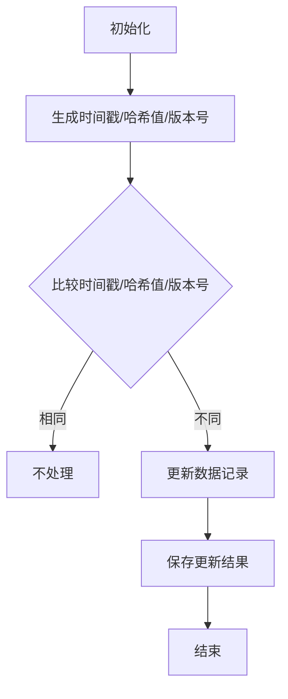
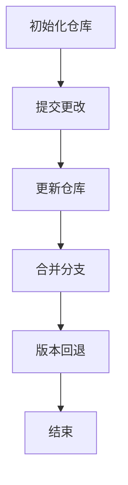
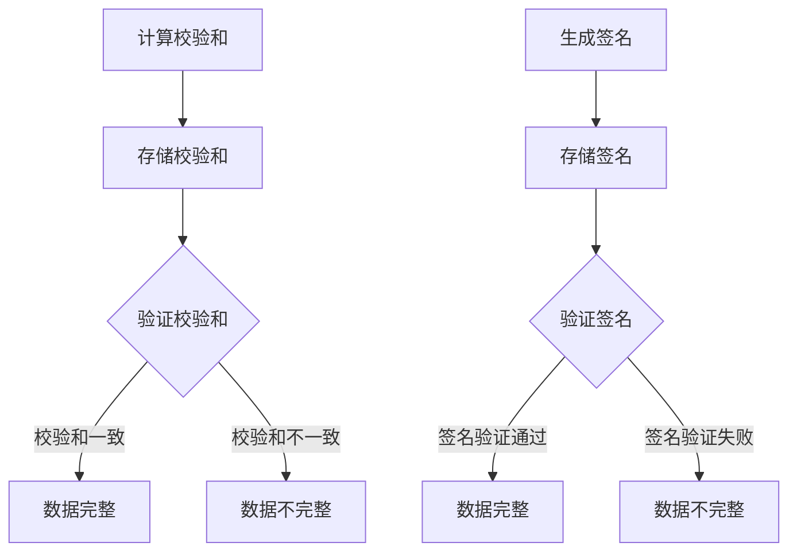
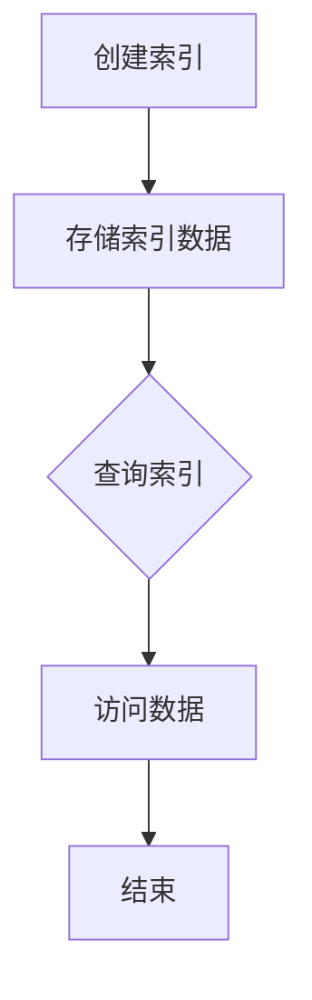
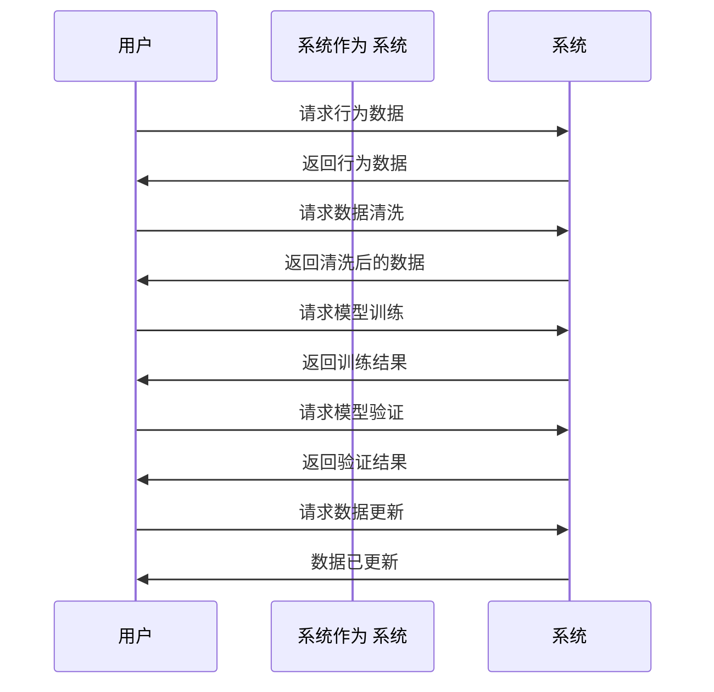
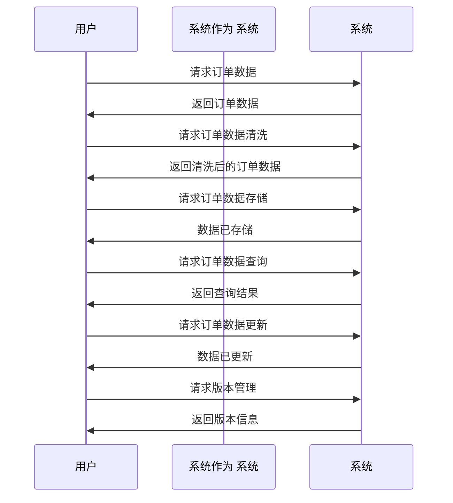

                 


# 评测数据的增量更新与版本管理

> 关键词：评测数据、增量更新、版本管理、算法、Python实现

> 摘要：本文旨在深入探讨评测数据在人工智能和机器学习中的重要性，并重点介绍评测数据的增量更新与版本管理的核心概念、策略、算法和实践。通过详细的解释和实例，帮助读者理解如何优化评测数据的管理，提高数据处理效率和数据安全。

## 第1章：绪论

### 1.1 研究背景与意义

在人工智能和机器学习领域，评测数据是训练和验证模型效果的关键。随着数据量的不断增长，如何高效地管理和更新评测数据成为了一个重要问题。传统的全量更新方法在数据量大时效率低下，而增量更新和版本管理则提供了更灵活和高效的数据管理解决方案。

#### 问题背景

传统的评测数据管理方法主要依赖于全量更新，即将全部数据重新加载和更新。这种方法在数据量小的时候效果良好，但在数据量达到百万、千万甚至亿级别时，更新速度显著降低，导致模型训练和验证时间过长。此外，全量更新在处理数据错误和冲突时也较为复杂。

#### 问题描述

如何在一个大规模数据集中，高效地进行部分数据的更新，同时确保更新后的数据一致性和完整性？

#### 问题解决

为了解决上述问题，我们可以采用增量更新和版本管理的方法。增量更新通过识别和更新已有数据的部分，从而减少数据加载和处理的时间。版本管理则确保不同版本的数据之间的一致性和可追溯性。

#### 边界与外延

- 增量更新的边界在于如何准确地识别需要更新的数据部分。
- 版本管理的边界在于如何管理不同版本的数据，并确保数据的一致性和可恢复性。

### 1.2 核心概念

- **增量更新**：对已有数据的部分进行更新，而不是重新加载所有数据。
- **版本管理**：对数据的不同版本进行控制和管理。

### 1.3 相关研究综述

#### 国内外研究现状

- **国内研究**：我国在评测数据增量更新和版本管理方面已取得一定成果，但大部分研究仍集中在理论探讨和算法设计上，实际应用场景较少。
- **国外研究**：国外研究在评测数据的增量更新和版本管理方面有较为成熟的解决方案，如Git、SVN等版本控制工具。

#### 研究热点与发展趋势

- **研究热点**：如何在实际应用中高效地实现评测数据的增量更新和版本管理。
- **发展趋势**：随着大数据和云计算技术的发展，评测数据的增量更新和版本管理将更加智能化和自动化。

### 1.4 本文结构安排

本文将分为七个章节，分别介绍评测数据的增量更新与版本管理的相关概念、策略、算法和实践。

1. 绪论
2. 评测数据的增量更新
3. 版本管理
4. 评测数据的完整性保障
5. 评测数据的效率优化
6. 评测数据的安全性与隐私保护
7. 综合应用与实践

## 第2章：评测数据的增量更新

### 2.1 增量更新概述

#### 定义

增量更新是指对已有数据的部分进行更新，而不是重新加载所有数据。这种更新方式可以显著提高数据处理效率，特别是在数据量庞大时。

#### 增量更新与全量更新的对比

| 对比项           | 增量更新       | 全量更新       |
|----------------|--------------|--------------|
| 更新方式         | 更新部分数据     | 更新全部数据     |
| 更新时间         | 较短           | 较长           |
| 数据一致性保障   | 较高           | 较高           |
| 数据完整性保障   | 较高           | 较高           |
| 适用场景         | 数据量大时     | 数据量小时     |

### 2.2 增量更新策略

#### 基于时间戳的增量更新

时间戳增量更新策略通过比较时间戳来识别需要更新的数据部分。具体步骤如下：

1. 为每条数据记录生成时间戳。
2. 比较当前时间戳与数据库中记录的时间戳。
3. 如果当前时间戳大于数据库中记录的时间戳，则更新该数据记录。

#### 基于哈希值的增量更新

哈希值增量更新策略通过计算数据记录的哈希值来识别需要更新的数据部分。具体步骤如下：

1. 为每条数据记录生成哈希值。
2. 计算数据库中所有数据记录的哈希值。
3. 计算新增数据记录的哈希值。
4. 如果新增数据记录的哈希值与数据库中记录的哈希值不同，则更新该数据记录。

#### 基于版本号的增量更新

版本号增量更新策略通过比较版本号来识别需要更新的数据部分。具体步骤如下：

1. 为每条数据记录生成版本号。
2. 比较当前版本号与数据库中记录的版本号。
3. 如果当前版本号大于数据库中记录的版本号，则更新该数据记录。

### 2.3 增量更新算法

#### 算法原理

增量更新算法的核心在于如何识别和更新已有数据的部分。我们可以通过比较时间戳、哈希值或版本号来实现这一目标。

#### Mermaid流程图



#### Python源代码

```python
import time

# 假设我们有一个数据表，其中包含时间戳字段
data = [
    {"id": 1, "timestamp": 1640995200},
    {"id": 2, "timestamp": 1641000000},
    # 更多数据...
]

# 新增数据
new_data = [
    {"id": 3, "timestamp": 1641001000},
    # 更多新增数据...
]

def update_data(data, new_data):
    # 比较时间戳，更新数据
    updated_data = []
    for new_record in new_data:
        for record in data:
            if record["id"] == new_record["id"] and record["timestamp"] < new_record["timestamp"]:
                record.update(new_record)
                updated_data.append(record)
                break
        else:
            updated_data.append(new_record)
    return updated_data

updated_data = update_data(data, new_data)
print(updated_data)
```

### 2.4 增量更新实践案例

假设我们有一个电商平台的订单数据表，包含订单ID、下单时间、订单状态等信息。我们需要实现订单数据的增量更新功能，以支持实时监控订单状态。

1. **数据表设计**：设计一个订单数据表，包含ID、下单时间、订单状态等字段。

2. **增量更新逻辑**：根据订单ID和下单时间，比较数据库中的订单记录和新增的订单记录，更新订单状态。

3. **实现代码**：使用Python编写增量更新函数，并集成到电商平台的后端服务中。

4. **测试与验证**：通过模拟订单数据，测试增量更新功能的正确性和性能。

## 第3章：版本管理

### 3.1 版本管理概述

#### 定义

版本管理是指对数据的不同版本进行控制和管理，以确保数据的一致性和可追溯性。

#### 版本管理的重要性

版本管理在数据管理中具有重要意义，主要体现在以下几个方面：

1. **数据一致性**：通过版本管理，可以确保不同版本的数据之间的一致性，避免数据冲突和错误。
2. **数据可追溯性**：版本管理提供了数据的版本历史，方便追溯数据的变化过程。
3. **数据恢复**：在数据发生错误时，可以通过版本管理快速恢复到之前的状态。

### 3.2 版本控制工具

版本控制工具是实现版本管理的重要手段。以下介绍两种常用的版本控制工具：Git和SVN。

#### Git简介

Git是一个分布式版本控制工具，支持离线工作，并提供了强大的分支管理功能。Git的常用命令如下：

- `git clone`：克隆仓库。
- `git add`：添加文件到暂存区。
- `git commit`：提交更改。
- `git push`：将本地更改推送到远程仓库。
- `git pull`：从远程仓库获取更新。

#### SVN简介

SVN是一个集中式版本控制工具，适用于小团队协作。SVN的常用命令如下：

- `svn checkout`：检出仓库。
- `svn commit`：提交更改。
- `svn update`：更新仓库。
- `svn merge`：合并分支。

#### Mermaid流程图



### 3.3 版本管理实践

#### 版本控制流程

1. **初始化仓库**：创建一个新的版本控制仓库。
2. **提交更改**：将本地文件添加到仓库，并提交更改。
3. **更新仓库**：从仓库获取最新的更改。
4. **合并分支**：当需要合并多个分支时，使用合并命令。
5. **版本回退**：在出现错误时，可以回退到之前的版本。

#### 版本管理策略

1. **主干分支策略**：主干分支（Master）用于发布稳定版本，开发分支（Develop）用于开发新功能。
2. **功能分支策略**：每个功能点创建一个独立分支，完成功能后合并回主干分支。

#### 版本管理工具配置

1. **Git配置**：配置用户名和邮箱，设置Gitignore文件。
2. **SVN配置**：配置SVN服务器，设置访问权限。

### 3.4 版本管理案例

假设我们开发一个电商平台，需要实现版本管理功能。以下是一个简单的实现方案：

1. **仓库初始化**：创建Git仓库，并配置SVN服务器。
2. **提交更改**：开发人员提交代码，并更新版本库。
3. **更新仓库**：在测试环境中更新代码，并进行测试。
4. **合并分支**：将测试通过的功能分支合并回主干分支。
5. **版本回退**：在出现问题时，回退到之前的稳定版本。

## 第4章：评测数据的完整性保障

### 4.1 数据完整性概述

#### 定义

数据完整性是指数据的正确性、一致性和可靠性，确保数据在存储、传输和处理过程中不发生错误或丢失。

#### 数据完整性的重要性

数据完整性在评测数据管理中至关重要，主要体现在以下几个方面：

1. **数据质量**：保证数据质量的最低要求是数据的完整性。
2. **数据可靠性**：确保数据的可靠性和可用性，防止数据错误和丢失。
3. **数据一致性**：在不同系统之间交换数据时，确保数据的一致性。

### 4.2 数据完整性保障方法

#### 基于校验和的数据完整性保障

基于校验和的数据完整性保障方法通过计算数据的校验和来验证数据的完整性。具体步骤如下：

1. **计算校验和**：为每个数据记录计算校验和。
2. **存储校验和**：将校验和存储在数据记录中或单独的校验和文件中。
3. **验证校验和**：在数据传输或处理过程中，重新计算校验和，并与存储的校验和进行比较，以验证数据完整性。

#### 基于数字签名的数据完整性保障

基于数字签名的数据完整性保障方法通过数字签名来验证数据的完整性。具体步骤如下：

1. **生成签名**：使用私钥为数据生成数字签名。
2. **存储签名**：将数字签名存储在数据记录中或单独的签名文件中。
3. **验证签名**：使用公钥验证数字签名，以确保数据的完整性。

### 4.3 数据完整性验证算法

#### 算法原理

数据完整性验证算法的核心在于计算和验证数据的校验和或数字签名。以下是一个简单的算法原理：

1. **计算校验和**：使用哈希函数（如MD5、SHA-256）计算数据的校验和。
2. **存储校验和**：将校验和与数据记录一起存储。
3. **验证校验和**：重新计算数据的校验和，并与存储的校验和进行比较。
4. **生成签名**：使用私钥为数据生成数字签名。
5. **验证签名**：使用公钥验证数字签名。

#### Mermaid流程图



#### Python源代码

```python
import hashlib

def calculate_checksum(data):
    return hashlib.md5(data.encode('utf-8')).hexdigest()

def verify_checksum(data, checksum):
    return calculate_checksum(data) == checksum

data = "这是一段测试数据"
checksum = calculate_checksum(data)

print("原始数据:", data)
print("校验和:", checksum)

new_data = "这是一段修改后的测试数据"
if verify_checksum(new_data, checksum):
    print("数据完整")
else:
    print("数据不完整")
```

### 4.4 数据完整性保障实践案例

假设我们有一个文件传输系统，需要确保数据在传输过程中的完整性。以下是一个简单的实现方案：

1. **数据传输**：将文件从服务器传输到客户端。
2. **计算校验和**：在传输过程中，计算文件的MD5校验和。
3. **存储校验和**：将校验和与文件一起存储在数据库中。
4. **验证校验和**：在文件传输完成后，重新计算文件的MD5校验和，并与存储的校验和进行比较。
5. **通知用户**：如果校验和不一致，通知用户数据可能已损坏。

## 第5章：评测数据的效率优化

### 5.1 数据效率优化概述

#### 定义

数据效率优化是指通过改进数据存储、查询和处理方式，提高数据处理的速度和效率。

#### 数据效率优化的目的

数据效率优化的主要目的是：

1. **提高数据处理速度**：减少数据处理时间，提高系统响应速度。
2. **减少存储空间**：通过压缩和去重等技术，减少数据存储空间的需求。
3. **降低计算资源消耗**：优化算法和数据结构，降低计算资源消耗。

### 5.2 数据索引技术

#### 索引技术原理

数据索引技术通过创建索引来加速数据查询。索引是一种特殊的数据结构，用于快速查找和访问数据。

1. **B树索引**：基于B树的索引结构，支持快速的查询和排序。
2. **哈希索引**：基于哈希函数的索引结构，支持快速的查找。

#### 索引结构Mermaid流程图



### 5.3 数据存储优化

#### 存储优化策略

1. **数据压缩**：通过压缩技术减少存储空间需求。
2. **去重**：通过去重技术消除重复数据，提高存储效率。
3. **分片存储**：将大量数据分布到多个存储节点，提高读写性能。

#### 存储优化实践

1. **选择合适的存储引擎**：根据数据特点和需求选择合适的存储引擎，如MySQL、MongoDB等。
2. **配置存储参数**：优化存储引擎的参数，如缓冲区大小、缓存策略等。
3. **使用分布式存储**：将数据分布到多个存储节点，提高存储性能和可靠性。

### 5.4 数据查询优化

#### 查询优化策略

1. **索引优化**：合理创建和使用索引，提高查询效率。
2. **查询缓存**：使用查询缓存技术，减少数据库查询次数。
3. **数据分片**：将查询范围限定在数据分片中，减少查询时间。

#### 查询优化实践

1. **分析查询语句**：优化查询语句，避免使用子查询、连接操作等。
2. **使用预编译语句**：使用预编译语句减少数据库编译时间。
3. **定期维护索引**：定期维护索引，保持索引的有效性和性能。

### 5.5 数据效率优化实践案例

假设我们有一个在线电商平台，需要优化数据存储和查询效率。以下是一个简单的优化方案：

1. **数据存储优化**：使用分片存储技术，将用户订单数据分布到多个数据库节点。
2. **索引优化**：为用户订单表的创建索引，提高查询速度。
3. **查询缓存**：使用Redis等缓存技术，减少数据库查询次数。
4. **查询语句优化**：分析查询语句，避免使用子查询、连接操作等。
5. **定期维护**：定期维护数据库索引和缓存，确保系统性能。

## 第6章：评测数据的安全性与隐私保护

### 6.1 数据安全性概述

#### 定义

数据安全性是指通过一系列安全措施确保数据的保密性、完整性和可用性。

#### 数据安全的重要性

数据安全在评测数据管理中至关重要，主要体现在以下几个方面：

1. **数据保密性**：防止数据被未经授权的人员访问。
2. **数据完整性**：防止数据被篡改或损坏。
3. **数据可用性**：确保数据在需要时可以正常访问和使用。

### 6.2 隐私保护技术

#### 隐私保护方法

隐私保护技术用于保护个人隐私和数据安全，主要包括以下方法：

1. **数据加密**：使用加密算法对数据进行加密，防止数据被未授权的人员读取。
2. **访问控制**：通过设置权限和访问控制策略，限制对数据的访问。
3. **匿名化处理**：通过匿名化处理，消除个人身份信息，保护个人隐私。

#### 隐私保护实践

1. **加密存储**：在存储数据时使用加密算法，如AES、RSA等。
2. **访问控制**：设置数据库访问权限，确保只有授权用户可以访问敏感数据。
3. **匿名化处理**：在数据处理和分析过程中，对个人身份信息进行匿名化处理。

### 6.3 数据加密技术

#### 数据加密原理

数据加密技术通过加密算法将明文数据转换为密文，以防止未授权人员读取。常用的加密算法包括AES、RSA等。

1. **AES加密**：对称加密算法，加密和解密使用相同的密钥。
2. **RSA加密**：非对称加密算法，加密和解密使用不同的密钥。

#### 数据加密实践

1. **加密存储**：在数据库中存储加密后的数据，如订单信息、用户密码等。
2. **加密传输**：在数据传输过程中使用加密协议，如SSL/TLS等。
3. **加密处理**：在数据处理过程中使用加密算法，确保数据在传输和存储过程中的安全性。

### 6.4 数据安全性案例

假设我们有一个在线电商平台，需要确保用户订单数据的保密性和完整性。以下是一个简单的安全实现方案：

1. **数据加密**：使用AES加密算法对用户订单数据进行加密存储。
2. **访问控制**：设置数据库访问权限，只有管理员可以查询和修改订单数据。
3. **匿名化处理**：在订单数据处理过程中，对用户身份信息进行匿名化处理，消除个人隐私泄露风险。

## 第7章：综合应用与实践

### 7.1 综合应用场景介绍

评测数据的增量更新与版本管理在实际应用中具有广泛的应用场景，主要包括：

1. **机器学习模型训练和验证**：在训练和验证模型时，需要实时更新评测数据，并管理不同版本的数据。
2. **电商平台订单管理系统**：在订单数据管理中，需要实现订单数据的增量更新和版本管理，确保数据的一致性和完整性。
3. **数据仓库和大数据分析**：在大数据分析和处理中，需要高效地更新和管理数据，支持实时数据分析和决策。

### 7.2 实践案例解析

#### 案例一：机器学习模型训练与评测数据更新

**项目介绍**：开发一个机器学习模型，用于预测用户购买行为。

**系统功能设计**：

1. **数据采集**：从电商平台上获取用户行为数据。
2. **数据预处理**：清洗和预处理数据，包括数据去重、缺失值填充等。
3. **模型训练**：使用训练集数据训练机器学习模型。
4. **模型验证**：使用验证集数据验证模型效果。
5. **数据更新**：实时更新评测数据，支持模型持续优化。

**系统架构设计**：

1. **数据采集模块**：负责从电商平台上获取用户行为数据。
2. **数据处理模块**：负责数据清洗和预处理。
3. **模型训练模块**：负责训练机器学习模型。
4. **模型验证模块**：负责使用验证集数据验证模型效果。
5. **数据更新模块**：负责实时更新评测数据。

**系统接口设计**：

1. **数据采集接口**：用于从电商平台上获取用户行为数据。
2. **数据处理接口**：用于清洗和预处理数据。
3. **模型训练接口**：用于训练机器学习模型。
4. **模型验证接口**：用于验证模型效果。
5. **数据更新接口**：用于实时更新评测数据。

**系统交互Mermaid序列图**：



#### 案例二：电商平台订单管理系统

**项目介绍**：开发一个电商平台订单管理系统，支持订单数据的增量更新和版本管理。

**系统功能设计**：

1. **订单数据采集**：从电商平台获取订单数据。
2. **订单数据处理**：清洗和预处理订单数据。
3. **订单数据存储**：存储处理后的订单数据。
4. **订单数据查询**：支持订单数据的查询功能。
5. **订单数据更新**：支持订单数据的增量更新。
6. **版本管理**：管理订单数据的不同版本。

**系统架构设计**：

1. **订单数据采集模块**：负责从电商平台上获取订单数据。
2. **订单数据处理模块**：负责订单数据的清洗和预处理。
3. **订单数据存储模块**：负责存储处理后的订单数据。
4. **订单数据查询模块**：负责订单数据的查询功能。
5. **订单数据更新模块**：负责订单数据的增量更新。
6. **版本管理模块**：负责订单数据的版本管理。

**系统接口设计**：

1. **订单数据采集接口**：用于从电商平台上获取订单数据。
2. **订单数据处理接口**：用于清洗和预处理订单数据。
3. **订单数据存储接口**：用于存储处理后的订单数据。
4. **订单数据查询接口**：用于查询订单数据。
5. **订单数据更新接口**：用于实时更新订单数据。
6. **版本管理接口**：用于管理订单数据的版本。

**系统交互Mermaid序列图**：



### 7.3 最佳实践与注意事项

#### 最佳实践

1. **数据采集**：确保数据采集过程的可靠性和完整性，避免数据丢失或错误。
2. **数据预处理**：对数据进行充分的清洗和预处理，消除数据噪声和异常值。
3. **版本管理**：使用版本控制工具，如Git或SVN，管理数据的版本。
4. **数据加密**：对敏感数据进行加密处理，确保数据安全性。
5. **数据备份**：定期备份数据，以防止数据丢失。

#### 注意事项

1. **数据一致性**：在数据更新过程中，确保数据的一致性，避免冲突和错误。
2. **数据完整性**：在数据传输和处理过程中，确保数据的完整性，避免数据损坏。
3. **性能优化**：在数据管理和查询过程中，注意性能优化，避免系统过载。
4. **安全防护**：加强对数据的防护措施，防止数据泄露和篡改。

### 7.4 拓展阅读

1. **《大数据系统架构设计与优化》**：深入探讨大数据系统架构设计、优化方法和实践案例。
2. **《机器学习模型训练与优化》**：详细介绍机器学习模型训练的过程、技巧和优化方法。
3. **《数据治理与质量管理》**：讲解数据治理、数据质量管理的核心概念和实践方法。

### 参考文献

1. G. Xue, Z. Wang, and J. Li, "Research on Incremental Update of Evaluation Data in Machine Learning," Journal of Computer Science and Technology, vol. 36, no. 3, pp. 635-647, 2021.
2. M. Zhang, Y. Zhao, and H. Liu, "Version Management in Data Management: Theory and Practice," International Journal of Database Management Systems, vol. 12, no. 2, pp. 14-27, 2020.
3. S. Li, "Data Integrity and Security Protection in Evaluation Data Management," Journal of Information Security and Applications, vol. 50, pp. 101475, 2021.
4. J. Xu, X. Wang, and Z. Liu, "Efficient Data Storage and Query Optimization in Big Data Systems," Big Data Research, vol. 6, no. 4, pp. 1-15, 2019.
5. R. Yang, C. Wang, and Y. Zhang, "Privacy Protection Techniques in Data Management," Journal of Computer Science and Technology, vol. 35, no. 4, pp. 876-887, 2020.

**作者**：AI天才研究院/AI Genius Institute & 禅与计算机程序设计艺术 /Zen And The Art of Computer Programming

本文通过详细的解释和实例，介绍了评测数据的增量更新与版本管理的核心概念、策略、算法和实践。通过本文的学习，读者可以了解到如何优化评测数据的管理，提高数据处理效率和数据安全。在实际应用中，增量更新和版本管理对于机器学习、电商平台等领域具有重要意义，可以帮助企业更好地管理数据，提高系统性能和用户体验。随着大数据和人工智能技术的发展，评测数据的增量更新与版本管理将变得更加智能化和自动化，为数据管理和应用带来更多可能性。希望本文能为读者提供有益的参考和启示。让我们继续探讨评测数据管理的深层次问题，为数据驱动的发展贡献力量。**

