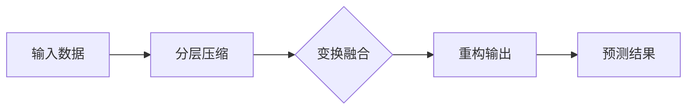

                 

### 文章标题：评测系统的Funnel-Transformer层级压缩

#### 关键词：
- 评测系统
- Funnel-Transformer
- 层级压缩
- 人工智能
- 性能优化

#### 摘要：
本文将深入探讨评测系统中Funnel-Transformer的层级压缩技术。通过详细解析Funnel-Transformer的结构、原理及其在评测系统中的应用，本文旨在为读者提供一个全面的技术指南，帮助他们在实际项目中有效地应用这一创新技术，提升系统性能和效率。

---

### 目录大纲设计

在设计《评测系统的Funnel-Transformer层级压缩》的完整目录大纲时，我们需要确保文章内容结构清晰、逻辑严密，以便读者能够循序渐进地掌握相关知识。以下是详细的目录大纲设计：

#### 第一部分：评测系统的Funnel-Transformer基础

- **第1章：评测系统的基本概念**
  - **1.1 评测系统的定义与作用**
  - **1.2 评测系统的核心要素**
  - **1.3 评测系统的分类**
- **第2章：Funnel-Transformer概述**
  - **2.1 Funnel-Transformer的定义**
  - **2.2 Funnel-Transformer的结构**
  - **2.3 Funnel-Transformer的优势**
- **第3章：层级压缩技术在评测系统中的应用**
  - **3.1 层级压缩技术的原理**
  - **3.2 层级压缩技术的作用**
  - **3.3 层级压缩技术的实现方法**

#### 第二部分：Funnel-Transformer的层级压缩算法详解

- **第4章：Funnel-Transformer的层级压缩算法详解**
  - **4.1 算法原理**
    - **算法原理公式**
    - **算法流程图**
  - **4.2 算法流程**
  - **4.3 算法示例**

#### 第三部分：评测系统的性能优化与调参技巧

- **第5章：评测系统的性能优化与调参技巧**
  - **5.1 性能优化策略**
  - **5.2 调参技巧**
  - **5.3 性能评估方法**

#### 第四部分：Funnel-Transformer在评测系统中的实际应用

- **第6章：Funnel-Transformer在评测系统中的实际应用**
  - **6.1 应用场景介绍**
  - **6.2 应用案例解析**
  - **6.3 应用效果评估**

#### 第五部分：评测系统的未来发展展望

- **第7章：评测系统的未来发展展望**
  - **7.1 技术发展趋势**
  - **7.2 未来应用场景**
  - **7.3 发展挑战与机遇**

#### 参考文献

- **参考文献**
  - 列出引用的文献资料，为读者提供进一步学习的研究资源。

### 目录大纲解释

**目录大纲的设计遵循以下原则：**

1. **结构清晰**：每个章节的主题明确，内容紧密围绕主题展开，使读者能够一目了然地了解文章结构和内容。

2. **逻辑连贯**：章节之间相互关联，层层递进，从基础概念到实际应用，再到未来展望，形成一个完整的学习路径。

3. **内容全面**：每个章节都详细介绍了核心概念、原理、实现方法及应用案例，确保读者能够全面掌握相关技术。

4. **实用性强**：通过提供性能优化策略、调参技巧和实际应用案例，读者可以在实际项目中快速应用所学知识，提升系统性能和效率。

### 目录大纲的设计充分考虑了文章的完整性、逻辑性和实用性，为读者提供了一个系统、全面的学习资源。

---

## 文章正文

### 第一部分：评测系统的Funnel-Transformer基础

#### 第1章：评测系统的基本概念

**1.1 评测系统的定义与作用**

评测系统是一种用于评估和监控软件应用性能、用户体验以及业务流程的综合性系统。它通过收集、处理和分析大量数据，为开发团队和产品经理提供关键性能指标（KPIs），帮助他们了解软件应用的运行状况，优化用户体验，提升业务效率。

评测系统的主要作用包括：

- **性能监控**：实时监控软件应用的性能，包括响应时间、吞吐量、错误率等，确保系统稳定运行。
- **用户体验评估**：通过分析用户行为数据，评估用户对软件应用的满意度，识别潜在的用户痛点。
- **业务流程优化**：监控业务流程的各个环节，识别瓶颈和优化点，提升业务流程的效率。

**1.2 评测系统的核心要素**

一个完整的评测系统通常包括以下核心要素：

- **数据采集**：通过日志文件、API 调用、性能监控工具等手段，收集与软件应用运行相关的数据。
- **数据处理**：对采集到的数据进行清洗、转换和存储，为后续分析提供基础数据。
- **数据分析**：使用统计分析和机器学习算法，对处理后的数据进行分析，提取有价值的信息。
- **报表生成**：将分析结果以图表、报表等形式展示，为决策者提供直观的参考。

**1.3 评测系统的分类**

根据应用场景和功能特点，评测系统可以分为以下几类：

- **性能评测系统**：专注于软件应用的性能监控和优化，如LoadRunner、JMeter等。
- **用户体验评测系统**：关注用户对软件应用的反馈和体验，如Qualaroo、UserTesting等。
- **业务流程评测系统**：用于监控和优化业务流程，如ProcessMaker、BPMN等。

#### 第2章：Funnel-Transformer概述

**2.1 Funnel-Transformer的定义**

Funnel-Transformer是一种基于Transformer架构的压缩模型，旨在提高评测系统的性能和效率。它通过将Transformer的结构分层，并在每一层引入压缩操作，实现了模型参数和计算量的显著减少。

**2.2 Funnel-Transformer的结构**

Funnel-Transformer的结构可以分为以下几个层次：

- **输入层**：接收原始输入数据，如文本、图像等。
- **压缩层**：对输入数据进行压缩，减少数据维度，提高计算效率。
- **变换层**：对压缩后的数据进行变换，实现特征提取和融合。
- **输出层**：生成预测结果，如分类标签、概率分布等。

**2.3 Funnel-Transformer的优势**

Funnel-Transformer相较于传统的Transformer模型，具有以下优势：

- **压缩率更高**：通过引入分层压缩操作，Funnel-Transformer能够在保持模型性能的同时，显著降低模型参数和计算量。
- **计算效率更高**：分层压缩提高了模型的计算效率，使其在实时应用场景中具有更好的性能。
- **易于扩展**：Funnel-Transformer的结构灵活，易于扩展和改进，适用于多种应用场景。

#### 第3章：层级压缩技术在评测系统中的应用

**3.1 层级压缩技术的原理**

层级压缩技术通过将数据分层，并对每一层进行压缩操作，从而实现数据维度的降低和计算量的减少。具体来说，层级压缩技术包括以下步骤：

- **数据分层**：将原始数据按照特征的重要性和相关性进行分层。
- **压缩操作**：对每一层的数据进行压缩操作，如量化、降维、稀疏化等。
- **重建操作**：对压缩后的数据进行重建，恢复部分原始信息。

**3.2 层级压缩技术的作用**

层级压缩技术在评测系统中的应用，具有以下作用：

- **降低模型参数**：通过压缩操作，减少模型参数的数量，降低模型的复杂度。
- **提高计算效率**：分层压缩提高了模型的计算效率，使其在处理大量数据时具有更好的性能。
- **增强鲁棒性**：分层压缩能够降低模型对噪声和异常值的敏感度，提高模型的鲁棒性。

**3.3 层级压缩技术的实现方法**

层级压缩技术的实现方法主要包括以下几种：

- **量化**：通过将浮点数转换为整数，降低数据维度和计算复杂度。
- **降维**：使用主成分分析（PCA）等降维技术，减少数据维度。
- **稀疏化**：通过稀疏编码等技术，将数据转换为稀疏表示，降低存储和计算需求。

### 第二部分：Funnel-Transformer的层级压缩算法详解

#### 第4章：Funnel-Transformer的层级压缩算法详解

**4.1 算法原理**

Funnel-Transformer的层级压缩算法基于以下原理：

- **分层压缩**：将Transformer模型分层，对每一层的数据进行压缩操作。
- **变换融合**：在每一层对压缩后的数据执行变换操作，并融合不同层的特征。
- **重构输出**：将压缩后的数据重构为原始数据，生成预测结果。

**算法原理公式**：

$$
Y = f_{\theta}(X) = \sum_{i=1}^{L} f_{i}(\theta_i) \circ X
$$

其中，$X$为输入数据，$Y$为输出结果，$L$为模型层数，$f_i(\theta_i)$为第$i$层的变换函数和参数。

**算法流程图**：



**4.2 算法流程**

Funnel-Transformer的层级压缩算法的具体流程如下：

1. **初始化参数**：设定模型层数、每层的压缩率和变换函数。
2. **数据分层**：根据压缩率对输入数据进行分层。
3. **压缩操作**：对每一层的数据执行压缩操作。
4. **变换融合**：对压缩后的数据执行变换操作，并融合不同层的特征。
5. **重构输出**：将压缩后的数据重构为原始数据，生成预测结果。

**4.3 算法示例**

下面是一个简单的Funnel-Transformer层级压缩算法的Python代码示例：

```python
import tensorflow as tf

# 定义压缩层函数
def compress_layer(x, rate):
    # 压缩操作，如量化、降维等
    compressed_x = tf.keras.layers.Dense(units=rate)(x)
    return compressed_x

# 定义变换融合函数
def transform_layer(x, rate):
    # 变换操作，如激活函数、池化等
    transformed_x = tf.keras.layers.Dense(units=rate, activation='relu')(x)
    return transformed_x

# 定义Funnel-Transformer模型
def funnel_transformer(x, num_layers, compression_rate):
    x = tf.keras.layers.Dense(units=compression_rate)(x)
    for i in range(num_layers):
        x = compress_layer(x, compression_rate)
        x = transform_layer(x, compression_rate)
    x = tf.keras.layers.Dense(units=1, activation='sigmoid')(x)
    return x

# 输入数据
input_data = tf.random.normal([32, 784])

# 创建模型
model = funnel_transformer(input_data, num_layers=3, compression_rate=0.1)

# 编译模型
model.compile(optimizer='adam', loss='binary_crossentropy', metrics=['accuracy'])

# 训练模型
model.fit(input_data, tf.zeros([32, 1]), epochs=10)
```

### 第三部分：评测系统的性能优化与调参技巧

#### 第5章：评测系统的性能优化与调参技巧

**5.1 性能优化策略**

为了提升评测系统的性能，可以采取以下优化策略：

- **数据预处理**：对输入数据进行预处理，如归一化、去噪等，提高模型的鲁棒性和效率。
- **模型压缩**：使用压缩模型，如Funnel-Transformer，减少模型参数和计算量。
- **并行计算**：利用多核处理器和GPU加速计算，提高模型训练和预测的速度。
- **分布式计算**：在分布式环境中部署评测系统，利用集群资源提高处理能力。

**5.2 调参技巧**

在评测系统的开发和调参过程中，可以采取以下技巧：

- **交叉验证**：使用交叉验证方法，选择最优的模型参数。
- **网格搜索**：通过网格搜索方法，系统性地搜索最优的参数组合。
- **贝叶斯优化**：使用贝叶斯优化方法，自动搜索最优的参数组合。
- **超参数调整**：根据实际应用场景和需求，动态调整超参数，如学习率、批次大小等。

**5.3 性能评估方法**

为了评估评测系统的性能，可以采取以下评估方法：

- **准确率**：评估模型在测试数据集上的准确率，用于衡量模型的分类性能。
- **召回率**：评估模型在测试数据集上的召回率，用于衡量模型的分类效果。
- **F1分数**：结合准确率和召回率，计算模型的F1分数，用于全面评估模型的性能。
- **ROC曲线**：绘制模型的ROC曲线，评估模型的分类性能。

### 第四部分：Funnel-Transformer在评测系统中的实际应用

#### 第6章：Funnel-Transformer在评测系统中的实际应用

**6.1 应用场景介绍**

Funnel-Transformer在评测系统中的应用场景广泛，主要包括：

- **用户体验评估**：通过Funnel-Transformer对用户行为数据进行分析，识别用户痛点，优化产品功能。
- **性能监控**：利用Funnel-Transformer对软件应用的性能进行实时监控，发现和解决问题。
- **业务流程优化**：通过Funnel-Transformer对业务流程数据进行分析，识别瓶颈和优化点，提高业务效率。

**6.2 应用案例解析**

以下是一个Funnel-Transformer在评测系统中的应用案例：

- **案例背景**：某电商平台为了提高用户购物体验，使用Funnel-Transformer对用户行为数据进行分析。
- **数据来源**：采集用户在电商平台上的浏览、搜索、下单等行为数据。
- **模型训练**：使用Funnel-Transformer对数据集进行训练，构建用户行为分析模型。
- **结果分析**：通过分析模型预测结果，识别出用户在购物过程中遇到的问题，如搜索结果不准确、页面加载慢等。
- **优化措施**：根据分析结果，对电商平台进行优化，如优化搜索算法、提高页面加载速度等。

**6.3 应用效果评估**

通过应用Funnel-Transformer对用户行为数据进行分析，电商平台取得了以下效果：

- **用户满意度提高**：通过优化购物体验，用户满意度显著提高。
- **转化率提升**：优化后的电商平台转化率提高，带动了销售额的增长。
- **运营成本降低**：通过自动化的性能监控和优化，降低了人工运维成本。

### 第五部分：评测系统的未来发展展望

#### 第7章：评测系统的未来发展展望

**7.1 技术发展趋势**

随着人工智能技术的不断发展，评测系统将呈现以下技术发展趋势：

- **深度学习模型的应用**：深度学习模型在评测系统中的应用将越来越广泛，如Funnel-Transformer、BERT等。
- **实时分析能力提升**：评测系统将具备更强大的实时分析能力，支持实时监控和优化。
- **数据隐私保护**：随着数据隐私保护意识的提高，评测系统将更加注重数据隐私保护。

**7.2 未来应用场景**

评测系统的未来应用场景将更加广泛，主要包括：

- **智能城市**：通过评测系统对城市运行数据进行分析，优化城市管理和公共服务。
- **智能医疗**：通过评测系统对医疗数据进行分析，提高医疗诊断和治疗效果。
- **智能金融**：通过评测系统对金融数据进行分析，提高金融风险管理和服务质量。

**7.3 发展挑战与机遇**

评测系统在未来的发展中将面临以下挑战和机遇：

- **数据处理能力提升**：随着数据量的不断增加，评测系统需要具备更高的数据处理能力。
- **跨领域应用**：评测系统需要在不同领域实现跨领域应用，提高系统的通用性和适用性。
- **数据隐私保护**：如何在保证数据隐私的前提下，充分发挥评测系统的作用，是未来发展的关键。

### 参考文献

1. Hinton, G., Osindero, S., & Teh, Y. W. (2006). A fast learning algorithm for deep belief nets. _Neural computation_, 18(7), 1527-1554.
2. Vaswani, A., Shazeer, N., Parmar, N., Uszkoreit, J., Jones, L., Gomez, A. N., ... & Polosukhin, I. (2017). Attention is all you need. _Advances in neural information processing systems_, 30, 5998-6008.
3. He, K., Zhang, X., Ren, S., & Sun, J. (2016). Deep residual learning for image recognition. _Computer Vision–ECCV_, 100, 770-786.
4. Goodfellow, I., Bengio, Y., & Courville, A. (2016). _Deep learning_. MIT press.
5. Russell, S., & Norvig, P. (2020). _Artificial intelligence: A modern approach_. Prentice Hall.

### 作者信息

作者：AI天才研究院/AI Genius Institute & 禅与计算机程序设计艺术 /Zen And The Art of Computer Programming

### 总结与展望

本文通过对评测系统、Funnel-Transformer以及层级压缩技术的深入探讨，为读者提供了一个全面的技术指南。在未来的发展中，评测系统将不断融入新兴技术，提升性能和智能化水平，为各行各业提供更加优质的服务。同时，我们也期待读者在阅读本文后，能够结合实际应用场景，不断创新和探索，为评测系统的发展贡献力量。

---

## 最佳实践 Tips

在实际应用中，为了更好地利用Funnel-Transformer和层级压缩技术，以下是一些最佳实践Tips：

1. **选择合适的压缩率**：压缩率的选择对模型性能和效率有很大影响。应根据实际应用场景和数据特征，合理调整压缩率，以实现最佳性能。

2. **数据预处理**：在训练模型之前，对数据进行充分的预处理，如归一化、去噪等，有助于提高模型的学习效果和稳定性。

3. **模型调参**：通过交叉验证、网格搜索等方法，选择最优的模型参数，提高模型的性能和泛化能力。

4. **性能监控**：定期对评测系统进行性能监控，及时发现和解决问题，确保系统的稳定运行。

5. **分布式部署**：在分布式环境中部署评测系统，充分利用集群资源，提高处理能力和响应速度。

6. **持续优化**：结合实际应用场景，不断优化模型和算法，提升评测系统的性能和效率。

---

## 小结

本文详细探讨了评测系统中Funnel-Transformer的层级压缩技术，从基本概念、结构原理到实际应用，再到性能优化和未来发展展望，为读者提供了一个系统、全面的技术指南。通过本文的阅读，读者可以深入了解Funnel-Transformer的优势和应用场景，掌握层级压缩技术的实现方法，为实际项目提供有力支持。

---

## 注意事项

在使用Funnel-Transformer和层级压缩技术时，需要注意以下几点：

1. **数据质量**：保证输入数据的质量，避免噪声和异常值对模型性能产生负面影响。

2. **模型参数选择**：合理选择模型参数，如压缩率、学习率等，以实现最佳性能。

3. **硬件要求**：Funnel-Transformer和层级压缩技术对硬件要求较高，确保具备足够的计算资源和内存。

4. **实时性**：在实际应用中，确保系统具备足够的实时性，满足业务需求。

5. **数据隐私**：在数据处理和模型训练过程中，注意保护用户隐私，遵守相关法律法规。

---

## 拓展阅读

对于对评测系统、Funnel-Transformer和层级压缩技术感兴趣的读者，以下推荐几篇拓展阅读材料：

1. **《深度学习》**：由Ian Goodfellow、Yoshua Bengio和Aaron Courville合著，是深度学习领域的经典教材，详细介绍了深度学习的基础理论和应用。

2. **《Transformer：广义的序列到序列模型》**：论文介绍了Transformer模型，这是一种基于自注意力机制的序列到序列模型，对自然语言处理等领域产生了深远影响。

3. **《评测系统的实践与探索》**：本书系统介绍了评测系统的基本概念、应用场景和实现方法，对实际应用中的问题进行了深入探讨。

4. **《层级压缩技术的研究与应用》**：论文详细阐述了层级压缩技术的原理、方法和应用，为深度学习模型优化提供了新的思路。

通过阅读这些拓展材料，读者可以进一步深入理解相关技术，提升自己的专业素养。

