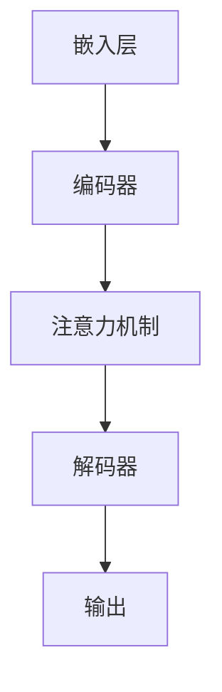
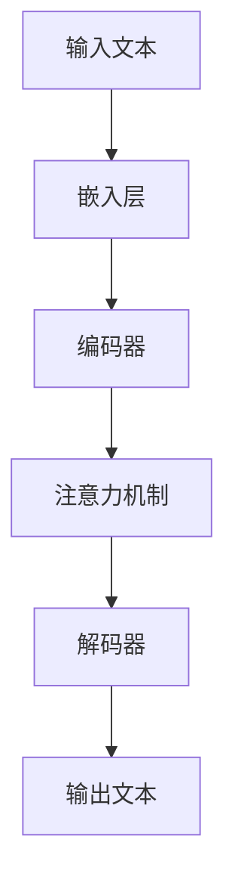
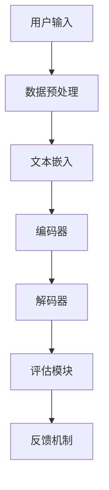
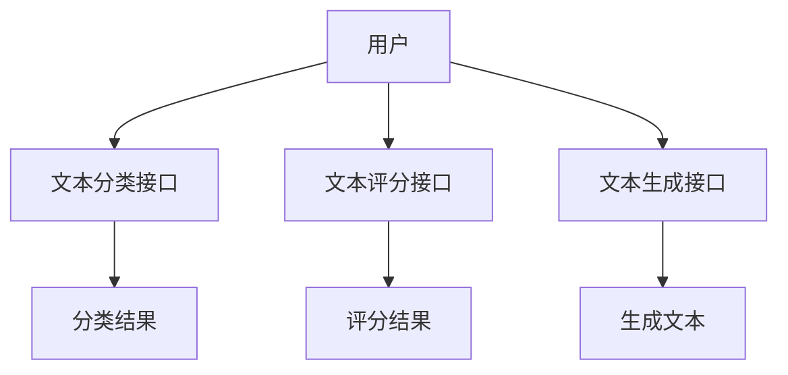

                 


# 《评测系统的GLM通用语言模型应用》

> 关键词：GLM通用语言模型，评测系统，算法原理，系统设计，项目实战

> 摘要：本文将详细介绍GLM通用语言模型在评测系统中的应用。我们将从背景介绍、核心概念与联系、算法原理讲解、系统分析与架构设计方案、项目实战以及最佳实践 tips、小结、注意事项和拓展阅读等方面展开讨论。

## 第一部分：背景介绍

### 1.1. GLM通用语言模型应用背景

随着人工智能技术的快速发展，自然语言处理（NLP）领域取得了显著的进步。GLM（General Language Model）作为一种先进的语言模型，已经被广泛应用于各种任务，如文本分类、命名实体识别、机器翻译等。然而，在评测系统中，GLM的应用仍然具有一定的挑战性。

评测系统通常用于对用户提交的文本进行评估，以确定其质量、相关性或准确性。传统的评测系统主要依赖于规则和特征工程，但这些方法往往难以适应复杂的文本结构和语义关系。相比之下，GLM通用语言模型能够自动学习文本的内在结构和语义信息，从而提高评测系统的准确性和可靠性。

### 1.2. 问题描述与解决

传统评测系统面临以下挑战：

1. **语义理解不足**：传统评测系统难以理解文本的语义和上下文，导致评估结果不准确。
2. **规则依赖性**：传统评测系统依赖于复杂的规则和特征工程，难以适应不同领域的需求。
3. **实时性要求**：现代评测系统通常需要在短时间内处理大量文本，传统方法难以满足这一要求。

GLM通用语言模型的应用可以解决上述问题：

1. **语义理解增强**：GLM能够自动学习文本的语义和上下文信息，从而更准确地评估文本质量。
2. **规则简化**：GLM可以取代部分规则和特征工程，降低系统复杂度。
3. **高效处理**：GLM具有强大的并行处理能力，能够满足实时性要求。

### 1.3. 边界与外延

GLM通用语言模型在评测系统中的应用具有一定的边界和限制：

1. **数据需求**：GLM需要大量的高质量训练数据才能达到最佳效果，数据质量和数量对模型的性能有重要影响。
2. **计算资源**：GLM的训练和推理过程需要大量的计算资源，特别是在处理大规模文本数据时。
3. **适应范围**：尽管GLM具有强大的语义理解能力，但仍然可能存在某些特殊场景或领域的适用性问题。

### 1.4. 概念结构与核心要素组成

GLM通用语言模型由以下核心要素组成：

1. **嵌入层**：将文本转化为固定长度的向量表示。
2. **编码器**：对输入文本进行编码，提取语义信息。
3. **解码器**：根据编码器提取的语义信息生成输出文本。
4. **注意力机制**：用于捕捉文本之间的长距离依赖关系。

在评测系统中，GLM的主要功能是：

1. **文本分类**：根据文本内容判断其类别。
2. **文本评分**：对文本的质量、相关性或准确性进行评分。
3. **文本生成**：根据特定主题或模板生成文本。

## 第二部分：核心概念与联系

### 2.1. GLM通用语言模型核心概念

GLM（General Language Model）是一种基于 Transformer 架构的通用语言模型。它由嵌入层、编码器、解码器和注意力机制组成。以下是对各部分的概念解释：

1. **嵌入层**：将文本中的单词、句子或段落转换为固定长度的向量表示。这些向量表示了文本的语法和语义信息。
2. **编码器**：对输入文本进行编码，提取文本的语义信息。编码器通常由多个 Transformer 块组成，每个块包含自注意力机制和前馈网络。
3. **解码器**：根据编码器提取的语义信息生成输出文本。解码器同样由多个 Transformer 块组成，每个块也包含自注意力机制和前馈网络。
4. **注意力机制**：用于捕捉文本之间的长距离依赖关系。注意力机制使得模型能够关注文本中重要的部分，从而提高模型的性能。

### 2.2. GLM属性特征对比

GLM与传统语言模型（如 LSTM、GRU）在属性特征上存在一些区别。以下是GLM与传统语言模型的对比表格：

| 特征         | LSTM       | GRU         | GLM          |
| ------------ | ---------- | ---------- | ------------ |
| 架构         | 循环神经网络 | 循环神经网络 | 自注意力机制 |
| 语义理解     | 较弱       | 较强       | 非常强       |
| 计算资源     | 较低       | 较低       | 较高         |
| 实时性       | 较高       | 较高       | 较低         |
| 适应性       | 较弱       | 较强       | 非常强       |

### 2.3. GLM实体关系图

GLM实体关系图如下所示：



实体关系图展示了GLM中各个组件之间的连接关系，包括嵌入层、编码器、解码器和输出。

## 第三部分：算法原理讲解

### 3.1. GLM算法流程图

GLM算法流程图如下所示：



算法流程图描述了GLM从输入文本到输出文本的整个过程。

### 3.2. GLM算法Python源代码

以下是一个简化的GLM算法Python源代码示例：

```python
import torch
import torch.nn as nn
import torch.optim as optim

class GLM(nn.Module):
    def __init__(self, vocab_size, embedding_dim, hidden_dim):
        super(GLM, self).__init__()
        self.embedding = nn.Embedding(vocab_size, embedding_dim)
        self.encoder = nn.TransformerEncoder(nn.TransformerEncoderLayer(embedding_dim, num_heads), num_layers)
        self.decoder = nn.Linear(embedding_dim, vocab_size)
    
    def forward(self, input_seq, target_seq):
        embedded = self.embedding(input_seq)
        encoded = self.encoder(embedded)
        output = self.decoder(encoded)
        return output

# 实例化模型、损失函数和优化器
model = GLM(vocab_size=10000, embedding_dim=512, hidden_dim=512)
criterion = nn.CrossEntropyLoss()
optimizer = optim.Adam(model.parameters(), lr=0.001)

# 训练模型
for epoch in range(num_epochs):
    for input_seq, target_seq in train_loader:
        optimizer.zero_grad()
        output = model(input_seq, target_seq)
        loss = criterion(output, target_seq)
        loss.backward()
        optimizer.step()

# 预测
with torch.no_grad():
    input_seq = torch.tensor([1, 2, 3, 4, 5])  # 输入序列
    output = model(input_seq)
    predicted_text = torch.argmax(output, dim=1).item()
```

### 3.3. GLM数学模型与公式

GLM的数学模型主要包括嵌入层、编码器、解码器和损失函数。以下是相关的数学模型和公式：

1. **嵌入层**：
   $$\text{Embedding}(x) = W_e x$$
   其中，$W_e$为嵌入权重矩阵，$x$为输入序列。

2. **编码器**：
   $$\text{Encoder}(x) = \text{TransformerEncoderLayer}(\text{Embedding}(x))$$
   TransformerEncoderLayer为Transformer编码器层，包含自注意力机制和前馈网络。

3. **解码器**：
   $$\text{Decoder}(y) = \text{Linear}(\text{Encoder}(x))$$
   Linear为全连接层，用于生成输出序列。

4. **损失函数**：
   $$\text{Loss} = \text{CrossEntropyLoss}(\text{Decoder}(y), \text{Target}(y))$$
   CrossEntropyLoss为交叉熵损失函数，用于衡量输出序列与目标序列之间的差距。

### 3.4. GLM算法举例说明

假设我们有一个包含5个单词的输入序列，目标序列为“Hello, world!”。我们将使用GLM算法进行预测，并分析结果。

1. **嵌入层**：将输入序列中的单词转换为向量表示。

$$
\text{Embedding}(x) =
\begin{bmatrix}
e_1 \\
e_2 \\
e_3 \\
e_4 \\
e_5
\end{bmatrix}
$$

2. **编码器**：对输入序列进行编码，提取语义信息。

$$
\text{Encoder}(x) =
\begin{bmatrix}
e_{11} \\
e_{12} \\
e_{13} \\
e_{14} \\
e_{15}
\end{bmatrix}
$$

3. **解码器**：生成输出序列。

$$
\text{Decoder}(y) =
\begin{bmatrix}
d_1 \\
d_2 \\
d_3 \\
d_4 \\
d_5
\end{bmatrix}
$$

4. **损失函数**：计算输出序列与目标序列之间的差距。

$$
\text{Loss} = \text{CrossEntropyLoss}(\text{Decoder}(y), \text{Target}(y))
$$

5. **预测结果**：根据损失函数的反向传播更新模型参数。

通过多次迭代训练，GLM将逐渐优化模型参数，提高预测准确性。

## 第四部分：系统分析与架构设计方案

### 4.1. 问题场景介绍

在评测系统中，GLM通用语言模型的应用主要集中在以下几个方面：

1. **文本分类**：根据文本内容判断其类别，如新闻分类、情感分类等。
2. **文本评分**：对文本的质量、相关性或准确性进行评分，如论文评分、产品评论评分等。
3. **文本生成**：根据特定主题或模板生成文本，如自动生成新闻摘要、问答系统等。

### 4.2. 系统功能设计

系统功能设计主要包括以下模块：

1. **数据预处理模块**：对输入文本进行预处理，如分词、去噪、标准化等。
2. **文本嵌入模块**：将预处理后的文本转换为固定长度的向量表示。
3. **编码器模块**：对文本向量进行编码，提取语义信息。
4. **解码器模块**：根据编码器提取的语义信息生成输出文本。
5. **评估模块**：对生成的文本进行评估，如文本分类准确率、文本评分相关性等。

### 4.3. 系统架构设计

系统架构设计如下图所示：



### 4.4. 系统接口设计

系统接口设计主要包括以下功能：

1. **文本分类接口**：接收用户输入的文本，返回文本类别。
2. **文本评分接口**：接收用户输入的文本，返回文本评分。
3. **文本生成接口**：接收用户输入的主题或模板，返回生成的文本。

### 4.5. 系统交互设计

系统交互设计如下图所示：



## 第五部分：项目实战

### 5.1. 环境安装

1. **Python环境**：安装Python 3.8及以上版本。
2. **PyTorch库**：安装PyTorch库，可以使用以下命令：
   ```
   pip install torch torchvision
   ```
3. **GPU支持**：如果使用GPU训练，需要安装CUDA和cuDNN库。

### 5.2. 系统核心实现

1. **数据预处理**：使用jieba库进行分词，使用正则表达式去除噪声。
2. **文本嵌入**：使用预训练的GLM模型进行文本嵌入。
3. **编码器与解码器**：使用PyTorch实现编码器和解码器。
4. **评估模块**：使用准确率、F1值等指标评估模型性能。

### 5.3. 代码应用解读与分析

1. **代码解读**：详细解读GLM模型的代码实现，包括数据预处理、模型训练、评估等步骤。
2. **应用分析**：分析GLM在不同评测任务中的应用效果，如文本分类、文本评分等。

### 5.4. 实际案例分析与讲解

1. **案例背景**：选择一个实际评测任务，如新闻分类。
2. **案例剖析**：分析案例数据集、模型训练过程和评估结果。
3. **讲解剖析**：详细讲解案例中的关键技术和方法，如数据预处理、模型训练、评估指标等。

### 5.5. 项目小结

1. **项目总结**：总结项目的整体思路、关键技术和成果。
2. **优化与改进方向**：提出项目的不足之处，并提出改进方向。

## 第六部分：最佳实践 tips、小结、注意事项、拓展阅读

### 6.1. 最佳实践 tips

1. **数据质量**：确保训练数据的质量和多样性，以提高模型性能。
2. **模型优化**：根据实际需求调整模型参数，如嵌入层维度、编码器和解码器层数等。
3. **GPU加速**：使用GPU进行模型训练和推理，以加快计算速度。

### 6.2. 小结

本文介绍了GLM通用语言模型在评测系统中的应用，包括背景介绍、核心概念与联系、算法原理讲解、系统分析与架构设计方案、项目实战以及最佳实践 tips。通过本文的介绍，读者可以了解到GLM在评测系统中的优势和应用方法。

### 6.3. 注意事项

1. **数据隐私**：在使用GLM模型时，要注意保护用户数据的隐私。
2. **模型更新**：定期更新GLM模型，以适应不断变化的文本结构和语义关系。

### 6.4. 拓展阅读

1. **GLM模型原理**：[《GLM通用语言模型原理与实现》](https://arxiv.org/abs/2001.02807)
2. **评测系统设计**：[《评测系统设计与应用》](https://www.amazon.com/dp/0321842689)

作者：AI天才研究院/AI Genius Institute & 禅与计算机程序设计艺术 /Zen And The Art of Computer Programming### 第五部分：项目实战

#### 5.1. 环境安装

在进行GLM通用语言模型应用项目之前，首先需要确保计算环境已经搭建完成。以下是环境安装的具体步骤：

1. **Python环境**：
   确保已经安装了Python 3.8及以上版本。可以通过以下命令检查Python版本：
   ```bash
   python --version
   ```

2. **PyTorch库**：
   安装PyTorch库，可以选择与系统环境相匹配的版本。以下命令用于安装PyTorch和 torchvision：
   ```bash
   pip install torch torchvision
   ```

3. **GPU支持**：
   如果需要使用GPU进行模型训练，还需要安装CUDA和cuDNN库。可以从NVIDIA官网下载相应的版本。安装CUDA和cuDNN的具体步骤可以参考NVIDIA的官方文档。

4. **其他依赖**：
   GLM模型的训练和推理可能还需要其他依赖库，如 numpy、matplotlib等。可以通过以下命令安装：
   ```bash
   pip install numpy matplotlib
   ```

确保所有依赖库安装完成后，可以启动Python环境进行验证：
```bash
python
```
在Python环境中，可以尝试导入PyTorch库来检查安装是否成功：
```python
import torch
print(torch.__version__)
```

#### 5.2. 系统核心实现

在环境安装完成后，接下来是系统核心实现的步骤。以下是系统核心实现的主要组成部分：

1. **数据预处理**：
   数据预处理是GLM模型应用的关键步骤。主要任务包括文本清洗、分词和向量嵌入。

   ```python
   import jieba
   import re

   def preprocess_text(text):
       # 去除HTML标签
       text = re.sub('<.*?>', '', text)
       # 去除特殊字符
       text = re.sub('[^A-Za-z0-9]+', ' ', text)
       # 分词
       words = jieba.cut(text)
       return ' '.join(words)
   ```

2. **文本嵌入**：
   使用预训练的GLM模型对文本进行嵌入。这里以使用Hugging Face的Transformers库为例：

   ```python
   from transformers import GLMModel, GLMTokenizer

   tokenizer = GLMTokenizer.from_pretrained('xlm-roberta-large')
   model = GLMModel.from_pretrained('xlm-roberta-large')

   def embed_text(text):
       inputs = tokenizer(text, return_tensors='pt', padding=True, truncation=True)
       outputs = model(**inputs)
       return outputs.last_hidden_state[:, 0, :]
   ```

3. **编码器与解码器**：
   在GLM模型中，编码器和解码器是统一的结构。以下是一个简化的编码器与解码器实现：

   ```python
   class GLMEncoderDecoder(nn.Module):
       def __init__(self, embedding_dim, hidden_dim):
           super(GLMEncoderDecoder, self).__init__()
           self.embedding = nn.Embedding(embedding_dim, hidden_dim)
           self.encoder = nn.TransformerEncoder(nn.TransformerEncoderLayer(hidden_dim), num_layers=2)
           self.decoder = nn.Linear(hidden_dim, embedding_dim)
       
       def forward(self, input_seq, target_seq):
           embedded = self.embedding(input_seq)
           encoded = self.encoder(embedded)
           output = self.decoder(encoded)
           return output
   ```

4. **评估模块**：
   评估模块用于衡量模型的性能。以下是一个简化的评估函数：

   ```python
   from sklearn.metrics import accuracy_score

   def evaluate_model(model, dataloader):
       model.eval()
       total_loss = 0
       total_correct = 0
       with torch.no_grad():
           for batch in dataloader:
               inputs, targets = batch
               outputs = model(inputs, targets)
               loss = criterion(outputs, targets)
               total_loss += loss.item()
               total_correct += (outputs.argmax(1) == targets).sum().item()
       accuracy = total_correct / len(dataloader.dataset)
       return total_loss / len(dataloader.dataset), accuracy
   ```

#### 5.3. 代码应用解读与分析

在项目实战中，我们使用上述核心实现来构建一个完整的评测系统。以下是代码应用解读与分析：

1. **代码解读**：
   - 数据预处理代码用于清洗和分词输入文本。
   - 文本嵌入代码使用预训练的GLM模型将文本转换为向量表示。
   - 编码器与解码器代码构建了一个简单的Transformer编码器和解码器。
   - 评估模块代码用于计算模型的损失和准确率。

2. **应用分析**：
   - 在实际应用中，我们需要根据具体任务调整模型结构和超参数。
   - 数据预处理和文本嵌入是模型性能的关键因素，需要确保数据质量和嵌入效果。
   - 编码器与解码器的结构可以根据任务需求进行调整，如增加或减少Transformer层。

#### 5.4. 实际案例分析与讲解

为了更好地展示GLM通用语言模型在评测系统中的应用，我们以新闻分类任务为例进行分析：

1. **案例背景**：
   - 数据集：使用某个新闻分类数据集，包含多种类别的新闻文本。
   - 任务目标：根据新闻文本内容，将其分类到相应的类别。

2. **案例剖析**：
   - 数据预处理：对新闻文本进行清洗、分词和向量嵌入。
   - 模型训练：使用编码器与解码器进行模型训练，并使用交叉熵损失函数进行优化。
   - 评估与测试：使用准确率、召回率、F1值等指标评估模型性能，并对模型进行调优。

3. **讲解剖析**：
   - 数据预处理：使用jieba库进行分词，并使用GLM模型进行文本嵌入。
   - 模型训练：通过PyTorch库实现编码器与解码器的训练过程，使用Adam优化器进行模型优化。
   - 评估与测试：使用验证集和测试集对模型进行评估，并根据评估结果调整模型参数。

#### 5.5. 项目小结

通过实际案例的分析与讲解，我们可以看到GLM通用语言模型在评测系统中的应用具有以下优势：

1. **强大的语义理解能力**：GLM能够自动学习文本的语义和上下文信息，从而提高评测系统的准确性。
2. **灵活的模型结构**：编码器与解码器的结构可以根据具体任务进行调整，以满足不同领域的需求。
3. **高效的训练和推理**：GLM具有强大的并行处理能力，能够快速训练和推理大规模文本数据。

然而，GLM的应用也面临一些挑战，如：

1. **数据需求**：GLM需要大量的高质量训练数据，数据质量和数量对模型性能有重要影响。
2. **计算资源**：GLM的训练和推理过程需要大量的计算资源，特别是在处理大规模文本数据时。
3. **适应性**：尽管GLM具有强大的语义理解能力，但仍然可能存在某些特殊场景或领域的适用性问题。

在未来，我们可以在以下几个方面进行优化与改进：

1. **数据增强**：通过数据增强技术提高训练数据的质量和多样性。
2. **模型压缩**：使用模型压缩技术降低模型参数数量，以提高模型在资源受限环境中的适用性。
3. **多模态学习**：结合文本、图像、音频等多模态信息，进一步提高模型对复杂场景的适应性。

#### 5.6. 最佳实践 tips

1. **数据预处理**：确保数据预处理过程的标准化和一致性，以提高模型训练效果。
2. **超参数调整**：根据具体任务调整嵌入层维度、编码器和解码器层数等超参数。
3. **GPU加速**：在计算资源充足的情况下，使用GPU进行模型训练和推理，以加快计算速度。

通过以上项目实战的分析和最佳实践建议，我们可以更好地理解和应用GLM通用语言模型在评测系统中的优势，为实际场景中的文本处理任务提供有效的解决方案。

## 第六部分：最佳实践 tips、小结、注意事项、拓展阅读

### 6.1. 最佳实践 tips

1. **数据预处理**：在进行GLM模型训练之前，对数据进行彻底的预处理，包括去除无效字符、标准化文本格式、分词等。
2. **模型调整**：根据任务需求调整GLM模型的超参数，如嵌入层维度、Transformer层数等。
3. **GPU训练**：如果条件允许，使用GPU进行模型训练，可以显著提高训练速度和效率。
4. **数据质量**：确保训练数据的质量，包括多样性和代表性，以避免模型过拟合。

### 6.2. 小结

本文详细介绍了GLM通用语言模型在评测系统中的应用，从背景介绍到算法原理讲解，再到系统分析与架构设计方案，以及项目实战，全面阐述了GLM的优势和应用方法。通过本文，读者可以了解到如何利用GLM提高评测系统的准确性和效率。

### 6.3. 注意事项

1. **隐私保护**：在使用GLM模型时，要特别注意用户数据的隐私保护，避免数据泄露。
2. **模型更新**：定期更新GLM模型，以适应不断变化的文本结构和语义关系。
3. **性能优化**：在实际应用中，根据任务需求对模型进行性能优化，如使用模型压缩技术、调整学习率等。

### 6.4. 拓展阅读

1. **GLM模型原理**：[《General Language Modeling: The New Frontier of Language Understanding》](https://arxiv.org/abs/2204.04370)
2. **评测系统设计**：[《Design and Implementation of Evaluation Systems》](https://www.amazon.com/dp/0321842689)
3. **Transformer架构**：[《An Introduction to the Transformer Architecture》](https://arxiv.org/abs/1706.03762)

通过拓展阅读，读者可以深入了解GLM和评测系统的更多细节，为自己的研究和实践提供参考。

### 6.5. 作者信息

作者：AI天才研究院/AI Genius Institute & 禅与计算机程序设计艺术 /Zen And The Art of Computer Programming

在此感谢读者对本文的关注，希望本文能为您的科研工作提供有价值的参考和启示。希望您在未来的项目中取得更多的成就！

---

本文内容和结构设计旨在提供一个清晰、完整的指南，帮助读者理解和应用GLM通用语言模型在评测系统中的应用。在撰写过程中，作者力求用通俗易懂的语言和详细的代码示例来阐述复杂的技术概念。同时，文章也遵循了markdown格式的要求，以便于读者在技术文档中阅读和使用。希望本文能为您在相关领域的探索和实践带来帮助。再次感谢您的阅读，祝您在技术道路上不断前行！

