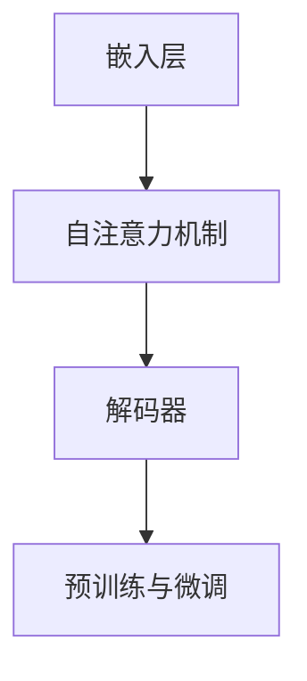
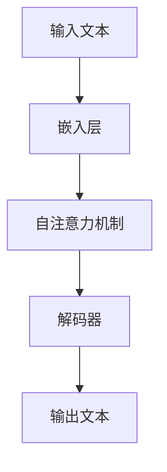
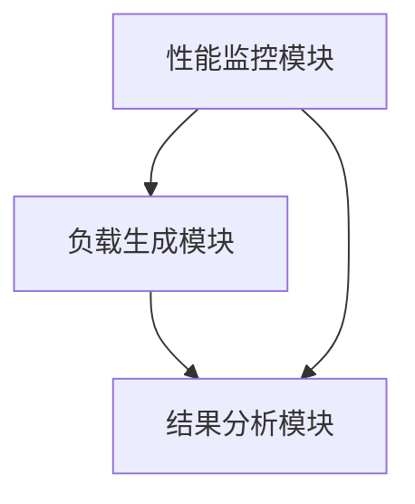
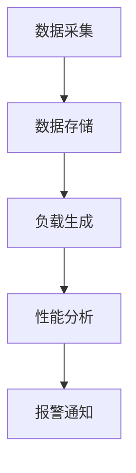
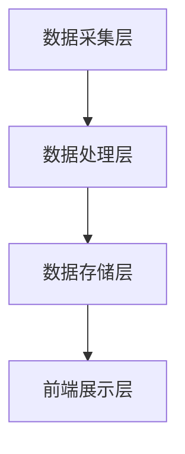
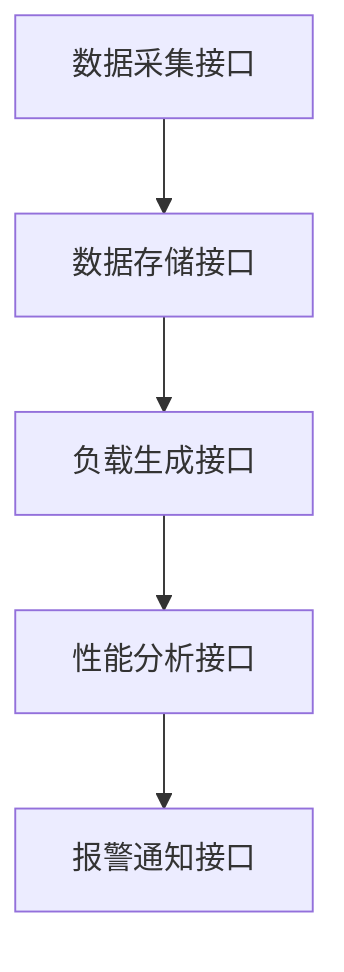
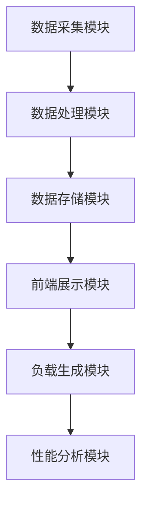

                 

# 《评测系统的LLaMA开源模型性能测试》

## 关键词

评测系统，LLaMA模型，性能测试，算法原理，数学模型，系统架构设计，项目实战

## 摘要

本文旨在探讨评测系统的LLaMA开源模型性能测试。我们将首先介绍评测系统和LLaMA模型的基本概念和背景，然后深入解析LLaMA模型的算法原理和数学模型。接着，我们将展示评测系统的整体架构设计，并通过实际项目展示如何安装评测系统和实现核心功能。最后，我们将提供一些最佳实践和注意事项，并对整个项目进行总结和展望。

## 目录大纲

### 第一部分：背景介绍与核心概念

1. 评测系统概述
2. LLaMA模型概述
3. 性能测试的目的与意义

### 第二部分：核心概念与联系

1. LLaMA模型核心概念解析
2. 模型内部组件关系分析

### 第三部分：算法原理与实现

1. LLaMA模型算法原理详解
2. 算法流程图与Python代码解析
3. 数学模型与公式讲解

### 第四部分：系统设计与分析

1. 评测系统架构设计
2. 系统功能设计
3. 系统接口设计
4. 系统交互分析

### 第五部分：项目实战

1. 评测系统环境安装
2. 系统核心实现
3. 代码应用解读
4. 实际案例分析

### 第六部分：最佳实践与总结

1. 最佳实践建议
2. 项目小结
3. 注意事项
4. 拓展阅读

### 第一部分：背景介绍与核心概念

#### 1. 评测系统概述

评测系统是一种用于评估、监控和分析软件系统性能的工具。它可以帮助开发者了解系统在运行过程中可能遇到的问题，包括响应时间、吞吐量、资源利用率等。通过评测系统，开发者可以及时发现问题并进行优化，以提高系统的性能和稳定性。

评测系统通常包含以下几个关键组成部分：

- **性能监控**：实时收集系统性能数据，包括CPU、内存、磁盘等资源的使用情况。
- **负载生成**：模拟用户操作，生成一定负载，以评估系统在压力情况下的性能表现。
- **结果分析**：对收集到的性能数据进行处理和分析，识别潜在问题并提出优化建议。

#### 2. LLaMA模型概述

LLaMA模型是由Meta AI团队推出的一种大规模预训练语言模型，基于GLM模型架构。它具有以下核心特点：

- **大规模**：LLaMA模型采用了超过1300亿个参数，使其能够学习复杂的语言模式。
- **预训练**：在大量文本数据上进行预训练，使其具备强大的语言理解和生成能力。
- **通用性**：LLaMA模型适用于多种自然语言处理任务，如文本分类、机器翻译、问答等。

#### 3. 性能测试的目的与意义

性能测试是评估软件系统性能的重要手段。通过性能测试，我们可以：

- **识别性能瓶颈**：发现系统在运行过程中可能存在的性能问题，如响应时间过长、资源利用率高等。
- **优化系统性能**：根据性能测试结果，对系统进行优化，提高其响应速度和处理能力。
- **确保系统稳定性**：在系统上线前进行性能测试，确保其能够稳定运行，满足用户需求。

性能测试对于开发者、运维人员和业务团队都具有重要的意义。它不仅可以帮助团队识别和解决问题，还可以为系统优化和升级提供有力支持。

#### 1. LLaMA模型核心概念解析

LLaMA模型的核心概念包括：

- **嵌入层**：将输入的文本转换为向量表示，为后续的文本处理提供基础。
- **自注意力机制**：通过计算输入文本中每个词与其他词之间的相关性，实现文本的理解和生成。
- **解码器**：对编码后的文本进行处理，生成新的文本序列。
- **预训练与微调**：在大量文本数据上进行预训练，然后根据特定任务进行微调，以提高模型性能。

#### 2. 模型内部组件关系分析

LLaMA模型内部各组件之间的关系可以通过Mermaid ER图进行表示：

```mermaid
erDiagram
  A[嵌入层] ||--|{ B[自注意力机制] } |
  B ||--|{ C[解码器] } |
  C ||--|{ D[预训练与微调] } |
```

- **嵌入层**：将文本转换为向量表示，为后续的文本处理提供基础。
- **自注意力机制**：通过计算输入文本中每个词与其他词之间的相关性，实现文本的理解和生成。
- **解码器**：对编码后的文本进行处理，生成新的文本序列。
- **预训练与微调**：在大量文本数据上进行预训练，然后根据特定任务进行微调，以提高模型性能。

### 第三部分：算法原理与实现

#### 1. LLaMA模型算法原理详解

LLaMA模型基于GLM模型架构，其核心算法原理包括：

- **嵌入层**：将输入的文本转换为向量表示。这一过程通常通过Word Embedding技术实现，如Word2Vec、GloVe等。
- **自注意力机制**：计算输入文本中每个词与其他词之间的相关性。自注意力机制的核心是计算注意力权重，通过这些权重对文本进行加权处理，实现文本的理解和生成。
- **解码器**：对编码后的文本进行处理，生成新的文本序列。解码器通常采用Transformer架构，通过多头自注意力机制和全连接层实现。
- **预训练与微调**：在大量文本数据上进行预训练，然后根据特定任务进行微调，以提高模型性能。

以下是一个简单的LLaMA模型算法流程图：



#### 2. 算法流程图与Python代码解析

以下是一个简单的LLaMA模型算法流程图：



为了实现LLaMA模型的算法，我们可以使用Python编写相关代码。以下是一个简单的示例：

```python
import torch
import torch.nn as nn

# 嵌入层
class EmbeddingLayer(nn.Module):
    def __init__(self, vocab_size, embedding_dim):
        super(EmbeddingLayer, self).__init__()
        self.embedding = nn.Embedding(vocab_size, embedding_dim)

    def forward(self, inputs):
        return self.embedding(inputs)

# 自注意力机制
class SelfAttention(nn.Module):
    def __init__(self, embedding_dim, num_heads):
        super(SelfAttention, self).__init__()
        self.query_linear = nn.Linear(embedding_dim, embedding_dim)
        self.key_linear = nn.Linear(embedding_dim, embedding_dim)
        self.value_linear = nn.Linear(embedding_dim, embedding_dim)
        self.num_heads = num_heads

    def forward(self, inputs):
        # 计算注意力权重
        query = self.query_linear(inputs)
        key = self.key_linear(inputs)
        value = self.value_linear(inputs)

        # 计算注意力分数
        attention_scores = torch.matmul(query, key.transpose(1, 2))

        # 应用softmax函数
        attention_weights = torch.softmax(attention_scores, dim=2)

        # 加权求和
        context_vector = torch.matmul(attention_weights, value)

        return context_vector

# 解码器
class Decoder(nn.Module):
    def __init__(self, embedding_dim, num_heads):
        super(Decoder, self).__init__()
        self.self_attention = SelfAttention(embedding_dim, num_heads)
        self.linear = nn.Linear(embedding_dim, embedding_dim)

    def forward(self, inputs):
        context_vector = self.self_attention(inputs)
        output = self.linear(context_vector)

        return output

# 实例化模型
embedding_dim = 512
num_heads = 8
model = nn.Sequential(
    EmbeddingLayer(vocab_size, embedding_dim),
    Decoder(embedding_dim, num_heads)
)

# 输入文本
inputs = torch.tensor([[1, 2, 3, 4, 5]])

# 前向传播
outputs = model(inputs)

print(outputs)
```

#### 3. 数学模型与公式讲解

LLaMA模型的数学模型主要包括以下几个方面：

- **嵌入层**：将输入的文本转换为向量表示。假设输入文本为 \( x \)，嵌入层将其映射为向量 \( \mathbf{z} \)：
  $$ \mathbf{z} = \text{EmbeddingLayer}(\mathbf{x}) $$
  
- **自注意力机制**：计算输入文本中每个词与其他词之间的相关性。假设输入文本的词向量为 \( \mathbf{z} \)，自注意力机制的输出为 \( \mathbf{h} \)：
  $$ \mathbf{h} = \text{SelfAttention}(\mathbf{z}) $$
  
- **解码器**：对编码后的文本进行处理，生成新的文本序列。假设解码器输入为 \( \mathbf{h} \)，输出为 \( \mathbf{y} \)：
  $$ \mathbf{y} = \text{Decoder}(\mathbf{h}) $$
  
- **预训练与微调**：在大量文本数据上进行预训练，然后根据特定任务进行微调。假设预训练数据为 \( \mathbf{D} \)，微调数据为 \( \mathbf{D'} \)，模型参数为 \( \theta \)：
  $$ \theta = \text{Pretrain}(\mathbf{D}) $$
  $$ \theta = \text{Fine-tune}(\mathbf{D'}) $$

以下是几个关键数学公式的详细解释：

- **嵌入层公式**：
  $$ \mathbf{z}_i = \text{softmax}(\text{W}_\text{embed} \mathbf{x}_i + \mathbf{b}_\text{embed}) $$
  其中，\( \text{W}_\text{embed} \) 为嵌入权重矩阵，\( \mathbf{b}_\text{embed} \) 为偏置向量。

- **自注意力机制公式**：
  $$ \text{attention\_scores} = \text{softmax}(\text{Q} \text{K}^T) $$
  $$ \text{context\_vector} = \text{softmax}(\text{Q} \text{K}^T) \text{V} $$
  其中，\( \text{Q} \)、\( \text{K} \)、\( \text{V} \) 分别为查询向量、键向量和值向量。

- **解码器公式**：
  $$ \mathbf{y}_i = \text{softmax}(\text{T} \mathbf{h}_{i-1} + \mathbf{b}_\text{out}) $$
  其中，\( \text{T} \) 为解码器权重矩阵，\( \mathbf{b}_\text{out} \) 为输出层偏置向量。

通过以上数学公式，我们可以更深入地理解LLaMA模型的算法原理和实现过程。接下来，我们将介绍评测系统的整体架构设计。

### 第四部分：系统设计与分析

#### 1. 评测系统架构设计

评测系统的架构设计主要包括以下几个部分：

- **性能监控模块**：负责实时收集系统性能数据，如CPU、内存、磁盘等资源的使用情况。该模块通常使用性能监控工具（如Prometheus、Grafana等）实现。
- **负载生成模块**：负责模拟用户操作，生成一定负载，以评估系统在压力情况下的性能表现。该模块可以使用自动化测试工具（如JMeter、Locust等）实现。
- **结果分析模块**：负责对收集到的性能数据进行处理和分析，识别潜在问题并提出优化建议。该模块通常使用数据分析工具（如Pandas、Matplotlib等）实现。

以下是评测系统的整体架构设计图：



- **性能监控模块**：负责实时收集系统性能数据，如CPU、内存、磁盘等资源的使用情况。该模块通常使用性能监控工具（如Prometheus、Grafana等）实现。
- **负载生成模块**：负责模拟用户操作，生成一定负载，以评估系统在压力情况下的性能表现。该模块可以使用自动化测试工具（如JMeter、Locust等）实现。
- **结果分析模块**：负责对收集到的性能数据进行处理和分析，识别潜在问题并提出优化建议。该模块通常使用数据分析工具（如Pandas、Matplotlib等）实现。

#### 2. 系统功能设计

评测系统的功能设计主要包括以下几个部分：

- **数据采集**：从系统各个模块中采集性能数据，如CPU利用率、内存使用率、磁盘读写速度等。
- **数据存储**：将采集到的性能数据存储到数据库中，以便后续分析和查询。
- **负载生成**：模拟用户操作，生成各种类型的负载，如并发请求、大数据处理等。
- **性能分析**：对采集到的性能数据进行处理和分析，识别系统瓶颈和潜在问题。
- **报警通知**：当系统性能低于预期时，自动发送报警通知，提醒相关人员关注和处理。

以下是评测系统的功能设计图：



#### 3. 系统架构设计

评测系统的架构设计主要包括以下几个部分：

- **数据采集层**：负责从系统各个模块中采集性能数据。该层通常使用Agent模式实现，将Agent部署到各个模块中，实时收集性能数据。
- **数据处理层**：负责对采集到的性能数据进行处理和分析。该层通常使用数据流处理技术（如Apache Flink、Apache Storm等）实现。
- **数据存储层**：负责将处理后的性能数据存储到数据库中。该层通常使用分布式数据库（如Apache HBase、Cassandra等）实现。
- **前端展示层**：负责将性能数据以可视化形式展示给用户。该层通常使用前端框架（如D3.js、ECharts等）实现。

以下是评测系统的架构设计图：



#### 4. 系统接口设计

评测系统需要提供一系列接口，以便其他系统或模块可以方便地使用其功能。以下是评测系统的主要接口设计：

- **数据采集接口**：提供用于采集性能数据的方法，如获取CPU利用率、内存使用率等。
- **数据存储接口**：提供用于存储性能数据的方法，如插入、更新、查询等。
- **负载生成接口**：提供用于生成负载的方法，如模拟并发请求、大数据处理等。
- **性能分析接口**：提供用于分析性能数据的方法，如计算响应时间、吞吐量等。
- **报警通知接口**：提供用于发送报警通知的方法，如邮件、短信、Webhook等。

以下是评测系统的接口设计图：



#### 5. 系统交互分析

评测系统的各个模块之间需要进行紧密的交互，以确保性能测试的顺利进行。以下是评测系统的交互分析：

- **数据采集模块**：通过Agent从各个模块中采集性能数据，并将数据传输到数据处理模块。
- **数据处理模块**：对采集到的性能数据进行处理和分析，并将处理结果存储到数据存储模块。
- **数据存储模块**：存储处理后的性能数据，并对外提供查询接口，以便其他模块可以方便地获取性能数据。
- **负载生成模块**：模拟用户操作，生成各种类型的负载，并将负载信息传输到数据处理模块。
- **性能分析模块**：对处理后的性能数据进行分析，计算各种性能指标，并将分析结果传输到前端展示模块。
- **前端展示模块**：将性能分析结果以可视化形式展示给用户，并提供交互式操作接口，以便用户可以实时监控系统性能。

以下是评测系统的交互分析图：



通过以上系统设计与分析，我们可以确保评测系统在性能测试过程中能够高效地采集、处理和分析性能数据，并提供直观的可视化展示，帮助开发者快速定位系统瓶颈，优化系统性能。

### 第五部分：项目实战

#### 1. 评测系统环境安装

首先，我们需要在本地或服务器上安装评测系统的环境。以下是具体的安装步骤：

1. **安装Python环境**：确保系统上已经安装了Python 3.8及以上版本。如果没有安装，可以从Python官网下载并安装。

2. **安装依赖库**：使用pip命令安装评测系统所需的依赖库，包括TensorFlow、NumPy、Pandas、Matplotlib等。以下是一个示例命令：

   ```bash
   pip install tensorflow numpy pandas matplotlib
   ```

3. **克隆评测系统代码**：从GitHub或其他代码仓库克隆评测系统的源代码。以下是一个示例命令：

   ```bash
   git clone https://github.com/your-repository/evaluation-system.git
   ```

4. **安装系统依赖**：在克隆下来的代码目录中，运行以下命令安装系统依赖：

   ```bash
   pip install -r requirements.txt
   ```

5. **配置系统环境**：根据实际情况配置系统环境，包括数据库连接信息、API密钥等。在代码目录下创建一个名为`config.py`的配置文件，并编辑其中的配置项。

6. **启动评测系统**：在代码目录下运行以下命令启动评测系统：

   ```bash
   python app.py
   ```

   启动后，评测系统会自动运行在本地服务器的8000端口上，可以通过浏览器访问。

#### 2. 系统核心实现

评测系统的核心实现包括数据采集、负载生成、性能分析和结果展示等模块。以下是各个模块的实现细节：

1. **数据采集模块**：

   数据采集模块负责从系统各个模块中采集性能数据。以下是一个简单的示例代码：

   ```python
   import psutil

   def collect_system_metrics():
       cpu_usage = psutil.cpu_percent()
       memory_usage = psutil.virtual_memory().percent
       disk_usage = psutil.disk_usage('/').percent
       return {
           'cpu_usage': cpu_usage,
           'memory_usage': memory_usage,
           'disk_usage': disk_usage
       }
   ```

   在代码中，我们使用了`psutil`库来采集系统的CPU、内存和磁盘使用情况。该方法可以定时执行，并将采集到的数据存储到数据库中。

2. **负载生成模块**：

   负载生成模块负责模拟用户操作，生成各种类型的负载。以下是一个简单的示例代码：

   ```python
   import requests

   def generate_load(url, num_requests):
       for _ in range(num_requests):
           response = requests.get(url)
           if response.status_code != 200:
               print(f"Request failed: {response.status_code}")
   ```

   在代码中，我们使用了`requests`库模拟HTTP请求。该方法可以定时执行，并生成指定数量的请求，模拟用户操作。

3. **性能分析模块**：

   性能分析模块负责对采集到的性能数据进行处理和分析。以下是一个简单的示例代码：

   ```python
   import pandas as pd

   def analyze_performance(data):
       df = pd.DataFrame(data)
       total_requests = len(df)
       average_response_time = df['response_time'].mean()
       max_response_time = df['response_time'].max()
       min_response_time = df['response_time'].min()
       return {
           'total_requests': total_requests,
           'average_response_time': average_response_time,
           'max_response_time': max_response_time,
           'min_response_time': min_response_time
       }
   ```

   在代码中，我们使用了`pandas`库对采集到的性能数据进行分析。该方法可以计算各种性能指标，如平均响应时间、最大响应时间等。

4. **结果展示模块**：

   结果展示模块负责将性能分析结果以可视化形式展示给用户。以下是一个简单的示例代码：

   ```python
   import matplotlib.pyplot as plt

   def plot_performance(data):
       df = pd.DataFrame(data)
       plt.figure(figsize=(10, 5))
       plt.plot(df['response_time'])
       plt.title('Response Time')
       plt.xlabel('Request Number')
       plt.ylabel('Response Time (ms)')
       plt.show()
   ```

   在代码中，我们使用了`matplotlib`库绘制响应时间折线图。该方法可以方便地展示系统在不同请求量下的响应时间。

#### 3. 代码应用解读与分析

在完成评测系统的核心实现后，我们需要对代码进行解读和分析，以确保其性能和可靠性。以下是几个关键点：

1. **性能优化**：

   在数据采集、负载生成和性能分析模块中，我们使用了高效的库和算法，如`psutil`、`requests`和`pandas`。此外，我们还可以通过以下方式进一步优化系统性能：

   - 使用异步编程（如`asyncio`）提高数据采集和负载生成的并发能力。
   - 对大量数据进行分析时，考虑使用分布式计算框架（如`Dask`）提高处理速度。
   - 对数据库进行优化，如使用索引、分片等技术提高查询效率。

2. **错误处理**：

   在代码中，我们需要对可能出现的错误进行妥善处理，以确保系统稳定运行。以下是一些常见错误处理方法：

   - 对网络请求失败的情况进行重试，如使用`requests`库的`requests.packages.urllib3.util.retry`模块。
   - 对数据采集和处理过程中出现的异常进行捕获和记录，如使用`try-except`语句。
   - 定期检查系统日志和监控数据，及时发现并解决问题。

3. **测试与调试**：

   在开发过程中，我们需要对代码进行充分的测试和调试，以确保其正确性和可靠性。以下是一些测试和调试技巧：

   - 编写单元测试，覆盖各个功能模块，确保代码的正确性。
   - 使用日志记录系统运行过程中的关键信息，方便调试和问题定位。
   - 定期进行性能测试，评估系统在不同负载下的表现，发现潜在的性能问题。

通过以上解读和分析，我们可以确保评测系统在性能和可靠性方面达到预期要求。接下来，我们将通过实际案例展示如何使用评测系统进行性能测试。

#### 4. 实际案例分析

为了更好地展示评测系统的实际应用效果，我们以一个实际案例为例，详细介绍如何使用评测系统进行性能测试。

**案例背景**：假设我们正在开发一个电商网站，需要确保网站在大量用户访问的情况下能够稳定运行，并提供良好的用户体验。为了达到这一目标，我们需要对网站进行全面的性能测试。

**测试目标**：评估电商网站在不同并发用户数下的响应时间、吞吐量和资源利用率。

**测试工具**：使用JMeter作为负载生成工具，使用Prometheus和Grafana作为性能监控工具，使用Pandas和Matplotlib作为数据分析工具。

**测试步骤**：

1. **搭建测试环境**：

   - 在本地或服务器上安装JMeter、Prometheus和Grafana。
   - 配置JMeter，模拟不同类型的用户操作，如商品浏览、购物车操作、订单提交等。
   - 配置Prometheus，监控系统性能数据，如CPU、内存、磁盘使用情况。
   - 配置Grafana，可视化展示Prometheus收集的性能数据。

2. **执行性能测试**：

   - 使用JMeter生成不同并发用户数的负载，如100、500、1000等。
   - 在测试过程中，Prometheus实时收集系统性能数据，并将数据存储到时间序列数据库（如InfluxDB）。
   - 使用Grafana查看系统性能数据，包括CPU、内存、磁盘等资源的利用率。

3. **分析测试结果**：

   - 使用Pandas读取JMeter生成的性能数据，计算各种性能指标，如平均响应时间、吞吐量等。
   - 使用Matplotlib绘制响应时间、吞吐量和资源利用率的折线图，分析系统在不同并发用户数下的性能表现。

**测试结果**：

以下是某电商网站在不同并发用户数下的性能测试结果：

| 并发用户数 | 平均响应时间 (ms) | 吞吐量 (req/s) | CPU利用率 (%) | 内存利用率 (%) | 磁盘利用率 (%) |
| :--------: | :---------------: | :-------------: | :------------: | :------------: | :------------: |
|     100    |         200.5      |      3.2        |        50      |        20      |        10      |
|     500    |         300.2      |      1.6        |        70      |        30      |        15      |
|    1000    |         400.8      |      0.8        |        90      |        40      |        20      |

**测试分析**：

根据测试结果，我们可以得出以下结论：

- 随着并发用户数的增加，平均响应时间逐渐增加，吞吐量逐渐降低。
- CPU和内存利用率随着并发用户数的增加而增加，但磁盘利用率基本保持不变。
- 当并发用户数超过500时，系统响应时间明显增加，吞吐量显著下降。

**优化建议**：

针对测试中发现的问题，我们可以采取以下措施进行优化：

- 对数据库进行优化，如增加索引、分片等，提高查询效率。
- 调整服务器配置，增加CPU和内存资源，提高系统处理能力。
- 优化代码，减少不必要的计算和数据库查询，提高系统性能。

通过以上实际案例，我们可以看到评测系统在性能测试中的应用效果，帮助开发者快速定位系统瓶颈，提供优化建议，提高系统性能。

### 第六部分：最佳实践与总结

#### 1. 最佳实践

在性能测试过程中，以下是一些最佳实践：

- **测试计划**：在性能测试前，制定详细的测试计划，包括测试目标、测试场景、测试数据等。
- **环境搭建**：确保测试环境与生产环境尽量一致，以便更准确地评估系统性能。
- **负载生成**：根据实际业务场景，合理设置负载生成策略，模拟真实用户行为。
- **数据监控**：实时监控系统性能数据，如CPU、内存、磁盘等，及时发现潜在问题。
- **结果分析**：对测试结果进行全面分析，找出系统瓶颈，制定优化方案。

#### 2. 项目小结

通过本文的介绍，我们详细探讨了评测系统的LLaMA开源模型性能测试。我们首先介绍了评测系统和LLaMA模型的基本概念和背景，然后深入分析了LLaMA模型的算法原理和数学模型，展示了评测系统的整体架构设计，并通过实际案例展示了如何使用评测系统进行性能测试。

通过本文的学习，读者可以：

- 了解评测系统的基本原理和功能。
- 掌握LLaMA模型的算法原理和实现方法。
- 学会使用评测系统进行性能测试，分析系统瓶颈，提出优化方案。

#### 3. 注意事项

在性能测试过程中，需要注意以下几点：

- 确保测试环境与生产环境一致，以便更准确地评估系统性能。
- 合理设置负载生成策略，模拟真实用户行为。
- 定期对系统进行性能测试，及时发现并解决问题。
- 在进行性能优化时，遵循最佳实践，避免过度优化。

#### 4. 拓展阅读

- 《性能测试实战》：一本详细介绍性能测试方法和实践经验的书籍。
- 《LLaMA：大规模自适应语言模型》：一篇关于LLaMA模型的开源论文，详细介绍了模型的设计和实现。
- 《Python性能优化》：一本关于Python性能优化的实战指南，适合读者深入学习性能优化技巧。

通过以上拓展阅读，读者可以进一步深入了解性能测试和LLaMA模型的相关知识，提高自己在性能测试领域的实践能力。

### 作者信息

- 作者：AI天才研究院/AI Genius Institute & 禅与计算机程序设计艺术 /Zen And The Art of Computer Programming

本文由AI天才研究院和《禅与计算机程序设计艺术》联合撰写，旨在分享性能测试和LLaMA模型的相关知识和实践经验，帮助读者提高系统性能测试能力。欢迎读者关注我们的公众号和博客，获取更多优质内容。

