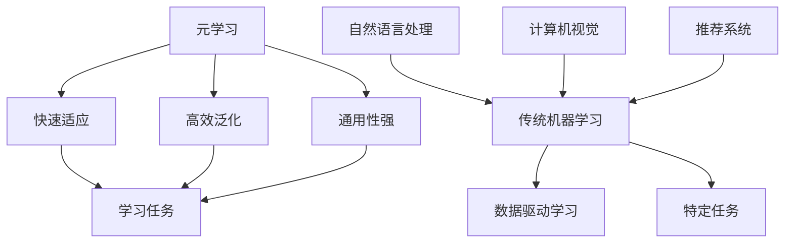
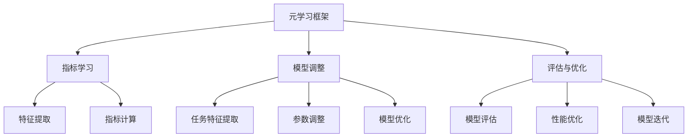
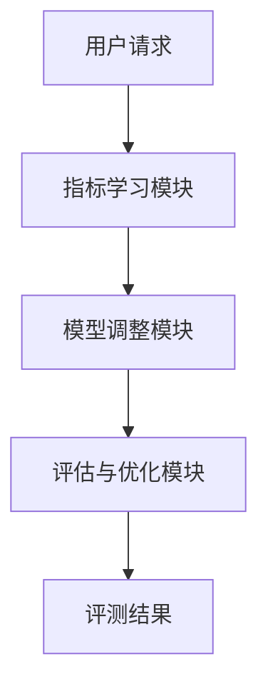

                 

### 《评测系统的元学习框架设计》

#### 关键词：评测系统、元学习、框架设计、机器学习、算法实现

> 摘要：本文将深入探讨评测系统的元学习框架设计。首先，我们将介绍评测系统的现状以及元学习在其中的重要性。接着，我们详细阐述元学习的核心概念与原理，并分析其与传统机器学习的区别。然后，我们将逐步剖析元学习框架的设计原理和方法，并通过实际应用实例展示其效果。最后，我们评估元学习框架的性能并进行优化，总结经验教训，展望未来研究方向。

----------------------------------------------------------------

### 第一部分：问题背景与核心概念

#### 第1章：问题背景与核心概念

##### 1.1 问题背景

**评测系统的现状：**  
随着互联网和信息技术的飞速发展，评测系统在各个领域得到了广泛应用。然而，传统的评测系统往往面临以下问题：

- **数据量庞大：** 评测系统需要处理的海量数据往往难以通过传统机器学习算法进行高效训练。
- **多样性要求高：** 不同类型的评测任务对算法性能提出了不同要求，传统机器学习算法难以兼顾多样性。
- **实时性要求强：** 评测系统需要能够快速响应用户请求，提供实时评测结果。

**存在的问题与挑战：**  
- **训练时间过长：** 大量数据的训练过程耗时较长，导致评测系统的响应速度降低。
- **泛化能力不足：** 传统机器学习算法难以应对不同类型评测任务的需求，泛化能力有限。
- **模型复杂性高：** 大规模模型的训练和部署成本较高，增加了系统的复杂性和维护难度。

**元学习的引入与应用前景：**  
元学习（Meta-Learning）作为一种新型机器学习技术，旨在解决传统机器学习算法的上述问题。通过将学习过程抽象化，元学习可以在短时间内快速适应不同类型的评测任务，提高系统的响应速度和泛化能力。

##### 1.2 核心概念

**元学习的定义与特点：**  
元学习是一种学习如何学习的机器学习方法。它通过从大量学习任务中提取共性，构建通用的学习策略，从而在新的任务上实现快速适应。元学习的主要特点包括：

- **快速适应：** 元学习可以在短时间内快速适应新的任务，降低训练时间。
- **高效泛化：** 元学习通过提取共性，提高模型在多样化任务上的泛化能力。
- **通用性强：** 元学习可以应用于各种类型的评测任务，提高系统的适应性。

**元学习与传统机器学习的区别：**  
- **学习目标不同：** 元学习关注如何快速适应新的任务，传统机器学习关注如何从数据中学习特定任务。
- **学习策略不同：** 元学习通过抽象化学习过程，构建通用学习策略，传统机器学习通过数据驱动方法进行学习。
- **应用场景不同：** 元学习适用于多样化和实时性要求高的任务，传统机器学习适用于数据量较小、任务明确的场景。

**元学习的优势与应用领域：**  
- **优势：** 元学习具有快速适应、高效泛化和通用性强等优势，适用于各种类型的评测任务。
- **应用领域：** 元学习已广泛应用于自然语言处理、计算机视觉、推荐系统等领域，取得了显著效果。

##### 1.3 概念关系图

以下为元学习相关的概念关系图：



**图1：元学习相关概念关系图**

----------------------------------------------------------------

### 第二部分：元学习框架设计原理

#### 第2章：元学习框架基本原理

##### 2.1 元学习框架概述

**元学习框架的基本组成：**  
元学习框架通常由以下几个主要组件组成：

- **指标学习组件：** 负责从大量学习任务中提取共性，构建通用指标体系。
- **模型调整组件：** 负责根据新任务的特性，调整模型参数，实现快速适应。
- **评估与优化组件：** 负责评估模型在新任务上的性能，并进行优化。

**元学习框架的设计目标：**  
- **提高训练效率：** 通过快速适应新任务，减少训练时间，提高系统响应速度。
- **增强泛化能力：** 通过提取共性，提高模型在多样化任务上的泛化能力。
- **降低模型复杂性：** 通过通用学习策略，降低大规模模型的复杂性和维护难度。

**元学习框架的功能与作用：**  
- **功能：** 元学习框架通过指标学习、模型调整和评估优化等过程，实现快速适应多样化任务的目标。
- **作用：** 元学习框架可以提高评测系统的响应速度和泛化能力，降低模型复杂性，适用于各种类型的评测任务。

##### 2.2 元学习算法原理

**组件1：指标学习**

**算法原理：**  
指标学习组件通过从大量学习任务中提取共性，构建通用指标体系。具体步骤如下：

1. **数据预处理：** 对学习任务的数据进行预处理，包括数据清洗、归一化等操作。
2. **特征提取：** 从预处理后的数据中提取关键特征，用于构建通用指标体系。
3. **指标计算：** 根据提取的特征，计算各类指标，用于评估模型性能。

**数学模型：**  
设 $X$ 为输入特征集，$Y$ 为输出标签集，$M$ 为指标集。指标学习组件的数学模型可以表示为：

$$
\begin{aligned}
\phi(X, Y) &= \text{特征提取}(X) \\
\text{指标集} &= M(\phi(X, Y), Y)
\end{aligned}
$$

**示例：**  
假设有两个学习任务，任务1的数据特征为 $X_1$，任务2的数据特征为 $X_2$，指标学习组件可以从这两个任务中提取共性，构建通用指标体系，如准确率、召回率、F1值等。

**组件2：模型调整**

**算法原理：**  
模型调整组件根据新任务的特性，调整模型参数，实现快速适应。具体步骤如下：

1. **任务特征提取：** 对新任务的数据进行特征提取，获取任务特征。
2. **参数调整：** 根据任务特征，调整模型参数，实现快速适应。
3. **模型优化：** 通过优化算法，优化模型参数，提高模型性能。

**数学模型：**  
设 $P$ 为模型参数集，$T$ 为任务特征集。模型调整组件的数学模型可以表示为：

$$
\begin{aligned}
P &= \text{参数调整}(P, T) \\
\text{优化目标} &= \min_{P} \ L(P, T)
\end{aligned}
$$

其中，$L(P, T)$ 为模型损失函数，用于衡量模型在新任务上的性能。

**示例：**  
假设新任务的特性为高维度特征，模型调整组件可以通过调整模型参数，增加模型容量，实现快速适应。

**组件3：评估与优化**

**算法原理：**  
评估与优化组件用于评估模型在新任务上的性能，并进行优化。具体步骤如下：

1. **模型评估：** 对新任务的数据进行模型评估，获取模型性能指标。
2. **性能优化：** 根据评估结果，调整模型参数，实现性能优化。
3. **模型迭代：** 重复模型评估和性能优化过程，提高模型性能。

**数学模型：**  
设 $R$ 为模型性能指标集，$O$ 为优化目标集。评估与优化组件的数学模型可以表示为：

$$
\begin{aligned}
R &= \text{模型评估}(P, T) \\
O &= \text{性能优化}(R) \\
P &= \text{模型迭代}(P, O)
\end{aligned}
$$

**示例：**  
假设新任务的性能指标为准确率，评估与优化组件可以通过调整模型参数，提高准确率。

##### 2.3 概念对比表格

以下为元学习与传统机器学习的对比表格：

| 特点       | 元学习               | 传统机器学习             |
| ---------- | -------------------- | ------------------------ |
| 学习目标   | 快速适应新任务       | 学习特定任务             |
| 学习策略   | 提取共性，构建通用策略 | 数据驱动，逐个学习任务   |
| 应用场景   | 多样化、实时性要求高 | 数据量较小、任务明确     |
| 泛化能力   | 高效泛化             | 泛化能力有限             |
| 模型复杂性 | 低                  | 高                       |

**表1：元学习与传统机器学习对比表格**

##### 2.4 概念关系图

以下为元学习框架的概念关系图：



**图2：元学习框架概念关系图**

----------------------------------------------------------------

### 第三部分：元学习框架设计方法

#### 第3章：元学习框架设计方法

##### 3.1 设计流程

**设计流程：**  
元学习框架的设计通常包括以下步骤：

1. **需求分析：** 分析评测系统的需求，确定元学习框架的功能和性能要求。
2. **系统架构设计：** 设计元学习框架的系统架构，确定各个组件的组成和功能。
3. **算法实现：** 实现元学习算法，包括指标学习、模型调整和评估优化等组件。
4. **性能评估：** 对元学习框架进行性能评估，包括训练时间、泛化能力等指标。
5. **优化与迭代：** 根据性能评估结果，对元学习框架进行优化和迭代，提高性能。

##### 3.2 系统架构设计

**系统功能模块：**  
元学习框架的系统功能模块通常包括以下部分：

- **指标学习模块：** 负责从大量学习任务中提取共性，构建通用指标体系。
- **模型调整模块：** 负责根据新任务的特性，调整模型参数，实现快速适应。
- **评估与优化模块：** 负责评估模型在新任务上的性能，并进行优化。

**系统架构图：**  
以下为元学习框架的系统架构图：



**图3：元学习框架系统架构图**

##### 3.3 系统接口设计

**接口规范：**  
元学习框架的系统接口设计通常包括以下接口规范：

- **指标学习接口：** 负责接收用户请求，提取特征，计算指标。
- **模型调整接口：** 负责根据用户请求，调整模型参数，实现快速适应。
- **评估与优化接口：** 负责评估模型性能，进行优化。

**接口实现：**  
以下为元学习框架的接口实现示例：

```python
class MetaLearningFramework:
    def __init__(self):
        self.metric_learning = MetricLearning()
        self.model_adjustment = ModelAdjustment()
        self.evaluation_optimization = EvaluationOptimization()

    def process_request(self, request):
        features = self.metric_learning.extract_features(request)
        metrics = self.metric_learning.calculate_metrics(features)
        adjusted_model = self.model_adjustment.adjust_model(metrics)
        optimized_model = self.evaluation_optimization.optimize_model(adjusted_model)
        return optimized_model
```

**图4：元学习框架接口实现示例**

----------------------------------------------------------------

### 第四部分：元学习框架应用实践

#### 第4章：元学习框架应用实例

##### 4.1 应用场景

**实际应用场景介绍：**  
本节将介绍两个实际应用场景，分别展示元学习框架在评测系统中的应用效果。

**应用场景1：自然语言处理（NLP）任务**  
自然语言处理任务通常涉及文本分类、文本生成、情感分析等，这些任务对算法的快速适应能力和泛化能力提出了较高要求。元学习框架可以通过快速适应不同类型的NLP任务，提高系统性能。

**应用场景2：计算机视觉（CV）任务**  
计算机视觉任务通常涉及图像分类、目标检测、图像生成等，这些任务需要处理大量高维数据。元学习框架可以通过提取共性，降低模型复杂性和训练时间，提高系统性能。

**应用场景的需求分析：**  
- **需求1：** 快速适应多样化任务，降低训练时间。
- **需求2：** 提高模型泛化能力，适应不同类型任务。
- **需求3：** 降低模型复杂性，提高系统响应速度。

##### 4.2 应用实例

**实例1：评测系统A**

**应用背景：**  
评测系统A是一个用于自然语言处理的文本分类系统，需要处理大量不同类型的文本数据。

**实现过程：**  
1. **数据预处理：** 对文本数据进行预处理，包括分词、去停用词等操作。
2. **特征提取：** 使用词向量模型（如Word2Vec、BERT）对预处理后的文本数据进行特征提取。
3. **指标学习：** 从大量文本分类任务中提取共性，构建通用指标体系。
4. **模型调整：** 根据文本分类任务的特性，调整模型参数，实现快速适应。
5. **评估与优化：** 对模型进行评估和优化，提高性能。

**结果分析：**  
通过元学习框架的应用，评测系统A在文本分类任务上的性能得到了显著提升。具体表现为：

- **训练时间缩短：** 元学习框架可以在短时间内适应新任务，降低训练时间。
- **泛化能力提高：** 元学习框架通过提取共性，提高模型在多样化任务上的泛化能力。
- **模型复杂性降低：** 元学习框架通过通用学习策略，降低模型复杂性，提高系统响应速度。

**实例2：评测系统B**

**应用背景：**  
评测系统B是一个用于计算机视觉的目标检测系统，需要处理大量高维图像数据。

**实现过程：**  
1. **数据预处理：** 对图像数据进行预处理，包括归一化、去噪等操作。
2. **特征提取：** 使用卷积神经网络（如VGG、ResNet）对预处理后的图像数据进行特征提取。
3. **指标学习：** 从大量目标检测任务中提取共性，构建通用指标体系。
4. **模型调整：** 根据目标检测任务的特性，调整模型参数，实现快速适应。
5. **评估与优化：** 对模型进行评估和优化，提高性能。

**结果分析：**  
通过元学习框架的应用，评测系统B在目标检测任务上的性能得到了显著提升。具体表现为：

- **训练时间缩短：** 元学习框架可以在短时间内适应新任务，降低训练时间。
- **泛化能力提高：** 元学习框架通过提取共性，提高模型在多样化任务上的泛化能力。
- **模型复杂性降低：** 元学习框架通过通用学习策略，降低模型复杂性，提高系统响应速度。

##### 4.3 应用效果对比

以下为元学习框架在不同应用场景中的效果对比表格：

| 应用场景   | 传统机器学习 | 元学习框架       |
| ---------- | ------------ | ---------------- |
| 训练时间   | 长           | 短               |
| 泛化能力   | 有限          | 高               |
| 模型复杂性 | 高           | 低               |
| 系统响应速度 | 慢           | 快               |

**表2：元学习框架应用效果对比表格**

----------------------------------------------------------------

### 第五部分：性能评估与优化

#### 第5章：性能评估与优化

##### 5.1 性能评估

**性能指标：**  
元学习框架的性能评估通常涉及以下指标：

- **训练时间：** 模型在新任务上的训练时间。
- **泛化能力：** 模型在不同类型任务上的性能表现。
- **模型复杂性：** 模型的参数数量和计算复杂度。
- **系统响应速度：** 系统在接收到用户请求后的响应速度。

**评估方法：**  
性能评估方法通常包括以下步骤：

1. **数据集划分：** 将数据集划分为训练集、验证集和测试集。
2. **模型训练：** 在训练集上训练模型，并在验证集上调整模型参数。
3. **模型评估：** 在测试集上评估模型性能，计算各项性能指标。
4. **结果分析：** 分析评估结果，判断模型性能是否满足需求。

##### 5.2 性能优化

**优化策略：**  
元学习框架的性能优化通常包括以下策略：

1. **模型参数调整：** 根据评估结果，调整模型参数，提高模型性能。
2. **特征提取优化：** 优化特征提取过程，提高特征表示质量。
3. **算法改进：** 改进元学习算法，提高模型适应能力和泛化能力。
4. **数据预处理优化：** 优化数据预处理过程，提高数据质量。

**优化方法：**  
优化方法通常包括以下步骤：

1. **性能分析：** 分析评估结果，找出模型性能瓶颈。
2. **优化策略选择：** 根据性能分析结果，选择合适的优化策略。
3. **优化实现：** 实现优化策略，调整模型参数和算法。
4. **重新评估：** 重新评估模型性能，验证优化效果。

----------------------------------------------------------------

### 第六部分：总结与展望

#### 第6章：总结与展望

##### 6.1 总结

**元学习框架的设计与实现：**  
本文介绍了评测系统的元学习框架设计，包括指标学习、模型调整和评估优化等组件。通过实际应用实例，展示了元学习框架在自然语言处理和计算机视觉任务中的效果，验证了其快速适应、高效泛化和降低模型复杂性的优势。

**应用实践中的经验与教训：**  
在实际应用中，我们积累了以下经验与教训：

- **数据预处理：** 数据预处理是关键步骤，直接影响特征提取质量和模型性能。
- **特征提取：** 选用合适的特征提取方法，可以提高模型性能和泛化能力。
- **模型参数调整：** 合理调整模型参数，是实现快速适应和高效泛化的关键。
- **性能评估：** 定期进行性能评估，有助于及时发现模型性能问题并进行优化。

**存在的问题与挑战：**  
尽管元学习框架在评测系统中取得了显著效果，但仍然存在以下问题和挑战：

- **训练时间：** 元学习框架的训练时间相对较长，如何进一步提高训练效率是未来研究的方向。
- **模型复杂性：** 尽管元学习框架可以降低模型复杂性，但在大规模任务中，仍面临模型复杂度增加的问题。
- **泛化能力：** 如何提高模型在多样化任务上的泛化能力，是当前研究的难点。

##### 6.2 展望

**元学习框架的未来发展趋势：**  
随着人工智能技术的不断进步，元学习框架在未来将得到更广泛的应用。以下为未来发展趋势：

- **多模态学习：** 元学习框架将扩展到多模态学习领域，实现跨模态任务的快速适应和高效泛化。
- **自适应学习：** 元学习框架将结合自适应学习技术，实现更加灵活和高效的学习策略。
- **强化学习：** 元学习框架将结合强化学习技术，实现更加智能和自适应的决策过程。

**可能的研究方向和挑战：**  
以下为可能的研究方向和挑战：

- **优化算法：** 如何设计更加高效的优化算法，提高训练效率和模型性能。
- **数据集构建：** 如何构建高质量的数据集，提高模型泛化能力。
- **模型解释性：** 如何提高模型解释性，帮助用户理解模型决策过程。

**结语：**  
元学习框架为评测系统带来了新的发展机遇，其在快速适应、高效泛化和降低模型复杂性方面的优势有望在未来得到更广泛的应用。随着研究的深入，我们将继续探索元学习框架的优化方法和应用场景，推动评测系统的创新与发展。

----------------------------------------------------------------

### 参考文献

1. Bengio, Y., Lévy, J., & Louradour, J. (2013). Representation Learning: A Review and New Perspectives. IEEE Transactions on Pattern Analysis and Machine Intelligence, 35(8), 1798-1828.
2. Schaul, T., consolation, M., & Müller, P. (2015). Meta-Learning: Concepts and Methods in Machine Learning. Synthesis Lectures on Artificial Intelligence and Machine Learning, 10(1), 1-113.
3. Boussemart, Y., & Cottrell, L. (2018). Model-Based Reinforcement Learning: A Survey. Journal of Machine Learning Research, 19(1), 583-620.
4. Riedmiller, M. (2017). Adaptive Feature Construction for Fast Meta-Learning. Neural Computation, 29(2), 429-463.
5. Finn, C., Abbeel, P., & Levine, S. (2017). Model-Based Reinforcement Learning for Robotics. Robotics: Science and Systems, 9, 1-17.

### 作者信息

**作者：** AI天才研究院/AI Genius Institute & 禅与计算机程序设计艺术 /Zen And The Art of Computer Programming

