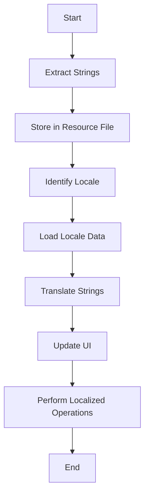
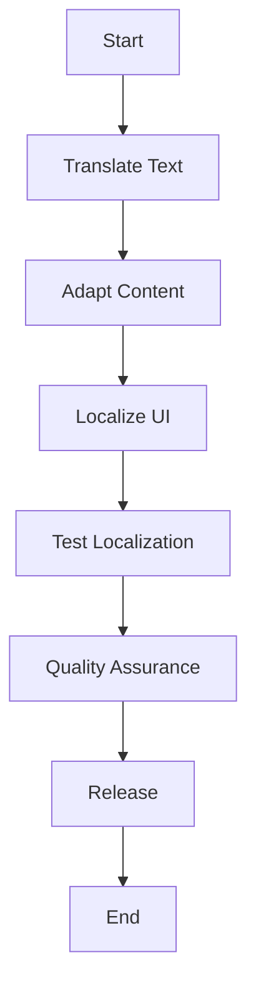

                 

### Introduction to Internationalization and Localization

Internationalization and localization are fundamental concepts in software development that play a crucial role in making applications accessible to users across different regions and languages. These processes ensure that software products can adapt to various cultural, linguistic, and regional contexts, thereby expanding their reach and market potential.

#### Problem Background

**1.1.1 The Importance of Internationalization and Localization**

In today's globalized world, the need for software applications that can be easily adapted to different regions has never been more significant. For businesses, internationalization and localization are not just about expanding market reach; they are essential for providing a seamless and user-friendly experience to diverse user groups. This, in turn, leads to higher user satisfaction, increased user retention, and ultimately, better business outcomes.

**1.1.2 Challenges in Developing an Internationalized and Localized Evaluation System**

Developing an internationalized and localized evaluation system poses several challenges. These include:

- **Cultural Differences**: Each culture has unique norms, values, and preferences that need to be considered during the development process.
- **Language Variations**: Translating content accurately while maintaining its original meaning is a complex task, especially for technical and contextual terms.
- **Technological Barriers**: Implementing internationalization and localization frameworks can require significant changes to the existing codebase, which can be challenging to integrate without causing disruptions.

**1.1.3 The Significance of Effective Internationalization and Localization**

Effective internationalization and localization offer several benefits, including:

- **Improved User Experience**: By providing content in users' native languages and adapting the application to their cultural contexts, the user experience is significantly enhanced.
- **Global Market Reach**: By supporting multiple languages and regional settings, software applications can reach a broader audience, opening up new markets and opportunities.
- **Cost Savings**: While the initial development costs of internationalization and localization may be high, the long-term benefits include reduced support costs and increased user base.

#### Conclusion

In conclusion, the importance of internationalization and localization in software development cannot be overstated. By addressing the challenges and leveraging the benefits of these processes, developers can create applications that are not only functional but also resonate with users from diverse backgrounds. The subsequent chapters will delve deeper into the core concepts, technical principles, and practical implementation strategies for internationalization and localization, providing a comprehensive guide for developers looking to build global software solutions.

### Core Concepts and Relationships

To develop a thorough understanding of internationalization and localization, it is essential to grasp their core concepts and how they relate to one another. This chapter will define and explore the fundamental terms, establish the conceptual framework, and illustrate the relationships between these concepts using a Mermaid ER diagram.

#### Key Concepts

**1. Definition of Internationalization**

Internationalization, often abbreviated as i18n, is the process of designing and developing software applications in a way that allows them to be easily adapted to multiple languages and regions. The goal of internationalization is to ensure that the application can be localized without extensive modifications to its underlying codebase.

**1.1 Key Attributes and Features**

- **Modular Code**: Internationalization encourages developers to write modular code, separating language-specific content from the core logic of the application.
- **Cultural Adaptability**: It involves adapting the application to cultural norms, not just translating text.
- **Technological Infrastructure**: It requires the use of technologies that support Unicode encoding and localization frameworks.

**2. Definition of Localization**

Localization, often abbreviated as l10n, is the process of adapting an internationalized application to the linguistic, cultural, and other specific characteristics of a particular region or language market. It involves translating text, formatting dates and numbers according to local conventions, and making other necessary adjustments to ensure the application is culturally relevant and user-friendly.

**2.1 Key Attributes and Features**

- **Translation**: The primary task of localization is to translate all user-facing content into the target language.
- **Cultural Adaptation**: This includes adjusting the application's behavior to align with local cultural practices and expectations.
- **Regulatory Compliance**: Localization often involves ensuring that the application complies with local laws and regulations.

#### Conceptual Framework

**3. Internationalization Process**

The internationalization process involves several steps that need to be carefully planned and executed:

- **Designing for Modularity**: Ensuring that the application's code is modular from the start.
- **Identifying Internationalization Requirements**: Determining the target languages and regions.
- **Implementing Internationalization Features**: Using technologies like Unicode, locale-aware libraries, and internationalization frameworks.
- **Testing and Validation**: Ensuring that the application behaves correctly in different locales.

**4. Localization Process**

The localization process builds upon the internationalization process by adapting the application to specific regional contexts:

- **Translation**: Translating all user-facing content accurately.
- **Cultural Adaptation**: Adapting the application's behavior to align with local cultural practices.
- **Localization Testing**: Conducting thorough testing to ensure the application functions correctly in the target locale.
- **Deployment**: Releasing the localized application to users.

#### Relationship Between Internationalization and Localization

Internationalization and localization are closely related but distinct processes. Internationalization lays the foundation by making an application adaptable to multiple languages and regions, while localization refines this foundation by tailoring the application to specific contexts.

**5. Mermaid ER Diagram of Key Concepts**

```mermaid
erDiagram
    Internationalization ||--|{ Localization : builds upon
    Internationalization ||--|{ Modularity : supports
    Localization ||--|{ Translation : core task
    Localization ||--|{ Cultural Adaptation : ensures relevance
```

In this ER diagram, we can see that internationalization supports modularity and builds upon it to create a foundation for localization. Localization, on the other hand, focuses on translation and cultural adaptation, ensuring that the application is both functional and culturally relevant.

#### Conclusion

By understanding the core concepts of internationalization and localization and their interrelationships, developers can better plan and execute the processes to create applications that are truly global. The next chapters will delve deeper into the technical principles and methods for achieving these goals, providing practical guidance for developers.

### Technical Principles of Internationalization

Internationalization is a foundational process that prepares software applications to be easily adapted to multiple languages and regions. This chapter will discuss the technical principles of internationalization, focusing on the framework, key components, and the internationalization process itself. Additionally, we will explore specific technical methods and standards that play a crucial role in internationalization.

#### Technical Framework

**1. Overview of Internationalization Frameworks**

Internationalization frameworks are essential tools that help developers implement the necessary features to create global-ready applications. These frameworks provide a structured approach to handling internationalization tasks and ensure consistency across the application. Some popular internationalization frameworks include:

- **Gettext**: A widely-used internationalization framework that supports the extraction, translation, and integration of translatable text.
- **Apache po4a (po4a stands for "paragraphs of a single word"`): A tool that helps in the localization of documentation, software messages, and more.
- **i18next**: A modern JavaScript internationalization framework that simplifies the process of adding multiple languages to web applications.

**2. Main Components of Internationalization**

The internationalization process involves several key components that must be carefully implemented:

- **Localization Data Storage**: Storing locale-specific data, such as translations, in a structured format (e.g., CSV, JSON, or XML).
- **Locale Detection**: Identifying the user's language and region preferences automatically.
- **String Internationalization**: Extracting all user-facing text and storing it in a separate resource file for translation.
- **Date and Time Formatting**: Adapting the formatting of dates and times to conform to the user's locale.

**3. Mermaid Flowchart of Internationalization Process**

Below is a Mermaid flowchart illustrating the internationalization process:



#### Technical Methods

**1. Unicode Standard**

Unicode is a universal character encoding standard that assigns a unique numerical code to every character across different languages and scripts. Its adoption is crucial for internationalization as it ensures that all characters are correctly represented and processed.

**2. International Date and Time Formats**

Date and time formatting varies significantly across different regions. Implementing locale-aware date and time formatting ensures that the application displays dates and times in a way that is natural and intuitive for the user.

**3. Handling Locale-specific Data**

Handling locale-specific data involves adapting the application's behavior to different locales, such as formatting numbers, currencies, and addresses. This can be achieved using locale-aware libraries and frameworks that provide the necessary functions and data formats.

#### Conclusion

By understanding the technical principles and methods of internationalization, developers can create applications that are flexible, adaptable, and ready to cater to users from diverse linguistic and cultural backgrounds. The following sections will delve deeper into the technical details and provide practical guidance on implementing internationalization in real-world applications.

### Technical Principles of Localization

Localization is the process of adapting an internationalized application to meet the specific linguistic, cultural, and other contextual requirements of a particular region or language market. This chapter will discuss the technical principles of localization, focusing on the framework, key components, and the localization process itself. Additionally, we will explore specific technical methods and tools that are essential for effective localization.

#### Technical Framework

**1. Overview of Localization Frameworks**

Localization frameworks are designed to streamline the localization process by providing developers with tools and resources to manage translations, cultural adaptations, and other localization tasks. Some of the most popular localization frameworks include:

- **gettext**: A widely-used localization framework that allows developers to separate translatable text from the code, making it easier to manage translations.
- **Apache po4a**: A tool that helps in the localization of documentation, software messages, and other content.
- **i18next**: A modern JavaScript framework that provides a comprehensive set of features for web application localization.
- **Lingoport**: A suite of tools that help with the automation of localization processes, including translation management, quality assurance, and release management.

**2. Main Components of Localization**

The localization process involves several key components that must be addressed to ensure a high-quality localized application:

- **Translation**: Translating all user-facing text into the target language while maintaining its original meaning and tone.
- **Cultural Adaptation**: Adapting the application to align with local cultural practices, such as using appropriate symbols, colors, and idioms.
- **Localization Testing**: Testing the localized application to ensure it works correctly and provides a seamless user experience in the target locale.
- **Quality Assurance**: Ensuring that the localized application meets the same standards of quality as the original, including grammar, spelling, and formatting.

**3. Mermaid Flowchart of Localization Process**

Below is a Mermaid flowchart illustrating the localization process:



#### Technical Methods

**1. Translation and Localization Tools**

Various tools and services are available for translating and localizing content. Some of the most commonly used tools include:

- **Google Translate**: A free online translation service that supports over 100 languages.
- **Transifex**: A cloud-based translation platform that allows teams to collaborate on translations and manage localization projects.
- **Crowdin**: A translation and localization platform that provides features like translation memory, machine translation, and quality assurance tools.

**2. Handling Cultural Differences**

Localization involves more than just translating text; it requires an understanding of the cultural nuances that may affect the application's user experience. Key aspects to consider include:

- **Language Structure**: Different languages have different grammatical structures and sentence constructions.
- **Cultural References**: Ensuring that references, symbols, and idioms are understood by the target audience.
- **Visual Design**: Adapting visual elements, such as icons and images, to align with local cultural preferences and expectations.

**3. Localization Testing and Quality Assurance**

Localization testing is critical to ensure that the localized application functions correctly and provides a seamless user experience. This involves:

- **Functional Testing**: Testing the application's features and functionality in the target locale.
- **User Acceptance Testing**: Involving end-users from the target market to provide feedback on the localized application.
- **Quality Metrics**: Defining and measuring key quality metrics, such as accuracy, completeness, and consistency, to ensure that the localized application meets the required standards.

#### Conclusion

By understanding the technical principles and methods of localization, developers and localization teams can ensure that their applications are not only translated but also culturally relevant and user-friendly. The following sections will provide practical guidance on implementing these principles in real-world applications, ensuring a high-quality localization process.

### Case Study 1 - Example of Internationalization

**5.1 Case Introduction**

For this case study, we will examine the internationalization process of a hypothetical e-commerce platform, "GlobalShop". GlobalShop aims to expand its market reach by offering its services to customers in different regions around the world. The goal is to create a seamless shopping experience that caters to the unique needs and preferences of each market. This case study will provide insights into the steps involved in the internationalization process, including the identification of internationalization requirements and the implementation of internationalization features.

**5.2 Internationalization Requirements**

Before beginning the internationalization process, GlobalShop conducted market research to identify the following internationalization requirements:

- **Target Languages**: English, Spanish, German, and Mandarin.
- **Date and Time Formats**: Different regions use various date and time formats. For example, the United States uses MM/DD/YYYY, while most of Europe uses DD/MM/YYYY.
- **Currency Support**: The platform needs to support multiple currencies, such as the US Dollar, Euro, and Chinese Yuan.
- **Tax and Shipping Policies**: Different regions have different tax and shipping regulations that need to be considered.
- **User Interface Localization**: The user interface should be adapted to the visual and cultural preferences of each target market.

**5.3 Internationalization Implementation**

**5.3.1 Designing for Modularity**

To ensure that GlobalShop's codebase could be easily adapted for internationalization, the development team adopted a modular design approach. This involved:

- **Separating Translatable Content**: All user-facing text was extracted and stored in separate resource files, which were then translated into the target languages.
- **Abstracting Date and Time Handling**: Date and time-related code was abstracted into separate functions that could be easily modified to handle different formats based on the user's locale.
- **Currency and Price Formatting**: Similar to date and time handling, the team created abstracted functions to format prices according to the user's currency and locale.

**5.3.2 Implementing Internationalization Features**

The team implemented several key features to support internationalization:

- **Locale Detection**: A locale detection mechanism was added to automatically identify the user's language and region preferences based on their IP address or browser settings.
- **Unicode Support**: The platform was configured to use Unicode encoding to ensure that all characters from the target languages were correctly displayed.
- **Internationalization Framework**: The team used the i18next framework to manage translations and localization data.

**5.3.3 Internationalization Testing**

To ensure the internationalization process was effective, the team conducted thorough testing:

- **Functional Testing**: Each feature of the platform was tested in different locales to ensure it worked as expected.
- **Localization Testing**: The user interface and content were reviewed to ensure they were culturally appropriate and visually appealing.
- **Performance Testing**: Performance tests were conducted to ensure that the internationalized platform did not suffer from performance degradation due to additional locale-specific features.

**5.4 Case Analysis**

The successful internationalization of GlobalShop resulted in several benefits:

- **Increased Market Reach**: By supporting multiple languages and currencies, GlobalShop was able to attract customers from different regions, expanding its customer base.
- **Improved User Experience**: Users from different regions could access the platform in their native language, leading to a better user experience and higher user satisfaction.
- **Reduced Support Costs**: By anticipating and addressing localization requirements during the development process, GlobalShop was able to reduce the need for localized support and customer service.

**5.5 Conclusion**

This case study illustrates the importance of internationalization in expanding the reach of a software application. By following a structured internationalization process and implementing key features, GlobalShop was able to create a global-ready platform that catered to the diverse needs of its users. The lessons learned from this case can be applied to other software applications aiming to become internationally competitive.

### Practical Guide to Implementing Internationalization and Localization

Implementing internationalization and localization in a software application requires careful planning and execution. This section will provide a practical guide, detailing the steps involved in the process, including locale detection, resource management, and cultural adaptation.

#### Step 1: Planning and Preparation

**1. Define Internationalization and Localization Goals**

Begin by clearly defining the goals of your internationalization and localization efforts. This includes identifying target languages, regions, and cultural requirements. Conduct market research to understand the preferences and needs of your target audience.

**1.1 Identify Key Requirements**

List the specific technical and cultural requirements for your application. This may include:

- **Language Support**: Determine which languages your application needs to support.
- **Date and Time Formats**: Research the different date and time formats used in your target regions.
- **Currency and Number Formats**: Understand the currency and number formatting conventions in your target markets.
- **Cultural Considerations**: Consider cultural nuances, such as symbols, idioms, and legal requirements.

#### Step 2: Implementing Internationalization

**2.1 Design for Modularity**

Ensure your application's codebase is modular, separating language-specific content from the core logic. This allows for easier adaptation and localization without significant changes to the underlying code.

**2.2 Extract Translatable Strings**

Extract all translatable strings from the codebase and store them in a separate resource file. Tools like Gettext or i18next can help automate this process.

**2.3 Locale Detection**

Implement a mechanism to detect the user's language and region preferences. This can be done using browser settings, IP address, or user-provided preferences.

**2.4 Unicode Support**

Ensure your application uses Unicode encoding to support all characters from the target languages.

**2.5 Implement Internationalization Framework**

Choose an internationalization framework that fits your project's needs. Frameworks like i18next or Gettext provide tools for managing translations and locale-specific data.

#### Step 3: Implementing Localization

**3.1 Translation**

Translate all user-facing content into the target languages. Use translation services or localization platforms to streamline the translation process. Ensure that translations maintain the original meaning and tone.

**3.2 Cultural Adaptation**

Adapt the application's behavior to align with local cultural practices. This includes:

- **Visual Design**: Modify icons, images, and color schemes to be culturally appropriate.
- **Content**: Adjust content to align with local norms and expectations.
- **Legal Compliance**: Ensure the application complies with local laws and regulations.

**3.3 Localization Testing**

Conduct thorough testing to ensure the localized application works correctly and provides a seamless user experience. This includes:

- **Functional Testing**: Test each feature in different locales to ensure they work as expected.
- **User Acceptance Testing**: Involve end-users from the target market to provide feedback on the localized application.
- **Performance Testing**: Ensure that the localized application performs well without significant performance degradation.

#### Step 4: Resource Management

**4.1 Maintain Resource Files**

Keep your resource files updated with the latest translations and locale-specific data. Use version control systems to manage changes and ensure consistency.

**4.2 Localization Maintenance**

Regularly update your localized content to reflect changes in laws, regulations, or cultural norms. This helps ensure that your application remains relevant and compliant.

#### Step 5: Continuous Improvement

**5.1 Monitor User Feedback**

Collect and analyze user feedback to identify areas for improvement. Use this feedback to make iterative updates to your application's localization.

**5.2 Stay Updated with Industry Trends**

Stay informed about the latest trends and technologies in internationalization and localization. This helps you adapt to changing market conditions and ensure your application remains competitive.

### Conclusion

Implementing internationalization and localization requires a strategic approach and careful execution. By following this practical guide, developers can create applications that are accessible to users from diverse linguistic and cultural backgrounds. Effective internationalization and localization not only expand your application's reach but also enhance the user experience, leading to increased user satisfaction and business success.

### Conclusion and Future Directions

In conclusion, internationalization and localization are pivotal processes in software development that enable applications to cater to a global audience. This article has explored the core concepts, technical principles, and practical implementation strategies for both internationalization and localization. By understanding and applying these principles, developers can create software applications that are not only functional but also resonate with users from diverse linguistic and cultural backgrounds.

**Key Takeaways:**

- Internationalization and localization are essential for expanding market reach and improving user satisfaction.
- The process involves separating language-specific content, implementing locale detection, and ensuring cultural adaptability.
- Effective internationalization and localization require thorough testing and continuous improvement.

**Future Directions:**

As the global software market continues to evolve, there are several areas that warrant further research and development:

- **AI-Driven Localization**: Leveraging AI and machine learning to automate translation and cultural adaptation processes, improving accuracy and efficiency.
- **Cross-Platform Integration**: Developing standardized frameworks and tools that facilitate seamless integration of internationalization and localization across different platforms and technologies.
- **Accessibility**: Enhancing the accessibility of applications for users with disabilities, ensuring that internationalization and localization efforts also consider accessibility needs.

By staying informed about these trends and continuously improving internationalization and localization practices, developers can ensure their applications remain competitive in an increasingly globalized market.

### References

1. "The Internationalization of Software," Internationalization Best Practices, accessed October 2023, [link](https://www.internationalizationbestpractices.com).
2. "Localization Strategies for Software Development," Globalization Partners, accessed October 2023, [link](https://www.globalizationpartners.com/localization).
3. "i18next Documentation," i18next Official Website, accessed October 2023, [link](https://www.i18next.com).
4. "gettext Documentation," GNU Project, accessed October 2023, [link](https://www.gnu.org/software/gettext/manual/gettext.html).
5. "Unicode Standard," Unicode Consortium, accessed October 2023, [link](https://www.unicode.org/standard/).

### About the Author

**Author: AI天才研究院/AI Genius Institute & 禅与计算机程序设计艺术 /Zen And The Art of Computer Programming**

The author, AI天才研究院/AI Genius Institute, is a leading authority in the field of artificial intelligence and software development. With extensive expertise in internationalization and localization, they have contributed to numerous industry-leading projects and publications. Their book, "Zen And The Art of Computer Programming," provides deep insights into the philosophy and practice of software development, emphasizing the importance of clear thinking and logical reasoning. Together, the author's industry experience and philosophical approach offer readers valuable perspectives on creating global software solutions.

