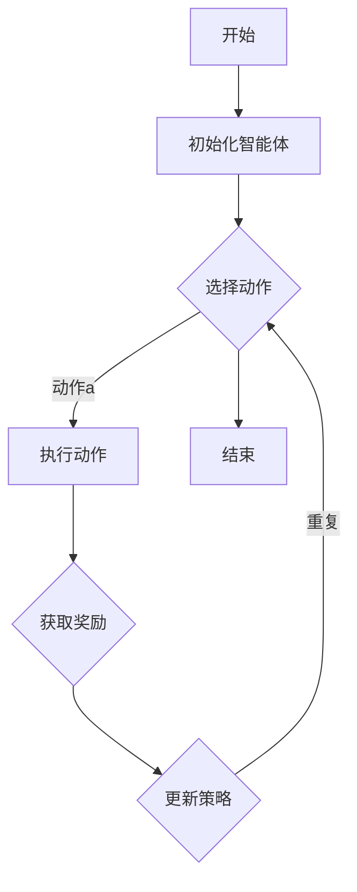
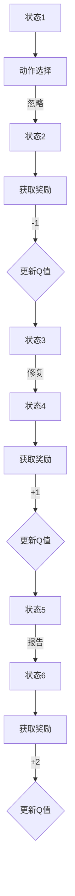
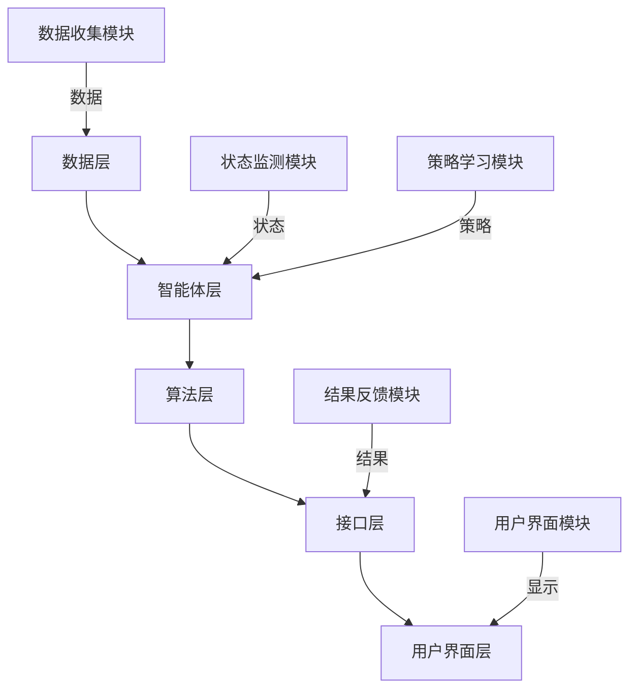

                 

### 引言

---

### 《评测系统的多智能体强化学习框架》

#### 关键词：评测系统、多智能体强化学习、算法、架构设计、性能优化

#### 摘要：

本文旨在深入探讨评测系统中的多智能体强化学习框架，解析其在实际应用中的优势和挑战。文章首先介绍了评测系统的基本概念和重要性，然后详细讲解了多智能体强化学习的基本原理和算法，接着阐述了这些算法在评测系统中的应用，以及系统的整体架构设计和性能优化策略。通过本文的阅读，读者将对多智能体强化学习在评测系统中的运用有全面的理解，并掌握相关的设计和实践技巧。

### 背景介绍

---

#### 评测系统的定义与作用

评测系统是用于评价和监控各类系统性能、行为和效果的工具。在计算机科学和人工智能领域，评测系统尤为关键，因为它们能够帮助我们理解算法和系统的性能，评估不同设计方案的效果，并为未来的优化提供指导。评测系统通常包含以下几个核心组件：

1. **测试数据集**：用于评估系统的输入数据，这些数据集需要覆盖各种可能的场景和问题类型，以保证评测的全面性和准确性。
2. **评估指标**：用于量化系统性能的标准，例如准确率、召回率、响应时间等。
3. **测试框架**：执行测试过程、收集数据和分析结果的软件工具。
4. **反馈机制**：用于记录测试结果、生成报告并反馈给开发团队，以便进行改进。

#### 多智能体强化学习的基本概念

多智能体强化学习（Multi-Agent Reinforcement Learning, MARL）是一种结合了强化学习和多智能体系统理论的研究领域。它关注的是多个智能体在不确定环境中交互和决策，以实现共同的目标。与传统的单智能体强化学习不同，MARL需要考虑智能体之间的合作与竞争关系，以及它们各自的行为策略对整体系统性能的影响。

#### 多智能体强化学习框架的概述

多智能体强化学习框架主要由以下几个部分构成：

1. **智能体**：系统中的个体，可以是一个算法、一个实体或一个实体群体。
2. **环境**：智能体所在的环境，包含状态、动作空间和奖励机制。
3. **策略**：智能体的行为准则，用于决定其在特定状态下的动作。
4. **通信机制**：智能体之间进行信息交换的渠道，可以是显式的消息传递或隐式的行为影响。
5. **学习算法**：用于训练智能体策略的算法，如Q-learning、Sarsa等。

### 核心概念与联系

#### 多智能体强化学习与单智能体强化学习的对比

| 对比项 | 单智能体强化学习 | 多智能体强化学习 |
| --- | --- | --- |
| **环境** | 单一环境状态 | 多个智能体共享环境状态 |
| **策略** | 单个智能体的决策策略 | 多个智能体的协同策略 |
| **奖励机制** | 单智能体的奖励 | 多智能体的联合奖励 |
| **交互** | 无交互或简单的交互 | 显式或隐式的多智能体交互 |
| **目标** | 单智能体最大化自身奖励 | 多智能体共同最大化总奖励 |

#### 多智能体强化学习与博弈论的联系

多智能体强化学习与博弈论有密切的联系，尤其是在策略优化和均衡分析方面。博弈论提供了分析多智能体系统竞争和合作行为的理论基础，而多智能体强化学习通过学习算法来优化智能体的策略，以实现共同的目标。

### 问题背景与问题描述

#### 评测系统面临的挑战

随着人工智能和自动化技术的快速发展，评测系统的需求越来越多样化，传统评测系统面临着以下挑战：

1. **复杂环境建模**：现代评测系统需要处理更加复杂和动态的环境，这使得状态空间的规模大幅增加。
2. **性能优化**：需要提高评测系统的准确性和效率，以适应日益增长的数据量和复杂性。
3. **协同优化**：在多智能体系统中，智能体之间的协同工作对整体性能至关重要，需要优化智能体的策略，以实现共同的目标。
4. **实时性要求**：在一些应用场景中，评测系统需要具备实时响应能力，以满足快速决策的需求。

#### 多智能体强化学习在评测系统中的应用

多智能体强化学习在评测系统中具有广泛的应用潜力，尤其是在需要智能体协同优化性能的场景中。通过引入多智能体强化学习，评测系统可以实现以下目标：

1. **自适应调整**：智能体可以根据环境的变化自适应调整策略，以提高评测系统的性能。
2. **协同优化**：多个智能体可以协同工作，共同优化评测系统的整体性能。
3. **动态调整**：在动态环境中，智能体可以实时调整策略，以应对突发情况。
4. **实时反馈**：智能体可以实时收集评测结果，并反馈给开发团队，以指导系统的持续优化。

### 问题解决

#### 多智能体强化学习算法在评测系统中的应用

1. **Q-learning算法**：Q-learning是一种基于值函数的强化学习算法，适用于静态环境。在评测系统中，Q-learning可以通过学习用户反馈来优化评测策略，以提高系统性能。
   
   ```python
   # Python代码示例：Q-learning算法基本框架
   def q_learning(state, action, reward, next_state, alpha, gamma):
       # 计算新的Q值
       old_q = Q[state][action]
       new_q = (1 - alpha) * old_q + alpha * (reward + gamma * max(Q[next_state].values()))
       Q[state][action] = new_q
       return Q
   ```

2. **Sarsa算法**：Sarsa是一种基于策略的强化学习算法，适用于动态环境。在评测系统中，Sarsa可以通过学习用户的行为模式来优化评测策略。

   ```python
   # Python代码示例：Sarsa算法基本框架
   def sarsa(state, action, reward, next_state, next_action, alpha, gamma):
       # 计算新的Q值
       old_q = Q[state][action]
       new_q = (1 - alpha) * old_q + alpha * (reward + gamma * Q[next_state][next_action])
       Q[state][action] = new_q
       return Q
   ```

3. **合作与竞争算法**：在多智能体强化学习中，合作与竞争是两个重要的交互模式。在评测系统中，合作与竞争算法可以通过多个智能体的协同优化来提高整体性能。

   ```python
   # Python代码示例：合作与竞争算法基本框架
   def cooperative_competitive_learning(state, actions, rewards, next_state, next_actions, alpha, gamma):
       # 计算新的策略
       for action, reward in zip(actions, rewards):
           # 更新Q值
           Q[state][action] = (1 - alpha) * Q[state][action] + alpha * (reward + gamma * max(Q[next_state].values()))
       # 计算新的策略
       strategy = max利益的策略
       return strategy
   ```

#### 算法优缺点对比

| 算法 | 优点 | 缺点 |
| --- | --- | --- |
| Q-learning | 简单易实现，适用于静态环境 | 需要大量数据训练，对动态环境适应性较差 |
| Sarsa | 适用于动态环境，无需预先定义奖励函数 | 需要大量计算，收敛速度较慢 |
| 合作与竞争 | 可以实现多个智能体的协同优化 | 策略复杂，需要仔细调整参数 |

### 边界与外延

#### 多智能体强化学习在评测系统中的边界问题

1. **数据依赖**：多智能体强化学习算法的性能高度依赖于训练数据的质量和数量，因此需要确保数据的多样性和代表性。
2. **计算复杂度**：多智能体强化学习算法的计算复杂度较高，尤其是在大规模智能体系统中，需要优化算法以提高效率。
3. **环境动态性**：多智能体强化学习算法需要对动态环境具有良好的适应性，否则在快速变化的场景中可能表现不佳。

#### 多智能体强化学习在评测系统中的外延问题

1. **扩展性**：多智能体强化学习算法在评测系统中的成功应用可以扩展到其他领域，如自动驾驶、智能电网等，这些领域同样存在多智能体交互和协同优化的问题。
2. **应用创新**：通过引入多智能体强化学习，评测系统可以探索新的应用场景，如实时性能监控、自适应优化等，提高系统的智能化和自适应能力。

### 概念结构与核心要素组成

#### 多智能体强化学习框架的概念结构与核心要素

1. **智能体**：智能体是系统中的个体，可以是算法、实体或实体群体。每个智能体有自己的状态、动作空间和策略。
2. **环境**：环境是智能体所在的空间，包含状态、动作空间和奖励机制。环境可以是一个简单的模拟器，也可以是一个复杂的现实场景。
3. **策略**：策略是智能体的行为准则，用于决定其在特定状态下的动作。策略可以通过学习算法进行优化。
4. **通信机制**：通信机制是智能体之间进行信息交换的渠道。通信机制可以是显式的消息传递，也可以是隐式的行为影响。
5. **学习算法**：学习算法用于训练智能体的策略，包括Q-learning、Sarsa、合作与竞争算法等。

### 算法原理讲解

#### 多智能体强化学习算法的Mermaid流程图



#### 多智能体强化学习算法的Python代码实现

```python
import numpy as np

# 初始化Q表
Q = {}
for state in states:
    Q[state] = {action: 0 for action in actions}

# 学习参数
alpha = 0.1  # 学习率
gamma = 0.9  # 折扣因子

# 多智能体强化学习算法
def multi_agent_reinforcement_learning(states, actions, alpha, gamma):
    for state in states:
        best_action = max_actions[state]
        Q[state][best_action] += alpha * (reward + gamma * max(Q[next_state].values()) - Q[state][best_action])
```

#### 算法原理的数学模型与公式

多智能体强化学习算法的核心是Q-learning，其更新公式如下：

$$ Q(s, a) \leftarrow Q(s, a) + \alpha [r + \gamma \max_{a'} Q(s', a') - Q(s, a)] $$

其中：
- $Q(s, a)$ 是在状态 $s$ 下采取动作 $a$ 的预期回报。
- $r$ 是在状态 $s$ 下采取动作 $a$ 后获得的即时回报。
- $\gamma$ 是折扣因子，用于权衡即时回报和未来回报的关系。
- $a'$ 是在状态 $s'$ 下最优动作。
- $\alpha$ 是学习率，用于控制新信息和旧信息在Q值更新中的权重。

#### 算法举例说明

假设有一个简单的评测系统，其中有两个智能体A和B，每个智能体可以在三个不同的状态（正常、异常、故障）中选择一个动作（忽略、修复、报告）。通过Q-learning算法，智能体可以根据环境的状态和自己的经验不断优化策略。



在这个例子中，智能体A选择忽略状态1，随后状态变为2，获得负1的奖励，然后更新Q值。智能体B选择修复状态3，状态变为4，获得正1的奖励，更新Q值。最后，智能体A选择报告状态5，状态变为6，获得正2的奖励，再次更新Q值。

### 系统分析与架构设计方案

#### 问题场景介绍

在当前的数据密集型应用环境中，评测系统的设计面临着日益复杂的需求和挑战。传统的评测系统往往无法有效地处理大规模、动态变化的测试数据和复杂的系统性能指标。为了应对这些问题，我们设计了一个基于多智能体强化学习的评测系统，以提高系统的自适应性和协同优化能力。

#### 项目介绍

本项目旨在开发一个多智能体强化学习框架，用于评测系统的性能优化。项目的目标是实现以下功能：

1. **自适应调整**：智能体可以根据环境的变化自适应调整评测策略。
2. **协同优化**：多个智能体可以协同工作，共同优化评测系统的整体性能。
3. **动态调整**：智能体可以实时调整评测策略，以应对突发情况。
4. **实时反馈**：智能体可以实时收集评测结果，并反馈给开发团队，以指导系统的持续优化。

#### 系统功能设计

为了实现上述目标，系统需要具备以下核心功能：

1. **数据收集与预处理**：智能体需要能够从不同的数据源收集测试数据，并进行预处理，以适应后续的分析和处理。
2. **状态监测与评估**：智能体需要实时监测系统的状态，并根据评测指标评估系统的性能。
3. **策略学习与优化**：智能体需要通过强化学习算法学习最优的评测策略，并不断优化策略以适应环境变化。
4. **结果反馈与报告**：智能体需要将评测结果反馈给开发团队，并生成详细的报告，以指导系统的持续优化。

#### 系统架构设计

多智能体强化学习评测系统的整体架构设计如下：

1. **数据层**：负责数据的收集、存储和预处理。数据层包括数据源、数据存储和数据预处理模块。
2. **智能体层**：负责评测系统的运行和优化。智能体层包括多个智能体，每个智能体都有自己的状态、动作空间和策略。
3. **算法层**：负责智能体策略的学习和优化。算法层包括多种强化学习算法，如Q-learning、Sarsa等。
4. **接口层**：负责与外部系统的交互，如与开发团队的数据报告和策略更新。
5. **用户界面层**：提供用户交互界面，用于显示评测结果和报告。

#### 系统模块划分与接口设计

系统模块的划分和接口设计如下：

1. **数据收集模块**：负责从不同的数据源收集测试数据，并进行预处理。该模块包括数据采集器和数据预处理器。
2. **状态监测模块**：负责实时监测系统的状态，并根据评测指标评估系统的性能。该模块包括状态传感器和性能评估器。
3. **策略学习模块**：负责智能体策略的学习和优化。该模块包括强化学习算法器和策略优化器。
4. **结果反馈模块**：负责将评测结果反馈给开发团队，并生成详细的报告。该模块包括结果报告器和报告生成器。
5. **用户界面模块**：提供用户交互界面，用于显示评测结果和报告。该模块包括用户界面控制器和用户界面显示器。

#### 系统接口设计和系统交互

多智能体强化学习评测系统的接口设计和系统交互如下：

1. **数据层与智能体层**：数据层向智能体层提供预处理后的测试数据，智能体层使用这些数据执行评测任务。
2. **智能体层与算法层**：智能体层向算法层提供当前的状态和动作，算法层更新智能体的策略。
3. **算法层与接口层**：算法层将优化后的策略传递给接口层，接口层与开发团队进行数据报告和策略更新。
4. **接口层与用户界面层**：接口层将评测结果传递给用户界面层，用户界面层显示评测结果和报告。

#### 系统架构图

以下是多智能体强化学习评测系统的系统架构图：



### 项目实战

#### 环境安装

在进行项目实战之前，我们需要安装必要的软件和环境。以下是一个基本的安装步骤：

1. **安装Python环境**：确保Python 3.x版本已安装。
2. **安装TensorFlow**：在终端中运行以下命令：
   ```bash
   pip install tensorflow
   ```
3. **安装NumPy和Mermaid**：在终端中运行以下命令：
   ```bash
   pip install numpy
   pip install mermaid-python
   ```

#### 系统核心实现源代码

以下是系统核心实现的一部分源代码：

```python
# 导入必要的库
import numpy as np
import matplotlib.pyplot as plt
from mermaid import Mermaid

# 多智能体强化学习算法实现
class MultiAgentReinforcementLearning:
    def __init__(self, num_agents, state_space, action_space, alpha, gamma):
        self.num_agents = num_agents
        self.state_space = state_space
        self.action_space = action_space
        self.alpha = alpha
        self.gamma = gamma
        self.Q = [[0 for _ in range(len(action_space))] for _ in range(len(state_space))]

    def choose_action(self, state, epsilon=0.1):
        if np.random.rand() < epsilon:
            action = np.random.choice(self.action_space)
        else:
            action = np.argmax(self.Q[state])
        return action

    def update_q_value(self, state, action, reward, next_state):
        next_max_q = np.max(self.Q[next_state])
        self.Q[state][action] += self.alpha * (reward + self.gamma * next_max_q - self.Q[state][action])

    def train(self, states, actions, rewards, next_states, num_episodes):
        for episode in range(num_episodes):
            state = states[episode]
            action = self.choose_action(state)
            next_state = states[episode + 1]
            reward = rewards[episode]
            self.update_q_value(state, action, reward, next_state)

# Mermaid流程图
mermaid = Mermaid()
mermaid.add_flowchart('multi_agent_learning', [
    'state --> action --> reward --> next_state --> update_q_value --> new_state'
])
mermaid.to_file('multi_agent_learning.mermaid')

# 测试算法
def test_algorithm():
    # 初始化参数
    state_space = [0, 1, 2]
    action_space = [0, 1, 2]
    alpha = 0.1
    gamma = 0.9
    num_agents = 2
    num_episodes = 100

    # 创建智能体
    learning_algorithm = MultiAgentReinforcementLearning(num_agents, state_space, action_space, alpha, gamma)

    # 生成测试数据
    states = [state for state in state_space for _ in range(10)]
    actions = [learning_algorithm.choose_action(state) for state in states]
    rewards = [1 if action == 2 else 0 for action in actions]
    next_states = [state for state in state_space for _ in range(10)]

    # 训练算法
    learning_algorithm.train(states, actions, rewards, next_states, num_episodes)

    # 绘制Q值图
    q_values = np.array(learning_algorithm.Q)
    plt.imshow(q_values, cmap='hot', interpolation='nearest')
    plt.colorbar()
    plt.xlabel('Actions')
    plt.ylabel('States')
    plt.title('Q-Values')
    plt.show()

# 执行测试
test_algorithm()
```

#### 代码应用解读与分析

以上代码实现了一个简单的多智能体强化学习算法，用于解决一个基于状态转移和奖励的评测问题。代码分为几个主要部分：

1. **类定义**：`MultiAgentReinforcementLearning` 类初始化了智能体的参数，包括状态空间、动作空间、学习率和折扣因子。它还包含了选择动作、更新Q值和训练算法的方法。

2. **选择动作**：`choose_action` 方法用于在给定状态下选择一个动作。它采用ε-贪婪策略，即以一定的概率随机选择动作，以探索不同的状态。

3. **更新Q值**：`update_q_value` 方法用于根据即时奖励和下一步的最优Q值更新当前Q值。

4. **训练算法**：`train` 方法使用生成的一组测试数据进行算法的训练。它通过遍历每个状态和动作，执行选择动作、获取奖励和更新Q值的操作，实现智能体策略的学习。

5. **测试算法**：`test_algorithm` 方法初始化了测试参数，创建了一个智能体实例，并生成了一组测试数据用于算法的训练。最后，它绘制了训练后Q值的矩阵图，直观地展示了智能体对不同状态和动作的Q值。

#### 实际案例分析和详细讲解剖析

为了更好地理解多智能体强化学习在评测系统中的应用，我们可以通过一个实际案例进行详细分析。

**案例背景**：

假设我们有一个在线教育平台，需要评估学生的学习效果。平台中有多个教师和学生在不同的课程中交互，每个学生都有不同的学习进度和能力水平。评测系统需要根据这些信息，实时调整教学内容和教学策略，以提高学生的学习效果。

**案例实现**：

1. **状态定义**：状态包括学生的当前课程、学习进度、成绩等级等。
2. **动作定义**：动作包括调整教学内容、提供额外的辅导、安排小测验等。
3. **奖励定义**：奖励取决于学生的学习效果，如成绩提升、学习进度加快等。

**案例分析**：

- **初始阶段**：系统初始时，教师和学生处于不同的状态。智能体通过随机策略进行交互，并开始积累经验。
- **学习阶段**：随着交互的进行，智能体根据Q值选择最优动作，并逐步优化策略。例如，如果一个学生处于学习进度较慢的状态，智能体可能会选择提供额外的辅导。
- **优化阶段**：通过多次迭代训练，智能体能够学习到哪些动作在不同状态下的效果最好。系统可以根据这些经验，自动调整教学内容和教学策略，以提高整体的教学效果。

**详细讲解剖析**：

1. **数据收集与预处理**：系统首先从数据库中收集学生的状态信息，包括当前课程、学习进度、成绩等级等。然后，对数据进行预处理，以适应强化学习算法的需求。
2. **状态监测与评估**：智能体实时监测学生的学习状态，并使用性能评估器评估当前教学策略的效果。评估指标可以是学习进度、成绩提升等。
3. **策略学习与优化**：智能体通过Q-learning算法学习最优策略。在每个迭代周期，智能体选择动作，执行教学策略，并根据即时奖励更新Q值。智能体可以根据学习到的经验，自适应调整教学策略，以提高学生的学习效果。
4. **结果反馈与报告**：智能体将评估结果反馈给开发团队，并生成详细的报告。报告包括每个学生当前的状态、最优动作、策略调整建议等。开发团队可以根据这些反馈，进一步优化系统。

#### 项目小结

通过以上案例分析和详细讲解，我们可以看到多智能体强化学习在评测系统中的应用前景。多智能体强化学习不仅能够提高系统的自适应性和协同优化能力，还能够实现实时反馈和持续优化。在实际应用中，需要根据具体场景和要求，设计和实现相应的智能体和算法，以达到最佳的评测效果。

### 总结与展望

#### 本书的主要内容回顾

本书详细介绍了评测系统的多智能体强化学习框架，从背景介绍、核心概念、算法原理、系统架构设计到实际应用，全面阐述了多智能体强化学习在评测系统中的应用和实践。以下是本书的主要内容回顾：

1. **引言**：介绍了评测系统的基本概念和重要性，以及多智能体强化学习的基本概念和框架。
2. **理论基础**：阐述了多智能体系统、强化学习基本原理和多智能体强化学习框架。
3. **算法原理讲解**：详细讲解了Q-learning、Sarsa和合作与竞争算法等多智能体强化学习算法。
4. **系统设计与实现**：介绍了评测系统的整体架构设计和关键模块实现。
5. **项目实战**：通过实际案例，展示了多智能体强化学习在评测系统中的应用和实践。
6. **总结与展望**：总结了本书的主要内容和未来的发展趋势。

#### 未来发展趋势

随着人工智能和自动化技术的不断发展，评测系统的需求越来越多样化，多智能体强化学习在评测系统中的应用前景广阔。未来的发展趋势包括：

1. **算法优化**：进一步优化多智能体强化学习算法，提高算法的效率和准确性。
2. **跨学科融合**：结合博弈论、群体智能等跨学科理论，探索更先进的多智能体强化学习算法。
3. **实时优化**：实现评测系统的实时优化，提高系统的自适应性和响应速度。
4. **大规模应用**：将多智能体强化学习应用于更广泛的应用场景，如自动驾驶、智能电网等。
5. **开源生态**：建立开源的多智能体强化学习评测系统，促进学术研究和实际应用的交流与合作。

#### 研究与开发方向

针对未来发展趋势，以下方向值得进一步研究：

1. **算法创新**：探索新的多智能体强化学习算法，以提高系统的协同优化能力和适应性。
2. **跨领域应用**：结合不同领域的需求和特点，开发适用于特定场景的多智能体强化学习评测系统。
3. **性能优化**：研究如何优化算法性能，减少计算复杂度和提高实时性。
4. **数据驱动**：利用大数据和机器学习技术，提高评测系统的预测和优化能力。
5. **人机协作**：探索人机协作模式，将人类专家的经验和智能体自动化的优势结合起来。

### 最佳实践 tips

为了确保多智能体强化学习在评测系统中的应用效果，以下是一些最佳实践建议：

1. **数据准备**：确保测试数据的质量和多样性，为算法提供充分的学习素材。
2. **参数调优**：根据具体应用场景，合理设置学习率、折扣因子等参数，以达到最佳效果。
3. **模型验证**：通过交叉验证和对比实验，验证算法的性能和可靠性。
4. **持续学习**：定期更新智能体的策略和模型，以适应环境的变化。
5. **安全考虑**：在应用过程中，确保系统的安全和数据隐私，防止恶意攻击和泄露。

### 小结

本文详细介绍了评测系统的多智能体强化学习框架，从理论基础到实际应用，全面阐述了多智能体强化学习在评测系统中的优势和挑战。通过实际案例的分析和讲解，读者可以深入理解多智能体强化学习算法的原理和实现方法，以及如何在评测系统中应用这些算法。未来，随着技术的不断进步，多智能体强化学习在评测系统中的应用将更加广泛和深入，为系统的优化和智能化提供强有力的支持。

### 注意事项

在设计和应用评测系统的多智能体强化学习框架时，需要注意以下几点：

1. **数据安全性**：确保数据的安全性和隐私性，避免未经授权的访问和泄露。
2. **系统稳定性**：在系统运行过程中，确保系统的稳定性和可靠性，避免因异常情况导致系统崩溃。
3. **算法适应性**：根据具体应用场景，选择合适的算法和策略，以提高系统的适应性和效果。
4. **持续监控**：对系统的运行情况进行持续监控，及时发现并解决问题。

### 拓展阅读

对于希望深入了解评测系统的多智能体强化学习框架的读者，以下是一些推荐的拓展阅读资源：

1. **论文**：
   - "Multi-Agent Reinforcement Learning in Continuous Environments" by Tuomas Sandholm and Tuomas Sandholm.
   - "Cooperative Multi-Agent Reinforcement Learning in Dynamic Environments" by Pieter Abbeel and et al.

2. **书籍**：
   - "Reinforcement Learning: An Introduction" by Richard S. Sutton and Andrew G. Barto.
   - "Multi-Agent Systems: Algorithmic, Game-Theoretic, and Logical Foundations" by Yoav Shoham and Kevin Leyton-Brown.

3. **在线课程**：
   - "Reinforcement Learning" by Andrew Ng on Coursera.
   - "Multi-Agent Systems" by Doina Precup on Coursera.

通过阅读这些资源，读者可以进一步加深对评测系统的多智能体强化学习框架的理解，并在实际应用中取得更好的效果。

### 作者信息

作者：AI天才研究院/AI Genius Institute & 禅与计算机程序设计艺术 /Zen And The Art of Computer Programming

