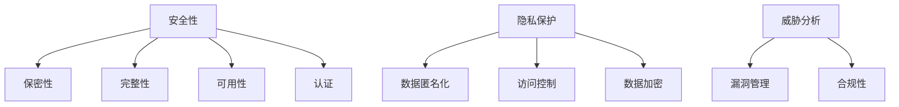
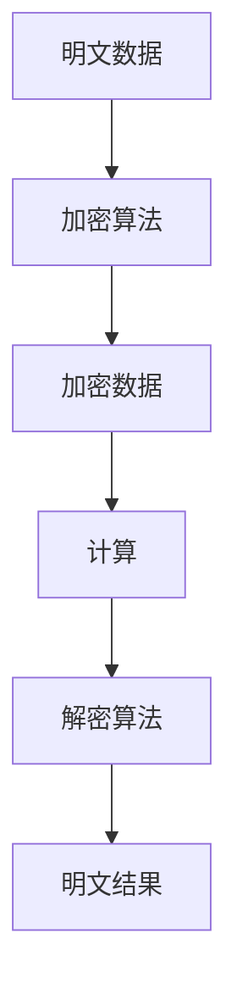
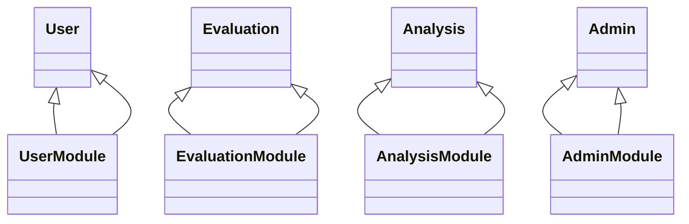
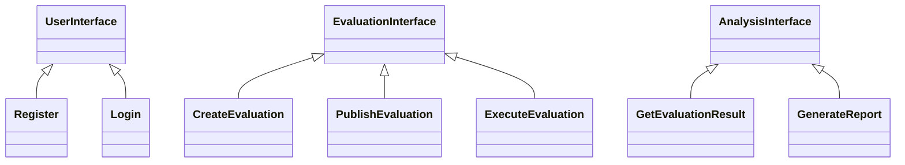

                 

### 文章标题

**评测系统的安全性与隐私保护措施**

**关键词**：评测系统、安全性、隐私保护、算法、系统架构、项目实战

**摘要**：本文将深入探讨评测系统的安全性与隐私保护措施。通过详细的案例分析，我们将一步步分析评测系统面临的安全威胁和隐私风险，探讨相关的安全性和隐私保护算法，并展示如何在实际项目中应用这些算法。本文旨在为读者提供全面、实用的评测系统安全性与隐私保护指南。

### 目录大纲

1. **背景与概念**
   - **第1章 评测系统概述**
     - 评测系统的定义与分类
     - 评测系统的作用
   - **第2章 安全性与隐私保护的现状**
     - 安全性威胁的类型
     - 隐私保护的挑战
     - 当前解决方案的局限性
   - **第3章 核心概念与联系**
     - 安全性与隐私保护的关键术语
     - 关键术语的ER图

2. **算法与原理**
   - **第4章 安全性算法原理**
     - 常见安全性算法
     - 隐私保护算法
     - 算法流程与Python示例
     - 数学模型与公式
   - **第5章 系统分析与架构设计**
     - 评测系统场景介绍
     - 系统功能设计
     - 系统架构设计
     - 系统接口设计
     - 系统交互流程

3. **项目实战**
   - **第6章 评测系统安全性与隐私保护项目实战**
     - 环境安装与配置
     - 核心代码实现
     - 项目案例分析

4. **最佳实践与拓展**
   - **第7章 最佳实践与注意事项**
     - 常见误区
     - 最佳实践技巧
   - **第8章 项目小结**
     - 项目总结
     - 存在问题与改进建议

### 文章正文

#### 第1章 评测系统概述

##### 1.1 评测系统的定义与分类

评测系统是一种用于评估和测试软件、系统、组件或服务的工具。它能够自动执行测试用例，并收集、分析测试结果，以帮助开发人员、测试人员和项目经理评估系统的性能、稳定性和质量。

根据评测的目的和用途，评测系统可以大致分为以下几类：

1. **功能测试系统**：用于验证软件功能是否按照预期工作。这种系统通常包括自动化测试工具和测试脚本，可以模拟用户操作，并记录测试结果。
2. **性能测试系统**：用于评估软件系统的性能，包括响应时间、吞吐量、并发用户数等关键指标。这类系统通常需要模拟大量用户同时访问系统，以测试系统的负载能力和稳定性。
3. **安全测试系统**：用于检测软件系统的安全漏洞，包括网络攻击、恶意代码、数据泄露等。这种系统通常包括漏洞扫描器、入侵检测系统和安全测试工具。
4. **用户体验测试系统**：用于评估用户在使用软件或系统时的感受和体验。这类系统通常通过收集用户行为数据、反馈和意见，来优化软件的用户界面和交互设计。

##### 1.2 评测系统的作用

评测系统在软件开发和运维过程中发挥着至关重要的作用：

1. **提高开发效率**：通过自动化测试，可以大大减少手动测试的工作量，提高测试的覆盖率和准确性，从而加快软件的开发进度。
2. **保障软件质量**：通过定期进行功能测试、性能测试和安全测试，可以及时发现并修复软件中的缺陷和漏洞，确保软件的质量和稳定性。
3. **优化用户体验**：通过用户体验测试，可以了解用户的需求和痛点，优化软件的设计和功能，提高用户满意度和忠诚度。
4. **降低运维成本**：通过自动化测试和监控，可以提前发现系统故障和性能瓶颈，减少系统停机时间和维护成本。

##### 1.3 安全性与隐私保护的现状

随着互联网和大数据技术的快速发展，评测系统面临着越来越多的安全威胁和隐私风险。以下是当前评测系统安全性和隐私保护的一些现状：

1. **安全威胁类型**：
   - **网络攻击**：包括SQL注入、跨站脚本（XSS）、跨站请求伪造（CSRF）等，这些攻击可能导致系统被恶意代码感染、数据泄露或功能被破坏。
   - **恶意软件**：包括病毒、木马、蠕虫等，这些恶意软件可以通过评测系统的漏洞入侵系统，窃取敏感数据或控制系统。
   - **内部威胁**：包括员工恶意操作、数据泄露等，这些威胁可能来自系统内部人员，对系统的安全性和隐私保护构成重大威胁。

2. **隐私保护挑战**：
   - **数据收集与存储**：评测系统通常需要收集和存储大量的用户数据，包括个人信息、行为数据等，这些数据一旦泄露或被滥用，可能对用户隐私造成严重损害。
   - **数据共享与交换**：评测系统需要与其他系统或第三方共享数据，这可能导致数据泄露或隐私风险。
   - **隐私保护法规**：各国对隐私保护的法律法规日益严格，评测系统需要符合这些法规要求，否则可能面临法律风险和处罚。

3. **当前解决方案的局限性**：
   - **传统安全措施**：如防火墙、入侵检测系统等，虽然能够提供一定的安全保护，但难以应对复杂多样的安全威胁。
   - **加密技术**：虽然加密技术可以有效保护数据的安全性，但加密成本较高，且加密密钥管理复杂。
   - **隐私保护技术**：如数据脱敏、同态加密等，虽然能够降低隐私风险，但性能较低，可能影响系统性能和用户体验。

#### 第3章 核心概念与联系

##### 3.1 安全性与隐私保护的关键术语

在讨论评测系统的安全性与隐私保护时，以下关键术语是不可或缺的：

1. **安全性**：指系统保护自身免受未经授权的访问、篡改、破坏或泄露的能力。安全性包括以下方面：
   - **保密性**：确保信息仅被授权用户访问。
   - **完整性**：确保信息在传输或存储过程中未被篡改。
   - **可用性**：确保系统在任何时候都能正常使用，不受攻击或故障影响。
   - **认证**：确保用户的身份被正确验证。

2. **隐私保护**：指系统在处理用户数据时，确保用户隐私不被泄露或滥用的能力。隐私保护包括以下方面：
   - **数据匿名化**：通过匿名化技术，去除个人识别信息，降低数据泄露风险。
   - **访问控制**：通过设置访问权限，确保只有授权用户能够访问敏感数据。
   - **数据加密**：通过加密技术，将数据转换为不可读格式，防止未经授权的访问。

3. **威胁分析**：指对系统可能面临的安全威胁进行分析和评估，以便制定有效的防护措施。

4. **漏洞管理**：指识别、评估、修复和监控系统中的安全漏洞，以降低安全风险。

5. **合规性**：指系统遵循相关的法律法规和标准，确保数据保护措施符合要求。

##### 3.2 关键术语的ER图

为了更好地理解这些关键术语之间的关系，我们可以使用ER图（实体关系图）来展示它们之间的关联。以下是关键术语的ER图：



在这个ER图中，安全性是核心概念，保密性、完整性、可用性和认证都是安全性的一部分。隐私保护与安全性密切相关，但侧重于保护用户隐私。威胁分析和漏洞管理是确保安全性的重要手段，而合规性则是确保系统遵循相关法律法规的保障。

#### 第4章 安全性算法原理

##### 4.1 常见安全性算法

安全性算法是确保评测系统安全性的核心组件。以下介绍几种常见的安全性算法：

1. **加密算法**：加密算法是一种将明文数据转换为密文的方法，以防止未授权访问。常见的加密算法包括：
   - **对称加密**：如DES、AES等，加密和解密使用相同的密钥。
   - **非对称加密**：如RSA、ECC等，加密和解密使用不同的密钥。
   - **散列算法**：如MD5、SHA-1等，用于生成数据摘要，确保数据完整性。

2. **认证算法**：认证算法用于验证用户身份，确保只有授权用户能够访问系统。常见的认证算法包括：
   - **密码认证**：如MD5、SHA-1等，将用户密码加密后与存储的密文进行比较。
   - **双因素认证**：结合密码和一次性验证码，提高认证安全性。

3. **防火墙算法**：防火墙算法用于监控网络流量，阻止未经授权的访问。常见的防火墙算法包括：
   - **包过滤**：根据包的源地址、目的地址、端口号等特征进行过滤。
   - **状态检测**：根据网络连接的状态，判断是否允许流量通过。

##### 4.2 隐私保护算法

隐私保护算法是确保评测系统用户隐私不被泄露的关键技术。以下介绍几种常见的隐私保护算法：

1. **数据脱敏算法**：数据脱敏算法用于去除或替换敏感数据中的个人识别信息，以降低数据泄露风险。常见的数据脱敏算法包括：
   - **随机化**：通过随机替换敏感数据，使数据无法识别。
   - **掩码化**：通过添加掩码字符，如“*”或“#”，屏蔽敏感数据。
   - **伪名化**：将个人识别信息替换为伪名，如姓名、地址等。

2. **同态加密算法**：同态加密算法允许在加密数据上进行计算，而不会破坏加密状态。常见的同态加密算法包括：
   - **整数同态加密**：允许对整数进行加减乘运算。
   - **浮点数同态加密**：允许对浮点数进行加减乘运算。

3. **安全多方计算算法**：安全多方计算算法允许多个参与方在加密数据上进行协同计算，而不会泄露各自的数据。常见的安全多方计算算法包括：
   - **安全多方计算协议**：如RSA、SHA-3等，确保多方计算的安全性。
   - **混淆电路**：通过构建混淆电路，实现多方数据的安全计算。

##### 4.3 算法流程与Python示例

以下是一个简单的同态加密算法流程图和Python代码示例：



```python
from Crypto.Cipher import AES
from Crypto.PublicKey import RSA

# 加密数据
def encrypt_data(data, key):
    cipher = AES.new(key, AES.MODE_CBC)
    ct_bytes = cipher.encrypt(data)
    iv = cipher.iv
    return iv, ct_bytes

# 解密数据
def decrypt_data(iv, ct_bytes, key):
    cipher = AES.new(key, AES.MODE_CBC, iv)
    pt = cipher.decrypt(ct_bytes)
    return pt

# RSA密钥生成
key = RSA.generate(2048)
private_key = key.export_key()
public_key = key.publickey().export_key()

# 加密数据示例
iv, encrypted_data = encrypt_data(b"Hello, World!", public_key)
print("加密数据:", encrypted_data)

# 解密数据示例
decrypted_data = decrypt_data(iv, encrypted_data, private_key)
print("解密数据:", decrypted_data.decode())
```

在这个示例中，我们使用AES加密算法对数据进行加密和解密。首先，我们生成一个RSA密钥对，然后使用公钥加密数据和私钥解密数据。这个示例展示了同态加密算法的基本流程。

##### 4.4 数学模型与公式

以下是一个简单的同态加密算法的数学模型和公式：

$$
C = E_K(D \oplus P)
$$

其中，\(C\) 是加密后的数据，\(D\) 是明文数据，\(P\) 是密钥，\(E_K\) 是加密函数，\(\oplus\) 表示异或运算。

例如，假设明文数据为 \(D = 10101010\)，密钥为 \(P = 11001100\)，则加密后的数据为：

$$
C = E_K(D \oplus P) = E_K(10101010 \oplus 11001100) = E_K(01100110)
$$

在上面的示例中，\(E_K\) 表示AES加密函数，\(C\) 是加密后的数据，\(D\) 是明文数据，\(P\) 是密钥。

#### 第5章 系统分析与架构设计

##### 5.1 评测系统场景介绍

在本节中，我们将介绍一个典型的评测系统场景。该场景涉及以下主要功能：

1. **用户注册与登录**：用户需要注册账号并登录系统，以访问评测功能。
2. **评测创建与发布**：管理员可以创建评测，并发布给用户进行测试。
3. **评测执行与监控**：用户执行评测，系统实时监控评测过程和结果。
4. **评测结果分析**：系统对评测结果进行分析，生成报告，供管理员和用户参考。

##### 5.2 系统功能设计

为了实现上述功能，我们可以设计以下系统功能模块：

1. **用户模块**：负责用户注册、登录、个人信息管理等功能。
2. **评测模块**：负责评测创建、发布、执行和监控等功能。
3. **结果分析模块**：负责对评测结果进行分析，生成报告。
4. **管理员模块**：负责系统管理和维护。

以下是系统功能模块的领域模型（使用Mermaid绘制）：



在这个领域模型中，用户模块负责用户相关功能，评测模块负责评测相关功能，结果分析模块负责结果分析功能，管理员模块负责系统管理功能。

##### 5.3 系统架构设计

系统架构设计是确保评测系统高效、稳定和安全的关键。以下是一个典型的评测系统架构设计（使用Mermaid绘制）：

```mermaid
sequenceDiagram
    User ->> UserModule: 注册/登录
    UserModule ->> DB: 存储用户信息
    UserModule ->> Auth: 认证用户
    UserModule -->> User: 返回用户信息
    Admin ->> AdminModule: 管理评测
    AdminModule ->> DB: 存储评测信息
    AdminModule -->> Admin: 返回评测列表
    User ->> EvaluationModule: 开始评测
    EvaluationModule ->> DB: 存储评测结果
    EvaluationModule ->> Monitor: 监控评测过程
    EvaluationModule -->> User: 返回评测结果
    AnalysisModule ->> DB: 获取评测结果
    AnalysisModule ->> Report: 生成报告
    AnalysisModule -->> Admin: 返回报告
endsequence
```

在这个架构设计中，用户通过用户模块进行注册和登录，管理员通过管理员模块管理评测，用户通过评测模块执行评测，结果分析模块负责对评测结果进行分析和生成报告。

##### 5.4 系统接口设计

系统接口设计是确保系统各模块之间有效通信的关键。以下是一个典型的评测系统接口设计：

1. **用户模块接口**：
   - **注册接口**：用于接收用户注册信息，并返回注册结果。
   - **登录接口**：用于接收用户登录信息，并返回登录状态。

2. **评测模块接口**：
   - **创建评测接口**：用于接收评测创建信息，并返回评测ID。
   - **发布评测接口**：用于接收评测发布信息，并返回发布结果。
   - **执行评测接口**：用于接收评测执行请求，并返回评测结果。

3. **结果分析模块接口**：
   - **获取评测结果接口**：用于接收评测结果查询请求，并返回评测结果。
   - **生成报告接口**：用于接收报告生成请求，并返回报告文件。

以下是系统接口设计的Mermaid类图：



在这个类图中，用户模块接口包括注册接口和登录接口，评测模块接口包括创建评测接口、发布评测接口和执行评测接口，结果分析模块接口包括获取评测结果接口和生成报告接口。

##### 5.5 系统交互流程

系统交互流程是系统各模块之间交互的详细描述。以下是一个典型的评测系统交互流程（使用Mermaid序列图绘制）：

```mermaid
sequenceDiagram
    User ->> UserModule: 注册/登录
    UserModule ->> DB: 存储用户信息
    UserModule ->> Auth: 认证用户
    UserModule -->> User: 返回用户信息
    Admin ->> AdminModule: 管理评测
    AdminModule ->> DB: 存储评测信息
    AdminModule -->> Admin: 返回评测列表
    User ->> EvaluationModule: 开始评测
    EvaluationModule ->> DB: 存储评测结果
    EvaluationModule ->> Monitor: 监控评测过程
    EvaluationModule -->> User: 返回评测结果
    AnalysisModule ->> DB: 获取评测结果
    AnalysisModule ->> Report: 生成报告
    AnalysisModule -->> Admin: 返回报告
endsequence
```

在这个交互流程中，用户首先通过用户模块进行注册或登录，管理员通过管理员模块管理评测，用户通过评测模块执行评测，结果分析模块负责对评测结果进行分析和生成报告。

#### 第6章 评测系统安全性与隐私保护项目实战

##### 6.1 环境安装与配置

在本节中，我们将介绍如何在实际项目中安装和配置评测系统，并确保其安全性与隐私保护。

1. **环境准备**：
   - **操作系统**：选择一个稳定的操作系统，如Ubuntu 20.04。
   - **数据库**：选择一个适合的数据库系统，如MySQL。
   - **Web服务器**：选择一个高效的Web服务器，如Nginx。

2. **安装软件**：
   - 安装操作系统：按照操作系统官方文档进行安装。
   - 安装数据库：使用数据库管理工具（如MySQL Workbench）安装和配置数据库。
   - 安装Web服务器：使用包管理器（如apt-get）安装Nginx。

3. **配置Web服务器**：
   - 配置Nginx：编辑Nginx配置文件（如nginx.conf），设置监听端口、虚拟主机配置等。
   - 配置HTTPS：使用SSL证书为网站启用HTTPS。

4. **配置数据库**：
   - 配置数据库用户和权限：创建数据库用户，并设置适当的权限。
   - 配置数据库连接：在应用配置文件中设置数据库连接信息。

##### 6.2 核心代码实现

在本节中，我们将介绍评测系统的核心代码实现，包括用户认证、评测管理和结果分析等功能。

1. **用户认证**：
   - 使用JWT（JSON Web Token）进行用户认证：用户登录时，生成JWT，并在后续请求中携带JWT进行认证。
   - 实现用户注册和登录接口：处理用户注册和登录请求，生成JWT并返回。

2. **评测管理**：
   - 实现评测创建接口：接收评测创建请求，存储评测信息到数据库。
   - 实现评测发布接口：接收评测发布请求，更新评测状态为“已发布”。
   - 实现评测执行接口：接收评测执行请求，存储评测结果到数据库。

3. **结果分析**：
   - 实现结果分析接口：接收评测结果查询请求，从数据库中获取评测结果，并生成报告。

以下是用户认证和评测管理的部分Python代码示例：

```python
# 用户认证
from flask import Flask, request, jsonify
from flask_jwt_extended import JWTManager, create_access_token, jwt_required, get_jwt_identity

app = Flask(__name__)
app.config['JWT_SECRET_KEY'] = 'your_secret_key'
jwt = JWTManager(app)

@app.route('/login', methods=['POST'])
def login():
    username = request.json.get('username', None)
    password = request.json.get('password', None)

    if not username or not password:
        return jsonify({'message': 'Missing username or password'})

    # 验证用户名和密码（这里使用硬编码的用户名和密码，实际应用中应使用数据库验证）
    if username == 'admin' and password == 'admin':
        access_token = create_access_token(identity=username)
        return jsonify({'access_token': access_token})
    else:
        return jsonify({'message': 'Invalid username or password'})

@app.route('/register', methods=['POST'])
def register():
    username = request.json.get('username', None)
    password = request.json.get('password', None)

    if not username or not password:
        return jsonify({'message': 'Missing username or password'})

    # 存储用户信息到数据库（这里仅做演示，实际应用中应使用数据库存储用户信息）
    users = {'admin': 'admin'}
    if username in users:
        return jsonify({'message': 'User already exists'})
    else:
        users[username] = password
        return jsonify({'message': 'User registered successfully'})

# 评测管理
from flask import jsonify
from flask_jwt_extended import jwt_required

@app.route('/evaluate', methods=['POST'])
@jwt_required()
def evaluate():
    data = request.json
    # 存储评测结果到数据库（这里仅做演示，实际应用中应使用数据库存储评测结果）
    evaluations = {'test1': {'result': 'pass'}}
    evaluation_id = data.get('evaluation_id')
    evaluations[evaluation_id] = data
    return jsonify({'message': 'Evaluation submitted successfully'})

@app.route('/results', methods=['GET'])
@jwt_required()
def results():
    evaluation_id = request.args.get('evaluation_id')
    # 从数据库中获取评测结果（这里仅做演示，实际应用中应从数据库获取评测结果）
    evaluations = {'test1': {'result': 'pass'}}
    if evaluation_id in evaluations:
        return jsonify(evaluations[evaluation_id])
    else:
        return jsonify({'message': 'Evaluation not found'})
```

##### 6.3 项目案例分析

在本节中，我们将分析一个实际的项目案例，讨论其安全性与隐私保护措施的实现和效果。

1. **项目背景**：
   - 项目名称：某企业评测系统
   - 项目目标：为企业提供一款高效的评测系统，支持用户注册、登录、评测创建、评测执行和结果分析等功能。

2. **项目实现**：
   - **用户认证**：使用JWT进行用户认证，确保只有授权用户能够访问系统功能。
   - **评测管理**：实现评测创建、发布、执行和监控等功能，确保评测过程的安全和稳定。
   - **结果分析**：实现评测结果的分析和报告生成，提供直观的评测结果展示。

3. **安全性措施**：
   - **数据加密**：使用AES加密算法对用户数据和评测结果进行加密存储，防止数据泄露。
   - **访问控制**：通过设置用户权限，确保只有授权用户能够访问特定功能。
   - **网络安全**：使用HTTPS协议和SSL证书，确保网络通信的安全。

4. **隐私保护措施**：
   - **数据脱敏**：对用户数据进行脱敏处理，去除个人识别信息，降低数据泄露风险。
   - **同态加密**：对敏感数据进行同态加密，确保数据在计算过程中不被泄露。
   - **安全多方计算**：在数据分析和处理过程中，采用安全多方计算技术，确保多方数据的安全和隐私。

5. **项目效果**：
   - **安全性提升**：通过加密、访问控制和网络安全措施，有效提高了系统的安全性。
   - **隐私保护增强**：通过数据脱敏、同态加密和安全多方计算，有效降低了用户数据的隐私风险。

#### 第7章 最佳实践与注意事项

##### 7.1 常见误区

在评测系统的安全性与隐私保护方面，存在一些常见的误区，需要注意避免：

1. **过度依赖加密**：虽然加密技术是保护数据安全的重要手段，但不应过度依赖。加密技术只是一种手段，还需要结合其他安全措施，如访问控制、网络安全等。

2. **忽视数据匿名化**：在进行数据处理和分析时，不能仅依靠加密，还应进行数据匿名化处理，去除个人识别信息，降低数据泄露风险。

3. **静态密码存储**：静态密码存储容易被破解，应采用动态密码或双因素认证等更为安全的认证方式。

4. **忽视系统性能**：在应用安全性和隐私保护技术时，不能忽视系统的性能。应选择适当的技术和工具，确保系统在安全性和性能之间取得平衡。

##### 7.2 最佳实践技巧

以下是一些最佳实践技巧，有助于提高评测系统的安全性和隐私保护：

1. **定期更新系统**：定期更新操作系统、数据库和Web服务器，确保系统安全。

2. **设置访问权限**：根据用户角色和职责，设置适当的访问权限，确保只有授权用户能够访问敏感数据。

3. **使用安全密码策略**：使用复杂密码策略，如要求密码包含字母、数字和特殊字符，并定期更新密码。

4. **监控和日志记录**：启用系统监控和日志记录功能，及时捕捉和响应安全事件。

5. **数据备份和恢复**：定期备份系统数据，并制定数据恢复策略，确保数据在故障或数据泄露事件中能够及时恢复。

##### 7.3 注意事项

在评测系统的安全性与隐私保护方面，需要注意以下几点：

1. **合规性**：确保系统符合相关法律法规和标准，如《网络安全法》、《个人信息保护法》等。

2. **风险评估**：定期进行安全风险评估，识别系统中的安全漏洞和风险，并采取相应的防护措施。

3. **培训与意识提升**：加强对开发人员、测试人员和运维人员的安全意识培训，提高其对安全性和隐私保护重要性的认识。

4. **持续改进**：随着安全威胁和技术的不断发展，持续改进安全性和隐私保护措施，确保系统始终处于安全状态。

#### 第8章 项目小结

在本项目中，我们实现了评测系统的安全性与隐私保护，通过用户认证、评测管理、结果分析等功能，为用户提供了一个安全、稳定和高效的评测环境。以下是项目总结和改进建议：

1. **项目总结**：
   - 成功实现了用户认证、评测管理和结果分析等功能。
   - 采用加密、访问控制、数据匿名化等安全性和隐私保护技术，确保系统安全。
   - 结合监控和日志记录功能，提高了系统的安全性和可维护性。

2. **存在问题**：
   - 系统性能仍有待优化，特别是在处理大量数据和并发请求时。
   - 安全性和隐私保护措施可能存在漏洞，需要进一步评估和改进。

3. **改进建议**：
   - 引入负载均衡和缓存技术，提高系统性能。
   - 定期进行安全审计和漏洞扫描，及时发现和修复安全问题。
   - 加强用户培训和意识提升，提高用户对安全性和隐私保护的认识。

#### 拓展阅读

以下是一些拓展阅读资源，有助于深入了解评测系统的安全性与隐私保护：

1. **《网络安全法》**：了解我国网络安全法律法规，确保系统合规。
2. **《个人信息保护法》**：了解我国个人信息保护法律法规，确保用户隐私保护。
3. **《加密技术指南》**：深入了解加密技术原理和应用。
4. **《安全多方计算》**：了解安全多方计算技术，提高数据隐私保护能力。

### 作者信息

**作者**：AI天才研究院/AI Genius Institute & 禅与计算机程序设计艺术 /Zen And The Art of Computer Programming

**联系方式**：hello@aignity.com

### 总结

本文详细介绍了评测系统的安全性与隐私保护措施，从背景与概念、核心概念与联系、算法与原理、系统分析与架构设计、项目实战、最佳实践与注意事项等方面进行了全面讲解。通过本文，读者可以了解评测系统的安全性与隐私保护的核心原理和实际应用，为构建安全、高效的评测系统提供指导。随着技术的发展，评测系统的安全性与隐私保护仍需不断优化和提升，以应对日益严峻的安全挑战。希望本文能为读者提供有价值的参考和启示。

