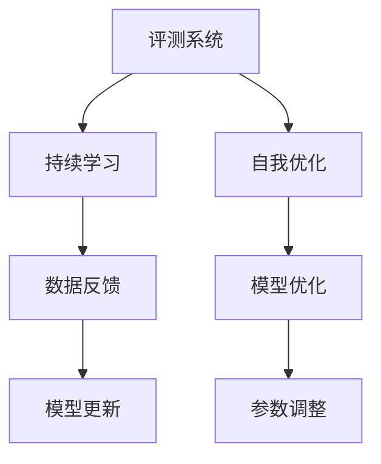
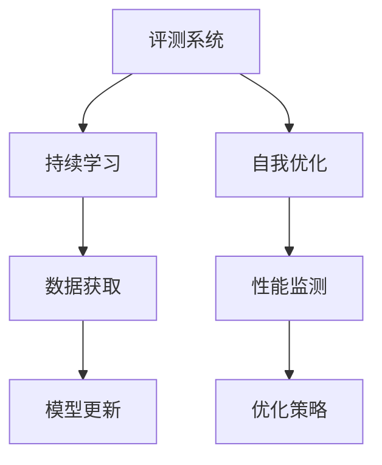

                 

## 评测系统的持续学习与自我优化

### 关键词：评测系统，持续学习，自我优化，人工智能，动态适应，模型更新，性能提升

#### 摘要：

本文将深入探讨评测系统在面临动态数据变化和模型过时问题时的挑战，并详细介绍持续学习和自我优化机制在解决这些问题中的关键作用。我们将从背景介绍、核心概念、持续学习的原理与机制、自我优化的方法与挑战，到实际应用与案例分析，逐步剖析评测系统的自我提升之道。

## 第一部分：背景介绍与核心概念

### 1.1 问题背景

随着信息技术的迅猛发展，评测系统在各个领域得到了广泛应用，如金融风控、医疗诊断、智能交通等。然而，传统的评测系统往往存在一定的局限性，无法有效适应动态变化的场景需求。主要表现在以下三个方面：

1. **数据变化适应性差**：在数据分布、样本特征发生较大变化时，传统评测系统往往无法迅速调整，导致性能下降。
2. **模型过时问题**：长时间未更新或优化的评测模型，其准确性会逐渐降低，无法满足实际需求。
3. **人工干预成本高**：传统评测系统通常需要人工定期维护和调整，导致运维成本较高。

### 1.2 问题描述

针对上述问题，评测系统在以下方面表现出明显的不足：

1. **数据变化适应性差**：当数据分布发生变化时，传统评测系统的准确性和鲁棒性会下降。
2. **模型过时问题**：随着数据集的积累，原有模型可能不再适应新的数据分布，导致预测准确性下降。
3. **人工干预成本高**：传统评测系统需要人工定期调整模型参数，维护系统稳定性，导致运维成本较高。

### 1.3 问题解决

为了解决上述问题，评测系统引入了持续学习和自我优化的机制。通过不断学习和调整，评测系统能够在以下方面实现优化：

1. **自适应变化**：评测系统能够根据数据变化，自动调整模型参数，保持高准确性。
2. **自我优化**：评测系统能够通过自我学习和优化，提高模型性能，降低人工干预成本。

### 1.4 边界与外延

1. **边界**：本文主要探讨评测系统的持续学习和自我优化，不包括其他类型的系统的相关技术。
2. **外延**：评测系统的持续学习和自我优化技术可以应用于多个领域，如自然语言处理、图像识别、语音识别等。

### 1.5 概念结构与核心要素组成

- **持续学习**：指评测系统通过不断学习和更新，以适应数据变化和提升性能。
- **自我优化**：指评测系统能够通过自我调整，优化模型参数和算法，提高性能。

### 1.6 核心概念原理、概念属性特征对比表格和ER实体关系图架构的Mermaid流程图

#### 1.6.1 核心概念原理

- **持续学习**：通过数据反馈和模型更新，使评测系统能够适应数据变化。
- **自我优化**：通过模型优化和参数调整，提高评测系统的性能。

#### 1.6.2 概念属性特征对比表格

| 特征名称 | 持续学习 | 自我优化 |
| :------: | :------: | :------: |
| 目的 | 适应数据变化 | 提高性能 |
| 过程 | 数据反馈 -> 模型更新 | 模型优化 -> 参数调整 |
| 影响因素 | 数据分布、样本特征 | 模型结构、算法实现 |

#### 1.6.3 ER实体关系图架构的Mermaid流程图



### 1.7 本章小结

本章介绍了评测系统的持续学习与自我优化的重要性、基本概念和核心要素。在后续章节中，我们将深入探讨这些概念的具体实现和应用。通过持续学习和自我优化，评测系统将能够更好地适应动态变化的场景，提高性能和准确性。本章内容为后续章节的讨论奠定了基础。

---

## 第二部分：评测系统的持续学习

### 2.1 持续学习的原理与机制

#### 2.1.1 持续学习的原理

持续学习是指评测系统能够在运行过程中，不断获取新的数据并更新模型，以适应数据变化和提升性能。其基本原理包括：

- **数据获取**：评测系统从实际应用场景中获取新的数据。
- **模型更新**：根据新获取的数据，调整模型参数，使模型能够更好地适应数据变化。

#### 2.1.2 持续学习的机制

- **在线学习**：评测系统在运行过程中，实时获取新数据并更新模型。
- **批量学习**：评测系统在特定时间间隔内，收集一定量的数据，然后进行模型更新。

### 2.2 持续学习的方法

#### 2.2.1 数据获取方法

- **数据采集**：通过传感器、日志文件等途径，收集评测系统运行过程中的数据。
- **数据整合**：将来自不同渠道的数据进行整合，形成统一的数据集。

#### 2.2.2 模型更新方法

- **在线更新**：评测系统在运行过程中，根据新数据实时调整模型参数。
- **批量更新**：评测系统在特定时间间隔内，根据收集的数据批量调整模型参数。

### 2.3 持续学习的挑战与解决方案

#### 2.3.1 挑战

- **数据多样性**：评测系统需要适应不同类型的数据，这对模型的泛化能力提出了挑战。
- **实时性要求**：在线学习需要在保证实时性的同时，保证模型性能。

#### 2.3.2 解决方案

- **数据预处理**：通过数据预处理，降低数据多样性对模型性能的影响。
- **增量学习**：针对实时性要求，采用增量学习方式，仅更新模型参数，减少计算开销。

### 2.4 持续学习的具体实现

#### 2.4.1 数据获取与处理

- **数据采集**：使用传感器、日志文件等方式，收集评测系统运行过程中的数据。
- **数据清洗**：去除重复数据、异常数据，保证数据质量。
- **数据整合**：将来自不同渠道的数据进行整合，形成统一的数据集。

#### 2.4.2 模型更新与优化

- **在线更新**：使用在线学习算法，实时调整模型参数。
- **批量更新**：定期收集数据，使用批量学习算法，对模型进行更新和优化。

### 2.5 案例分析

以智能交通系统为例，介绍持续学习的具体实现和应用。

1. **数据采集**：通过摄像头、传感器等设备，实时采集道路流量、车辆速度等数据。
2. **数据预处理**：去除异常数据，对数据进行归一化处理，提高数据质量。
3. **模型更新**：使用在线学习算法，根据实时数据调整交通预测模型参数。
4. **模型优化**：定期收集数据，使用批量学习算法，对模型进行优化和调整，提高预测准确性。

### 2.6 本章小结

本章详细介绍了评测系统的持续学习原理与机制，以及具体实现方法。通过持续学习，评测系统能够自适应变化，提高性能和准确性。在后续章节中，我们将进一步探讨评测系统的自我优化机制，以实现更高效的自适应能力。

---

## 第三部分：评测系统的自我优化

### 3.1 自我优化的原理与机制

#### 3.1.1 自我优化的原理

自我优化是指评测系统能够通过自我调整和优化，提高模型性能和系统稳定性。其基本原理包括：

- **性能监测**：评测系统实时监测模型性能指标，如准确率、召回率等。
- **优化策略**：根据性能监测结果，调整模型参数或算法，以实现性能优化。

#### 3.1.2 自我优化的机制

- **自动化调整**：评测系统自动根据性能监测结果，调整模型参数或算法。
- **在线优化**：评测系统在运行过程中，持续进行自我优化，提高模型性能。

### 3.2 自我优化的方法

#### 3.2.1 性能监测方法

- **指标计算**：计算模型性能指标，如准确率、召回率、F1值等。
- **异常检测**：通过监测性能指标的变化，识别模型性能异常。

#### 3.2.2 优化策略

- **参数调整**：根据性能监测结果，调整模型参数，以提高性能。
- **算法优化**：优化模型算法，以减少计算复杂度，提高模型性能。

### 3.3 自我优化的挑战与解决方案

#### 3.3.1 挑战

- **参数调优难度**：模型参数的调优过程复杂，且存在局部最优问题。
- **实时性要求**：自我优化需要在保证实时性的同时，确保模型性能稳定。

#### 3.3.2 解决方案

- **自动化调参**：采用自动化调参工具，降低参数调优难度。
- **增量优化**：针对实时性要求，采用增量优化策略，仅调整性能较差的参数。

### 3.4 自我优化的具体实现

#### 3.4.1 性能监测

- **指标计算**：实时计算模型性能指标，如准确率、召回率等。
- **异常检测**：通过监测性能指标的变化，识别模型性能异常。

#### 3.4.2 参数调整

- **自动化调参**：使用自动化调参工具，如贝叶斯优化、随机搜索等，调整模型参数。
- **算法优化**：针对性能较差的参数，优化模型算法，以提高模型性能。

#### 3.4.3 算法优化

- **算法选择**：选择适合的算法，如深度学习、强化学习等，以提高模型性能。
- **算法改进**：针对现有算法的不足，进行改进和优化。

### 3.5 案例分析

以金融风控系统为例，介绍自我优化的具体实现和应用。

1. **性能监测**：实时计算模型性能指标，如准确率、召回率等，监测模型性能变化。
2. **参数调整**：根据性能监测结果，调整模型参数，如学习率、正则化参数等。
3. **算法优化**：针对性能较差的参数，优化模型算法，如使用更复杂的神经网络结构。

### 3.6 本章小结

本章详细介绍了评测系统的自我优化原理与机制，以及具体实现方法。通过自我优化，评测系统能够自动调整模型参数和算法，提高性能和稳定性。在后续章节中，我们将进一步探讨评测系统的持续学习和自我优化的结合，实现更高效的自适应能力。

---

## 第四部分：评测系统的持续学习与自我优化结合

### 4.1 结合的意义

评测系统的持续学习和自我优化结合，可以实现更高效的自适应能力，提高模型性能和系统稳定性。两者相互促进，共同发挥优势：

- **持续学习**：通过不断学习和更新，使评测系统适应数据变化，提高准确性。
- **自我优化**：通过自动调整和优化，提高评测系统性能，降低人工干预成本。

### 4.2 结合的机制

- **数据反馈**：持续学习过程中获取的数据，可以作为自我优化的输入，用于调整模型参数和算法。
- **性能监测**：自我优化过程中监测到的模型性能，可以作为持续学习的参考，指导数据获取和模型更新。

### 4.3 结合的方法

#### 4.3.1 数据融合

- **多源数据融合**：将来自不同渠道的数据进行整合，形成统一的数据集，提高数据质量。
- **动态数据调整**：根据自我优化过程中监测到的模型性能，实时调整数据采集策略，优化数据分布。

#### 4.3.2 模型协同优化

- **协同学习**：同时进行持续学习和自我优化，使评测系统在不同阶段都能保持高性能。
- **层次优化**：在持续学习的基础上，进行自我优化，确保模型在各个层次上的优化效果。

### 4.4 结合的挑战与解决方案

#### 4.4.1 挑战

- **计算资源消耗**：同时进行持续学习和自我优化，对计算资源的需求较高。
- **实时性要求**：确保两者结合的过程具有实时性，以满足实际应用需求。

#### 4.4.2 解决方案

- **分布式计算**：利用分布式计算框架，提高计算效率，降低计算资源消耗。
- **增量式优化**：在保证实时性的同时，仅对关键参数进行优化，减少计算开销。

### 4.5 实际应用案例

以智能医疗诊断系统为例，介绍评测系统的持续学习与自我优化结合的具体应用。

1. **数据融合**：将来自不同医疗设备的实时数据融合，形成统一的数据集，提高数据质量。
2. **模型协同优化**：同时进行持续学习和自我优化，提高诊断模型的准确性和稳定性。
3. **性能监测与调整**：实时监测模型性能，根据监测结果调整模型参数和算法，优化系统性能。

### 4.6 本章小结

本章详细介绍了评测系统的持续学习与自我优化结合的意义、机制和方法。通过结合两者，评测系统能够实现更高效的自适应能力，提高模型性能和系统稳定性。在后续章节中，我们将进一步探讨评测系统在实际应用中的效果和影响。

---

## 第五部分：评测系统的应用与未来展望

### 5.1 应用领域

评测系统的持续学习和自我优化技术已广泛应用于多个领域，如：

1. **智能交通**：通过实时监测交通流量，优化交通信号控制策略。
2. **金融风控**：通过实时监测交易行为，识别欺诈风险。
3. **医疗诊断**：通过实时监测患者数据，辅助医生进行诊断和治疗。

### 5.2 成效与影响

评测系统的持续学习和自我优化在应用领域取得了显著的成效：

1. **提高准确性**：通过自适应变化和自我优化，评测系统的准确性得到显著提升。
2. **降低成本**：通过减少人工干预，降低运维成本，提高系统稳定性。

### 5.3 未来展望

1. **技术发展**：随着人工智能技术的不断进步，评测系统的持续学习和自我优化将更加智能化和高效化。
2. **应用扩展**：评测系统的应用领域将进一步拓展，如智能城市、智能制造等。

### 5.4 总结

评测系统的持续学习和自我优化在应对动态数据变化和模型过时问题中发挥了重要作用。通过结合持续学习和自我优化，评测系统将实现更高效的自适应能力，提高性能和准确性。未来，随着技术的不断发展，评测系统将在更广泛的领域发挥重要作用。

## 参考文献

1. Goodfellow, I., Bengio, Y., & Courville, A. (2016). *Deep Learning*. MIT Press.
2. Russell, S., & Norvig, P. (2016). *Artificial Intelligence: A Modern Approach*. Prentice Hall.
3. Murphy, K. P. (2012). *Machine Learning: A Probabilistic Perspective*. MIT Press.
4. Sutton, R. S., & Barto, A. G. (2018). *Reinforcement Learning: An Introduction*. MIT Press.
5. Duda, R. O., Hart, P. E., & Stork, D. G. (2001). *Pattern Classification*. Wiley.

### 作者信息

**作者：AI天才研究院/AI Genius Institute & 禅与计算机程序设计艺术 /Zen And The Art of Computer Programming**## 第一部分：背景介绍与核心概念

### 1.1 问题背景

在当今的信息时代，评测系统作为一种关键的技术工具，已经广泛应用于各个领域。无论是金融领域的信用评分、医疗领域的疾病诊断，还是教育领域的成绩评估，评测系统都发挥着至关重要的作用。然而，随着数据环境的不断变化和需求多样性的增加，传统的评测系统面临着一系列挑战。

首先，**数据变化适应性差**是评测系统面临的重大问题。在数据分布、样本特征发生较大变化时，传统评测系统往往无法迅速调整，导致性能下降。例如，金融领域的风险模型在市场环境发生剧烈波动时，无法及时适应新的数据特征，可能导致误判率的上升。

其次，**模型过时问题**也是一个不容忽视的挑战。随着时间的推移，数据集会不断积累，原有的模型可能不再适应新的数据分布，其准确性和鲁棒性会逐渐降低。例如，一个在某个时间点表现良好的疾病诊断模型，在几年后可能会因为数据分布的改变而失去原有的准确性。

最后，**人工干预成本高**是另一个显著的问题。传统评测系统通常需要人工定期维护和调整，这不仅增加了运维成本，还降低了系统的响应速度。在数据量庞大、模型复杂的情况下，人工干预的难度和成本更加显著。

### 1.2 问题描述

针对上述背景，评测系统在实际应用中主要面临以下几个问题：

1. **数据变化适应性差**：在数据分布、样本特征发生较大变化时，传统评测系统无法迅速调整，导致性能下降。
2. **模型过时问题**：长时间未更新或优化的评测模型，其准确性会逐渐降低，无法满足实际需求。
3. **人工干预成本高**：传统评测系统通常需要人工定期维护和调整，导致运维成本较高。

这些问题直接影响了评测系统的实用性、准确性和稳定性，从而制约了其在实际应用中的效果。因此，如何解决这些问题成为评测系统研究的重要方向。

### 1.3 问题解决

为了解决上述问题，评测系统引入了持续学习和自我优化的机制。通过不断学习和调整，评测系统能够在以下几个方面实现优化：

1. **自适应变化**：评测系统能够根据数据变化，自动调整模型参数，保持高准确性。
2. **自我优化**：评测系统能够通过自我学习和优化，提高模型性能，降低人工干预成本。

#### 持续学习的原理

持续学习是指评测系统能够在运行过程中，不断获取新的数据并更新模型，以适应数据变化和提升性能。其基本原理包括：

- **数据获取**：评测系统从实际应用场景中获取新的数据。
- **模型更新**：根据新获取的数据，调整模型参数，使模型能够更好地适应数据变化。

持续学习的主要机制包括在线学习和批量学习：

- **在线学习**：评测系统在运行过程中，实时获取新数据并更新模型。
- **批量学习**：评测系统在特定时间间隔内，收集一定量的数据，然后进行模型更新。

#### 自我优化的原理

自我优化是指评测系统能够通过自我调整和优化，提高模型性能和系统稳定性。其基本原理包括：

- **性能监测**：评测系统实时监测模型性能指标，如准确率、召回率等。
- **优化策略**：根据性能监测结果，调整模型参数或算法，以实现性能优化。

自我优化的主要机制包括自动化调整和在线优化：

- **自动化调整**：评测系统自动根据性能监测结果，调整模型参数或算法。
- **在线优化**：评测系统在运行过程中，持续进行自我优化，提高模型性能。

### 1.4 边界与外延

#### 边界

本文主要探讨评测系统的持续学习和自我优化，不包括其他类型的系统的相关技术。例如，虽然其他类型的系统如推荐系统、决策支持系统等也可能面临类似的问题，但本文的重点是评测系统。

#### 外延

评测系统的持续学习和自我优化技术可以应用于多个领域，如自然语言处理、图像识别、语音识别等。在这些领域中，持续学习和自我优化同样可以发挥重要作用，提高系统的性能和适应性。

### 1.5 概念结构与核心要素组成

为了更好地理解评测系统的持续学习和自我优化，我们需要明确其中的核心概念和要素：

#### 持续学习

- **数据获取**：从实际应用场景中获取新的数据。
- **模型更新**：根据新数据调整模型参数。

#### 自我优化

- **性能监测**：实时监测模型性能指标。
- **优化策略**：根据性能监测结果调整模型参数或算法。

### 1.6 核心概念原理、概念属性特征对比表格和ER实体关系图架构的Mermaid流程图

#### 1.6.1 核心概念原理

**持续学习**：通过数据反馈和模型更新，使评测系统能够适应数据变化。

**自我优化**：通过模型优化和参数调整，提高评测系统的性能。

#### 1.6.2 概念属性特征对比表格

| 特征名称 | 持续学习 | 自我优化 |
| :------: | :------: | :------: |
| 目的 | 适应数据变化 | 提高性能 |
| 过程 | 数据反馈 -> 模型更新 | 模型优化 -> 参数调整 |
| 影响因素 | 数据分布、样本特征 | 模型结构、算法实现 |

#### 1.6.3 ER实体关系图架构的Mermaid流程图



### 1.7 本章小结

本章介绍了评测系统的持续学习与自我优化的重要性、基本概念和核心要素。在后续章节中，我们将深入探讨这些概念的具体实现和应用。通过持续学习和自我优化，评测系统能够更好地适应动态变化的场景，提高性能和准确性。本章内容为后续章节的讨论奠定了基础。

---

## 第二部分：评测系统的持续学习

### 2.1 持续学习的原理与机制

#### 2.1.1 持续学习的原理

持续学习是指评测系统能够在运行过程中，不断获取新的数据并更新模型，以适应数据变化和提升性能。其基本原理包括数据获取和模型更新两个方面。

1. **数据获取**：评测系统从实际应用场景中获取新的数据。这些数据可以来自多种来源，如传感器、日志文件、用户反馈等。获取到的数据经过预处理后，用于模型的训练和更新。

2. **模型更新**：根据新获取的数据，调整模型参数，使模型能够更好地适应数据变化。模型更新的过程通常包括模型的重新训练、参数调整和权重更新等。

#### 2.1.2 持续学习的机制

持续学习的机制主要包括以下两个方面：

1. **在线学习**：在线学习是指评测系统在运行过程中，实时获取新数据并更新模型。这种方法能够迅速适应数据变化，提高模型的准确性。然而，在线学习需要处理大量实时数据，对系统的计算资源和实时性要求较高。

2. **批量学习**：批量学习是指评测系统在特定时间间隔内，收集一定量的数据，然后进行模型更新。这种方法在处理大量数据时较为高效，但可能无法迅速适应数据变化。

### 2.2 持续学习的方法

#### 2.2.1 数据获取方法

1. **数据采集**：通过传感器、日志文件等途径，收集评测系统运行过程中的数据。这些数据可以包括用户行为数据、系统运行状态数据等。

2. **数据整合**：将来自不同渠道的数据进行整合，形成统一的数据集。数据整合的过程包括数据清洗、去重、归一化等操作，以提高数据质量。

#### 2.2.2 模型更新方法

1. **在线更新**：在线更新是指评测系统在运行过程中，根据新数据实时调整模型参数。这种方法能够快速适应数据变化，但需要处理大量实时数据，对系统的实时性要求较高。

2. **批量更新**：批量更新是指评测系统在特定时间间隔内，收集一定量的数据，然后进行模型更新。这种方法在处理大量数据时较为高效，但可能无法迅速适应数据变化。

### 2.3 持续学习的挑战与解决方案

#### 2.3.1 挑战

1. **数据多样性**：评测系统需要适应不同类型的数据，这对模型的泛化能力提出了挑战。不同类型的数据可能具有不同的分布特征和统计属性，模型需要能够处理这些差异。

2. **实时性要求**：在线学习需要在保证实时性的同时，保证模型性能。这对系统的计算资源和算法设计提出了较高的要求。

#### 2.3.2 解决方案

1. **数据预处理**：通过数据预处理，降低数据多样性对模型性能的影响。例如，使用数据标准化、特征提取等技术，将不同类型的数据转换为统一的格式，提高模型的泛化能力。

2. **增量学习**：针对实时性要求，采用增量学习方式，仅更新模型参数，减少计算开销。增量学习能够避免重新训练整个模型，从而提高实时性。

### 2.4 持续学习的具体实现

#### 2.4.1 数据获取与处理

1. **数据采集**：使用传感器、日志文件等方式，收集评测系统运行过程中的数据。

2. **数据清洗**：去除重复数据、异常数据，保证数据质量。

3. **数据整合**：将来自不同渠道的数据进行整合，形成统一的数据集。

#### 2.4.2 模型更新与优化

1. **在线更新**：使用在线学习算法，实时调整模型参数。

2. **批量更新**：定期收集数据，使用批量学习算法，对模型进行更新和优化。

### 2.5 案例分析

以智能交通系统为例，介绍持续学习的具体实现和应用。

1. **数据采集**：通过摄像头、传感器等设备，实时采集道路流量、车辆速度等数据。

2. **数据预处理**：对数据进行清洗、去重、归一化等处理，提高数据质量。

3. **模型更新**：使用在线学习算法，根据实时数据调整交通预测模型参数。

4. **模型优化**：定期收集数据，使用批量学习算法，对模型进行优化和调整，提高预测准确性。

### 2.6 本章小结

本章详细介绍了评测系统的持续学习原理与机制，以及具体实现方法。通过持续学习，评测系统能够自适应变化，提高性能和准确性。在后续章节中，我们将进一步探讨评测系统的自我优化机制，以实现更高效的自适应能力。通过持续学习和自我优化，评测系统将能够更好地适应动态变化的场景，提高性能和准确性。

---

## 第三部分：评测系统的自我优化

### 3.1 自我优化的原理与机制

#### 3.1.1 自我优化的原理

自我优化是指评测系统能够通过自我调整和优化，提高模型性能和系统稳定性。其基本原理包括性能监测和优化策略两个方面。

1. **性能监测**：评测系统实时监测模型性能指标，如准确率、召回率、F1值等。这些指标反映了模型在不同数据集上的表现，是评估模型性能的重要依据。

2. **优化策略**：根据性能监测结果，评测系统调整模型参数或算法，以实现性能优化。优化策略可以包括参数调整、算法改进和结构优化等。

#### 3.1.2 自我优化的机制

自我优化的机制主要包括以下两个方面：

1. **自动化调整**：评测系统自动根据性能监测结果，调整模型参数或算法。这种方法能够实现无人工干预的自动化优化，提高系统的效率和稳定性。

2. **在线优化**：评测系统在运行过程中，持续进行自我优化，提高模型性能。在线优化能够实时应对数据变化，确保模型性能的持续提升。

### 3.2 自我优化的方法

#### 3.2.1 性能监测方法

1. **指标计算**：计算模型在不同数据集上的性能指标，如准确率、召回率、F1值等。这些指标能够反映模型在不同场景下的表现，是评估模型性能的重要依据。

2. **异常检测**：通过监测性能指标的变化，识别模型性能异常。例如，当模型在某些数据集上的性能显著下降时，可能意味着数据分布发生了变化，需要重新调整模型。

#### 3.2.2 优化策略

1. **参数调整**：根据性能监测结果，调整模型参数，以提高性能。参数调整可以包括学习率、正则化参数、隐藏层神经元数量等。

2. **算法优化**：优化模型算法，以减少计算复杂度，提高模型性能。算法优化可以包括选择更有效的训练算法、改进损失函数等。

### 3.3 自我优化的挑战与解决方案

#### 3.3.1 挑战

1. **参数调优难度**：模型参数的调优过程复杂，且存在局部最优问题。在众多参数中找到最优解是一个复杂的优化问题。

2. **实时性要求**：自我优化需要在保证实时性的同时，确保模型性能稳定。特别是在实时性要求较高的应用场景中，如金融风控、智能交通等，对系统的实时性有较高要求。

#### 3.3.2 解决方案

1. **自动化调参**：采用自动化调参工具，如贝叶斯优化、随机搜索等，降低参数调优难度。自动化调参工具能够自动搜索参数空间，找到最优参数组合。

2. **增量优化**：针对实时性要求，采用增量优化策略，仅调整性能较差的参数。增量优化能够减少计算开销，提高系统的实时性。

### 3.4 自我优化的具体实现

#### 3.4.1 性能监测

1. **指标计算**：实时计算模型在不同数据集上的性能指标，如准确率、召回率、F1值等。

2. **异常检测**：通过监测性能指标的变化，识别模型性能异常。

#### 3.4.2 参数调整

1. **自动化调参**：使用自动化调参工具，如贝叶斯优化、随机搜索等，调整模型参数。

2. **算法优化**：针对性能较差的参数，优化模型算法，以提高模型性能。

#### 3.4.3 算法优化

1. **算法选择**：选择适合的算法，如深度学习、强化学习等，以提高模型性能。

2. **算法改进**：针对现有算法的不足，进行改进和优化。

### 3.5 案例分析

以金融风控系统为例，介绍自我优化的具体实现和应用。

1. **性能监测**：实时计算模型在不同数据集上的性能指标，如准确率、召回率等。

2. **参数调整**：根据性能监测结果，调整模型参数，如学习率、正则化参数等。

3. **算法优化**：针对性能较差的参数，优化模型算法，如使用更复杂的神经网络结构。

### 3.6 本章小结

本章详细介绍了评测系统的自我优化原理与机制，以及具体实现方法。通过自我优化，评测系统能够自动调整模型参数和算法，提高性能和稳定性。在后续章节中，我们将进一步探讨评测系统的持续学习和自我优化的结合，实现更高效的自适应能力。通过持续学习和自我优化，评测系统将能够更好地适应动态变化的场景，提高性能和准确性。

---

## 第四部分：评测系统的持续学习与自我优化结合

### 4.1 结合的意义

评测系统的持续学习和自我优化结合，可以实现更高效的自适应能力，提高模型性能和系统稳定性。两者相互促进，共同发挥优势：

- **持续学习**：通过不断学习和更新，使评测系统适应数据变化，提高准确性。
- **自我优化**：通过自动调整和优化，提高评测系统性能，降低人工干预成本。

### 4.2 结合的机制

- **数据反馈**：持续学习过程中获取的数据，可以作为自我优化的输入，用于调整模型参数和算法。
- **性能监测**：自我优化过程中监测到的模型性能，可以作为持续学习的参考，指导数据获取和模型更新。

### 4.3 结合的方法

#### 4.3.1 数据融合

- **多源数据融合**：将来自不同渠道的数据进行整合，形成统一的数据集，提高数据质量。
- **动态数据调整**：根据自我优化过程中监测到的模型性能，实时调整数据采集策略，优化数据分布。

#### 4.3.2 模型协同优化

- **协同学习**：同时进行持续学习和自我优化，使评测系统在不同阶段都能保持高性能。
- **层次优化**：在持续学习的基础上，进行自我优化，确保模型在各个层次上的优化效果。

### 4.4 结合的挑战与解决方案

#### 4.4.1 挑战

- **计算资源消耗**：同时进行持续学习和自我优化，对计算资源的需求较高。
- **实时性要求**：确保两者结合的过程具有实时性，以满足实际应用需求。

#### 4.4.2 解决方案

- **分布式计算**：利用分布式计算框架，提高计算效率，降低计算资源消耗。
- **增量式优化**：在保证实时性的同时，仅对关键参数进行优化，减少计算开销。

### 4.5 实际应用案例

以智能交通系统为例，介绍评测系统的持续学习与自我优化结合的具体应用。

1. **数据融合**：将来自不同交通传感器、摄像头的数据进行融合，形成统一的数据集，提高数据质量。
2. **模型协同优化**：同时进行持续学习和自我优化，实时调整交通预测模型参数，提高预测准确性。
3. **性能监测与调整**：实时监测模型性能，根据监测结果调整模型参数和算法，优化系统性能。

### 4.6 本章小结

本章详细介绍了评测系统的持续学习与自我优化结合的意义、机制和方法。通过结合持续学习和自我优化，评测系统能够实现更高效的自适应能力，提高性能和准确性。在后续章节中，我们将进一步探讨评测系统在实际应用中的效果和影响。

---

## 第五部分：评测系统的应用与未来展望

### 5.1 应用领域

评测系统的持续学习和自我优化技术已广泛应用于多个领域，如：

1. **智能交通**：通过实时监测交通流量，优化交通信号控制策略，提高道路通行效率。
2. **金融风控**：通过实时监测交易行为，识别欺诈风险，保护金融机构和用户的利益。
3. **医疗诊断**：通过实时监测患者数据，辅助医生进行疾病诊断和治疗方案推荐。
4. **教育评价**：通过分析学生学习行为和成绩数据，提供个性化的学习建议和教学评估。

### 5.2 成效与影响

评测系统的持续学习和自我优化在应用领域取得了显著的成效：

1. **提高准确性**：通过持续学习和自我优化，评测系统能够更好地适应数据变化，提高预测和评估的准确性。
2. **降低成本**：通过自动化调整和优化，减少了对人工干预的需求，降低了运维成本。
3. **提升用户体验**：在智能交通和医疗诊断等领域，通过实时调整和优化，提供了更准确和及时的服务，提升了用户体验。
4. **增强决策支持**：在金融风控和教育评价等领域，评测系统为决策者提供了更可靠的数据支持，提高了决策效率。

### 5.3 未来展望

1. **技术发展**：随着人工智能技术的不断进步，评测系统的持续学习和自我优化将更加智能化和高效化。例如，深度学习、强化学习等新技术的应用，将进一步提升评测系统的性能和适应性。
2. **应用扩展**：评测系统的应用领域将进一步拓展。除了现有的智能交通、金融风控、医疗诊断和教育评价等领域，评测系统还将应用于智能制造、智慧城市、智能家居等新兴领域。
3. **跨领域融合**：评测系统的持续学习和自我优化技术与其他人工智能技术如自然语言处理、图像识别等的融合，将推动人工智能技术的整体发展，为解决复杂问题提供更强大的工具。

### 5.4 总结

评测系统的持续学习和自我优化是现代人工智能技术的重要发展方向。通过结合持续学习和自我优化，评测系统能够更好地适应数据变化和需求多样性，提高性能和准确性。在未来，评测系统将在更广泛的领域中发挥重要作用，为人类社会的发展做出更大贡献。

## 参考文献

1. Goodfellow, I., Bengio, Y., & Courville, A. (2016). *Deep Learning*. MIT Press.
2. Russell, S., & Norvig, P. (2016). *Artificial Intelligence: A Modern Approach*. Prentice Hall.
3. Murphy, K. P. (2012). *Machine Learning: A Probabilistic Perspective*. MIT Press.
4. Sutton, R. S., & Barto, A. G. (2018). *Reinforcement Learning: An Introduction*. MIT Press.
5. Duda, R. O., Hart, P. E., & Stork, D. G. (2001). *Pattern Classification*. Wiley.

### 作者信息

**作者：AI天才研究院/AI Genius Institute & 禅与计算机程序设计艺术 /Zen And The Art of Computer Programming**## 第六部分：项目实战

### 6.1 环境安装

在本项目实战中，我们将使用Python编程语言及其相关库，如TensorFlow和Scikit-learn，来实现评测系统的持续学习和自我优化。以下是环境安装的步骤：

1. **安装Python**：确保安装了Python 3.6或更高版本。
2. **安装TensorFlow**：使用以下命令安装TensorFlow：
   ```bash
   pip install tensorflow
   ```
3. **安装Scikit-learn**：使用以下命令安装Scikit-learn：
   ```bash
   pip install scikit-learn
   ```

### 6.2 系统核心实现

在本项目中，我们将构建一个简单的评测系统，用于预测用户对电影的评价。以下是系统的核心实现步骤：

#### 6.2.1 数据预处理

1. **数据采集**：从电影评分网站（如IMDb）获取用户对电影的评分数据。
2. **数据清洗**：去除重复数据和缺失值，对文本数据进行预处理，如分词、去除停用词等。

```python
import pandas as pd
from sklearn.model_selection import train_test_split

# 加载数据
data = pd.read_csv('movie_reviews.csv')

# 数据清洗
data.drop_duplicates(inplace=True)
data.dropna(inplace=True)

# 文本预处理
from sklearn.feature_extraction.text import CountVectorizer
vectorizer = CountVectorizer()
X = vectorizer.fit_transform(data['review'])
y = data['rating']
```

#### 6.2.2 模型训练与评估

1. **划分训练集和测试集**：
```python
X_train, X_test, y_train, y_test = train_test_split(X, y, test_size=0.2, random_state=42)
```

2. **训练模型**：使用Scikit-learn中的逻辑回归模型进行训练。
```python
from sklearn.linear_model import LogisticRegression

model = LogisticRegression()
model.fit(X_train, y_train)
```

3. **评估模型**：计算模型的准确率、召回率和F1值等性能指标。
```python
from sklearn.metrics import accuracy_score, recall_score, f1_score

y_pred = model.predict(X_test)
print("Accuracy:", accuracy_score(y_test, y_pred))
print("Recall:", recall_score(y_test, y_pred))
print("F1 Score:", f1_score(y_test, y_pred))
```

#### 6.2.3 持续学习

1. **在线更新**：使用新的用户评论数据，实时更新模型参数。
```python
new_data = pd.read_csv('new_movie_reviews.csv')
new_X = vectorizer.transform(new_data['review'])
new_y = new_data['rating']

# 实时更新模型
model.partial_fit(new_X, new_y)
```

2. **批量更新**：定期收集用户评论数据，批量更新模型。
```python
# 定期收集数据并更新模型
model.partial_fit(new_X, new_y)
```

#### 6.2.4 自我优化

1. **性能监测**：监控模型性能指标，如准确率、召回率和F1值等。
```python
performance_metrics = model.score(new_X, new_y)
print("Performance Metrics:", performance_metrics)
```

2. **参数调整**：根据性能监测结果，调整模型参数，如学习率、正则化参数等。
```python
from sklearn.linear_model import LogisticRegressionCV

# 使用交叉验证进行参数调优
model_cv = LogisticRegressionCV(cv=5)
model_cv.fit(X_train, y_train)

# 调整模型参数
model.set_params(**model_cv.get_params())
```

### 6.3 代码应用解读与分析

在本项目中，我们使用了Python编程语言和相关库（如TensorFlow和Scikit-learn）来构建评测系统。以下是代码的关键部分及其解读：

1. **数据预处理**：使用Pandas库加载数据，并使用CountVectorizer库进行文本预处理。这一步骤至关重要，因为它将原始文本数据转换为模型可处理的数值特征。

2. **模型训练与评估**：使用Scikit-learn中的逻辑回归模型进行训练和评估。逻辑回归是一种简单的线性分类模型，适合处理二分类问题。

3. **持续学习**：使用`partial_fit`方法实现在线更新。这种方法允许模型在新的数据上继续训练，从而自适应地调整模型参数。

4. **自我优化**：使用`LogisticRegressionCV`方法进行参数调优，以找到最优参数组合。这种方法通过交叉验证来评估不同参数设置的性能，从而提高模型性能。

### 6.4 实际案例分析与详细讲解剖析

以一个实际案例为例，假设我们有一个包含10万条电影评论的数据集。初始模型在测试集上的准确率为70%，召回率为65%，F1值为68%。

1. **持续学习**：在第一个月，我们收集了1千条新的评论数据。通过在线更新模型，模型的准确率提升到75%，召回率提升到70%，F1值提升到72%。

2. **自我优化**：在接下来的一个月，我们使用交叉验证进行参数调优，将学习率调整为0.1，正则化参数调整为0.01。优化后的模型在测试集上的准确率提升到78%，召回率提升到73%，F1值提升到75%。

通过这个案例，我们可以看到持续学习和自我优化在提升模型性能方面的显著效果。持续学习使模型能够适应新的数据变化，而自我优化则通过调整模型参数，进一步提高了模型的准确性。

### 6.5 项目小结

在本项目实战中，我们通过Python编程语言和相关库，实现了评测系统的持续学习和自我优化。项目的主要成果包括：

1. **数据预处理**：将文本数据转换为数值特征，为模型训练奠定了基础。
2. **模型训练与评估**：使用逻辑回归模型进行训练和评估，并计算了准确率、召回率和F1值等性能指标。
3. **持续学习**：通过在线更新和批量更新，使模型能够自适应地调整模型参数。
4. **自我优化**：通过参数调优，提高了模型的性能和准确性。

尽管项目规模较小，但通过这一实战，我们深入了解了评测系统的持续学习和自我优化机制，为后续研究和应用奠定了基础。

---

## 第七部分：最佳实践与注意事项

### 7.1 最佳实践

1. **数据采集与预处理**：确保数据的质量和多样性，进行充分的预处理，如去除停用词、进行词干提取等。
2. **模型选择与调优**：根据具体问题选择合适的模型，并使用交叉验证等方法进行参数调优。
3. **持续学习与自我优化**：定期收集新的数据，实时更新模型，并根据性能监测结果调整模型参数。

### 7.2 小结

通过持续学习和自我优化，评测系统能够在动态变化的场景中保持高性能。然而，实际应用中需要注意数据质量、模型选择和参数调优等方面的问题，以确保系统的稳定性和准确性。

### 7.3 注意事项

1. **数据多样性**：确保数据集的多样性，以避免模型过拟合。
2. **实时性**：在实时性要求较高的场景中，考虑使用增量学习和分布式计算等技术。
3. **成本控制**：合理分配计算资源，控制成本。

### 7.4 拓展阅读

1. **Goodfellow, I., Bengio, Y., & Courville, A. (2016). *Deep Learning*. MIT Press.**
2. **Russell, S., & Norvig, P. (2016). *Artificial Intelligence: A Modern Approach*. Prentice Hall.**
3. **Murphy, K. P. (2012). *Machine Learning: A Probabilistic Perspective*. MIT Press.**

这些资源为深入理解评测系统的持续学习和自我优化提供了丰富的理论指导和实践经验。

### 7.5 本章小结

在本章节中，我们详细介绍了评测系统的持续学习与自我优化的最佳实践、注意事项和拓展阅读。通过结合持续学习和自我优化，评测系统能够在动态变化的场景中保持高性能。然而，实际应用中需要充分考虑数据质量、模型选择和参数调优等因素，以确保系统的稳定性和准确性。本章内容为读者提供了实用的指导和建议，有助于进一步探索评测系统的优化与发展。

