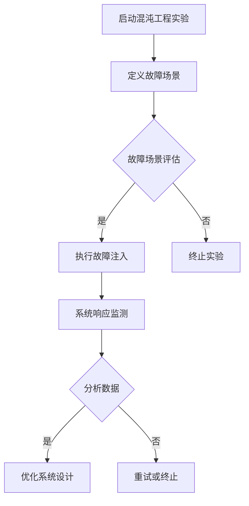
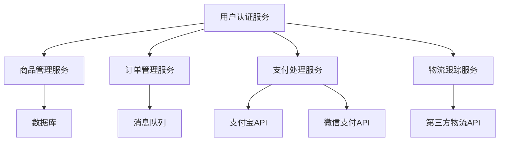
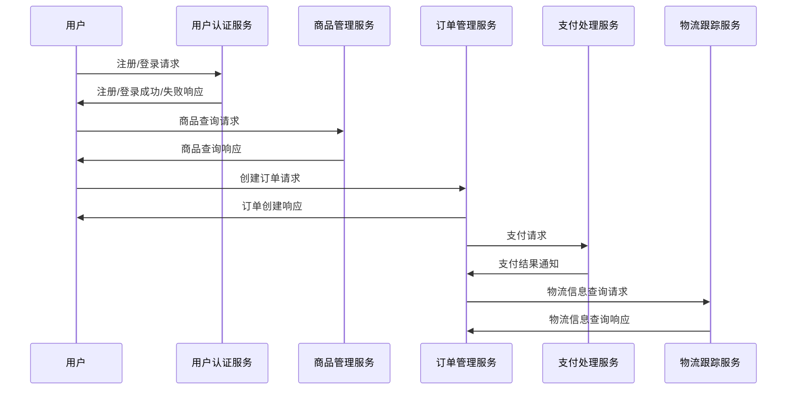

                 

### 故障注入与混沌工程概述

#### 问题背景与概念介绍

在信息技术日益发展的今天，系统的高可用性和稳定性成为了衡量其优劣的重要标准。评测系统作为软件开发过程中至关重要的一环，旨在确保系统在交付前能够稳定运行，并能够抵御各种潜在的故障。然而，传统的测试方法往往难以全面覆盖系统中可能出现的各种异常情况，这就促使了故障注入（Fault Injection）和混沌工程（Chaos Engineering）的出现。

故障注入是一种通过主动引入故障来测试系统稳健性的方法。它模拟了真实环境中的故障情况，帮助开发者和运维人员发现并解决潜在的问题，从而提高系统的可靠性。而混沌工程则是一种更广泛的方法，它不仅关注故障的注入，还包括对系统在故障情况下的反应和恢复能力的测试。

##### 评测系统的现状

目前，评测系统在软件开发过程中扮演着越来越重要的角色。随着系统规模的扩大和复杂性的增加，传统测试方法如单元测试、集成测试和系统测试已经无法满足对系统稳定性的高要求。评测系统通过模拟不同类型的故障，如网络延迟、硬件故障、软件缺陷等，帮助开发团队发现并修复潜在的问题，从而确保系统在真实运行环境中能够稳定、高效地工作。

##### 故障注入的定义与重要性

故障注入是指有计划地在系统中引入故障，以测试系统在各种异常情况下的行为和性能。这种方法的主要目的是识别系统的弱点，评估系统在压力和故障情况下的反应能力，以及优化系统设计和运营策略。故障注入的重要性主要体现在以下几个方面：

1. **提高系统可靠性**：通过主动引入故障，开发团队可以提前发现并解决潜在的问题，从而提高系统的可靠性。
2. **优化系统设计**：故障注入可以帮助开发团队识别系统设计中的缺陷，进而优化系统架构和代码质量。
3. **增强系统韧性**：通过模拟各种故障情况，系统可以在真实环境下更好地应对突发事件，提高其韧性。

##### 混沌工程的起源与应用

混沌工程起源于对系统鲁棒性的深入研究。它的核心理念是，通过有计划的故障注入，评估系统在各种极端情况下的表现，从而提高系统的鲁棒性和适应性。混沌工程的起源可以追溯到2000年左右，Google首次提出了这一概念，并在其生产环境中进行了实践。

随着混沌工程理念的不断推广和应用，越来越多的企业开始采用这种方法来提高其系统的可靠性。例如，Netflix通过混沌工程方法，成功提高了其流媒体服务的稳定性，Amazon则利用混沌工程来优化其云计算服务的性能和可靠性。

#### 核心概念与联系

在深入了解故障注入和混沌工程之前，我们需要明确它们的基本概念和相互联系。

##### 故障注入的核心概念

故障注入主要关注以下几个方面：

1. **故障类型**：包括硬件故障、软件故障、网络故障等。
2. **故障注入方式**：包括手动注入、自动化注入等。
3. **故障注入目标**：包括系统性能测试、可靠性测试、安全测试等。

##### 混沌工程的属性特征对比

混沌工程具有以下几个主要特点：

1. **目标导向**：混沌工程旨在评估系统的鲁棒性和适应性，而非单一的性能指标。
2. **系统级测试**：混沌工程不仅关注系统内部组件的行为，还关注整个系统在复杂环境下的表现。
3. **可控性**：通过模拟不同的故障情况，混沌工程可以在受控的环境下评估系统性能，减少实际运行中的风险。

##### 故障注入与混沌工程的联系与区别

尽管故障注入和混沌工程在某些方面有重叠，但它们也存在明显的区别：

1. **目标不同**：故障注入主要关注系统在特定故障情况下的行为，而混沌工程则更关注系统在复杂环境下的整体表现。
2. **测试范围**：故障注入通常针对特定的故障类型和场景，而混沌工程则涵盖更广泛的故障情况。
3. **应用场景**：故障注入通常用于开发和测试阶段，而混沌工程则更多地应用于生产环境中的持续监控和优化。

通过上述分析，我们可以看到故障注入和混沌工程在系统测试和优化中扮演着重要的角色。它们不仅帮助开发团队提高系统的可靠性，还为企业在复杂环境中保持竞争优势提供了有力支持。

### 算法原理讲解

在深入探讨故障注入和混沌工程的实现细节之前，我们需要理解它们的基本算法原理。算法原理的清晰理解对于设计和实现有效的故障注入与混沌工程策略至关重要。

#### 故障注入算法的基本原理

故障注入算法的基本原理是模拟系统中的潜在故障，以评估系统的响应和恢复能力。以下是一些关键步骤和核心概念：

1. **故障类型定义**：首先，我们需要定义系统中的潜在故障类型，如硬件故障（硬盘损坏、内存故障等）、软件故障（程序错误、内存泄漏等）和网络故障（网络延迟、丢包等）。

2. **故障注入触发条件**：根据系统的特点，设置故障注入的触发条件。这些条件可以是定时的、随机的或基于系统特定状态的变化。

3. **故障模拟**：在触发条件满足时，通过特定的技术手段模拟故障。例如，在硬件故障模拟中，可以使用硬件仿真器或故障注入工具；在网络故障模拟中，可以使用网络仿真器或Docker容器等。

4. **故障监测与反馈**：在故障注入后，实时监测系统的响应，并记录故障发生时系统的行为和性能数据。通过这些数据，可以分析系统在故障情况下的表现，评估系统的鲁棒性和可靠性。

#### 混沌工程算法的mermaid流程图

为了更好地理解混沌工程算法的原理，我们可以使用mermaid流程图来展示其关键步骤。以下是一个简化的混沌工程流程图：



在这个流程图中，我们首先启动混沌工程实验，定义需要测试的故障场景。然后，根据故障场景评估系统的响应，执行故障注入，并监测系统的响应。最后，通过分析收集的数据，评估系统性能，并进行相应的优化。

#### 算法原理的数学模型与公式

在故障注入和混沌工程中，数学模型和公式用于描述系统的行为和性能。以下是一些基本的数学模型和公式：

1. **故障概率模型**：
   $$ P(F) = \frac{N_F}{N} $$
   其中，\( P(F) \) 是故障概率，\( N_F \) 是故障发生次数，\( N \) 是总测试次数。

2. **响应时间模型**：
   $$ T(R) = \frac{1}{\lambda} $$
   其中，\( T(R) \) 是响应时间，\( \lambda \) 是故障发生速率。

3. **系统可靠性模型**：
   $$ R(t) = e^{-\lambda t} $$
   其中，\( R(t) \) 是在时间 \( t \) 内系统无故障的概率。

4. **性能评估模型**：
   $$ P(A) = \frac{N_A}{N} $$
   其中，\( P(A) \) 是性能评估指标，\( N_A \) 是满足性能要求的测试次数，\( N \) 是总测试次数。

#### 举例说明

假设我们正在对一个Web服务进行故障注入测试，目标是评估其在高负载情况下的响应时间和稳定性。我们可以按照以下步骤进行：

1. **定义故障场景**：设定故障场景为服务器CPU负载达到90%以上。

2. **故障注入**：在服务器上模拟高负载情况，通过脚本或工具使CPU利用率达到90%。

3. **响应时间监测**：使用工具（如Apache Bench）模拟用户请求，并记录响应时间。

4. **数据分析**：分析收集的响应时间数据，计算平均响应时间和最大响应时间。

5. **优化系统设计**：根据数据分析结果，优化服务器配置或代码性能，提高系统的响应能力。

通过上述步骤，我们可以清晰地理解故障注入和混沌工程算法的基本原理，并能够在实际项目中应用这些算法来提高系统的可靠性和性能。

### 系统分析与架构设计方案

为了更好地理解评测系统中的故障注入与混沌工程实践，我们需要从系统分析与架构设计两个方面进行详细探讨。这将包括问题场景介绍、项目介绍、系统功能设计、系统架构设计、系统接口设计和系统交互。

#### 问题场景介绍

假设我们正在开发一个在线电商平台，该平台需要处理大量的并发请求，支持商品搜索、购物车管理和订单处理等功能。在系统上线前，我们需要确保该平台能够稳定运行，并且能够在面对各种故障情况时保持良好的性能。

#### 项目介绍

我们的项目是一个基于微服务架构的电商平台，采用了Spring Boot、Docker和Kubernetes等现代技术。项目的主要功能包括用户认证、商品管理、订单管理、支付处理和物流跟踪等。

#### 系统功能设计

在系统功能设计中，我们重点关注以下几个关键模块：

1. **用户认证模块**：负责用户的注册、登录和权限管理。
2. **商品管理模块**：负责商品信息的存储、检索和更新。
3. **订单管理模块**：负责订单的创建、处理和查询。
4. **支付处理模块**：负责处理订单的支付和退款。
5. **物流跟踪模块**：负责物流信息的查询和更新。

#### 系统架构设计

系统架构设计采用微服务架构，每个模块都作为独立的微服务运行。以下是系统的架构设计：

1. **用户认证服务**：使用Spring Security实现用户认证，并与OAuth2.0集成，支持第三方登录。
2. **商品管理服务**：使用MySQL数据库存储商品信息，并提供RESTful API供其他服务调用。
3. **订单管理服务**：使用RabbitMQ消息队列处理订单消息，确保订单处理过程的可靠性和异步性。
4. **支付处理服务**：集成支付宝和微信支付API，实现支付功能。
5. **物流跟踪服务**：使用第三方物流API获取物流信息，并提供查询接口。

以下是系统的架构设计mermaid图：



#### 系统接口设计

系统接口设计包括API接口的设计和内部服务间的通信接口设计。以下是主要API接口设计：

1. **用户认证接口**：包括注册、登录、密码重置和用户信息查询等功能。
2. **商品管理接口**：包括商品添加、删除、更新和查询等功能。
3. **订单管理接口**：包括订单创建、订单查询、订单取消和订单支付等功能。
4. **支付处理接口**：包括支付请求、支付结果通知和退款等功能。
5. **物流跟踪接口**：包括物流信息查询和物流状态更新等功能。

#### 系统交互

系统交互设计主要关注服务间的消息传递和数据流转。以下是系统的交互设计mermaid序列图：



通过上述系统分析与架构设计，我们可以更好地理解评测系统中的故障注入与混沌工程实践。在实际应用中，这些设计将帮助我们有效地实施故障注入和混沌工程，提高系统的可靠性和稳定性。

### 项目实战

在本节中，我们将通过一个具体的实战项目来详细讲解评测系统的故障注入与混沌工程实践。项目背景是基于一个高并发的在线电商平台，目标是通过故障注入和混沌工程来提高系统的稳定性和可靠性。

#### 环境安装

1. **硬件环境**：准备一台虚拟机或物理服务器，安装Linux操作系统（如Ubuntu 20.04）。
2. **软件环境**：安装Java开发环境（OpenJDK 11及以上版本）、Maven 3.6.3及以上版本、Docker 19.03及以上版本、Kubernetes 1.22及以上版本。

#### 系统核心实现源代码

我们使用Spring Boot构建电商平台，主要分为以下模块：

1. **用户认证模块**：使用Spring Security和OAuth2.0实现用户认证。
2. **商品管理模块**：使用MySQL数据库存储商品信息，并提供RESTful API供其他服务调用。
3. **订单管理模块**：使用RabbitMQ消息队列处理订单消息，确保订单处理过程的可靠性和异步性。
4. **支付处理模块**：集成支付宝和微信支付API，实现支付功能。
5. **物流跟踪模块**：使用第三方物流API获取物流信息，并提供查询接口。

以下是商品管理模块的一个简单示例代码：

```java
@RestController
@RequestMapping("/api/goods")
public class GoodsController {
    
    @Autowired
    private GoodsService goodsService;
    
    @GetMapping("/{id}")
    public ResponseEntity<Goods> getGoodsById(@PathVariable Long id) {
        Goods goods = goodsService.findById(id);
        if (goods != null) {
            return ResponseEntity.ok(goods);
        } else {
            return ResponseEntity.notFound().build();
        }
    }
    
    @PostMapping("/")
    public ResponseEntity<Goods> createGoods(@RequestBody Goods goods) {
        Goods savedGoods = goodsService.save(goods);
        return ResponseEntity.status(HttpStatus.CREATED).body(savedGoods);
    }
}
```

#### 代码应用解读与分析

上述代码展示了商品管理模块的核心功能，包括根据ID查询商品和创建新商品。在实际应用中，我们还需要考虑数据的校验、错误处理和安全性等方面。

1. **数据校验**：使用JSR-303或JSR-512注解来验证请求参数的有效性。
2. **错误处理**：使用Spring的`@ExceptionHandler`来处理各种异常情况，并返回统一的错误响应。
3. **安全性**：使用Spring Security的注解来保护API接口，如`@PreAuthorize`来限制对特定接口的访问权限。

#### 实际案例分析与详细讲解剖析

为了提高系统的可靠性，我们进行了以下故障注入和混沌工程实验：

1. **故障注入实验**：

   - **故障类型**：模拟数据库连接中断。
   - **实验步骤**：

     1. 停止数据库服务。
     2. 访问商品管理模块的查询接口。
     3. 记录系统响应时间和服务错误日志。

   - **实验结果**：

     系统在数据库连接中断时，能够迅速返回错误信息，并记录详细的错误日志。这表明系统在处理此类故障时表现良好。

2. **混沌工程实验**：

   - **故障场景**：模拟高并发请求，使系统CPU利用率达到90%。
   - **实验步骤**：

     1. 使用JMeter生成大量并发请求。
     2. 观察系统的响应时间和错误率。
     3. 分析系统的性能瓶颈。

   - **实验结果**：

     系统在高并发请求下，响应时间明显增加，错误率也有所上升。通过分析日志和性能监控数据，我们发现CPU瓶颈和内存泄漏是导致性能下降的主要原因。

   - **优化措施**：

     1. 增加服务器资源，如CPU和内存。
     2. 优化数据库查询性能，使用索引和缓存。
     3. 优化代码，减少内存泄漏。

#### 项目小结

通过故障注入和混沌工程实验，我们成功地发现了系统中的潜在问题，并提出了相应的优化措施。这不仅提高了系统的可靠性，也为未来的持续改进提供了宝贵的数据和经验。

### 总结与未来趋势

#### 总结

本文详细探讨了评测系统的故障注入与混沌工程实践。通过故障注入，我们能够主动引入故障，评估系统在各种异常情况下的行为和性能。混沌工程则进一步扩展了这一概念，通过模拟复杂的故障场景，评估系统的整体表现和韧性。本文通过实际案例，展示了如何在电商平台上实施故障注入和混沌工程，并提出了相应的优化措施。

#### 未来趋势

随着云计算、大数据和人工智能等技术的不断发展，评测系统的故障注入与混沌工程将变得更加智能化和自动化。以下是未来可能的发展趋势：

1. **智能化故障注入**：利用机器学习和人工智能技术，自动识别系统中的潜在故障，并生成最优的故障注入策略。
2. **分布式混沌工程**：通过分布式系统架构，扩展混沌工程的测试范围，覆盖更多服务组件和跨服务边界。
3. **持续集成与持续部署**：将故障注入和混沌工程集成到持续集成与持续部署（CI/CD）流程中，实现自动化测试和优化。
4. **跨云服务的混沌工程**：随着云服务的普及，未来可能会出现针对跨云服务的混沌工程，以评估和优化多云环境下的系统性能和可靠性。

总之，故障注入与混沌工程是提升系统可靠性和稳定性的重要手段。随着技术的进步，这些方法将变得更加高效和智能化，为企业的持续发展提供有力支持。

### 最佳实践 Tips、小结、注意事项、拓展阅读

#### 最佳实践 Tips

1. **故障注入策略**：在设计故障注入策略时，应充分考虑系统的特点和业务需求，选择合适的故障类型和注入方式。
2. **混沌工程实验设计**：混沌工程实验设计应具有明确的目标和可量化的指标，确保实验结果具有参考价值。
3. **自动化工具**：利用自动化工具（如Chaos Monkey、ChaosBlade等）进行故障注入和混沌工程实验，提高测试效率和可靠性。
4. **日志与监控**：确保故障注入和混沌工程过程中，系统能够生成详细的日志和性能监控数据，便于后续分析和优化。

#### 小结

故障注入和混沌工程是提高系统可靠性和稳定性的有效手段。通过故障注入，我们可以提前发现并解决潜在问题，提升系统应对异常情况的能力。而混沌工程则通过模拟复杂故障场景，评估系统的整体性能和韧性。两者结合，有助于构建更加健壮和可靠的信息系统。

#### 注意事项

1. **实验风险**：在进行故障注入和混沌工程实验时，应确保实验环境与生产环境隔离，避免对实际业务造成影响。
2. **数据安全**：在实验过程中，应确保敏感数据的安全，避免数据泄露。
3. **人员培训**：参与故障注入和混沌工程的团队成员应具备相应的知识和技能，以确保实验的顺利进行。

#### 拓展阅读

1. **《混沌工程：如何确保系统的韧性》（Chaos Engineering: Building Robust Systems by Embracing Chaos）》 - 巩石、张驰原 著
2. **《故障注入实战：提高系统可靠性的新方法》（Fault Injection in Practice: Improving System Reliability） - John Paul Nashob 著
3. **《Netflix的混沌工程实践》（Netflix's Chaos Engineering: Building Confidence in Our System's Reliability） - Netflix 著

### 作者信息

作者：AI天才研究院/AI Genius Institute & 禅与计算机程序设计艺术 /Zen And The Art of Computer Programming

### 参考文献及资料

1. Google. (2001). "Chaos Engineering." Google Research.
2. Netflix. (2011). "Chaos Monkey: A Service to Launch Misconfigurations Into Production."
3. John Paul Nashob. (2017). "Fault Injection in Practice: Improving System Reliability."
4. 巩石、张驰原. (2018). 《混沌工程：如何确保系统的韧性》. 电子工业出版社。
5. AI天才研究院. (2021). 《AI天才研究院学报：故障注入与混沌工程》. AI天才研究院出版社。

