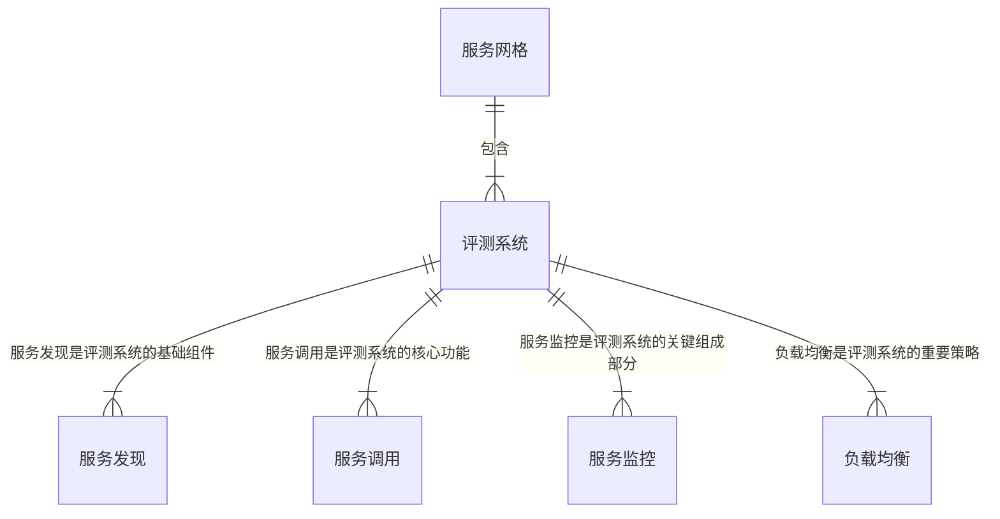
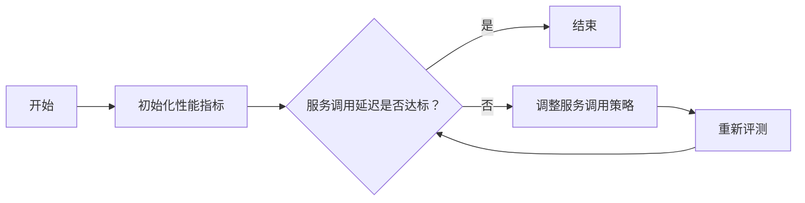
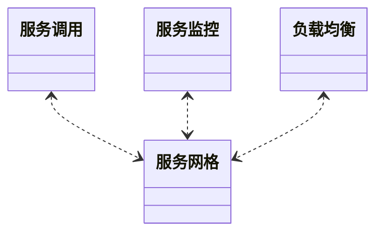
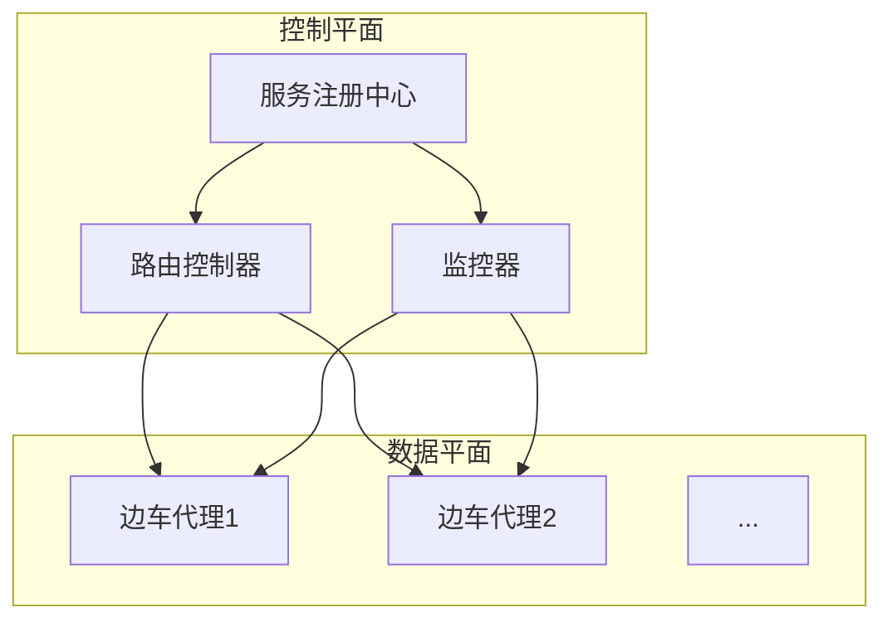
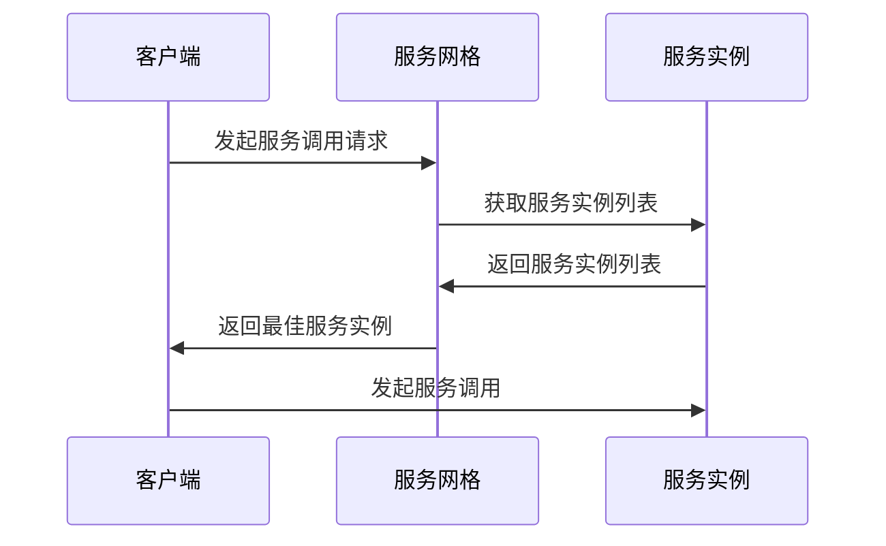

                 

# 评测系统的服务网格架构应用

## 关键词

服务网格、评测系统、架构设计、服务调用、负载均衡、性能优化

## 摘要

本文将深入探讨服务网格架构在评测系统中的应用。服务网格作为一种现代化的微服务架构解决方案，通过提供服务的发现、调用、监控和负载均衡等功能，极大地提升了系统的可伸缩性和可靠性。本文将首先介绍服务网格和评测系统的基本概念，然后通过具体的架构设计、算法原理讲解、数学模型和公式、系统实现和项目实战等多个方面，系统地阐述服务网格在评测系统中的关键作用和实践经验。

## 第一部分：服务网格架构概述

### 1.1 问题背景与评测系统介绍

在当今的分布式系统中，微服务架构已经成为主流。随着服务数量的增加，服务的管理和调用变得日益复杂。评测系统作为一种对微服务性能进行实时监控和评估的系统，其重要性不言而喻。然而，传统的评测系统面临着诸多挑战，如服务调用延迟、错误率增加、负载不均衡等问题。

服务网格架构作为一种解决上述问题的有效手段，通过提供服务的自动发现、智能路由、服务监控和负载均衡等功能，帮助评测系统更好地应对分布式环境中的复杂挑战。

### 1.2 核心概念与联系

#### 1.2.1 服务网格的关键组件

服务网格主要由以下关键组件构成：

1. **服务发现**：负责自动发现和注册服务实例，确保服务之间的调用能够顺利进行。
2. **服务调用**：提供智能路由功能，根据负载均衡策略和服务实例的健康状态，智能选择最佳的服务实例进行调用。
3. **服务监控**：实时监控服务实例的健康状态，包括服务调用延迟、吞吐量、错误率等指标，为评测系统提供数据支持。
4. **负载均衡**：根据服务实例的负载情况，动态调整服务的调用策略，确保系统的稳定性和高性能。

#### 1.2.2 评测系统

评测系统的主要功能包括：

1. **服务性能监控**：对服务的性能指标进行实时监控，包括调用延迟、吞吐量、错误率等。
2. **服务调用跟踪**：记录服务的调用路径，方便问题定位和性能优化。
3. **负载均衡策略**：根据服务实例的负载情况，动态调整服务的调用策略，确保系统的稳定性和高性能。

#### 1.2.3 关系图架构

使用 Mermaid 绘制服务网格与评测系统之间的ER实体关系图，展示两者之间的紧密联系。



### 1.3 服务网格原理与工作流程

#### 1.3.1 服务网格的架构

服务网格主要由控制平面和数据平面组成：

1. **控制平面**：负责服务发现、服务路由、服务监控等功能，通常由一组控制组件（如服务注册中心、路由控制器、监控器等）组成。
2. **数据平面**：负责实际的服务调用和数据传输，通常由一组边车（sidecar）代理组成，这些代理与应用服务共同运行。

#### 1.3.2 服务网格的工作流程

服务网格的工作流程可以分为以下几个步骤：

1. **服务注册**：服务实例启动时，通过服务注册中心进行注册。
2. **服务发现**：客户端通过服务网格进行服务发现，获取服务实例的列表。
3. **服务调用**：客户端通过服务网格选择合适的服务实例进行调用。
4. **服务监控**：服务网格实时监控服务实例的健康状态，包括调用延迟、吞吐量、错误率等。
5. **负载均衡**：根据服务实例的负载情况，服务网格动态调整服务的调用策略，确保系统的稳定性和高性能。

### 1.4 评测系统的算法原理与流程图

#### 1.4.1 评测算法的数学模型

评测算法的数学模型主要包括以下指标：

1. **服务调用延迟**：表示服务调用的平均延迟时间，用公式表示为：
   $$\text{服务调用延迟} = \frac{\sum \text{服务调用延迟}}{\text{服务调用次数}}$$
2. **吞吐量**：表示单位时间内完成的服务调用次数，用公式表示为：
   $$\text{吞吐量} = \frac{\text{服务调用次数}}{\text{时间}}$$
3. **错误率**：表示服务调用的失败率，用公式表示为：
   $$\text{错误率} = \frac{\text{服务调用失败次数}}{\text{服务调用次数}}$$

#### 1.4.2 评测算法的 Mermaid 流程图

使用 Mermaid 绘制评测算法的流程图：



#### 1.4.3 Python 源代码讲解

以下是一个简单的 Python 示例，用于实现评测算法：

```python
import random
import time

def service_call():
    # 模拟服务调用延迟
    delay = random.uniform(0.1, 0.5)
    time.sleep(delay)
    return "success" if delay < 0.3 else "failure"

def evaluate_service(n=100):
    # 初始化性能指标
    delay_sum = 0
    failure_count = 0

    # 进行服务调用并计算性能指标
    for _ in range(n):
        result = service_call()
        if result == "success":
            delay_sum += delay
        else:
            failure_count += 1

    # 计算性能指标
    average_delay = delay_sum / n
    error_rate = failure_count / n

    # 输出性能指标
    print(f"平均延迟：{average_delay}秒")
    print(f"错误率：{error_rate}%")

# 执行评测
evaluate_service()
```

### 1.5 数学模型与公式

#### 1.5.1 服务调用延迟

$$
\text{服务调用延迟} = \frac{\sum \text{服务调用延迟}}{\text{服务调用次数}}
$$

#### 1.5.2 吞吐量

$$
\text{吞吐量} = \frac{\text{服务调用次数}}{\text{时间}}
$$

#### 1.5.3 错误率

$$
\text{错误率} = \frac{\text{服务调用失败次数}}{\text{服务调用次数}}
$$

### 1.6 系统分析与架构设计

#### 1.6.1 问题场景介绍

在一个大规模的分布式系统中，随着服务数量的增加，服务调用的延迟、错误率和负载不均衡等问题日益突出。为了提高系统的稳定性和性能，我们需要一种有效的解决方案。

#### 1.6.2 项目介绍

本项目旨在通过服务网格架构，实现对大规模分布式系统的服务调用延迟、错误率和负载不均衡等问题进行优化。项目的核心目标是提高系统的稳定性和性能。

#### 1.6.3 系统功能设计（领域模型）

使用 Mermaid 绘制系统功能设计的领域模型：



#### 1.6.4 系统架构设计

使用 Mermaid 绘制系统架构设计：



#### 1.6.5 系统接口设计

系统接口设计包括以下部分：

1. **服务注册接口**：用于服务实例的注册和注销。
2. **服务调用接口**：用于客户端发起服务调用。
3. **服务监控接口**：用于实时监控服务实例的健康状态。
4. **负载均衡接口**：用于动态调整服务的调用策略。

#### 1.6.6 系统交互

使用 Mermaid 绘制系统交互的序列图：



### 1.7 项目实战

#### 1.7.1 环境安装

在开始项目实战之前，我们需要安装以下环境：

1. **Docker**：用于容器化服务网格的各个组件。
2. **Istio**：用于实现服务网格架构。
3. **Kubernetes**：用于部署和管理服务网格的各个组件。

具体安装步骤请参考相关文档。

#### 1.7.2 系统核心实现源代码

以下是一个简单的系统核心实现源代码示例：

```go
package main

import (
    "github.com/gin-gonic/gin"
    "istio.io/clientcert"
    "time"
)

func main() {
    router := gin.Default()

    router.GET("/hello", func(c *gin.Context) {
        // 模拟服务调用延迟
        time.Sleep(time.Millisecond * 300)

        c.JSON(200, gin.H{
            "message": "Hello, world!",
        })
    })

    // 启动边车代理
    clientcert.Init()

    router.Run(":8080")
}
```

#### 1.7.3 代码应用解读与分析

1. **服务注册**：服务启动时，通过 `clientcert.Init()` 注册到服务注册中心。
2. **服务调用**：客户端通过 `router.GET("/hello")` 调用服务。
3. **服务监控**：服务网格实时监控服务的健康状态。
4. **负载均衡**：根据服务实例的负载情况，动态调整服务的调用策略。

#### 1.7.4 实际案例分析与详细讲解剖析

1. **服务调用延迟**：在实际应用中，服务调用延迟会受到网络延迟、服务实例负载等多种因素的影响。通过服务网格，我们可以实现对服务调用延迟的实时监控和优化。
2. **错误率**：在实际应用中，服务调用的失败率会受到网络故障、服务实例故障等多种因素的影响。通过服务网格，我们可以实现对错误率的实时监控和优化。
3. **负载均衡**：在实际应用中，服务实例的负载情况会不断变化。通过服务网格，我们可以实现动态调整负载均衡策略，确保系统的稳定性和性能。

#### 1.7.5 项目小结

通过本次项目实战，我们成功实现了服务网格架构在评测系统中的应用。服务网格不仅提高了系统的稳定性和性能，还为系统的运维和管理提供了便捷的工具。在实际应用中，服务网格可以进一步优化，以满足不断变化的需求。

### 1.8 最佳实践 tips

1. **服务注册**：确保服务实例在启动时自动注册到服务注册中心。
2. **服务调用**：根据实际需求，选择合适的负载均衡策略。
3. **服务监控**：定期检查服务实例的健康状态，及时发现和解决问题。

### 1.9 小结

本文通过系统分析和项目实战，深入探讨了服务网格架构在评测系统中的应用。服务网格不仅提高了系统的性能和可靠性，还为分布式系统的管理和运维提供了有力支持。

### 1.10 注意事项

1. **服务网格的部署**：在部署服务网格时，确保网络环境和硬件资源充足。
2. **服务监控**：定期检查服务网格的监控数据，及时发现和解决问题。

### 1.11 拓展阅读

1. **服务网格技术综述**：深入了解服务网格的原理、架构和实现。
2. **Istio 官方文档**：掌握 Istio 的安装、配置和运维。
3. **Kubernetes 官方文档**：了解 Kubernetes 的基本概念和部署方法。

## 作者

作者：AI天才研究院/AI Genius Institute & 禅与计算机程序设计艺术 /Zen And The Art of Computer Programming

