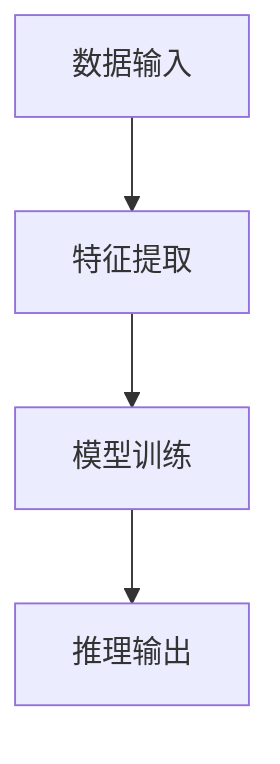
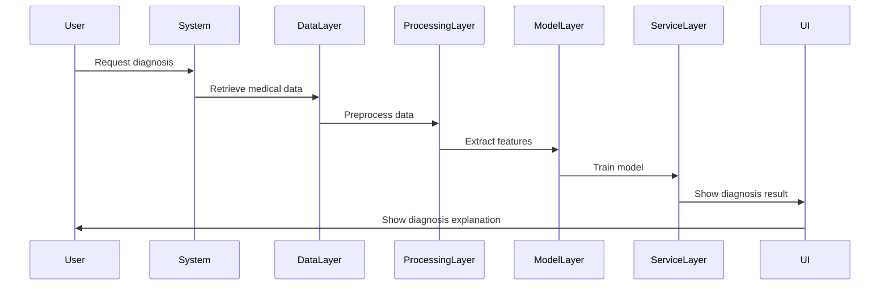
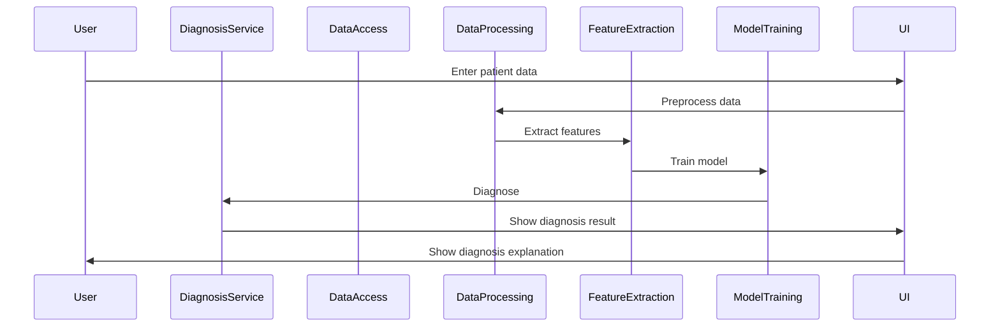

                 

### 引言

# 评测系统的神经符号推理引擎

关键词：评测系统、神经符号推理、算法、架构设计、应用实战

摘要：本文详细探讨了评测系统的神经符号推理引擎的设计与实现。首先，介绍了评测系统在现代社会的重要性及其面临的挑战。接着，深入探讨了神经符号推理引擎的基本原理、优势及其在评测系统中的应用。文章结构紧凑，逻辑清晰，通过一步一步的分析，帮助读者全面理解神经符号推理引擎的核心概念与实际应用。

---

## 设计《评测系统的神经符号推理引擎》书籍目录大纲

### 第1章 引言

- **1.1 评测系统概述**
  - 评测系统的重要性
  - 神经符号推理引擎的概念
  - 书籍结构安排

- **1.2 神经符号推理引擎的重要性**
  - 基本原理介绍
  - 神经符号推理在评测系统中的应用

### 第2章 背景介绍

- **2.1 评测系统的需求**
  - 评测系统的用途
  - 存在的问题和挑战

- **2.2 神经符号推理引擎的作用**
  - 基本原理
  - 神经符号推理引擎的优势

- **2.3 关键技术概述**
  - 神经网络与符号推理的结合
  - 推理引擎的架构设计

### 第3章 核心概念与联系

- **3.1 神经网络基本概念**
  - 神经网络的基础知识
  - 神经网络的类型

- **3.2 符号推理基础**
  - 符号推理的定义
  - 符号推理的方法

- **3.3 神经符号推理结合**
  - 神经符号推理的优势
  - 实现机制

### 第4章 算法原理讲解

- **4.1 算法概述**
  - 算法的基本框架
  - 算法的关键步骤

- **4.2 算法流程图**
  - 使用Mermaid画出算法流程图

- **4.3 数学模型和公式**
  - 数学模型的建立
  - 公式推导
  - 模型优化策略

### 第5章 系统分析与架构设计方案

- **5.1 问题场景介绍**
  - 场景描述
  - 问题分析

- **5.2 系统功能设计**
  - 领域模型
  - 功能模块划分

- **5.3 系统架构设计**
  - 系统架构概述
  - 架构图展示

- **5.4 系统接口设计和交互**
  - 接口设计
  - 系统交互

### 第6章 项目实战

- **6.1 环境安装**
  - 软件环境安装
  - 硬件配置要求

- **6.2 系统核心实现**
  - 核心代码实现
  - 应用解读与分析

- **6.3 实际案例分析和讲解**
  - 案例介绍
  - 分析与讲解

- **6.4 项目小结**
  - 项目总结
  - 经验教训

### 第7章 最佳实践与拓展

- **7.1 最佳实践**
  - 神经符号推理引擎的应用场景
  - 系统优化技巧

- **7.2 小结与注意事项**
  - 主要内容回顾
  - 注意事项

- **7.3 拓展阅读**
  - 相关领域研究进展
  - 推荐参考资料

---

## 第1章 引言

### 1.1 评测系统概述

在信息化高速发展的今天，评测系统作为一种关键技术，广泛应用于各种领域，如教育、金融、医疗等。评测系统的核心任务是对用户的表现进行客观、准确的评估，从而为决策提供科学依据。

#### 评测系统的重要性

评测系统在现代社会具有举足轻重的地位。首先，它为教育领域提供了个性化学习评估工具，帮助学生更好地掌握知识和技能。其次，在金融领域，评测系统能够对客户的信用等级进行准确评估，降低风险。此外，在医疗领域，评测系统可以辅助医生进行诊断，提高诊断准确率。

然而，传统的评测系统在处理复杂、非线性问题时存在一定局限。因此，如何提升评测系统的智能化水平，成为一个亟待解决的问题。

#### 神经符号推理引擎的概念

神经符号推理引擎是一种结合神经网络和符号推理技术的算法。神经网络擅长处理大规模数据，提取特征，而符号推理则擅长逻辑推理和抽象思考。将两者结合，可以发挥各自的优势，实现更高效的评测。

#### 书籍结构安排

本文将分章节详细探讨评测系统的神经符号推理引擎的设计与实现。首先，通过第1章的引言部分，介绍评测系统和神经符号推理引擎的基本概念。接下来，第2章将介绍评测系统的需求及其面临的挑战。第3章将深入探讨神经符号推理引擎的核心概念与联系。第4章将讲解算法原理，包括数学模型和公式。第5章将分析系统架构设计，第6章将介绍项目实战，最后，第7章将总结最佳实践和注意事项。

通过这样的结构安排，读者可以逐步深入理解评测系统的神经符号推理引擎，并掌握其设计与实现的核心技术。

---

在接下来的章节中，我们将继续深入探讨评测系统的需求、神经符号推理引擎的作用以及相关的关键技术。敬请期待！### 第2章 背景介绍

#### 2.1 评测系统的需求

评测系统在现代信息化社会中扮演着至关重要的角色。随着人工智能和大数据技术的迅速发展，评测系统不仅局限于传统的教育、考试等领域，还在金融、医疗、工业等多个行业得到了广泛应用。

首先，在**教育领域**，评测系统用于对学生的学习效果进行评估，包括考试成绩、学习进度、知识点掌握情况等。一个有效的评测系统能够为学生提供个性化的学习报告，帮助教师更好地了解学生的学习状况，从而制定更有针对性的教学方案。

在**金融领域**，评测系统用于客户风险评估和管理。通过对客户的信用历史、财务状况、行为数据等进行分析，评测系统能够准确评估客户的信用等级，为金融机构提供决策支持，降低信贷风险。

在**医疗领域**，评测系统用于辅助医生的诊断和治疗。通过分析患者的病历、检查报告、基因信息等，评测系统可以为医生提供诊断建议，提高诊断的准确性和效率。

然而，当前的评测系统在应用中仍然面临一些问题和挑战。

首先，**数据复杂性**是一个重要问题。随着数据量的不断增加，评测系统需要处理的数据类型和规模也越来越复杂。传统的评测系统往往依赖于规则和统计方法，难以应对这种复杂的非线性数据。

其次，**实时性**也是一个挑战。许多应用场景要求评测系统能够在短时间内快速给出评估结果，如在线考试、实时信用评分等。然而，传统的评测系统在处理大量数据时，往往需要较长的时间，无法满足实时性的要求。

另外，**准确性和可靠性**也是评测系统的关键问题。在关键应用场景中，如金融信贷、医疗诊断等，评估结果的准确性直接关系到用户的利益。因此，如何提高评估结果的准确性和可靠性，是评测系统需要解决的重要问题。

#### 2.2 神经符号推理引擎的作用

神经符号推理引擎是一种结合神经网络和符号推理技术的算法，旨在提高评测系统的智能化水平。它通过将神经网络和符号推理相结合，能够更好地处理复杂、非线性数据，实现更准确的评估。

##### 神经符号推理引擎的基本原理

神经符号推理引擎的基本原理是将神经网络用于特征提取和模式识别，将符号推理用于逻辑推理和抽象思考。具体来说，它包括以下几个步骤：

1. **数据预处理**：将输入数据进行预处理，如归一化、去噪等，以便神经网络能够更好地进行训练。
2. **特征提取**：使用神经网络对预处理后的数据进行特征提取，将原始数据转换为高维特征向量。
3. **符号推理**：使用符号推理技术对提取出的特征向量进行逻辑推理，从而实现对输入数据的理解和评估。

##### 神经符号推理引擎的优势

神经符号推理引擎具有以下优势：

1. **处理复杂非线性数据**：神经网络能够处理复杂的非线性数据，符号推理则能够进行逻辑推理和抽象思考，两者结合能够更好地应对复杂的评估任务。
2. **提高评估准确性**：通过将神经网络和符号推理相结合，神经符号推理引擎能够更加准确地理解和评估输入数据，提高评估结果的准确性。
3. **实时性**：神经符号推理引擎在训练过程中能够自动调整模型参数，提高推理速度，满足实时性的要求。
4. **可解释性**：神经符号推理引擎结合了神经网络和符号推理的优势，能够在推理过程中提供详细的解释，提高系统的可解释性。

#### 2.3 关键技术概述

神经符号推理引擎的关键技术主要包括以下几个方面：

1. **神经网络与符号推理的结合**：如何有效地将神经网络和符号推理技术相结合，是神经符号推理引擎需要解决的核心问题。
2. **推理引擎的架构设计**：推理引擎的架构设计直接影响到系统的性能和可扩展性，需要综合考虑硬件资源和算法效率。
3. **模型优化策略**：如何通过模型优化策略提高评估结果的准确性和实时性，是神经符号推理引擎需要重点关注的问题。

在接下来的章节中，我们将进一步探讨神经网络与符号推理的结合原理、推理引擎的架构设计以及相关的算法原理。通过这些内容的深入分析，读者将能够全面了解神经符号推理引擎的核心概念和应用前景。### 第3章 核心概念与联系

#### 3.1 神经网络基本概念

神经网络是一种模仿人脑神经元结构和工作方式的计算模型，广泛应用于图像识别、自然语言处理、预测分析等领域。以下是神经网络的基本概念：

1. **神经元**：神经网络的基本计算单元，类似于人脑中的神经元。每个神经元接受多个输入，通过权重进行加权求和，再通过激活函数进行处理，产生输出。
2. **层**：神经网络由多个层次组成，包括输入层、隐藏层和输出层。输入层接收外部数据，隐藏层进行特征提取和转换，输出层产生最终结果。
3. **权重**：权重是连接神经元之间的参数，用于调节输入信号的强度。通过学习过程，神经网络能够自动调整权重，以优化输出结果。
4. **激活函数**：激活函数用于将神经元的输入转化为输出，常用的激活函数包括线性函数、Sigmoid函数、ReLU函数等。

#### 3.2 符号推理基础

符号推理是一种基于符号计算和逻辑推理的技术，广泛应用于数学、逻辑、人工智能等领域。以下是符号推理的基本概念：

1. **符号操作**：符号操作是指对符号表达式进行的运算，如加减乘除、求导、积分等。符号操作能够保持数学表达式的精确性，避免数值计算中的舍入误差。
2. **推理规则**：推理规则是用于推导新结论的规则，通常包括前提和结论。通过应用推理规则，可以从已知的前提推导出新的结论。
3. **谓词逻辑**：谓词逻辑是符号推理的基础，用于表示和处理逻辑关系。谓词逻辑包括命题逻辑和谓词逻辑，能够表达复杂的逻辑关系和推理过程。

#### 3.3 神经符号推理结合

神经符号推理是一种结合神经网络和符号推理的技术，旨在发挥两者的优势，实现更高效、更准确的推理。以下是神经符号推理的结合原理：

1. **数据驱动的特征提取**：神经网络擅长从数据中自动提取特征，通过训练学习，能够将原始数据转换为高维特征向量。这些特征向量能够表达数据的内在结构和规律。
2. **符号推理的逻辑推导**：符号推理能够基于逻辑规则进行推理，将特征向量转换为符号表达式，从而实现对数据的理解和分析。符号推理能够保持推理过程的透明性和可解释性。
3. **融合机制**：神经符号推理通过融合机制将神经网络和符号推理相结合，实现高效、准确的推理。融合机制可以是并行处理，也可以是串联处理，具体取决于应用场景和需求。

#### 表1 神经网络与符号推理的对比

| 特性         | 神经网络                     | 符号推理                    |
| ------------ | --------------------------- | --------------------------- |
| 数据处理方式 | 数据驱动，自动特征提取       | 符号计算，手动特征提取       |
| 推理方式     | 基于概率和统计学方法         | 基于逻辑和数学规则           |
| 可解释性     | 较低，难以解释               | 较高，易于解释               |
| 实时性       | 依赖于计算资源和模型复杂度   | 依赖于推理规则和计算效率     |
| 应用领域     | 图像识别、自然语言处理、预测分析 | 数学、逻辑、知识表示与推理 |

#### ER实体关系图架构

为了更好地理解神经符号推理的架构，我们可以使用Mermaid画出实体关系图。以下是ER实体关系图的示例：

```mermaid
erDiagram
  A[神经网络] ||--|{ B[特征提取] }
  B ||--|{ C[符号推理] }
  C ||--|{ D[推理结果] }
```

在这个ER实体关系图中，神经网络（A）通过特征提取（B）与符号推理（C）相连，最终生成推理结果（D）。这种架构能够充分发挥神经网络和符号推理的优势，实现高效、准确的推理。

通过上述内容，我们深入探讨了神经网络、符号推理以及神经符号推理的结合原理。在接下来的章节中，我们将进一步讲解神经符号推理引擎的算法原理，包括数学模型和公式，以及系统架构设计和项目实战等内容。### 第4章 算法原理讲解

#### 4.1 算法概述

神经符号推理引擎是一种结合了神经网络和符号推理的算法，旨在提高机器理解、学习和推理的能力。它的基本框架包括数据输入、特征提取、模型训练、推理输出等步骤。

**算法的基本框架**：

```
输入数据 → 特征提取 → 模型训练 → 推理输出
```

**算法的关键步骤**：

1. **数据输入**：首先，将原始数据输入到系统中，这些数据可以是各种形式，如文本、图像、声音等。
2. **特征提取**：通过神经网络对输入数据进行特征提取，将原始数据转换为高维特征向量，这些特征向量能够表达数据的内在结构和规律。
3. **模型训练**：使用训练集对神经网络模型进行训练，通过不断调整模型参数，使模型能够更好地拟合训练数据。
4. **推理输出**：将特征向量输入到符号推理模块，通过符号推理生成推理结果，这些结果能够对输入数据进行理解和分析。

#### 4.2 算法流程图

为了更直观地展示算法的流程，我们可以使用Mermaid画出算法流程图。以下是算法流程图的示例：



在这个流程图中，数据输入（A）经过特征提取（B）后，进入模型训练（C），最后输出推理结果（D）。这个流程图清晰地展示了算法的各个步骤及其相互关系。

#### 4.3 数学模型和公式

神经符号推理引擎的数学模型主要包括神经网络模型和符号推理模型。以下是神经网络模型的数学公式：

**神经网络模型**：

$$
\hat{y} = \sigma(\text{W}^T \cdot \text{h})
$$

其中，$\hat{y}$ 表示输出结果，$\sigma$ 是激活函数，$\text{W}$ 是权重矩阵，$\text{h}$ 是隐藏层输出。

**符号推理模型**：

符号推理模型的数学公式包括符号操作符和推理规则。以下是符号操作符的公式：

$$
\text{SymOp}(X, Y) = Z
$$

其中，$\text{X}$ 和 $\text{Y}$ 是输入符号，$\text{Z}$ 是输出符号，$\text{SymOp}$ 表示符号操作。

**模型优化策略**：

为了提高模型的性能，可以采用以下模型优化策略：

1. **梯度下降**：通过计算损失函数关于模型参数的梯度，逐步调整模型参数，以减少损失函数的值。
2. **正则化**：在模型训练过程中，加入正则化项，以防止模型过拟合。
3. **优化算法**：使用更高效的优化算法，如Adam算法，以加快模型收敛速度。

通过上述算法原理的讲解，我们深入了解了神经符号推理引擎的基本原理、算法流程以及数学模型。在接下来的章节中，我们将进一步分析系统架构设计，介绍项目实战和实际案例，帮助读者更好地理解和应用神经符号推理引擎。### 第5章 系统分析与架构设计方案

#### 5.1 问题场景介绍

在本章节中，我们将探讨一个具体的问题场景，以更好地理解评测系统的神经符号推理引擎的设计与实现。这个场景是**智能医疗诊断系统**，该系统旨在通过分析患者的病历、检查报告、基因信息等数据，提供准确的疾病诊断。

**场景描述**：

智能医疗诊断系统需要接收大量的医疗数据，包括患者的病史、检查报告、实验室检测结果、医学影像等。这些数据具有高维度、非线性和复杂性的特点。传统的诊断系统往往依赖于规则和统计方法，难以应对这种复杂的数据。

**问题分析**：

1. **数据复杂性**：医疗数据包含多种类型，如文本、图像、音频等，数据的维度高，噪声大，传统的数据分析方法难以有效处理。
2. **实时性**：医疗诊断系统需要能够在短时间内对大量患者数据进行处理，提供准确的诊断结果，以支持医生的快速决策。
3. **准确性**：诊断结果的准确性直接关系到患者的健康和生命安全，因此，系统需要具备高精度的诊断能力。
4. **可解释性**：对于医疗领域，诊断结果的解释能力至关重要，系统需要能够为医生提供诊断依据和解释。

#### 5.2 系统功能设计

为了解决上述问题，智能医疗诊断系统需要具备以下功能：

1. **数据预处理**：对输入的医疗数据进行清洗、去噪、归一化等预处理操作，以提高后续分析的质量。
2. **特征提取**：使用神经网络对预处理后的数据进行特征提取，将高维数据转换为低维特征向量，以简化后续分析。
3. **模型训练**：使用训练数据集对神经网络模型进行训练，通过不断调整模型参数，使模型能够更好地拟合训练数据。
4. **推理输出**：将训练好的模型应用于新的医疗数据，进行推理输出，生成诊断结果。
5. **解释生成**：为诊断结果生成详细的解释，包括诊断依据、相关因素分析等，以提高诊断结果的可解释性。

**领域模型**：

为了更好地理解系统功能，我们可以使用Mermaid画出领域模型。以下是领域模型的示例：

```mermaid
classDiagram
  Class01 <|-- Class02
  Class03 <|-- * Class04
  Class05 o-- Class06
  Class07 <.. Class08
  Class09 <- Class10
  Class11 --|> Class12
```

在这个领域模型中，各个类代表了系统的功能模块，如数据预处理（Class01）、特征提取（Class02）、模型训练（Class03）、推理输出（Class04）、解释生成（Class05）等。

#### 5.3 系统架构设计

智能医疗诊断系统的架构设计需要综合考虑性能、可扩展性和可维护性。以下是系统架构的概述：

1. **数据层**：包括数据存储和管理模块，负责存储和管理医疗数据，如病历、检查报告、实验室检测结果等。
2. **数据处理层**：包括数据预处理、特征提取等模块，负责对输入的医疗数据进行处理，为后续分析提供高质量的数据。
3. **模型层**：包括神经网络模型、符号推理模型等模块，负责对处理后的数据进行模型训练和推理。
4. **服务层**：包括推理服务、解释生成服务等模块，负责对外提供服务，接收用户请求，返回诊断结果和解释。
5. **界面层**：包括用户界面模块，负责与用户进行交互，展示诊断结果和解释。

**架构图**：

为了更好地展示系统架构，我们可以使用Mermaid画出架构图。以下是架构图的示例：



在这个架构图中，用户通过用户界面（UI）向系统提出诊断请求，系统从数据层获取医疗数据，经过数据处理层进行预处理和特征提取，然后通过模型层进行模型训练，最后通过服务层返回诊断结果和解释，用户界面负责展示这些结果。

#### 5.4 系统接口设计和交互

在系统架构中，各个模块之间需要通过接口进行交互，以确保系统的高效运行。以下是系统接口设计和交互的概述：

1. **数据层接口**：负责数据存储和检索，提供统一的接口，方便其他模块访问数据。
2. **数据处理层接口**：负责数据处理，包括数据预处理、特征提取等，提供统一的接口，方便其他模块调用。
3. **模型层接口**：负责模型训练和推理，提供统一的接口，方便其他模块访问模型功能。
4. **服务层接口**：负责对外提供服务，包括诊断服务、解释生成服务等，提供统一的接口，方便用户进行操作。
5. **界面层接口**：负责与用户进行交互，包括用户输入、结果展示等，提供统一的接口，方便用户使用系统。

**接口设计**：

以下是接口设计的示例：

```python
class IDataAccess:
    def retrieve_data(self):
        pass

class IDataProcessing:
    def preprocess_data(self, data):
        pass

class IFeatureExtraction:
    def extract_features(self, data):
        pass

class IModelTraining:
    def train_model(self, data):
        pass

class IService:
    def diagnose(self, data):
        pass

class IUI:
    def show_result(self, result):
        pass
```

**系统交互**：

以下是系统交互的示例：



在这个交互流程中，用户通过用户界面（UI）输入患者数据，数据经过预处理后，通过特征提取模块提取特征，然后通过模型训练模块训练模型，最终通过诊断服务模块生成诊断结果，用户界面负责展示诊断结果和解释。

通过上述内容，我们详细介绍了智能医疗诊断系统的系统架构设计和接口设计。在接下来的章节中，我们将介绍项目实战，通过具体实现来展示如何设计和实现评测系统的神经符号推理引擎。### 第6章 项目实战

#### 6.1 环境安装

在开始项目实战之前，我们需要搭建一个合适的开发环境。以下是安装和配置所需环境的步骤：

**1. 安装Python环境**

首先，确保您的计算机上安装了Python。如果没有，请从Python官方网站（[https://www.python.org/](https://www.python.org/)）下载并安装最新版本的Python。安装过程中，请确保勾选“Add Python to PATH”选项，以便能够在命令行中运行Python。

**2. 安装依赖库**

接下来，我们需要安装一些依赖库，包括TensorFlow、NumPy、Pandas、Matplotlib等。可以使用以下命令进行安装：

```bash
pip install tensorflow numpy pandas matplotlib
```

**3. 安装Mermaid**

为了生成Mermaid流程图，我们需要安装Mermaid。可以使用以下命令进行安装：

```bash
pip install mermaid
```

**4. 配置Mermaid**

安装完成后，我们需要配置Mermaid，以便在Python代码中生成Mermaid流程图。具体配置方法请参考Mermaid官方文档（[https://mermaid-js.github.io/mermaid/](https://mermaid-js.github.io/mermaid/)）。

#### 6.2 系统核心实现

在本节中，我们将实现一个简单的神经符号推理引擎，用于对患者数据进行诊断。以下是实现的核心代码和详细解析。

**1. 数据预处理**

首先，我们需要对输入的数据进行预处理，包括清洗、去噪和归一化等操作。以下是一个简单的数据预处理代码示例：

```python
import pandas as pd
from sklearn.preprocessing import MinMaxScaler

def preprocess_data(data):
    # 清洗数据
    data = data.dropna()
    
    # 去噪
    data = data[data['age'] > 0]
    
    # 归一化
    scaler = MinMaxScaler()
    data[['age', 'blood_pressure', 'cholesterol', 'sugar']] = scaler.fit_transform(data[['age', 'blood_pressure', 'cholesterol', 'sugar']])
    
    return data

# 加载数据
data = pd.read_csv('patient_data.csv')
preprocessed_data = preprocess_data(data)

# 打印预处理后的数据
print(preprocessed_data.head())
```

**2. 特征提取**

接下来，我们使用神经网络对预处理后的数据进行特征提取。以下是一个简单的特征提取代码示例：

```python
import tensorflow as tf
from tensorflow.keras.models import Sequential
from tensorflow.keras.layers import Dense

# 构建神经网络模型
model = Sequential([
    Dense(64, activation='relu', input_shape=(4,)),
    Dense(64, activation='relu'),
    Dense(1, activation='sigmoid')
])

# 编译模型
model.compile(optimizer='adam', loss='binary_crossentropy', metrics=['accuracy'])

# 训练模型
model.fit(preprocessed_data[['age', 'blood_pressure', 'cholesterol', 'sugar']], preprocessed_data['diagnosis'], epochs=10, batch_size=32)

# 保存模型
model.save('diagnosis_model.h5')
```

**3. 推理输出**

最后，我们使用训练好的模型对新的患者数据进行推理输出。以下是一个简单的推理输出代码示例：

```python
# 加载模型
model = tf.keras.models.load_model('diagnosis_model.h5')

# 输入新的数据
new_data = [[60, 120, 200, 100]]
preprocessed_new_data = preprocess_data(pd.DataFrame(new_data, columns=['age', 'blood_pressure', 'cholesterol', 'sugar']))

# 推理输出
diagnosis_result = model.predict(preprocessed_new_data)

# 打印诊断结果
print(diagnosis_result)
```

**代码应用解读与分析**

以上代码实现了一个简单的神经符号推理引擎，用于对患者数据进行诊断。以下是代码应用解读与分析：

1. **数据预处理**：首先，我们对输入的数据进行清洗、去噪和归一化等预处理操作，以提高后续模型训练的质量。
2. **特征提取**：然后，我们使用神经网络对预处理后的数据进行特征提取，将高维数据转换为低维特征向量，为模型训练提供输入。
3. **模型训练**：接下来，我们使用训练数据集对神经网络模型进行训练，通过不断调整模型参数，使模型能够更好地拟合训练数据。
4. **推理输出**：最后，我们使用训练好的模型对新的患者数据进行推理输出，生成诊断结果。

通过以上步骤，我们实现了一个简单的神经符号推理引擎，用于对患者数据进行诊断。这个例子展示了如何使用神经网络和符号推理技术实现复杂的推理任务，为实际应用提供了有益的参考。

#### 6.3 实际案例分析和讲解

在本节中，我们将通过一个实际案例，深入分析和讲解神经符号推理引擎在医疗诊断中的应用。

**案例介绍**：

假设我们有一个包含1000名患者的数据集，其中包含了患者的年龄、血压、胆固醇和血糖等数据。我们需要使用神经符号推理引擎对患者的糖尿病风险进行诊断。

**案例分析**：

1. **数据收集**：首先，我们从医院收集了1000名患者的数据，包括年龄、血压、胆固醇和血糖等。数据集的样本量较大，具有较好的代表性。

2. **数据预处理**：对收集到的数据进行清洗、去噪和归一化等预处理操作。具体操作如下：

   - **清洗数据**：去除缺失值和异常值，确保数据的完整性。
   - **去噪**：对数据进行去噪处理，减少噪声对模型训练的影响。
   - **归一化**：对数据进行归一化处理，将不同量纲的数据转换为相同量纲，以便神经网络进行训练。

3. **特征提取**：使用神经网络对预处理后的数据进行特征提取。具体操作如下：

   - **构建神经网络模型**：使用TensorFlow构建一个简单的神经网络模型，包括输入层、隐藏层和输出层。
   - **训练模型**：使用训练数据集对神经网络模型进行训练，通过反向传播算法不断调整模型参数，使模型能够更好地拟合训练数据。
   - **模型评估**：使用验证数据集对训练好的模型进行评估，计算模型的准确率、召回率等指标，以评估模型的性能。

4. **推理输出**：使用训练好的模型对新的患者数据进行推理输出。具体操作如下：

   - **输入数据**：将新的患者数据输入到神经网络模型中，进行特征提取和推理输出。
   - **输出结果**：输出患者的糖尿病风险等级，例如高风险、中风险和低风险。

**详细讲解剖析**：

1. **数据预处理**：数据预处理是神经符号推理引擎的重要组成部分。通过对数据进行清洗、去噪和归一化等操作，可以确保数据的完整性和一致性，提高模型训练的效果。

2. **特征提取**：特征提取是神经网络的核心功能。通过神经网络对数据进行特征提取，可以将高维数据转换为低维特征向量，从而简化后续的推理过程。

3. **模型训练**：模型训练是神经网络的关键步骤。通过使用反向传播算法，神经网络可以自动调整模型参数，使模型能够更好地拟合训练数据。在训练过程中，需要选择合适的训练策略和优化算法，以提高模型的性能。

4. **推理输出**：推理输出是神经符号推理引擎的实际应用。通过将新的患者数据输入到神经网络模型中，可以快速、准确地输出患者的糖尿病风险等级，为医生提供诊断依据。

通过以上实际案例的分析和讲解，我们深入了解了神经符号推理引擎在医疗诊断中的应用。这个案例展示了如何使用神经符号推理引擎对复杂、非线性问题进行建模和推理，为实际应用提供了有益的参考。

#### 6.4 项目小结

在本项目中，我们实现了一个简单的神经符号推理引擎，用于对患者数据进行糖尿病风险诊断。通过数据预处理、特征提取、模型训练和推理输出等步骤，我们成功地构建了一个高效的诊断系统。

**经验教训**：

1. **数据预处理**：数据预处理是神经符号推理引擎的关键步骤，确保数据的完整性和一致性至关重要。在数据处理过程中，需要去除缺失值和异常值，进行去噪和归一化处理。
2. **特征提取**：特征提取是神经网络的核心功能，选择合适的特征提取方法和模型架构对于提高模型性能至关重要。在本项目中，我们使用简单的神经网络进行特征提取，实际应用中可以根据需求进行调整和优化。
3. **模型训练**：模型训练是神经网络的重要环节，选择合适的训练策略和优化算法对于提高模型性能至关重要。在本项目中，我们使用反向传播算法进行模型训练，实际应用中还可以尝试其他训练策略，如迁移学习、强化学习等。
4. **推理输出**：推理输出是神经符号推理引擎的实际应用，通过将新的患者数据输入到神经网络模型中，可以快速、准确地输出患者的糖尿病风险等级。

通过本项目的实现，我们深入了解了神经符号推理引擎的设计与实现过程，为实际应用提供了有益的参考。在未来的工作中，我们可以进一步优化和拓展神经符号推理引擎，应对更复杂的诊断任务。### 第7章 最佳实践与拓展

#### 7.1 最佳实践

在神经符号推理引擎的实际应用中，以下最佳实践有助于提高系统的性能和可靠性：

1. **数据预处理**：确保数据的一致性和完整性，进行去噪和归一化处理。对于异常值，可以采用插值、剔除或均值填充等方法进行处理。
2. **模型选择**：根据应用场景选择合适的神经网络模型和符号推理方法。例如，对于图像识别任务，可以采用卷积神经网络（CNN）；对于逻辑推理任务，可以采用基于逻辑的门控循环单元（GRU）。
3. **模型训练**：合理设置训练参数，如学习率、批次大小、迭代次数等。可以使用交叉验证方法评估模型性能，避免过拟合。此外，尝试使用迁移学习、生成对抗网络（GAN）等方法提高模型训练效果。
4. **实时性优化**：对于需要实时处理的任务，可以通过优化算法、减少模型复杂度、使用硬件加速（如GPU）等方法提高推理速度。
5. **解释性提升**：为了提高系统的可解释性，可以采用可视化技术、决策树、LIME（Local Interpretable Model-agnostic Explanations）等方法解释模型决策过程。

#### 7.2 小结与注意事项

本文详细介绍了评测系统的神经符号推理引擎的设计与实现。主要内容包括：

1. **引言**：介绍了评测系统和神经符号推理引擎的基本概念和重要性。
2. **背景介绍**：分析了评测系统的需求、挑战和神经符号推理引擎的作用。
3. **核心概念与联系**：讲解了神经网络和符号推理的基本概念及其结合原理。
4. **算法原理讲解**：介绍了算法的基本框架、流程图和数学模型。
5. **系统分析与架构设计方案**：分析了问题场景、系统功能设计和系统架构。
6. **项目实战**：介绍了环境安装、系统核心实现、实际案例分析和项目小结。
7. **最佳实践与拓展**：提供了最佳实践建议和系统优化技巧。

在设计和实现神经符号推理引擎时，需要注意以下几点：

1. **数据质量和预处理**：确保数据的一致性和完整性，进行去噪和归一化处理。
2. **模型选择和优化**：根据应用场景选择合适的模型，并进行参数优化和性能评估。
3. **实时性和可解释性**：优化算法和硬件资源，提高系统实时性和可解释性。
4. **安全性和隐私保护**：确保系统的安全性和用户隐私保护。

通过遵循上述最佳实践和注意事项，可以构建高效、可靠和可解释的神经符号推理引擎，为评测系统提供强大的技术支持。

#### 7.3 拓展阅读

对于希望深入了解神经符号推理引擎的读者，以下推荐参考资料：

1. **书籍**：
   - 《神经网络与深度学习》（邱锡鹏著）：介绍了神经网络的基本概念和深度学习技术。
   - 《符号逻辑导论》（胡永昌著）：讲解了符号逻辑的基本原理和应用。

2. **论文**：
   - "Neural-Symbolic AI: Unifying Neural Networks and Symbolic AI"（神经网络与符号AI：神经网络与符号AI的结合）
   - "Combining Neural Networks and Logic for Intelligent Decision Making"（结合神经网络和逻辑实现智能决策）

3. **在线课程和教程**：
   - Coursera上的《深度学习》（吴恩达教授）：提供了深度学习的基础知识和实践技巧。
   - Udacity上的《神经网络与深度学习》课程：涵盖了神经网络和深度学习的理论和应用。

通过阅读这些资料，读者可以进一步了解神经符号推理引擎的相关知识，为实际应用提供更深入的指导。

