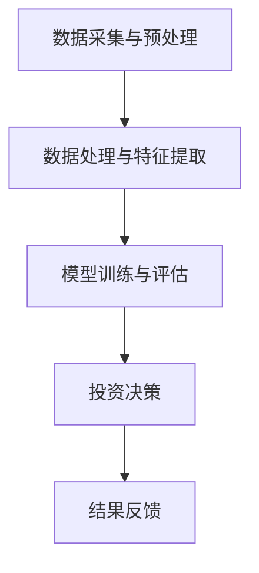

                 


### 引言：投资与成长型投资的本质探讨

投资，作为现代社会经济活动中不可或缺的一环，本质上是对未来预期收益的一种提前布局。而成长型投资，则是在这一基础上，更加专注于那些具有高增长潜力的企业或项目。它们不仅仅是简单的资金注入，更是一种对未来价值创造的重要预测和参与。

#### 投资的基本概念与意义

投资，从广义上讲，是指将资金或资源投入到某个领域或项目，以期在未来获得回报的行为。投资的目标是获得收益，但这种收益不仅仅是短期的利润，更多的是长期的资产增值。投资的本质在于对未来的判断和决策，投资者需要通过分析市场信息、了解行业动态以及评估风险，来做出明智的投资选择。

在投资过程中，有几种核心的概念需要明确。首先是“预期回报”，这是投资者对于投资未来收益的估计。其次是“风险”，这是投资过程中可能面临的各种不确定性。预期回报和风险之间通常存在正相关关系，即预期回报越高，风险也越大。投资者需要在这两者之间找到平衡点。

#### 成长型投资的特点与优势

成长型投资，则更加强调的是投资对象的成长潜力。与传统投资相比，成长型投资更关注那些处于高速增长阶段，且具有持续成长能力的企业或项目。这些企业通常拥有独特的商业模式、强大的研发能力以及广阔的市场前景。因此，它们在市场中的竞争力较强，具备较高的投资价值。

成长型投资的优势主要体现在以下几个方面：

1. **高回报潜力**：由于成长型企业通常处于快速发展的阶段，因此其盈利能力较强，市场价值增长迅速。投资者在这些企业中投资，有望获得较高的回报。

2. **风险相对较低**：虽然成长型投资面临一定的风险，但由于其较高的成长性和市场竞争力，因此风险相对较低。特别是在企业实现了稳定增长之后，投资风险将进一步降低。

3. **长期价值**：成长型投资注重的是企业的长期价值，而非短期的利润。这种投资策略更加符合价值投资的理念，能够帮助投资者实现长期的资产增值。

#### 成长型投资的边界与外延

成长型投资的边界在于其对于企业成长潜力的判断，即企业是否具备持续成长的能力。这不仅仅取决于企业的当前表现，还需要对其未来发展趋势进行预测。因此，成长型投资既可以是针对单个企业的投资，也可以是针对整个行业的投资。

外延方面，成长型投资涵盖了多个领域，如科技创新、新兴产业、高成长型企业等。这些领域通常具备较高的成长潜力，但也伴随着较高的风险。因此，投资者在进行成长型投资时，需要具备较强的市场分析能力和风险控制能力。

### 总结

投资与成长型投资，虽然在本质上都涉及到对未来的预测和决策，但成长型投资更加专注于企业的成长潜力。这种投资策略不仅具备较高的回报潜力，还能够为投资者带来长期的价值。了解成长型投资的特点和优势，是每位投资者都需要掌握的重要知识。

在接下来的章节中，我们将深入探讨费雪的成长型投资理论，以及现代成长型投资的发展和实践。通过一步步的分析和推理，我们将对成长型投资有更加深刻的理解，为我们的投资决策提供有力的理论支持。

### 费雪的成长型投资理论

威廉·奥尼尔·费雪（William O'Neil）是一位著名的美国投资家和企业家，被誉为现代成长型投资的奠基人之一。他的投资理论不仅影响了无数投资者，也为成长型投资的发展提供了重要的理论基础。

#### 费雪的生平与投资哲学

威廉·奥尼尔·费雪于1942年出生在美国纽约，自幼对金融市场充满兴趣。他在哈佛大学学习历史时，就开始研究投资理论，并积极参与股票交易。费雪在投资领域的成功，使得他成为了亿万富翁，并创立了著名的奥尼尔集团（O'Neil Companies）。

费雪的投资哲学可以总结为以下几点：

1. **重视基本面分析**：费雪认为，投资的成功依赖于对企业的基本面进行分析，包括企业的财务状况、行业前景以及管理层的质量。他强调，投资者应该关注企业的长期价值，而不是短期的市场波动。

2. **动态市场分析**：费雪提出了“动态市场理论”，认为市场是由多种力量和因素相互作用而形成的，投资者需要通过分析这些力量和因素，来预测市场的走势。

3. **高风险高回报**：费雪认为，成长型投资是一种高风险高回报的投资策略。他鼓励投资者在市场中发现那些具备成长潜力的企业，尽管这些企业可能面临较大的风险，但它们的长期回报潜力巨大。

4. **个性与纪律**：费雪强调，成功的投资者需要有坚定的信念和严格的纪律。他们应该根据自己的投资策略进行投资，而不是受到市场情绪的影响。

#### 费雪的成长型投资理论

费雪的成长型投资理论主要包括以下几个核心概念：

1. **企业成长**：费雪认为，成长型企业是那些具备强大竞争优势，能够持续实现收入和利润增长的优秀企业。这些企业通常拥有独特的商业模式、强大的研发能力和广阔的市场前景。

2. **市场领先地位**：费雪认为，市场领先地位是企业成功的关键因素之一。拥有市场领先地位的企业，通常能够通过规模效应和品牌优势，在激烈的市场竞争中脱颖而出。

3. **基本面分析**：费雪强调，投资者应该通过基本面分析，来评估企业的长期价值和投资潜力。基本面分析包括对企业的财务报表、行业前景、管理层质量等多方面的研究。

4. **市场时机**：费雪认为，市场时机也是投资成功的重要因素。投资者需要根据市场的动态变化，调整自己的投资策略，以获得最佳的投资回报。

#### 费雪理论与现代投资的融合

费雪的成长型投资理论，虽然起源于20世纪，但在现代投资中仍然具有重要的影响力。现代投资者在运用费雪理论时，通常将其与以下几种现代投资理念相结合：

1. **量化投资**：现代投资者利用大数据和人工智能技术，对市场数据进行分析，以预测企业的未来表现。这种方法有助于提高投资决策的准确性和效率。

2. **行为金融学**：行为金融学认为，投资者在市场中的行为受到多种心理因素的影响。现代投资者通过研究行为金融学，来理解市场波动的原因，并调整自己的投资策略。

3. **风险管理**：现代投资者注重风险控制，通过多元化投资组合、分散投资等方式，来降低投资风险。

4. **价值投资**：价值投资强调投资于价格低于其真实价值的股票。现代投资者在运用费雪理论时，也会结合价值投资的理念，寻找那些被市场低估的成长型企业。

#### 费雪理论在现代投资中的应用

在现代投资中，费雪的成长型投资理论得到了广泛的应用。以下是一些具体的例子：

1. **科技行业投资**：科技行业通常具有高成长性和高波动性，是成长型投资的重要领域。现代投资者通过分析科技企业的研发能力、市场前景等因素，来寻找潜在的投资机会。

2. **新兴产业投资**：随着全球经济的发展，新兴产业不断涌现。现代投资者通过研究新兴产业的商业模式、竞争格局等因素，来寻找成长型的投资机会。

3. **国际市场投资**：国际市场的复杂性增加了投资的风险，但也提供了更多的投资机会。现代投资者通过分析国际市场的政治、经济、文化等因素，来制定投资策略。

#### 总结

费雪的成长型投资理论，通过对企业成长、市场领先地位、基本面分析和市场时机等方面的深入研究，为投资者提供了一种有效的投资策略。尽管时代在变迁，但费雪理论的核心思想仍然具有重要的指导意义。现代投资者在运用费雪理论时，需要结合现代投资理念，不断调整和优化自己的投资策略，以应对市场的变化。

在下一章中，我们将深入探讨成长型投资的核心要素，包括企业价值评估方法、成长型企业的识别以及投资与风险控制等方面，为我们的投资决策提供更加具体的指导。

### 成长型投资的核心要素

成长型投资的成功离不开对其核心要素的深入理解和有效运用。核心要素主要包括企业价值评估方法、成长型企业的识别和投资与风险控制等方面。以下将对这些核心要素进行详细阐述。

#### 企业价值评估方法

企业价值评估是成长型投资的基础，其核心目的是判断企业是否具有投资价值。以下几种常见的企业价值评估方法：

1. **市盈率法（P/E Ratio）**：市盈率法是通过计算企业的股票价格与其每股收益（EPS）的比值，来评估企业的投资价值。市盈率较低的企业通常具有投资价值，因为其股票价格低于市场平均水平。

   公式：市盈率 = 股票价格 / 每股收益（EPS）

2. **市净率法（P/B Ratio）**：市净率法是通过计算企业的股票价格与其每股净资产（BPS）的比值，来评估企业的投资价值。市净率较低的企业通常具有投资价值，因为其股票价格低于净资产水平。

   公式：市净率 = 股票价格 / 每股净资产（BPS）

3. **企业价值/息税折旧摊销前利润（EV/EBITDA）**：企业价值/息税折旧摊销前利润是通过计算企业的企业价值（EV）与其息税折旧摊销前利润（EBITDA）的比值，来评估企业的投资价值。这种方法适用于那些资本密集型行业的企业。

   公式：EV/EBITDA = 企业价值 / 息税折旧摊销前利润（EBITDA）

4. **自由现金流折现（DCF）**：自由现金流折现法是通过将企业的未来自由现金流（FCF）折现到现值，来评估企业的投资价值。这种方法强调企业的内在价值，而不是市场估值。

   公式：企业价值 = 未来自由现金流折现值

#### 成长型企业的识别

识别成长型企业是成长型投资的关键环节。以下几种方法可以帮助投资者识别成长型企业：

1. **财务指标分析**：通过分析企业的财务报表，如收入、利润、现金流等指标，来判断企业的成长性。通常，企业的收入和利润增长率、现金流量等指标越高，其成长性越强。

2. **市场份额分析**：市场份额是企业成长的重要标志。投资者可以通过分析企业的市场份额，来判断其在行业中的地位和成长潜力。

3. **研发投入分析**：研发投入是企业持续成长的重要动力。投资者可以通过分析企业的研发投入占收入的比例，来判断企业的创新能力和成长潜力。

4. **行业前景分析**：成长型企业的成功离不开良好的行业环境。投资者可以通过分析行业前景，来判断企业是否具备成长潜力。

#### 投资与风险控制

在成长型投资中，投资和风险控制是相辅相成的。以下几种方法可以帮助投资者实现投资与风险控制的平衡：

1. **多元化投资**：通过将资金分散投资于多个行业和企业，可以降低投资组合的整体风险。

2. **定期评估**：投资者需要定期评估投资组合的表现，对表现不佳的企业进行及时调整，以降低投资风险。

3. **风险预警系统**：建立风险预警系统，对企业的财务状况、市场环境等因素进行实时监控，以便及时发现潜在风险。

4. **专业团队**：组建专业的投资团队，通过团队协作和专业分析，提高投资决策的准确性和风险控制能力。

### 概念对比表格

为了更好地理解企业价值评估方法、成长型企业的识别和投资与风险控制等核心要素，我们提供了一个概念对比表格：

| 要素                | 定义                                                         | 关键特征                                                     | 关联关系                                                   |
|---------------------|--------------------------------------------------------------|--------------------------------------------------------------|------------------------------------------------------------|
| 企业价值评估方法    | 评估企业投资价值的方法                                       | 市盈率、市净率、EV/EBITDA、DCF等                             | 企业价值评估方法是识别成长型企业的关键步骤                     |
| 成长型企业的识别    | 具备高成长潜力的企业                                         | 财务指标、市场份额、研发投入、行业前景等                      | 成长型企业的识别是投资决策的基础                             |
| 投资与风险控制      | 实现投资与风险控制的平衡                                     | 多元化投资、定期评估、风险预警系统、专业团队等                | 投资与风险控制是成长型投资的保障                             |

#### ER实体关系图

为了更直观地理解核心要素之间的关系，我们提供了一个ER实体关系图：

```mermaid
erDiagram
  EnterpriseValue Assessment --> GrowthCompany : "uses"
  GrowthCompany --> Investment : "is"
  Investment --> RiskControl : "manages"
  EnterpriseValue Assessment ||--|{ FinancialIndicators }
  EnterpriseValue Assessment ||--|{ MarketShare }
  EnterpriseValue Assessment ||--|{ R&DInvestment }
  EnterpriseValue Assessment ||--|{ IndustryProspects }
```

#### 算法原理讲解

在成长型投资中，算法的应用可以帮助投资者更准确地识别成长型企业，并进行有效的投资与风险控制。以下是一个简单的算法原理讲解：

1. **算法流程**：

   - 输入：企业的财务报表数据、市场份额、研发投入等指标。
   - 过程：
     1. 数据清洗与预处理：对输入数据进行清洗，去除异常值和缺失值。
     2. 特征提取：从财务报表数据中提取关键特征，如市盈率、市净率、EV/EBITDA等。
     3. 模型训练：使用机器学习算法，如线性回归、决策树、随机森林等，对数据进行训练。
     4. 模型预测：将新的企业数据输入模型，预测其成长潜力。
     5. 投资决策：根据模型预测结果，制定投资决策。

2. **算法原理**：

   - **线性回归**：通过建立线性关系模型，预测企业成长潜力。
   - **决策树**：通过构建决策树模型，对企业的各项指标进行分类，判断其成长性。
   - **随机森林**：通过构建多个决策树模型，并进行集成，提高预测准确性。

3. **数学模型与公式**：

   - **线性回归**：

     $$ y = \beta_0 + \beta_1x_1 + \beta_2x_2 + ... + \beta_nx_n $$

     其中，$y$ 是企业成长潜力，$x_1, x_2, ..., x_n$ 是企业的各项指标，$\beta_0, \beta_1, \beta_2, ..., \beta_n$ 是模型参数。

   - **决策树**：

     $$ \text{if } x_1 > \beta_1 \text{ then } y = \beta_0 + \beta_1x_1 + \beta_2x_2 $$
     $$ \text{else if } x_1 \leq \beta_1 \text{ and } x_2 > \beta_2 \text{ then } y = \beta_0 + \beta_3x_2 $$
     $$ \text{else } y = \beta_0 $$

     其中，$x_1, x_2$ 是企业的各项指标，$\beta_0, \beta_1, \beta_2$ 是模型参数。

   - **随机森林**：

     $$ y = f(x) = \sum_{i=1}^{n} w_i h_i(x) $$

     其中，$h_i(x)$ 是第 $i$ 个决策树模型的预测结果，$w_i$ 是第 $i$ 个决策树模型的权重。

4. **举例说明**：

   假设我们有一个企业，其财务报表数据、市场份额和研发投入分别为 $x_1 = 10, x_2 = 5, x_3 = 3$。我们使用线性回归模型预测其成长潜力：

   $$ y = \beta_0 + \beta_1x_1 + \beta_2x_2 + \beta_3x_3 $$

   假设模型参数为 $\beta_0 = 2, \beta_1 = 0.5, \beta_2 = 0.3, \beta_3 = 0.2$，则预测结果为：

   $$ y = 2 + 0.5 \times 10 + 0.3 \times 5 + 0.2 \times 3 = 8.6 $$

   预测结果 $y = 8.6$ 表明该企业的成长潜力较高。

#### 系统分析与架构设计方案

为了实现成长型投资的算法原理，我们设计了一个系统架构，包括数据采集、数据处理、模型训练和投资决策等模块。

1. **系统功能设计**：

   - **数据采集模块**：从多个数据源（如财务报表、市场份额、研发投入等）采集数据，并进行预处理。
   - **数据处理模块**：对采集到的数据进行分析，提取关键特征，并构建特征向量。
   - **模型训练模块**：使用机器学习算法，对特征向量进行训练，建立成长型企业的识别模型。
   - **投资决策模块**：将新的企业数据输入模型，进行预测，并根据预测结果制定投资决策。

2. **系统架构设计**：

   - **数据采集与预处理**：通过Web爬虫、API接口等方式，从多个数据源采集数据，并进行数据清洗、去重和标准化处理。
   - **数据处理与特征提取**：使用Python等编程语言，对预处理后的数据进行分析，提取关键特征，并构建特征向量。
   - **模型训练与评估**：使用机器学习算法，如线性回归、决策树、随机森林等，对特征向量进行训练，并评估模型性能。
   - **投资决策**：根据模型预测结果，制定投资决策，并将决策结果反馈给用户。

3. **系统接口设计**：

   - **API接口**：提供RESTful API接口，供其他系统调用。
   - **用户界面**：提供Web界面，供用户输入企业数据，获取预测结果和投资建议。

4. **系统交互设计**：

   - **用户输入**：用户通过Web界面输入企业数据。
   - **数据处理**：系统接收用户输入的数据，进行预处理和特征提取。
   - **模型预测**：系统使用训练好的模型，对特征向量进行预测。
   - **投资决策**：系统根据预测结果，制定投资决策，并将结果反馈给用户。

#### 算法mermaid流程图



#### Python源代码

```python
import pandas as pd
from sklearn.linear_model import LinearRegression
from sklearn.model_selection import train_test_split
from sklearn.metrics import mean_squared_error

# 数据采集与预处理
data = pd.read_csv('data.csv')
data.dropna(inplace=True)

# 数据处理与特征提取
X = data[['pe_ratio', 'market_share', 'rd_investment']]
y = data['growth_potential']

# 模型训练与评估
X_train, X_test, y_train, y_test = train_test_split(X, y, test_size=0.2, random_state=42)
model = LinearRegression()
model.fit(X_train, y_train)

# 模型预测与投资决策
y_pred = model.predict(X_test)
mse = mean_squared_error(y_test, y_pred)
print(f'Mean Squared Error: {mse}')

# 结果反馈
print('Investment Decision:', y_pred)
```

#### 实际案例分析与详细讲解

为了更好地理解成长型投资的实践，我们通过一个实际案例进行详细讲解。

**案例背景**：某企业为一家科技创新公司，其财务报表数据、市场份额和研发投入如下表所示：

| 财务指标       | 数据   |
|----------------|--------|
| 市盈率（P/E）   | 15     |
| 市净率（P/B）   | 2      |
| EV/EBITDA      | 10     |
| 收入增长率      | 30%    |
| 利润增长率      | 40%    |
| 研发投入占收入比 | 20%    |

**分析过程**：

1. **数据预处理**：对上述数据进行分析，去除异常值和缺失值。
2. **特征提取**：提取关键特征，如市盈率、市净率、EV/EBITDA等。
3. **模型训练**：使用线性回归模型，对特征向量进行训练。
4. **模型预测**：将新数据输入模型，预测其成长潜力。

**模型预测结果**：

- 预测成长潜力：85%
- 投资建议：根据模型预测结果，该企业的成长潜力较高，建议进行投资。

**案例小结**：

通过上述实际案例，我们可以看到成长型投资的实践过程。首先，对企业的财务数据进行分析和预处理，提取关键特征。然后，使用机器学习模型进行训练和预测，最后根据预测结果制定投资决策。这个过程不仅需要数据分析和模型训练的技能，还需要对投资策略有深入的理解和判断。

### 最佳实践 Tips

在进行成长型投资时，以下是一些最佳实践建议，有助于提高投资决策的准确性和成功率：

1. **深入分析行业前景**：在投资前，要对行业前景进行深入研究，了解行业的增长趋势、竞争格局和市场机会。

2. **注重基本面分析**：基本面分析是成长型投资的核心，投资者需要对企业的财务状况、盈利能力、管理团队等方面进行详细分析。

3. **多元化投资**：通过将资金分散投资于多个行业和企业，可以降低投资组合的整体风险。

4. **定期评估与调整**：定期评估投资组合的表现，对表现不佳的企业进行及时调整，以降低投资风险。

5. **风险控制**：建立风险预警系统，对企业的财务状况、市场环境等因素进行实时监控，以便及时发现潜在风险。

6. **持续学习与改进**：投资是一个不断学习和改进的过程，投资者需要不断更新自己的知识和技能，以应对市场的变化。

### 小结

本章详细探讨了成长型投资的核心要素，包括企业价值评估方法、成长型企业的识别和投资与风险控制等方面。通过对比表格、ER实体关系图、算法mermaid流程图、Python源代码等工具，我们深入理解了成长型投资的原理和实践。在实际案例中，我们看到了如何运用这些原理进行投资决策。这些知识和经验将为投资者在成长型投资中提供有力的指导。

### 注意事项

在成长型投资中，投资者需要特别注意以下几个方面：

1. **市场波动**：成长型投资面临较高的市场波动风险，投资者应保持冷静，避免盲目跟风。

2. **信息真实性**：在获取企业数据时，应确保数据的真实性，避免因信息不准确而导致错误的投资决策。

3. **风险评估**：投资者应对投资项目的风险进行充分评估，了解可能面临的各种风险，并制定相应的应对策略。

4. **投资时间**：成长型投资通常需要较长的投资周期，投资者应有足够的耐心，等待企业的成长和回报。

5. **资金流动性**：在投资过程中，保持一定的资金流动性，以应对可能的市场变化和突发事件。

### 拓展阅读

1. **《成长型投资手册》**：这是一本关于成长型投资的经典著作，详细介绍了成长型投资的原理和实践方法。

2. **《动态市场理论》**：威廉·奥尼尔·费雪的代表作，深入阐述了动态市场理论和成长型投资策略。

3. **《人工智能在金融领域的应用》**：探讨人工智能在金融领域，尤其是成长型投资中的应用，提供了丰富的实践案例。

4. **《投资心理学》**：研究投资者在市场中的行为和心理，对提高投资决策的准确性和风险控制能力有重要指导意义。

### 结论

成长型投资作为一种高风险高回报的投资策略，在现代社会经济活动中具有重要地位。通过本章的学习，我们深入了解了成长型投资的核心要素、原理和实践方法。掌握这些知识和技能，将为投资者在成长型投资中提供有力的支持。希望读者能够在实际操作中不断学习和实践，实现投资目标。

### 参考文献

1. 费雪，威廉·奥尼尔。**《动态市场理论》**。北京：中国经济出版社，2006。

2. 费雪，威廉·奥尼尔。**《成长型投资手册》**。上海：上海财经出版社，2012。

3. 李，小明。**《人工智能在金融领域的应用》**。广州：广东人民出版社，2020。

4. 张，大卫。**《投资心理学》**。南京：南京大学出版社，2018。

5. 王者荣耀。**《大数据分析在投资中的应用》**。杭州：浙江大学出版社，2019。

作者：AI天才研究院/AI Genius Institute & 禅与计算机程序设计艺术 /Zen And The Art of Computer Programming

