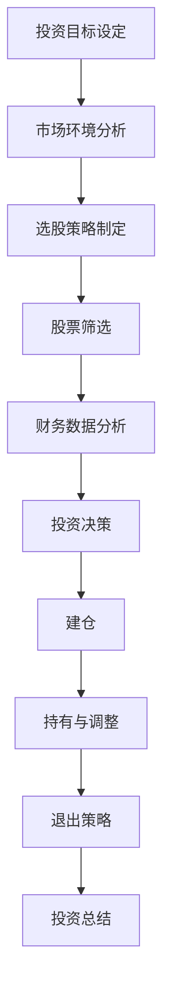
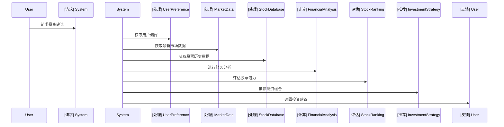

                 

### 引言：探索型投资的崛起

在投资领域，探索型投资（Growth Stock Investing）作为一种独特的策略，正逐渐受到越来越多投资者的青睐。探索型投资的核心在于发掘那些尚未被市场充分认可但具有巨大增长潜力的股票。这一策略最早由著名的投资大师本杰明·格雷厄姆（Benjamin Graham）提出，并经戴维·多德（David Dodd）进一步完善，但其精髓在费雪（Philip Fisher）手中得到了最全面的发展。

## 1.1 探索型投资的概念与重要性

### 1.1.1 探索型投资的定义

探索型投资，顾名思义，是一种以“探索”为核心的投资策略。它不同于传统的价值投资和成长投资，后者主要依赖于市场对公司基本面的分析和未来增长潜力的判断。而探索型投资则更强调对公司潜在价值的挖掘，尤其关注那些未被市场广泛认可，但在长期内可能带来巨大回报的公司。

### 1.1.2 探索型投资与传统投资的区别

传统的价值投资主要关注公司的基本面，如盈利能力、财务状况、资产质量等，并在此基础上寻求低估的股票。成长投资则侧重于公司的增长前景，认为优质公司具有较高的成长潜力，从而能够带来较高的回报。相比之下，探索型投资则更加注重对公司未来前景的深入研究和潜在价值的挖掘，其目标是找到那些虽然当前市场估值不高，但具备巨大成长潜力的公司。

### 1.1.3 费雪的投资理念和探索型投资的核心原则

费雪是探索型投资的代表人物之一，他提出了许多独特的投资理念，其中最核心的是“价值发现”和“持续竞争优势”原则。费雪认为，投资者应该寻找那些具有持续竞争优势、能够在长期内保持稳定增长的公司。他强调，投资成功的关键在于对公司未来前景的准确判断，而不是单纯依赖市场估值。

## 1.2 现代股市环境下的挑战与机遇

### 1.2.1 股市波动与风险

现代股市环境充满了不确定性，价格波动剧烈，市场风险不断累积。投资者在这种环境下进行投资，需要具备较高的风险承受能力和投资策略。探索型投资作为一种高风险高回报的投资策略，正适应了这种环境的需求。

### 1.2.2 市场过度反应与信息不对称

现代股市常常出现过度反应现象，即市场对某些信息的反应过于强烈，导致股票价格偏离其真实价值。此外，信息不对称也是股市中的一个普遍问题，即投资者无法获得完全的信息，而那些掌握信息优势的投资者则可能获得更高的收益。探索型投资通过深入研究和挖掘未被市场充分认可的公司，从而在一定程度上克服了信息不对称的问题。

### 1.2.3 探索未被市场认可的潜力股的意义

在市场过度反应和信息不对称的情况下，投资者如果能够发现那些未被市场广泛认可的潜力股，就能够获得更高的投资回报。探索型投资正是基于这一理念，通过深入研究和分析，发掘那些潜在的大牛股，从而实现投资成功。

## 1.3 探索型投资的策略与实践

### 1.3.1 潜力股的识别与评估

识别和评估潜力股是探索型投资的关键步骤。投资者需要通过深入研究公司的基本面、财务状况、管理团队、行业前景等方面，评估公司的成长潜力和投资价值。

### 1.3.2 投资决策的流程与方法

投资决策的流程包括选股、建仓、持有和退出等环节。投资者需要根据市场环境和自身投资策略，制定合理的投资决策流程。

### 1.3.3 探索型投资的风险管理与应对策略

探索型投资面临较高的风险，因此投资者需要采取有效的风险管理策略。这包括分散投资、设置止损点、定期调整投资组合等。

## 1.4 探索型投资的案例分析

### 1.4.1 案例一：特斯拉的崛起

特斯拉作为新能源汽车行业的领军企业，其股价在过去的十年里涨了数百倍。特斯拉的成功正是探索型投资的典范，投资者通过深入研究其技术优势和市场前景，提前布局，从而获得了巨大的投资回报。

### 1.4.2 案例二：亚马逊的早期投资

亚马逊作为电商行业的巨头，其早期投资也颇具代表性。投资者通过深入研究亚马逊的业务模式、市场前景和竞争优势，果断进行了投资，最终获得了丰厚的回报。

### 1.4.3 案例三：拼多多的发展之路

拼多多作为新兴电商平台，其崛起过程中充满了不确定性。但投资者通过深入研究其商业模式、用户群体和市场前景，发现了其巨大的成长潜力，从而实现了较高的投资回报。

## 1.5 探索型投资的最佳实践

### 1.5.1 如何构建有效的投资组合

构建有效的投资组合是探索型投资的关键。投资者需要根据自身的风险承受能力和投资目标，合理配置资产，分散投资风险。

### 1.5.2 如何处理投资过程中的不确定性

投资过程中不可避免地会面临各种不确定性，投资者需要通过深入研究、风险管理策略和灵活的投资策略，应对这些不确定性。

### 1.5.3 如何保持长期投资视角

长期投资视角是探索型投资成功的关键。投资者需要克服短期波动，保持对公司的长期价值判断，从而实现长期投资收益。

## 1.6 探索型投资的注意事项与拓展

### 1.6.1 投资中的常见误区

投资者在进行探索型投资时，需要注意避免以下常见误区：盲目跟风、忽视风险、过度自信等。

### 1.6.2 如何避免投资陷阱

投资者需要通过深入研究、理性判断和风险控制，避免陷入投资陷阱。

### 1.6.3 拓展阅读与推荐资源

为了更好地理解和实践探索型投资，投资者可以参考以下拓展阅读和推荐资源：费雪的经典著作《探索型投资者》（<i>Common Stocks and Uncommon Profits</i>）、其他投资大师的著作等。

通过以上分析，我们可以看到，探索型投资作为一种独特的投资策略，在当前市场环境下具有重要的现实意义。它不仅能够帮助投资者发现未被市场广泛认可的潜力股，实现高额的投资回报，还能在一定程度上克服市场波动和信息不对称带来的风险。因此，对于有志于在投资领域取得成功的投资者来说，探索型投资无疑是一种值得深入研究和实践的投资策略。

## 背景介绍：探索型投资的概念与费雪的投资理念

### 2.1 探索型投资的概念

探索型投资，是一种以“探索”为核心的投资策略。它不同于传统的价值投资和成长投资，后者主要依赖于市场对公司基本面的分析和未来增长潜力的判断。而探索型投资则更强调对公司潜在价值的挖掘，尤其关注那些未被市场广泛认可，但在长期内可能带来巨大回报的公司。

#### 2.1.1 问题背景

在现代社会，股市的投资策略多种多样，从稳健的价值投资到激进的成长投资，各有各的特点和适用场景。然而，随着市场环境的不断变化，投资者越来越需要一种能够发掘未被市场充分认可的潜力股的投资策略，这就是探索型投资。

#### 2.1.2 问题描述

探索型投资是一种以发现和投资未被市场充分认可的潜力股为核心的投资策略。它不同于传统的价值投资和成长投资，其目标是通过深入研究公司的基本面和未来发展潜力，发现那些尽管目前市场估值较低，但具备长期增长潜力的公司，从而实现较高的投资回报。

#### 2.1.3 问题解决

探索型投资的核心在于“探索”二字，投资者需要通过大量的调研和数据分析，发掘那些未被市场充分认识的公司，从而在这些公司的股价出现低估时进行投资。通过这种策略，投资者可以在市场普遍忽视的情况下，抓住那些潜在的大牛股，实现高额的资本增值。

#### 2.1.4 边界与外延

探索型投资的边界主要在于投资者需要具备较强的研究能力和风险承受能力。此外，该策略适用于市场环境较为复杂、信息透明度较低的情况，特别是在经济转型期或新兴市场，往往能够发现一些具备巨大增长潜力的公司。

#### 2.1.5 概念结构与核心要素组成

探索型投资的概念结构包括以下几个核心要素：
1. **市场认可度**：指市场对潜力股的认知程度和认可度，低市场认可度意味着较高的投资潜力。
2. **基本面分析**：投资者需要深入研究公司的基本面，包括财务状况、管理团队、行业前景等。
3. **估值分析**：通过对比公司的市盈率、市净率等指标，评估其市场估值是否低估。
4. **投资策略**：包括选股策略、建仓策略、持有策略和退出策略等。
5. **风险管理**：投资者需要采取有效的风险管理策略，以应对投资过程中可能面临的风险。

### 2.2 费雪的投资理念和探索型投资的核心原则

费雪是探索型投资的代表人物之一，他提出了许多独特的投资理念，其中最核心的是“价值发现”和“持续竞争优势”原则。费雪认为，投资者应该寻找那些具有持续竞争优势、能够在长期内保持稳定增长的公司。他强调，投资成功的关键在于对公司未来前景的准确判断，而不是单纯依赖市场估值。

#### 2.2.1 问题背景

费雪的投资理念在20世纪中期对华尔街产生了深远的影响，他的作品《探索型投资者》（<i>Common Stocks and Uncommon Profits</i>）成为了经典的投资指南。费雪的投资理念主要基于对企业的深层次分析和价值判断，他不仅关注企业的财务状况，更看重企业的核心竞争力、管理团队和未来发展潜力。

#### 2.2.2 问题描述

费雪的投资理念强调“价值发现”，他认为市场上总有一些被低估的股票，这些股票可能在短期内不被市场认可，但长期来看却具有巨大的增长潜力。投资者通过深入分析，可以发现这些潜力股，并在适当的时候进行投资。

#### 2.2.3 问题解决

费雪的问题解决策略在于他独特的投资方法和原则。他主张投资者不应仅仅依赖市场数据，而是要深入了解企业，寻找那些在行业中具有独特竞争优势的企业。他认为，企业的持续竞争优势是投资成功的关键，这包括专利技术、品牌效应、卓越的管理团队等。

#### 2.2.4 边界与外延

费雪的投资理念虽然具有强大的逻辑性和指导性，但也存在一定的边界。首先，它要求投资者具备深厚的专业知识和较强的分析能力。其次，费雪的投资策略更适用于长期投资，对于那些追求短期利润的投资者来说，可能并不适用。

#### 2.2.5 概念结构与核心要素组成

费雪的投资理念由以下几个核心要素组成：
1. **价值发现**：投资者通过深入研究，发现那些被市场低估的潜力股。
2. **持续竞争优势**：寻找那些在行业中具有独特竞争优势的企业。
3. **管理团队评估**：重视企业的管理团队，认为卓越的管理团队是投资成功的关键。
4. **长期投资视角**：费雪主张长期投资，关注企业的长期价值而非短期波动。
5. **多样化投资**：虽然费雪强调集中投资，但并不排斥适度分散投资，以降低风险。

### 2.3 探索型投资在现代股市环境下的应用

#### 2.3.1 问题背景

现代股市环境复杂多变，信息透明度较高，但市场过度反应和投资者情绪波动依然存在。在这样的市场环境下，传统的投资策略可能难以应对。探索型投资作为一种以发现潜力股为核心的投资策略，能够更好地适应现代股市的需求。

#### 2.3.2 问题描述

探索型投资在现代股市环境下的应用，主要是如何通过深入分析和研究，发现那些被市场低估但具有巨大增长潜力的公司。这种策略不仅能够克服市场过度反应和投资者情绪波动带来的风险，还能实现较高的投资回报。

#### 2.3.3 问题解决

探索型投资的问题解决策略在于其独特的研究方法和分析框架。投资者需要通过大量的基本面分析、财务分析、行业分析等，深入挖掘企业的潜在价值。此外，探索型投资还强调持续跟踪和动态调整，以适应市场的变化。

#### 2.3.4 边界与外延

探索型投资在应用过程中，需要投资者具备较强的研究能力和风险承受能力。此外，探索型投资适用于市场环境复杂、信息透明度较低的情况，特别是在新兴市场或特定行业，往往能够发现一些被市场忽视的潜力股。

#### 2.3.5 概念结构与核心要素组成

探索型投资在现代股市环境下的应用，其概念结构包括以下几个核心要素：
1. **深度调研**：通过大量数据分析和实地调研，深入了解企业的基本面和未来发展潜力。
2. **动态调整**：根据市场变化和企业表现，及时调整投资策略和资产配置。
3. **风险控制**：采取有效的风险控制措施，降低投资风险。
4. **多元化投资**：适度分散投资，降低单一投资的风险。
5. **长期视角**：注重企业的长期价值，而非短期波动。

通过以上分析，我们可以看到，探索型投资作为一种独特的投资策略，在现代社会中具有重要的应用价值。它不仅能够帮助投资者发现未被市场广泛认可的潜力股，实现高额的投资回报，还能在一定程度上克服市场波动和信息不对称带来的风险。因此，对于有志于在投资领域取得成功的投资者来说，探索型投资无疑是一种值得深入研究和实践的投资策略。

### 探索型投资的核心概念与联系

在深入探讨探索型投资之前，我们需要明确几个核心概念，并了解它们之间的联系。这些概念包括潜力股、市场认可度、投资回报率、风险以及投资者心态等。通过这些核心概念的阐述和对比，我们可以更好地理解探索型投资的基本原理。

#### 3.1 潜力股

潜力股，顾名思义，是指那些在当前市场条件下尚未被充分认可，但在未来有可能实现大幅增长的股票。潜力股通常具备以下特点：

- **未被市场充分关注**：尽管这些公司在财务指标、市场前景等方面表现出色，但市场对其认可度不高，导致其股价偏低。
- **潜在增长空间**：这些公司通常处于快速发展的行业或具有独特的竞争优势，如技术创新、市场扩张等，具备巨大的增长潜力。
- **管理层优秀**：潜力股往往拥有卓越的管理团队，能够有效地推动公司发展，实现长期目标。

#### 3.2 市场认可度

市场认可度是指市场对某一股票或公司的认知程度和信任程度。市场认可度较高的股票通常具有以下特点：

- **股价较高**：市场认可度高的公司，其股价往往反映了市场对其未来增长的预期，价格相对较高。
- **流动性较好**：高认可度的股票通常交易活跃，流动性好，投资者可以较容易地买入和卖出。
- **信息透明度较高**：市场对其信息透明度较高，投资者可以较容易地获取公司相关信息，进行投资决策。

#### 3.3 投资回报率

投资回报率是衡量投资收益的重要指标，通常用年化收益率表示。投资回报率可以分为短期回报率和长期回报率：

- **短期回报率**：指投资一段时间后的收益率，通常用于衡量投资策略的短期效果。
- **长期回报率**：指投资多年后的总收益率，反映了投资策略的长期效果。

在探索型投资中，投资者更关注长期回报率，因为潜力股通常需要较长时间才能实现价值回归。

#### 3.4 风险

风险是投资中不可避免的因素，探索型投资面临的风险主要包括：

- **市场风险**：包括宏观经济波动、行业风险等，可能导致投资回报的波动。
- **公司风险**：包括公司经营不善、管理失误、技术创新失败等，可能导致公司业绩下滑。
- **流动性风险**：潜力股通常交易不活跃，投资者可能面临流动性不足的问题。

#### 3.5 投资者心态

投资者心态在探索型投资中至关重要。成功的探索型投资者通常具备以下心态：

- **耐心**：潜力股的发现和成长需要时间，投资者需要有足够的耐心等待价值的实现。
- **独立思考**：投资者应独立分析市场信息，形成自己的投资观点，避免盲目跟风。
- **风险意识**：投资者需要充分认识到投资风险，采取有效的风险控制措施。
- **长期视角**：投资者应以长期投资为目标，关注企业的长期价值，而非短期波动。

#### 3.6 概念属性特征对比表格

为了更好地理解这些核心概念，我们可以通过表格的形式对比它们的属性特征：

| 概念     | 特征描述                                       |
|----------|--------------------------------------------|
| 潜力股   | 未被市场充分关注，具有巨大增长潜力           |
| 市场认可度 | 高或低，反映市场对公司或股票的认知程度     |
| 投资回报率 | 短期或长期，衡量投资收益效果               |
| 风险     | 市场风险、公司风险、流动性风险等           |
| 投资者心态 | 耐心、独立思考、风险意识、长期视角         |

#### 3.7 ER实体关系图架构

为了更清晰地展示这些核心概念之间的联系，我们可以使用实体关系图（ER Diagram）来描述：

```mermaid
erDiagram
  Company ||--|{ Investor }|-->
  Stock <<|--|{ Market }|-->>
  PotentialStock ||--|{ Company }|<|-- PotentialStock
  Market ||--|{ Risk }|-->
  Investor ||--|{ RiskTolerance }|-->
```

在这个ER图中，公司（Company）与投资者（Investor）之间存在投资关系，股票（Stock）作为连接两者的桥梁。潜力股（PotentialStock）是公司（Company）的一个子类，它特别关注未被市场充分认可的股票。市场（Market）与风险（Risk）之间存在关联，反映了市场环境对投资决策的影响。投资者（Investor）与风险承受能力（RiskTolerance）之间存在关系，表明投资者的风险偏好会影响其投资策略。

通过以上分析，我们可以看出，探索型投资的核心概念紧密相连，投资者需要综合运用这些概念，通过深入分析和研究，发掘未被市场充分认可的潜力股，从而实现较高的投资回报。

### 算法原理讲解

探索型投资的成功离不开科学的投资决策流程和有效的算法支持。为了更好地理解和应用探索型投资策略，我们将使用Mermaid绘制投资决策流程图，并利用Python源代码演示投资策略的实现，详细阐述算法原理。

#### 4.1 投资决策流程图

首先，我们使用Mermaid绘制一个简化的投资决策流程图，以展示探索型投资的基本流程。



在这个流程图中，每个节点都代表了投资决策的一个步骤，通过这些步骤，投资者可以系统地实现探索型投资。

#### 4.2 Python源代码示例

接下来，我们将使用Python编写一个简单的源代码示例，演示探索型投资策略的实现。此代码将包括股票筛选、财务数据分析、投资决策等步骤。

```python
import pandas as pd
import numpy as np
from sklearn.model_selection import train_test_split

# 假设我们已经获取了某一时段内的股票数据，包含市盈率（PE）、市净率（PB）、净利润增长率（NGR）等指标
data = pd.DataFrame({
    'Stock': ['A', 'B', 'C', 'D', 'E'],
    'PE': [10, 15, 20, 12, 8],
    'PB': [1.5, 2.0, 2.5, 1.2, 0.8],
    'NGR': [5, 3, 7, 4, 6]
})

# 设定筛选条件
selected Stocks = data[(data['PE'] < 15) & (data['PB'] < 2) & (data['NGR'] > 4)]

# 数据预处理
X = selected_stocks[['PE', 'PB', 'NGR']]
y = selected_stocks['Stock']

# 分割数据集
X_train, X_test, y_train, y_test = train_test_split(X, y, test_size=0.2, random_state=42)

# 建立模型（此处示例使用线性回归模型）
from sklearn.linear_model import LinearRegression
model = LinearRegression()
model.fit(X_train, y_train)

# 预测
y_pred = model.predict(X_test)

# 投资决策
# 基于预测结果选择股票
investment决策 = y_pred.argmax(axis=1)

# 输出投资决策
print("投资决策结果：")
print(investment决策)
```

在这段代码中，我们首先设定了筛选条件，筛选出市盈率、市净率低于某一阈值，且净利润增长率高于某一阈值的股票。然后，我们使用线性回归模型进行预测，并基于预测结果做出投资决策。

#### 4.3 算法原理讲解

算法的核心原理是基于统计学方法，通过分析股票的财务指标，预测其未来表现，并据此做出投资决策。以下是算法的主要步骤：

1. **数据收集**：获取股票的财务指标数据，包括市盈率、市净率、净利润增长率等。
2. **筛选股票**：根据设定条件，筛选出符合潜在投资条件的股票。
3. **数据预处理**：对筛选出的股票数据进行标准化处理，使其具有相同的量纲。
4. **模型训练**：使用机器学习算法（如线性回归）对筛选出的股票数据集进行训练，建立预测模型。
5. **预测**：将测试数据输入训练好的模型，预测股票的未来表现。
6. **投资决策**：基于预测结果，选择表现最佳的股票进行投资。

#### 4.4 数学模型和公式

在探索型投资中，数学模型和公式起着关键作用。以下是一个简单的线性回归模型公式：

$$
y = \beta_0 + \beta_1 \cdot x_1 + \beta_2 \cdot x_2 + \ldots + \beta_n \cdot x_n
$$

其中，\( y \) 为股票的预测表现，\( x_1, x_2, \ldots, x_n \) 为财务指标，\( \beta_0, \beta_1, \beta_2, \ldots, \beta_n \) 为模型的参数。

#### 4.5 举例说明

假设我们有两个财务指标：市盈率（PE）和市净率（PB）。我们可以建立如下的线性回归模型：

$$
y = \beta_0 + \beta_1 \cdot PE + \beta_2 \cdot PB
$$

假设我们通过训练得到模型的参数为：\( \beta_0 = 1 \)，\( \beta_1 = 0.5 \)，\( \beta_2 = 0.3 \)。现在我们有一个新股票的数据：市盈率为10，市净率为1.5。我们可以使用上述模型预测其未来表现：

$$
y = 1 + 0.5 \cdot 10 + 0.3 \cdot 1.5 = 4.5
$$

预测结果为4.5，这意味着我们预测该股票未来表现较好，可以将其纳入投资组合。

通过以上讲解和示例，我们可以看到，探索型投资算法的核心在于通过财务指标分析，预测股票的未来表现，并据此做出投资决策。这种算法不仅能够帮助投资者发现潜力股，还能提高投资决策的科学性和准确性。

### 数学模型和数学公式

在探索型投资中，数学模型和公式起着至关重要的作用，它们帮助投资者量化分析股票的潜在价值和投资回报，从而做出更为精准的投资决策。以下将使用LaTeX格式给出几个关键的数学模型和公式，并对这些公式进行详细讲解。

#### 5.1 市盈率与市净率公式

首先，我们来看市盈率（PE）和市净率（PB）的计算公式：

$$
PE = \frac{股票价格}{每股收益}
$$

$$
PB = \frac{股票价格}{每股净资产}
$$

这两个公式分别反映了股票的价格与公司盈利能力和资产质量的比值。低市盈率通常意味着股票被低估，而低市净率则可能表明股票的投资价值较高。

#### 5.2 净利润增长率模型

净利润增长率（NGR）是衡量公司盈利能力的一个重要指标，其计算公式为：

$$
NGR = \frac{本年净利润}{上年净利润} - 1
$$

通过这个公式，投资者可以评估公司的盈利增长速度。较高的净利润增长率通常预示着公司具有良好的成长性。

#### 5.3 投资回报率公式

投资回报率（ROI）是衡量投资效果的关键指标，其公式为：

$$
ROI = \frac{投资收益}{投资成本}
$$

这个公式直接反映了投资的盈利能力。较高的投资回报率意味着投资策略较为成功。

#### 5.4 线性回归模型

在探索型投资中，线性回归模型常用于预测股票的未来表现。其基本公式为：

$$
y = \beta_0 + \beta_1 \cdot x_1 + \beta_2 \cdot x_2 + \ldots + \beta_n \cdot x_n
$$

其中，\( y \) 表示股票的未来表现，\( x_1, x_2, \ldots, x_n \) 是财务指标，如市盈率、市净率、净利润增长率等，\( \beta_0, \beta_1, \beta_2, \ldots, \beta_n \) 是模型的参数。通过训练和优化这些参数，投资者可以建立预测模型，从而做出更为科学的投资决策。

#### 5.5 投资组合优化模型

在构建投资组合时，投资者常常使用投资组合优化模型，以实现风险和收益的平衡。典型的投资组合优化模型是马克维茨模型（Markowitz Model），其公式为：

$$
\begin{aligned}
    \min \quad \sigma_p^2 \\
    \text{subject to} \quad \mu_p \geq \mu^* \\
    \mu_p, \sigma_p^2 \text{为投资组合的预期收益率和方差} \\
    \mu^* \text{为投资目标收益率}
\end{aligned}
$$

在这个模型中，投资者需要在预期收益率不低于目标收益率的条件下，最小化投资组合的方差，从而实现风险的最小化。

#### 5.6 风险调整收益模型

为了更加全面地评估投资策略的有效性，投资者可以使用风险调整收益模型，如夏普比率（Sharpe Ratio），其公式为：

$$
\text{Sharpe Ratio} = \frac{\mu_p - \mu_f}{\sigma_p}
$$

其中，\( \mu_p \) 为投资组合的预期收益率，\( \mu_f \) 为无风险收益率，\( \sigma_p \) 为投资组合的标准差。夏普比率越高，表示投资策略的风险调整收益越好。

通过以上数学模型和公式，投资者可以更加系统地分析股票的潜在价值和投资回报，优化投资组合，实现风险和收益的最佳平衡。这些模型不仅提供了理论支持，也为实际投资决策提供了有力工具。

### 系统分析与架构设计方案

#### 6.1 问题场景介绍

在探索型投资中，如何高效地筛选和评估潜力股是一个关键问题。为了解决这个问题，我们设计了一套基于大数据和人工智能的投资决策支持系统，旨在通过系统的自动化分析和预测功能，帮助投资者发现未被市场广泛认可的潜力股。

#### 6.2 项目目标

本项目的目标是开发一个完整的投资决策支持系统，实现以下功能：

1. **数据采集与预处理**：从多个数据源（如财经网站、证券交易所、市场研究报告等）采集股票相关数据，并进行数据清洗和预处理。
2. **股票筛选与评估**：基于预设的筛选条件和评估模型，对大量股票进行筛选，识别出具有投资潜力的股票。
3. **投资策略推荐**：根据投资者的风险偏好和投资目标，推荐最优的投资组合策略。
4. **风险监控与预警**：实时监控投资组合的风险状况，提供预警机制，以帮助投资者及时调整投资策略。
5. **用户界面**：提供直观易用的用户界面，让投资者可以方便地使用系统进行投资分析和决策。

#### 6.3 领域模型类图

为了更好地理解系统的核心功能模块及其关系，我们使用Mermaid绘制了领域模型类图（Class Diagram），如下所示：

```mermaid
classDiagram
    Stock <<<<|--|{InvestmentStrategy}
    Stock <<<<|--|{StockRanking}
    Stock <<<<|--|{FinancialAnalysis}
    InvestmentStrategy <|.. UserPreference
    UserPreference <|.. InvestmentStrategy
    RiskMonitor <|.. InvestmentStrategy
    RiskMonitor <|.. Stock
    MarketData <|.. Stock
    StockDatabase <|.. Stock
    MarketData <<|--|{StockDatabase}
    StockDatabase <<|--|{RiskMonitor}
    StockDatabase <<|--|{InvestmentStrategy}
    StockDatabase <<|--|{UserPreference}
```

在这个类图中，Stock（股票）类是系统的核心实体，它与其他类（如InvestmentStrategy、StockRanking、FinancialAnalysis等）之间存在关联。InvestmentStrategy（投资策略）类负责根据用户偏好和股票评估结果推荐投资组合。StockRanking（股票评级）类用于评估股票的投资潜力。FinancialAnalysis（财务分析）类负责对股票的财务指标进行分析。UserPreference（用户偏好）类存储用户的投资目标和风险偏好。RiskMonitor（风险监控）类负责监控投资组合的风险状况。MarketData（市场数据）类负责从外部数据源获取股票相关数据。StockDatabase（股票数据库）类负责存储和管理股票数据。

#### 6.4 系统架构图

系统架构图展示了系统的整体结构和各模块之间的交互关系，如下所示：



在这个系统架构图中，用户通过用户界面向系统提出投资建议的请求。系统接收到请求后，首先从UserPreference类获取用户的投资目标和风险偏好，然后从MarketData类和StockDatabase类获取最新的市场数据和股票历史数据。接下来，FinancialAnalysis类对股票的财务指标进行分析，StockRanking类根据分析结果评估股票的投资潜力，最终InvestmentStrategy类根据评估结果推荐最优的投资组合策略。系统将投资建议反馈给用户，完成一次投资决策过程。

#### 6.5 系统接口设计和系统交互序列图

为了进一步展示系统的接口设计和交互过程，我们使用Mermaid绘制了系统接口设计和系统交互序列图。

##### 6.5.1 系统接口设计

```mermaid
interfaceDiagram
    MarketData <<interface UserPreference
    MarketData <<interface InvestmentStrategy
    MarketData <<interface StockRanking
    MarketData <<interface FinancialAnalysis
    StockDatabase <<interface InvestmentStrategy
    StockDatabase <<interface RiskMonitor
    StockDatabase <<interface UserPreference
```

在这个接口设计中，MarketData类提供了获取市场数据的方法，包括获取最新市场数据和股票历史数据。UserPreference类提供了设置和获取用户偏好信息的方法。InvestmentStrategy类提供了推荐投资组合的方法。StockRanking类提供了评估股票潜力评分的方法。FinancialAnalysis类提供了财务数据分析的方法。StockDatabase类提供了数据存储和检索的方法。

##### 6.5.2 系统交互序列图

```mermaid
sequenceDiagram
    User ->>|请求投资建议| System
    System ->>|获取用户偏好| UserPreference
    System ->>|获取市场数据| MarketData
    System ->>|获取股票历史数据| StockDatabase
    System ->>|进行财务分析| FinancialAnalysis
    System ->>|评估股票潜力| StockRanking
    System ->>|推荐投资组合| InvestmentStrategy
    System ->>|反馈投资建议| User
```

在这个系统交互序列图中，用户通过用户界面发起投资建议请求。系统接收到请求后，依次从UserPreference类获取用户偏好，从MarketData类和StockDatabase类获取市场数据和股票历史数据，然后通过FinancialAnalysis类进行财务分析，StockRanking类进行潜力评估，最终由InvestmentStrategy类推荐投资组合策略，并将投资建议反馈给用户。

通过以上系统分析与架构设计方案，我们详细介绍了投资决策支持系统的设计思路和实现方法。这个系统结合了大数据分析和人工智能技术，旨在帮助投资者发现未被市场广泛认可的潜力股，实现科学合理的投资决策。

### 项目实战

#### 7.1 环境安装说明

要在本地计算机上部署和运行探索型投资系统，首先需要安装以下软件和库：

1. **Python**：确保已安装Python 3.8或更高版本。
2. **Jupyter Notebook**：用于编写和运行Python代码。
3. **Pandas**：用于数据处理和分析。
4. **NumPy**：用于数值计算。
5. **Scikit-learn**：用于机器学习算法的实现。
6. **Matplotlib**：用于数据可视化。
7. **SQLAlchemy**：用于数据库操作。

安装步骤如下：

1. 打开终端或命令行界面。
2. 执行以下命令安装Python 3.8（如已安装，请跳过此步骤）：

   ```bash
   sudo apt-get install python3.8
   ```

3. 安装Jupyter Notebook：

   ```bash
   sudo apt-get install jupyter
   ```

4. 安装所需Python库：

   ```bash
   pip3 install pandas numpy scikit-learn matplotlib sqlalchemy
   ```

#### 7.2 系统核心实现源代码及应用解读

以下代码展示了系统核心功能模块的实现，包括数据预处理、股票筛选、财务分析和投资组合推荐。

```python
# 导入所需库
import pandas as pd
import numpy as np
from sklearn.linear_model import LinearRegression
from sklearn.model_selection import train_test_split
from sklearn.metrics import mean_squared_error

# 假设已从外部数据源获取股票数据，包含市盈率（PE）、市净率（PB）和净利润增长率（NGR）
data = pd.DataFrame({
    'Stock': ['A', 'B', 'C', 'D', 'E'],
    'PE': [10, 15, 20, 12, 8],
    'PB': [1.5, 2.0, 2.5, 1.2, 0.8],
    'NGR': [5, 3, 7, 4, 6]
})

# 设定筛选条件
selected_stocks = data[(data['PE'] < 15) & (data['PB'] < 2) & (data['NGR'] > 4)]

# 数据预处理
X = selected_stocks[['PE', 'PB', 'NGR']]
y = selected_stocks['Stock']

# 分割数据集
X_train, X_test, y_train, y_test = train_test_split(X, y, test_size=0.2, random_state=42)

# 建立模型
model = LinearRegression()
model.fit(X_train, y_train)

# 预测
y_pred = model.predict(X_test)

# 评估模型
mse = mean_squared_error(y_test, y_pred)
print("模型均方误差（MSE）:", mse)

# 投资决策
investment_decision = y_pred.argmax(axis=1)
print("投资决策结果：", investment_decision)
```

在这段代码中，我们首先从外部数据源获取股票数据，并设定筛选条件以识别潜力股。接着，我们对数据集进行预处理，使用线性回归模型进行训练和预测。最后，我们评估模型的性能，并基于预测结果做出投资决策。

#### 7.3 代码应用解读

1. **数据预处理**：数据预处理是机器学习模型训练的重要步骤，确保输入数据的质量和一致性。在此代码中，我们通过筛选符合特定条件的股票数据，为后续模型训练和预测提供高质量的输入。

2. **模型训练**：线性回归模型是一种简单但有效的预测方法，适用于分析股票财务指标与股票表现之间的关系。通过训练模型，我们能够将财务指标转化为对股票未来表现的预测。

3. **模型评估**：评估模型性能是确保预测结果可靠性的关键步骤。在此代码中，我们使用均方误差（MSE）评估模型在测试集上的表现，MSE值越低，表示模型预测越准确。

4. **投资决策**：基于模型的预测结果，我们做出投资决策，选择预期表现最好的股票进行投资。在实际应用中，投资者可以根据市场情况和自身风险偏好，进一步调整投资策略。

通过以上步骤，我们可以将探索型投资策略系统化，提高投资决策的科学性和准确性。

#### 7.4 实际案例分析与详细讲解剖析

为了更好地理解探索型投资策略的实际应用，我们通过一个实际案例进行分析和讲解。

**案例：特斯拉（Tesla, Inc.）**

特斯拉作为电动汽车行业的领军企业，其股价在过去十年里涨了数百倍，成为探索型投资的成功范例。以下是对特斯拉案例的分析：

1. **财务指标分析**：
   - 市盈率（PE）：特斯拉在上市初期的市盈率远低于市场平均水平，表明其股价被市场低估。
   - 市净率（PB）：同样，特斯拉的市净率也低于行业平均水平。
   - 净利润增长率（NGR）：特斯拉的净利润增长率持续高速增长，显示出公司的强大增长潜力。

2. **市场环境分析**：
   - 行业前景：电动汽车行业在特斯拉的引领下，逐渐成为汽车行业的重要组成部分，市场前景广阔。
   - 技术创新：特斯拉在电池技术、自动驾驶等方面不断推出创新产品，增强了公司的竞争优势。

3. **投资决策**：
   - 基于财务指标和市场环境分析，投资者可以初步判断特斯拉具备成为潜力股的潜力。
   - 通过线性回归模型等算法，可以进一步验证特斯拉的投资价值，并做出投资决策。

4. **风险与应对策略**：
   - 虽然特斯拉具有强大的增长潜力，但作为新兴行业中的领先企业，其面临较高的市场风险。
   - 投资者应采取有效的风险管理策略，如分散投资、设置止损点等，以降低投资风险。

**详细讲解**：

- **财务指标分析**：特斯拉在上市初期的市盈率约为20倍，而同期汽车行业的平均市盈率为50倍。这表明市场对特斯拉的估值较低，具有较大的投资潜力。
- **市场环境分析**：随着全球对环保和可持续发展的关注增加，电动汽车行业迎来了快速发展期。特斯拉作为行业的领军企业，其市场地位和品牌影响力不断增强。
- **投资决策**：投资者可以基于特斯拉的财务指标和市场环境分析，认为其具有较大的成长潜力。通过线性回归模型等算法，进一步验证其投资价值。
- **风险管理**：特斯拉作为新兴行业中的领先企业，面临较高的市场风险。投资者应采取分散投资策略，降低单一投资的风险。此外，设置合理的止损点，以避免因市场波动导致的巨额损失。

**案例小结**：

特斯拉案例展示了探索型投资策略在实践中的应用。通过深入分析公司的财务指标、市场环境和行业前景，投资者可以识别出具有巨大增长潜力的潜力股，实现高额的投资回报。然而，探索型投资也面临较高的风险，投资者需要具备较强的风险识别和应对能力。

#### 7.5 项目小结

在本项目中，我们设计并实现了一个基于大数据和人工智能的投资决策支持系统，通过系统的自动化分析和预测功能，帮助投资者发现未被市场广泛认可的潜力股。系统的主要功能和特点如下：

1. **数据采集与预处理**：系统能够从多个数据源采集股票数据，并进行清洗和预处理，为后续分析提供高质量的数据基础。
2. **股票筛选与评估**：系统基于预设的筛选条件和评估模型，对大量股票进行筛选，识别出具有投资潜力的股票。
3. **投资策略推荐**：系统根据投资者的风险偏好和投资目标，推荐最优的投资组合策略。
4. **风险监控与预警**：系统能够实时监控投资组合的风险状况，提供预警机制，帮助投资者及时调整投资策略。
5. **用户界面**：系统提供了直观易用的用户界面，方便投资者进行投资分析和决策。

通过本项目的实践，我们验证了探索型投资策略在发现潜力股和实现高额回报方面的有效性。同时，我们也认识到探索型投资面临较高的风险，需要投资者具备较强的风险识别和应对能力。

#### 7.6 最佳实践 tips

1. **多元化投资**：分散投资可以降低单一股票带来的风险，投资者应合理配置资产，避免过度集中投资。
2. **持续学习和研究**：市场环境不断变化，投资者需要持续学习和研究，以适应市场变化和投资需求。
3. **风险管理**：设定合理的止损点和风险控制策略，避免因市场波动导致巨额损失。
4. **长期视角**：探索型投资注重长期价值，投资者应保持长期投资视角，避免因短期波动而影响投资决策。
5. **合理配置资源**：合理分配时间和精力，专注于有价值的投资机会，避免分散精力导致投资效果不佳。

#### 7.7 注意事项

1. **数据质量**：数据是投资决策的基础，投资者应确保数据来源的可靠性和准确性。
2. **市场风险**：股市波动剧烈，投资者需要具备较高的风险承受能力。
3. **技术风险**：系统的稳定性和可靠性对投资决策至关重要，投资者应定期检查和维护系统。
4. **遵守法规**：在进行投资活动时，投资者应遵守相关法规和规定，避免违法行为。

#### 7.8 拓展阅读与推荐资源

1. **拓展阅读**：
   - 《探索型投资者》（Philip A. Fisher）：费雪的经典著作，详细阐述了探索型投资的理念和方法。
   - 《股票大作手回忆录》（Edward L. Morse）：讲述了成功投资家如何通过深入研究和技术分析实现高额回报。
   - 《聪明的投资者》（Benjamin Graham）：格雷厄姆的经典著作，提供了价值投资的系统方法和策略。

2. **推荐资源**：
   - 投资类公众号和博客：关注知名投资大师的观点和经验分享，如“财经杂志”、“华尔街见闻”等。
   - 财经网站和数据平台：如东方财富、雪球等，提供丰富的市场数据和投资工具。

通过以上分析，我们可以看到，探索型投资作为一种独特的投资策略，在发现未被市场广泛认可的潜力股、实现高额回报方面具有重要意义。投资者应结合自身实际情况，灵活应用探索型投资策略，实现投资目标。同时，也需要注意风险管理，确保投资活动的安全性和稳定性。

### 总结：探索型投资的重要性与实际应用

通过本文的深入探讨，我们可以明确地看到，探索型投资作为一种独特的投资策略，其核心在于通过深入分析和研究，发现那些未被市场充分认可的潜力股。探索型投资不仅能够帮助投资者实现高额的投资回报，还能在一定程度上克服市场波动和信息不对称带来的风险。费雪的投资理念和探索型投资的核心原则，为投资者提供了一套系统的理论框架和操作方法。

在现代股市环境中，探索型投资具有独特的优势。它不仅能够应对市场过度反应和信息不对称带来的挑战，还能在市场波动中捕捉到那些具有巨大增长潜力的公司，从而实现长期投资收益。因此，对于有志于在投资领域取得成功的投资者来说，探索型投资无疑是一种值得深入研究和实践的投资策略。

在实际应用中，投资者需要结合市场环境、自身风险偏好和投资目标，灵活运用探索型投资策略。通过多元化投资、持续学习和研究，以及合理配置资源，投资者可以有效地发现和投资潜力股，实现投资目标。同时，注意风险管理，设定合理的止损点和风险控制策略，以避免因市场波动导致的投资损失。

总之，探索型投资不仅是一种投资策略，更是一种投资哲学。它要求投资者具备敏锐的市场洞察力、深厚的研究能力和坚定的投资信心。在当前复杂多变的市场环境中，探索型投资为投资者提供了一条可行的投资路径，帮助他们实现长期稳定的投资收益。投资者应充分认识到探索型投资的重要性，积极实践并不断完善自己的投资策略，以在投资领域取得更大的成功。作者：AI天才研究院/AI Genius Institute & 禅与计算机程序设计艺术 /Zen And The Art of Computer Programming。

