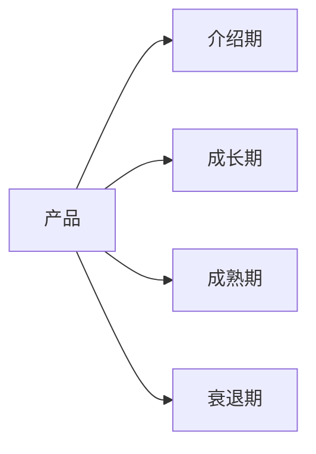

                 

### 第1章 问题背景与快速迭代时代概述

#### 1.1.1 问题的提出与背景

在当今信息化、数字化的浪潮下，产品的生命周期正在经历前所未有的缩短。传统制造业的产品，如汽车、家电等，其生命周期通常在十年以上；而在软件行业，一个应用软件的版本迭代周期可能只有几个月，甚至几周。这种现象在互联网领域尤为显著，如社交媒体、电商平台等，其产品迭代速度更是快到令人咋舌。

面对这种快速迭代的市场环境，企业面临着一系列问题：首先是如何在短时间内完成产品从研发到上市的全过程；其次是如何持续满足消费者不断变化的需求；再次是如何在激烈的竞争环境中保持市场竞争力。这些问题的背后，反映出了快速迭代时代对企业管理、产品开发、市场推广等各个方面提出的挑战。

为了应对这些问题，企业需要新的思路和方法。费雪的产品生命周期理论提供了一种新的视角，通过深入分析产品生命周期的各个阶段，帮助企业更好地理解市场变化，制定有效的应对策略。

#### 1.1.2 快速迭代时代的核心特征

1. **产品生命周期缩短**：在快速迭代时代，产品的研发、上市周期显著缩短。一方面，技术的快速发展使得新产品的推出更加便捷；另一方面，消费者需求的快速变化也迫使企业加快产品迭代速度。

2. **技术更新加快**：硬件、软件、算法等多方面的技术进步，使得产品的更新换代速度加快。例如，智能手机的硬件配置、操作系统和应用程序几乎每年都在更新，这使得用户对产品的期望也在不断攀升。

3. **消费者需求多变**：在互联网时代，消费者获取信息的渠道更加广泛，对产品的需求更加个性化和多样化。企业需要通过大数据分析和用户反馈，快速响应市场需求，提供满足消费者期望的产品。

#### 1.1.3 费雪的产品生命周期分析理论

费雪的产品生命周期理论是一个经典的市场营销理论，它将产品生命周期划分为介绍期、成长期、成熟期和衰退期四个阶段。在不同的阶段，产品的市场特征、竞争态势和营销策略都有所不同。

1. **介绍期**：产品刚刚推出，市场认知度低，销售额和利润较低。企业需要通过广告宣传、渠道建设等手段，提高产品的市场知名度。

2. **成长期**：产品开始受到市场的关注，销售额和利润快速增长。企业需要加强市场推广，扩大市场份额，同时关注产品的质量与性能，以满足消费者的需求。

3. **成熟期**：产品在市场上占据主导地位，销售额和利润达到顶峰。此时，企业需要通过差异化策略，保持市场竞争力，同时寻找新的市场机会。

4. **衰退期**：产品市场需求下降，销售额和利润逐渐减少。企业需要考虑产品的更新换代，或者寻找新的应用场景，以延长产品的生命周期。

费雪的产品生命周期分析理论为企业在快速迭代时代提供了重要的参考。通过深入理解产品生命周期的各个阶段，企业可以更好地制定产品策略，提高市场竞争力。

#### 1.1.4 快速迭代时代的挑战与机遇

1. **挑战**：
   - 市场竞争加剧：在快速迭代的时代，众多企业都在争夺市场份额，竞争愈发激烈。
   - 技术风险：技术的快速更新使得企业在选择技术方案时面临更大的风险。
   - 成本控制：快速迭代要求企业具备快速响应市场需求的能力，这往往意味着更高的成本。

2. **机遇**：
   - 技术创新：技术的快速进步为企业提供了创新的机遇，可以通过技术创新获得竞争优势。
   - 市场需求变化：消费者需求的快速变化为企业提供了新的市场机会，通过精准的市场定位可以更好地满足消费者需求。
   - 产品迭代速度：快速迭代使得企业能够更快地适应市场变化，提高市场竞争力。

#### 1.1.5 快速迭代时代的企业策略

1. **适应性策略**：企业需要具备快速适应市场变化的能力，灵活调整产品研发与市场推广策略，以应对快速变化的市场环境。

2. **创新驱动策略**：企业需要持续进行技术创新，保持市场竞争力。通过引入新技术、新产品，可以快速占领市场。

3. **协同合作策略**：企业需要与上下游企业、研究机构建立紧密的合作关系，共同推动技术创新和市场拓展。

#### 1.1.6 本章小结

快速迭代时代给企业带来了前所未有的挑战和机遇。通过引入费雪的产品生命周期分析理论，企业可以更好地理解市场变化，制定有效的应对策略。在快速迭代的市场环境中，企业需要具备适应性、创新驱动和协同合作的能力，以保持竞争优势。本章介绍了快速迭代时代的核心特征、费雪的产品生命周期分析理论，以及企业在快速迭代时代所面临的挑战与机遇，为企业提供了新的思路和方法。

---

### 第2章 费雪的产品生命周期分析框架

#### 2.1 费雪的产品生命周期理论框架

费雪的产品生命周期理论是一种经典的营销理论，它将产品生命周期划分为介绍期、成长期、成熟期和衰退期四个阶段。每个阶段都有其独特的市场特征和策略。

1. **介绍期**：
   - **特征**：产品刚刚推出，市场认知度低，消费者对其缺乏了解。销售额和利润较低。
   - **策略**：企业需要通过广告宣传、渠道建设等手段，提高产品的市场知名度。同时，提供优质的客户服务，建立良好的客户关系。

2. **成长期**：
   - **特征**：产品开始受到市场的关注，销售额和利润快速增长。竞争态势逐渐加剧。
   - **策略**：企业需要加强市场推广，扩大市场份额，同时关注产品的质量与性能，以满足消费者的需求。此外，企业还需要密切关注竞争对手的动向，及时调整策略。

3. **成熟期**：
   - **特征**：产品在市场上占据主导地位，销售额和利润达到顶峰。市场趋于饱和，竞争激烈。
   - **策略**：企业需要通过差异化策略，保持市场竞争力。可以通过产品创新、服务优化等方式，提高消费者的忠诚度。同时，寻找新的市场机会，如拓展海外市场。

4. **衰退期**：
   - **特征**：产品市场需求下降，销售额和利润逐渐减少。竞争减弱，产品逐渐退出市场。
   - **策略**：企业需要考虑产品的更新换代，或者寻找新的应用场景，以延长产品的生命周期。如果产品确实无法继续经营，企业可以考虑逐步退出市场，避免资源浪费。

费雪的产品生命周期理论提供了一个系统的方法，帮助企业理解产品在不同生命周期的市场特征和策略。通过合理运用这一理论，企业可以更好地应对市场变化，提高市场竞争力。

#### 2.2 产品生命周期的市场细分

市场细分是市场营销中的一个重要策略，通过将整个市场划分为不同的子市场，企业可以更精准地满足消费者的需求。费雪的产品生命周期理论在市场细分方面也提供了重要的指导。

1. **市场细分的重要性**：
   - **针对性更强**：通过市场细分，企业可以针对不同的子市场制定差异化的营销策略，提高营销效果。
   - **资源利用更高效**：市场细分有助于企业更有效地分配资源，避免资源的浪费。

2. **市场细分策略**：
   - **地理细分**：根据消费者的地理位置进行市场划分，如城市、乡村、区域等。
   - **人口细分**：根据消费者的年龄、性别、收入、职业等人口统计特征进行市场划分。
   - **行为细分**：根据消费者的购买行为、使用习惯等进行市场划分。
   - **心理细分**：根据消费者的心理特征、价值观、生活方式等进行市场划分。

3. **差异化市场策略与定位**：
   - **差异化策略**：企业可以根据不同的子市场，提供不同的产品和服务，以满足不同消费者的需求。
   - **市场定位**：企业需要明确自己的目标市场，通过独特的价值主张，在消费者心中建立鲜明的品牌形象。

通过市场细分，企业可以更精准地定位消费者，提高市场竞争力。费雪的产品生命周期理论为市场细分提供了理论依据，帮助企业更好地实施市场策略。

#### 2.3 产品定位与市场占有

产品定位是企业在市场竞争中的一项关键策略，通过明确产品的独特价值，在消费者心中建立品牌形象。市场占有则是企业通过营销策略，在市场上获得一定份额的过程。

1. **产品定位的原理**：
   - **明确目标市场**：企业需要根据市场细分的结果，明确目标市场，了解消费者的需求和期望。
   - **独特的价值主张**：企业需要通过独特的产品特性、服务或品牌形象，在消费者心中建立独特的价值主张。
   - **持续优化**：产品定位并非一成不变，企业需要根据市场变化和消费者反馈，持续优化产品定位。

2. **市场占有的策略**：
   - **市场份额的获取**：企业需要通过有效的市场推广、产品创新等方式，逐步扩大市场份额。
   - **市场份额的保持**：企业需要通过持续的产品优化、服务提升、品牌建设等手段，保持市场份额，提高消费者忠诚度。

通过有效的产品定位和市场占有策略，企业可以在激烈的市场竞争中脱颖而出，实现可持续发展。

#### 2.4 费雪理论的实践应用

费雪的产品生命周期理论在实践中的应用，可以帮助企业更好地应对快速迭代的市场环境。以下是一些实际案例：

1. **案例分析**：
   - **互联网企业**：以某互联网公司为例，其产品在介绍期通过大规模广告宣传和渠道建设，迅速提高市场知名度。在成长期，公司通过不断优化产品功能、提升用户体验，扩大市场份额。在成熟期，公司通过产品创新、服务优化等方式，保持市场竞争力。在衰退期，公司通过拓展海外市场，延长产品生命周期。
   - **消费品企业**：以某知名消费品公司为例，其产品在介绍期通过市场调研，明确目标消费者群体，制定差异化的营销策略。在成长期，公司通过广告宣传和促销活动，提高产品销量。在成熟期，公司通过产品创新、品牌升级等方式，巩固市场地位。在衰退期，公司通过产品优化、市场细分等方式，延长产品生命周期。

2. **经验分享**：
   - **成功经验**：通过成功的案例可以发现，费雪的产品生命周期理论在快速迭代时代具有很高的应用价值。企业需要根据市场变化，灵活调整产品策略，以适应快速迭代的市场环境。
   - **失败教训**：一些失败的案例也提醒我们，企业如果不及时调整产品策略，就会失去市场竞争力。因此，企业需要持续关注市场变化，及时调整产品生命周期策略。

通过实际案例和经验分享，我们可以看到费雪的产品生命周期理论在快速迭代时代具有重要的指导意义。企业需要深入理解这一理论，并结合实际情况，制定有效的产品策略。

#### 2.5 快速迭代时代下的费雪理论创新

在快速迭代时代，费雪的产品生命周期理论面临着一些新的挑战和机遇。为了更好地适应快速变化的市场环境，企业需要对费雪的理论进行创新和改进。

1. **传统费雪理论的局限性**：
   - **周期较长**：费雪的理论基于传统制造业的市场环境，产品的生命周期通常较长。而在快速迭代时代，产品的生命周期显著缩短，传统理论难以应对。
   - **竞争态势简单**：传统市场环境中，竞争态势相对简单，企业主要面对的是传统竞争对手。而在快速迭代时代，竞争态势更加复杂，企业需要面对来自多个方面的竞争压力。
   - **消费者需求变化慢**：在传统市场环境中，消费者需求变化相对缓慢，企业有足够的时间进行产品调整。而在快速迭代时代，消费者需求变化非常快，企业需要具备快速响应能力。

2. **快速迭代时代下的理论创新**：
   - **周期缩短**：在快速迭代时代，企业需要重新定义产品生命周期，将传统制造业的周期缩短。例如，产品的介绍期可能只有几个月，成长期也可能只有几季度。
   - **竞争态势复杂**：企业需要具备多元化竞争策略，不仅面对传统竞争对手，还要应对跨界竞争和新兴市场力量的挑战。
   - **消费者需求变化快**：企业需要通过大数据分析和用户反馈，快速响应消费者需求的变化，通过持续的产品迭代，满足消费者的多样化需求。

通过理论创新，企业可以更好地适应快速迭代时代的市场环境，提高市场竞争力。

#### 2.6 本章小结

快速迭代时代给费雪的产品生命周期理论带来了新的挑战和机遇。通过深入分析产品生命周期的各个阶段，企业可以更好地理解市场变化，制定有效的应对策略。市场细分、产品定位和市场占有是快速迭代时代企业成功的关键。费雪的产品生命周期理论在快速迭代时代具有重要的指导意义，企业需要结合实际情况，进行理论创新，以应对快速变化的市场环境。本章总结了快速迭代时代的核心特征、费雪的产品生命周期分析框架及其应用，为企业提供了新的思路和方法。

---

### 第3章 快速迭代时代的产品开发策略

#### 3.1 快速迭代的产品开发模式

在快速迭代时代，产品开发模式必须适应市场变化和技术进步的需求。敏捷开发、持续集成、持续交付是当前较为流行的快速迭代产品开发模式。

1. **敏捷开发**：
   - **定义**：敏捷开发是一种以人为核心、迭代、循序渐进的开发方法。
   - **特点**：强调团队协作、快速响应变化、持续交付可工作的软件。
   - **步骤**：需求分析、设计、开发、测试，每个步骤都是迭代进行的，允许在开发过程中根据用户反馈进行灵活调整。

2. **持续集成**：
   - **定义**：持续集成是一种软件开发实践，通过自动化构建和测试，确保代码库中的每个提交都是可集成的。
   - **特点**：自动检测代码缺陷、快速反馈、提高开发效率。
   - **步骤**：每次提交代码后，自动构建、测试、部署，确保代码质量。

3. **持续交付**：
   - **定义**：持续交付是一种通过自动化测试和部署，确保软件可以随时发布到生产环境的方法。
   - **特点**：快速交付、高可靠性、降低风险。
   - **步骤**：持续集成后的代码，通过自动化测试和部署，确保软件质量，实现快速上线。

通过敏捷开发、持续集成、持续交付，企业可以大幅提高产品开发的效率，快速响应市场需求。

#### 3.2 产品开发流程优化

在快速迭代时代，优化产品开发流程至关重要。以下是一些优化策略：

1. **敏捷开发原则**：
   - **用户反馈**：重视用户反馈，快速调整产品方向。
   - **持续改进**：不断优化流程，提高开发效率。
   - **小步快走**：每次迭代交付最小化功能，快速验证市场反应。

2. **需求分析**：
   - **快速响应**：采用快速需求收集和分析方法，确保需求及时转化为产品功能。
   - **优先级排序**：根据市场反馈和资源分配，优先处理高优先级的需求。

3. **设计**：
   - **用户体验**：以用户为中心进行设计，确保产品易用、高效。
   - **原型验证**：快速制作原型，通过用户测试验证设计可行性。

4. **开发**：
   - **模块化开发**：将复杂功能拆分为模块，提高开发效率。
   - **代码质量**：采用代码审查、单元测试等方法，确保代码质量。

5. **测试**：
   - **自动化测试**：构建自动化测试环境，快速发现和修复缺陷。
   - **持续测试**：在开发过程中持续进行测试，确保产品质量。

通过优化产品开发流程，企业可以更快地响应市场需求，提高产品质量。

#### 3.3 快速迭代时代的技术选择

在快速迭代时代，技术选择变得尤为重要。以下是一些技术选择策略：

1. **敏捷技术**：
   - **轻量级框架**：选择轻量级、易扩展的框架，如React、Vue等。
   - **容器化技术**：使用Docker、Kubernetes等技术，实现快速部署和扩展。

2. **前沿技术**：
   - **人工智能**：利用机器学习、深度学习等技术，提升产品智能化水平。
   - **区块链**：利用区块链技术，提高数据安全性和透明度。

3. **成熟技术**：
   - **成熟框架**：使用经过验证的成熟框架，如Spring Boot、Node.js等。
   - **云计算**：利用云计算资源，实现弹性扩展和高效计算。

4. **技术选择标准**：
   - **成本效益**：选择经济效益高、成本低的方案。
   - **可扩展性**：技术方案应具备良好的扩展性，适应业务增长。
   - **可维护性**：技术方案应易于维护，降低后续成本。

通过合理的技术选择，企业可以确保产品开发的高效和质量。

#### 3.4 产品质量保障

在快速迭代时代，产品质量保障变得尤为重要。以下是一些保障策略：

1. **代码审查**：
   - **定期审查**：定期进行代码审查，发现潜在问题。
   - **多人审查**：采用多人审查机制，提高代码质量。

2. **测试自动化**：
   - **自动化测试框架**：构建自动化测试框架，提高测试效率。
   - **持续测试**：在开发过程中持续进行测试，确保产品质量。

3. **质量度量**：
   - **度量指标**：设定质量度量指标，如缺陷密度、测试覆盖率等。
   - **实时监控**：实时监控关键指标，及时发现质量问题。

通过代码审查、测试自动化和质量度量，企业可以确保产品的高质量和稳定性。

#### 3.5 产品开发团队管理

在快速迭代时代，有效的团队管理至关重要。以下是一些团队管理策略：

1. **敏捷团队**：
   - **跨职能团队**：组建跨职能团队，确保项目顺利进行。
   - **快速响应**：团队成员具备快速响应能力，提高开发效率。

2. **团队建设**：
   - **沟通与协作**：建立有效的沟通机制，促进团队协作。
   - **培训与发展**：定期进行培训，提高团队技能水平。

3. **激励机制**：
   - **奖励机制**：设定合理的奖励机制，激励团队成员积极性。
   - **绩效评估**：定期进行绩效评估，激励团队成员持续改进。

通过敏捷团队管理，企业可以确保项目的高效完成。

#### 3.6 本章小结

快速迭代时代要求企业具备高效的产品开发策略。通过敏捷开发、持续集成、持续交付等模式，企业可以大幅提高开发效率。优化产品开发流程、合理选择技术、保障产品质量、有效团队管理是快速迭代时代产品开发的关键。本章总结了快速迭代时代的产品开发策略，为企业提供了新的思路和方法。企业需要结合实际情况，灵活运用这些策略，以提高市场竞争力。

---

### 第4章 快速迭代时代的产品营销策略

#### 4.1 快速迭代时代的市场变化

快速迭代时代带来了市场的深刻变化，这些变化对企业的产品营销策略产生了重要影响。

1. **消费者行为的变化**：
   - **个性化需求**：消费者对产品需求的个性化特征越来越明显，他们希望产品能够满足自己的独特需求。
   - **快速决策**：由于信息获取的便利性，消费者的购买决策过程变得更快，他们更倾向于快速购买。
   - **品牌忠诚度降低**：在快速迭代的市场中，消费者对品牌的忠诚度有所下降，他们更容易被新品牌和新产品吸引。

2. **市场需求的变化**：
   - **多样化和专业化**：市场需求变得更加多样化和专业化，消费者对某一类产品的需求变得更加明确。
   - **短期需求波动**：市场需求波动更加频繁，企业需要快速调整产品策略来适应市场的变化。
   - **快速迭代需求**：消费者对新产品的需求迅速变化，要求企业能够快速推出新的产品版本或功能。

3. **市场趋势的变化**：
   - **数字化营销**：数字化营销成为主流，企业需要利用大数据、人工智能等技术手段进行精准营销。
   - **社交媒体影响力**：社交媒体的影响力越来越大，企业需要通过社交媒体平台与消费者建立更紧密的联系。
   - **跨界融合**：不同行业的融合趋势增强，企业需要探索跨界合作的新模式，以扩大市场影响力。

#### 4.2 产品定位与市场推广

在快速迭代时代，产品定位和市场推广策略需要更加精准和灵活。

1. **产品定位**：
   - **明确目标市场**：企业需要明确自己的目标市场，了解消费者的需求和偏好，从而制定针对性的产品定位策略。
   - **独特价值主张**：产品定位不仅仅是针对目标市场，还需要有独特的价值主张，即产品与众不同的特点，能够吸引消费者的注意。
   - **动态调整**：由于市场需求的变化，企业需要根据市场反馈动态调整产品定位，以适应市场的新趋势。

2. **市场推广策略**：
   - **内容营销**：通过高质量的内容营销，提高品牌知名度和消费者信任度。
   - **社交媒体营销**：利用社交媒体平台进行营销，通过与消费者的互动，建立品牌忠诚度。
   - **精准营销**：利用大数据和人工智能技术，进行精准营销，提高营销效果。
   - **跨界合作**：通过与其他行业的合作，拓展市场边界，吸引新的消费者群体。

#### 4.3 快速迭代时代的品牌建设

在快速迭代时代，品牌建设变得尤为重要，企业需要采取一系列策略来建立和维护品牌形象。

1. **品牌建设的重要性**：
   - **差异化竞争**：品牌建设可以帮助企业实现差异化竞争，在众多产品中脱颖而出。
   - **消费者忠诚度**：强大的品牌形象可以增强消费者对品牌的忠诚度，提高复购率。
   - **市场份额**：良好的品牌形象可以提升市场竞争力，帮助企业获得更大的市场份额。

2. **品牌建设策略**：
   - **品牌定位**：明确品牌的定位，使品牌在消费者心中建立独特的印象。
   - **品牌传播**：通过多种渠道进行品牌传播，提高品牌知名度。
   - **品牌体验**：提供卓越的品牌体验，包括产品质量、售后服务等，增强消费者对品牌的认可。
   - **品牌管理**：建立完善的品牌管理体系，确保品牌形象的一致性和长期性。

#### 4.4 营销渠道创新

在快速迭代时代，营销渠道的创新对企业至关重要。

1. **线上渠道**：
   - **电子商务**：利用电子商务平台进行产品销售，实现全天候、全球范围的交易。
   - **社交媒体**：通过社交媒体进行品牌推广和用户互动，提高品牌影响力和用户参与度。

2. **线下渠道**：
   - **体验店**：建立实体体验店，提供消费者亲身体验的机会，增强消费者购买意愿。
   - **线下活动**：通过线下活动，如展览、促销活动等，提高品牌知名度和消费者参与度。

3. **多元化渠道**：
   - **O2O模式**：结合线上线下渠道，实现无缝购物体验。
   - **跨界渠道**：探索与其他行业结合的渠道，如与零售、旅游等行业的合作，扩大市场影响力。

#### 4.5 数据驱动营销

在快速迭代时代，数据驱动营销成为企业提高营销效果的重要手段。

1. **数据分析**：
   - **用户行为分析**：通过分析用户行为数据，了解消费者的需求和偏好。
   - **市场趋势分析**：通过分析市场数据，预测市场趋势，制定相应的营销策略。

2. **数据驱动策略**：
   - **个性化营销**：根据用户数据，提供个性化的产品推荐和营销信息。
   - **精准营销**：利用大数据技术，实现精准的市场定位和营销投放。
   - **实时营销**：通过实时数据，及时调整营销策略，提高营销效果。

#### 4.6 本章小结

快速迭代时代对企业的产品营销策略提出了新的要求。消费者行为、市场需求和市场趋势的变化要求企业采取更加精准和灵活的营销策略。产品定位、品牌建设、营销渠道创新和数据驱动营销是快速迭代时代产品营销的关键。企业需要深入理解这些变化，制定有效的营销策略，以保持市场竞争力。本章总结了快速迭代时代的产品营销策略，为企业提供了新的思路和方法。

---

### 第5章 快速迭代时代的风险管理与应对策略

#### 5.1 风险管理的概念与重要性

风险管理是指通过识别、评估、监控和应对潜在风险，以最小化负面影响的系统过程。在快速迭代时代，风险管理尤为重要，因为企业面临的市场和技术环境变化频繁，不确定性增加。

1. **风险管理的定义**：
   - 风险管理是一种系统性方法，用于识别、评估、管理和监控风险，以降低潜在损失。
   - 风险管理不仅包括识别和评估风险，还包括制定和实施风险缓解措施。

2. **风险管理的目的**：
   - 最大限度地减少潜在损失。
   - 保障企业运营的连续性。
   - 提高企业的抗风险能力。

3. **快速迭代时代风险管理的特殊性**：
   - 快速迭代导致产品生命周期缩短，风险暴露时间缩短。
   - 技术进步带来新技术风险。
   - 消费者需求变化快，市场风险增加。

#### 5.2 快速迭代时代的主要风险类型

在快速迭代时代，企业面临的风险类型多种多样，主要包括以下几类：

1. **技术风险**：
   - **技术更新风险**：技术迅速发展，旧技术可能迅速被淘汰，导致企业投资受损。
   - **研发风险**：产品研发过程中可能遇到技术难题，影响产品上市时间。
   - **数据安全风险**：数据泄露或被黑客攻击，可能导致经济损失和声誉受损。

2. **市场风险**：
   - **需求变化风险**：消费者需求快速变化，企业可能无法及时调整产品策略。
   - **竞争风险**：市场竞争激烈，企业面临市场份额被蚕食的风险。
   - **价格波动风险**：原材料价格波动，影响产品成本和利润。

3. **运营风险**：
   - **供应链风险**：供应链不稳定，可能导致生产中断或延迟。
   - **人员风险**：人才流失或团队协作问题，影响项目进度和质量。
   - **法律风险**：法律法规变化，可能导致企业运营受阻。

#### 5.3 风险评估方法

风险评估是风险管理的关键步骤，通过评估风险的严重性和发生概率，企业可以制定有效的风险缓解措施。

1. **定性评估方法**：
   - **专家判断**：通过专家意见和经验进行风险识别和评估。
   - **风险矩阵**：使用风险矩阵评估风险的严重性和发生概率。

2. **定量评估方法**：
   - **概率分布**：使用概率分布函数评估风险发生的概率。
   - **损失估算**：通过历史数据或模拟方法估算潜在损失。

#### 5.4 风险应对策略

在识别和评估风险后，企业需要制定和实施风险应对策略，以减轻风险带来的负面影响。

1. **风险规避**：
   - **避免**：通过改变产品策略或业务模式，避免与高风险相关的活动。
   - **转移**：通过购买保险或外包部分业务，将风险转移给第三方。

2. **风险减轻**：
   - **预防措施**：通过改进流程、加强管理和培训，降低风险发生的概率。
   - **紧急应对计划**：制定紧急应对计划，以快速响应风险事件。

3. **风险接受**：
   - **风险容忍**：对于一些无法避免或降低的风险，企业可以采取风险容忍策略。
   - **风险监控**：持续监控风险状况，及时调整应对策略。

#### 5.5 快速迭代时代的风险管理实践

以下是一些快速迭代时代的企业风险管理实践：

1. **敏捷风险管理**：
   - **快速响应**：采用敏捷方法进行风险管理，及时识别和响应新风险。
   - **迭代改进**：定期评估风险缓解措施的有效性，不断改进风险管理策略。

2. **全员风险管理**：
   - **培训与意识**：提高全员的风险管理意识，鼓励员工积极参与风险管理。
   - **沟通与协作**：建立有效的沟通机制，促进跨部门协作，共同应对风险。

3. **技术创新**：
   - **风险管理工具**：利用人工智能、大数据等技术，提高风险识别和评估的准确性。
   - **数字化风险管理**：通过数字化手段，实现风险管理的自动化和智能化。

#### 5.6 本章小结

快速迭代时代带来了新的挑战和风险，企业需要采取有效的风险管理策略，以应对这些风险。本章介绍了风险管理的概念和重要性，分析了快速迭代时代的主要风险类型，提出了风险评估方法和风险应对策略。通过敏捷风险管理、全员风险管理和技术创新，企业可以更好地应对快速迭代时代的风险，确保业务的连续性和稳定性。企业需要结合实际情况，制定和实施有效的风险管理策略，以保持竞争力。

---

### 第6章 费雪产品生命周期分析的实际应用与案例分析

#### 6.1 费雪产品生命周期分析的实际应用

费雪的产品生命周期分析理论在快速迭代时代依然具有重要应用价值，可以帮助企业更准确地把握市场变化，制定有效的产品策略。以下是一些实际应用案例：

1. **互联网行业**：
   - **案例分析**：以某知名互联网公司为例，该公司的产品生命周期管理过程非常成功。在产品的介绍期，公司通过大规模的市场调研和用户反馈，准确把握了市场需求，快速推出了符合用户期望的产品。在成长期，公司不断优化产品功能，提升用户体验，扩大市场份额。在成熟期，公司通过产品创新和品牌升级，巩固了市场地位。在衰退期，公司通过拓展新市场和应用场景，延长了产品生命周期。

2. **消费品行业**：
   - **案例分析**：以某知名消费品公司为例，该公司在产品生命周期的每个阶段都进行了精细化管理。在介绍期，公司通过广告宣传和渠道建设，提高了产品的市场知名度。在成长期，公司通过精准营销和消费者互动，提高了产品销量和用户忠诚度。在成熟期，公司通过产品差异化策略，保持了市场竞争力。在衰退期，公司通过产品优化和新市场开拓，延长了产品的生命周期。

#### 6.2 费雪产品生命周期分析的案例解析

以下通过具体案例，深入解析费雪产品生命周期分析在快速迭代时代中的应用：

1. **互联网公司产品生命周期管理**：

   **介绍期**：
   - **问题**：产品刚刚推出，市场认知度低，消费者对其缺乏了解。
   - **策略**：公司通过大数据分析和市场调研，了解目标用户的需求和偏好，制定精准的市场推广策略。同时，通过用户体验测试，收集用户反馈，不断优化产品。

   **成长期**：
   - **问题**：产品开始受到市场关注，但竞争激烈，市场份额不稳定。
   - **策略**：公司加强市场推广，通过广告、公关和社交媒体等手段提高品牌知名度。同时，持续优化产品功能，提升用户体验，增强用户粘性。

   **成熟期**：
   - **问题**：市场份额达到顶峰，但市场需求趋于饱和，竞争加剧。
   - **策略**：公司通过产品创新和品牌升级，保持市场竞争力。例如，推出新功能、改进产品外观、提升服务质量等。同时，寻找新市场机会，如拓展海外市场。

   **衰退期**：
   - **问题**：市场需求下降，销售额和利润减少。
   - **策略**：公司通过产品优化和细分市场，寻找新的应用场景，延长产品生命周期。如果产品确实无法继续经营，公司会逐步退出市场，避免资源浪费。

2. **消费品公司产品生命周期管理**：

   **介绍期**：
   - **问题**：新产品刚上市，消费者对其了解有限，购买意愿不高。
   - **策略**：公司通过广告宣传、促销活动、体验店等方式，提高产品的市场知名度。同时，通过与消费者互动，了解他们的需求和意见，不断改进产品。

   **成长期**：
   - **问题**：产品销量逐渐上升，但面临激烈的市场竞争。
   - **策略**：公司加强市场推广，通过差异化策略提高产品竞争力。例如，推出限量版产品、个性化定制服务等。同时，持续优化产品质量，提升消费者满意度。

   **成熟期**：
   - **问题**：市场份额稳定，但市场增长放缓，竞争加剧。
   - **策略**：公司通过产品创新和品牌升级，保持市场竞争力。例如，推出新品类、改进产品配方、提升品牌形象等。同时，拓展新市场，寻找新的增长点。

   **衰退期**：
   - **问题**：市场需求下降，销售额和利润减少。
   - **策略**：公司通过产品优化和细分市场，寻找新的应用场景。如果产品确实无法继续经营，公司会逐步退出市场，避免资源浪费。同时，关注新产品开发，为未来市场做好准备。

#### 6.3 案例分析与启示

通过上述案例分析，我们可以得出以下启示：

1. **准确把握市场变化**：在快速迭代时代，市场变化迅速，企业需要准确把握市场趋势和消费者需求，及时调整产品策略。

2. **持续创新**：在产品的生命周期中，持续创新是保持市场竞争力的重要手段。企业需要通过技术创新和产品升级，满足不断变化的市场需求。

3. **灵活应对竞争**：在激烈的市场竞争中，企业需要灵活应对竞争对手的挑战，通过差异化策略和独特价值主张，提高市场占有率。

4. **延长产品生命周期**：在产品生命周期进入衰退期时，企业可以通过产品优化、市场细分和新应用场景的探索，延长产品的生命周期。

#### 6.4 本章小结

费雪的产品生命周期分析理论在快速迭代时代具有广泛的应用价值。通过具体案例分析，我们可以看到，企业需要在不同阶段采取不同的策略，以应对市场变化和竞争挑战。准确把握市场变化、持续创新、灵活应对竞争和延长产品生命周期是快速迭代时代企业成功的关键。本章总结了费雪产品生命周期分析的实际应用和案例分析，为企业提供了新的思路和方法。

---

### 第7章 总结与展望

#### 7.1 快速迭代时代的挑战与机遇

快速迭代时代给企业带来了前所未有的挑战与机遇。一方面，市场变化迅速，消费者需求不断升级，企业需要快速响应市场变化，以保持竞争力。另一方面，技术的快速发展，特别是人工智能、大数据、云计算等新技术的广泛应用，为企业提供了新的创新机会和发展空间。

#### 7.2 费雪产品生命周期分析的理论贡献

费雪的产品生命周期分析理论为企业在快速迭代时代提供了重要的指导。通过深入理解产品生命周期的各个阶段，企业可以制定更加精准的市场策略，优化产品开发流程，提高产品质量，延长产品生命周期。费雪的理论不仅在传统制造业中具有广泛应用，在快速迭代时代同样具有巨大的现实意义。

#### 7.3 快速迭代时代的创新与发展

在快速迭代时代，企业需要不断创新，以适应市场变化和消费者需求。以下是一些创新与发展方向：

1. **技术创新**：持续投入研发，探索前沿技术，如人工智能、区块链等，以提升产品竞争力。

2. **商业模式创新**：探索新的商业模式，如共享经济、平台经济等，以拓展市场空间。

3. **管理模式创新**：采用敏捷管理、数据驱动管理等新型管理模式，提高管理效率和灵活性。

4. **产品与服务创新**：通过产品创新和服务创新，满足消费者的多样化需求，提升用户体验。

#### 7.4 未来展望

未来，快速迭代时代的企业竞争将更加激烈，市场变化速度将进一步加快。企业需要具备快速响应能力、持续创新能力、灵活应变能力，以应对市场挑战。同时，企业也需要加强与上下游企业的合作，共同推动技术创新和市场拓展。

#### 7.5 本章小结

快速迭代时代给企业带来了前所未有的挑战与机遇。费雪的产品生命周期分析理论为企业在这一时代提供了重要的指导，企业需要不断创新与发展，以保持竞争优势。未来，企业需要更加注重技术创新、商业模式创新和管理模式创新，以应对快速变化的市场环境。通过持续创新和灵活应对，企业可以在这个快速迭代的时代中取得成功。

---

### 附录

#### 附录1：关键词解释

- **快速迭代时代**：指在信息化、数字化浪潮下，产品生命周期显著缩短，市场需求变化迅速，企业需要快速响应的市场环境。
- **费雪的产品生命周期分析**：指将产品生命周期划分为介绍期、成长期、成熟期和衰退期，并针对不同阶段制定相应策略的市场营销理论。
- **敏捷开发**：一种以人为核心、迭代、循序渐进的开发方法，强调快速响应变化、持续交付可工作的软件。
- **持续集成**：一种软件开发实践，通过自动化构建和测试，确保代码库中的每个提交都是可集成的。
- **持续交付**：一种通过自动化测试和部署，确保软件可以随时发布到生产环境的方法。

#### 附录2：概念图与公式

**费雪的产品生命周期理论ER实体关系图**：



**产品生命周期阶段特征对比表**：

| 阶段     | 特征                              | 策略                                      |
| -------- | -------------------------------- | ----------------------------------------- |
| 介绍期   | 市场认知度低，销售额和利润较低   | 广告宣传、渠道建设、客户服务              |
| 成长期   | 销售额和利润快速增长             | 市场推广、产品优化、市场调研              |
| 成熟期   | 销售额和利润达到顶峰             | 产品创新、品牌升级、市场拓展              |
| 衰退期   | 市场需求下降，销售额和利润减少   | 产品优化、市场细分、新应用场景探索          |

**算法原理公式**：

$$
f(n) = 2^n
$$

$$
1 + 1 = 2
$$

#### 附录3：代码示例

**Python代码示例**：

```python
# 快速迭代产品的生命周期分析示例

def product_life_cycle阶段(阶段):
    if 阶段 == "介绍期":
        return "广告宣传、渠道建设、客户服务"
    elif 阶段 == "成长期":
        return "市场推广、产品优化、市场调研"
    elif 阶段 == "成熟期":
        return "产品创新、品牌升级、市场拓展"
    elif 阶段 == "衰退期":
        return "产品优化、市场细分、新应用场景探索"
    else:
        return "未知阶段"

# 测试代码
阶段策略 = product_life_cycle阶段("成长期")
print(阶段策略)
```

**代码应用解读**：

这段Python代码定义了一个函数`product_life_cycle阶段`，用于根据产品生命周期的阶段返回相应的策略。通过输入不同的阶段，如“介绍期”、“成长期”、“成熟期”和“衰退期”，函数将返回对应阶段的策略。例如，当输入“成长期”时，函数将返回“市场推广、产品优化、市场调研”。这段代码体现了费雪的产品生命周期分析理论在快速迭代时代中的应用，通过程序化方式，为企业提供了决策支持。

#### 附录4：最佳实践与注意事项

**最佳实践**：

1. **市场调研**：在产品生命周期的每个阶段，定期进行市场调研，了解消费者需求和竞争态势。
2. **敏捷管理**：采用敏捷开发方法，提高团队协作效率和响应速度。
3. **持续优化**：持续优化产品和服务，以满足消费者不断变化的需求。
4. **技术创新**：紧跟技术发展趋势，不断探索新技术在产品开发中的应用。

**注意事项**：

1. **风险控制**：在快速迭代过程中，要注意风险控制，避免因频繁迭代导致的资源浪费和质量问题。
2. **团队协作**：加强团队协作，确保每个成员都能够清晰理解产品策略和目标。
3. **数据驱动**：利用大数据和用户反馈，制定科学的数据驱动决策。
4. **持续学习**：在快速迭代时代，企业需要不断学习和适应新技术、新趋势，以保持竞争力。

#### 附录5：拓展阅读

- **《快速迭代：打造创新性企业的实践指南》**
- **《敏捷项目管理：敏捷实践指南》**
- **《数据驱动营销：如何用数据提升营销效果》**
- **《产品经理实战手册：从0到1打造爆品》**

这些书籍和资料提供了更深入的讨论和案例分析，有助于读者进一步理解快速迭代时代的市场环境和产品开发策略。

