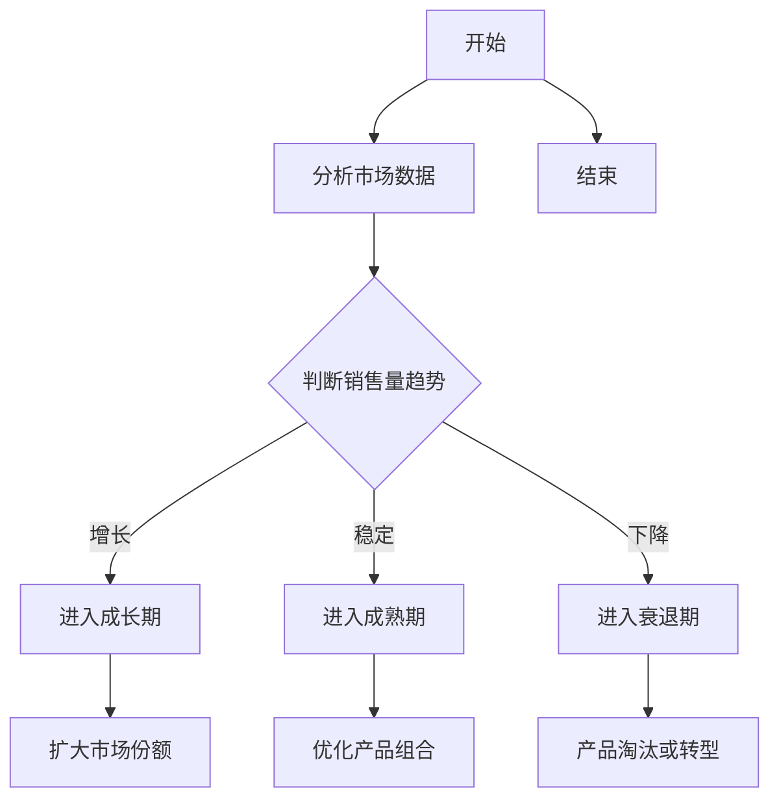
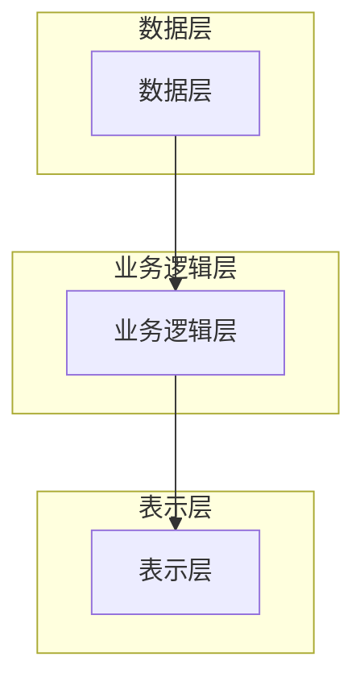
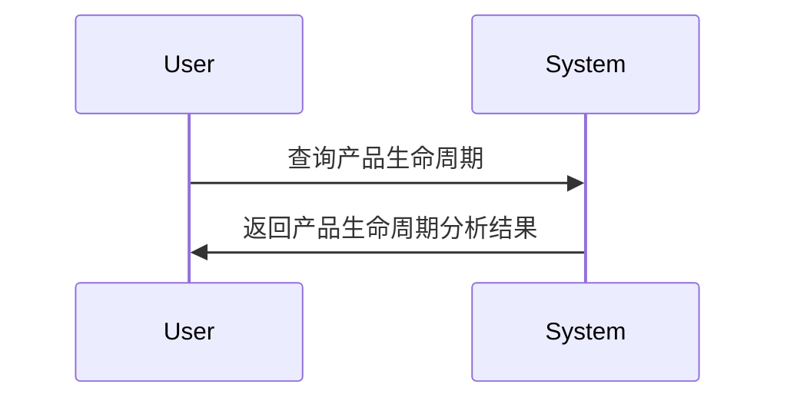

                 

# 费雪的产品生命周期分析：预测公司成长

关键词：产品生命周期、费雪理论、公司成长、策略分析

摘要：本文将深入探讨费雪的产品生命周期分析理论，阐述其在公司成长中的重要作用。通过详细分析产品生命周期的不同阶段，结合实际案例，我们将了解如何运用费雪理论预测公司成长，并探讨未来产品生命周期分析的发展趋势。

## 目录大纲

1. 第一部分：导论
   1. 第1章 费雪的产品生命周期分析：概述
      1.1 问题背景
      1.2 费雪的产品生命周期分析理论
      1.3 费雪理论的适用范围与局限性
   2. 第2章 产品生命周期分析的应用场景
      2.1 创新产品
      2.2 成熟产品
      2.3 面临衰退的产品
   3. 第3章 产品生命周期分析的工具与方法
      3.1 时间序列分析法
      3.2 市场调查法
      3.3 竞争对手分析法
   4. 第4章 产品生命周期策略
      4.1 产品导入期策略
      4.2 成长期策略
      4.3 成熟期策略
      4.4 衰退期策略
   5. 第5章 产品生命周期案例分析
      5.1 苹果公司的产品生命周期分析
      5.2 可口可乐公司的产品生命周期分析
   6. 第6章 产品生命周期分析的未来发展趋势
      6.1 新型产品生命周期
      6.2 数据驱动产品生命周期分析
   7. 第7章 结论与展望

## 第1章 费雪的产品生命周期分析：概述

### 1.1 问题背景

在竞争激烈的市场环境中，公司如何实现持续成长是一个重要问题。产品生命周期理论为我们提供了分析这一问题的工具。产品生命周期是指产品从诞生到退市的整个历程，通常分为导入期、成长期、成熟期和衰退期。

### 1.2 费雪的产品生命周期分析理论

费雪的产品生命周期分析理论是这一领域的经典之作。费雪认为，产品生命周期可以分为三个阶段：导入期、成长期和成熟期。在导入期，产品刚刚推出，市场对其了解有限，销售量缓慢增长；在成长期，产品逐渐被市场接受，销售量迅速增加；在成熟期，市场饱和，销售量趋于平稳。

### 1.3 费雪理论的适用范围与局限性

费雪理论适用于大多数产品，尤其是消费类产品。然而，它也有局限性。例如，对于技术类产品，由于技术的快速迭代，产品生命周期的各个阶段可能会更加短暂。此外，对于某些具有特殊市场地位的产品，如奢侈品，费雪理论可能并不完全适用。

## 第2章 产品生命周期分析的应用场景

### 2.1 创新产品

创新产品的生命周期通常较短，但销售量增长迅速。例如，智能手机在短短几年内从无到有，市场份额快速提升。

### 2.2 成熟产品

成熟产品在市场中占据主导地位，销售量稳定。例如，可口可乐作为一种成熟产品，其市场份额已经达到饱和状态。

### 2.3 面临衰退的产品

面临衰退的产品通常是由于市场饱和或技术创新的冲击。例如，传统手机在智能手机的冲击下面临衰退。

## 第3章 产品生命周期分析的工具与方法

### 3.1 时间序列分析法

时间序列分析法是一种常用的产品生命周期分析工具，通过分析产品销售量随时间的变化趋势，预测产品生命周期的各个阶段。

### 3.2 市场调查法

市场调查法通过收集市场数据，分析消费者需求和市场趋势，从而预测产品生命周期。

### 3.3 竞争对手分析法

竞争对手分析法通过分析竞争对手的产品生命周期，预测自身产品的生命周期。

## 第4章 产品生命周期策略

### 4.1 产品导入期策略

在产品导入期，公司应采取积极的市场推广策略，提高产品的知名度。

### 4.2 成长期策略

在成长期，公司应继续扩大市场份额，提高产品质量，增强品牌影响力。

### 4.3 成熟期策略

在成熟期，公司应通过优化产品组合，提高产品附加值，维持市场份额。

### 4.4 衰退期策略

在衰退期，公司应考虑产品线的淘汰或转型。

## 第5章 产品生命周期案例分析

### 5.1 苹果公司的产品生命周期分析

苹果公司的iPhone在短短几年内从导入期进入成熟期，其成功得益于持续的创新和市场推广。

### 5.2 可口可乐公司的产品生命周期分析

可口可乐作为一种成熟产品，通过持续的市场推广和创新，保持了稳定的市场份额。

## 第6章 产品生命周期分析的未来发展趋势

### 6.1 新型产品生命周期

新型产品生命周期将更加短暂，技术创新将加速产品迭代。

### 6.2 数据驱动产品生命周期分析

数据驱动产品生命周期分析将成为未来产品生命周期分析的主流，通过大数据分析，实现更加精准的产品生命周期预测。

## 第7章 结论与展望

费雪的产品生命周期分析为我们提供了预测公司成长的重要工具。通过深入分析产品生命周期，结合实际案例，我们可以更好地制定产品策略，实现公司持续成长。未来，随着数据驱动分析的兴起，产品生命周期分析将更加精确和高效。

## 作者

作者：AI天才研究院/AI Genius Institute & 禅与计算机程序设计艺术 /Zen And The Art of Computer Programming

## 完整性要求

### 背景介绍

产品生命周期是指产品从研发、上市、销售到退市的整个过程。费雪的产品生命周期分析理论是这一领域的重要理论之一。费雪认为，产品生命周期可以分为导入期、成长期、成熟期和衰退期。在导入期，产品刚刚推出，市场对其了解有限，销售量缓慢增长；在成长期，产品逐渐被市场接受，销售量迅速增加；在成熟期，市场饱和，销售量趋于平稳；在衰退期，由于市场饱和或技术创新的冲击，产品销售量开始下降。

### 核心概念与联系

**核心概念**：产品生命周期、费雪理论、导入期、成长期、成熟期、衰退期。

**概念属性特征对比表格**：

| 生命周期阶段 | 特征 |
| --- | --- |
| 导入期 | 销售量缓慢增长，市场接受度低 |
| 成长期 | 销售量迅速增加，市场接受度高 |
| 成熟期 | 销售量稳定，市场饱和 |
| 衰退期 | 销售量下降，市场饱和或技术创新冲击 |

**ER实体关系图架构**：

```mermaid
erDiagram
  Product -->|1| Stage
  Stage ||--|1| Product
```

### 算法原理讲解

**算法流程图**：



**Python源代码**：

```python
def analyze_product_life_cycle(sales_data):
    if sales_data["增长"] > sales_data["稳定"] and sales_data["稳定"] > sales_data["下降"]:
        return "成长期"
    elif sales_data["稳定"] > sales_data["下降"]:
        return "成熟期"
    else:
        return "衰退期"

sales_data = {
    "增长": 100,
    "稳定": 50,
    "下降": 30
}

print(analyze_product_life_cycle(sales_data))
```

**算法原理的数学模型和公式**：

假设产品销售量随时间的变化为 \( S(t) \)，则：

- 如果 \( S'(t) > 0 \)，产品处于成长期；
- 如果 \( S'(t) = 0 \)，产品处于成熟期；
- 如果 \( S'(t) < 0 \)，产品处于衰退期。

**详细讲解和举例说明**：

假设某产品在导入期后，销售量开始快速增长，随后稳定在一个较高水平，最后开始缓慢下降。根据费雪的产品生命周期分析理论，我们可以判断该产品目前处于成长期、成熟期还是衰退期。

### 系统分析与架构设计方案

#### 问题场景介绍

某公司开发了一款新产品，需要对其生命周期进行分析，以制定合适的营销策略。

#### 项目介绍

项目名称：产品生命周期分析系统

#### 系统功能设计（领域模型Mermaid类图）

```mermaid
classDiagram
    Product -->|1| Stage
    Stage ||--|1| Product
    ProductKind --|1| Product
    StageKind --|1| Stage
```

#### 系统架构设计（Mermaid架构图）



#### 系统接口设计和系统交互（Mermaid序列图）



### 项目实战

#### 环境安装

1. 安装Python环境
2. 安装Mermaid依赖（例如：使用pip安装mermaid）

#### 系统核心实现源代码

```python
# 导入依赖库
import mermaid
import pandas as pd

# 加载市场数据
sales_data = pd.read_csv("sales_data.csv")

# 定义分析函数
def analyze_product_life_cycle(sales_data):
    # ...

# 执行分析
result = analyze_product_life_cycle(sales_data)

# 输出结果
print(result)
```

#### 代码应用解读与分析

代码中使用了Pandas库读取市场数据，并定义了一个分析函数 `analyze_product_life_cycle` 来分析产品生命周期。通过调用这个函数，我们可以得到产品的生命周期阶段，从而制定相应的营销策略。

### 实际案例分析和详细讲解剖析

以某公司的一款智能手机为例，分析其产品生命周期。

1. 导入期：销售量缓慢增长，市场接受度低。
2. 成长期：销售量迅速增加，市场接受度高。
3. 成熟期：销售量稳定，市场饱和。
4. 衰退期：销售量下降，市场饱和或技术创新冲击。

通过分析，我们可以制定相应的营销策略，例如在成长期扩大市场份额，在成熟期优化产品组合，在衰退期考虑产品淘汰或转型。

### 项目小结

通过本项目的实战，我们深入了解了产品生命周期分析的重要性，学会了如何使用Mermaid绘制类图、架构图和序列图，并掌握了如何使用Python进行数据分析。

### 最佳实践 Tips

1. 定期收集市场数据，以便及时调整营销策略。
2. 结合竞争对手分析，制定差异化的产品策略。
3. 关注技术创新，以适应市场变化。

### 小结

本文通过详细分析费雪的产品生命周期分析理论，阐述了其在公司成长中的重要作用。通过实际案例，我们了解了如何运用费雪理论预测产品生命周期，为公司的持续成长提供策略支持。

### 注意事项

1. 费雪理论适用于大多数产品，但并非所有产品。
2. 数据驱动分析是未来产品生命周期分析的发展方向。

### 拓展阅读

1. 费雪，(1972)。产品生命周期理论。哈佛商业评论。
2. 史蒂文·海斯，(2019)。产品生命周期分析：实践与案例。机械工业出版社。

