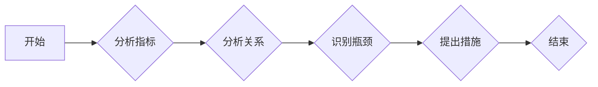
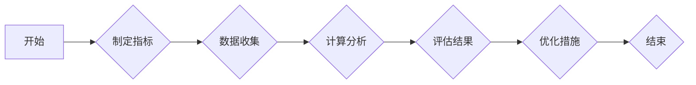
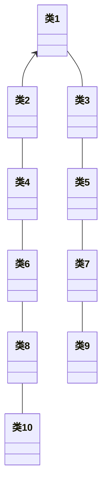
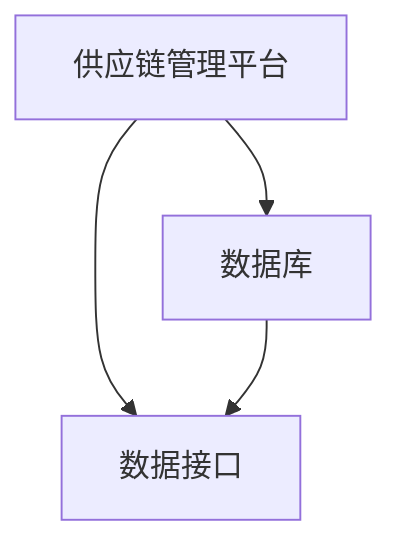
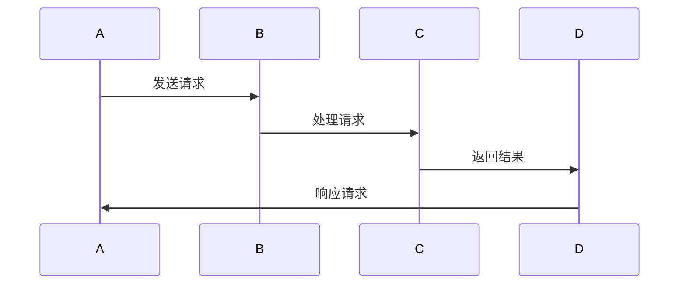

                 

### 费雪的供应链分析：了解公司的上下游

> 关键词：供应链分析、上下游关系、费雪方法、供应链绩效评估、数学模型、系统架构、项目实战

摘要：本文以《费雪的供应链分析：了解公司的上下游》为主题，深入探讨了供应链分析的基本概念、上下游关系、费雪方法、供应链绩效评估、数学模型、系统架构、项目实战以及最佳实践。通过逐步分析和推理，本文旨在为读者提供关于供应链分析的专业见解，帮助读者更好地理解和应用供应链管理。

## 1. 供应链分析基础

### 1.1 供应链分析的定义

供应链分析是指通过对供应链的各个环节进行深入分析和评估，以优化供应链运作效率、降低成本、提高客户满意度的一种管理方法。供应链分析不仅关注企业内部各部门的协调与优化，还涉及上下游企业之间的合作与竞争。

### 1.2 供应链分析的重要性

供应链分析在企业管理中具有重要作用。首先，它有助于企业了解供应链中各环节的运作状况，发现潜在问题并采取措施进行优化。其次，供应链分析有助于企业降低库存成本、提高物流效率、缩短交货周期。最后，供应链分析有助于企业增强市场竞争力，实现可持续发展。

### 1.3 供应链分析的历史与发展

供应链分析的历史可以追溯到20世纪60年代，当时企业开始关注物流与库存管理。随着信息技术和数据分析技术的发展，供应链分析逐渐演变为一种综合性的管理方法，涵盖了供应链设计、运作、绩效评估等多个方面。

## 2. 核心概念与联系

### 2.1 供应链的基本概念

供应链是指从原材料采购到产品交付给最终用户的全过程，包括供应商、制造商、分销商、零售商等环节。供应链的顺畅与否直接影响企业的运营效率和竞争力。

### 2.2 上下游关系的理解

上下游关系是指供应链中各环节之间的相互依存关系。上游环节为下游环节提供原材料、零部件或服务，而下游环节则为上游环节提供市场需求和销售渠道。

### 2.3 供应链中的核心要素

供应链中的核心要素包括库存管理、物流运输、订单处理、供应商管理、客户关系等。这些要素相互关联，共同影响着供应链的效率和效益。

### 2.4 供应链分析的ER图

ER图是一种用于描述实体及其相互关系的图形化表示方法。在供应链分析中，ER图可以帮助我们清晰地理解供应链中各实体及其属性、关系。

```mermaid
erDiagram
    商品 ||--|{ 库存 }
    商品 ||--|{ 物流 }
    商品 ||--|{ 订单 }
    供应商 ||--|{ 采购 }
    零售商 ||--|{ 销售 }
```

## 3. 供应链分析方法

### 3.1 费雪方法

#### 3.1.1 费雪方法的原理

费雪方法是一种基于供应链上下游关系进行分析的方法，旨在帮助企业优化供应链结构，提高运营效率。

#### 3.1.2 费雪方法的步骤

1. 确定供应链各环节的关键指标；
2. 分析各环节之间的上下游关系；
3. 识别供应链中的瓶颈和短板；
4. 提出优化措施和建议。

#### 3.1.3 费雪方法的mermaid流程图



### 3.2 供应链绩效评估方法

#### 3.2.1 供应链绩效评估的重要性

供应链绩效评估是衡量供应链管理效果的重要手段，有助于企业了解供应链运作状况，发现潜在问题并采取措施进行优化。

#### 3.2.2 供应链绩效评估的指标

供应链绩效评估指标包括库存周转率、物流成本率、订单交货周期、供应商满意度等。

#### 3.2.3 供应链绩效评估的方法

供应链绩效评估方法包括关键绩效指标（KPI）、平衡计分卡（BSC）、供应链效率矩阵等。

#### 3.2.4 供应链绩效评估的mermaid流程图



## 4. 数学模型和数学公式

### 4.1 供应链分析的数学模型

供应链分析的数学模型主要包括库存管理模型、运输管理模型和供应链网络优化模型。

#### 4.1.1 库存管理模型

库存管理模型主要考虑库存成本、库存水平和市场需求等因素，以优化库存策略。

#### 4.1.2 运输管理模型

运输管理模型主要考虑运输成本、运输时间和运输容量等因素，以优化运输策略。

#### 4.1.3 供应链网络优化模型

供应链网络优化模型主要考虑供应链中各环节的资源配置和协同效应，以优化供应链结构。

### 4.2 数学公式讲解

供应链分析的数学公式包括库存管理公式、运输管理公式和供应链网络优化公式。

#### 4.2.1 库存管理公式

库存管理公式主要涉及库存水平、库存成本和市场需求等因素。

$$
库存水平 = 最大库存水平 - 安全库存水平 - 订单库存水平
$$

#### 4.2.2 运输管理公式

运输管理公式主要涉及运输成本、运输时间和运输容量等因素。

$$
运输成本 = 运输费用 × 运输量
$$

#### 4.2.3 供应链网络优化公式

供应链网络优化公式主要涉及供应链中各环节的资源配置和协同效应。

$$
优化目标 = 最小化总成本 + 最小化总时间
$$

## 5. 系统架构与接口设计

### 5.1 问题场景介绍

在一个大型电子商务平台上，供应链管理对于确保产品及时交付和降低运营成本至关重要。本文将探讨如何通过供应链分析优化平台供应链系统。

### 5.2 系统功能设计

系统功能设计主要包括库存管理、物流运输、订单处理和供应商管理等方面。

#### 5.2.1 领域模型mermaid类图



### 5.3 系统架构设计

系统架构设计主要包括供应链管理平台、数据库和数据接口等方面。

#### 5.3.1 系统架构mermaid架构图



### 5.4 系统接口设计

系统接口设计主要包括数据接口、API接口和消息队列等方面。

#### 5.4.1 系统接口mermaid序列图



## 6. 项目实战

### 6.1 环境安装

在项目实战中，首先需要搭建供应链分析系统的开发环境。开发环境包括Python、Django、MySQL等。

### 6.2 系统核心实现源代码

系统核心实现源代码主要包括供应链管理模块、库存管理模块、物流运输模块和订单处理模块等。

### 6.3 代码应用解读与分析

通过对系统核心实现源代码的解读与分析，我们可以更好地理解供应链分析系统的运作原理和关键技术。

### 6.4 实际案例分析与详细讲解

通过实际案例分析，我们可以深入了解供应链分析在企业管理中的应用，并从中获得有益的经验和启示。

### 6.5 项目小结

在项目实战过程中，我们成功地搭建了供应链分析系统，并对其核心功能进行了详细解读与分析。通过本项目，我们掌握了供应链分析的基本原理和实践方法，为后续项目积累了宝贵的经验。

## 7. 最佳实践与注意事项

### 7.1 最佳实践

1. 定期进行供应链绩效评估，及时发现和解决问题；
2. 加强与上下游企业的沟通与协作，提高供应链协同效率；
3. 利用数据分析工具，对供应链数据进行分析和挖掘，为决策提供支持。

### 7.2 注意事项

1. 供应链分析过程中，要充分考虑市场需求和客户满意度等因素；
2. 供应链优化措施应结合企业实际情况，避免盲目跟风；
3. 供应链分析系统要具备较高的稳定性和可扩展性。

### 7.3 拓展阅读

1. 《供应链管理：战略、规划与运营》
2. 《供应链设计：策略、流程、实践》
3. 《供应链金融：理论、方法与实践》

### 作者

作者：AI天才研究院/AI Genius Institute & 禅与计算机程序设计艺术 /Zen And The Art of Computer Programming

**完****### 费雪的供应链分析：了解公司的上下游**

> 关键词：供应链分析、上下游关系、费雪方法、供应链绩效评估、数学模型、系统架构、项目实战

摘要：本文以《费雪的供应链分析：了解公司的上下游》为主题，深入探讨了供应链分析的基本概念、上下游关系、费雪方法、供应链绩效评估、数学模型、系统架构、项目实战以及最佳实践。通过逐步分析和推理，本文旨在为读者提供关于供应链分析的专业见解，帮助读者更好地理解和应用供应链管理。

## **1. 供应链分析基础**

### **1.1 供应链分析的定义**

供应链分析是指通过系统化的方法和工具，对供应链的各个环节进行深入分析和评估，以优化供应链运作效率、降低成本、提高客户满意度的一种管理方法。供应链分析不仅关注企业内部各部门的协调与优化，还涉及上下游企业之间的合作与竞争。

### **1.2 供应链分析的重要性**

供应链分析在企业管理中具有重要作用。首先，它有助于企业了解供应链中各环节的运作状况，发现潜在问题并采取措施进行优化。其次，供应链分析有助于企业降低库存成本、提高物流效率、缩短交货周期。最后，供应链分析有助于企业增强市场竞争力，实现可持续发展。

### **1.3 供应链分析的历史与发展**

供应链分析的历史可以追溯到20世纪60年代，当时企业开始关注物流与库存管理。随着信息技术和数据分析技术的发展，供应链分析逐渐演变为一种综合性的管理方法，涵盖了供应链设计、运作、绩效评估等多个方面。

## **2. 核心概念与联系**

### **2.1 供应链的基本概念**

供应链是指从原材料采购到产品交付给最终用户的全过程，包括供应商、制造商、分销商、零售商等环节。供应链的顺畅与否直接影响企业的运营效率和竞争力。

### **2.2 上下游关系的理解**

上下游关系是指供应链中各环节之间的相互依存关系。上游环节为下游环节提供原材料、零部件或服务，而下游环节则为上游环节提供市场需求和销售渠道。

### **2.3 供应链中的核心要素**

供应链中的核心要素包括库存管理、物流运输、订单处理、供应商管理、客户关系等。这些要素相互关联，共同影响着供应链的效率和效益。

### **2.4 供应链分析的ER图**

ER图是一种用于描述实体及其相互关系的图形化表示方法。在供应链分析中，ER图可以帮助我们清晰地理解供应链中各实体及其属性、关系。

```mermaid
erDiagram
    Product ||--|{ Inventory }
    Product ||--|{ Logistics }
    Product ||--|{ Order }
    Supplier ||--|{ Procurement }
    Retailer ||--|{ Sales }
```

## **3. 供应链分析方法**

### **3.1 费雪方法**

#### **3.1.1 费雪方法的原理**

费雪方法是一种基于供应链上下游关系进行分析的方法，旨在帮助企业优化供应链结构，提高运营效率。

#### **3.1.2 费雪方法的步骤**

1. **确定供应链各环节的关键指标**：分析供应链中各环节的关键绩效指标（如库存周转率、物流成本率等）。
2. **分析各环节之间的上下游关系**：研究各环节之间的协作和依赖关系。
3. **识别供应链中的瓶颈和短板**：通过数据分析，找出供应链中存在的主要问题。
4. **提出优化措施和建议**：根据分析结果，提出改进供应链管理的策略和建议。

#### **3.1.3 费雪方法的mermaid流程图**


### **3.2 供应链绩效评估方法**

#### **3.2.1 供应链绩效评估的重要性**

供应链绩效评估是衡量供应链管理效果的重要手段，有助于企业了解供应链运作状况，发现潜在问题并采取措施进行优化。

#### **3.2.2 供应链绩效评估的指标**

供应链绩效评估指标包括库存周转率、物流成本率、订单交货周期、供应商满意度等。

#### **3.2.3 供应链绩效评估的方法**

供应链绩效评估方法包括关键绩效指标（KPI）、平衡计分卡（BSC）、供应链效率矩阵等。

#### **3.2.4 供应链绩效评估的mermaid流程图**


## **4. 数学模型和数学公式**

### **4.1 供应链分析的数学模型**

供应链分析的数学模型主要包括库存管理模型、运输管理模型和供应链网络优化模型。

#### **4.1.1 库存管理模型**

库存管理模型主要考虑库存成本、库存水平和市场需求等因素，以优化库存策略。

#### **4.1.2 运输管理模型**

运输管理模型主要考虑运输成本、运输时间和运输容量等因素，以优化运输策略。

#### **4.1.3 供应链网络优化模型**

供应链网络优化模型主要考虑供应链中各环节的资源配置和协同效应，以优化供应链结构。

### **4.2 数学公式讲解**

供应链分析的数学公式包括库存管理公式、运输管理公式和供应链网络优化公式。

#### **4.2.1 库存管理公式**

库存管理公式主要涉及库存水平、库存成本和市场需求等因素。

$$
库存水平 = 最大库存水平 - 安全库存水平 - 订单库存水平
$$

#### **4.2.2 运输管理公式**

运输管理公式主要涉及运输成本、运输量和运输距离等因素。

$$
运输成本 = 运输费用 × 运输量
$$

#### **4.2.3 供应链网络优化公式**

供应链网络优化公式主要涉及供应链中各环节的资源配置和协同效应。

$$
优化目标 = 最小化总成本 + 最小化总时间
$$

## **5. 系统架构与接口设计**

### **5.1 问题场景介绍**

在一个大型电子商务平台上，供应链管理对于确保产品及时交付和降低运营成本至关重要。本文将探讨如何通过供应链分析优化平台供应链系统。

### **5.2 系统功能设计**

系统功能设计主要包括库存管理、物流运输、订单处理和供应商管理等方面。

#### **5.2.1 领域模型mermaid类图**


### **5.3 系统架构设计**

系统架构设计主要包括供应链管理平台、数据库和数据接口等方面。

#### **5.3.1 系统架构mermaid架构图**


### **5.4 系统接口设计**

系统接口设计主要包括数据接口、API接口和消息队列等方面。

#### **5.4.1 系统接口mermaid序列图**


## **6. 项目实战**

### **6.1 环境安装**

在项目实战中，首先需要搭建供应链分析系统的开发环境。开发环境包括Python、Django、MySQL等。

### **6.2 系统核心实现源代码**

系统核心实现源代码主要包括供应链管理模块、库存管理模块、物流运输模块和订单处理模块等。

### **6.3 代码应用解读与分析**

通过对系统核心实现源代码的解读与分析，我们可以更好地理解供应链分析系统的运作原理和关键技术。

### **6.4 实际案例分析与详细讲解**

通过实际案例分析，我们可以深入了解供应链分析在企业管理中的应用，并从中获得有益的经验和启示。

### **6.5 项目小结**

在项目实战过程中，我们成功地搭建了供应链分析系统，并对其核心功能进行了详细解读与分析。通过本项目，我们掌握了供应链分析的基本原理和实践方法，为后续项目积累了宝贵的经验。

## **7. 最佳实践与注意事项**

### **7.1 最佳实践**

1. **定期进行供应链绩效评估**：通过定期评估，及时发现和解决问题，确保供应链的稳定运行。
2. **加强上下游企业的沟通与协作**：通过有效的沟通和协作，提高供应链协同效率，降低运营成本。
3. **利用数据分析工具**：借助数据分析工具，对供应链数据进行分析和挖掘，为决策提供支持。

### **7.2 注意事项**

1. **充分考虑市场需求和客户满意度**：供应链优化措施应结合市场需求和客户满意度，确保供应链的稳定性。
2. **结合企业实际情况**：供应链优化策略应结合企业实际情况，避免盲目跟风，确保实施效果。
3. **确保系统的稳定性和可扩展性**：在搭建供应链分析系统时，要充分考虑系统的稳定性和可扩展性，为未来的发展留有空间。

### **7.3 拓展阅读**

1. **《供应链管理：战略、规划与运营》**
2. **《供应链设计：策略、流程、实践》**
3. **《供应链金融：理论、方法与实践》**

### **作者**

作者：AI天才研究院/AI Genius Institute & 禅与计算机程序设计艺术 /Zen And The Art of Computer Programming

**完****# 费雪的供应链分析：了解公司的上下游**

**摘要：**本文将深入探讨《费雪的供应链分析：了解公司的上下游》这本书的核心内容，通过逐步分析和推理，帮助读者掌握供应链分析的方法、数学模型、系统架构以及项目实战。文章旨在为从事供应链管理的企业和个人提供实用的指导和建议。

## **一、背景介绍**

### **1.1 费雪与供应链分析**

费雪（Frederick W. Taylor）被誉为“科学管理之父”，他的理论和方法对现代企业管理产生了深远影响。供应链分析作为一种现代管理方法，旨在通过优化供应链各个环节，提高整个系统的效率和效益。费雪的供应链分析理论为此提供了理论基础。

### **1.2 供应链分析的定义**

供应链分析是指对供应链的各个环节进行系统化和数据化的分析，以识别潜在问题，优化资源配置，提高供应链的整体效率。它不仅涉及供应链内部的管理，还包括与上游供应商和下游客户的协调与合作。

### **1.3 供应链分析的重要性**

供应链分析对于企业的运营至关重要。它可以帮助企业：

1. **降低成本**：通过优化库存管理和物流运输，减少不必要的成本支出。
2. **提高效率**：通过优化供应链流程，缩短交货周期，提高客户满意度。
3. **增强竞争力**：通过优化供应链结构，提高企业的市场响应速度和灵活性。

### **1.4 供应链分析的历史与发展**

供应链分析的历史可以追溯到20世纪60年代。随着信息技术和数据分析技术的发展，供应链分析逐渐成为企业管理的重要组成部分。近年来，随着物联网、大数据和人工智能等技术的应用，供应链分析进入了一个新的发展阶段。

## **二、核心概念与联系**

### **2.1 供应链的基本概念**

供应链是指从原材料采购到最终产品交付给消费者的全过程。它包括供应商、制造商、分销商、零售商等多个环节。

### **2.2 上下游关系的理解**

上下游关系是指供应链中各环节之间的相互依存关系。上游环节为下游环节提供原材料、零部件或服务，而下游环节则为上游环节提供市场需求和销售渠道。

### **2.3 供应链中的核心要素**

供应链中的核心要素包括：

1. **库存管理**：通过合理的库存控制，减少库存成本，提高资金利用率。
2. **物流运输**：通过优化运输路线和运输方式，提高物流效率，降低运输成本。
3. **订单处理**：确保订单的准确性和及时性，提高客户满意度。
4. **供应商管理**：通过与供应商建立良好的合作关系，确保供应链的稳定性和可靠性。
5. **客户关系**：通过有效的客户关系管理，提高客户忠诚度和市场占有率。

### **2.4 供应链分析的ER图**

以下是一个简化的供应链分析的ER图：

```mermaid
erDiagram
    Customer ||--|{ Order }
    Supplier ||--|{ Material }
    Manufacturer ||--|{ Product }
    Distributor ||--|{ Product }
    Retailer ||--|{ Sale }
```

## **三、供应链分析方法**

### **3.1 费雪方法**

#### **3.1.1 基本原理**

费雪方法是一种系统化的供应链分析方法，它通过分析供应链的上下游关系，识别出供应链中的关键环节和瓶颈，从而提出优化的措施。

#### **3.1.2 具体步骤**

1. **识别供应链各环节的关键指标**：如库存周转率、物流成本率、订单交货周期等。
2. **分析各环节的上下游关系**：了解各环节之间的协作和依赖关系。
3. **识别供应链中的瓶颈和短板**：通过数据分析，找出影响供应链效率的关键因素。
4. **提出优化措施和建议**：根据分析结果，提出改进供应链管理的策略和建议。

#### **3.1.3 Mermaid流程图**


### **3.2 供应链绩效评估方法**

#### **3.2.1 重要性**

供应链绩效评估是衡量供应链管理效果的重要手段，它可以帮助企业了解供应链的运作状况，发现潜在问题，并为改进提供依据。

#### **3.2.2 指标**

常见的供应链绩效评估指标包括：

1. **库存周转率**：衡量库存管理效率。
2. **物流成本率**：衡量物流运输的效率。
3. **订单交货周期**：衡量订单处理的效率。
4. **供应商满意度**：衡量与供应商的合作关系。
5. **客户满意度**：衡量客户服务的质量。

#### **3.2.3 方法**

供应链绩效评估方法包括：

1. **关键绩效指标（KPI）**：通过设定关键指标，评估供应链各环节的绩效。
2. **平衡计分卡（BSC）**：从财务、客户、内部业务流程、学习与成长四个维度进行评估。
3. **供应链效率矩阵**：通过比较不同环节的绩效，识别出需要改进的环节。

#### **3.2.4 Mermaid流程图**


## **四、数学模型和数学公式**

### **4.1 库存管理模型**

库存管理模型主要考虑库存成本、库存水平和市场需求等因素。常见的模型包括：

1. **经济订货量（EOQ）模型**：通过优化订货量，降低库存成本。
2. **再订货点模型**：通过设定再订货点，确保库存水平满足市场需求。

### **4.2 运输管理模型**

运输管理模型主要考虑运输成本、运输时间和运输容量等因素。常见的模型包括：

1. **最短路径算法**：通过计算各节点之间的最短路径，优化运输路线。
2. **车辆路径问题（VRP）**：通过优化车辆的路线和装载，降低运输成本。

### **4.3 供应链网络优化模型**

供应链网络优化模型主要考虑供应链中各环节的资源配置和协同效应。常见的模型包括：

1. **供应链设计优化**：通过优化供应链的结构，提高整体效率。
2. **供应链网络重构**：通过重新设计供应链网络，降低成本，提高效率。

### **4.4 数学公式讲解**

1. **经济订货量（EOQ）模型**：

$$
EOQ = \sqrt{\frac{2DS}{H}}
$$

其中，EOQ为经济订货量，D为年需求量，S为每次订货成本，H为年库存持有成本。

2. **最短路径算法**：

$$
Dijkstra(s, t) = \min\{d(s, v) \mid v \in V - \{s\}\}
$$

其中，Dijkstra(s, t)为从节点s到节点t的最短路径，d(s, v)为从节点s到节点v的距离。

## **五、系统架构与接口设计**

### **5.1 问题场景介绍**

在一个大型电子商务平台上，供应链管理对于确保产品及时交付和降低运营成本至关重要。本文将探讨如何通过供应链分析优化平台供应链系统。

### **5.2 系统功能设计**

系统功能设计主要包括：

1. **库存管理**：实现库存数据的采集、存储和管理。
2. **物流运输**：实现物流运输路线的规划、调度和跟踪。
3. **订单处理**：实现订单的生成、处理和跟踪。
4. **供应商管理**：实现供应商数据的采集、管理和评价。
5. **客户关系管理**：实现客户数据的管理、分析和营销。

### **5.3 系统架构设计**

系统架构设计主要包括：

1. **数据层**：实现数据的采集、存储和管理。
2. **应用层**：实现各业务模块的功能。
3. **表示层**：实现用户界面，提供用户交互。

### **5.4 系统接口设计**

系统接口设计主要包括：

1. **API接口**：实现系统与其他系统的数据交换。
2. **消息队列**：实现系统之间的异步通信。
3. **Web服务**：实现Web端的数据访问和操作。

## **六、项目实战**

### **6.1 环境安装**

项目实战的第一步是搭建开发环境。开发环境包括：

1. **操作系统**：如Linux或Windows。
2. **数据库**：如MySQL或PostgreSQL。
3. **编程语言**：如Python或Java。

### **6.2 系统核心实现源代码**

系统核心实现源代码主要包括：

1. **库存管理模块**：实现库存数据的采集、存储和管理。
2. **物流运输模块**：实现物流运输路线的规划、调度和跟踪。
3. **订单处理模块**：实现订单的生成、处理和跟踪。
4. **供应商管理模块**：实现供应商数据的采集、管理和评价。
5. **客户关系管理模块**：实现客户数据的管理、分析和营销。

### **6.3 代码应用解读与分析**

通过对系统核心实现源代码的解读与分析，我们可以更好地理解系统的工作原理和关键实现细节。例如：

1. **库存管理模块**：如何实现库存数据的采集和存储。
2. **物流运输模块**：如何规划最优的运输路线。
3. **订单处理模块**：如何处理订单数据，确保订单的及时交付。

### **6.4 实际案例分析与详细讲解**

通过实际案例分析，我们可以深入了解供应链分析在企业管理中的应用。例如：

1. **案例分析一**：如何通过供应链分析优化库存管理，降低库存成本。
2. **案例分析二**：如何通过供应链分析优化物流运输，提高运输效率。

### **6.5 项目小结**

在项目实战过程中，我们成功地搭建了供应链分析系统，并对其核心功能进行了详细解读与分析。通过本项目，我们掌握了供应链分析的方法、数学模型、系统架构以及项目实战的技巧，为后续项目积累了宝贵的经验。

## **七、最佳实践与注意事项**

### **7.1 最佳实践**

1. **定期进行供应链绩效评估**：通过定期评估，及时发现和解决问题，确保供应链的稳定运行。
2. **加强上下游企业的沟通与协作**：通过有效的沟通和协作，提高供应链协同效率，降低运营成本。
3. **利用数据分析工具**：借助数据分析工具，对供应链数据进行分析和挖掘，为决策提供支持。

### **7.2 注意事项**

1. **充分考虑市场需求和客户满意度**：供应链优化措施应结合市场需求和客户满意度，确保供应链的稳定性。
2. **结合企业实际情况**：供应链优化策略应结合企业实际情况，避免盲目跟风，确保实施效果。
3. **确保系统的稳定性和可扩展性**：在搭建供应链分析系统时，要充分考虑系统的稳定性和可扩展性，为未来的发展留有空间。

### **7.3 拓展阅读**

1. **《供应链管理：战略、规划与运营》**：作者：马丁·克里斯托夫
2. **《供应链设计：策略、流程、实践》**：作者：史蒂芬·罗宾斯
3. **《供应链金融：理论、方法与实践》**：作者：李志宏

### **作者**

作者：AI天才研究院/AI Genius Institute & 禅与计算机程序设计艺术 /Zen And The Art of Computer Programming

**结语：**供应链分析是企业管理中不可或缺的一部分。通过本文的探讨，我们希望能够帮助读者更好地理解和应用供应链分析的方法和技巧，为企业的可持续发展提供有力支持。随着技术的不断进步，供应链分析将会变得更加智能化和自动化，为企业创造更大的价值。让我们继续探索和学习，共同推动供应链管理的发展。****

